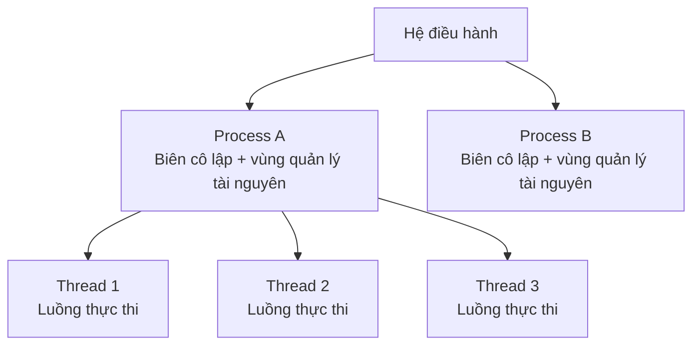
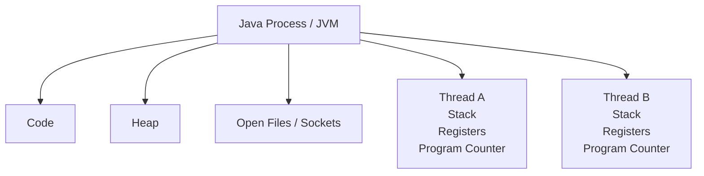
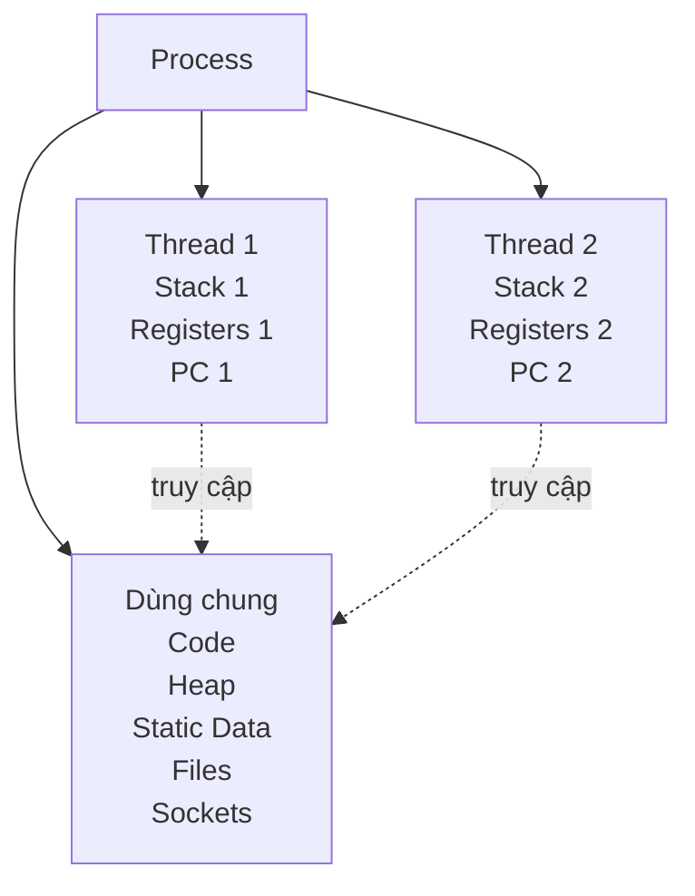
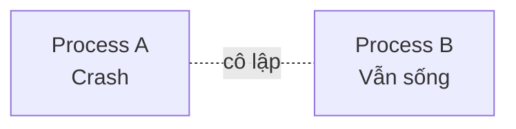
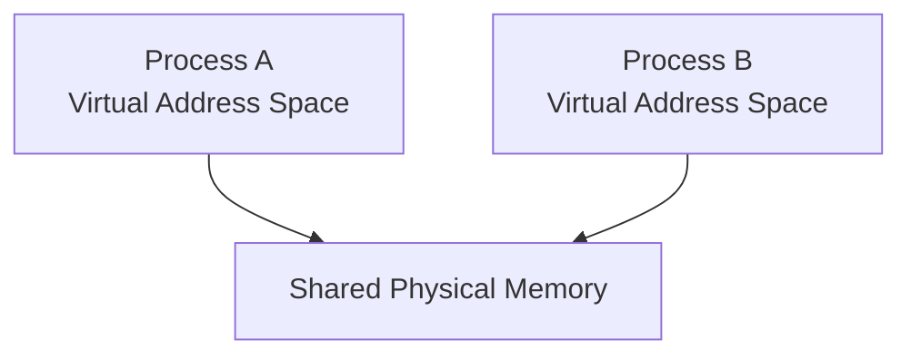
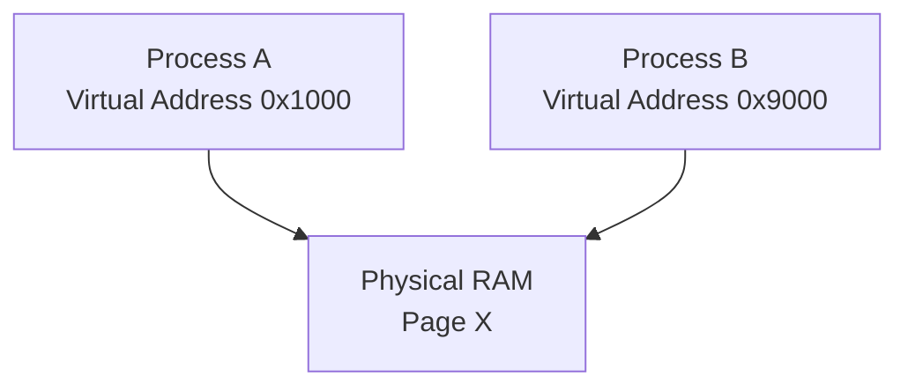
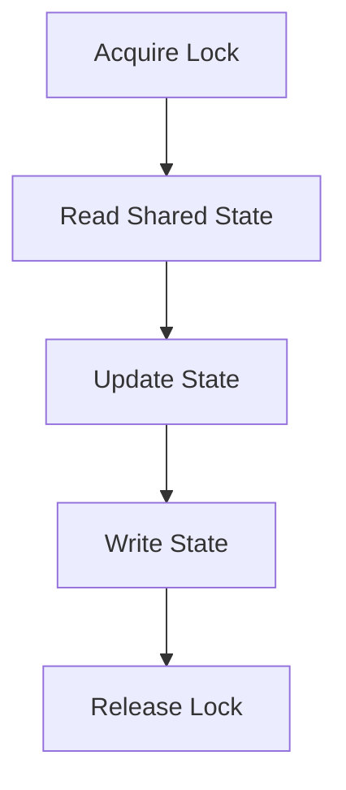
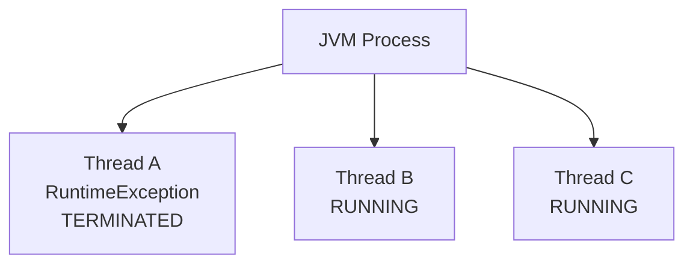
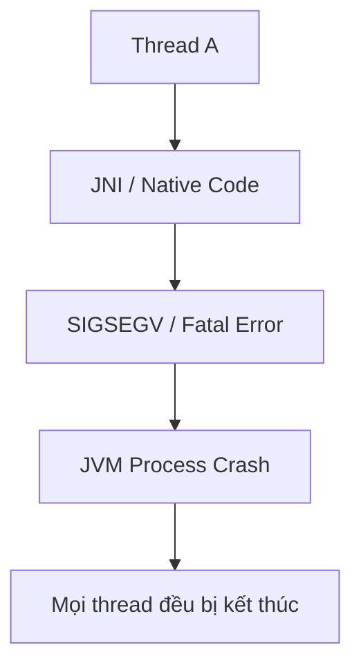
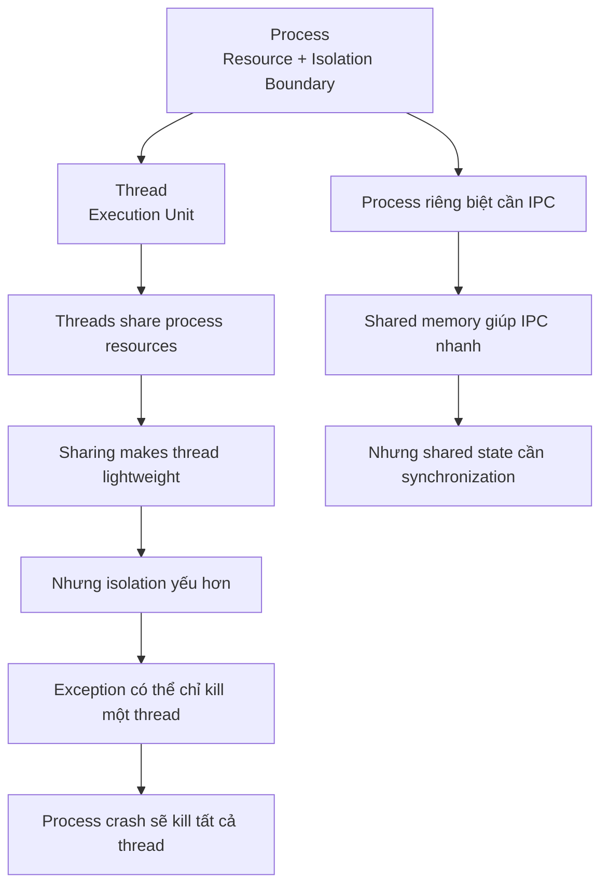

# 1.1 Process, Thread & Cô lập tài nguyên

## Mental model chung

Trước khi học từng câu, hãy giữ một mental model duy nhất:



Một câu rất quan trọng để nhớ:

> **Process chủ yếu là đơn vị quản lý tài nguyên và cô lập, còn thread chủ yếu là đơn vị thực thi.**

Từ câu này có thể suy ra gần như toàn bộ Q001 → Q006.

---

# Q001. Process và thread khác nhau như thế nào về vai trò, tài nguyên và trạng thái thực thi?

## Ý chính cần bật ra trong đầu

```text
Process
→ quản lý tài nguyên
→ biên cô lập
→ có virtual address space riêng

Thread
→ đơn vị thực thi
→ chạy bên trong process
→ dùng chung tài nguyên của process
→ có trạng thái thực thi riêng
```

## Cách trả lời

Process và thread khác nhau chủ yếu ở **vai trò**.

Process có thể xem là một **container quản lý tài nguyên đồng thời là một isolation boundary**.

Mỗi process thường có:

```text
Process
├── Virtual Address Space (shared giữa các thread)
│   ├── Code
│   ├── Data
│   ├── Heap
│   └── Memory-mapped regions
│
├── Thread 1
│   ├── Stack riêng
│   ├── Registers riêng
│   └── Program Counter riêng
│
├── Thread 2
│   ├── Stack riêng
│   ├── Registers riêng
│   └── Program Counter riêng
│
└── Kernel-managed resources
    ├── Open files
    └── Sockets
```

Trong khi đó, thread là một **luồng thực thi bên trong process**.

Một process có thể có nhiều thread cùng chạy bên trong cùng một address space.



Các thread dùng chung phần lớn tài nguyên của process, nhưng mỗi thread phải có trạng thái thực thi riêng, ví dụ:

```text
program counter
CPU registers
stack
stack pointer
thread-local storage
scheduling state
```

Lý do là vì tại một thời điểm:

```text
Thread A có thể đang chạy hàm foo()
Thread B có thể đang chạy hàm bar()
```

nên mỗi thread cần biết chính xác:

```text
đang thực thi instruction nào
đang gọi hàm nào
local variables là gì
CPU state hiện tại là gì
```

### Trade-off

Process cho khả năng cô lập tốt hơn.

Thread thì chia sẻ tài nguyên nhiều hơn nên giao tiếp nhanh và nhẹ hơn, nhưng cũng tạo ra:

```text
race condition
data corruption
memory visibility problem
deadlock
```

## Câu chốt

> Có thể hiểu đơn giản: process là biên quản lý tài nguyên và cô lập, còn thread là luồng thực thi bên trong process.

---

# Q002. Các thread trong cùng một process dùng chung những gì, và mỗi thread giữ riêng những gì?

## Cách tư duy

Đừng cố nhớ một danh sách dài.

Hãy chia thành hai nhóm:

```text
Tài nguyên thuộc process
vs
Trạng thái phục vụ riêng cho việc thực thi
```

---

## Những gì các thread dùng chung

Các thread trong cùng process thường chia sẻ:

```text
Virtual address space

Code segment

Heap

Global/static variables

Open files

Sockets

Các resource thuộc process
```

Trong Java, đặc biệt nhớ:

```text
Object trên heap
Static fields
```

có thể được nhiều thread truy cập.

---

## Những gì mỗi thread giữ riêng

Mỗi thread cần execution context riêng:

```text
Stack

Program Counter

CPU Registers

Stack Pointer

Thread-local storage

Scheduling state

Thread ID
```



---

## Vì sao stack phải riêng?

Ví dụ:

```java
void foo() {
    int x = 10;
    bar();
}
```

Thread A có thể đang có call stack:

```text
foo()
 └── bar()
```

Trong khi Thread B cũng đang chạy:

```text
foo()
```

nhưng ở trạng thái hoàn toàn khác.

Mỗi thread có:

```text
local variable riêng
stack frame riêng
return address riêng
call chain riêng
```

Nếu các thread dùng chung stack thì trạng thái thực thi của chúng sẽ ghi đè lên nhau.

---

## Trade-off

Việc dùng chung heap giúp communication rất rẻ:

```text
Thread A
   ↓
Shared Object
   ↑
Thread B
```

nhưng cũng tạo ra các vấn đề concurrency:

```text
race condition
atomicity
visibility
deadlock
```

## Câu chốt

> Các thread chia sẻ tài nguyên thuộc về process như address space, heap và file, nhưng mỗi thread giữ riêng execution context như stack, registers và program counter.

---

# Q003. Vì sao tạo thread thường ít tốn kém hơn tạo process, và phải đánh đổi điều gì về khả năng cô lập lỗi?

## Mental model

Hãy nghĩ như sau:

```text
Tạo process
→ tạo thêm một môi trường tài nguyên và cô lập

Tạo thread
→ tạo thêm một luồng thực thi bên trong môi trường đã có
```

## Cách trả lời

Tạo thread thường nhẹ hơn tạo process vì thread mới có thể tận dụng lại hầu hết tài nguyên của process hiện tại.

Ví dụ:

```text
address space
heap
code
open files
sockets
process resources
```

Thread mới chủ yếu cần thêm:

```text
stack
register state
program counter
scheduling metadata
```

Trong khi khi tạo process mới, OS cần thiết lập nhiều cấu trúc hơn:

```text
virtual address space
page-table structures
process metadata
resource tables
security/isolation context
```

Nhìn high-level:

```text
Create Process
      ↓
Tạo môi trường tài nguyên mới

Create Thread
      ↓
Tạo luồng thực thi mới
trong môi trường hiện tại
```

---

## Communication cũng rẻ hơn

Hai thread có thể trao đổi dữ liệu thông qua shared memory:

```text
Thread A
   ↓
Shared Heap
   ↑
Thread B
```

Trong khi hai process thường phải dùng IPC:

```text
Process A
   ↓
Pipe / Socket / Shared Memory
   ↓
Process B
```

---

# Trade-off lớn nhất: isolation

Thread nhẹ hơn chính vì nó **chia sẻ nhiều hơn**.

Nhưng chia sẻ nhiều đồng nghĩa khả năng cô lập yếu hơn.

Ví dụ Thread A làm hỏng shared state:

```text
Thread A
   ↓
corrupt shared object
   ↓
Thread B, C cũng bị ảnh hưởng
```

Hoặc một thread chạy native code gây crash nghiêm trọng thì toàn bộ process có thể chết.

Trong khi hai process tách biệt:



---

## Trade-off

```text
Thread

+ tạo nhanh hơn
+ communication rẻ hơn
+ ít memory hơn

- isolation kém hơn
- dễ có race condition
- lỗi nghiêm trọng có thể ảnh hưởng toàn process
```

```text
Process

+ isolation tốt
+ fault containment tốt
+ security boundary tốt hơn

- nặng hơn
- IPC phức tạp và tốn kém hơn
```

---

## Nuance tốt nếu interviewer hỏi sâu

Không nên nói:

> Tạo process lúc nào cũng cực kỳ đắt.

Trên Linux/Unix, `fork()` có thể dùng copy-on-write.

Tức là OS không copy toàn bộ memory ngay lập tức.

Nhưng về mặt kiến trúc, thread vẫn nhẹ hơn vì nó được thiết kế để chia sẻ process environment hiện tại.

## Câu chốt

> Thread nhẹ hơn vì reuse tài nguyên của process, nhưng cái giá phải trả là khả năng cô lập lỗi yếu hơn và phải xử lý synchronization khi có shared state.

---

# Q004. Hai process có thể giao tiếp bằng những cách nào; khi nào chọn shared memory thay vì pipe hoặc socket?

## Mental model

Trước tiên hãy suy ra:

```text
Process khác nhau
→ address space khác nhau
→ không thể đọc trực tiếp memory của nhau
→ cần IPC
```

IPC có thể chia thành hai nhóm lớn:

```text
Message passing
vs
Shared memory
```

---

## Các IPC phổ biến

Có thể kể:

```text
Pipe / Named Pipe

Socket

Shared Memory

Memory-mapped file

Message Queue

Signal
```

Nhưng trong interview, quan trọng hơn là phải nói được **khi nào dùng cái nào**.

---

# Pipe

Pipe phù hợp với giao tiếp stream đơn giản.


Ví dụ:

```bash
cat file.txt | grep "error"
```

Ưu điểm:

```text
đơn giản
OS quản lý buffer
phù hợp producer-consumer
```

Hạn chế:

```text
thường dùng trong cùng một máy
không linh hoạt bằng socket
dữ liệu phải đi qua buffer do kernel quản lý
```

---

# Socket

Socket linh hoạt hơn.


Socket có thể dùng:

```text
trên cùng một máy
hoặc
giữa hai máy khác nhau
```

Rất phù hợp với:

```text
client-server
microservices
distributed systems
```

---

# Shared Memory

Shared memory khác hẳn.

Thay vì:

```text
Process A
   ↓
kernel buffer
   ↓
Process B
```

hai process có thể cùng nhìn thấy một vùng RAM.



Process A ghi vào shared region, Process B có thể đọc trực tiếp.

Điều này giúp giảm việc copy data.

---

# Khi nào chọn shared memory?

Shared memory phù hợp khi:

```text
hai process cùng chạy trên một host

cần truyền lượng data lớn

cần throughput cao

cần latency thấp

copying data quá tốn kém
```

Ví dụ:

```text
video frames
large buffers
high-performance IPC
database systems
storage engines
```

---

## Nhưng trade-off rất quan trọng

Shared memory nhanh, nhưng phức tạp hơn.

OS có thể giúp hai process cùng nhìn thấy memory.

Nhưng OS không tự đảm bảo:

```text
ai được write trước
ai được read
operation có atomic hay không
data có bị race condition không
```

Do đó có thể cần:

```text
mutex
semaphore
atomic operation
futex
```

## Câu chốt

> Tôi sẽ ưu tiên pipe hoặc socket khi muốn giao tiếp đơn giản và rõ ràng. Tôi sẽ cân nhắc shared memory khi hai process chạy trên cùng host và yêu cầu throughput hoặc latency đủ cao để đáng đánh đổi bằng độ phức tạp synchronization.

---

# Q005. Hai process có thể cùng ánh xạ một vùng RAM vật lý không, và khi đó cần xử lý vấn đề đồng bộ nào?

## Câu trả lời đầu tiên

> Có.

Hai process vẫn có virtual address space riêng.

Nhưng OS có thể cấu hình để các virtual page của hai process map tới cùng một physical page.

Ví dụ:

```text
Process A
Virtual 0x1000
      ↓

Physical Page X

      ↑
Process B
Virtual 0x9000
```

Hai virtual address không cần giống nhau.



Có thể đạt được thông qua:

```text
shared memory
memory-mapped file
mmap
```

---

# Vấn đề bắt đầu khi cả hai cùng ghi

Ví dụ:

```text
counter = 5
```

Process A:

```text
counter++
```

Process B:

```text
counter++
```

Nếu increment không atomic:

```text
A đọc 5
B đọc 5

A ghi 6
B ghi 6
```

Kết quả cuối:

```text
6
```

thay vì:

```text
7
```

Đó chính là race condition.

---

# Ba vấn đề synchronization cần nghĩ đến

## 1. Atomicity

Một operation có thể bị xen kẽ không?

Ví dụ:

```text
read
modify
write
```

không nhất thiết là một atomic operation.

---

## 2. Visibility

Nếu Process A update memory:

> Khi nào Process B chắc chắn nhìn thấy giá trị mới?

CPU có:

```text
register
cache
store buffer
```

nên visibility không phải chuyện hiển nhiên.

---

## 3. Ordering

Compiler và CPU có thể reorder một số memory operations.

Synchronization primitive còn có nhiệm vụ tạo ra ordering guarantee phù hợp.

---

# Có thể dùng gì?

```text
process-shared mutex
semaphore
atomic instruction
futex
lock-free protocol
```

Ví dụ critical section:



---

# Một nuance tốt

Nếu vùng memory chỉ được nhiều process đọc:

```text
Process A → read
Process B → read
```

và data immutable thì thường không cần mutual exclusion.

Vấn đề chủ yếu xảy ra khi có:

```text
write-write concurrency
read-write concurrency
```

---

# Một nuance sâu hơn

Hai process có thể map cùng physical memory tại hai virtual address khác nhau.

Do đó trong shared-memory data structure, raw pointer có thể gây vấn đề.

Ví dụ:

```text
0x123456
```

có thể hợp lệ trong Process A nhưng không có ý nghĩa tương tự trong Process B.

Vì vậy một số shared-memory design lưu:

```text
offset
```

thay vì absolute pointer.

## Câu chốt

> Hai process có thể map virtual memory của mình tới cùng một physical memory region. Nhưng khi vùng đó writable, ta lại gặp các vấn đề concurrency giống thread như race condition, atomicity, visibility và ordering, nên phải có synchronization rõ ràng.

---

# Q006. Một ngoại lệ Java không được xử lý trong một thread khác gì lỗi native nghiêm trọng đối với phần còn lại của process?

Đây là câu kiểm tra rất rõ việc bạn hiểu:

```text
Thread-level failure
vs
Process-level failure
```

---

# Case 1 — Java exception không được xử lý

Ví dụ:

```java
Thread t = new Thread(() -> {
    throw new RuntimeException("boom");
});
```

Nếu exception không được catch, nó sẽ propagate lên đầu call stack của thread đó.

```text
Thread A

foo()
 ↓
bar()
 ↓
RuntimeException
 ↓
không có handler
 ↓
Thread A kết thúc
```

Thông thường:

> thread đó chết, nhưng JVM process không nhất thiết chết.



Các thread khác vẫn có thể chạy.

JVM cũng có cơ chế:

```text
UncaughtExceptionHandler
```

để xử lý uncaught exception ở mức thread.

---

# Case 2 — Native fatal error

Nếu Java gọi JNI hoặc native library và code native gây lỗi memory nghiêm trọng:

```text
invalid memory access
SIGSEGV
```

thì đây không còn chỉ là Java exception bình thường.



Tại sao?

Bởi vì tất cả các thread đều nằm bên trong cùng một process.

Nếu process bị OS terminate:

```text
Thread A
Thread B
Thread C
Thread D
```

đều biến mất.

---

# Vì sao NullPointerException khác?

Trong Java:

```java
object.doSomething();
```

khi:

```text
object == null
```

JVM tạo:

```text
NullPointerException
```

Đây là managed exception.

JVM vẫn kiểm soát được nó.

Trong C/C++:

```c
int *p = NULL;
*p = 10;
```

có thể gây invalid memory access.

Khi đó OS có thể tạo signal như:

```text
SIGSEGV
```

và process bị crash.

Mental model:

```text
Java-level invalid operation
        ↓
Managed Exception
        ↓
Thường chỉ ảnh hưởng thread đó
```

so với:

```text
Native invalid memory access
        ↓
Fatal OS/JVM error
        ↓
Có thể kill toàn bộ process
```

---

# Nuance quan trọng

Không nên nói tuyệt đối:

> Mọi Java exception chỉ làm chết một thread.

Một số lỗi như:

```text
OutOfMemoryError
StackOverflowError
InternalError
```

có thể cho thấy JVM hoặc application đang ở trạng thái rất nghiêm trọng.

Ví dụ `OutOfMemoryError` có thể làm nhiều phần khác của application không tiếp tục hoạt động bình thường.

Nhưng về bản chất:

> Một uncaught Java exception thông thường không mặc định làm OS terminate toàn bộ JVM process giống như fatal native crash.

---

# Câu trả lời ngắn có thể dùng khi phỏng vấn

> Một uncaught Java exception thông thường sẽ propagate lên đầu stack của thread và làm thread đó kết thúc, trong khi các thread khác của JVM vẫn có thể tiếp tục chạy. Nhưng một fatal native error, ví dụ invalid memory access trong JNI gây SIGSEGV, có thể làm crash toàn bộ JVM process. Khi process chết thì tất cả các thread bên trong nó đều bị terminate. Đây là khác biệt giữa thread-level failure và process-level failure.

---

# Liên kết toàn bộ Q001 → Q006

Không nên học sáu câu này độc lập.

Chúng thực chất là một chuỗi reasoning:



Nếu interviewer hỏi:

> Process và thread khác nhau như thế nào?

Trong đầu bạn không nên chỉ thấy:

```text
Process khác Thread.
```

Mà phải thấy cả chuỗi:

```text
Process
→ isolation/resource boundary

Thread
→ execution unit
→ share memory

Share memory
→ communication rẻ

Nhưng
→ synchronization
→ race condition
→ weak isolation
```

Đây mới là mental model hoàn chỉnh.

---

# Cheat sheet trước phỏng vấn

| Khái niệm               | Câu cần nhớ                                           |
| ----------------------- | ----------------------------------------------------- |
| Process                 | Đơn vị quản lý tài nguyên + biên cô lập               |
| Thread                  | Đơn vị thực thi trong process                         |
| Threads dùng chung      | Address space, code, heap, files, sockets             |
| Mỗi thread giữ riêng    | Stack, registers, PC, TLS, scheduling state           |
| Vì sao thread nhẹ hơn   | Reuse tài nguyên của process                          |
| Trade-off của thread    | Giao tiếp rẻ nhưng isolation kém                      |
| Process giao tiếp       | IPC                                                   |
| Shared memory           | IPC nhanh nhưng synchronization phức tạp              |
| Shared physical RAM     | Virtual pages khác nhau có thể map cùng physical page |
| Java uncaught exception | Thường làm chết thread gây lỗi                        |
| Fatal native crash      | Có thể làm chết toàn JVM process                      |

Nếu bị blank trong interview, chỉ cần quay lại hai câu:

> **Cái gì đang được chia sẻ, và cái gì đang được cô lập?**

và:

> **Việc chia sẻ này giúp mình được gì, và phải đánh đổi điều gì?**

Hai câu đó đủ để bạn tự suy ra gần như toàn bộ phần Process, Thread và Isolation.
