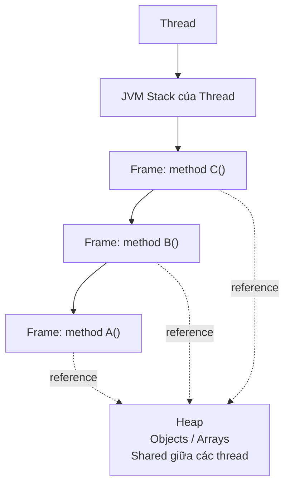
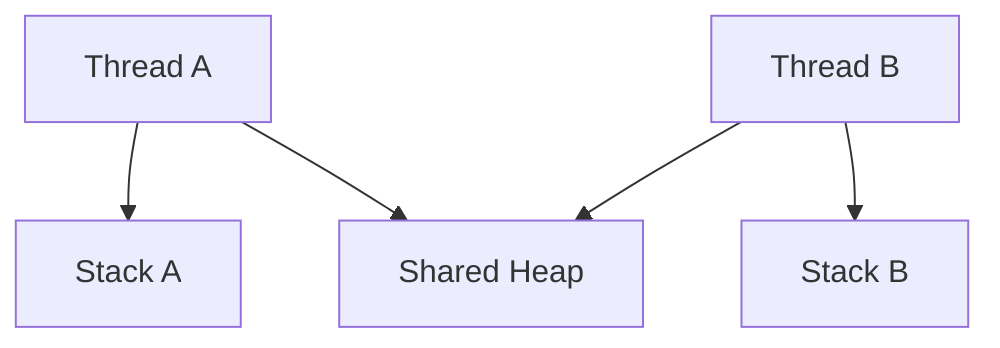
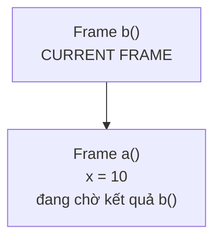
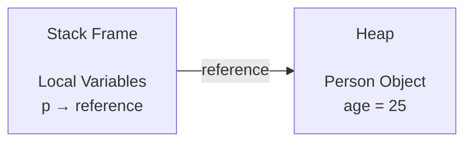
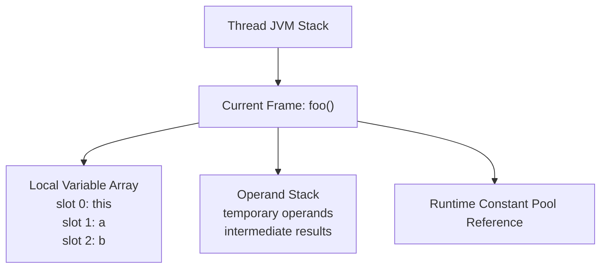
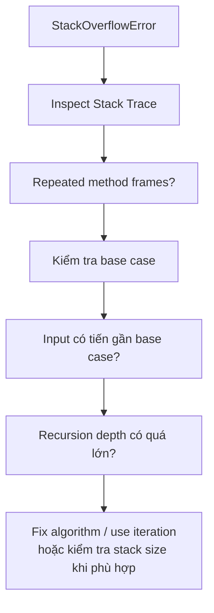
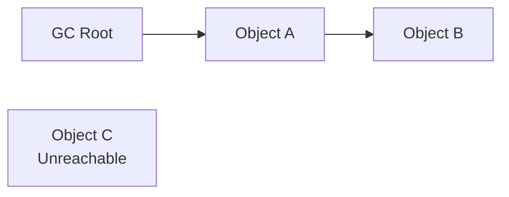
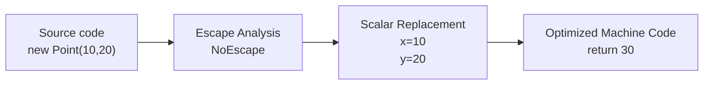
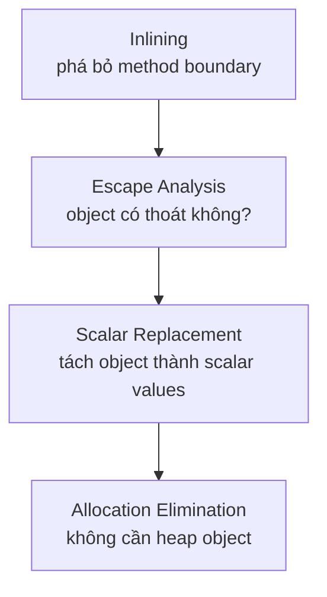
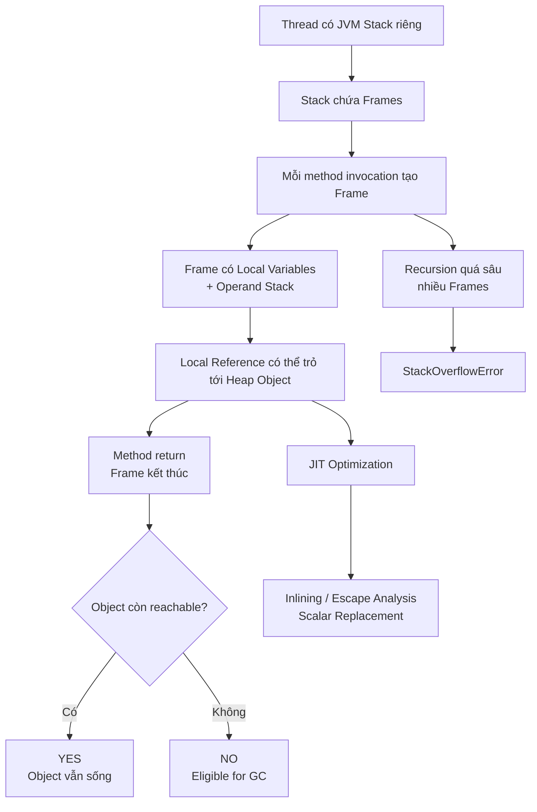

# 1.2 Stack, Heap & Stack Frame

## Mental model chung

Trước tiên hãy nhìn toàn bộ bức tranh:



Hãy nhớ ba cấp độ khác nhau:

```text
Thread
   ↓
Call Stack
   ↓
Stack Frames
   ↓
Local Variables + Operand Stack
```

Trong khi:

```text
Heap
   ↓
Objects / Arrays
```

Theo JVM Specification, mỗi thread có JVM stack riêng; stack chứa các frame. Heap thì được chia sẻ giữa các JVM thread và là vùng logic dùng để cấp phát class instances và arrays.

---

# Q007. [P0] Stack và heap khác nhau thế nào về mục đích, quyền truy cập và vòng đời dữ liệu?

## Mental model

Hãy chia câu hỏi thành đúng ba dimension:

```text
1. Purpose
2. Ownership / Access
3. Lifetime
```

---

## 1. Purpose — dùng để làm gì?

### Stack

Stack chủ yếu phục vụ **execution của một thread**.

Mỗi lần method được gọi:

```text
method call
   ↓
create frame
   ↓
put frame on thread's stack
```

Frame chứa các thông tin phục vụ execution như:

```text
local variables
operand stack
method execution state
dynamic-linking information
```

### Heap

Heap chủ yếu chứa:

```text
objects
arrays
```

Ví dụ:

```java
Person p = new Person();
```

Theo conceptual JVM model:

```text
p
↓
local variable trong frame

new Person()
↓
object trên heap
```

---

# 2. Ownership / quyền truy cập

Stack là **per-thread**.



Thread A không trực tiếp sử dụng stack frame của Thread B.

Heap thì được share giữa các JVM threads.

Nhưng cần nói chính xác:

> Heap được share không có nghĩa là mọi thread tự động truy cập được mọi object.

Thread phải có:

```text
reference tới object
```

mới có thể thao tác object đó.

Ví dụ:

```java
Person person = ...
```

Nếu reference `person` được chia sẻ cho nhiều thread thì object có thể trở thành shared mutable state.

Lúc đó có thể xuất hiện:

```text
race condition
visibility
atomicity
synchronization
```

---

# 3. Lifetime

### Stack frame

Frame gắn với một method invocation.

```text
call foo()
   ↓
create foo frame

foo() returns
   ↓
frame hoàn tất
```

JVM Specification mô tả một frame được tạo khi method được invoke và bị loại bỏ khi invocation kết thúc, dù kết thúc bình thường hay do exception.

### Heap object

Object không chết chỉ vì method tạo ra nó đã kết thúc.

Ví dụ:

```java
Person createPerson() {
    Person p = new Person();
    return p;
}
```

Khi `createPerson()` kết thúc:

```text
frame createPerson()
→ không còn
```

nhưng object vẫn được caller giữ reference:

```text
caller
  ↓
Person object
```

nên object vẫn sống.

Heap memory được GC quản lý; việc object không còn cần thiết không có nghĩa là nó lập tức được thu hồi.

---

## Trade-off dễ nhớ

```text
Stack

+ rất phù hợp với execution state
+ frame lifetime rõ ràng
+ thread-local

- giới hạn kích thước
- quá sâu → StackOverflowError
```

```text
Heap

+ object có thể tồn tại vượt quá một method call
+ có thể được chia sẻ

- cần GC
- shared mutable object gây concurrency complexity
```

## Câu trả lời phỏng vấn ngắn

> Stack chủ yếu lưu trạng thái thực thi của từng thread thông qua các stack frame, nên mỗi thread có stack riêng. Heap chủ yếu chứa object và array và được chia sẻ giữa các thread. Stack frame thường có vòng đời gắn với method invocation, còn object trên heap có thể sống lâu hơn method tạo ra nó nếu vẫn còn reachable. Vì heap có thể được chia sẻ nên shared mutable objects cũng tạo ra các vấn đề synchronization.

---

# Q008. [P1] Khi gọi một method, stack frame cần lưu những trạng thái nào để có thể tiếp tục thực thi và quay về caller?

## Mental model

Đừng học:

```text
frame = local variables
```

mà hãy nghĩ:

> Muốn tạm dừng caller, chạy callee, rồi quay lại caller thì cần giữ những gì?

---

## Ví dụ

```java
int a() {
    int x = 10;
    return b(x) + 1;
}
```

Khi `a()` gọi `b()`:



Caller `a()` chưa biến mất.

Frame của nó vẫn nằm bên dưới.

---

## Theo mô hình JVM, mỗi frame có ba thành phần đặc biệt quan trọng

```text
Local Variable Array

Operand Stack

Reference to Runtime Constant Pool
```

JVM Specification xác định mỗi frame có local variable array riêng, operand stack riêng và reference tới runtime constant pool của class chứa method hiện tại.

### Local Variable Array

Chứa:

```text
this
parameters
local variables
```

Ví dụ instance method:

```java
int sum(int a, int b)
```

có thể hình dung:

```text
slot 0 → this
slot 1 → a
slot 2 → b
slot 3 → local variable...
```

---

### Operand Stack

Dùng để chứa:

```text
intermediate values
operands
method arguments khi chuẩn bị invoke
return values
```

Ví dụ:

```java
int c = a + b;
```

conceptually bytecode làm kiểu:

```text
load a
load b

operand stack:
[a, b]

iadd

operand stack:
[a+b]

store c
```

---

### Dynamic-linking information

Frame có reference tới runtime constant pool để hỗ trợ resolve:

```text
method references
field references
class references
```

---

# Thế còn return address?

Đây là nuance quan trọng.

Không nên nói đơn giản:

> “Mỗi JVM frame luôn có một biến returnAddress.”

Theo JVM abstract model, khi callee return, JVM khôi phục caller frame, đặt returned value lên operand stack của caller nếu có, và tiếp tục tại instruction sau lệnh invoke. PC register thuộc về thread. Implementation thực tế có thể giữ thêm return metadata, saved machine registers hoặc các bookkeeping khác trong native/JIT frame.

Mental model:

```text
Caller Frame
    ↓ invoke
Callee Frame
    ↓ return
Caller Frame restored
    ↓
continue after invoke instruction
```

## Câu chốt

> Một JVM frame về mặt specification chủ yếu chứa local-variable array, operand stack và thông tin hỗ trợ dynamic linking. Caller frame vẫn nằm bên dưới trong call stack; khi callee kết thúc, frame của callee bị loại bỏ, return value được đưa về caller và execution tiếp tục tại caller.

---

# Q009. [P1] Nếu biến cục bộ b được khai báo sau a, method có cần pop b trước khi đọc a không; việc truy cập biến cục bộ thực sự diễn ra thế nào?

## Câu trả lời đầu tiên

> Không.

Đây là chỗ rất dễ nhầm giữa:

```text
call stack
```

và:

```text
local variables bên trong stack frame
```

---

## Ví dụ

```java
void foo() {
    int a = 10;
    int b = 20;

    System.out.println(a);
}
```

Không tồn tại logic:

```text
push a
push b

muốn đọc a
→ phải pop b
→ rồi mới lấy a
```

Sai.

---

# Local variables không phải một LIFO stack

Trong JVM frame có một:

```text
local variable array
```

Các local variable được truy cập bằng **index**. JVM Specification quy định local variables được address bằng index; index đầu tiên là `0`.

Có thể hình dung:

```text
Local Variable Array

index
  0 → this
  1 → a = 10
  2 → b = 20
```

Muốn đọc `a`:

```text
load slot 1
```

Không liên quan đến `b`.

---

## Bytecode ví dụ

Conceptually:

```text
bipush 10
istore_1

bipush 20
istore_2

iload_1
```

`iload_1` nghĩa là:

```text
load int từ local-variable slot 1
```

Không phải:

```text
pop cho đến khi gặp a
```

---

# Vậy LIFO nằm ở đâu?

Có hai nơi dễ gây nhầm.

### Call stack

```text
foo()
  calls bar()
     calls baz()
```

thì:

```text
baz frame
bar frame
foo frame
```

Đây là LIFO ở **frame level**.

### Operand stack

Bên trong mỗi frame lại có một stack khác:

```text
operand stack
```

được JVM bytecode sử dụng để tính toán.

Local Variable Array thì lại:

```text
indexed access
```

Không phải LIFO.

---

## Câu chốt cực dễ nhớ

> **Stack frame nằm trên stack, nhưng mọi thứ bên trong stack frame không phải đều hoạt động như stack.**

Đặc biệt:

```text
Call stack
→ LIFO frames

Operand stack
→ LIFO operands

Local variables
→ indexed slots
```

## Câu trả lời phỏng vấn ngắn

> Không. `a` và `b` không được push tuần tự lên call stack rồi phải pop ngược lại. Chúng nằm trong local-variable array của cùng một stack frame và được JVM bytecode truy cập bằng index. LIFO áp dụng cho các frame trong call stack và operand stack bên trong frame, chứ không áp dụng cho local variables.

---

# Q010. [P1] Một biến tham chiếu cục bộ, object mà nó trỏ tới và một primitive field trong object đó nằm ở những vùng nhớ nào theo mô hình JVM?

Ví dụ:

```java
void foo() {
    Person p = new Person();
    p.age = 25;
}
```

Giả sử:

```java
class Person {
    int age;
}
```

---

# Theo conceptual JVM model

Ta có:



### `p`

`p` là:

```text
local reference variable
```

nên conceptual model đặt giá trị reference trong:

```text
local-variable array
của current stack frame
```

---

### `new Person()`

Instance của `Person` được xem là object được cấp phát từ:

```text
heap
```

JVM Specification định nghĩa heap là vùng dùng để cấp phát class instances và arrays.

---

### `age`

`age` là:

```java
int age;
```

Đây là **instance field** của object.

Do đó conceptual model:

```text
Person object
└── age = 25
```

`age` nằm như một phần state của object.

Nói đơn giản:

```text
Stack Frame
└── p reference
       │
       ▼
Heap
└── Person object
       └── int age = 25
```

---

# Phân biệt với primitive local variable

Ví dụ:

```java
void foo() {
    int x = 25;
}
```

`x` là local primitive:

```text
frame
└── local variable slot
      └── 25
```

Trong khi:

```java
Person p = new Person();
p.age = 25;
```

thì:

```text
frame
└── p reference

heap object
└── age
```

---

## Nuance rất quan trọng

Đây là **JVM conceptual model**, không phải lời hứa về physical machine layout.

Sau JIT optimization:

```text
reference có thể nằm trong register
field có thể được giữ trong register
object allocation có thể bị loại bỏ hoàn toàn
```

Ta sẽ quay lại ở Q015.

## Câu chốt

> Theo mô hình JVM, local reference nằm trong local-variable area của stack frame, object được cấp phát trên heap, còn primitive instance field là một phần state của object đó. Nhưng đây là mô hình logic; JIT có thể tối ưu bố trí thực tế.

---

# Q011. [P2] Operand stack của JVM khác gì call stack của thread và mảng biến cục bộ trong một frame?

Đây là câu rất dễ nhầm vì cả hai đều có chữ `stack`.

Hãy chia thành **3 tầng hoàn toàn khác nhau**.

| Thành phần             | Thuộc về   | Chức năng                                    |
| ---------------------- | ---------- | -------------------------------------------- |
| Call stack / JVM stack | Một thread | Chứa các stack frame                         |
| Local-variable array   | Một frame  | Chứa parameters và local variables theo slot |
| Operand stack          | Một frame  | Chứa operands và intermediate results        |

JVM Specification xác nhận mỗi thread có JVM stack chứa frames, còn mỗi frame có local-variable array và operand stack riêng.

---

# 1. Call Stack

Ví dụ:

```java
main()
   → foo()
       → bar()
```

Call stack:

```text
TOP
────────
bar frame
────────
foo frame
────────
main frame
────────
```

Nó trả lời câu hỏi:

> Hiện tại chúng ta đang ở chuỗi method calls nào?

---

# 2. Local Variable Array

Bên trong `foo()` frame:

```text
slot 0 → this
slot 1 → a
slot 2 → b
slot 3 → result
```

Nó trả lời:

> Method này đang giữ những parameters/local values nào?

---

# 3. Operand Stack

Giả sử:

```java
int result = a + b * c;
```

JVM bytecode thực hiện các phép toán thông qua operand stack.

Simplified:

```text
load b

[b]

load c

[b, c]

imul

[b*c]

load a

[b*c, a]

iadd

[result]
```

JVM instructions có thể push operands lên operand stack, pop chúng để thực hiện phép toán rồi push kết quả trở lại.

---

# Mental picture hoàn chỉnh



## Câu chốt

> Call stack quản lý thứ tự các method invocation; local-variable array lưu variables bằng indexed slots; còn operand stack được JVM instructions dùng làm workspace cho phép tính và truyền/nhận giá trị. Call stack chứa frame, còn operand stack nằm bên trong từng frame.

---

# Q012. [P1] Vì sao cấu trúc stack phù hợp với lời gọi hàm lồng nhau, và vì sao thu hồi một frame đã hoàn tất thường đơn giản?

## Mental model

Hãy nhìn thứ tự call:

```text
A calls B
B calls C
```

Ai phải hoàn thành trước?

```text
C
↓
B
↓
A
```

Chính xác là:

```text
Last In
First Out
```

---

# Ví dụ

```java
a() {
    b();
}

b() {
    c();
}
```

Call stack:

```text
Step 1

A
```

sau đó:

```text
Step 2

B
A
```

sau đó:

```text
Step 3

C
B
A
```

Muốn A tiếp tục:

```text
C return
↓
B return
↓
A resume
```

Đây chính xác là behavior của stack.

---

# Vì sao frame cleanup đơn giản?

Khi `C()` hoàn thành:

```text
C frame
```

là frame trên cùng.

Ta không cần tìm nó ở giữa hàng nghìn frames.

Conceptually chỉ cần:

```text
discard current frame
↓
previous frame becomes current
```

JVM Specification mô tả chính xác flow này: khi method invoke một method khác, frame mới trở thành current frame; khi method return, current frame bị loại bỏ và previous frame trở thành current frame.

---

# Không cần free từng local variable

Ví dụ frame:

```text
foo frame

a
b
c
reference p
temporary values
```

Khi `foo()` kết thúc:

Không cần:

```text
free a
free b
free c
free p
```

từng cái một.

Conceptually toàn bộ frame kết thúc cùng invocation.

Đây là lý do stack rất phù hợp với:

```text
nested lifetime
```

---

## Nhưng object thì sao?

Nếu frame chứa:

```text
reference p
```

và frame biến mất:

```text
p reference trong frame
→ biến mất
```

nhưng object mà `p` từng trỏ tới:

```text
không nhất thiết biến mất
```

vì reference khác có thể vẫn giữ nó.

---

## Nuance tốt

Theo JVM Specification, implementation thậm chí không bắt buộc frame phải được đặt vật lý trên một vùng memory contiguous; specification nói JVM stack được thao tác logic bằng push/pop frame và frame về lý thuyết có thể được heap-allocated. Vì vậy “pop frame” là một **execution abstraction**, không nên biến nó thành khẳng định quá cứng về physical layout.

## Câu chốt

> Stack phù hợp với function calls vì lifetime của nested calls tự nhiên theo LIFO: method được gọi cuối cùng phải return đầu tiên. Vì frame hiện tại luôn ở top nên khi method kết thúc, JVM chỉ cần loại bỏ frame đó và khôi phục caller, thay vì quản lý từng local variable riêng lẻ.

---

# Q013. [P1] Điều gì gây StackOverflowError, và bạn sẽ phân tích một lỗi do đệ quy quá sâu như thế nào?

## Câu trả lời đầu tiên

`StackOverflowError` xảy ra khi computation của một thread cần nhiều JVM stack hơn giới hạn cho phép. Một nguyên nhân kinh điển là recursion quá sâu. JVM API cũng mô tả `StackOverflowError` là lỗi xảy ra khi application recurse quá sâu.

---

# Ví dụ rõ nhất

```java
void foo() {
    foo();
}
```

Execution:

```text
foo frame
↓
foo frame
↓
foo frame
↓
foo frame
↓
...
```

Stack không bao giờ unwind.

Cuối cùng:

```text
available stack exhausted
↓
StackOverflowError
```

---

# Nhưng không nhất thiết phải infinite recursion

Ví dụ Fibonacci hoặc DFS:

```java
dfs(node) {
    ...
    dfs(child);
}
```

Nếu tree depth cực lớn:

```text
depth = 1,000,000
```

thì mặc dù recursion có base case, stack vẫn có thể overflow.

Do đó:

```text
StackOverflow
≠ chỉ infinite recursion
```

mà chính xác hơn:

```text
call depth × frame requirement
>
available thread stack
```

---

# Khi debug, tôi sẽ phân tích theo flow



---

## 1. Xem stack trace

Nếu thấy:

```text
at Tree.dfs(Tree.java:42)
at Tree.dfs(Tree.java:42)
at Tree.dfs(Tree.java:42)
at Tree.dfs(Tree.java:42)
...
```

thì recursion là nghi phạm rõ ràng.

---

## 2. Kiểm tra base case

Ví dụ lỗi:

```java
int factorial(int n) {
    return n * factorial(n - 1);
}
```

thiếu:

```java
if (n == 0) return 1;
```

---

## 3. Kiểm tra input có thực sự tiến gần base case không

Đây là lỗi tinh vi hơn.

```java
foo(n) {
    if (n == 0) return;

    foo(n + 1);
}
```

Có base case.

Nhưng:

```text
n
→ n+1
→ n+2
```

đang chạy **ra xa** base case.

---

## 4. Kiểm tra recursion depth hợp lệ nhưng quá lớn

Ví dụ linked list:

```text
1 → 2 → 3 → ... → 1,000,000
```

Recursive traversal về logic đúng nhưng không phù hợp.

Có thể chuyển thành:

```text
iteration
```

hoặc explicit stack:

```java
Deque<Node> stack = new ArrayDeque<>();
```

---

# Có nên tăng `-Xss` không?

Có thể là một option trong một số trường hợp.

Nhưng không nên xem đây là fix đầu tiên.

Nếu bug là:

```text
infinite recursion
```

thì tăng stack chỉ giúp:

```text
crash muộn hơn
```

Không sửa root cause.

Mental order:

```text
1. Correctness
2. Algorithm / recursion depth
3. Sau đó mới cân nhắc stack sizing
```

---

## Câu chốt

> `StackOverflowError` xảy ra khi một thread cần nhiều stack hơn giới hạn, thường do recursion vô hạn hoặc recursion depth quá lớn. Tôi sẽ bắt đầu từ stack trace, tìm repeated frames, kiểm tra base case và xem input có thực sự tiến về base case hay không. Nếu thuật toán đúng nhưng depth quá lớn, tôi sẽ cân nhắc chuyển sang iteration hoặc explicit data structure trước khi chỉ tăng stack size.

---

# Q014. [P1] Khi method kết thúc, có thể kết luận object mà biến cục bộ từng tham chiếu đã được thu hồi chưa?

## Câu trả lời

> Không.

Đây là distinction cực kỳ quan trọng:

```text
reference lifetime
≠
object lifetime
```

---

# Ví dụ 1 — Object vẫn sống

```java
Person create() {
    Person p = new Person();
    return p;
}

Person x = create();
```

Trong `create()`:

```text
frame
└── p
      ↓
   Person
```

Khi `create()` return:

```text
create frame
→ gone
```

nhưng return value được caller giữ:

```text
caller frame
└── x
      ↓
   Person
```

Object vẫn reachable.

---

# Ví dụ 2 — Reference được lưu vào field

```java
class Service {
    Person person;

    void create() {
        Person p = new Person();
        this.person = p;
    }
}
```

Sau khi `create()` kết thúc:

```text
local p
→ gone
```

nhưng:

```text
Service.person
       ↓
Person object
```

vẫn tồn tại.

---

# Khi nào object mới eligible for GC?

High-level rule:

> Khi object không còn reachable từ các GC roots thông qua chuỗi reference phù hợp.

Mental model:



`A` và `B` reachable.

`C` không còn reachable:

```text
eligible for garbage collection
```

Nhưng:

```text
eligible for GC
≠
GC ngay lập tức thu hồi
```

GC quyết định thời điểm thực tế.

JVM Specification chỉ yêu cầu heap storage được quản lý bởi automatic storage management system; implementation được tự do lựa chọn GC strategy.

---

# Một case dễ gây nhầm

```java
void foo() {
    Person p = new Person();
}
```

Sau `foo()`:

Nếu không có reference nào khác tới object:

```text
Person object
→ có thể trở thành unreachable
→ eligible for GC
```

Nhưng không được nói:

> Method return → object bị delete.

Java không hoạt động như:

```cpp
delete p;
```

---

## Câu chốt

> Khi method kết thúc, ta chỉ biết local reference trong frame đó không còn tồn tại theo mô hình execution. Object mà nó từng trỏ tới có thể vẫn reachable qua một reference khác. Chỉ khi object không còn reachable thì nó mới trở thành candidate cho garbage collection, và việc reclaim không nhất thiết xảy ra ngay lập tức.

---

# Q015. [P3] Inlining, escape analysis và scalar replacement có thể làm bố trí bộ nhớ thực tế khác mô hình nhìn từ mã Java như thế nào?

Đây là câu P3, không cần thuộc quá sâu nếu thời gian ít.

Nhưng nếu interviewer hỏi được câu này thì họ đang kiểm tra một distinction rất quan trọng:

> **Java/JVM semantic model không nhất thiết giống physical runtime representation.**

JVM Specification cũng nói rõ nó mô tả abstract machine và không bắt implementation phải dùng một memory layout cụ thể hay một optimization strategy cụ thể.

---

# Bắt đầu từ code

```java
int calculate() {
    Point p = new Point(10, 20);
    return p.x + p.y;
}
```

Mental model đơn giản:

```text
calculate frame

p reference
   │
   ▼

Heap
Point object
├── x = 10
└── y = 20
```

Đây là model tốt để reasoning.

Nhưng JIT có thể nhìn vào code và nói:

> Object này chẳng hề thoát ra ngoài method.

Từ đây nhiều optimization có thể xảy ra.

---

# 1. Method Inlining

Giả sử:

```java
int calculate() {
    return add(10, 20);
}

int add(int a, int b) {
    return a + b;
}
```

Source-level mental model:

```text
calculate frame
     ↓
add frame
     ↓
return
```

JIT có thể inline `add()`:

```java
int calculate() {
    return 10 + 20;
}
```

Generated machine code không nhất thiết cần một physical `add()` call/frame giống source-level view.

```text
Before optimization

calculate()
   ↓ call
add()
   ↓
return
```

có thể trở thành:

```text
Optimized

calculate:
    result = 30
```

Inlining cũng tạo cơ hội cho những optimization khác vì compiler giờ nhìn thấy code xuyên qua method boundary.

Oracle documentation mô tả JIT có inlining optimization và các compiler có thể kết hợp inlining với escape analysis.

---

# 2. Escape Analysis

Giả sử:

```java
int calculate() {
    Point p = new Point(10, 20);

    return p.x + p.y;
}
```

JIT hỏi:

```text
Reference p có escape khỏi method không?

Object có được:
→ return?
→ lưu vào static field?
→ lưu vào một escaped object?
→ truyền sang nơi compiler không chứng minh được?
```

Nếu xác định:

```text
NoEscape
```

compiler biết object không cần tồn tại theo cách general heap object để code giữ đúng semantics.

Escape analysis chính là phân tích phạm vi sử dụng của object để xác định object có escape hay không.

---

# 3. Scalar Replacement

Đây mới là phần thú vị.

Source code:

```java
Point p = new Point(10, 20);

return p.x + p.y;
```

Ta tưởng runtime phải có:

```text
Heap

Point object
├── x = 10
└── y = 20
```

Nhưng compiler có thể scalar-replace object.

Thay vì:

```text
p → Point(x=10,y=20)
```

compiler xem:

```text
x = 10
y = 20
```

như hai scalar values riêng.

Cuối cùng:

```text
10 + 20
→ 30
```

Có thể không cần tạo `Point` object trên heap chút nào.



Oracle mô tả HotSpot Server Compiler có thể loại bỏ allocation của scalar-replaceable objects.

---

# Có phải object được chuyển từ heap lên stack không?

Đây là một câu bẫy rất tốt.

Không nên trả lời:

> Escape analysis làm object được allocate trên stack.

Ít nhất với HotSpot C2, tài liệu Oracle nói rõ optimization thường là:

```text
eliminate allocation
through scalar replacement
```

chứ không đơn giản là:

```text
heap allocation
→ stack allocation
```

Oracle ghi rõ HotSpot Server Compiler **không thay heap allocation bằng stack allocation cho các object NoEscape**, mà có thể loại bỏ allocation thông qua scalar replacement.

Đây là distinction rất tốt nếu interviewer hỏi sâu.

---

# Thực tế scalar values nằm đâu?

Sau optimization, các giá trị:

```text
x
y
```

có thể được giữ trong:

```text
CPU register
machine stack location
compiler temporary
```

hoặc thậm chí constant-folded đi hoàn toàn.

Ví dụ:

```java
return 10 + 20;
```

có thể trở thành machine code tương đương:

```text
return 30
```

Không còn:

```text
Point
p
x field
y field
```

theo nghĩa physical allocation ban đầu.

---

# Ba optimization liên hệ với nhau thế nào?



Inlining thường rất quan trọng vì nó giúp compiler nhìn thấy nhiều code hơn, từ đó escape analysis và scalar replacement có nhiều cơ hội tối ưu hơn. OpenJDK cũng ghi nhận scalar replacement phụ thuộc mạnh vào những quyết định inlining trong nhiều trường hợp.

---

# Vậy khi phỏng vấn nên nói thế nào?

Không nên nói:

> Local variables chắc chắn nằm vật lý trên stack và objects chắc chắn nằm vật lý trên heap.

Câu an toàn hơn:

> Theo JVM conceptual model, local execution state nằm trong frame và objects được cấp phát từ heap. Nhưng implementation và JIT có quyền tối ưu. Một local value có thể nằm trong CPU register, method call có thể bị inline, và một object không escape có thể bị scalar replacement để allocation biến mất hoàn toàn.

---

## Câu chốt

> Stack/heap model rất hữu ích để reasoning về Java semantics, lifetime và sharing, nhưng không phải một cam kết về physical memory layout. JIT có thể inline method, dùng escape analysis để chứng minh object không escape và scalar replacement để loại bỏ object allocation, vì vậy runtime machine code có thể khác đáng kể so với cấu trúc nhìn thấy trong source code.

---

# Kết nối Q007 → Q015 thành một chuỗi reasoning

Không nên học 9 câu này riêng lẻ.

Chúng thực chất nối với nhau như sau:



---

# Cheat sheet học nhanh

| Câu       | Ý bật ra đầu tiên                                                    |
| --------- | -------------------------------------------------------------------- |
| Q007 [P0] | Stack = per-thread execution state; Heap = shared objects            |
| Q008 [P1] | Frame = local variables + operand stack + linking/execution metadata |
| Q009 [P1] | Local variable array dùng index, không phải LIFO                     |
| Q010 [P1] | local reference → frame; object → heap; instance field → object      |
| Q011 [P2] | Call stack chứa frames; frame chứa local array + operand stack       |
| Q012 [P1] | Nested calls tự nhiên theo LIFO                                      |
| Q013 [P1] | Too many active frames → StackOverflowError                          |
| Q014 [P1] | Method chết ≠ object chết                                            |
| Q015 [P3] | JVM model ≠ physical JIT layout                                      |

---

# Hai câu cứu bạn khi bị blank

Nếu interviewer hỏi một câu liên quan memory mà bạn mất phương hướng, hãy tự hỏi:

> **Đây là state của execution hay state của object?**

Nếu là execution:

```text
thread
→ call stack
→ frame
```

Nếu là object/data có thể sống qua nhiều calls:

```text
heap
→ reachability
→ GC
```

Sau đó hỏi tiếp:

> **Tôi đang nói về conceptual JVM model hay physical implementation sau JIT?**

Chỉ hai distinction này giúp bạn tránh phần lớn lỗi phổ biến trong nhóm Stack / Heap / Frame.
