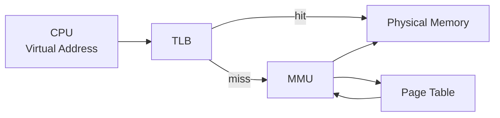
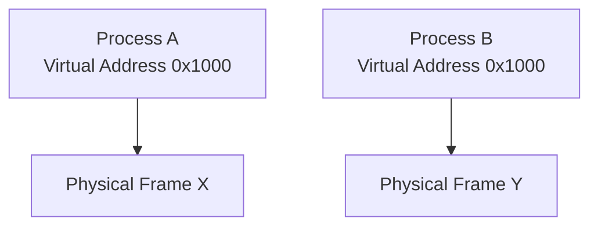
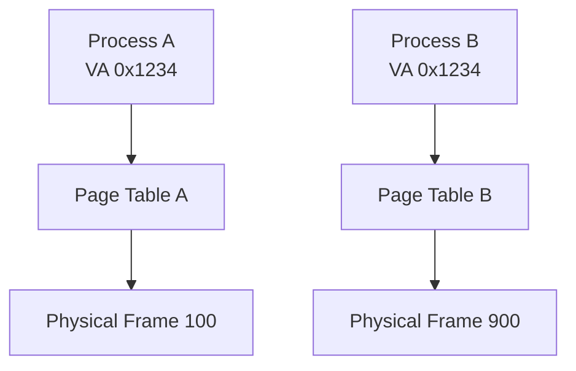
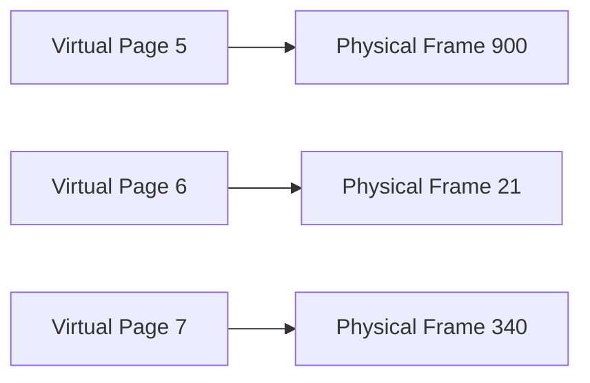
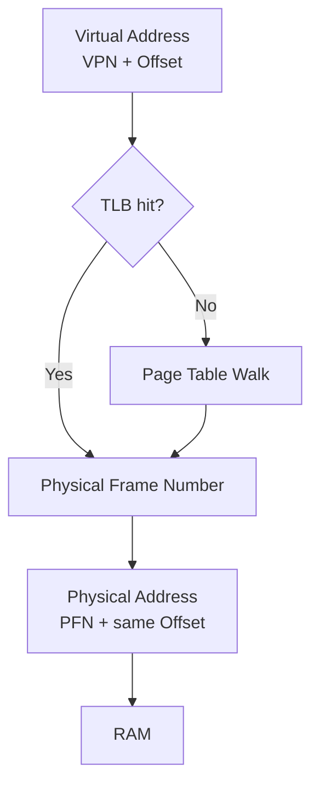
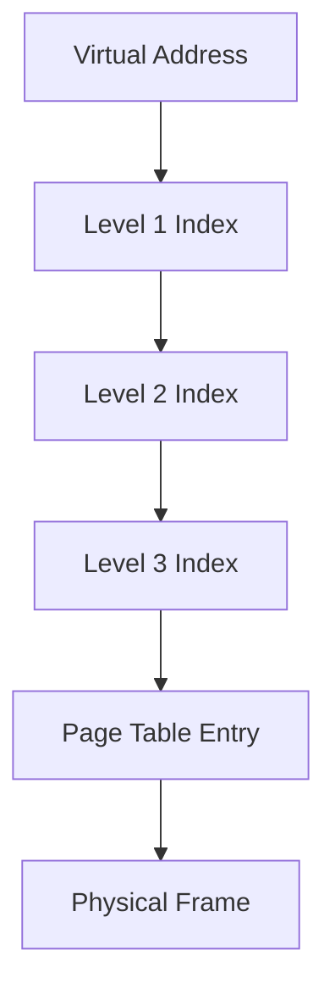
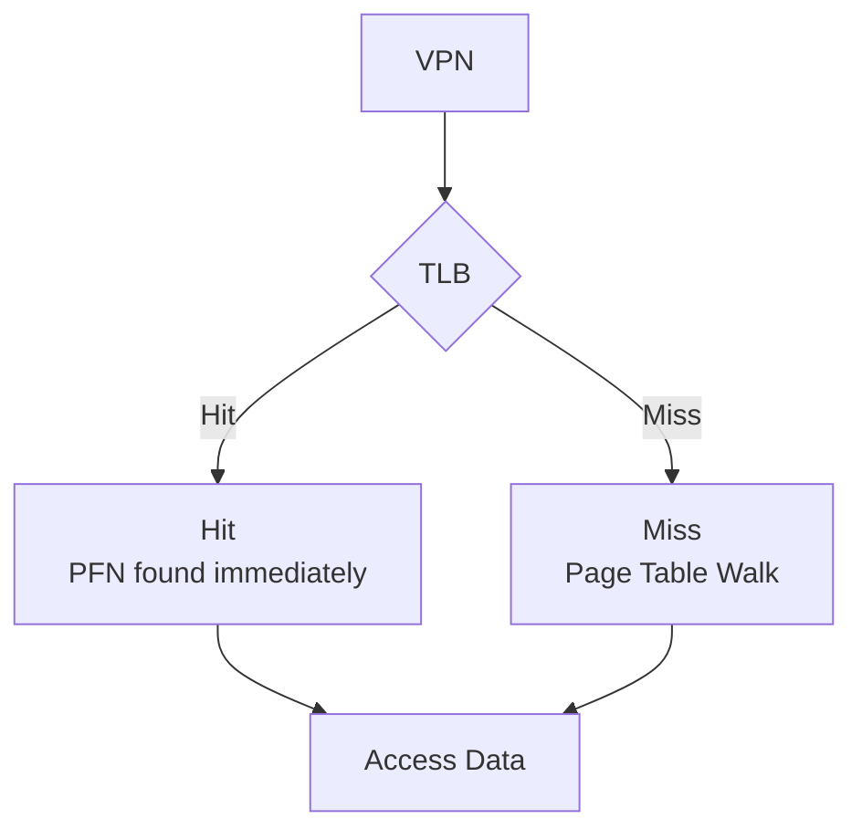
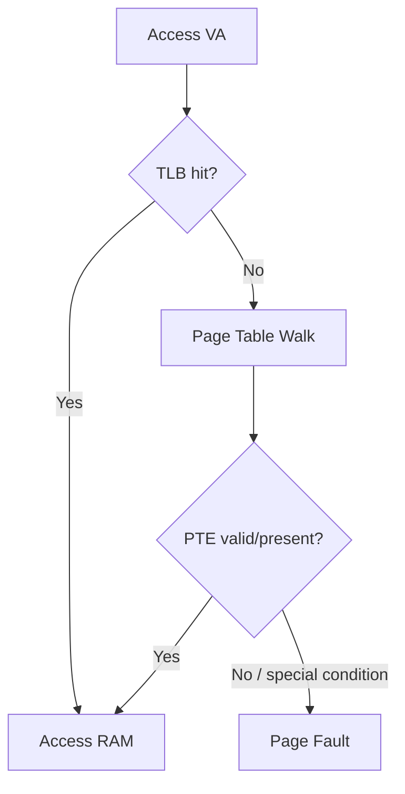
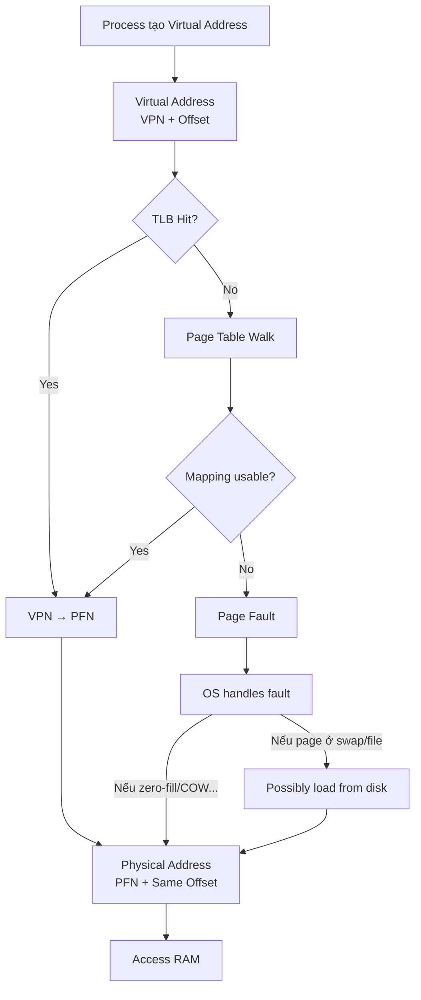

# 1.3 Bộ nhớ ảo, phân trang & Dịch địa chỉ

## Mental model chung

Hãy bắt đầu từ một nguyên tắc:

> **CPU tạo ra virtual address, còn RAM được truy cập bằng physical address.**

Giữa hai thứ đó có:



Mental model quan trọng nhất:

```text
Virtual Address
=
Virtual Page Number
+
Offset

↓

Page Table / TLB translation

↓

Physical Address
=
Physical Frame Number
+
SAME Offset
```

Toàn bộ Q016 → Q023 gần như xoay quanh flow này.

---

# Q016. [P0] Bộ nhớ ảo giải quyết vấn đề gì ngay cả khi máy vẫn còn nhiều RAM trống?

## Ý bật ra đầu tiên

Đừng trả lời:

> Virtual memory dùng khi RAM hết để swap ra disk.

Đó chỉ là **một use case**, không phải lý do chính duy nhất.

Virtual memory còn giải quyết:

```text
Isolation
Protection
Address-space abstraction
Relocation
Efficient memory management
Sharing
Demand paging
```

---

# Cách trả lời

Virtual memory tạo cho mỗi process một **không gian địa chỉ ảo riêng**, độc lập với cách dữ liệu thực sự nằm trong RAM.

Ngay cả khi máy còn rất nhiều RAM, điều này vẫn cực kỳ quan trọng.

Ví dụ:



Hai process đều có thể dùng địa chỉ:

```text
0x1000
```

nhưng nó có thể trỏ đến hai vùng RAM hoàn toàn khác nhau.

---

# 1. Isolation

Process A không thể tùy ý đọc memory của Process B.

Ví dụ:

```text
Process A
0x1000
↓
Frame 20
```

trong khi:

```text
Process B
0x1000
↓
Frame 900
```

Điều này tạo một isolation boundary mạnh.

---

# 2. Protection

Page table có thể chứa permission như:

```text
read
write
execute
user/kernel
```

Ví dụ code page có thể:

```text
read + execute
but not write
```

Điều này giúp ngăn nhiều loại memory corruption hoặc security problem.

---

# 3. Process không cần biết RAM vật lý nằm ở đâu

Program có thể nghĩ rằng nó có:

```text
0x0000
...
0x7FFF....
```

một address space tương đối liên tục.

Trong khi RAM thực tế có thể phân tán:

```text
Frame 100
Frame 502
Frame 21
Frame 900
```

OS và MMU xử lý mapping.

---

# 4. Cho phép sharing có kiểm soát

Ví dụ hai process có thể cùng map:

```text
shared library
shared memory
memory-mapped file
```

tới cùng physical pages.

---

# 5. Demand allocation

Một process có thể có address space lớn nhưng chưa cần physical RAM cho tất cả pages ngay lập tức.

Ví dụ:

```text
Process virtual address space: 10 GB

Physical RAM actually used:
2 GB
```

Physical pages chỉ được cấp khi thật sự cần.

---

## Câu chốt

> Virtual memory không chỉ dùng khi thiếu RAM. Vai trò quan trọng hơn là tạo abstraction và isolation: mỗi process có address space riêng, được bảo vệ bằng permission, không phụ thuộc trực tiếp vào vị trí vật lý của RAM, đồng thời cho phép OS quản lý, chia sẻ và cấp phát memory linh hoạt hơn.

---

# Q017. [P1] Vì sao cùng một địa chỉ ảo có thể chỉ đến dữ liệu khác nhau trong hai process?

## Mental model

Câu trả lời nằm ở:

```text
Different process
→ different page tables
```

---

## Ví dụ

Process A:

```text
Virtual Address
0x1234
↓
Page Table A
↓
Physical Frame 100
```

Process B:

```text
Virtual Address
0x1234
↓
Page Table B
↓
Physical Frame 900
```

Do đó:

```text
same virtual address
≠
same physical address
```

---

## Sơ đồ



---

# Tại sao OS làm được?

Mỗi process có một page-table hierarchy riêng.

Khi scheduler chuyển:

```text
Process A
→ Process B
```

CPU/MMU phải biết rằng translation context hiện tại cũng đã thay đổi.

Trên kiến trúc như x86, OS thường chuyển page-table root tương ứng với process đang chạy.

Do đó:

```text
Virtual Address
```

không có ý nghĩa tuyệt đối.

Nó phải được hiểu cùng với:

```text
current process/address space
```

---

# Một implication rất quan trọng

Trong Process A:

```text
pointer = 0x1234
```

không thể đơn giản gửi con số `0x1234` sang Process B rồi kỳ vọng nó trỏ tới cùng object.

Vì Process B có mapping khác.

Đây cũng là lý do IPC không đơn giản là:

```text
send raw pointer
```

---

# Ngoại lệ có chủ ý: shared memory

OS hoàn toàn có thể thiết lập:

```text
Process A VA 0x1000
        ↓
Physical Frame X
        ↑
Process B VA 0x9000
```

Tức là:

```text
different virtual addresses
→ same physical memory
```

hoặc thậm chí cùng VA nếu mapping được thiết lập như vậy.

---

## Câu chốt

> Cùng một virtual address có thể chỉ tới dữ liệu khác nhau vì mỗi process thường có page table riêng. Virtual address chỉ có ý nghĩa trong context của một address space; MMU dùng page table của process hiện tại để map virtual page sang physical frame.

---

# Q018. [P1] Virtual page và physical frame khác nhau thế nào; MMU và page table tham gia dịch địa chỉ ra sao?

## Mental model

Hai khái niệm:

```text
Virtual address space
→ chia thành pages

Physical RAM
→ chia thành frames
```

Thông thường:

```text
page size = frame size
```

Ví dụ:

```text
4 KiB page
↔
4 KiB frame
```

---

# Virtual Page

Virtual page là một block trong:

```text
virtual address space
```

Ví dụ:

```text
Virtual Page 0
Virtual Page 1
Virtual Page 2
...
```

---

# Physical Frame

Physical frame là block trong:

```text
physical RAM
```

Ví dụ:

```text
Frame 0
Frame 1
Frame 2
...
```

---

# Mapping

OS có thể thiết lập:

```text
Virtual Page 5
→ Physical Frame 900
```

và:

```text
Virtual Page 6
→ Physical Frame 21
```

Hai virtual pages liên tiếp không cần nằm ở physical frames liên tiếp.



Đây là một lợi ích rất lớn:

> Process nhìn thấy memory có vẻ liên tục dù RAM vật lý có thể phân tán.

---

# Dịch địa chỉ

Một virtual address được chia thành:

```text
Virtual Page Number | Offset
```

Ví dụ với page 4 KiB:

```text
VA
┌───────────────┬────────────┐
│ Virtual Page  │ 12-bit off │
└───────────────┴────────────┘
```

MMU lấy:

```text
Virtual Page Number
```

và tìm mapping:

```text
VPN → PFN
```

từ:

```text
TLB
hoặc
Page Table
```

Sau đó:

```text
Physical Address
=
Physical Frame Number
+
same offset
```

---

# Flow đầy đủ



---

## Page Table chứa gì?

Một Page Table Entry thường chứa hoặc biểu diễn các thông tin như:

```text
Physical Frame Number

Present / valid bit

Read/write permission

User/kernel permission

Accessed information

Dirty information

Execution permission
```

Chi tiết cụ thể phụ thuộc kiến trúc CPU.

---

## MMU là gì?

MMU — Memory Management Unit — là hardware hỗ trợ translation.

Mental model:

```text
CPU tạo virtual address

MMU:
"Virtual page này nằm ở physical frame nào?"

↓
TLB / Page Table

↓
Physical address
```

## Câu chốt

> Virtual page là đơn vị trong virtual address space, còn physical frame là đơn vị tương ứng trong RAM. MMU dịch virtual page number sang physical frame number dựa trên TLB hoặc page table, trong khi offset bên trong page được giữ nguyên.

---

# Q019. [P2] Với page 4 KiB và địa chỉ ảo 0x12345, bạn xác định page number và offset thế nào; phần nào thay đổi khi dịch địa chỉ?

Đây là câu tính rất đáng học.

---

# Bước 1 — Page size

```text
4 KiB
=
4096 bytes
=
2^12 bytes
=
0x1000
```

Do page size là:

```text
2^12
```

nên:

```text
12 bit cuối
=
offset
```

---

# Bước 2 — Virtual Address

Cho:

```text
VA = 0x12345
```

Tách:

```text
0x12 | 345
```

Vì mỗi page có kích thước:

```text
0x1000
```

nên:

```text
Virtual Page Number
=
0x12345 / 0x1000
=
0x12
```

và:

```text
Offset
=
0x12345 % 0x1000
=
0x345
```

---

# Kết quả

```text
VA = 0x12345

VPN    = 0x12
Offset = 0x345
```

---

# Giả sử page table cho biết

```text
VPN 0x12
→
PFN 0xABC
```

Physical address sẽ là:

```text
PFN    = 0xABC
Offset = 0x345
```

nên:

```text
Physical Address
=
0xABC345
```

---

# Điều gì thay đổi?

Translation:

```text
Virtual Page Number
↓
Physical Frame Number
```

Nhưng:

```text
Offset
```

**không thay đổi.**

Đây là điều quan trọng nhất.


---

## Công thức tổng quát

Với page size:

```text
P
```

thì:

```text
VPN = floor(VA / P)

Offset = VA mod P
```

Physical:

```text
PA = PFN × P + Offset
```

Nếu page size là power of two thì hardware có thể dùng bit operations rất hiệu quả.

---

## Câu trả lời phỏng vấn ngắn

> 4 KiB bằng 2^12, nên 12 bit cuối của virtual address là offset. Với `0x12345`, offset là `0x345`, còn virtual page number là `0x12`. Khi translation, VPN được thay bằng physical frame number lấy từ page table hoặc TLB, còn offset `0x345` giữ nguyên.

---

# Q020. [P2] Vì sao dùng page table nhiều cấp, và cách này đánh đổi gì về bộ nhớ và chi phí tra cứu?

## Problem trước tiên

Giả sử có:

```text
64-bit virtual address space
```

Nếu tạo một giant flat page table chứa entry cho toàn bộ virtual pages:

```text
số lượng entry
→ cực kỳ lớn
```

Trong khi process thực tế có thể chỉ dùng:

```text
code
heap
stack
libraries
```

một phần rất nhỏ address space.

Tức là:

```text
Flat page table
→ waste huge amount of memory
```

---

# Ý tưởng của Multi-Level Page Table

Thay vì:

```text
một giant array
```

ta chia lookup thành nhiều cấp.

Ví dụ đơn giản:



Nếu một vùng virtual address space không được sử dụng:

```text
không cần allocate lower-level table
```

---

# Ví dụ

Process dùng:

```text
0x0000...1000

và

0x7fff...0000
```

nhưng khoảng giữa gần như trống.

Multi-level page table chỉ cần tạo cấu trúc cho những vùng cần mapping.

---

# Benefit

```text
Memory usage ↓
```

đặc biệt với:

```text
sparse address spaces
```

---

# Trade-off

Nhược điểm là translation có thể cần:

```text
Level 1 lookup
↓
Level 2 lookup
↓
Level 3 lookup
↓
Level 4 lookup
↓
memory access
```

Một page-table walk có thể cần nhiều memory accesses.

Đây có thể cực kỳ đắt nếu phải làm cho mỗi load/store.

---

# Và đây là lý do TLB tồn tại

```text
Multi-level page table
→ tiết kiệm memory

nhưng
→ page walk đắt

giải pháp:
→ TLB cache translation
```

Đây là một connection rất nên nói khi interview.

---

# Trade-off tổng quát

```text
Flat Page Table

+ lookup đơn giản
- memory cực lớn
```

```text
Multi-Level Page Table

+ tiết kiệm memory cho sparse address space
- page walk phức tạp hơn
- nhiều memory access hơn khi TLB miss
```

---

## Câu chốt

> Multi-level page table tồn tại chủ yếu để tránh phải allocate một page table khổng lồ cho toàn bộ virtual address space. Lower-level tables chỉ cần tồn tại cho những vùng đang được dùng. Trade-off là khi TLB miss, hardware có thể phải đi qua nhiều cấp page table, làm translation tốn nhiều memory accesses hơn.

---

# Q021. [P1] TLB lưu thông tin gì, và tại sao nó quan trọng với tốc độ truy cập bộ nhớ?

## Mental model

TLB là:

> **Cache của address translation.**

Không phải cache data.

Đây là distinction rất quan trọng.

---

# Cache thường

CPU cache như L1/L2/L3 cache:

```text
memory data
```

TLB cache:

```text
Virtual Page
→ Physical Frame
```

cùng với các metadata cần thiết như permission.

---

# Ví dụ

Không TLB:

```text
CPU muốn đọc x

↓
phải walk page table

↓
tìm physical frame

↓
sau đó mới đọc data
```

Nếu page table 4 cấp:

```text
4 accesses để translate
+
1 access tới actual data
```

đó là overhead lớn.

---

# Với TLB



TLB hit giúp tránh page-table walk.

---

# TLB entry conceptually chứa

```text
Virtual Page Number
→ Physical Frame Number

+ permissions
+ address-space identifier/context
+ metadata
```

Chi tiết tùy kiến trúc.

---

# Tại sao TLB nhỏ vẫn hiệu quả?

Vì program thường có:

```text
temporal locality
spatial locality
```

Nếu code đang truy cập một vài pages thường xuyên:

```text
Page A
Page B
Page C
```

các translation này có thể được giữ trong TLB.

---

# TLB reach

Một concept rất hay:

```text
TLB Reach
≈
Number of TLB entries × Page Size
```

Ví dụ:

```text
TLB = 512 entries
Page = 4 KiB
```

thì coverage khoảng:

```text
512 × 4 KiB
=
2 MiB
```

Nếu working set lớn hơn nhiều, có thể tăng TLB misses.

Đây cũng dẫn trực tiếp sang huge pages ở Q023.

---

## Câu chốt

> TLB là cache phần cứng cho các mapping từ virtual page sang physical frame, thường kèm permission metadata. Nó quan trọng vì page-table walk có thể cần nhiều memory accesses, trong khi TLB hit cho phép CPU lấy translation gần như ngay lập tức và tiếp tục truy cập data.

---

# Q022. [P1] TLB miss khác gì page fault; trường hợp nào thực sự cần đọc dữ liệu từ ổ đĩa?

Đây là câu rất quan trọng.

Hãy tuyệt đối không đồng nhất:

```text
TLB miss
=
Page fault
```

Sai.

---

# TLB Miss

TLB miss nghĩa đơn giản:

> Translation hiện không nằm trong TLB.

Ví dụ:

```text
VPN 123
```

không có trong TLB.

CPU/hardware sẽ:

```text
walk page table
```

Nếu PTE nói:

```text
Page is present in RAM
→ Frame 900
```

thì:

```text
update TLB
↓
continue
```

Không cần OS xử lý page fault.

Không cần disk.

---

# Flow



---

# Page Fault

Page fault nghĩa là page-table translation hiện tại không cho phép memory access hoàn thành bình thường.

Có nhiều nguyên nhân.

Ví dụ:

```text
Page chưa resident trong RAM

Page chưa được allocate

Copy-on-write

Permission violation

Invalid address
```

---

# Page fault không đồng nghĩa disk I/O

Đây là nuance rất quan trọng.

Ví dụ anonymous memory:

```java
new large array
```

OS có thể ban đầu chỉ reserve virtual pages.

Khi lần đầu write:

```text
page fault
```

OS cấp một zero-filled physical page.

```text
No disk read required.
```

---

# Copy-on-write cũng có thể fault

Ví dụ sau `fork()`:

```text
Parent
Child
   ↓
share same physical page
```

Khi Child write:

```text
page fault
↓
OS allocates a new physical frame
↓
copies page
```

Vẫn không nhất thiết đọc disk.

---

# Khi nào mới cần disk?

Ví dụ page trước đó đã bị:

```text
swap out
```

hoặc page thuộc:

```text
memory-mapped file
executable
shared library
```

nhưng chưa resident.

Lúc này OS có thể phải:

```text
read page from disk/storage
↓
load into RAM
↓
update page table
↓
restart instruction
```

Đây thường gọi là một dạng **major page fault** khi cần I/O từ storage.

Trong khi fault có thể xử lý không cần disk thường nhẹ hơn.

---

# Mental comparison

```text
TLB miss

Translation cache miss
↓
Page table walk
↓
Page may already be in RAM
```

so với:

```text
Page fault

Current translation/access cannot complete normally
↓
OS kernel handles it
↓
May or may not require disk I/O
```

---

# Câu trả lời phỏng vấn ngắn

> TLB miss chỉ có nghĩa là mapping virtual-page-to-physical-frame chưa có trong translation cache. CPU có thể walk page table và nếu page đã present trong RAM thì tiếp tục ngay. Page fault xảy ra khi PTE hoặc permission cho thấy access cần OS can thiệp. Page fault cũng không nhất thiết cần disk; disk I/O chỉ cần khi dữ liệu thực sự phải được nạp từ backing storage như swap hoặc file.

---

# Q023. [P3] Khi nào huge pages có thể cải thiện hiệu năng, và có thể gây bất lợi gì về cấp phát hoặc sử dụng RAM?

## Mental model

Huge pages đánh đổi:

```text
bigger pages
↓
fewer page-table entries
↓
fewer TLB entries needed
```

---

# Normal Page

Ví dụ:

```text
4 KiB
```

Một application dùng:

```text
1 GiB memory
```

sẽ cần khoảng:

```text
1 GiB / 4 KiB
=
262,144 pages
```

Rất nhiều translations.

---

# Huge Page

Ví dụ:

```text
2 MiB
```

thì cùng 1 GiB chỉ cần:

```text
1 GiB / 2 MiB
=
512 pages
```

Số page-table entries và TLB pressure giảm rất mạnh.

---

# Benefit 1 — Giảm TLB miss

Nhắc lại:

```text
TLB Reach
≈
Entries × Page Size
```

Nếu:

```text
512 TLB entries
```

với 4 KiB:

```text
~2 MiB coverage
```

nhưng với 2 MiB huge pages:

```text
~1 GiB coverage
```

rất khác nhau.

---

# Benefit 2 — Smaller page tables

Ít pages hơn:

```text
fewer PTEs
↓
less page-table memory
↓
less page-table walking pressure
```

---

# Khi nào hữu ích?

Huge pages có thể hữu ích với:

```text
Large databases

Large JVM heaps

In-memory analytics

Virtual machines

Large scientific workloads

Large contiguous working sets
```

đặc biệt khi application thường xuyên truy cập một lượng memory lớn và gặp nhiều TLB misses.

---

# Nhưng không phải luôn tốt

## 1. Internal fragmentation

Giả sử huge page:

```text
2 MiB
```

nhưng application thực tế chỉ cần:

```text
100 KiB
```

Nếu phải giữ cả huge page:

```text
wasted memory
```

có thể lớn hơn nhiều so với page 4 KiB.

---

# 2. Allocation khó hơn

Để có huge page, OS cần physical memory đáp ứng yêu cầu phù hợp.

Khi system bị fragmented:

```text
free RAM vẫn nhiều
```

nhưng có thể khó tìm/cấu trúc đủ memory cho huge-page allocation.

OS có thể cần:

```text
memory compaction
```

gây thêm overhead.

---

# 3. Page fault có thể đắt hơn

Xử lý một page lớn:

```text
2 MiB
```

có thể cần nhiều công việc hơn một page:

```text
4 KiB
```

tùy loại allocation/fault.

---

# 4. Có thể dùng RAM kém hiệu quả

Nếu workload:

```text
sparse
random
small allocations
```

thì huge pages có thể làm memory footprint lớn hơn mà không đem lại đủ TLB benefit.

---

# Trade-off

```text
Huge Pages

+ fewer TLB misses
+ larger TLB reach
+ smaller page tables
+ useful for large memory workloads

- internal fragmentation
- potentially harder allocation
- compaction overhead
- may waste RAM
- not beneficial for every access pattern
```

---

# Transparent Huge Pages

Nếu interviewer đi sâu trên Linux, có thể nhắc thêm:

```text
Transparent Huge Pages (THP)
```

OS cố tự động sử dụng huge pages khi phù hợp.

Benefit:

```text
application không cần manually manage huge pages
```

nhưng workload nhạy latency đôi khi cần cân nhắc vì:

```text
allocation
compaction
promotion/splitting
```

có thể tạo performance variability.

Không cần đi sâu hơn trừ khi interviewer hỏi.

---

## Câu chốt

> Huge pages chủ yếu cải thiện performance bằng cách tăng TLB reach và giảm số page-table entries, nên đặc biệt hữu ích cho workload có working set lớn như database, VM hoặc large JVM heap. Trade-off là internal fragmentation, khó cấp phát physical memory hơn, có thể cần compaction và đôi khi lãng phí RAM nếu workload không thực sự cần các page lớn.

---

# Liên kết toàn bộ Q016 → Q023

Đây không phải 8 câu riêng.

Nó là một pipeline duy nhất:



Nếu interviewer hỏi bất kỳ câu nào trong cụm này, bạn nên nhìn thấy flow:

```text
Virtual Address
↓
VPN + offset
↓
TLB
↓
Page Table
↓
PFN + same offset
↓
RAM
```

và nếu mapping không thể phục vụ access:

```text
Page Fault
↓
OS
↓
resolve or reject
```

---

# Một distinction cực kỳ quan trọng

Hãy học thuộc bảng này:

| Khái niệm        | Ý nghĩa                                      |
| ---------------- | -------------------------------------------- |
| Virtual address  | Địa chỉ CPU/program nhìn thấy                |
| Physical address | Địa chỉ trong physical memory                |
| Virtual page     | Block trong virtual address space            |
| Physical frame   | Block trong RAM                              |
| Page table       | Mapping VPN → PFN + permissions              |
| MMU              | Hardware thực hiện address translation       |
| TLB              | Cache của VPN → PFN translations             |
| TLB miss         | Translation không có trong TLB               |
| Page fault       | Access cần OS can thiệp                      |
| Swap/file read   | Chỉ một số page faults mới cần storage I/O   |
| Huge page        | Page lớn hơn để giảm TLB/page-table overhead |

---

# Cheat sheet theo priority

## Q016 [P0]

Phải bật ngay:

```text
Virtual Memory
≠ chỉ để swap

Virtual Memory
→ isolation
→ protection
→ abstraction
→ flexible mapping
```

---

## Q017 [P1]

```text
Same VA
+
different page tables
=
different physical memory
```

---

## Q018 [P1]

```text
Virtual pages
→ address space

Physical frames
→ RAM

VPN changes to PFN
Offset stays the same
```

---

## Q019 [P2]

```text
4 KiB = 2^12

0x12345

VPN    = 0x12
Offset = 0x345
```

---

## Q020 [P2]

```text
Multi-level page table

Benefit:
save memory for sparse address space

Cost:
expensive page-table walk
```

---

## Q021 [P1]

```text
TLB
=
cache of address translations

NOT
cache of application data
```

---

## Q022 [P1]

Câu cực kỳ quan trọng:

```text
TLB miss
≠
page fault

Page fault
≠
disk I/O
```

---

## Q023 [P3]

```text
Huge pages

Page size ↑
→ TLB reach ↑
→ TLB miss ↓
→ page table size ↓

but

fragmentation ↑
allocation complexity ↑
possible RAM waste ↑
```

---

# Ba câu cứu bạn khi bị blank

Nếu interviewer hỏi về virtual memory mà bạn mất flow, hãy tự hỏi:

> **CPU hiện đang có virtual address hay physical address?**

Sau đó:

> **Translation hiện có trong TLB chưa?**

Và cuối cùng:

> **Nếu page table không thể phục vụ access này, OS phải làm gì?**

Từ ba câu đó, bạn có thể tự dựng lại gần như toàn bộ flow:

```text
VA
→ TLB
→ Page Table
→ PFN
→ RAM
```

hoặc:

```text
VA
→ translation cannot complete
→ Page Fault
→ OS
```

# Pattern tư duy quan trọng nhất của phần này

Đừng học virtual memory theo kiểu:

```text
Virtual Memory = RAM + disk
```

Mental model tốt hơn là:

```text
Virtual Memory
=
Address-space abstraction

+
Isolation & protection

+
Mapping mechanism
```

và paging chỉ là một cơ chế giúp hiện thực hóa abstraction đó.
