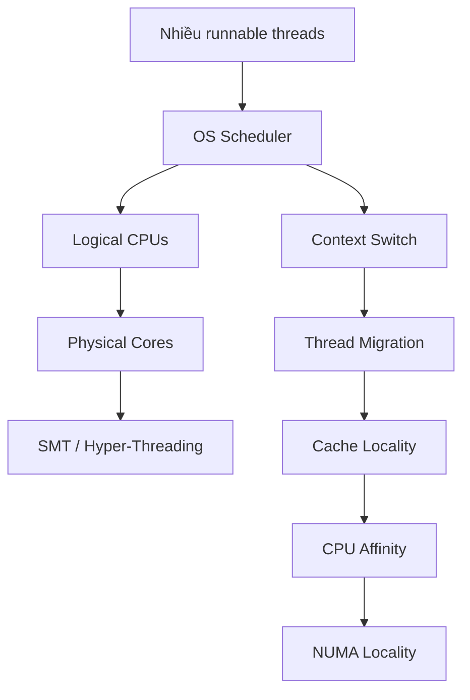
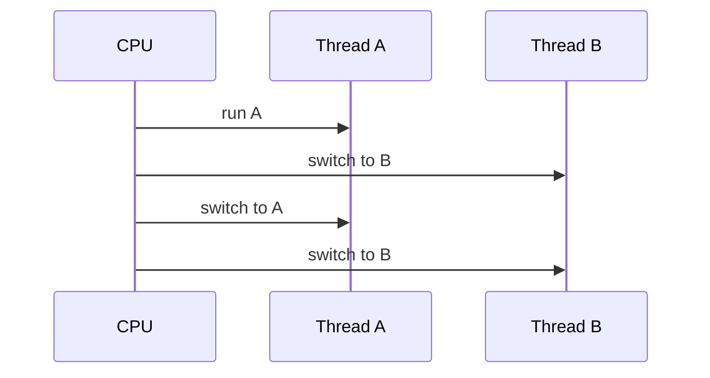
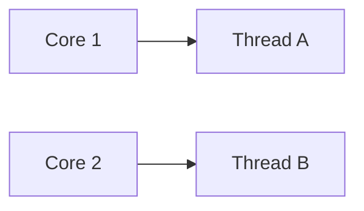
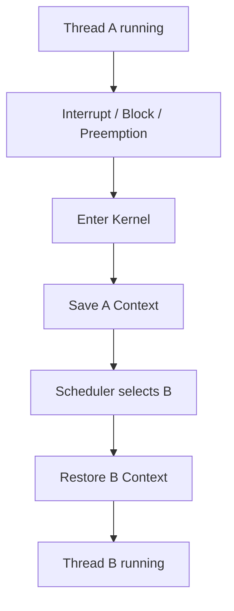
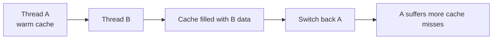
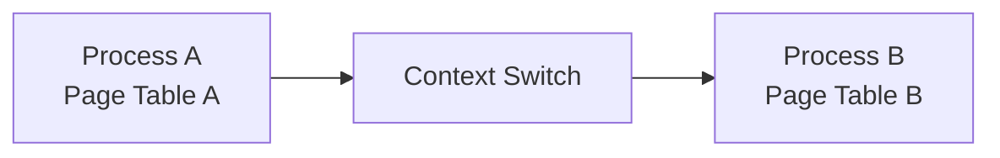
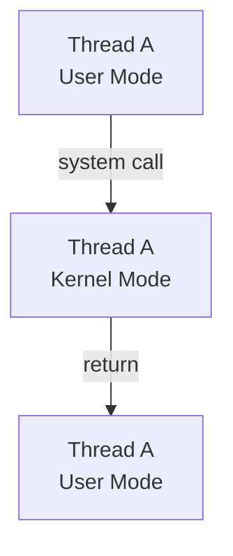
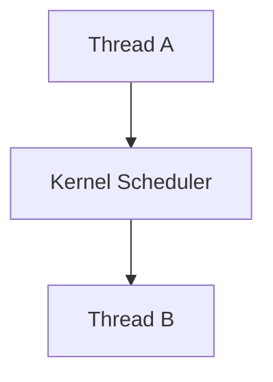

# 1.5 Scheduling, Context Switch & CPU Topology

## Mental model chung

Toàn bộ phần này có thể nối thành một flow:



Một câu nên nhớ xuyên suốt:

> **Scheduler quyết định software thread nào chạy trên logical CPU nào; physical core mới là nơi thực sự có execution resources.**

---

# Q030. [P0] Concurrency khác parallelism thế nào; một chương trình có thể concurrent trên một logical CPU không?

## Ý bật ra đầu tiên

```text
Concurrency
→ nhiều task cùng có progress theo thời gian

Parallelism
→ nhiều task thực sự execute cùng một thời điểm
```

---

## Concurrency là gì?

Concurrency nói về việc hệ thống đang quản lý nhiều công việc có thời gian tồn tại chồng lấn nhau.

Ví dụ:

```text
Task A
Task B
Task C
```

Một CPU duy nhất có thể thực hiện:

```text
A A A
      B B
          A
            C C
                B
```

CPU luân phiên giữa các task.



Tại một instant chỉ có một thread chạy trên logical CPU đó, nhưng nhìn trong một khoảng thời gian thì A và B đều progress.

Đó là concurrency.

---

## Parallelism là gì?

Parallelism yêu cầu nhiều execution resources.

Ví dụ hai physical cores:

```text
Core 1 → Thread A
Core 2 → Thread B
```

cả hai có thể thực sự thực hiện instructions đồng thời.



---

## Vậy một logical CPU có concurrency được không?

Có.

Thông qua:

```text
time slicing
preemption
blocking
context switching
```

Ví dụ:

```text
time →

CPU0:
AAAA BBB AAA CCC BBBB
```

Chương trình vẫn concurrent.

Nhưng không phải parallel trên logical CPU đó.

---

## Một nuance quan trọng

Concurrency là khái niệm ở mức:

```text
task scheduling / program structure
```

Parallelism là:

```text
actual simultaneous execution
```

Vì vậy:

```text
Concurrent
không nhất thiết
Parallel
```

Nhưng:

```text
Parallel execution
thường cũng là một dạng concurrent execution
```

---

## Câu chốt

> Concurrency nghĩa là nhiều task cùng tiến triển trong một khoảng thời gian, còn parallelism nghĩa là nhiều task thực sự chạy đồng thời. Vì OS có thể time-slice nhiều threads trên một logical CPU, một chương trình hoàn toàn có thể concurrent mà không parallel.

---

# Q031. [P0] Khi context switch xảy ra, hệ điều hành cần lưu và khôi phục những trạng thái nào?

## Mental model

Context switch là:

> CPU đang thực hiện Thread A, nhưng cần dừng A và tiếp tục Thread B.

Vậy OS phải lưu đủ thông tin để sau này A có thể tiếp tục **như chưa từng bị dừng**.

---

## Những trạng thái quan trọng

Thông thường bao gồm:

```text
Program Counter / Instruction Pointer

Stack Pointer

General-purpose registers

CPU flags / status register

Floating-point / SIMD registers nếu cần

Thread/kernel scheduling state

Kernel stack context

Một số architecture-specific state
```

---

## Ví dụ

Giả sử A đang ở:

```text
PC = instruction 150

RAX = 10
RBX = 25

SP = 0x1234
```

Nếu CPU chuyển sang B mà không save:

```text
RAX
RBX
SP
PC
```

thì khi A quay lại, CPU không biết:

```text
đang chạy instruction nào
stack đang ở đâu
register trước đó có giá trị gì
```

---

# Flow context switch



---

## Context được lưu ở đâu?

OS thường có structure quản lý thread/task chứa state cần thiết.

Conceptually:

```text
Thread A control structure

state:
  PC
  SP
  registers
  scheduling info
  ...
```

Sau này scheduler chọn A:

```text
restore state
→ CPU tiếp tục A
```

---

## Có phải mọi context switch đều save toàn bộ mọi register ngay lập tức?

Không nhất thiết.

Implementation thực tế có thể tối ưu, ví dụ:

```text
lazy save
eager save
architecture-specific optimization
```

Một số CPU state như SIMD/FPU có thể được xử lý đặc biệt.

Nhưng mental model interview tốt nhất vẫn là:

> Save enough execution state of current thread and restore the execution state of the next thread.

---

## Câu chốt

> Trong context switch, OS phải lưu execution context của thread hiện tại, đặc biệt là program counter, stack pointer, registers và CPU status, rồi restore context tương ứng của thread tiếp theo để nó có thể tiếp tục execution chính xác từ nơi trước đó bị dừng.

---

# Q032. [P1] Ngoài lưu và khôi phục register, những yếu tố nào làm context switching tốn kém?

Đây là câu rất quan trọng.

Đừng trả lời:

> Context switch chậm vì phải save registers.

Đó chỉ là một phần nhỏ.

---

# Cost 1 — Scheduler/kernel overhead

CPU phải:

```text
enter kernel
↓
scheduler logic
↓
choose next task
↓
update scheduling state
↓
return
```

Đó đã là computational overhead.

---

# Cost 2 — Cache locality

Đây thường là chi phí lớn hơn.

Giả sử Thread A vừa sử dụng:

```text
Data A
```

nên cache đang có:

```text
L1/L2 cache
→ working set của A
```

Sau khi switch sang B:

```text
Thread B
→ Data B
```

B bắt đầu đưa data của mình vào cache.



Khi quay lại A:

```text
working set của A
```

có thể đã bị evict.

---

# Cost 3 — TLB locality

Thread mới có thể sử dụng address space khác.

Translation trong TLB:

```text
Virtual Page → Physical Frame
```

của thread/process trước có thể không hữu ích cho thread mới.

Modern CPU có:

```text
ASID / PCID
```

giúp giữ translation của nhiều address spaces tốt hơn.

Nhưng TLB locality vẫn có thể bị ảnh hưởng.

---

# Cost 4 — Branch Predictor / Microarchitectural State

CPU đã học branch behavior của workload trước.

Khi chạy workload khác:

```text
branch pattern khác
instruction stream khác
```

predictor effectiveness có thể giảm.

---

# Cost 5 — CPU pipeline disruption

Switch execution stream có thể gây:

```text
pipeline refill
instruction fetch changes
different working set
```

---

# Cost 6 — Migration sang core khác

Nếu Thread A trước đó chạy trên:

```text
Core 0
```

nhưng sau switch chạy trên:

```text
Core 5
```

thì cache của Core 5 có thể hoàn toàn chưa chứa working set của A.

Cost thậm chí lớn hơn.

---

## Mental model

```text
Context switch cost
=
direct switching cost
+
indirect locality cost
```

Trong đó indirect cost có thể bao gồm:

```text
cache misses
TLB misses
branch prediction
memory access
NUMA locality
```

---

## Câu chốt

> Chi phí context switch không chỉ là save và restore registers. Chi phí lớn còn đến từ scheduler/kernel overhead và việc thread mới có working set khác, làm giảm cache locality, TLB locality và đôi khi branch-predictor locality. Nếu thread còn migrate sang core khác thì locality cost có thể lớn hơn nữa.

---

# Q033. [P1] Voluntary và involuntary context switch khác nhau thế nào; workload nào làm từng loại tăng lên?

## Voluntary context switch

Thread **tự không thể hoặc không muốn tiếp tục chạy**.

Ví dụ:

```text
blocking I/O

sleep()

wait on condition variable

wait for mutex

blocking queue

waiting for event
```

Ví dụ:

```text
Thread A
↓
read(socket)
↓
data chưa có
↓
A blocks
↓
scheduler runs B
```

A voluntarily gives up CPU vì hiện tại không có việc hữu ích để làm.

---

# Involuntary context switch

Thread vẫn muốn chạy nhưng OS scheduler lấy CPU lại.

Ví dụ:

```text
time slice hết

higher priority task becomes runnable

scheduler preemption
```

Flow:

```text
Thread A running

timer interrupt

scheduler:
"A đã chạy đủ quantum"

↓

preempt A

↓

run B
```

---

# Workload nào tăng voluntary switches?

Các workload:

```text
I/O bound

many blocking operations

database queries

network servers using blocking I/O

many locks / contention
```

Ví dụ:

```text
read file
wait DB
wait socket
sleep
lock contention
```

---

# Workload nào tăng involuntary switches?

Ví dụ:

```text
many runnable CPU-bound threads

number of runnable threads >> logical CPUs

high-priority workloads

small scheduling quantum
```

Nếu:

```text
4 CPUs
100 runnable CPU-bound threads
```

scheduler phải preempt thường xuyên.

---

## Một insight tốt

Nhiều context switches không phải lúc nào cũng xấu.

Ví dụ web server:

```text
Thread A
→ wait network

Thread B
→ can run
```

Context switch giúp CPU không bị idle.

Vấn đề là:

> Nếu switching quá nhiều so với useful computation thì overhead bắt đầu đáng kể.

---

## Câu chốt

> Voluntary context switch xảy ra khi thread block hoặc chủ động nhường CPU, thường phổ biến trong I/O-bound hoặc lock-heavy workloads. Involuntary switch xảy ra khi scheduler preempt thread dù nó vẫn runnable, thường tăng khi có nhiều CPU-bound threads cạnh tranh số logical CPUs hạn chế.

---

# Q034. [P1] Chuyển giữa hai thread cùng process khác gì chuyển giữa thread thuộc hai process ở mức address space?

## Mental model

```text
Same process
→ same virtual address space

Different processes
→ usually different virtual address spaces
```

Đây là distinction chính.

---

# Same process

Ví dụ:

```text
Process A

Thread 1
Thread 2
```

cả hai share:

```text
same page tables/address space
heap
code
libraries
```

Khi switch:

```text
Thread 1
→
Thread 2
```

OS phải đổi execution context:

```text
registers
stack
PC
```

nhưng không cần thay đổi logical process address space.

---

# Different processes

Ví dụ:

```text
Process A Thread 1
→
Process B Thread 1
```

Process B thường có:

```text
different page-table hierarchy
different virtual address space
```

Do đó OS phải chuyển memory translation context phù hợp với Process B.



---

# Điều này có thể ảnh hưởng TLB

Nếu không có hỗ trợ hardware:

```text
TLB entries của Process A
```

có thể không an toàn để dùng khi Process B chạy.

Historically điều này có thể yêu cầu invalidation.

Modern CPU thường có:

```text
ASID
PCID
```

để tag TLB entries theo address space, giảm nhu cầu flush toàn bộ.

---

# Nhưng đừng kết luận quá mạnh

Không nên nói:

> Thread switch trong cùng process luôn rẻ hơn process switch.

Thông thường address-space switch tạo thêm overhead tiềm năng.

Nhưng cost thực tế phụ thuộc:

```text
architecture
cache state
TLB state
scheduler
working sets
migration
```

---

## Câu chốt

> Hai thread trong cùng process dùng chung address space, nên context switch chủ yếu đổi execution state. Khi chuyển sang thread thuộc process khác, OS thường còn phải đổi address-space context/page-table context, có thể ảnh hưởng TLB và locality. Vì vậy process switch thường có thêm memory-translation overhead tiềm năng.

---

# Q035. [P2] Một system call có luôn gây chuyển sang thread khác không; mode switch và context switch khác nhau ở đâu?

## Câu đầu tiên

> Không.

System call **không đồng nghĩa với context switch**.

---

# Mode Switch

Ví dụ:

```java
read(...)
```

application đang chạy:

```text
User Mode
```

cần OS operation:

```text
Kernel Mode
```

Flow:



Vẫn là:

```text
same thread A
```

chỉ thay privilege level.

Đây là:

> **mode switch**

---

# Context Switch

Context switch là:

```text
Thread A
↓
Thread B
```

OS đổi execution context.



---

# Một system call có thể dẫn đến context switch

Ví dụ:

```text
Thread A
↓
read(socket)
↓
kernel
↓
data chưa sẵn sàng
↓
block A
↓
scheduler selects B
```

Ở đây xảy ra:

```text
user → kernel mode switch

+

A → B context switch
```

---

# Nhưng system call có thể return ngay

Ví dụ:

```text
getpid()
```

hoặc một syscall có thể hoàn thành ngay.

Flow:

```text
Thread A user mode
↓
Thread A kernel mode
↓
Thread A user mode
```

Không cần chạy Thread B.

---

# Mental distinction

```text
Mode switch
=
same thread
different privilege mode
```

```text
Context switch
=
different execution context/thread
```

---

## Câu chốt

> System call luôn liên quan tới việc chuyển execution vào kernel mode, nhưng không nhất thiết chuyển sang thread khác. Mode switch chỉ thay privilege level của cùng thread; context switch thay thread hoặc task đang sử dụng CPU. Một blocking syscall có thể gây cả hai.

---

# Q036. [P2] Mỗi context switch có luôn xóa CPU cache hoặc flush toàn bộ TLB không; điều đó phụ thuộc những gì?

## Câu đầu tiên

> Không.

Đây là misconception phổ biến.

---

# CPU Cache

Context switch không có nghĩa OS thực hiện:

```text
clear L1
clear L2
clear L3
```

CPU cache thường vẫn giữ data.

Vấn đề là:

```text
new thread starts using different data
```

và dần dần evict data của thread cũ.

Tức là thường:

```text
cache pollution / eviction
```

chứ không phải:

```text
explicit cache flush
```

---

# Ví dụ

```text
Thread A uses:
A1 A2 A3
```

cache:

```text
[A1 A2 A3]
```

switch sang B:

```text
B1 B2 B3
```

dần dần:

```text
[B1 B2 A3]
↓
[B1 B2 B3]
```

Khi A quay lại:

```text
cache misses ↑
```

---

# TLB thì sao?

Cũng không phải:

> context switch luôn flush toàn bộ TLB.

Điều này phụ thuộc vào:

```text
same address space or different address space

architecture

ASID/PCID support

OS implementation
```

---

## Same process thread switch

```text
Thread A
→ Thread B
```

cùng address space:

```text
many existing translations vẫn hợp lệ
```

không có lý do logic phải flush tất cả.

---

## Different processes

Address space thay đổi.

Trên hardware cũ có thể cần nhiều TLB invalidation hơn.

Modern architecture có thể tag entries bằng:

```text
ASID / PCID
```

để giữ nhiều process translations đồng thời.

---

# Các microarchitectural state khác

Ngoài cache/TLB:

```text
branch predictor
prefetcher
CPU pipeline
```

cũng không nhất thiết bị "xóa", nhưng hiệu quả của st
