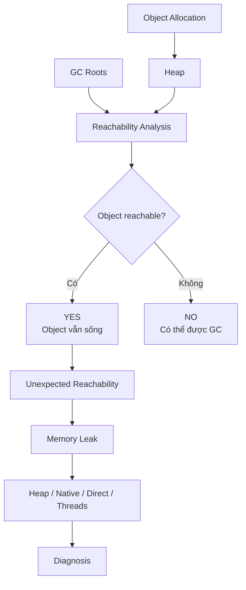
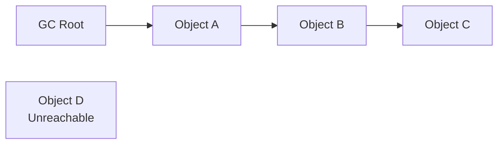
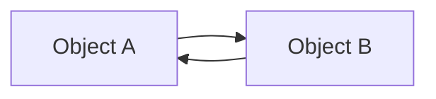
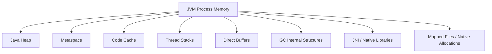
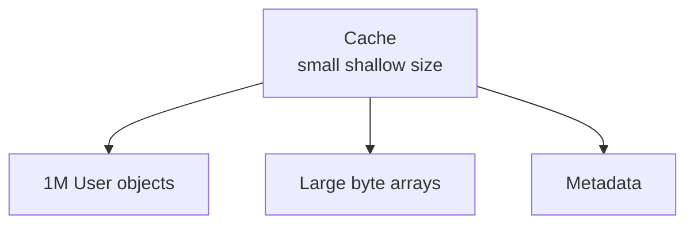
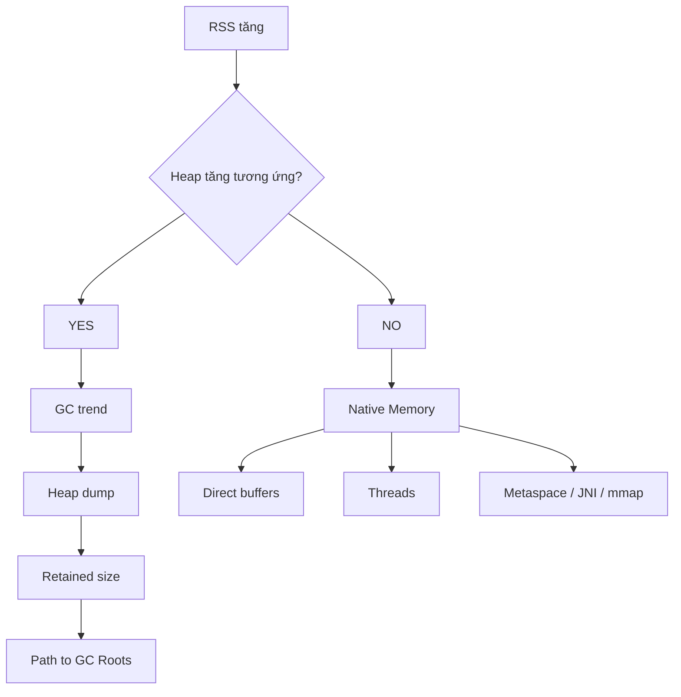
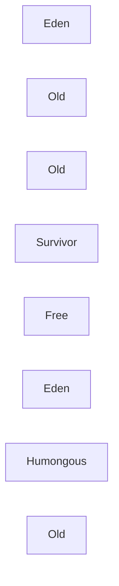
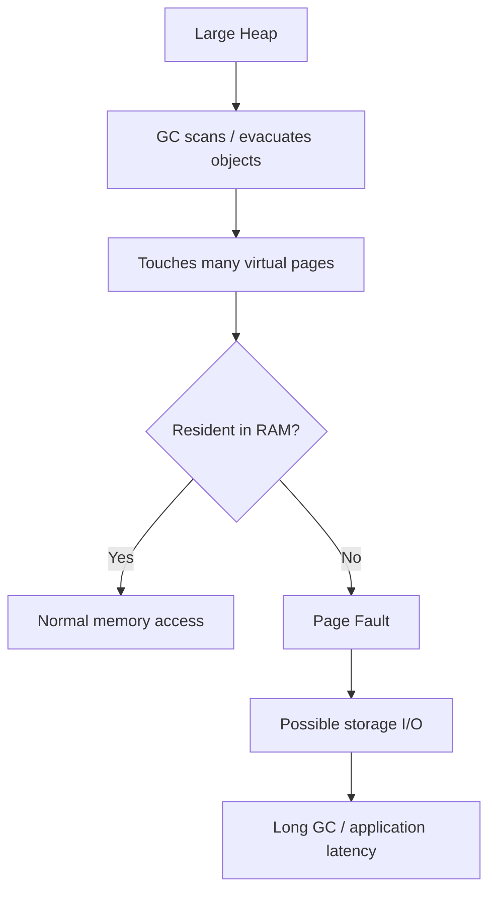
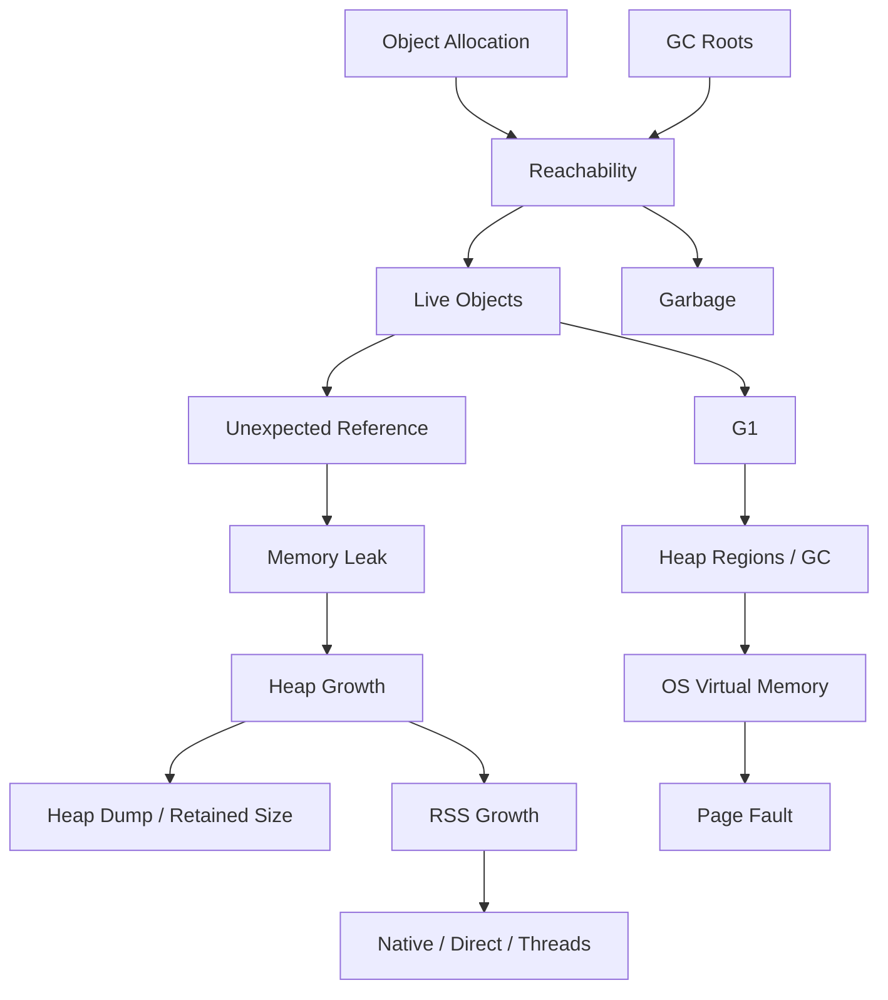

# 1.6 JVM, Garbage Collection & Chẩn đoán bộ nhớ

## Mental model chung

Toàn bộ phần này nên nối thành một chuỗi:



Ba câu rất quan trọng cần nhớ:

> **GC không hỏi object còn được dùng về mặt business hay không; GC hỏi object còn reachable hay không.**

> **Memory leak trong Java thường là object không còn cần về logic nhưng vẫn còn reachable.**

> **JVM memory không chỉ có Java heap.**

---

# Q042. [P0] Garbage collector xác định một object có thể được thu hồi bằng cách nào?

## Ý bật ra đầu tiên

Không phải:

```text
reference count = 0
```

mà mental model chính của JVM GC là:

```text
GC Roots
↓
Reachability Graph
↓
Object không reachable
→ có thể thu hồi
```

---

## Cách trả lời

Garbage collector xác định object còn sống chủ yếu bằng **reachability analysis**.

GC bắt đầu từ một tập các reference đặc biệt gọi là:

```text
GC Roots
```

sau đó traverse object graph.



Các object:

```text
A
B
C
```

đều reachable từ GC root nên phải được giữ lại.

`D` không có đường reference nào từ GC root tới nó:

```text
GC Roots
   X
   ↓
Object D
```

nên nó có thể trở thành garbage.

---

## Ví dụ

```java
Person p = new Person();
```

Nếu `p` đang nằm trong stack frame của một thread đang sống:

```text
Thread Stack
    ↓
    p
    ↓
Person
```

thì `Person` vẫn reachable.

Sau đó:

```java
p = null;
```

nếu không còn reference khác:

```text
GC Roots
   X
Person
```

thì object có thể được thu hồi.

---

## Một distinction rất quan trọng

Không nên nói:

> Object không còn biến trỏ tới thì bị GC ngay.

Đúng hơn:

```text
unreachable
→ eligible for GC
```

không có nghĩa:

```text
GC ngay lập tức chạy và reclaim nó
```

Thời điểm GC chạy phụ thuộc collector và memory pressure.

---

## Câu chốt

> GC bắt đầu từ các GC roots, traverse toàn bộ object graph và giữ lại những object còn reachable. Object không còn đường reference từ bất kỳ GC root nào thì được xem là unreachable và có thể được garbage collector thu hồi.

---

# Q043. [P1] Những đối tượng tham chiếu nào có thể đóng vai trò GC roots; một vòng tham chiếu không còn truy cập được có được thu hồi không?

## Common GC roots

Ở mức interview, có thể nhớ các nhóm chính:

```text
References từ thread stacks
Static references
JNI references
Active threads / runtime structures
Một số JVM internal references
```

---

## 1. Local variables trong thread đang sống

Ví dụ:

```java
void foo() {
    Person p = ...
}
```

nếu frame vẫn active:

```text
Thread
↓
Stack Frame
↓
p
↓
Person
```

`p` giữ object reachable.

---

## 2. Static references

Ví dụ:

```java
static Map<String, User> cache;
```

Nếu class còn được JVM giữ:

```text
Static Field
↓
Map
↓
Users
```

toàn bộ graph phía dưới có thể tiếp tục sống.

Đây là nguồn memory leak rất phổ biến.

---

## 3. JNI/native references

Native code có thể giữ:

```text
JNI global reference
```

và khiến Java object vẫn reachable dù Java code không còn giữ reference trực tiếp.

---

# Vòng reference có bị GC không?

Có.

Ví dụ:

```java
class A {
    B b;
}

class B {
    A a;
}
```

ta có:



A và B reference lẫn nhau.

Nhưng nếu:

```text
GC Roots
   X
   ↓
A ↔ B
```

thì cả hai vẫn unreachable.

GC có thể thu hồi cả vòng.

---

## Đây là điểm khác với reference counting đơn giản

Reference counting có thể gặp:

```text
A.refCount = 1
B.refCount = 1
```

dù chúng chỉ reference nhau.

Reachability-based GC thì nhìn:

> Có đường nào từ GC root tới A/B không?

Nếu không:

```text
garbage
```

---

## Câu chốt

> GC roots thường bao gồm references từ active thread stacks, static fields, JNI handles và một số runtime structures. Một cycle tự reference không làm object sống mãi; nếu toàn bộ cycle không còn reachable từ GC root thì collector vẫn có thể thu hồi nó.

---

# Q044. [P0] Vì sao ứng dụng Java vẫn có thể memory leak dù có garbage collection?

## Ý quan trọng nhất

GC biết:

```text
reachable / unreachable
```

nhưng không biết:

```text
business logic còn cần object hay không
```

Đây chính là nguồn leak.

---

## Ví dụ classic

```java
static List<User> users = new ArrayList<>();
```

mỗi request:

```java
users.add(user);
```

nhưng không bao giờ remove.

Object graph:

```text
Static users
↓
ArrayList
↓
User 1
User 2
User 3
...
User 10,000,000
```

Tất cả đều reachable.

Do đó GC nói:

> Tôi không thể xóa chúng.

Nhưng application có thể chẳng còn cần chúng.

Đó là memory leak.

---

# Một số nguồn leak phổ biến

```text
Unbounded cache

Static collections

Listener không unregister

ThreadLocal không cleanup

Long-lived queues

Session maps

ClassLoader leaks

JNI references

Resource/object retention do callback
```

---

# Ví dụ cache

Sai:

```java
Map<String, Result> cache = new ConcurrentHashMap<>();
```

nếu:

```text
không expiration
không size limit
không eviction
```

cache có thể tăng vô hạn.

GC không giúp được vì:

```text
cache
↓
entries
```

vẫn reachable.

---

# ThreadLocal cũng đáng nhớ

Ví dụ thread pool:

```text
Worker Thread
↓
ThreadLocalMap
↓
Large Object
```

Thread pool sống rất lâu.

Nếu không `remove()` đúng lúc:

```text
large object
```

có thể bị giữ lâu ngoài dự kiến.

---

## Câu chốt

> Garbage collection chỉ thu hồi object unreachable. Java vẫn có memory leak khi application vô tình giữ reference tới object không còn cần về mặt logic, ví dụ static collection, unbounded cache hoặc ThreadLocal. Với GC, vấn đề thường không phải object không thể được free mà là object vẫn còn reachable ngoài ý muốn.

---

# Q045. [P1] Bạn phân biệt allocation rate cao, tập dữ liệu sống lớn hợp lệ và giữ object ngoài ý muốn như thế nào?

Đây là câu diagnostic rất quan trọng.

Hãy phân biệt ba hiện tượng:

```text
1. High allocation rate
2. Large live set
3. Memory leak
```

---

# Case 1 — Allocation rate cao

Ví dụ server tạo rất nhiều temporary objects:

```text
Request
↓
DTO
String
temporary List
buffer
```

Memory có thể tăng nhanh:

```text
used heap ↑
GC
used heap ↓
GC
used heap ↓
```

Saw-tooth pattern:

```text
Heap

 /\/\  /\/\  /\/\
```

Sau GC, heap trở về mức tương đối ổn định.

Điều này thường nghĩa là:

```text
allocation throughput cao
```

chứ chưa chắc leak.

---

# Case 2 — Live dataset lớn nhưng hợp lệ

Ví dụ:

```text
application cache intentionally stores 20 GB
```

Sau full/concurrent GC:

```text
before GC: 25 GB
after GC:  20 GB
```

và 20 GB tương đối ổn định.

Đây có thể là:

```text
large live set
```

chứ không phải leak.

Câu hỏi tiếp theo:

> 20 GB này có hợp lý với application design không?

---

# Case 3 — Object retention ngoài ý muốn

Pattern thường là:

```text
After-GC occupancy
```

cứ tăng dần:

```text
GC1 → 5 GB
GC2 → 7 GB
GC3 → 9 GB
GC4 → 12 GB
```

Tức là GC ngày càng reclaim được ít hơn.

Đây là tín hiệu đáng nghi về retention/leak.

---

# Cách điều tra

## 1. Nhìn allocation rate

Dùng profiler/JFR để xem:

```text
objects allocated / second
bytes allocated / second
top allocation sites
```

---

## 2. Nhìn live set sau GC

Quan trọng hơn peak heap là:

```text
post-GC heap occupancy
```

Nếu:

```text
peak tăng
nhưng post-GC ổn định
```

có thể chỉ là high allocation.

Nếu:

```text
post-GC liên tục tăng
```

cần điều tra retention.

---

## 3. Heap dump

Tìm:

```text
largest retained objects
dominator tree
unexpected collections
```

Ví dụ:

```text
HashMap
└── 8 million User objects
```

rồi hỏi:

> Ai đang giữ Map này?

---

## Mental model

```text
High allocation rate
→ tạo nhanh
→ chết nhanh

Large live set
→ sống lâu
→ nhưng hợp lệ

Memory leak
→ sống lâu
→ không còn cần nhưng vẫn reachable
```

---

## Câu chốt

> Tôi sẽ không chỉ nhìn heap đang lớn bao nhiêu. Tôi sẽ nhìn allocation rate và đặc biệt là post-GC live set. Nếu heap tăng mạnh nhưng sau GC quay về baseline thì có thể chỉ là allocation rate cao. Nếu after-GC occupancy cao nhưng ổn định thì có thể là live dataset hợp lệ. Nếu after-GC occupancy tăng dần theo thời gian, tôi sẽ dùng heap dump và retained-size analysis để tìm object bị giữ ngoài ý muốn.

---

# Q046. [P1] `-Xms` và `-Xmx` kiểm soát gì, và vì sao không thể coi heap size là toàn bộ RAM mà JVM sử dụng?

## `-Xms`

Chủ yếu cấu hình:

```text
initial Java heap size
```

Ví dụ:

```bash
-Xms2g
```

JVM khởi đầu với heap khoảng 2 GB theo cấu hình đó.

---

## `-Xmx`

Giới hạn:

```text
maximum Java heap size
```

Ví dụ:

```bash
-Xmx8g
```

Java heap không được phát triển vượt quá khoảng 8 GB theo giới hạn này.

---

# Nhưng JVM process dùng nhiều memory hơn heap

Mental model:



---

# Các vùng quan trọng ngoài heap

## Metaspace

Chứa class metadata.

```text
classes
methods metadata
constant-pool related structures
```

nằm ngoài Java heap.

---

## Thread stacks

Nếu application có:

```text
2,000 threads
```

và mỗi thread có native stack đáng kể:

```text
thread memory
```

có thể rất lớn.

---

## Direct buffers

```java
ByteBuffer.allocateDirect(...)
```

memory nằm ngoài Java heap.

---

## Code cache

JIT-compiled machine code cần memory riêng.

---

## Native libraries/JNI

C/C++ libraries có thể:

```text
malloc()
mmap()
```

memory ngoài heap.

---

## GC structures

Collector cần:

```text
remembered sets
marking structures
region metadata
```

và nhiều internal structures khác.

---

# Ví dụ rất quan trọng

Container có:

```text
RAM limit = 10 GB
```

application chạy:

```text
-Xmx9g
```

Không có nghĩa là an toàn.

Bởi vì:

```text
Heap         9 GB
Metaspace    ?
Threads      ?
Direct       ?
Code cache   ?
Native       ?
```

RSS có thể vượt 10 GB.

---

## Câu chốt

> `-Xms` cấu hình initial heap size, còn `-Xmx` giới hạn maximum Java heap. Nhưng heap chỉ là một phần của JVM process memory. Metaspace, thread stacks, direct buffers, JIT code cache, GC metadata và native/JNI allocations đều sử dụng RAM ngoài heap, nên không thể lấy `-Xmx` làm tổng memory footprint của JVM.

---

# Q047. [P1] OutOfMemoryError do hết Java heap khác gì lỗi không tạo được native thread hoặc không cấp phát được direct buffer?

Từ khóa quan trọng:

> `OutOfMemoryError` là một family của nhiều nguyên nhân khác nhau.

Không phải OOME nào cũng là:

```text
heap full
```

---

# Case 1 — Java heap space

Thông thường thấy:

```text
java.lang.OutOfMemoryError:
Java heap space
```

Nghĩa là JVM không thể thỏa mãn heap allocation.

Có thể do:

```text
heap quá nhỏ
memory leak
live set quá lớn
allocation pressure
```

Investigation:

```text
heap usage
GC logs
heap dump
allocation profile
```

---

# Case 2 — Unable to create new native thread

Ví dụ:

```text
OutOfMemoryError:
unable to create new native thread
```

Không nhất thiết Java heap đầy.

Có thể do:

```text
OS thread limit

process/thread quota

native memory không đủ

thread stack reservation quá lớn

quá nhiều threads
```

Ví dụ:

```text
-Xmx còn rất nhiều
```

nhưng:

```text
50,000 threads
```

thì native resource có thể hết.

---

# Case 3 — Direct buffer memory

Ví dụ:

```text
OutOfMemoryError:
Direct buffer memory
```

Liên quan đến:

```java
ByteBuffer.allocateDirect(...)
```

Memory này nằm ngoài normal Java heap.

Có thể bị giới hạn bởi direct-memory policy/configuration hoặc native address-space/resource pressure.

---

# Mental comparison

```text
Java heap OOME
→ không cấp phát được heap object

Native-thread OOME
→ không tạo được OS/native thread

Direct-buffer OOME
→ không cấp phát được off-heap direct memory
```

---

## Diagnostic path khác nhau

Heap OOME:

```text
Heap dump
GC logs
retained objects
```

Native thread:

```text
thread count
ulimit / OS limits
-Xss
native memory
```

Direct buffer:

```text
direct memory usage
buffer pooling
native memory
allocation lifecycle
```

---

## Câu chốt

> `OutOfMemoryError` không đồng nghĩa heap luôn đầy. `Java heap space` nói về heap allocation. `Unable to create new native thread` thường liên quan đến OS thread limits hoặc native memory cho thread stacks và runtime structures. `Direct buffer memory` lại liên quan đến off-heap direct memory. Vì vậy trước tiên phải đọc đúng OOME subtype rồi mới chọn hướng điều tra.

---

# Q048. [P2] Khi nào direct buffers đáng sử dụng, và phải theo dõi những chi phí nào ngoài heap?

## Direct buffer là gì?

Ví dụ:

```java
ByteBuffer buffer =
    ByteBuffer.allocateDirect(size);
```

Memory backing buffer nằm ngoài Java heap.

---

# Khi nào hữu ích?

Đặc biệt với:

```text
NIO
network I/O
file I/O
high-throughput servers
large reusable buffers
```

Native I/O API có thể làm việc trực tiếp với vùng memory này hiệu quả hơn và tránh một số bước copy trung gian mà heap buffer có thể cần.

Nhưng không nên nói:

> Direct buffer luôn zero-copy.

Không phải mọi path đều zero-copy.

---

# Benefit

```text
less heap pressure

potentially fewer data copies for native I/O

large buffers không chiếm Java heap

good for reusable I/O buffers
```

---

# Nhưng cost?

## 1. Allocation/free đắt hơn

Direct buffer thường không rẻ để tạo liên tục:

```text
allocateDirect()
```

nặng hơn normal young-generation allocation.

Do đó thường có:

```text
buffer pool
```

---

## 2. Memory ngoài heap

Giả sử:

```text
-Xmx = 4 GB
```

nhưng:

```text
Direct Buffers = 3 GB
```

process có thể dùng ít nhất gần:

```text
7 GB + other memory
```

---

## 3. Lifetime khó nhìn hơn

Java object `ByteBuffer` nằm trên heap:

```text
Java ByteBuffer object
      ↓
native memory
```

Native backing memory thường được giải phóng khi buffer không còn reachable và cleanup mechanism chạy.

Do đó memory reclamation không nhất thiết xảy ra ngay khi bạn "không dùng buffer nữa".

---

## 4. Native fragmentation / pressure

Nhiều buffer kích thước khác nhau có thể tạo:

```text
native memory pressure
fragmentation
```

---

## 5. RSS vẫn tăng

Heap metrics có thể trông bình thường:

```text
Heap = 2 GB stable
```

nhưng process RSS:

```text
4 GB
6 GB
8 GB
```

vì direct/native memory.

---

## Câu chốt

> Direct buffers đáng dùng khi I/O throughput quan trọng và buffers đủ lớn hoặc được reuse để lợi ích native I/O bù được chi phí allocation. Nhưng chúng nằm ngoài Java heap, nên phải theo dõi direct-memory usage, native RSS, allocation/free lifecycle và buffer pooling chứ không chỉ nhìn `-Xmx`.

---

# Q049. [P2] Bạn sẽ dùng heap dump, retained size và thông tin native memory để điều tra RAM tăng dần như thế nào?

Đây là một câu diagnostic flow.

Đừng nhảy ngay vào heap dump.

Trước tiên cần hỏi:

> Memory tăng ở Java heap hay ngoài heap?

---

# Bước 1 — So sánh heap với process RSS

Giả sử:

```text
RSS:
4 GB → 6 GB → 8 GB → 10 GB
```

Hỏi:

```text
Java heap có tăng tương ứng không?
```

---

## Case A

```text
Heap tăng
RSS tăng
```

→ nghi vấn heap retention/leak.

---

## Case B

```text
Heap stable
RSS tăng
```

→ nghi:

```text
direct buffers
native allocations
thread stacks
metaspace
JNI
mapped memory
```

---

# Bước 2 — Heap dump

Nếu nghi heap leak:

Lấy heap dump tại thời điểm memory cao.

Phân tích:

```text
object count
shallow size
retained size
dominator tree
paths to GC roots
```

---

# Shallow size vs retained size

## Shallow size

Memory của chính object đó.

Ví dụ:

```text
HashMap
```

chính object map có thể không lớn.

---

## Retained size

Lượng memory có thể trở thành collectible nếu object đó không còn giữ graph phía sau.

Ví dụ:



Cache object tự nó nhỏ.

Nhưng retained size có thể:

```text
5 GB
```

vì cache giữ cả graph.

---

# Dominator Tree

Tìm object:

> Nếu object này biến mất, một lượng lớn objects khác cũng unreachable.

Ví dụ:

```text
AppCache
↓
HashMap
↓
Millions of entries
```

đó là retention owner rất đáng nghi.

---

# Paths to GC Roots

Sau khi tìm được object đáng nghi:

> Tại sao nó vẫn reachable?

Ví dụ:

```text
GC Root
↓
static field
↓
CacheManager
↓
Map
↓
User
```

Từ đó tìm root cause.

---

# Bước 3 — Native Memory

Nếu heap không giải thích được RSS:

dùng native-memory information.

Ví dụ với HotSpot có thể điều tra bằng:

```text
jcmd <pid> VM.native_memory summary
```

hoặc baseline/diff nếu Native Memory Tracking được bật phù hợp.

Tìm các category:

```text
Thread
Class
Code
GC
Compiler
Internal
Arena/Native
```

Ngoài ra có thể dùng OS tools để xem:

```text
RSS
mmap regions
native mappings
thread count
```

---

# Diagnostic flow



---

## Một workflow mạnh hơn

Nếu có thể, lấy hai snapshot:

```text
T1
T2
```

rồi so sánh:

```text
class nào tăng object count?

retained size nào tăng?

native category nào tăng?
```

Trend thường hữu ích hơn một snapshot đơn lẻ.

---

## Câu chốt

> Tôi sẽ bắt đầu bằng cách phân biệt heap growth với native/RSS growth. Nếu heap tăng, tôi dùng heap dump, dominator tree, retained size và paths to GC roots để tìm object graph đang bị giữ. Nếu heap ổn nhưng RSS tăng, tôi chuyển sang native-memory analysis để kiểm tra direct buffers, thread stacks, metaspace, JNI hoặc mapped memory. Quan trọng là tìm component nào thực sự tăng theo thời gian.

---

# Q050. [P2] Ở mức khái quát, G1 tổ chức heap và phân chia công việc giữa các pha concurrent với stop-the-world ra sao?

## Mental model

Tên:

> G1 = Garbage-First.

Ý tưởng quan trọng:

```text
Heap
→ chia thành nhiều regions

Collector
→ ưu tiên collect những regions đem lại nhiều garbage nhất / hiệu quả nhất
```

---

# Heap organization

Khác mental model đơn giản:

```text
Young contiguous block
Old contiguous block
```

G1 chia heap thành nhiều region cùng kích thước.



Một region có thể đóng vai trò:

```text
Eden
Survivor
Old
Humongous
Free
```

---

# Young collection

Young objects chủ yếu vào:

```text
Eden regions
```

Khi cần young GC:

```text
Stop-The-World
```

application threads dừng.

G1 evacuate live objects:

```text
Eden
↓
Survivor / Old
```

Sau evacuation, toàn bộ region cũ có thể được reuse.

---

# Concurrent marking

Khi old generation đủ lớn, G1 cần tìm:

```text
old objects nào còn live?
regions nào chứa nhiều garbage?
```

Phần lớn marking có thể diễn ra concurrent với application.

Mental flow:

```text
Initial Mark
↓
Concurrent Mark
↓
Remark
↓
Cleanup / planning
```

Một số boundary phases cần Stop-The-World, trong khi phần lớn graph marking được làm concurrent.

---

# Mixed Collections

Sau concurrent marking, G1 biết:

```text
Region A = 80% garbage
Region B = 10% garbage
Region C = 70% garbage
```

G1 có thể chọn collection set gồm:

```text
young regions
+
một số old regions nhiều garbage
```

để evacuate trong:

```text
mixed GC pause
```

Đây là phần "Garbage First".

---

# Một distinction cực kỳ quan trọng

Concurrent không có nghĩa:

> G1 không bao giờ Stop-The-World.

Sai.

G1 vẫn có STW phases, đặc biệt:

```text
young evacuation
mixed evacuation
initial-mark coordination
remark
một số cleanup/bookkeeping
```

Concurrent work giúp giảm lượng công việc phải làm trong pause, chứ không loại bỏ pause hoàn toàn.

---

# Tại sao region-based hữu ích?

Collector có thể chọn:

```text
collection set
```

thay vì luôn compact toàn bộ heap.

Điều này giúp G1 cố gắng đáp ứng:

```text
pause-time goal
```

bằng việc điều chỉnh lượng work trong mỗi pause.

---

# Humongous objects

Object rất lớn có thể cần nhiều contiguous regions:

```text
Humongous Object
→ Region A + B + C
```

Nếu có nhiều huge allocations, G1 có thể gặp:

```text
fragmentation pressure
allocation pressure
```

đây là một diagnostic angle tốt.

---

## Câu chốt

> G1 chia heap thành nhiều region thay vì phụ thuộc hoàn toàn vào các vùng contiguous cố định. Young và mixed collections chủ yếu dùng evacuation trong Stop-The-World pauses. G1 đồng thời thực hiện phần lớn old-generation marking concurrently với application, rồi dùng thông tin đó để chọn các old regions có nhiều garbage cho mixed collections. Vì vậy G1 không phải collector không pause; nó cố gắng kiểm soát pause bằng region selection và concurrent work.

---

# Q051. [P2] GC và page fault có thể ảnh hưởng lẫn nhau như thế nào dù là hai cơ chế khác nhau?

## Distinction đầu tiên

```text
GC
→ JVM memory-management mechanism
```

```text
Page fault
→ OS / virtual-memory mechanism
```

Chúng khác layer.

Nhưng cả hai cùng đụng tới:

```text
physical memory
```

nên có thể ảnh hưởng lẫn nhau.

---

# Case 1 — GC scan làm chạm nhiều pages

Giả sử heap:

```text
30 GB
```

GC phải scan một lượng lớn object graph.

GC threads chạm nhiều memory pages:

```text
Page A
Page B
Page C
...
```

Nếu một số page chưa resident:

```text
page fault
```

có thể xảy ra.

Nếu chỉ cần allocate/zero-fill physical page:

```text
minor fault
```

chi phí tương đối thấp hơn.

Nếu page đã bị swap/file-backed và cần storage:

```text
major fault
```

có thể cực kỳ chậm.

---

# Case 2 — Memory pressure làm GC chậm

Giả sử OS thiếu physical RAM:

```text
JVM heap lớn
+
other processes
+
native memory
```

OS bắt đầu reclaim aggressively hoặc swap.

GC muốn scan heap:

```text
scan page
↓
page swapped out
↓
major page fault
↓
disk I/O
```

GC pause có thể tăng rất mạnh.

---

# Case 3 — GC có thể làm working set thay đổi

Compaction/evacuation có thể:

```text
read old pages
write new pages
```

và làm nhiều pages trở nên active.

Điều này thay đổi:

```text
working set
RSS
cache/TLB behavior
```

---

# Case 4 — Heap quá lớn có thể giảm GC frequency nhưng tăng OS pressure

Một common intuition:

> Tăng `-Xmx` luôn giúp GC.

Không đúng.

Heap lớn hơn có thể:

```text
GC ít thường xuyên hơn
```

nhưng nếu physical RAM không đủ:

```text
paging
swap
page faults
```

có thể làm application chậm hơn rất nhiều.

---

# Mental flow



---

# Điểm production rất quan trọng

Nếu thấy:

```text
GC pause cao
```

không nên lập tức kết luận:

```text
GC algorithm là lỗi
```

Có thể JVM đang bị:

```text
memory pressure
swap
major page faults
NUMA locality issue
```

Do đó nên correlate:

```text
GC logs
RSS
swap activity
page faults
system memory pressure
```

---

## Câu chốt

> GC và page fault là hai cơ chế ở hai layer khác nhau, nhưng GC phải đọc và ghi rất nhiều memory pages. Nếu các pages đó không resident trong RAM, GC có thể gây hoặc chịu page faults; nếu cần swap hoặc file I/O thì pause có thể tăng mạnh. Vì vậy khi chẩn đoán GC latency, tôi cũng sẽ nhìn system memory pressure và page-fault behavior chứ không chỉ nhìn JVM metrics.

---

# Liên kết Q042 → Q051

Đây là một chuỗi reasoning hoàn chỉnh:



---

# Những distinction phải thuộc

## 1. Reachable ≠ Still useful

```text
reachable
→ GC phải giữ

business không còn cần
→ có thể vẫn leak
```

---

## 2. Unreachable ≠ Freed immediately

```text
unreachable
→ eligible for GC

không phải
→ reclaim ngay lập tức
```

---

## 3. Heap usage ≠ JVM RSS

```text
JVM RAM
=
Heap
+ Metaspace
+ Thread stacks
+ Direct
+ Code Cache
+ GC data
+ Native
+ mmap
+ ...
```

---

## 4. OOME ≠ Always Java heap full

```text
Java heap space
≠
unable to create native thread
≠
direct buffer memory
```

---

## 5. GC problem ≠ Always JVM-only problem

```text
GC
↕
OS memory pressure
↕
page faults / swap
```

---

# Cheat sheet theo priority

## Q042 [P0]

```text
GC Roots
↓
Reachability
↓
Unreachable
→ eligible for GC
```

---

## Q043 [P1]

```text
Roots:
thread stack
static
JNI
runtime references
```

Cycle:

```text
A ↔ B
```

nếu không reachable:

```text
GC được
```

---

## Q044 [P0]

Câu phải thuộc:

> **Java leak = object không còn cần nhưng vẫn reachable.**

---

## Q045 [P1]

```text
High allocation
→ tạo nhiều, chết nhanh

Large live set
→ sống lâu, nhưng hợp lệ

Leak
→ after-GC live set tăng dần
```

---

## Q046 [P1]

```text
-Xms
→ initial heap

-Xmx
→ max heap
```

Nhưng:

```text
Heap ≠ total JVM memory
```

---

## Q047 [P1]

```text
Heap OOM
Native thread OOM
Direct buffer OOM
```

là ba hướng điều tra khác nhau.

---

## Q048 [P2]

```text
Direct buffer

+ I/O efficient
+ less heap pressure

but

- native memory
- expensive allocation
- lifecycle harder to see
```

---

## Q049 [P2]

Diagnostic flow:

```text
RSS ↑
↓
Heap ↑ ?
```

Nếu có:

```text
heap dump
→ dominator
→ retained size
→ GC roots
```

Nếu không:

```text
native memory
→ direct/thread/metaspace/JNI
```

---

## Q050 [P2]

```text
G1

Heap → Regions

Concurrent:
marking mostly

STW:
evacuation / young / mixed / remark portions
```

---

## Q051 [P2]

```text
GC touches pages
↓
page not resident
↓
page fault
↓
possibly disk
↓
GC latency ↑
```

---

# Cách trả lời câu diagnostic rộng

Nếu interviewer hỏi:

> “Java service của tôi cứ tăng RAM, bạn debug thế nào?”

Một câu trả lời có structure tốt:

> Trước tiên tôi sẽ phân biệt Java heap growth với overall process RSS growth. Nếu post-GC heap occupancy tăng dần, tôi sẽ nghi object retention và lấy heap dump để xem dominator tree, retained size và paths to GC roots. Nếu heap tương đối ổn nhưng RSS vẫn tăng, tôi sẽ chuyển sang native memory như direct buffers, thread stacks, metaspace, JNI hoặc mmap. Đồng thời tôi sẽ correlate với allocation rate, GC logs và OS memory pressure để tránh kết luận nhầm rằng mọi memory problem đều là Java heap leak.

Flow:

```text
Symptom
↓
Locate memory category
↓
Measure trend
↓
Find retention/allocation owner
↓
Root cause
```

Đó là kiểu trả lời rất tốt vì bạn không chỉ biết GC hoạt động thế nào mà còn thể hiện được **production diagnostic thinking**.
