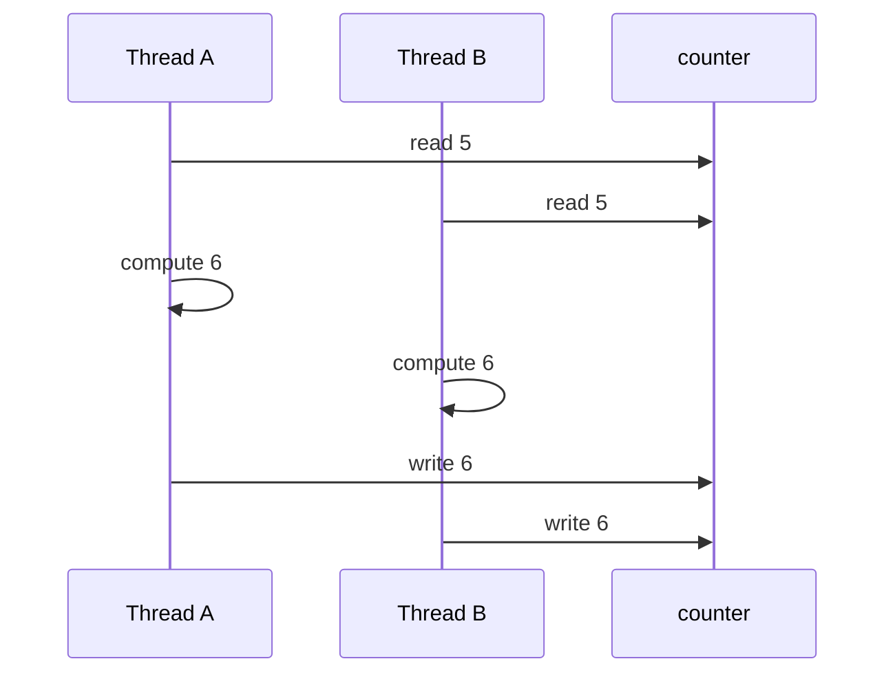
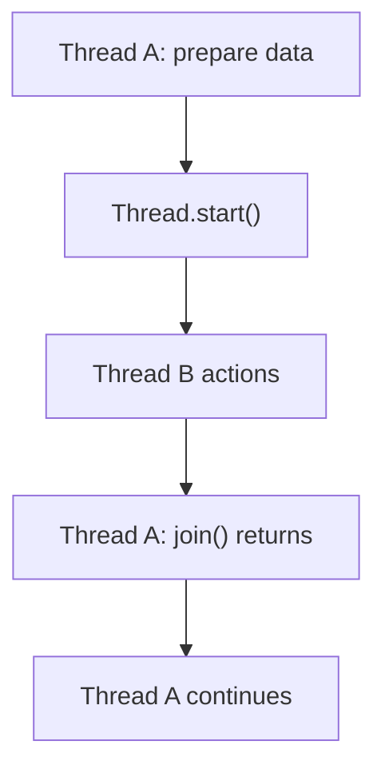
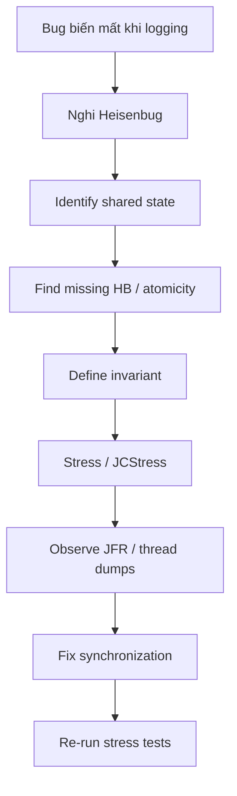
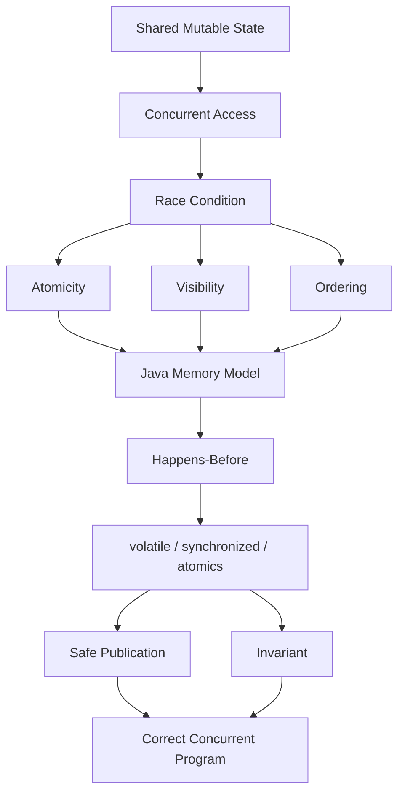

# 2.1 Race Condition, Atomicity & Java Memory Model

## Mental model chung

Toàn bộ phần này xoay quanh ba câu hỏi:

```text
1. Hai thread có cùng truy cập shared state không?

2. Những thao tác đó có atomic không?

3. Một thread có chắc nhìn thấy thay đổi của thread kia theo đúng thứ tự không?
```

Ba khái niệm lõi:

```text
Atomicity
Visibility
Ordering
```

và Java Memory Model dùng:

```text
happens-before
```

để mô tả khi nào một thread được bảo đảm nhìn thấy effects của thread khác.

---

# Q052. [P0] Race condition là gì; hai thread cùng thực hiện `counter++` có thể làm mất một lần tăng như thế nào?

## Ý bật ra đầu tiên

`counter++` không phải một thao tác atomic.

Nó conceptually gồm:

```text
read
+
modify
+
write
```

---

## Ví dụ

Ban đầu:

```text
counter = 5
```

Thread A chạy:

```text
read counter → 5
```

Thread B cũng chạy:

```text
read counter → 5
```

Sau đó:

```text
A computes 6
B computes 6
```

và cả hai cùng ghi:

```text
A writes 6
B writes 6
```

Kết quả:

```text
counter = 6
```

trong khi đúng ra phải là:

```text
counter = 7
```

Đây gọi là:

> lost update.

---

## Sơ đồ



---

# Race condition là gì?

Race condition là khi:

> Kết quả chương trình phụ thuộc vào thứ tự hoặc timing tương đối giữa các concurrent operations.

Ví dụ:

```text
A before B
→ result X

B before A
→ result Y
```

trong khi chương trình mong muốn một result deterministic.

---

## Câu chốt

> Race condition xảy ra khi correctness phụ thuộc vào timing giữa các threads. `counter++` là ví dụ kinh điển vì nó gồm read-modify-write chứ không phải một atomic operation, nên hai threads có thể cùng đọc một giá trị cũ và làm mất một lần update.

---

# Q053. [P0] Atomicity, visibility và ordering khác nhau ra sao trong chương trình đa luồng?

Đây là ba dimension khác nhau.

---

# 1. Atomicity

Câu hỏi:

> Operation có thể bị thread khác quan sát hoặc chen vào giữa hay không?

Ví dụ:

```text
counter++
```

không atomic.

Trong khi một atomic increment như:

```java
atomicInteger.incrementAndGet();
```

có thể được xem như một indivisible atomic operation ở mức abstraction được cung cấp.

Mental model:

```text
Atomicity
=
all or nothing
```

---

# 2. Visibility

Câu hỏi:

> Thread B có chắc nhìn thấy update mà Thread A vừa thực hiện không?

Ví dụ:

```java
boolean running = true;
```

Thread A:

```java
running = false;
```

Thread B:

```java
while (running) {
}
```

Nếu thiếu synchronization phù hợp, JMM không bảo đảm B phải quan sát write mới theo cách chương trình mong muốn.

Mental model:

```text
Visibility
=
when another thread can observe my write
```

---

# 3. Ordering

Câu hỏi:

> Các operations có được thread khác quan sát theo đúng thứ tự mình nghĩ không?

Compiler và CPU được phép reorder operations miễn là không phá observable behavior trong single-thread execution và vẫn tuân thủ memory model.

Ví dụ source:

```java
data = 42;
ready = true;
```

Ta thường muốn:

```text
write data
before
publish ready
```

Nếu không có synchronization đúng, thread khác không được bảo đảm quan sát state theo intuition đơn giản đó.

Mental model:

```text
Ordering
=
which effects must be observed before which others
```

---

# So sánh

| Concept    | Câu hỏi                                                 |
| ---------- | ------------------------------------------------------- |
| Atomicity  | Thao tác có bị chia nhỏ/interleave không?               |
| Visibility | Thread khác có nhìn thấy thay đổi không?                |
| Ordering   | Thread khác phải quan sát các thay đổi theo thứ tự nào? |

---

# Ví dụ tổng hợp

```java
int value = 0;
boolean ready = false;
```

Thread A:

```java
value = 42;
ready = true;
```

Thread B:

```java
if (ready) {
    System.out.println(value);
}
```

Ta muốn:

```text
ready == true
⇒
value == 42
```

Muốn bảo đảm điều này cần synchronization thiết lập ordering + visibility phù hợp.

---

## Câu chốt

> Atomicity nói về việc một operation có thể bị xen vào giữa hay không. Visibility nói về việc một thread có nhìn thấy write từ thread khác hay không. Ordering nói về thứ tự các effects phải được quan sát. Ba vấn đề này độc lập và một primitive synchronization có thể giải quyết một hoặc nhiều vấn đề cùng lúc.

---

# Q054. [P1] Data race theo Java Memory Model khác gì race condition ở mức nghiệp vụ khi từng operation riêng lẻ đã thread-safe?

## Data race

Theo JMM, data race xuất hiện khi:

```text
hai threads
→ truy cập cùng một memory location
→ ít nhất một access là write
→ các access conflict
→ và không được ordered bởi happens-before
```

Ví dụ:

```java
int x;

Thread A: x = 1;
Thread B: System.out.println(x);
```

không có synchronization.

Đây là data race.

---

# Nhưng race condition rộng hơn

Một race condition có thể tồn tại dù từng operation riêng lẻ đều thread-safe.

Ví dụ:

```java
ConcurrentHashMap<String, Integer> map;
```

Giả sử:

```java
if (!map.containsKey(key)) {
    map.put(key, value);
}
```

`containsKey()` thread-safe.

`put()` cũng thread-safe.

Nhưng operation tổng thể:

```text
check
then
act
```

không atomic.

---

## Ví dụ interleaving

```text
Thread A:
containsKey → false

Thread B:
containsKey → false

Thread A:
put

Thread B:
put
```

Business invariant có thể bị phá.

---

# Đây là race condition nhưng không nhất thiết là low-level data race

Bởi vì `ConcurrentHashMap` tự synchronize internal memory accesses.

Tức là:

```text
individual calls
→ thread-safe
```

nhưng:

```text
compound business operation
→ not atomic
```

---

# Một ví dụ khác: bank account

Giả sử methods:

```java
synchronized int getBalance()
synchronized void withdraw(int x)
```

Code:

```java
if (account.getBalance() >= 100) {
    account.withdraw(100);
}
```

Mỗi method individually synchronized.

Nhưng giữa:

```text
getBalance()
```

và:

```text
withdraw()
```

thread khác có thể chen vào.

---

## Câu chốt

> Data race là khái niệm ở mức Java Memory Model: hai conflicting accesses không được ordered bởi happens-before. Race condition rộng hơn: correctness phụ thuộc vào timing. Vì vậy ta hoàn toàn có thể không có low-level data race nhưng vẫn có business race, ví dụ check-then-act trên một thread-safe collection.

---

# Q055. [P0] `volatile` bảo đảm những gì, và có làm `counter++` trở thành thao tác an toàn giữa nhiều thread không?

## Câu đầu tiên

`volatile` chủ yếu cung cấp:

```text
visibility
+
ordering guarantees
```

Không biến compound operation thành atomic.

---

# Visibility

Ví dụ:

```java
volatile boolean running = true;
```

Thread A:

```java
running = false;
```

Thread B:

```java
while (running) {
}
```

Một write vào volatile field được publish sao cho subsequent volatile read của field đó thấy được update theo happens-before rule.

---

# Ordering

`volatile` còn thiết lập memory-ordering constraints.

Ví dụ:

```java
data = 42;
ready = true; // ready is volatile
```

Thread B:

```java
if (ready) {
    System.out.println(data);
}
```

Nếu B đọc `ready == true` từ volatile write của A, thì effects trước write đó, như:

```text
data = 42
```

cũng được đảm bảo visible theo happens-before.

---

# Nhưng `volatile counter++` vẫn sai

```java
volatile int counter = 0;
```

Thread A:

```java
counter++;
```

Thread B:

```java
counter++;
```

`counter++` vẫn là:

```text
read
modify
write
```

`volatile` làm từng read/write có visibility/order guarantee, nhưng không gộp ba bước thành một atomic operation.

---

## Lost update vẫn có thể xảy ra

```text
A volatile-read 5
B volatile-read 5

A writes 6
B writes 6
```

Kết quả vẫn là:

```text
6
```

---

# Giải pháp

Có thể dùng:

```java
AtomicInteger counter = new AtomicInteger();

counter.incrementAndGet();
```

hoặc:

```java
synchronized (lock) {
    counter++;
}
```

---

## Khi nào volatile rất phù hợp?

Một ví dụ kinh điển:

```text
single writer
+
multiple readers
+
state transition đơn giản
```

như:

```java
volatile boolean shutdown;
```

---

## Câu chốt

> `volatile` đảm bảo visibility và tạo ordering/happens-before guarantees cho reads và writes của field đó, nhưng không làm một read-modify-write sequence như `counter++` trở thành atomic. Vì vậy volatile phù hợp cho state flag, nhưng counter increment nhiều thread thường cần atomic variable hoặc lock.

---

# Q056. [P1] Happens-before có ý nghĩa gì; monitor, volatile, `Thread.start` và `join` thiết lập quan hệ này ra sao?

## Mental model

Happens-before không đơn giản có nghĩa:

> câu lệnh A chạy trước theo đồng hồ.

Nó là guarantee của memory model:

> Nếu A happens-before B, effects của A phải được B quan sát theo các guarantee của JMM.

---

# Monitor / synchronized

Quy tắc:

```text
unlock monitor M
happens-before
subsequent lock M
```

Ví dụ:

Thread A:

```java
synchronized (lock) {
    value = 42;
}
```

Thread B:

```java
synchronized (lock) {
    System.out.println(value);
}
```

Unlock của A:

```text
↓
happens-before
↓
later lock của B
```

nên B thấy effects được publish trước đó.

---

# volatile

Quy tắc:

```text
volatile write
happens-before
subsequent volatile read
```

của cùng volatile variable.

Ví dụ:

```text
data = 42
ready = true // volatile
```

B đọc:

```text
ready == true
```

thì prior effects cũng visible.

---

# Thread.start()

Nếu Thread A:

```java
x = 42;

threadB.start();
```

thì các actions xảy ra trước:

```text
threadB.start()
```

trong A:

```text
happens-before
```

các actions của Thread B sau khi bắt đầu.

Mental model:

```text
initialize state
↓
start thread
↓
new thread sees initialized state
```

---

# Thread.join()

Nếu Thread B thực hiện:

```java
x = 42;
```

rồi terminate.

Thread A:

```java
threadB.join();
System.out.println(x);
```

Sau khi `join()` return thành công:

```text
all actions in B
happen-before
actions in A after join
```

---

# Sơ đồ



---

# Transitivity

Happens-before còn có tính bắc cầu.

Nếu:

```text
A hb B
B hb C
```

thì:

```text
A hb C
```

Điều này rất quan trọng để reasoning một concurrency protocol.

---

## Câu chốt

> Happens-before là quan hệ memory-ordering dùng để bảo đảm visibility và ordering giữa threads. Monitor unlock happens-before một later lock của cùng monitor; volatile write happens-before subsequent volatile read của cùng field; actions trước `Thread.start()` được publish tới thread mới; và toàn bộ actions của một thread happens-before thread khác tiếp tục sau `join()` thành công.

---

# Q057. [P1] Một thread thay đổi cờ dừng còn thread khác đọc cờ trong vòng lặp; chuyện gì có thể xảy ra nếu thiếu bảo đảm visibility?

## Ví dụ

```java
boolean running = true;
```

Thread A:

```java
while (running) {
    doWork();
}
```

Thread B:

```java
running = false;
```

Ta kỳ vọng A stop.

Nhưng nếu thiếu synchronization:

```text
không có happens-before
```

JMM không bảo đảm A phải thấy update đúng cách.

---

# Điều gì có thể xảy ra?

Thread A có thể tiếp tục nhìn:

```text
running == true
```

lâu hơn dự kiến hoặc theo semantics cho phép, không quan sát write mới.

Compiler/JIT cũng có thể tối ưu dựa trên absence of synchronization.

Không nên reasoning:

> CPU luôn đọc lại main memory mỗi vòng.

Java Memory Model không cho ta guarantee đó.

---

# Fix

Dùng:

```java
volatile boolean running = true;
```

Khi B:

```java
running = false;
```

A's subsequent volatile read có thể thấy update đúng guarantee.

---

# Hoặc dùng synchronization mechanism khác

Ví dụ:

```text
AtomicBoolean
interrupt()
locks / condition
concurrent primitives
```

Tùy problem.

---

## Thread interruption thường phù hợp hơn cho worker cancellation

Ví dụ:

```java
while (!Thread.currentThread().isInterrupted()) {
    ...
}
```

đặc biệt nếu thread có blocking operations hỗ trợ interruption.

---

## Câu chốt

> Nếu stop flag là plain field và không có synchronization, không tồn tại happens-before edge bảo đảm reader nhìn thấy write mới. Thread có thể tiếp tục loop dù thread khác đã set false. Một volatile flag hoặc synchronization primitive thích hợp sẽ thiết lập visibility guarantee.

---

# Q058. [P1] Trước khi chọn lock, bạn xác định invariant và toàn bộ thao tác cần được bảo vệ như thế nào?

Đây là một câu rất tốt về reasoning.

Đừng bắt đầu:

> dùng synchronized hay ReentrantLock?

Trước tiên cần hỏi:

> Invariant của shared state là gì?

---

# Invariant là gì?

Invariant là điều phải luôn đúng đối với state.

Ví dụ bank account:

```text
balance >= 0
```

Hoặc:

```text
available + reserved = total
```

Hoặc queue:

```text
size phải khớp số phần tử
```

---

# Sau đó tìm toàn bộ operations làm invariant thay đổi

Ví dụ:

```java
if (balance >= amount) {
    balance -= amount;
}
```

Invariant không nằm ở riêng:

```text
balance -= amount
```

mà nằm ở cả:

```text
check
+
update
```

---

# Critical section phải bao phủ toàn bộ transaction logic

Sai:

```java
synchronized int getBalance() {
    return balance;
}

synchronized void decrement(int x) {
    balance -= x;
}
```

Caller:

```java
if (getBalance() >= x) {
    decrement(x);
}
```

Check và act không còn atomic cùng nhau.

---

# Tốt hơn

```java
synchronized boolean withdraw(int amount) {
    if (balance < amount) {
        return false;
    }

    balance -= amount;
    return true;
}
```

Critical section bảo vệ:

```text
read invariant
↓
decision
↓
update
```

như một logical operation.

---

# Trình tự reasoning

```text
1. Shared state là gì?

2. Invariant nào phải giữ?

3. Operation nào read/write state đó?

4. Chuỗi read-modify-write nào phải atomic?

5. Tất cả access có dùng cùng synchronization discipline không?
```

---

# Một rule quan trọng

> Lock protects an invariant, not merely a variable.

Ví dụ có:

```text
a
b
```

và invariant:

```text
a + b = 100
```

thì chỉ lock `a` nhưng không lock `b` có thể vô nghĩa.

---

## Câu chốt

> Trước khi chọn lock primitive, tôi xác định shared state và invariant cần giữ, sau đó tìm toàn bộ compound operations có thể phá invariant nếu bị interleave. Critical section phải bao phủ cả read-check-update sequence cần atomic, và mọi code path truy cập cùng invariant phải tuân theo cùng synchronization policy.

---

# Q059. [P2] Object được công bố cho thread khác trước khi khởi tạo an toàn có thể gây ra hành vi gì?

Đây là vấn đề:

> unsafe publication.

---

## Ví dụ

```java
class Holder {
    int x;
    int y;

    Holder() {
        x = 10;
        y = 20;
    }
}
```

Nếu reference tới `Holder` được publish cho thread khác mà không có proper synchronization, thread kia không có guarantee mạnh rằng nó sẽ quan sát object state đúng như mong muốn.

---

# Conceptually có ba bước

```text
1. allocate memory
2. initialize fields
3. publish reference
```

Ta muốn:

```text
initialize
before
publish
```

về mặt memory-model guarantee.

Nếu publication không an toàn, thread khác có thể quan sát state stale hoặc không được thiết lập đúng guarantee.

---

# "this escape"

Ví dụ nguy hiểm:

```java
class Listener {
    int value;

    Listener(EventBus bus) {
        bus.register(this);
        value = 42;
    }
}
```

`this` bị publish:

```text
bus.register(this)
```

trước khi constructor hoàn tất.

Thread khác có thể gọi object trong khi:

```text
constructor chưa xong
```

Đây là classic unsafe construction/publication.

---

# Safe publication có thể thông qua

Ví dụ:

```text
volatile reference

synchronized

static initialization

final-field semantics đúng cách

concurrent collections

Thread.start relationship
```

tùy design.

---

# Final fields

Java có special final-field semantics khi object được constructed đúng cách và `this` không escape trong constructor.

Đó là lý do immutable objects với final fields và safe construction rất mạnh cho concurrency.

---

## Câu chốt

> Nếu object reference được publish cho thread khác mà không có safe-publication relationship, thread đó không được bảo đảm nhìn thấy fully initialized state theo cách chương trình mong muốn. Đặc biệt nếu `this` escape khỏi constructor, thread khác có thể truy cập object trước khi construction hoàn tất.

---

# Q060. [P2] Vì sao double-checked locking cần xét đến publication và reordering?

Classic pattern:

```java
if (instance == null) {
    synchronized (lock) {
        if (instance == null) {
            instance = new Singleton();
        }
    }
}
```

Nếu `instance` không `volatile`, pattern lịch sử này không an toàn.

---

# Vì sao?

Ta thường nghĩ:

```text
1. allocate
2. run constructor
3. assign reference to instance
```

Nhưng memory model / compiler / CPU implementation có thể cho phép execution effects mà thread khác quan sát như:

```text
1. allocate
2. publish reference
3. initialization effects become visible later
```

nếu không có ordering guarantee thích hợp.

---

# Thread B có thể làm gì?

Thread A:

```text
instance != null
```

đã trở nên visible.

Thread B:

```java
if (instance != null) {
    return instance;
}
```

và skip synchronized block.

Nhưng B có thể không được bảo đảm thấy toàn bộ initialized state nếu publication không safe.

---

# Solution

```java
private static volatile Singleton instance;
```

Với:

```java
instance = new Singleton();
```

volatile write.

Thread B:

```java
return instance;
```

volatile read.

Ta có:

```text
constructor effects
↓
volatile write
↓ happens-before
volatile read
↓
Thread B
```

---

# Pattern hoàn chỉnh

```java
private static volatile Singleton instance;

public static Singleton getInstance() {
    Singleton result = instance;

    if (result == null) {
        synchronized (Singleton.class) {
            result = instance;

            if (result == null) {
                result = new Singleton();
                instance = result;
            }
        }
    }

    return result;
}
```

Hoặc trong thực tế thường nên chọn simpler initialization patterns nếu có thể.

Ví dụ:

```java
private static final Singleton INSTANCE =
        new Singleton();
```

hoặc holder idiom.

---

## Câu chốt

> Double-checked locking không chỉ là vấn đề mutual exclusion. Nó còn là vấn đề safe publication. Thread đọc fast path bên ngoài synchronized block phải được bảo đảm rằng nếu nó thấy reference khác null thì nó cũng thấy toàn bộ initialization effects. `volatile` cung cấp ordering và happens-before cần thiết cho publication đó.

---

# Q061. [P2] Một lỗi concurrency biến mất khi thêm logging; bạn sẽ kiểm chứng tính đúng đắn thế nào mà không dựa vào timing tình cờ?

Đây là classic:

> Heisenbug.

Logging có thể thay đổi timing đủ để bug không xuất hiện.

---

# Tại sao logging làm bug biến mất?

Logging có thể thêm:

```text
I/O latency
locks bên trong logger
extra method calls
memory barriers / synchronization effects
different scheduling
different JIT optimization
```

Do đó interleaving thay đổi.

Ví dụ bug cần:

```text
A1
B1
A2
B2
```

Nhưng sau logging lại thành:

```text
A1
A2
B1
B2
```

nên bug biến mất.

---

# Điều quan trọng

Không kết luận:

> Thêm logging rồi hết lỗi nên code đúng.

Timing change không phải proof of correctness.

---

# Cách kiểm chứng đúng

## 1. Reason bằng happens-before

Tôi sẽ hỏi:

```text
Shared state nào đang có?

Ai write?

Ai read?

Có conflicting access không?

Happens-before edge nằm ở đâu?

Compound operation nào cần atomicity?
```

Nếu không chứng minh được correctness bằng synchronization rules thì code vẫn đáng nghi.

---

# 2. Viết stress test

Cho operation chạy:

```text
hàng triệu lần
nhiều threads
nhiều cores
```

cố tăng xác suất interleaving xấu.

Ví dụ:

```text
for many iterations:
    start threads
    race on shared state
    assert invariant
```

---

# 3. Dùng tool chuyên concurrency

Trong Java, rất đáng biết:

```text
JCStress
```

được thiết kế để test các concurrency/JMM behaviors.

Ví dụ có thể kiểm tra combinations của observed outcomes qua rất nhiều interleavings.

---

# 4. Kiểm tra invariant thay vì timing

Ví dụ thay vì:

```text
sleep(100);
assert...
```

hãy assert:

```text
counter == expected
balance >= 0
state transition hợp lệ
```

sau synchronization rõ ràng.

---

# 5. Thread dump / JFR / profiler

Có thể dùng:

```text
Java Flight Recorder
thread dumps
lock profiling
contention events
```

để nhìn:

```text
blocked threads
lock contention
thread states
scheduling symptoms
```

nhưng chúng hỗ trợ diagnosis, không thay thế formal reasoning.

---

# 6. Tránh "fix" bằng sleep

Ví dụ:

```java
Thread.sleep(100);
```

không tạo synchronization guarantee cần thiết.

Nó chỉ làm bug ít xuất hiện hơn.

---

# Diagnostic flow



---

## Câu chốt

> Nếu concurrency bug biến mất khi thêm logging, tôi coi đó là dấu hiệu timing-sensitive chứ không phải bằng chứng code đã đúng. Tôi sẽ quay về reasoning bằng happens-before, atomicity và invariant, sau đó dùng stress testing hoặc JCStress để ép nhiều interleavings khác nhau. Logging hay sleep chỉ làm thay đổi timing, không tạo ra correctness proof.

---

# Liên kết toàn bộ Q052 → Q061

Đây là một chuỗi reasoning duy nhất:



Khi interviewer hỏi một câu concurrency, đừng chỉ nghĩ:

```text
"có lock hay không?"
```

Hãy nghĩ theo thứ tự:

```text
Shared state là gì?
↓
Invariant là gì?
↓
Operation nào cần atomic?
↓
Visibility được đảm bảo chưa?
↓
Ordering được đảm bảo chưa?
↓
Happens-before edge nằm ở đâu?
```

---

# Những distinction phải thuộc

## 1. Race condition ≠ Data race

```text
Data race
→ JMM-level conflicting accesses
→ missing happens-before

Race condition
→ correctness depends on timing
→ rộng hơn
```

---

## 2. volatile ≠ lock

`volatile`:

```text
visibility
ordering
atomic read/write của chính field
```

nhưng không tự biến:

```text
read-modify-write
```

thành atomic.

---

## 3. Thread-safe method ≠ Thread-safe workflow

```text
containsKey()
thread-safe

put()
thread-safe
```

nhưng:

```text
containsKey + put
```

có thể race.

---

## 4. No crash ≠ Correct

Concurrency bug có thể chỉ xảy ra:

```text
1 / 1,000,000 executions
```

và logging có thể làm nó biến mất.

Correctness phải được chứng minh bằng synchronization discipline, không phải test vài lần.

---

# Cheat sheet theo priority

## Q052 [P0]

```text
counter++
=
read
modify
write

→ not atomic
→ lost update
```

---

## Q053 [P0]

```text
Atomicity
→ có bị interleave không?

Visibility
→ thread khác có nhìn thấy không?

Ordering
→ phải thấy theo thứ tự nào?
```

---

## Q054 [P1]

```text
Data race
→ JMM conflict

Race condition
→ broader logical correctness issue
```

---

## Q055 [P0]

```text
volatile

+ visibility
+ ordering

but

counter++ vẫn không atomic
```

---

## Q056 [P1]

Nhớ bốn rule:

```text
monitor unlock
hb
later lock

volatile write
hb
later read

actions before start()
hb
started thread

thread actions
hb
successful join return
```

---

## Q057 [P1]

```text
plain stop flag
→ no visibility guarantee

volatile stop flag
→ visibility established
```

---

## Q058 [P1]

Câu nên thuộc:

> **Lock protects an invariant, not merely a variable.**

Flow:

```text
identify invariant
→ identify compound operation
→ lock entire critical section
```

---

## Q059 [P2]

```text
unsafe publication
→ other thread may not observe fully initialized state

this escape
→ especially dangerous
```

---

## Q060 [P2]

```text
DCL
→ synchronization + publication problem

volatile
→ ordering + happens-before
```

---

## Q061 [P2]

```text
bug disappears with logging
→ likely timing-sensitive

prove correctness with:
HB
invariants
stress tests
JCStress
```

---

# Một câu tổng hợp rất mạnh cho interview

Nếu interviewer hỏi:

> "How do you reason about thread safety?"

Bạn có thể trả lời:

> Tôi bắt đầu bằng shared mutable state và invariant, không bắt đầu từ lock. Tôi xác định operations nào cần atomic, sau đó xem visibility và ordering giữa các threads đã được đảm bảo chưa. Trong Java, tôi reasoning bằng happens-before relationships được tạo bởi synchronized, volatile, thread start/join hoặc concurrent primitives. Sau cùng tôi kiểm tra rằng toàn bộ compound operation bảo vệ invariant, chứ không chỉ từng method riêng lẻ thread-safe.

Mental flow:

```text
Shared State
↓
Invariant
↓
Atomicity
↓
Visibility
↓
Ordering
↓
Happens-Before
↓
Synchronization Mechanism
↓
Correctness
```

Đây là mental model quan trọng nhất của toàn bộ phần Java concurrency.
