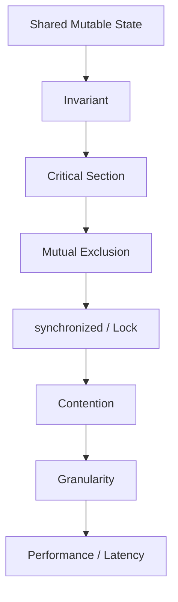
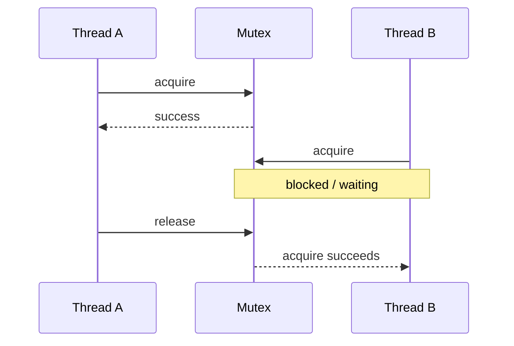
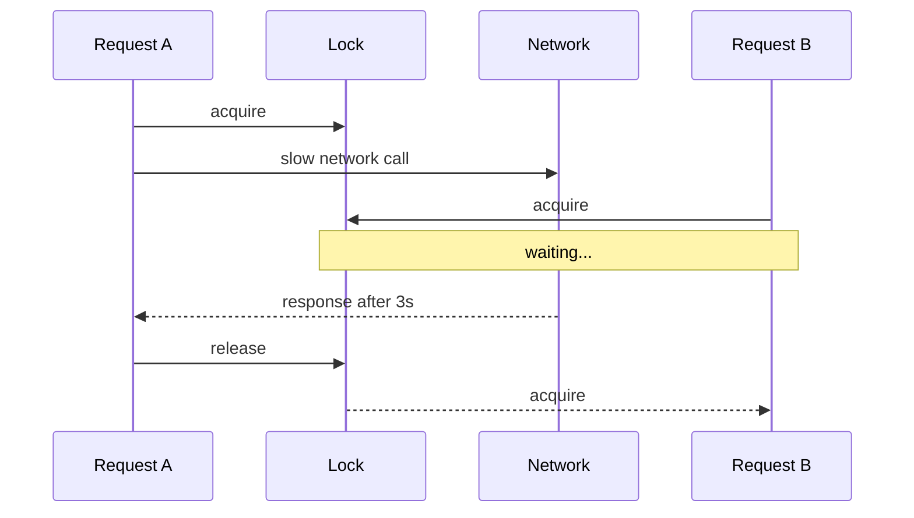
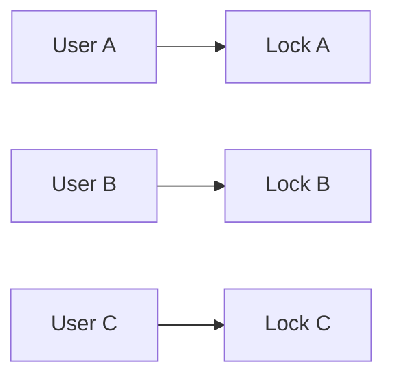
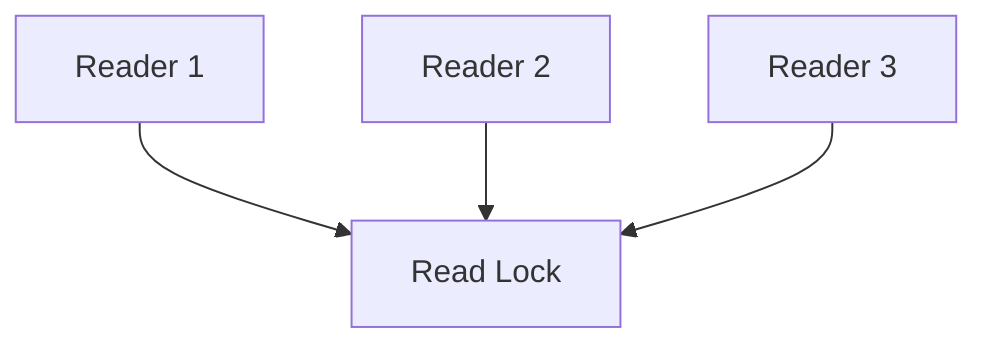
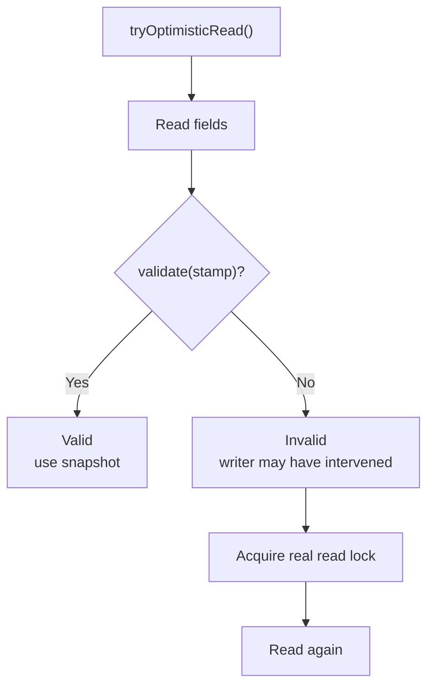
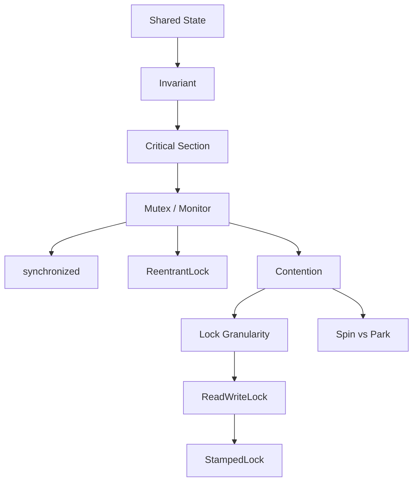

# 2.3 Mutex, Monitor & Lock Contention

## Mental model chung

Toàn bộ phần này xoay quanh một câu hỏi:

> **Khi nhiều thread cùng truy cập shared mutable state, làm sao bảo vệ invariant mà không tạo quá nhiều contention?**

Flow tư duy:



Điểm cực kỳ quan trọng:

> **Lock không chỉ bảo vệ một biến. Lock bảo vệ một invariant và toàn bộ operation cần atomic để giữ invariant đó.**

---

# Q068. [P0] Critical section là gì, và mutex bảo vệ nó như thế nào?

## Ý bật ra đầu tiên

Critical section là đoạn code:

```text
access / modify shared mutable state
```

mà ta không muốn nhiều thread thực hiện đồng thời nếu điều đó có thể phá correctness.

Mutex đảm bảo:

```text
at most one owner
at a time
```

---

## Ví dụ

```java
if (balance >= amount) {
    balance -= amount;
}
```

Nếu hai thread cùng chạy:

```text
Thread A: check balance = 100
Thread B: check balance = 100

A withdraw 80
B withdraw 80
```

Invariant:

```text
balance >= 0
```

có thể bị phá.

Critical section thực sự phải là:

```text
check
+
update
```

không chỉ riêng assignment.

---

## Dùng mutex

Conceptually:

```java
lock();

try {
    if (balance >= amount) {
        balance -= amount;
    }
} finally {
    unlock();
}
```

Flow:



Trong một thời điểm:

```text
Thread A inside critical section
OR
Thread B inside critical section

không phải cả hai
```

---

## Mutex giải quyết gì?

Chủ yếu:

```text
mutual exclusion
→ atomicity của critical section
```

Và với lock đúng chuẩn trong Java, lock/unlock còn tạo:

```text
happens-before
→ visibility
→ ordering
```

giữa các thread sử dụng cùng synchronization mechanism.

---

## Trade-off

Mutex bảo vệ correctness nhưng có giá:

```text
contention
blocking / parking
context switching
queueing latency
less parallelism
```

Do đó:

> Critical section nên đủ lớn để bảo vệ invariant, nhưng không lớn hơn cần thiết.

---

## Câu chốt

> Critical section là phần code thao tác shared state mà cần được thực hiện như một logical atomic operation. Mutex bảo vệ nó bằng mutual exclusion: tại một thời điểm chỉ một thread được sở hữu lock và đi vào critical section, nhờ đó tránh các interleaving phá invariant.

---

# Q069. [P0] Khi nào bạn chọn `synchronized`, khi nào chọn `ReentrantLock`?

## Câu đầu tiên

> Nếu chỉ cần mutual exclusion đơn giản, tôi thường ưu tiên `synchronized`. Tôi chọn `ReentrantLock` khi cần những capability nâng cao hơn.

---

# `synchronized`

Ví dụ:

```java
synchronized (lock) {
    update();
}
```

Ưu điểm:

```text
syntax đơn giản
automatic unlock
exception-safe
JVM optimization tốt
ít khả năng quên unlock
```

Rất phù hợp:

```text
simple critical section
simple monitor pattern
không cần timeout / interruptible acquisition
```

---

# `ReentrantLock`

Ví dụ:

```java
Lock lock = new ReentrantLock();

lock.lock();
try {
    update();
} finally {
    lock.unlock();
}
```

Nhiều code hơn nhưng có thêm capability.

---

## Khi nào ReentrantLock đáng dùng?

### 1. `tryLock()`

```java
if (lock.tryLock()) {
    try {
        ...
    } finally {
        lock.unlock();
    }
}
```

Cho phép:

```text
không block vô hạn
```

---

### 2. Timed lock

```java
lock.tryLock(100, TimeUnit.MILLISECONDS);
```

Có thể đặt deadline.

---

### 3. Interruptible acquisition

```java
lock.lockInterruptibly();
```

Thread đang chờ lock có thể được interrupt.

---

### 4. Multiple Conditions

```java
Condition notEmpty = lock.newCondition();
Condition notFull = lock.newCondition();
```

Một lock có thể có nhiều wait sets logic.

Trong khi intrinsic monitor có:

```text
wait()
notify()
notifyAll()
```

trên một monitor wait set.

---

### 5. Fairness option

```java
new ReentrantLock(true);
```

có thể yêu cầu fairness policy gần FIFO hơn.

Nhưng fairness thường:

```text
throughput ↓
```

nên không mặc định tốt hơn.

---

# Decision rule

```text
Need only basic mutual exclusion?
→ synchronized

Need:
tryLock
timeout
interruptible wait
multiple Conditions
explicit lock control
→ ReentrantLock
```

---

## Không nên trả lời

> ReentrantLock nhanh hơn synchronized.

Không có rule chung như vậy.

JVM đã optimize `synchronized` rất mạnh.

Performance phải:

```text
measure
benchmark
```

---

## Câu chốt

> Tôi mặc định chọn `synchronized` khi chỉ cần mutual exclusion đơn giản vì code an toàn và dễ maintain hơn. Tôi chuyển sang `ReentrantLock` khi cần explicit capabilities như `tryLock`, timeout, interruptible acquisition, fairness hoặc nhiều `Condition`.

---

# Q070. [P1] Hai method cùng sửa một object nhưng dùng hai lock khác nhau thì invariant chung được bảo vệ đến đâu?

## Ý đầu tiên

Nếu cùng bảo vệ một invariant nhưng dùng:

```text
different locks
```

thì mutual exclusion giữa hai operations **không tồn tại**.

---

## Ví dụ

```java
class Account {
    int balance;

    Object lockA = new Object();
    Object lockB = new Object();

    void deposit(int x) {
        synchronized (lockA) {
            balance += x;
        }
    }

    void withdraw(int x) {
        synchronized (lockB) {
            balance -= x;
        }
    }
}
```

Thread A có thể giữ:

```text
lockA
```

trong khi Thread B đồng thời giữ:

```text
lockB
```

và cả hai cùng sửa:

```text
balance
```

---

## Sơ đồ

```text
Thread A
lockA
 ↓
balance += x

             cùng lúc

Thread B
lockB
 ↓
balance -= y
```

Hai lock độc lập:

```text
lockA != lockB
```

nên không tạo mutual exclusion với nhau.

---

# Rule rất quan trọng

> **Một invariant cần một synchronization discipline nhất quán.**

Nếu invariant liên quan:

```text
a + b = total
```

thì tất cả operation thay đổi:

```text
a
b
total
```

phải phối hợp theo cùng locking strategy.

---

# Lock không bảo vệ object theo phép thuật

Một misconception:

> Tôi synchronized một method nên object được bảo vệ.

Không.

Lock chỉ phối hợp với:

```text
code khác cũng acquire cùng lock
```

Nếu Thread A dùng lock X và B không dùng X:

```text
X không bảo vệ A khỏi B
```

---

## Câu chốt

> Hai critical sections chỉ mutual-exclusive nếu chúng sử dụng cùng synchronization mechanism. Nếu hai methods cùng sửa một invariant nhưng acquire hai lock khác nhau, chúng vẫn có thể chạy đồng thời và invariant không được bảo vệ đầy đủ. Vì vậy lock phải được chọn dựa trên invariant, không dựa riêng từng method.

---

# Q071. [P1] Reentrant lock nghĩa là gì; owner lấy cùng lock nhiều lần thì phải giải phóng thế nào?

## Reentrant nghĩa là gì?

Thread đang giữ lock có thể acquire lại **chính lock đó** mà không tự deadlock.

Ví dụ:

```java
synchronized void methodA() {
    methodB();
}

synchronized void methodB() {
}
```

Cả hai lock:

```text
this
```

Thread chạy `methodA()` đã giữ monitor của `this`.

Sau đó gọi `methodB()`.

Nếu monitor không reentrant:

```text
thread sẽ chờ chính lock mà nó đang giữ
→ self-deadlock
```

Java intrinsic monitors là reentrant.

`ReentrantLock` cũng vậy.

---

# Hold count

Conceptually:

```text
Thread A lock()
hold count = 1

Thread A lock()
hold count = 2

Thread A unlock()
hold count = 1

Thread A unlock()
hold count = 0
→ lock actually free
```

---

## Vì vậy acquire bao nhiêu lần thì phải release tương ứng

```java
lock.lock();

try {
    lock.lock();
    try {
        ...
    } finally {
        lock.unlock();
    }
} finally {
    lock.unlock();
}
```

Nếu acquire hai lần nhưng unlock một lần:

```text
hold count remains 1
```

thread khác vẫn không lấy được lock.

---

## Câu chốt

> Reentrant nghĩa là thread đang sở hữu lock có thể acquire lại cùng lock mà không bị block bởi chính mình. Lock giữ một hold count; mỗi successful acquisition tăng count và mỗi unlock giảm count. Lock chỉ thực sự được giải phóng cho thread khác khi count trở về 0.

---

# Q072. [P1] Khi có exception, việc giải phóng lock bằng `synchronized` khác gì dùng `Lock` tường minh?

## `synchronized`

Ví dụ:

```java
synchronized (lock) {
    riskyOperation();
}
```

Nếu:

```text
riskyOperation()
→ throws exception
```

khi control rời synchronized block:

```text
monitor automatically released
```

Đây là advantage lớn.

---

# `ReentrantLock`

```java
lock.lock();

riskyOperation();

lock.unlock();
```

Nếu exception xảy ra:

```text
lock.unlock()
```

không chạy.

Lock bị giữ lại.

Thread khác có thể:

```text
block forever
```

---

# Pattern bắt buộc

```java
lock.lock();
try {
    riskyOperation();
} finally {
    lock.unlock();
}
```

Dù:

```text
normal return
exception
```

`finally` vẫn thực hiện unlock.

---

# Một pattern tốt hơn

Acquire trước `try`:

```java
lock.lock();
try {
    ...
} finally {
    lock.unlock();
}
```

không phải:

```java
try {
    lock.lock();
    ...
} finally {
    lock.unlock();
}
```

đặc biệt với acquisition có thể fail/throw, vì ta chỉ nên unlock lock mà mình thực sự acquire thành công.

---

## Câu chốt

> `synchronized` có structured locking: JVM tự release monitor khi block kết thúc, kể cả do exception. Với explicit `Lock`, programmer chịu trách nhiệm release, nên pattern chuẩn là acquire rồi `try/finally` để chắc chắn `unlock()` luôn chạy.

---

# Q073. [P1] Khi nào cần timed hoặc interruptible lock acquisition, và xử lý việc không lấy được lock ra sao?

## Problem

`lock.lock()` có thể:

```text
wait indefinitely
```

Nếu application có:

```text
request deadline
cancellation
responsive shutdown
```

điều đó có thể không phù hợp.

---

# Timed acquisition

Ví dụ:

```java
if (lock.tryLock(100, TimeUnit.MILLISECONDS)) {
    try {
        ...
    } finally {
        lock.unlock();
    }
} else {
    // fallback
}
```

Phù hợp khi:

```text
request có SLA/deadline

better fail fast than wait indefinitely

avoid cascading latency
```

---

# Interruptible acquisition

```java
lock.lockInterruptibly();
```

Hữu ích khi thread có thể bị:

```text
cancel
shutdown
timeout mechanism interrupt
```

trong khi đang chờ lock.

---

# Nếu không lấy được lock thì sao?

Đây là business/system design decision.

Có thể:

```text
return timeout/error

retry với bounded backoff

fallback path

enqueue work

skip optional operation

propagate cancellation
```

---

# Không nên

```text
while (!tryLock()) {
}
```

vô hạn mà không backoff/deadline.

Hoặc:

```text
catch InterruptedException
→ ignore
```

một cách vô thức.

---

# Ví dụ API request

Request SLA:

```text
200 ms
```

Lock đã chờ:

```text
180 ms
```

Việc tiếp tục block 5 giây:

```text
không còn giá trị
```

Tốt hơn có thể:

```text
fail fast
```

và bảo vệ system latency.

---

## Câu chốt

> Timed acquisition hữu ích khi work có deadline và việc chờ vô hạn không còn giá trị. Interruptible acquisition hữu ích khi thread cần hỗ trợ cancellation hoặc shutdown. Khi không lấy được lock, tôi xử lý như một failure path rõ ràng: timeout, bounded retry, fallback hoặc propagate cancellation thay vì chờ vô hạn.

---

# Q074. [P1] Nếu giữ shared lock trong lúc gọi một dịch vụ mạng chậm, những request khác bị ảnh hưởng thế nào?

## Ý bật ra đầu tiên

> Không giữ lock qua slow/unbounded I/O nếu không thật sự cần thiết.

---

## Ví dụ

```java
synchronized (lock) {
    updateLocalState();

    remoteService.call(); // 3 seconds

    updateLocalStateAgain();
}
```

Trong suốt 3 giây:

```text
lock still held
```

Mọi thread cần lock đó:

```text
BLOCKED
```

---

## Sơ đồ



Một network call chậm có thể biến:

```text
one slow request
```

thành:

```text
many blocked requests
```

Đây là:

> lock convoy / contention amplification.

---

# Tail latency

Nếu nhiều request queue sau lock:

```text
R1: network 3 sec
R2 waits
R3 waits
R4 waits
...
```

latency của R4 có thể cao hơn nhiều.

---

# Throughput giảm

Trong thời gian A đang chờ network:

```text
critical resource không được sử dụng
```

nhưng lock vẫn không cho thread khác tiến hành.

---

# Better pattern

Nếu có thể:

```text
lock
↓
read/update minimal local state
↓
unlock

network call

lock
↓
validate/update result
↓
unlock
```

Ví dụ:

```java
State snapshot;

synchronized (lock) {
    snapshot = copyState();
}

Result result = remoteCall(snapshot);

synchronized (lock) {
    applyIfStillValid(result);
}
```

---

# Nhưng có trade-off

Khi release lock trước I/O:

```text
state có thể thay đổi trong lúc network call
```

nên phải giải quyết:

```text
version check
optimistic concurrency
state validation
idempotency
```

Không thể chỉ release lock một cách mù quáng.

---

## Câu chốt

> Giữ shared lock trong slow network call làm tất cả request cần cùng lock phải chờ theo latency của external service, gây contention amplification và tail latency rất cao. Tôi cố thu nhỏ critical section và thực hiện I/O ngoài lock, nhưng phải revalidate state khi quay lại vì state có thể đã thay đổi.

---

# Q075. [P2] Bạn so sánh một coarse-grained lock với lock theo key hoặc partition về correctness, contention và quản lý bộ nhớ như thế nào?

## Coarse-grained lock

Một lock bảo vệ rất nhiều state.

Ví dụ:

```java
synchronized (globalLock) {
    updateUser(userId);
}
```

Mọi user dùng chung:

```text
globalLock
```

---

## Ưu điểm

```text
reasoning đơn giản
correctness dễ chứng minh
ít lock objects
ít lock-order problems
```

---

## Nhược điểm

```text
high contention
low parallelism
unrelated operations block each other
```

Ví dụ:

```text
update User A
```

block:

```text
update User B
```

dù chúng độc lập.

---

# Fine-grained / per-key locking

Concept:

```text
User A → Lock A
User B → Lock B
User C → Lock C
```



A và B có thể update parallel.

---

## Benefit

```text
contention ↓
parallelism ↑
```

đặc biệt khi keys phân tán tốt.

---

# Nhưng complexity tăng

## 1. Lock lifecycle

Nếu tạo:

```java
Map<Key, Lock>
```

và key không giới hạn:

```text
locks có thể tăng vô hạn
```

→ memory leak.

---

## 2. Race khi create/remove lock

Ví dụ:

```text
Thread A lấy Lock(key)
Thread B remove Lock(key)
Thread C tạo Lock mới cho cùng key
```

A và C có thể vô tình dùng:

```text
different locks for same key
```

→ correctness broken.

---

## 3. Multi-key operations

Nếu operation cần:

```text
Account A
+
Account B
```

phải acquire hai locks.

Ngay lập tức xuất hiện:

```text
deadlock / lock ordering
```

problem.

---

# Partition / striped locks

Middle ground:

```text
hash(key) % N
→ one of N locks
```

Ví dụ:

```text
100 million keys
256 locks
```

Không cần 100M lock objects.

Trade-off:

```text
less memory
simpler lifecycle

but

unrelated keys có thể hash cùng partition
→ contention
```

---

# Comparison

| Strategy                | Correctness  | Contention | Complexity/Memory |
| ----------------------- | ------------ | ---------- | ----------------- |
| Global lock             | Dễ reasoning | Cao        | Thấp              |
| Per-key lock            | Khó hơn      | Thấp       | Có thể rất cao    |
| Striped/partition locks | Trung bình   | Trung bình | Bounded           |

---

## Câu chốt

> Coarse-grained lock đơn giản và dễ chứng minh correctness nhưng tạo contention giữa cả operations không liên quan. Per-key locking tăng parallelism nhưng phức tạp về lifecycle, multi-key ordering và có nguy cơ map lock tăng vô hạn. Lock striping là điểm cân bằng: giới hạn số lock nhưng chấp nhận một mức contention do nhiều keys dùng chung partition.

---

# Q076. [P2] Khi nào spinning có thể hợp lý hơn parking; lấy monitor không tranh chấp có nhất thiết phải vào kernel không?

## Hai cách khi lock đang bận

Thread có thể:

### Spin

```text
while (lock unavailable) {
    keep checking
}
```

Thread vẫn sử dụng CPU.

### Park/block

```text
stop running
↓
scheduler can run something else
```

---

# Khi nào spinning hợp lý?

Khi kỳ vọng:

```text
lock hold time rất ngắn
```

Ví dụ owner sắp release trong:

```text
tens/hundreds of cycles
```

Nếu park:

```text
thread → kernel/scheduler
sleep
wake later
```

overhead có thể còn lớn hơn việc spin ngắn.

---

# Trade-off

```text
Spin

+ avoid sleep/wakeup overhead
+ low latency nếu wait rất ngắn

- burns CPU
- bad nếu wait lâu
- bad khi oversubscribed
```

Parking:

```text
+ frees CPU for useful work
+ good for long waits

- scheduling / wakeup overhead
- higher resume latency
```

---

# Adaptive strategy

Runtime có thể:

```text
spin briefly
↓
if still unavailable
↓
park
```

Đây là hybrid approach phổ biến.

---

# Monitor không tranh chấp có phải vào kernel không?

> Không nhất thiết.

Modern JVM/CPU có fast paths để acquire uncontended monitor/lock trong user space với atomic instructions và metadata manipulation.

Conceptually:

```text
Thread A
↓
CAS / lock metadata fast path
↓
acquired
```

không cần system call trong common uncontended case.

Kernel-level blocking thường quan trọng hơn khi:

```text
contention thật sự
thread cần park/wake
```

---

# Insight quan trọng

Đừng nghĩ:

```text
synchronized
→ kernel mutex
→ system call every time
```

Quá đơn giản và thường sai với JVM hiện đại.

---

## Câu chốt

> Spinning hợp lý khi lock dự kiến được release rất nhanh và CPU capacity còn dư, vì parking/wakeup có thể đắt hơn. Nếu thời gian chờ dài hoặc có nhiều runnable threads, parking tốt hơn vì không đốt CPU. Một uncontended Java monitor cũng không nhất thiết vào kernel; JVM thường có fast path trong user space và chỉ cần cơ chế blocking nặng hơn khi contention tăng.

---

# Q077. [P2] Khi nào `ReadWriteLock` có thể tốt hơn mutex, và khi nào nó lại làm throughput hoặc thời gian chờ của writer kém hơn?

## Ý tưởng

Normal mutex:

```text
Reader A
Reader B
Writer C
```

chỉ một thread vào critical section tại một thời điểm.

ReadWriteLock phân biệt:

```text
read lock
write lock
```

---

# Rule

```text
Reader + Reader
→ allowed concurrently

Reader + Writer
→ conflict

Writer + Writer
→ conflict
```

---

# Khi nào có lợi?

Workload:

```text
reads rất nhiều
writes hiếm
```

và read critical section đủ đáng kể.

Ví dụ:

```text
95% reads
5% writes
```

Nhiều readers có thể chạy parallel:



Throughput có thể tăng.

---

# Nhưng ReadWriteLock có overhead

Acquisition phức tạp hơn mutex:

```text
reader count
writer ownership
queues
fairness
state transitions
```

Nếu critical section rất nhỏ:

```text
coordination overhead
>
parallel-read benefit
```

mutex có thể nhanh hơn.

---

# Writer starvation / latency

Giả sử readers liên tục tới:

```text
R1
R2
R3
R4
R5
...
```

writer:

```text
W
```

có thể phải chờ cho:

```text
all readers leave
```

Tùy fairness policy, reader-heavy workload có thể làm writer latency rất cao.

---

# Writes frequent

Nếu:

```text
reads = 55%
writes = 45%
```

writers thường xuyên exclusive.

ReadWriteLock gần như trở thành:

```text
complex mutex
```

nhưng có thêm overhead.

---

# Critical read section quá ngắn

Ví dụ read chỉ:

```java
return value;
```

cho nhiều readers parallel có thể không mang đủ lợi ích để bù lock bookkeeping.

---

# Decision

ReadWriteLock phù hợp khi:

```text
read-dominant workload
reads reasonably expensive/long
low write frequency
measured contention exists
```

Không chỉ vì:

> Có nhiều reads.

---

## Câu chốt

> `ReadWriteLock` có thể tốt khi workload chủ yếu là reads và read critical sections đủ dài để concurrent readers mang lại lợi ích. Nhưng nó có bookkeeping phức tạp hơn mutex, writers vẫn cần exclusivity, và reader-heavy workloads có thể làm writer wait lâu hoặc starvation tùy policy. Vì vậy phải benchmark thay vì mặc định read-write lock tốt hơn.

---

# Q078. [P3] Khi dùng optimistic read của `StampedLock`, cần kiểm tra gì trước khi sử dụng kết quả đã đọc?

## Mental model

Optimistic read nghĩa là:

> Đọc mà chưa thực sự giữ read lock exclusive/shared theo cách truyền thống, rồi kiểm tra sau xem có writer chen vào không.

---

# Ví dụ

```java
long stamp = lock.tryOptimisticRead();

double currentX = x;
double currentY = y;

if (!lock.validate(stamp)) {
    stamp = lock.readLock();
    try {
        currentX = x;
        currentY = y;
    } finally {
        lock.unlockRead(stamp);
    }
}
```

---

# Flow



---

# Vì sao phải `validate()`?

Giả sử invariant:

```text
x và y phải thuộc cùng một state version
```

Thread reader:

```text
read x = old value
```

Writer update:

```text
x
y
```

Reader sau đó:

```text
read y = new value
```

Reader có thể có snapshot:

```text
old x
+
new y
```

không từng tồn tại như một consistent state.

---

# Optimistic read không phải lock bình thường

Trong khoảng:

```text
tryOptimisticRead()
↓
read fields
↓
validate()
```

writer có thể chạy.

Do đó:

> Không nên thực hiện side effect dựa trên dữ liệu optimistic trước khi validation thành công.

---

# Nếu validate fail

Phải:

```text
acquire read lock
↓
read lại state
```

Không chỉ validate rồi tiếp tục với data cũ.

---

# Khi nào hữu ích?

```text
reads cực kỳ thường xuyên
writes hiếm
read operation ngắn
contention thấp
```

Ưu điểm:

```text
reader overhead rất thấp
writer không bị reader block chỉ vì optimistic read
```

Nhưng reasoning phức tạp hơn.

---

# Nuance

`StampedLock` cũng:

```text
không reentrant
```

đây là khác biệt đáng nhớ so với `ReentrantLock` và intrinsic monitor.

Không cần nói nếu interviewer chỉ hỏi optimistic read, nhưng là một follow-up tốt.

---

## Câu chốt

> Với `StampedLock` optimistic read, tôi phải gọi `validate(stamp)` sau khi đọc và trước khi tin rằng snapshot consistent. Nếu validation fail, nghĩa là có thể đã có writer can thiệp, nên tôi acquire read lock thật và đọc lại state. Không nên tạo side effects dựa trên optimistic data trước khi validation thành công.

---

# Liên kết Q068 → Q078

Đây thực chất là một reasoning chain:



Mental flow khi interviewer đưa concurrency problem:

```text
Shared state là gì?
↓
Invariant là gì?
↓
Operation nào phải atomic?
↓
Lock nào bảo vệ invariant?
↓
Lock scope có quá rộng không?
↓
Có contention không?
↓
Có cần finer-grained / RW / optimistic strategy không?
```

---

# Những distinction phải thuộc

## 1. Lock bảo vệ invariant, không chỉ variable

```text
lock
→ logical operation
→ invariant
```

không phải:

```text
lock
→ magic protection cho object
```

---

## 2. `synchronized` vs `ReentrantLock`

```text
synchronized
→ simpler
→ automatic unlock
→ good default
```

```text
ReentrantLock
→ tryLock
→ timed
→ interruptible
→ Condition
→ explicit control
```

---

## 3. Reentrant ≠ acquire một lần

```text
acquire × N
→ release × N
```

---

## 4. Contention ≠ chỉ CPU cost

Nó còn tạo:

```text
queueing
tail latency
blocking
context switching
reduced parallelism
```

---

## 5. Fine-grained locking không miễn phí

```text
contention ↓

but

complexity ↑
lock lifecycle ↑
deadlock risk ↑
memory overhead ↑
```

---

# Cheat sheet theo priority

## Q068 [P0]

```text
Critical section
→ shared-state operation cần atomic

Mutex
→ one owner at a time
```

---

## Q069 [P0]

```text
Simple mutual exclusion
→ synchronized

Need tryLock / timeout / interruptible / Conditions
→ ReentrantLock
```

---

## Q070 [P1]

```text
same invariant
+
different locks
=
no mutual exclusion
```

---

## Q071 [P1]

```text
Reentrant
→ owner can acquire same lock again

hold count:
lock++
unlock--

free at 0
```

---

## Q072 [P1]

```text
synchronized
→ automatic release

Lock
→ try/finally mandatory
```

---

## Q073 [P1]

```text
Timed lock
→ deadline

Interruptible lock
→ cancellation

failure
→ timeout / retry / fallback
```

---

## Q074 [P1]

Câu phải bật ngay:

> **Không giữ shared lock qua slow/unbounded I/O nếu tránh được.**

Vì:

```text
1 slow call
→ many blocked requests
```

---

## Q075 [P2]

```text
Global lock
→ simple
→ high contention

Per-key
→ parallel
→ lifecycle/deadlock complexity

Striped
→ bounded compromise
```

---

## Q076 [P2]

```text
short wait
→ spin may win

long wait
→ park

uncontended monitor
→ does NOT necessarily enter kernel
```

---

## Q077 [P2]

```text
ReadWriteLock

good:
many reads
few writes
nontrivial read sections

bad:
frequent writes
tiny sections
writer starvation/latency
```

---

## Q078 [P3]

```text
optimistic read
↓
read
↓
validate

valid
→ use

invalid
→ real read lock
→ re-read
```

---

# Câu tổng hợp tốt khi interviewer hỏi: “How do you choose a locking strategy?”

> Tôi bắt đầu từ shared state và invariant cần bảo vệ, rồi xác định toàn bộ compound operation phải atomic. Sau đó tôi chọn primitive đơn giản nhất đáp ứng yêu cầu, thường là `synchronized` cho mutual exclusion cơ bản. Nếu cần timeout, interruptible acquisition hay nhiều condition queues, tôi cân nhắc `ReentrantLock`. Sau khi correctness rõ ràng, tôi mới tối ưu contention bằng cách giảm thời gian giữ lock, tránh I/O trong critical section hoặc thay đổi lock granularity. Tôi chỉ chuyển sang read-write hoặc optimistic locking khi workload thực tế chứng minh rằng complexity bổ sung là đáng giá.

Mental model:

```text
Correctness first
↓
Invariant
↓
Minimal sufficient lock
↓
Measure contention
↓
Optimize granularity
↓
Advanced lock only if justified
```

Đây là cách trả lời mạnh hơn rất nhiều so với bắt đầu bằng việc liệt kê `synchroniz
