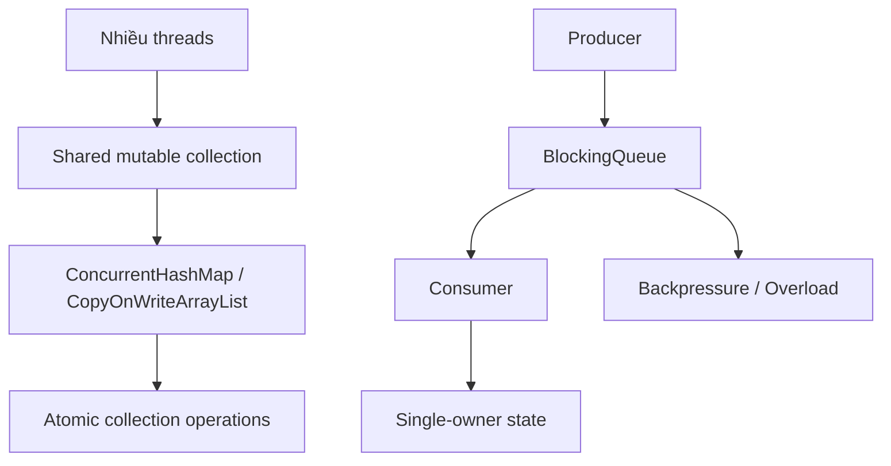
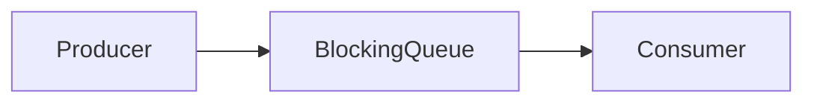
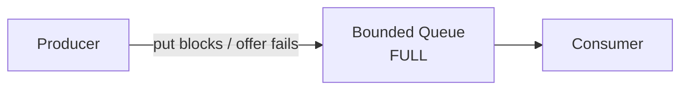
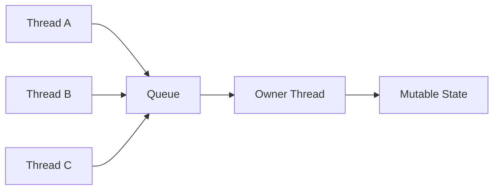
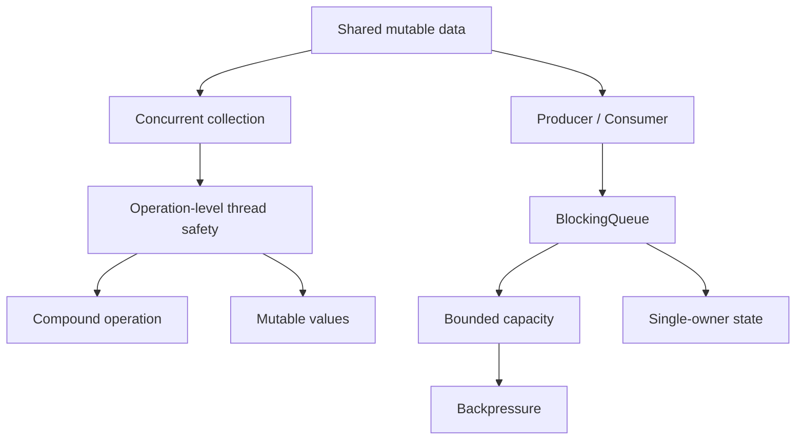

# 2.5 Concurrent Collections & Producer–Consumer

## Mental model chung

Phần này nối hai ý lớn:

```text
1. Shared data structure giữa nhiều thread
2. Tách producer và consumer bằng queue
```

Flow tổng quát:



Một câu rất quan trọng:

> **Concurrent collection chỉ bảo đảm thread safety ở mức các operation mà nó cung cấp; nó không tự động làm toàn bộ business workflow hay object bên trong trở thành thread-safe.**

---

# Q086. [P0] ConcurrentHashMap khác HashMap về bảo đảm truy cập đồng thời như thế nào?

## Ý bật ra đầu tiên

```text
HashMap
→ không thread-safe cho concurrent mutation

ConcurrentHashMap
→ được thiết kế cho concurrent access
```

---

## HashMap

`HashMap` không cung cấp synchronization guarantee cho nhiều thread cùng truy cập khi có mutation.

Ví dụ:

```java
Map<String, Integer> map = new HashMap<>();
```

Nếu nhiều thread cùng:

```java
map.put(...)
map.remove(...)
map.get(...)
```

trong khi có concurrent writes mà không có external synchronization:

```text
correctness không được đảm bảo
```

Có thể gặp:

```text
lost updates
inconsistent observations
unexpected behavior
```

---

## ConcurrentHashMap

```java
ConcurrentHashMap<String, Integer> map =
        new ConcurrentHashMap<>();
```

được thiết kế để:

```text
nhiều thread read/write đồng thời
```

mà không cần một global external lock cho mọi operation đơn lẻ.

---

# Điểm quan trọng: concurrency cao hơn

Không nên hình dung:

```text
ConcurrentHashMap
=
HashMap + synchronized toàn bộ map
```

Nếu mọi operation đều dùng một global lock thì concurrency sẽ rất thấp.

`ConcurrentHashMap` dùng các kỹ thuật fine-grained hơn để cho phép:

```text
nhiều reads đồng thời
nhiều updates trên các vùng khác nhau
```

có thể tiến triển song song hơn.

Implementation detail thay đổi giữa các JDK, nên khi interview không nên khóa câu trả lời vào kiến trúc segment của Java cũ.

---

# Atomicity ở mức operation

Các operation như:

```java
get()
put()
remove()
putIfAbsent()
compute()
computeIfAbsent()
```

có các thread-safety/atomicity guarantee tương ứng của collection.

Nhưng:

```text
nhiều method calls ghép lại
```

không tự động trở thành một atomic transaction.

Đây chính là Q087.

---

# Iteration

Một điểm đáng biết:

Iterator của `ConcurrentHashMap` thường được thiết kế để có thể coexist với concurrent modification thay vì fail-fast theo cách điển hình của `HashMap`.

Nhưng:

> Nó không có nghĩa iterator cho bạn một snapshot transactionally consistent của toàn map.

---

## Trade-off

`ConcurrentHashMap` cho:

```text
+ thread-safe concurrent access
+ tốt hơn global synchronized map về contention
```

đổi lại:

```text
+ implementation phức tạp hơn
+ không biến compound workflow thành atomic
+ values bên trong vẫn có thể mutable và unsafe
```

---

## Câu chốt

> `HashMap` không an toàn khi có concurrent mutation mà không có synchronization bên ngoài. `ConcurrentHashMap` cung cấp thread-safe concurrent operations và cho phép mức concurrency cao hơn thay vì khóa toàn bộ map. Nhưng guarantee đó áp dụng cho các operation mà map cung cấp, không tự động làm nhiều operation ghép lại thành atomic.

---

# Q087. [P1] `containsKey` rồi `put` trên ConcurrentHashMap có phải một thao tác atomic không; bạn biểu diễn insert-if-absent thế nào?

## Câu đầu tiên

> Không.

Hai operation riêng:

```java
containsKey()
put()
```

đều thread-safe.

Nhưng sequence:

```text
check
then
act
```

không atomic.

---

# Ví dụ

```java
if (!map.containsKey(key)) {
    map.put(key, value);
}
```

Hai thread có thể interleave:

```text
Thread A:
containsKey(key) → false

Thread B:
containsKey(key) → false

Thread A:
put(key, valueA)

Thread B:
put(key, valueB)
```

Kết quả phụ thuộc timing.

---

# Đây là classic check-then-act race

Mental model:

```text
thread-safe operation
+
thread-safe operation

≠

atomic compound operation
```

---

# Insert-if-absent

Dùng operation được thiết kế atomic:

```java
map.putIfAbsent(key, value);
```

Ví dụ:

```java
V existing = map.putIfAbsent(key, newValue);

if (existing == null) {
    // insert thành công
} else {
    // đã tồn tại
}
```

---

# Nếu value cần tính toán

Có thể dùng:

```java
map.computeIfAbsent(key, k -> loadValue(k));
```

Thay vì:

```java
if (!map.containsKey(key)) {
    map.put(key, loadValue(key));
}
```

---

# Nhưng cần cẩn thận với mapping function

Không nên làm mapping function:

```text
quá chậm
blocking I/O dài
complex side effects
recursive map modification không phù hợp
```

vì operation của concurrent collection có thể cần internal coordination và function có thể ảnh hưởng contention.

---

# Business atomicity vẫn cần suy nghĩ

Ví dụ:

```java
if (map.putIfAbsent(orderId, PROCESSING) == null) {
    chargeCustomer();
}
```

Map insertion atomic.

Nhưng toàn bộ:

```text
insert state
+
external payment
+
update DB
```

không tự nhiên trở thành transaction.

Phải phân biệt:

```text
collection-level atomicity
vs
business-level atomicity
```

---

## Câu chốt

> `containsKey` rồi `put` không atomic vì thread khác có thể chen vào giữa hai call. Với insert-if-absent tôi dùng `putIfAbsent` hoặc `computeIfAbsent`, vì chúng biểu diễn trực tiếp compound operation cần atomic ở mức map.

---

# Q088. [P2] Nếu value trong ConcurrentHashMap là object mutable, những vấn đề concurrency nào vẫn còn?

Đây là distinction rất quan trọng:

> Thread-safe container không đồng nghĩa thread-safe contents.

---

# Ví dụ

```java
ConcurrentHashMap<String, Account> accounts =
        new ConcurrentHashMap<>();
```

`Account`:

```java
class Account {
    int balance;
}
```

Hai thread:

```java
Account a = accounts.get("A");
a.balance++;
```

và:

```java
Account a = accounts.get("A");
a.balance++;
```

Map lookup:

```text
thread-safe
```

nhưng:

```text
a.balance++
```

vẫn không atomic.

---

# Container bảo vệ gì?

ConcurrentHashMap bảo vệ:

```text
mapping structure
key → value association
```

Nó không tự động bảo vệ internal fields của:

```text
value object
```

---

# Có thể gặp

```text
race condition

visibility issues

lost updates

broken invariants

unsafe iteration qua mutable nested structures
```

---

# Ví dụ compound mutable value

```java
class UserState {
    List<Order> orders;
    int total;
}
```

Nếu hai thread cùng modify:

```text
orders
+
total
```

thì invariant như:

```text
total == sum(orders)
```

có thể bị phá dù object được lấy từ `ConcurrentHashMap`.

---

# Các strategy

## 1. Immutable values

Rất mạnh:

```text
Map<Key, ImmutableValue>
```

Update bằng:

```text
replace old object bằng object mới
```

giảm shared mutable state.

---

## 2. Atomic fields

Ví dụ:

```java
class Counter {
    AtomicInteger value;
}
```

nếu invariant đơn giản.

---

## 3. Synchronize trên value

```java
Account account = map.get(id);

synchronized (account) {
    account.update(...);
}
```

nhưng cần consistent locking discipline.

---

## 4. Map atomic methods

Một số updates có thể express bằng:

```java
compute()
merge()
replace()
```

Ví dụ:

```java
map.compute(key, (k, oldValue) -> newValue(oldValue));
```

đặc biệt tốt nếu dùng immutable values.

---

## Câu chốt

> `ConcurrentHashMap` chỉ bảo vệ cấu trúc map và atomicity của các operation được document. Nếu value là mutable object và nhiều thread cùng thay đổi internal state của nó, race condition vẫn hoàn toàn có thể xảy ra. Vì vậy tôi thường ưu tiên immutable values, atomic fields hoặc synchronization riêng cho state bên trong.

---

# Q089. [P2] CopyOnWriteArrayList phù hợp với workload nào, và mỗi lần ghi phải trả chi phí gì?

## Mental model

Tên nói lên cơ chế:

```text
write
→ copy toàn bộ backing array
→ modify copy
→ publish new array
```

---

# Khi nào phù hợp?

Workload:

```text
reads rất nhiều
writes rất ít
```

Ví dụ:

```text
listeners
configuration snapshot
subscriber list ít thay đổi
```

---

# Read path

Reader có thể đọc từ một stable array snapshot.

Điều này làm reads:

```text
rất rẻ
không cần locking phức tạp cho mỗi access
```

Iterator cũng có snapshot semantics:

```text
iterator thấy state của array tại thời điểm iterator được tạo
```

Concurrent write sau đó không làm iterator thấy state mới ngay.

---

# Write path

Giả sử list có:

```text
1,000,000 elements
```

thêm một element:

```java
list.add(x);
```

conceptually:

```text
allocate array mới
copy 1,000,000 elements
append x
publish array mới
```

Chi phí:

```text
O(n) copy
+
memory allocation
+
GC pressure
```

---

# Nếu writes nhiều

Ví dụ:

```text
50% reads
50% writes
```

`CopyOnWriteArrayList` thường là lựa chọn tệ.

Mỗi write copy toàn bộ array.

---

# Memory spike

Trong lúc copy có thể tạm thời tồn tại:

```text
old array
+
new array
```

nên memory footprint tăng.

---

## Benefit

```text
+ reads rất rẻ
+ iteration stable
+ đơn giản cho read-mostly
```

Cost:

```text
- writes O(n)
- allocation lớn
- GC pressure
- data reader thấy có thể là snapshot cũ
```

---

## Câu chốt

> `CopyOnWriteArrayList` phù hợp với read-mostly workloads nơi writes rất hiếm, ví dụ listener list. Mỗi write phải tạo và copy toàn bộ backing array rồi publish version mới, nên write cost là O(n) và có thêm allocation/GC pressure. Vì vậy nó rất tốt cho nhiều reads nhưng rất tệ cho write-heavy workload.

---

# Q090. [P1] BlockingQueue nối producer và consumer như thế nào khi hai bên xử lý với tốc độ khác nhau?

## Mental model

```text
Producer
↓
Queue
↓
Consumer
```

Queue là buffer giúp hai bên:

```text
không cần chạy cùng tốc độ tại từng thời điểm
```

---

# Ví dụ



Producer:

```java
queue.put(task);
```

Consumer:

```java
Task task = queue.take();
```

---

# Nếu consumer nhanh hơn producer

Queue có thể empty.

Consumer gọi:

```java
take()
```

và block cho đến khi có item.

Thay vì:

```text
while(queue.isEmpty()) spin
```

gây tốn CPU.

---

# Nếu producer nhanh hơn consumer

Queue tích lũy items:

```text
Producer: 1000 msg/s
Consumer: 800 msg/s

queue:
+200 msg/s
```

Queue hấp thụ burst trong một khoảng thời gian.

---

# Đây là decoupling theo thời gian

Producer không cần:

```text
consumer xử lý xong ngay lập tức
```

nó chỉ cần enqueue.

Consumer xử lý độc lập theo capacity của nó.

---

# BlockingQueue còn cung cấp synchronization

Producer publish item:

```text
put
```

Consumer lấy:

```text
take
```

Concurrent queue implementation đảm bảo safe transfer theo memory-visibility semantics tương ứng.

Bạn không cần tự viết:

```text
mutex
condition
wait
notify
```

cho queue cơ bản.

---

# Nhưng queue không tạo thêm processing capacity

Nếu:

```text
producer rate > consumer rate
```

liên tục:

```text
λ_producer > λ_consumer
```

thì backlog cứ tăng.

Queue chỉ:

```text
buffer
```

không giải quyết fundamental throughput mismatch.

---

## Câu chốt

> `BlockingQueue` decouple producer và consumer bằng một thread-safe buffer. Consumer có thể block khi queue rỗng và producer có thể block khi bounded queue đầy. Điều này giúp hai bên chạy với tốc độ tức thời khác nhau, nhưng queue không giải quyết được tình huống producer rate cao hơn consumer capacity mãi mãi.

---

# Q091. [P1] Bounded queue và unbounded queue khác nhau thế nào về overload, latency và nguy cơ hết bộ nhớ?

Đây là câu cực kỳ quan trọng trong production.

---

# Unbounded Queue

Conceptually:

```java
new LinkedBlockingQueue<>();
```

không đặt capacity nhỏ hữu hạn ở application level.

Nếu producer nhanh hơn consumer:

```text
queue size
↑
↑
↑
↑
```

Producer vẫn tiếp tục enqueue.

---

# Vấn đề

## 1. Memory

Backlog có thể tăng cho tới khi:

```text
heap pressure
GC pressure
OOM
```

---

## 2. Latency

Một item mới phải đứng sau:

```text
1,000,000 queued items
```

Dù system chưa crash, latency có thể đã vô dụng.

Đây là điểm rất quan trọng:

> Queueing problem thường biểu hiện bằng latency trước khi biểu hiện bằng OOM.

---

# Bounded Queue

Ví dụ:

```java
new ArrayBlockingQueue<>(1000);
```

Queue chỉ chứa tối đa:

```text
1000 items
```

Khi đầy, system buộc phải có overload policy.

Ví dụ:

```text
block producer

reject

timeout

drop

caller-runs

shed load
```

---

# Backpressure

Bounded queue tạo cơ hội cho:

```text
backpressure
```

Flow:



Nó khiến overload được phản ánh ngược trở lại producer thay vì giấu backlog trong memory.

---

# Little's Law intuition

Rất hữu ích để reason:

```text
Queue / system size ≈ throughput × latency
```

Nếu throughput không đổi nhưng queue length tăng:

```text
latency ↑
```

---

# Trade-off

```text
Unbounded queue

+ producer ít bị block/reject
+ absorb burst lớn

- overload bị che giấu
- latency có thể tăng vô hạn
- memory/OOM risk
```

```text
Bounded queue

+ bounded memory
+ explicit overload behavior
+ backpressure

- producer có thể block/fail
- phải thiết kế rejection policy
```

---

# Production answer mạnh

> Tôi thường thích bounded queue khi có thể xác định capacity, vì nó biến overload thành một trạng thái rõ ràng thay vì để memory và latency tăng không giới hạn.

---

## Câu chốt

> Unbounded queue hấp thụ backlog nhưng nếu producer liên tục nhanh hơn consumer thì latency và memory tăng không giới hạn, cuối cùng có thể OOM. Bounded queue giới hạn backlog và buộc hệ thống thực hiện backpressure hoặc rejection, nên overload được quản lý rõ ràng hơn nhưng cần policy khi queue đầy.

---

# Q092. [P2] Nếu giao toàn bộ mutable state cho một owner thread, vấn đề đồng bộ nào giảm đi và vấn đề queueing nào xuất hiện?

Đây là pattern:

> Thread confinement / single-owner model.

---

# Ý tưởng

Thay vì:

```text
Thread A
Thread B
Thread C

cùng sửa SharedState
```

ta thiết kế:

```text
chỉ Owner Thread được mutate state
```

Các thread khác gửi message.

---

## Sơ đồ



---

# Benefit lớn nhất

Nếu chỉ owner thread truy cập mutable state:

```text
không cần mutex giữa các producers cho state đó
```

Ta giảm mạnh:

```text
race conditions
lock contention
deadlock
visibility complexity quanh shared state
```

Owner xử lý:

```text
message 1
message 2
message 3
```

tuần tự.

---

# Mental model

Thay vì:

```text
shared memory + synchronization
```

ta chuyển sang:

```text
message passing + ownership
```

---

# Nhưng vấn đề biến mất chưa?

Không.

Nó chuyển sang queueing.

---

# Problem 1 — Owner trở thành bottleneck

Nếu incoming:

```text
100,000 messages/s
```

owner xử lý:

```text
70,000 messages/s
```

backlog:

```text
+30,000/s
```

tăng mãi.

---

# Problem 2 — Latency

Message phải chờ:

```text
queue
```

trước khi owner xử lý.

Nếu một task lâu:

```text
Task A = 2 seconds
```

thì tasks phía sau bị:

```text
head-of-line blocking
```

---

# Problem 3 — Queue capacity

Lại quay về:

```text
bounded vs unbounded
```

Nếu unbounded:

```text
memory risk
```

Nếu bounded:

```text
backpressure/rejection
```

---

# Problem 4 — Một owner giới hạn parallelism

State được serialize:

```text
one owner
```

nên không tận dụng nhiều cores cho chính state machine đó.

Nếu state có thể partition:

```text
userId hash → owner shard
```

ta có thể dùng nhiều owners.

Ví dụ:

```text
Partition 0 → Owner 0
Partition 1 → Owner 1
Partition 2 → Owner 2
```

---

# Đây chính là actor/event-loop style reasoning

Ví dụ:

```text
Actor
Event loop
single-threaded state machine
```

đều dựa nhiều vào:

```text
state ownership
+
message queue
```

---

# Trade-off

```text
Single-owner

+ synchronization đơn giản
+ no lock contention trên state
+ deterministic mutation ordering
+ easier invariant reasoning

but

- queueing latency
- owner bottleneck
- head-of-line blocking
- backlog / memory pressure
- limited parallelism
```

---

## Câu chốt

> Nếu toàn bộ mutable state thuộc về một owner thread, ta loại bỏ phần lớn shared-memory synchronization cho state đó vì chỉ một thread được mutate. Nhưng contention không biến mất hoàn toàn; nó chuyển thành queueing. Owner có thể trở thành bottleneck, backlog tăng, head-of-line blocking xuất hiện và ta lại phải thiết kế capacity/backpressure cho queue.

---

# Liên kết Q086 → Q092

Toàn bộ phần này là một reasoning chain:



Mental flow khi interviewer hỏi về concurrent collection:

```text
Collection có thread-safe không?
↓
Operation nào atomic?
↓
Compound workflow có atomic không?
↓
Value bên trong có mutable không?
```

Mental flow khi hỏi producer-consumer:

```text
Producer rate?
↓
Consumer capacity?
↓
Queue bounded hay không?
↓
Backlog?
↓
Latency?
↓
Backpressure policy?
```

---

# Những distinction phải thuộc

## 1. Thread-safe container ≠ thread-safe contents

```text
ConcurrentHashMap<Key, MutableValue>
```

không làm:

```text
MutableValue
```

tự động safe.

---

## 2. Thread-safe methods ≠ atomic workflow

```text
containsKey()
+
put()
```

không atomic.

Dùng:

```text
putIfAbsent()
computeIfAbsent()
```

khi phù hợp.

---

## 3. Queue ≠ thêm processing capacity

```text
producer > consumer forever
```

thì:

```text
queue backlog grows
```

dù queue implementation tốt đến đâu.

---

## 4. Unbounded queue không thật sự "free"

Nó chuyển overload thành:

```text
memory growth
+
latency growth
```

---

## 5. Single owner loại lock nhưng thêm queue

```text
shared-memory contention ↓
```

nhưng:

```text
queueing / head-of-line / owner bottleneck ↑
```

---

# Cheat sheet theo priority

## Q086 [P0]

```text
HashMap
→ unsafe concurrent mutation

ConcurrentHashMap
→ thread-safe concurrent operations
→ higher concurrency
```

Nhưng:

```text
compound workflow not automatically atomic
```

---

## Q087 [P1]

```text
containsKey + put
→ not atomic
```

Dùng:

```text
putIfAbsent
computeIfAbsent
```

---

## Q088 [P2]

```text
Concurrent map
≠
mutable value thread-safe
```

Vẫn cần:

```text
immutability
atomic fields
locks
compute/update strategy
```

---

## Q089 [P2]

```text
CopyOnWriteArrayList

good:
read-heavy
write-rare

write:
copy entire array
→ O(n)
→ allocation/GC cost
```

---

## Q090 [P1]

```text
Producer
↓
BlockingQueue
↓
Consumer
```

Queue:

```text
absorbs temporary rate mismatch
```

nhưng:

```text
does not solve permanent throughput mismatch
```

---

## Q091 [P1]

```text
Unbounded
→ backlog/latency/memory may grow forever

Bounded
→ explicit backpressure/rejection
```

---

## Q092 [P2]

```text
Single owner

+ no shared-state lock contention

but

→ queue
→ bottleneck
→ head-of-line blocking
→ backlog
```

---

# Câu tổng hợp tốt khi interviewer hỏi:

# "How would you design thread-safe shared state?"

> Trước tiên tôi cố giảm shared mutable state. Nếu cần một shared collection, tôi dùng concurrent collection phù hợp nhưng vẫn phân biệt operation-level atomicity với business-level atomicity. Nếu values mutable, tôi vẫn cần synchronization hoặc immutable design. Với producer-consumer, tôi ưu tiên bounded queue để có backpressure rõ ràng. Nếu state có thể giao cho một owner thread, tôi có thể loại bỏ nhiều lock bằng message passing, nhưng phải chấp nhận queueing latency và nguy cơ owner trở thành bottleneck.

Mental model:

```text
Minimize shared mutable state
↓
Use correct concurrent primitive
↓
Check compound atomicity
↓
Bound the queue
↓
Design overload behavior
↓
Measure contention / backlog
```
