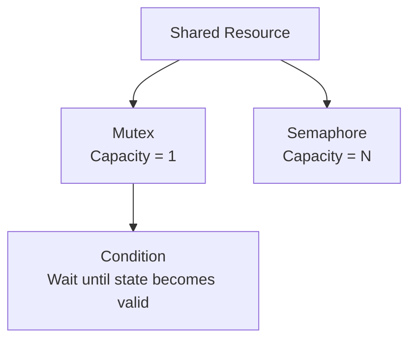
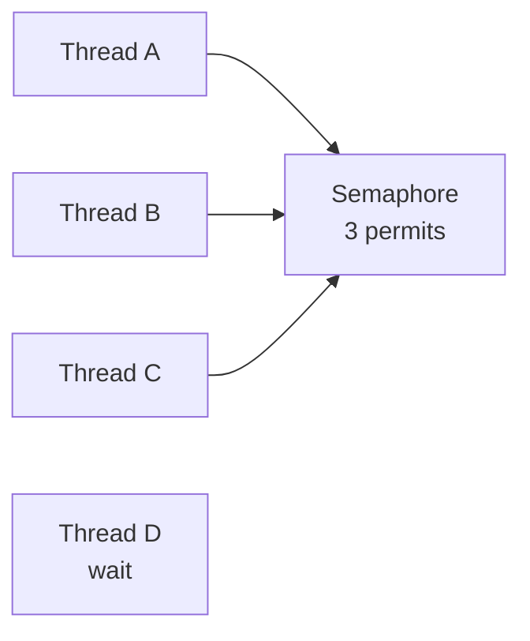
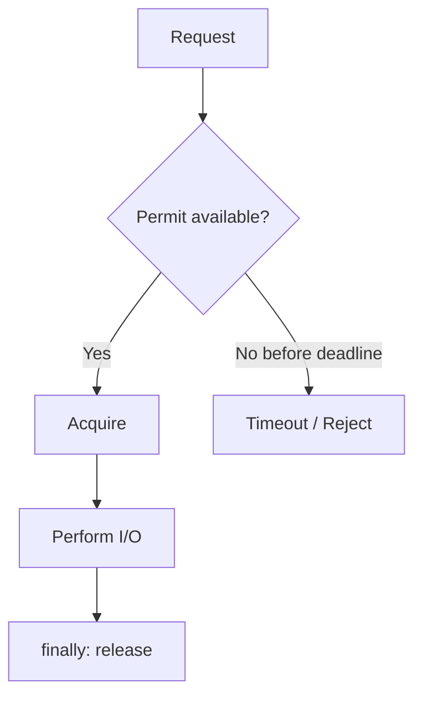
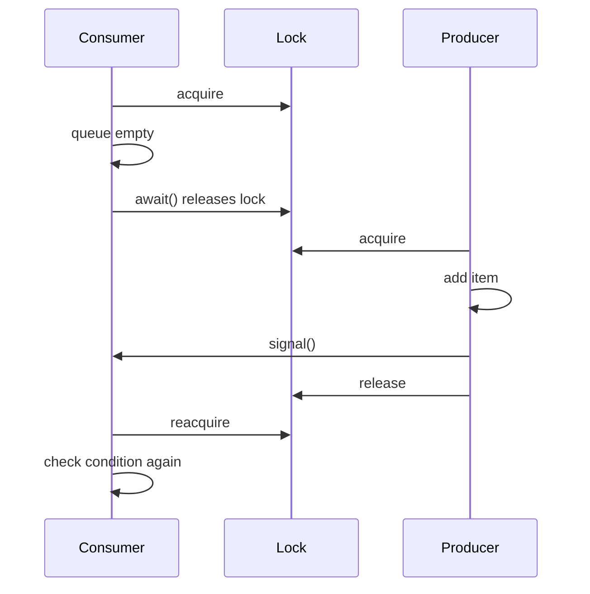
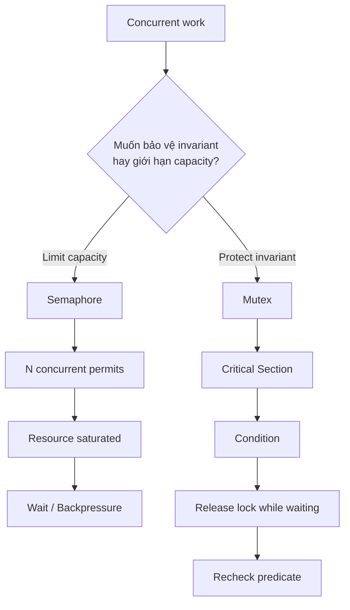

# 2.6 Semaphore, Condition & Giới hạn tài nguyên

## Mental model chung

Phần này nên tách thành ba bài toán khác nhau:

```text
Mutex
→ Ai được vào critical section?

Semaphore
→ Có tối đa bao nhiêu bên được vào?

Condition
→ Thread đang giữ lock nhưng chưa thể tiếp tục thì chờ như thế nào?
```

Có thể hình dung:



Câu quan trọng nhất:

> **Mutex chủ yếu bảo vệ invariant của shared state, còn semaphore chủ yếu giới hạn concurrency hoặc biểu diễn số lượng resource permits.**

---

# Q093. [P0] Semaphore khác mutex thế nào về số lượng bên được vào, quyền sở hữu và mục đích sử dụng?

## Ý bật ra đầu tiên

Hãy so sánh theo đúng ba dimension của câu hỏi:

```text
1. Capacity
2. Ownership
3. Purpose
```

---

## 1. Số lượng bên được vào

### Mutex

Mutex thường cho:

```text
1 owner at a time
```

Nếu Thread A giữ mutex:

```text
Thread B
Thread C
Thread D
→ phải chờ
```

Mục tiêu:

> mutual exclusion.

---

### Semaphore

Semaphore có một số lượng:

```text
permits = N
```

Ví dụ:

```java
Semaphore semaphore = new Semaphore(3);
```

thì tối đa:

```text
3 threads
```

có thể acquire thành công cùng lúc.



---

# 2. Ownership

Đây là distinction rất quan trọng.

Mutex thường có concept:

```text
owner
```

Thread acquire lock thì chính ownership đó được dùng để kiểm soát release.

Ví dụ `ReentrantLock`:

```text
Thread A locks
→ Thread A owns lock
```

Thread B không được tùy tiện unlock lock của A.

---

## Java Semaphore

Semaphore permit **không có ownership semantics mạnh như mutex**.

Conceptually:

```text
Thread A acquire permit

Thread B có thể release permit
```

Java `Semaphore` không yêu cầu permit phải được release bởi chính thread đã acquire.

Đây không phải bug — nó cho phép dùng semaphore cho signaling.

---

# 3. Purpose

## Mutex

Phù hợp với:

```text
protect shared invariant
critical section
mutual exclusion
```

Ví dụ:

```java
lock.lock();
try {
    balance -= amount;
} finally {
    lock.unlock();
}
```

---

## Semaphore

Phù hợp với:

```text
limit concurrent operations

represent resource pool

rate/concurrency gate

thread signaling
```

Ví dụ:

```text
DB connections = 20

Semaphore permits = 20
```

Tối đa 20 users cùng sử dụng resource.

---

# Bảng nhớ nhanh

|                   | Mutex                     | Semaphore                                      |
| ----------------- | ------------------------- | ---------------------------------------------- |
| Capacity          | Thường 1                  | N permits                                      |
| Ownership         | Có owner semantics        | Permit không gắn chặt owner                    |
| Mục đích          | Mutual exclusion          | Resource/concurrency limiting                  |
| Có thể signaling? | Không phải mục đích chính | Có                                             |
| Reentrant?        | Có thể, như ReentrantLock | Java Semaphore không reentrant theo nghĩa lock |

---

## Câu chốt

> Mutex chủ yếu đảm bảo chỉ một owner vào critical section để bảo vệ invariant. Semaphore quản lý một số lượng permit và cho phép tối đa N concurrent users. Một khác biệt quan trọng là semaphore permits không có ownership semantics giống mutex, nên một thread có thể release permit được acquire bởi thread khác, điều này hữu ích cho signaling nhưng cũng dễ gây lỗi nếu dùng như mutex.

---

# Q094. [P1] Semaphore có một permit có hoàn toàn thay thế mutex được không, đặc biệt khi một thread đánh thức thread khác?

## Câu đầu tiên

> Semaphore một permit có thể tạo mutual exclusion trong một số trường hợp, nhưng không hoàn toàn tương đương mutex.

Ví dụ:

```java
Semaphore semaphore = new Semaphore(1);
```

Nếu mọi thread tuân thủ:

```text
acquire
↓
critical section
↓
release
```

thì tại một thời điểm chỉ một thread vào.

Nhìn superficially:

```text
binary semaphore ≈ mutex
```

Nhưng semantics khác nhau.

---

# Khác biệt 1 — Ownership

Mutex:

```text
Thread A lock()
↓
A owns lock
↓
A unlock()
```

Semaphore:

```text
Thread A acquire()

Thread B có thể release()
```

Đây chính là lý do semaphore có thể dùng như signaling primitive.

---

# Ví dụ signaling

Thread A:

```java
semaphore.acquire();
// wait for event
```

Thread B:

```java
semaphore.release();
```

Thread B đang:

```text
đánh thức / cấp permit
```

cho A.

Nếu đây là mutex theo ownership semantics truyền thống thì:

```text
B không thể unlock mutex của A
```

---

# Khác biệt 2 — Over-release

Semaphore cho phép:

```java
semaphore.release();
semaphore.release();
```

Nếu ban đầu có 1 permit:

```text
permits = 1
```

và code release sai:

```text
permits = 2
```

Nó không còn bảo đảm:

```text
max concurrency = 1
```

nữa.

Mutex không có semantics "unlock thêm một lần làm capacity thành 2".

---

# Khác biệt 3 — Reentrancy

`ReentrantLock`:

```text
same owner
→ có thể lock lại
```

Semaphore một permit:

```text
Thread A acquire()
Thread A acquire()
```

lần thứ hai có thể block chính A vì permit đã hết.

Tức là:

```text
binary semaphore
≠
reentrant mutex
```

---

# Vậy khi nào binary semaphore hợp lý?

Có thể dùng khi cần:

```text
simple gate
cross-thread signaling
one-resource permit
```

Nhưng nếu mục tiêu rõ ràng là:

```text
protect critical section / invariant
```

thì mutex/`synchronized`/`ReentrantLock` thường diễn đạt intent tốt hơn.

---

## Câu chốt

> Semaphore một permit có thể tạo mutual exclusion nếu code dùng đúng discipline, nhưng không hoàn toàn thay thế mutex vì semaphore không có ownership semantics và không reentrant như `ReentrantLock`. Chính việc một thread có thể release permit cho thread khác khiến semaphore phù hợp cho signaling, nhưng cũng làm nó dễ bị over-release nếu dùng sai.

---

# Q095. [P1] Bạn sẽ giới hạn tối đa 10 lời gọi I/O đang chạy trong một process thế nào mà không làm rò rỉ permit khi có lỗi?

## Mental model

Ta muốn:

```text
at most 10 concurrent I/O operations
```

nên:

```java
Semaphore ioLimit = new Semaphore(10);
```

Mỗi request:

```text
acquire permit
↓
perform I/O
↓
release permit
```

---

# Code cơ bản

```java
Semaphore ioLimit = new Semaphore(10);

void callRemote() throws InterruptedException {
    ioLimit.acquire();
    try {
        doRemoteCall();
    } finally {
        ioLimit.release();
    }
}
```

Dù:

```text
doRemoteCall()
→ success
```

hay:

```text
doRemoteCall()
→ exception
```

permit vẫn được release.

---

# Nhưng có một nuance quan trọng

Nếu acquisition itself có thể fail hoặc bị interrupt:

```java
acquire()
```

thì không được release permit nếu chưa acquire thành công.

Ví dụ phức tạp hơn:

```java
boolean acquired = false;

try {
    ioLimit.acquire();
    acquired = true;

    doRemoteCall();
} finally {
    if (acquired) {
        ioLimit.release();
    }
}
```

Với blocking `acquire()` thông thường, đặt `try/finally` sau khi acquire thành công cũng đủ rõ ràng:

```java
ioLimit.acquire();
try {
    doRemoteCall();
} finally {
    ioLimit.release();
}
```

---

# Với timeout

Trong production có thể tốt hơn:

```java
if (!ioLimit.tryAcquire(200, TimeUnit.MILLISECONDS)) {
    throw new TooBusyException();
}

try {
    doRemoteCall();
} finally {
    ioLimit.release();
}
```

Flow:



---

# Tại sao cần semaphore?

Không có limit:

```text
1000 incoming requests
↓
1000 outbound calls
```

có thể làm:

```text
socket exhaustion
connection-pool exhaustion
remote service overload
memory pressure
```

Semaphore chuyển thành:

```text
1000 requests
↓
max 10 active I/O
```

---

# Nhưng cần chú ý queueing

Các request còn lại:

```text
waiting for permits
```

nên concurrency limit không miễn phí.

Nếu input rate quá cao:

```text
waiters ↑
latency ↑
```

Do đó thường cần:

```text
timeout
bounded request queue
load shedding
```

---

## Câu chốt

> Tôi dùng `Semaphore(10)` và yêu cầu mỗi I/O operation acquire một permit trước khi chạy, sau đó luôn release trong `finally`. Điều quan trọng là chỉ release nếu acquire thực sự thành công. Trong production tôi thường kết hợp `tryAcquire` với deadline để tránh tạo một hàng chờ vô hạn khi 10 slots đã bão hòa.

---

# Q096. [P2] Điều gì xảy ra nếu release permit khi chưa acquire thành công hoặc release hai lần?

## Ý đầu tiên

Java `Semaphore` không theo dõi ownership như mutex.

Vì vậy:

```java
semaphore.release();
```

không hỏi:

> Thread này đã acquire chưa?

Nó đơn giản tăng permit count.

---

# Ví dụ

Ban đầu:

```java
Semaphore s = new Semaphore(10);
```

Ta mong invariant:

```text
available permits ≤ 10
```

Nhưng code sai:

```java
s.release();
```

mà chưa acquire:

```text
permits = 11
```

---

# Double release

Thread A:

```text
acquire
permits: 10 → 9
```

sau đó bug:

```text
release
9 → 10

release
10 → 11
```

Giới hạn concurrency bị phá.

---

# Hệ quả

Ta tưởng system có:

```text
max 10 concurrent calls
```

nhưng permit inflation có thể thành:

```text
11
12
20
...
```

và semaphore dần mất hoàn toàn ý nghĩa limit.

---

# Một bug dễ mắc

Sai:

```java
try {
    semaphore.acquire();
    doWork();
} finally {
    semaphore.release();
}
```

Nghe có vẻ đúng, nhưng nếu `acquire()` throw `InterruptedException` trước khi lấy permit mà `finally` vẫn chạy trong structure tương ứng, ta có thể release một permit chưa từng acquire.

Pattern an toàn là:

```java
semaphore.acquire();

try {
    doWork();
} finally {
    semaphore.release();
}
```

hoặc track:

```text
acquired = true/false
```

---

# Contrast với lock

`ReentrantLock`:

```text
thread không phải owner
→ unlock()
→ IllegalMonitorStateException
```

Semaphore thường không có protection tương tự.

Đó vừa là:

```text
feature
```

cho signaling,

vừa là:

```text
risk
```

cho resource limiting.

---

## Câu chốt

> `Semaphore.release()` chỉ tăng số permit và không yêu cầu calling thread phải là thread đã acquire. Vì vậy release khi chưa acquire hoặc double-release sẽ làm permit count lớn hơn capacity logic ban đầu, phá giới hạn concurrency. Code cần đảm bảo mỗi successful acquire tương ứng đúng một release.

---

# Q097. [P1] Cho 10 thread qua semaphore có làm việc cập nhật shared counter của chúng an toàn không?

## Câu đầu tiên

> Không, trừ khi số permit là 1 hoặc có synchronization riêng bảo vệ counter.

Ví dụ:

```java
Semaphore semaphore = new Semaphore(10);
```

cho phép:

```text
10 threads
```

cùng vào.

Sau đó mỗi thread:

```java
counter++;
```

---

# Vấn đề

`counter++` vẫn là:

```text
read
modify
write
```

Hai trong 10 threads vẫn có thể:

```text
A reads 5
B reads 5

A writes 6
B writes 6
```

→ lost update.

---

# Semaphore đang bảo vệ cái gì?

Trong case này semaphore chỉ đảm bảo:

```text
number of concurrent threads <= 10
```

Nó **không đảm bảo**:

```text
only one thread updates counter
```

---

# Mental distinction

```text
Semaphore(10)
→ capacity control
```

khác:

```text
Mutex
→ mutual exclusion
```

---

# Giải pháp

Nếu counter cần exact increments:

### AtomicInteger

```java
AtomicInteger counter = new AtomicInteger();

counter.incrementAndGet();
```

---

### Mutex

```java
synchronized (lock) {
    counter++;
}
```

---

### Semaphore(1)

Có thể tạo mutual exclusion:

```java
Semaphore mutexLike = new Semaphore(1);
```

nhưng thường nên dùng đúng abstraction:

```text
synchronized
ReentrantLock
AtomicInteger
```

---

# Có thể kết hợp

Ví dụ giới hạn 10 remote calls và đếm số call thành công:

```java
Semaphore io = new Semaphore(10);
AtomicInteger successCount = new AtomicInteger();
```

```text
Semaphore
→ limit concurrency

AtomicInteger
→ safe counter update
```

Hai primitive giải quyết hai problem khác nhau.

---

## Câu chốt

> Semaphore 10 permits chỉ giới hạn tối đa 10 operations chạy đồng thời; nó không làm shared counter thread-safe. Nếu nhiều thread cùng `counter++`, race condition vẫn xảy ra. Tôi sẽ dùng `AtomicInteger` hoặc mutex riêng cho counter, trong khi semaphore tiếp tục làm nhiệm vụ giới hạn concurrency.

---

# Q098. [P2] Chờ condition khác `sleep` thế nào về việc giữ lock, và vì sao phải kiểm tra lại điều kiện sau khi được đánh thức?

Đây là câu rất quan trọng để hiểu producer-consumer.

---

# `sleep()`

Giả sử:

```java
synchronized (lock) {
    Thread.sleep(1000);
}
```

Thread ngủ:

```text
1 second
```

nhưng vẫn giữ:

```text
lock
```

Thread khác muốn vào:

```java
synchronized (lock)
```

vẫn phải chờ.

---

# Đây là vấn đề

Giả sử A đang chờ:

```text
queue not empty
```

nhưng A:

```text
giữ lock
+
sleep
```

Producer B cần cùng lock để:

```text
add item
```

nhưng không thể vào.

Có thể tạo design rất tệ.

---

# Condition waiting

Với `Condition`:

```java
lock.lock();
try {
    while (queue.isEmpty()) {
        notEmpty.await();
    }

    consume();
} finally {
    lock.unlock();
}
```

Điểm quan trọng:

```text
await()
```

sẽ conceptually:

```text
1. release lock atomically
2. wait / park
3. khi được wake → reacquire lock
4. rồi mới return khỏi await()
```

---

## Flow



---

# Tại sao phải dùng `while`, không phải `if`?

Sai:

```java
if (queue.isEmpty()) {
    notEmpty.await();
}

consume();
```

Đúng:

```java
while (queue.isEmpty()) {
    notEmpty.await();
}

consume();
```

Có hai lý do rất quan trọng.

---

# Lý do 1 — Spurious wakeup

Thread có thể wake khỏi `await()` dù:

```text
không có signal hữu ích
```

Java synchronization APIs cho phép spurious wakeups.

Vì vậy:

```text
wake
≠
condition chắc chắn đúng
```

---

# Lý do 2 — Condition có thể lại sai trước khi thread giành lại lock

Ví dụ:

```text
Consumer A waits
Consumer B waits

Producer adds 1 item
signals
```

A được đánh thức.

Nhưng trước khi A reacquire lock:

```text
Consumer C
```

có thể acquire lock trước và consume item.

Khi A cuối cùng lấy được lock:

```text
queue empty again
```

Nếu A không kiểm tra lại:

```text
bug
```

---

# Đây là Mesa-style monitor reasoning

Signal nghĩa gần giống:

> "State có thể đã thay đổi, hãy thức dậy và kiểm tra lại."

Không phải:

> "Tôi guarantee condition của bạn hiện chắc chắn true."

---

# Condition variable gắn với predicate

Ví dụ:

```text
Condition:
notEmpty

Predicate:
queue.size() > 0
```

Pattern chuẩn:

```java
lock.lock();
try {
    while (!predicate()) {
        condition.await();
    }

    // predicate hiện đúng dưới lock
    doWork();
} finally {
    lock.unlock();
}
```

---

# Producer

```java
lock.lock();
try {
    queue.add(item);
    notEmpty.signal();
} finally {
    lock.unlock();
}
```

---

# `signal()` vs `signalAll()`

`signal()`:

```text
wake one waiter
```

`signalAll()`:

```text
wake all waiters
```

`signalAll()` có thể an toàn hơn trong một số protocol phức tạp nhưng gây:

```text
thundering herd
```

nhiều threads wake rồi tranh lock.

---

## Câu chốt

> `sleep()` chỉ dừng thread một thời gian và không tự release lock mà thread đang giữ. `Condition.await()` thì atomically release associated lock trong lúc chờ và reacquire lock trước khi return. Sau khi wake luôn phải kiểm tra predicate lại trong vòng `while`, vì có thể có spurious wakeup hoặc thread khác đã thay đổi state trước khi mình lấy lại lock.

---

# Liên kết Q093 → Q098

Toàn bộ phần này thực chất là:



Khi interviewer đưa một concurrency problem, hãy hỏi:

```text
Tôi đang cần:

Mutual exclusion?
hay
Capacity limiting?
hay
Waiting for state transition?
```

Từ đó chọn abstraction:

```text
Mutex
Semaphore
Condition
```

---

# Những distinction bắt buộc phải thuộc

## 1. Mutex ≠ Semaphore

```text
Mutex
→ one owner
→ protect invariant

Semaphore
→ N permits
→ limit concurrency/resources
```

---

## 2. Binary semaphore ≠ hoàn toàn giống mutex

```text
Semaphore(1)

+ mutual exclusion possible

but

- no ownership
- non-reentrant
- over-release possible
```

---

## 3. Semaphore không tự bảo vệ data

```text
Semaphore(10)
→ max 10 threads

NOT

→ counter++ safe
```

---

## 4. `sleep()` ≠ condition waiting

```text
sleep()
→ thread waits
→ lock vẫn giữ nếu đang sở hữu
```

```text
await()
→ release lock
→ wait
→ reacquire
→ return
```

---

## 5. Wakeup ≠ predicate true

Do:

```text
spurious wakeups
+
state may change before reacquisition
```

nên:

```java
while (!condition) {
    await();
}
```

chứ không phải:

```java
if (!condition) {
    await();
}
```

---

# Cheat sheet theo priority

## Q093 [P0]

```text
Mutex:
1 owner
protect invariant

Semaphore:
N permits
limit resource/concurrency
```

---

## Q094 [P1]

```text
Semaphore(1)
≈ mutual exclusion

but

no ownership
non-reentrant
cross-thread release possible
```

---

## Q095 [P1]

```text
Semaphore(10)

acquire
↓
I/O
↓
finally release
```

Nếu deadline:

```text
tryAcquire(timeout)
```

---

## Q096 [P2]

```text
release without acquire
or
double release

→ permit inflation
→ concurrency limit broken
```

---

## Q097 [P1]

```text
Semaphore(10)
≠
counter++ safe

Need:
AtomicInteger
or
mutex
```

---

## Q098 [P2]

```text
sleep
→ keeps lock

Condition.await
→ releases lock while waiting
→ reacquires before return
```

Và bắt buộc:

```java
while (!predicate) {
    await();
}
```

---

# Câu tổng hợp tốt khi interviewer hỏi:

# "Mutex, semaphore và condition khác nhau thế nào?"

> Tôi phân biệt chúng theo problem đang giải. Mutex dùng mutual exclusion để bảo vệ shared invariant, nên thường chỉ một owner vào critical section. Semaphore quản lý N permits và phù hợp để giới hạn số concurrent users của một resource, ví dụ tối đa 10 outbound calls. Condition thì dùng khi thread đang bảo vệ một state nhưng chưa thể tiếp tục vì predicate chưa đúng; `await()` tạm release lock để thread khác có thể thay đổi state rồi reacquire trước khi tiếp tục. Vì vậy mutex giải quyết exclusivity, semaphore giải quyết capacity, còn condition giải quyết coordination theo state.

Mental model cuối cùng:

```text
Correctness invariant
→ Mutex

Resource capacity
→ Semaphore

Wait for state
→ Condition
```
