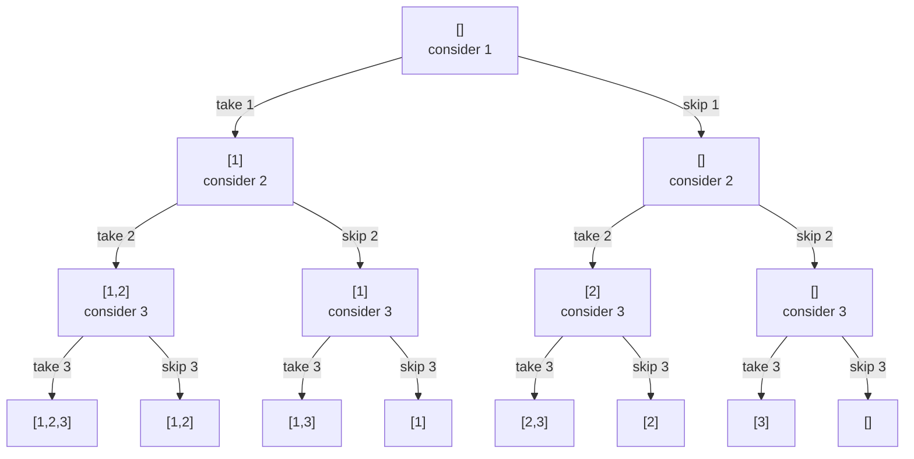
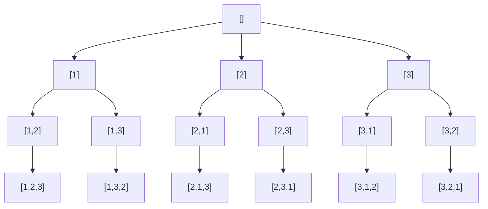
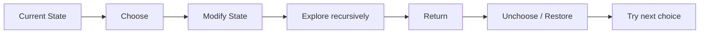
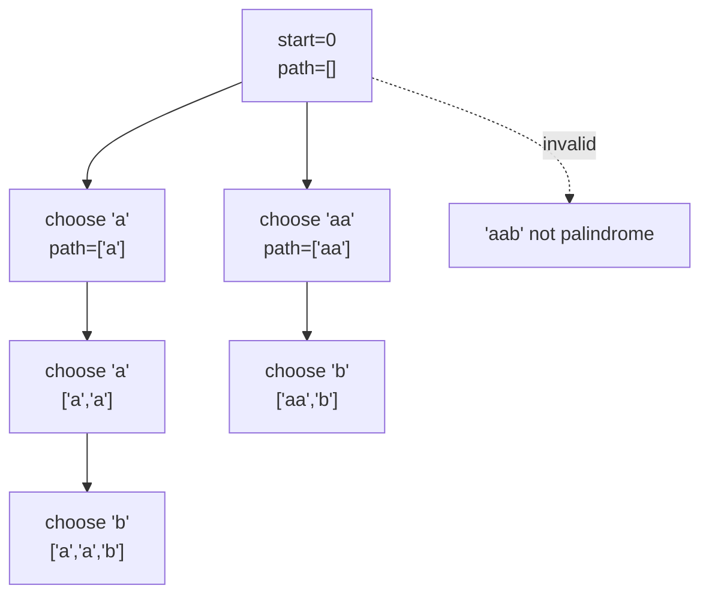
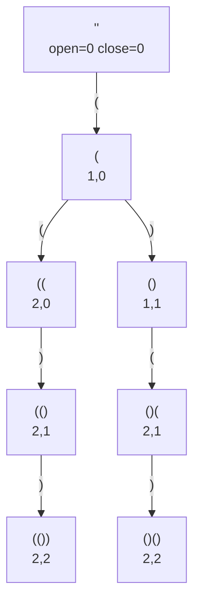
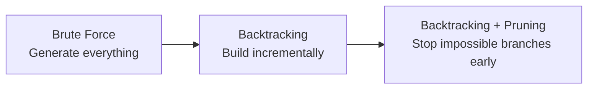
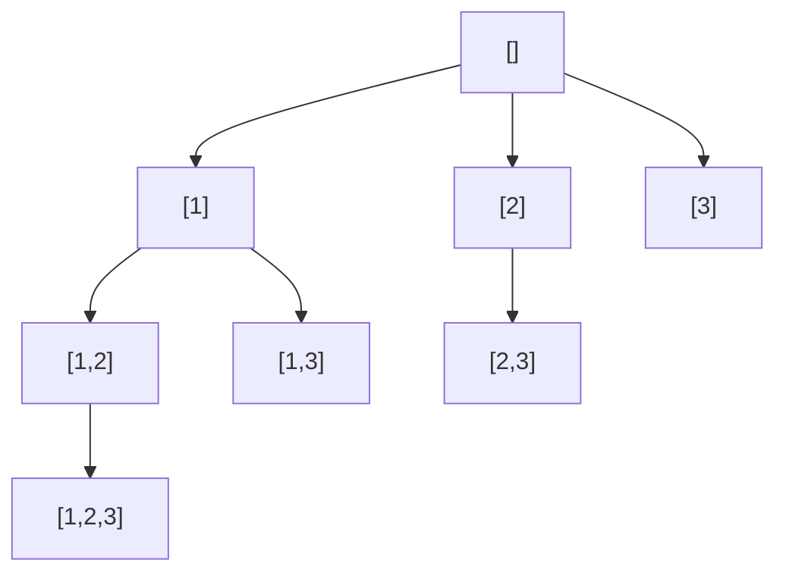
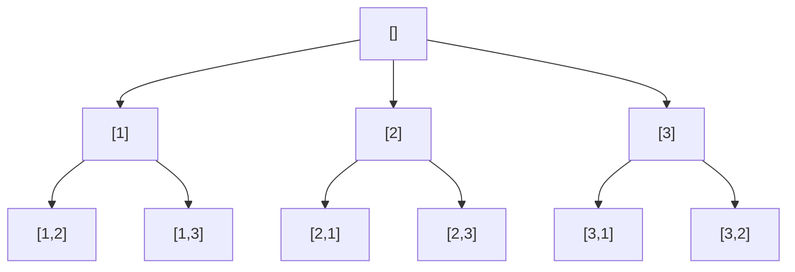
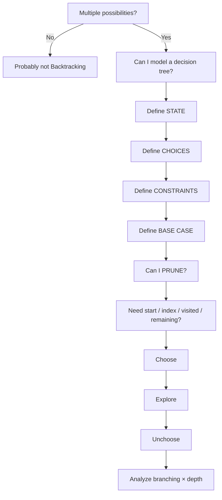
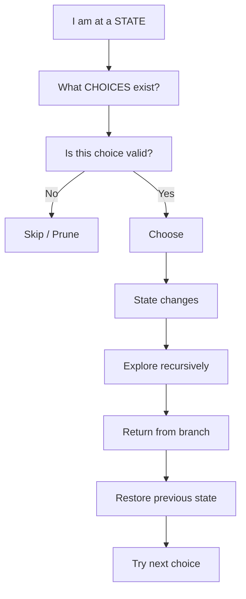

# BACKTRACKING — DEEP DIVE FOR CODING INTERVIEW

## Mục tiêu

Sau bài này, mục tiêu không phải là thuộc một template Backtracking, mà là khi nhìn một bài mới bạn có thể tự trả lời:

```text
State là gì?
Choices là gì?
Constraints là gì?
Base case ở đâu?
Có thể prune ở đâu?
Cần start / index / visited / remaining không?
Sau recursion phải restore state nào?
```

Mental model quan trọng nhất:

```text
Choose
  ↓
Explore
  ↓
Unchoose
```

---

# 1. Backtracking là gì?

Backtracking là kỹ thuật **duyệt một search space gồm nhiều lựa chọn**, xây dựng solution từng bước.

Tại mỗi bước:

1. Chọn một candidate.
2. Thay đổi state.
3. Tiếp tục khám phá.
4. Nếu branch không thể tạo solution → dừng branch đó.
5. Restore state.
6. Thử lựa chọn khác.

Pseudo-code:

```java
for (Choice choice : choices) {

    choose(choice);

    backtrack();

    unchoose(choice);
}
```

Điểm quan trọng:

> Backtracking không chỉ là recursion.

Backtracking là một **search strategy**.

Recursion chỉ là cách implement rất tự nhiên cho strategy đó.

---

## 1.1 Bản chất của Backtracking

Giả sử có:

```text
nums = [1,2,3]
```

và cần tạo mọi subset.

Mỗi element cho ta hai lựa chọn:

```text
take
skip
```

Search space:



Đây chính là **decision tree**.

Mỗi node:

```text
= một state hiện tại
```

Mỗi edge:

```text
= một decision / choice
```

Một leaf:

```text
= một trạng thái sau khi tất cả decision đã được đưa ra
```

---

# 2. Search Space / State Space

Đây là concept quan trọng nhất của Backtracking.

## Search Space

Search space là:

> Toàn bộ các trạng thái mà thuật toán có khả năng khám phá.

Ví dụ permutation:

```text
nums = [1,2,3]
```

Có:

```text
3! = 6
```

solution:

```text
[1,2,3]
[1,3,2]
[2,1,3]
[2,3,1]
[3,1,2]
[3,2,1]
```

Decision tree:



Notice branching factor:

```text
level 0: 3 choices
level 1: 2 choices
level 2: 1 choice
```

Do đó:

```text
3 × 2 × 1 = 3!
```

---

# 3. Backtracking khác gì Recursion, DFS, Brute Force, DP, Greedy?

## Recursion

Recursion chỉ có nghĩa:

```text
function gọi lại chính nó
```

Ví dụ factorial:

```java
int factorial(int n) {
    if (n == 0) return 1;

    return n * factorial(n - 1);
}
```

Đây là recursion nhưng không phải Backtracking.

Không có:

```text
multiple choices
choose
explore
restore
```

---

## DFS

DFS là cách duyệt:

```text
go as deep as possible
```

Backtracking thường sử dụng DFS.

Nhưng không phải mọi DFS đều là Backtracking.

Ví dụ:

```java
void dfs(TreeNode node) {

    if (node == null) return;

    dfs(node.left);
    dfs(node.right);
}
```

Không có mutable decision state cần undo.

---

## Brute Force

Brute Force:

```text
Generate everything
→ validate afterwards
```

Backtracking:

```text
Build incrementally
→ stop immediately when state becomes impossible
```

Ví dụ Generate Parentheses.

Brute force có thể sinh toàn bộ:

```text
2^(2n)
```

chuỗi `(` và `)`.

Sau đó validate.

Backtracking dùng:

```text
open <= n
close <= open
```

để không bao giờ sinh những prefix invalid.

---

## Dynamic Programming

DP phù hợp khi:

```text
same subproblem appears repeatedly
```

và ta có thể cache:

```text
state -> answer
```

Backtracking thường dùng khi:

```text
cần enumerate / construct solutions
```

Ví dụ:

```text
"How many ways?"
```

có thể thiên về DP.

Trong khi:

```text
"Return all ways"
```

thường thiên về Backtracking.

---

## Greedy

Greedy:

```text
make one locally optimal choice
never reconsider it
```

Backtracking:

```text
try choice A
explore
undo
try choice B
```

Hai tư tưởng gần như đối lập.

---

# 4. Core Mental Model — Choose → Explore → Unchoose

Đây là template tinh thần quan trọng nhất.



---

# 5. State, Choice, Constraint, Base Case và Pruning

Đây là 5 câu hỏi quan trọng nhất khi giải Backtracking.

## State

State là:

> Thông tin tối thiểu mô tả vị trí hiện tại của ta trong search space.

Ví dụ Combination Sum:

```text
path
start
remaining
```

Trong đó:

```text
path
```

là những candidate đã chọn.

```text
remaining
```

là target còn thiếu.

```text
start
```

xác định những candidate được phép chọn tiếp.

---

## Choice

Choice trả lời:

> Từ state hiện tại, tôi có thể đi sang những state nào?

Ví dụ combination:

```java
for (int i = start; i < nums.length; i++)
```

Mỗi:

```java
nums[i]
```

là một choice.

---

## Constraint

Constraint là rule solution phải thỏa mãn.

Ví dụ N-Queens:

```text
không cùng column
không cùng main diagonal
không cùng anti-diagonal
```

---

## Base Case

Base case nghĩa là:

> Khi nào state hiện tại đã hoàn thành mục tiêu?

Ví dụ permutation:

```java
if (path.size() == nums.length)
```

Combination Sum:

```java
if (remaining == 0)
```

---

## Pruning

Pruning nghĩa là:

> Tôi biết branch này chắc chắn không thể sinh ra solution, nên không cần explore nữa.

Ví dụ:

```java
if (remaining < 0) {
    return;
}
```

---

# 6. Vì sao phải Unchoose?

Ví dụ:

```java
path.add(nums[i]);

backtrack(...);

path.remove(path.size() - 1);
```

Giả sử:

```text
path = []
```

chọn `1`:

```text
[1]
```

chọn `2`:

```text
[1,2]
```

sau khi explore xong `[1,2,...]`, ta cần trở về:

```text
[1]
```

để thử:

```text
[1,3]
```

Nếu không remove:

```text
[1,2]
```

vẫn còn.

Sau đó thêm `3`:

```text
[1,2,3]
```

trong khi state mong muốn là:

```text
[1,3]
```

Nói cách khác:

> Unchoose đưa state quay lại đúng trạng thái trước choice.

---

# 7. Trace `path`

Giả sử combination:

```text
nums = [1,2,3]
k = 2
```

Execution:

| Action        | path    |
| ------------- | ------- |
| start         | `[]`    |
| choose 1      | `[1]`   |
| choose 2      | `[1,2]` |
| save solution | `[1,2]` |
| remove 2      | `[1]`   |
| choose 3      | `[1,3]` |
| save solution | `[1,3]` |
| remove 3      | `[1]`   |
| remove 1      | `[]`    |
| choose 2      | `[2]`   |
| choose 3      | `[2,3]` |
| save solution | `[2,3]` |

Notice:

```text
Backtracking = state mutation + recursion + state restoration
```

---

# 8. Java Core Template

```java
void backtrack(...) {

    if (baseCase) {
        // process solution
        return;
    }

    for (...) {

        if (invalidChoice) {
            continue;
        }

        // choose
        path.add(...);

        // explore
        backtrack(...);

        // unchoose
        path.remove(path.size() - 1);
    }
}
```

---

# 9. Ý nghĩa các variable thường gặp

| Variable        | Ý nghĩa                           |
| --------------- | --------------------------------- |
| `path`          | solution đang xây dựng            |
| `start`         | candidate đầu tiên được phép xét  |
| `index`         | position hiện tại                 |
| `visited`       | element/state nào đã được sử dụng |
| `remaining`     | target còn thiếu                  |
| `current`       | state/value hiện tại              |
| `row`, `col`    | position trong matrix             |
| `open`, `close` | số lượng parenthesis đã dùng      |

Mental shortcut:

```text
Combination   → start
Permutation   → visited
Target Search → remaining
Grid          → row/col + visited
Partition     → start/end
```

---

# 10. Pattern 1 — Subsets

## Problem model

Cho:

```text
nums = [1,2,3]
```

hãy tạo tất cả subsets.

Ở mỗi element:

```text
include
hoặc
exclude
```

---

## State

```text
path
start
```

## Choice

Chọn một element từ:

```text
[start ... n)
```

## Base case

Với template phổ biến:

```text
mọi node đều là một subset hợp lệ
```

nên ta add ngay khi vào function.

---

## Java — LeetCode 78

```java
class Solution {

    public List<List<Integer>> subsets(int[] nums) {

        List<List<Integer>> result = new ArrayList<>();

        backtrack(nums, 0, new ArrayList<>(), result);

        return result;
    }

    private void backtrack(
            int[] nums,
            int start,
            List<Integer> path,
            List<List<Integer>> result
    ) {

        result.add(new ArrayList<>(path));

        for (int i = start; i < nums.length; i++) {

            path.add(nums[i]);

            backtrack(nums, i + 1, path, result);

            path.remove(path.size() - 1);
        }
    }
}
```

---

## Vì sao `i + 1`?

Sau khi chọn:

```text
nums[i]
```

ta không được quay lại chọn chính nó nữa.

Candidate tiếp theo phải nằm sau `i`:

```text
i + 1
```

Điều này đồng thời tránh tạo:

```text
[1,2]
[2,1]
```

vì subset không quan tâm order.

---

## Complexity

Có:

```text
2^n subsets
```

Nếu tính cả chi phí copy mỗi path:

```text
O(n * 2^n)
```

Auxiliary recursion/path space:

```text
O(n)
```

Output:

```text
O(n * 2^n)
```

---

# 11. Subsets II — Duplicate

Ví dụ:

```text
[1,2,2]
```

Nếu xử lý bình thường sẽ sinh duplicate.

Solution:

```java
Arrays.sort(nums);
```

rồi:

```java
if (i > start && nums[i] == nums[i - 1]) {
    continue;
}
```

Full code:

```java
class Solution {

    public List<List<Integer>> subsetsWithDup(int[] nums) {

        Arrays.sort(nums);

        List<List<Integer>> result = new ArrayList<>();

        backtrack(nums, 0, new ArrayList<>(), result);

        return result;
    }

    private void backtrack(
            int[] nums,
            int start,
            List<Integer> path,
            List<List<Integer>> result
    ) {

        result.add(new ArrayList<>(path));

        for (int i = start; i < nums.length; i++) {

            if (i > start && nums[i] == nums[i - 1]) {
                continue;
            }

            path.add(nums[i]);

            backtrack(nums, i + 1, path, result);

            path.remove(path.size() - 1);
        }
    }
}
```

---

# 12. Vì sao duplicate condition là `i > start`?

Đây là concept cực kỳ quan trọng.

Ta chỉ skip duplicate:

```text
ở cùng decision-tree level
```

Ví dụ:

```text
[1,2,2]
```

Tại state `[1]`:

```text
candidate 2 đầu tiên
candidate 2 thứ hai
```

nếu đều được chọn làm child trực tiếp thì sẽ sinh cùng branch.

Nhưng:

```text
2 ở level sau
```

vẫn có thể hợp lệ.

Ví dụ:

```text
[2,2]
```

phải tồn tại.

Do đó không thể dùng:

```java
i > 0
```

vì nó sẽ loại duplicate ở mọi level.

Rule chuẩn:

```java
i > start
```

nghĩa là:

> Candidate này không phải candidate đầu tiên của level hiện tại.

---

# 13. Pattern 2 — Permutations

Ví dụ:

```text
[1,2,3]
```

Khác Combination ở điểm:

```text
order matters
```

```text
[1,2,3]
```

khác:

```text
[2,1,3]
```

---

## Vì sao không dùng `start`?

Combination:

```text
sau khi chọn 2
chỉ được nhìn sang bên phải
```

Permutation:

```text
sau khi chọn 2
vẫn có thể chọn 1
```

Do đó mỗi level phải scan:

```text
0 ... n-1
```

và cần biết element nào đã dùng.

Tool:

```text
visited[]
```

---

# 14. LeetCode 46 — Permutations

## State

```text
path
used[]
```

## Choices

```text
mọi nums[i] chưa được dùng
```

## Base case

```text
path.size() == nums.length
```

## Code

```java
class Solution {

    public List<List<Integer>> permute(int[] nums) {

        List<List<Integer>> result = new ArrayList<>();
        boolean[] used = new boolean[nums.length];

        backtrack(nums, used, new ArrayList<>(), result);

        return result;
    }

    private void backtrack(
            int[] nums,
            boolean[] used,
            List<Integer> path,
            List<List<Integer>> result
    ) {

        if (path.size() == nums.length) {
            result.add(new ArrayList<>(path));
            return;
        }

        for (int i = 0; i < nums.length; i++) {

            if (used[i]) {
                continue;
            }

            used[i] = true;
            path.add(nums[i]);

            backtrack(nums, used, path, result);

            path.remove(path.size() - 1);
            used[i] = false;
        }
    }
}
```

Complexity:

```text
O(n * n!)
```

nếu tính copy output.

Recursion depth:

```text
O(n)
```

---

# 15. Permutations II — Duplicate

LeetCode 47.

Ta sort:

```java
Arrays.sort(nums);
```

và skip:

```java
if (
    i > 0 &&
    nums[i] == nums[i - 1] &&
    !used[i - 1]
) {
    continue;
}
```

Code:

```java
class Solution {

    public List<List<Integer>> permuteUnique(int[] nums) {

        Arrays.sort(nums);

        List<List<Integer>> result = new ArrayList<>();
        boolean[] used = new boolean[nums.length];

        backtrack(nums, used, new ArrayList<>(), result);

        return result;
    }

    private void backtrack(
            int[] nums,
            boolean[] used,
            List<Integer> path,
            List<List<Integer>> result
    ) {

        if (path.size() == nums.length) {
            result.add(new ArrayList<>(path));
            return;
        }

        for (int i = 0; i < nums.length; i++) {

            if (used[i]) {
                continue;
            }

            if (
                i > 0 &&
                nums[i] == nums[i - 1] &&
                !used[i - 1]
            ) {
                continue;
            }

            used[i] = true;
            path.add(nums[i]);

            backtrack(nums, used, path, result);

            path.remove(path.size() - 1);
            used[i] = false;
        }
    }
}
```

Mental model:

```text
Ở cùng level:
nếu có hai giá trị giống nhau,
hãy dùng occurrence phía trước làm representative.
```

---

# 16. Pattern 3 — Combinations

LeetCode 77:

```text
n = 4
k = 2
```

Output gồm:

```text
[1,2]
[1,3]
[1,4]
[2,3]
[2,4]
[3,4]
```

State:

```text
path
start
```

Choice:

```text
[start ... n]
```

Base case:

```text
path.size() == k
```

Code:

```java
class Solution {

    public List<List<Integer>> combine(int n, int k) {

        List<List<Integer>> result = new ArrayList<>();

        backtrack(1, n, k, new ArrayList<>(), result);

        return result;
    }

    private void backtrack(
            int start,
            int n,
            int k,
            List<Integer> path,
            List<List<Integer>> result
    ) {

        if (path.size() == k) {
            result.add(new ArrayList<>(path));
            return;
        }

        for (int i = start; i <= n; i++) {

            path.add(i);

            backtrack(i + 1, n, k, path, result);

            path.remove(path.size() - 1);
        }
    }
}
```

Optimization:

Nếu còn cần:

```text
k - path.size()
```

phần tử thì không cần loop quá xa.

Có thể dùng:

```java
int need = k - path.size();

for (int i = start; i <= n - need + 1; i++)
```

Đây là pruning.

---

# 17. Subset vs Combination vs Permutation

| Concept     | Order matters? | Size fixed? | Main tool |
| ----------- | -------------: | ----------: | --------- |
| Subset      |             No |          No | `start`   |
| Combination |             No |  thường Yes | `start`   |
| Permutation |            Yes |  thường Yes | `visited` |

Mental shortcut:

```text
Order does not matter
→ move forward only
→ start

Order matters
→ every unused element remains candidate
→ visited
```

---

# 18. Pattern 4 — Combination Sum / Target Search

Đây là một trong những pattern quan trọng nhất.

Core state:

```text
path
remaining
start
```

Transition:

```text
choose candidate
remaining -= candidate
```

Base case:

```text
remaining == 0
```

Prune:

```text
remaining < 0
```

---

# 19. LeetCode 39 — Combination Sum

Candidate có thể được dùng nhiều lần.

Ví dụ:

```text
candidates = [2,3,6,7]
target = 7
```

Solutions:

```text
[2,2,3]
[7]
```

Điểm quan trọng:

```text
reuse allowed
```

Do đó sau khi chọn `i`:

```java
backtrack(i, ...)
```

chứ không phải:

```java
backtrack(i + 1, ...)
```

Code:

```java
class Solution {

    public List<List<Integer>> combinationSum(
            int[] candidates,
            int target
    ) {

        List<List<Integer>> result = new ArrayList<>();

        backtrack(
            candidates,
            0,
            target,
            new ArrayList<>(),
            result
        );

        return result;
    }

    private void backtrack(
            int[] candidates,
            int start,
            int remaining,
            List<Integer> path,
            List<List<Integer>> result
    ) {

        if (remaining == 0) {
            result.add(new ArrayList<>(path));
            return;
        }

        if (remaining < 0) {
            return;
        }

        for (int i = start; i < candidates.length; i++) {

            path.add(candidates[i]);

            backtrack(
                candidates,
                i,
                remaining - candidates[i],
                path,
                result
            );

            path.remove(path.size() - 1);
        }
    }
}
```

---

# 20. LeetCode 40 — Combination Sum II

Khác bài 39:

```text
mỗi occurrence chỉ dùng một lần
input có thể duplicate
```

Do đó:

```text
sort
same-level skip duplicate
next start = i + 1
```

Code:

```java
class Solution {

    public List<List<Integer>> combinationSum2(
            int[] candidates,
            int target
    ) {

        Arrays.sort(candidates);

        List<List<Integer>> result = new ArrayList<>();

        backtrack(
            candidates,
            0,
            target,
            new ArrayList<>(),
            result
        );

        return result;
    }

    private void backtrack(
            int[] nums,
            int start,
            int remaining,
            List<Integer> path,
            List<List<Integer>> result
    ) {

        if (remaining == 0) {
            result.add(new ArrayList<>(path));
            return;
        }

        for (int i = start; i < nums.length; i++) {

            if (i > start && nums[i] == nums[i - 1]) {
                continue;
            }

            if (nums[i] > remaining) {
                break;
            }

            path.add(nums[i]);

            backtrack(
                nums,
                i + 1,
                remaining - nums[i],
                path,
                result
            );

            path.remove(path.size() - 1);
        }
    }
}
```

Sorting cho ta thêm pruning:

```java
if (nums[i] > remaining) {
    break;
}
```

Vì tất cả candidate phía sau còn lớn hơn nữa.

---

# 21. Combination Sum I vs II

|                 | LC 39                   | LC 40               |
| --------------- | ----------------------- | ------------------- |
| Reuse           | Yes                     | No                  |
| Duplicate input | không phải vấn đề chính | Yes                 |
| Next recursion  | `i`                     | `i + 1`             |
| Sort required   | Optional                | rất hữu ích / chuẩn |
| Skip duplicate  | No                      | Yes                 |

Một dòng rất đáng nhớ:

```text
reuse current item
→ recurse(i)

cannot reuse current occurrence
→ recurse(i + 1)
```

---

# 22. LeetCode 216 — Combination Sum III

Tìm `k` số khác nhau từ:

```text
1 ... 9
```

sao cho tổng bằng `n`.

State:

```text
path
start
remaining
```

Constraints:

```text
path.size() <= k
remaining >= 0
```

Code:

```java
class Solution {

    public List<List<Integer>> combinationSum3(int k, int n) {

        List<List<Integer>> result = new ArrayList<>();

        backtrack(
            1,
            k,
            n,
            new ArrayList<>(),
            result
        );

        return result;
    }

    private void backtrack(
            int start,
            int k,
            int remaining,
            List<Integer> path,
            List<List<Integer>> result
    ) {

        if (path.size() == k) {

            if (remaining == 0) {
                result.add(new ArrayList<>(path));
            }

            return;
        }

        for (int i = start; i <= 9; i++) {

            if (i > remaining) {
                break;
            }

            path.add(i);

            backtrack(
                i + 1,
                k,
                remaining - i,
                path,
                result
            );

            path.remove(path.size() - 1);
        }
    }
}
```

---

# 23. Pattern 5 — String Partitioning

Problem điển hình:

```text
Palindrome Partitioning
```

Một state không chọn element.

Nó chọn:

```text
một substring
```

State:

```text
start
path of substrings
```

Choices:

```text
s[start ... end]
```

---

# 24. LeetCode 131 — Palindrome Partitioning

Ví dụ:

```text
"aab"
```

Solutions:

```text
["a","a","b"]
["aa","b"]
```

Decision tree:



Code:

```java
class Solution {

    public List<List<String>> partition(String s) {

        List<List<String>> result = new ArrayList<>();

        backtrack(
            s,
            0,
            new ArrayList<>(),
            result
        );

        return result;
    }

    private void backtrack(
            String s,
            int start,
            List<String> path,
            List<List<String>> result
    ) {

        if (start == s.length()) {
            result.add(new ArrayList<>(path));
            return;
        }

        for (int end = start; end < s.length(); end++) {

            if (!isPalindrome(s, start, end)) {
                continue;
            }

            path.add(s.substring(start, end + 1));

            backtrack(
                s,
                end + 1,
                path,
                result
            );

            path.remove(path.size() - 1);
        }
    }

    private boolean isPalindrome(
            String s,
            int left,
            int right
    ) {

        while (left < right) {

            if (s.charAt(left) != s.charAt(right)) {
                return false;
            }

            left++;
            right--;
        }

        return true;
    }
}
```

Recognition:

> Nếu đề yêu cầu chia string theo **mọi cách có thể** và mỗi segment phải satisfy một condition, hãy nghĩ đến Backtracking partitioning.

---

# 25. Pattern 6 — Constraint Satisfaction

Dạng bài:

```text
Find a configuration satisfying constraints
```

Ví dụ:

```text
N-Queens
Sudoku
```

Backtracking cực kỳ phù hợp vì:

```text
partial configuration invalid
→ toàn bộ descendants cũng invalid
```

Đây là pruning rất mạnh.

---

# 26. LeetCode 51 — N-Queens

Ta đặt một queen cho mỗi row.

State:

```text
row
board
occupied columns
occupied diagonals
```

Main diagonal:

```text
row - col
```

Anti diagonal:

```text
row + col
```

Code:

```java
class Solution {

    public List<List<String>> solveNQueens(int n) {

        List<List<String>> result = new ArrayList<>();

        char[][] board = new char[n][n];

        for (char[] row : board) {
            Arrays.fill(row, '.');
        }

        boolean[] cols = new boolean[n];
        boolean[] diag1 = new boolean[2 * n];
        boolean[] diag2 = new boolean[2 * n];

        backtrack(
            0,
            n,
            board,
            cols,
            diag1,
            diag2,
            result
        );

        return result;
    }

    private void backtrack(
            int row,
            int n,
            char[][] board,
            boolean[] cols,
            boolean[] diag1,
            boolean[] diag2,
            List<List<String>> result
    ) {

        if (row == n) {

            List<String> solution = new ArrayList<>();

            for (char[] r : board) {
                solution.add(new String(r));
            }

            result.add(solution);
            return;
        }

        for (int col = 0; col < n; col++) {

            int d1 = row - col + n;
            int d2 = row + col;

            if (
                cols[col] ||
                diag1[d1] ||
                diag2[d2]
            ) {
                continue;
            }

            board[row][col] = 'Q';
            cols[col] = true;
            diag1[d1] = true;
            diag2[d2] = true;

            backtrack(
                row + 1,
                n,
                board,
                cols,
                diag1,
                diag2,
                result
            );

            board[row][col] = '.';
            cols[col] = false;
            diag1[d1] = false;
            diag2[d2] = false;
        }
    }
}
```

Mental model:

```text
State       = queens đã đặt ở các row trước
Choice      = column cho queen của row hiện tại
Constraint  = column/diagonal không occupied
Base case   = row == n
Backtrack   = remove queen
```

---

# 27. LeetCode 37 — Sudoku Solver

State:

```text
board
current empty cell
```

Choices:

```text
1...9
```

Constraint:

```text
number không xuất hiện trong:
row
column
3x3 box
```

Code:

```java
class Solution {

    public void solveSudoku(char[][] board) {
        solve(board);
    }

    private boolean solve(char[][] board) {

        for (int row = 0; row < 9; row++) {

            for (int col = 0; col < 9; col++) {

                if (board[row][col] != '.') {
                    continue;
                }

                for (char c = '1'; c <= '9'; c++) {

                    if (!isValid(board, row, col, c)) {
                        continue;
                    }

                    board[row][col] = c;

                    if (solve(board)) {
                        return true;
                    }

                    board[row][col] = '.';
                }

                return false;
            }
        }

        return true;
    }

    private boolean isValid(
            char[][] board,
            int row,
            int col,
            char c
    ) {

        for (int i = 0; i < 9; i++) {

            if (board[row][i] == c) {
                return false;
            }

            if (board[i][col] == c) {
                return false;
            }

            int boxRow =
                    3 * (row / 3) + i / 3;

            int boxCol =
                    3 * (col / 3) + i % 3;

            if (board[boxRow][boxCol] == c) {
                return false;
            }
        }

        return true;
    }
}
```

Ở đây function trả boolean vì:

```text
chỉ cần tìm một valid configuration
```

Khi tìm được:

```java
return true;
```

ta dừng toàn bộ search.

---

# 28. Pattern 7 — Grid / Matrix Backtracking

Grid Backtracking thường có state:

```text
row
col
index / remaining path
visited
```

Choices:

```text
up
down
left
right
```

Template:

```java
boolean dfs(int row, int col, ...) {

    if (...) {
        return true;
    }

    if (outOfBounds || invalid || visited) {
        return false;
    }

    markVisited();

    for (direction) {
        if (dfs(...)) {
            return true;
        }
    }

    unmarkVisited();

    return false;
}
```

---

# 29. LeetCode 79 — Word Search

Problem:

Cho matrix ký tự và một `word`.

Tìm một path adjacent:

```text
up/down/left/right
```

tạo thành word.

Mỗi cell không được reuse trong cùng path.

State:

```text
row
col
index in word
```

Code:

```java
class Solution {

    public boolean exist(char[][] board, String word) {

        int rows = board.length;
        int cols = board[0].length;

        for (int r = 0; r < rows; r++) {

            for (int c = 0; c < cols; c++) {

                if (dfs(board, word, r, c, 0)) {
                    return true;
                }
            }
        }

        return false;
    }

    private boolean dfs(
            char[][] board,
            String word,
            int row,
            int col,
            int index
    ) {

        if (index == word.length()) {
            return true;
        }

        if (
            row < 0 ||
            row >= board.length ||
            col < 0 ||
            col >= board[0].length ||
            board[row][col] != word.charAt(index)
        ) {
            return false;
        }

        char original = board[row][col];

        board[row][col] = '#';

        boolean found =
                dfs(board, word, row + 1, col, index + 1) ||
                dfs(board, word, row - 1, col, index + 1) ||
                dfs(board, word, row, col + 1, index + 1) ||
                dfs(board, word, row, col - 1, index + 1);

        board[row][col] = original;

        return found;
    }
}
```

---

# 30. Vì sao có thể modify grid thay `visited[][]`?

Thay vì:

```java
boolean[][] visited
```

ta có thể tạm sửa:

```java
board[row][col] = '#';
```

Sau recursion:

```java
board[row][col] = original;
```

Đây vẫn chính là:

```text
Choose
Explore
Unchoose
```

nhưng state mutation xảy ra trực tiếp trên board.

Space auxiliary giảm được phần:

```text
O(m*n)
```

của visited array.

---

# 31. Pattern 8 — Generate All Valid Structures

Dạng bài:

```text
Generate all valid ...
```

Không phải mọi arrangement đều hợp lệ.

Thay vì generate hết rồi validate, ta đảm bảo:

```text
mọi prefix đang xây dựng đều valid
```

---

# 32. LeetCode 22 — Generate Parentheses

State:

```text
current string
open
close
```

Constraints:

```text
open < n
close < open
```

Decision tree:



Notice:

```text
")("
```

không bao giờ được sinh.

Đó chính là pruning.

Code:

```java
class Solution {

    public List<String> generateParenthesis(int n) {

        List<String> result = new ArrayList<>();

        backtrack(
            n,
            0,
            0,
            new StringBuilder(),
            result
        );

        return result;
    }

    private void backtrack(
            int n,
            int open,
            int close,
            StringBuilder current,
            List<String> result
    ) {

        if (current.length() == 2 * n) {
            result.add(current.toString());
            return;
        }

        if (open < n) {

            current.append('(');

            backtrack(
                n,
                open + 1,
                close,
                current,
                result
            );

            current.deleteCharAt(
                    current.length() - 1
            );
        }

        if (close < open) {

            current.append(')');

            backtrack(
                n,
                open,
                close + 1,
                current,
                result
            );

            current.deleteCharAt(
                    current.length() - 1
            );
        }
    }
}
```

---

# 33. LeetCode 17 — Letter Combinations of a Phone Number

Input:

```text
"23"
```

Mapping:

```text
2 → abc
3 → def
```

Output:

```text
ad ae af
bd be bf
cd ce cf
```

State:

```text
index trong digits
current string
```

Choices:

```text
letters mapped từ digit hiện tại
```

Code:

```java
class Solution {

    private final String[] map = {
        "",
        "",
        "abc",
        "def",
        "ghi",
        "jkl",
        "mno",
        "pqrs",
        "tuv",
        "wxyz"
    };

    public List<String> letterCombinations(
            String digits
    ) {

        List<String> result = new ArrayList<>();

        if (digits.isEmpty()) {
            return result;
        }

        backtrack(
            digits,
            0,
            new StringBuilder(),
            result
        );

        return result;
    }

    private void backtrack(
            String digits,
            int index,
            StringBuilder current,
            List<String> result
    ) {

        if (index == digits.length()) {
            result.add(current.toString());
            return;
        }

        String letters =
                map[digits.charAt(index) - '0'];

        for (char c : letters.toCharArray()) {

            current.append(c);

            backtrack(
                digits,
                index + 1,
                current,
                result
            );

            current.deleteCharAt(
                    current.length() - 1
            );
        }
    }
}
```

Complexity thường biểu diễn theo branching:

```text
3^a * 4^b
```

với:

```text
a = số digit có 3 letters
b = số digit có 4 letters
```

---

# 34. Backtracking + Pruning

Hãy phân biệt ba level.



Ví dụ:

```text
Combination Sum
```

Branch:

```text
remaining = -4
```

Không có reason để explore tiếp.

Prune:

```java
if (remaining < 0) {
    return;
}
```

---

## Các dạng pruning thường gặp

```text
remaining < 0
sum > target
close > open
current configuration invalid
cell visited
candidate > remaining
not enough elements remaining
```

Câu hỏi nên tự hỏi:

> Nếu tiếp tục branch này, có tồn tại bất kỳ future decisions nào có thể cứu state hiện tại không?

Nếu câu trả lời là:

```text
No
```

hãy prune.

---

# 35. Backtracking + Sorting

Sorting thường được dùng cho hai lý do.

## Duplicate handling

```java
if (
    i > start &&
    nums[i] == nums[i - 1]
) {
    continue;
}
```

## Stronger pruning

Sau sort:

```text
nums = [2,3,5,7]
remaining = 4
```

Khi tới:

```text
5
```

ta biết:

```text
5,7
```

đều không thể dùng.

Do đó:

```java
if (nums[i] > remaining) {
    break;
}
```

Không phải `continue`.

Lý do:

> Toàn bộ phần còn lại cũng invalid.

---

# 36. Mutable State và Java Reference

Một lỗi Backtracking cực kỳ phổ biến:

```java
result.add(path);
```

Sai nếu `path` tiếp tục bị mutate.

Giả sử:

```java
List<Integer> path = new ArrayList<>();
```

`result.add(path)` lưu:

```text
reference
```

chứ không snapshot object.

Sau này:

```java
path.add(...)
path.remove(...)
```

thì object mà result đang trỏ đến cũng thay đổi.

Đúng:

```java
result.add(new ArrayList<>(path));
```

Ta tạo snapshot.

Mental model:

```text
path = mutable working buffer
result = snapshots của các solution
```

---

# 37. Complexity của Backtracking

Đừng học thuộc Big-O.

Hãy nhìn:

```text
branching factor
depth
number of valid/visited states
cost per state
```

Nếu:

```text
branching factor ≈ b
depth ≈ d
```

upper bound thường gần:

```text
O(b^d)
```

Nhưng nhiều bài có cấu trúc đặc biệt.

---

## Subsets

Mỗi item có hai decision:

```text
take
skip
```

Depth:

```text
n
```

Leaves:

```text
2^n
```

Time search:

```text
O(2^n)
```

Nếu copy paths:

```text
O(n * 2^n)
```

---

## Permutations

Branches:

```text
n
n-1
n-2
...
1
```

Total leaves:

```text
n!
```

Copy each permutation:

```text
O(n)
```

Total:

```text
O(n * n!)
```

---

## Combinations

Có:

```text
C(n,k)
```

solutions.

Nếu mỗi solution copy `k` elements:

```text
O(k * C(n,k))
```

---

# 38. Space Complexity — đừng trộn Auxiliary với Output

Ví dụ permutations.

Auxiliary:

```text
recursion stack = O(n)
path            = O(n)
visited         = O(n)
```

Tổng:

```text
O(n)
```

về Big-O.

Không phải:

```text
O(3n)
```

vì:

```text
O(3n) = O(n)
```

Nhưng result chứa:

```text
n! permutations × n
```

nên output space:

```text
O(n * n!)
```

Trong interview nên nói:

> Excluding the output, auxiliary space is O(n). Including the returned result, the space is O(n · n!).

---

# 39. Recognition — Khi nào nghĩ đến Backtracking?

Những phrase rất đáng chú ý:

```text
Generate all possible...
Find all combinations...
Find all permutations...
Return all valid arrangements...
Partition ... in every possible way...
Find a configuration satisfying...
```

Ngoài keyword, dấu hiệu thực sự là:

```text
Ở mỗi bước có nhiều choices
+
mỗi choice tạo ra một state mới
+
ta cần explore nhiều possibilities
+
có thể reject partial solution
```

---

# 40. Phân biệt Backtracking vs DP

Hãy hỏi:

```text
Tôi cần construct/enumerate all solutions?
```

Nếu có:

```text
Backtracking rất đáng nghĩ tới.
```

Nếu đề hỏi:

```text
count ways
minimum cost
maximum score
whether possible
```

và nhiều branch gặp lại cùng state:

```text
DP có thể phù hợp hơn.
```

Ví dụ:

```text
Combination Sum IV
```

hỏi:

```text
number of ordered combinations
```

thường phù hợp với DP hơn việc enumerate toàn bộ.

---

# 41. Phân biệt Backtracking vs Graph DFS

Graph DFS:

```text
state thường là node
edges đã tồn tại sẵn trong graph
```

Backtracking:

```text
graph/search tree thường là implicit
edges được tạo bởi decisions
```

Ví dụ permutation không có graph vật lý.

Ta tự tạo implicit search tree thông qua:

```text
choose unused element
```

---

# 42. Universal State Modeling Framework

Với mọi bài Backtracking, hỏi bốn câu đầu tiên:

```text
1. What is my state?
2. What choices do I have?
3. What constraints must I satisfy?
4. When do I backtrack?
```

Sau đó thêm:

```text
5. What is my base case?
6. Can I prune?
```

---

# 43. State Modeling — Subsets

Input:

```text
[1,2,3]
```

State:

```text
path
start
```

Choice:

```text
chọn một element từ start trở đi
```

Constraint:

```text
không quay lại trước start
```

Backtrack:

```text
remove last element
```

Tree:



Mỗi node là một solution.

---

# 44. State Modeling — Permutations

State:

```text
path
used[]
```

Choices:

```text
mọi unused element
```

Constraint:

```text
same element index không được reuse
```

Tree:



Điểm khác cực kỳ rõ:

Subset:

```text
child chỉ dùng candidate bên phải
```

Permutation:

```text
child dùng bất kỳ unused candidate nào
```

---

# 45. LeetCode Interview Cards

Phần này dùng để ôn nhanh từng bài.

---

## 45.1 LeetCode 78 — Subsets

**Pattern**

```text
Backtracking → Subset enumeration
```

**Recognition**

```text
Return all subsets
```

**State**

```text
path + start
```

**Choice**

```text
nums[i], i >= start
```

**Constraint**

Không reuse element phía trước.

**Base case**

Không cần leaf-specific base case; mọi node là một result.

**Pruning**

Không cần.

**Complexity**

```text
O(n * 2^n)
```

**Interview explanation**

> I model the problem as a decision tree. The current path represents one subset, and `start` ensures I only pick elements after the previously selected one, preventing duplicate orders such as `[1,2]` and `[2,1]`. Every state is itself a valid subset, so I add a copy of the current path before exploring deeper.

---

## 45.2 LeetCode 90 — Subsets II

Khác LC78:

```text
input contains duplicates
```

Addition:

```text
sort
skip equal candidates at same tree level
```

Rule:

```java
if (i > start && nums[i] == nums[i - 1]) {
    continue;
}
```

---

## 45.3 LeetCode 46 — Permutations

**Recognition**

```text
all orders
```

**State**

```text
path + used[]
```

**Choice**

Mọi unused number.

**Base case**

```text
path.size() == n
```

**Complexity**

```text
O(n * n!)
```

---

## 45.4 LeetCode 47 — Permutations II

Thêm:

```text
sort
same-level duplicate control
```

Rule:

```java
if (
    i > 0 &&
    nums[i] == nums[i - 1] &&
    !used[i - 1]
) continue;
```

---

## 45.5 LeetCode 77 — Combinations

**State**

```text
path + start
```

**Base case**

```text
path.size() == k
```

**Optimization**

Nếu không còn đủ số để đạt `k`, không explore branch.

---

## 45.6 LeetCode 39 — Combination Sum

**State**

```text
path
start
remaining
```

**Critical detail**

Reuse allowed:

```java
backtrack(i, ...)
```

**Prune**

```text
remaining < 0
```

---

## 45.7 LeetCode 40 — Combination Sum II

**Critical differences**

```text
sort
skip same-level duplicate
candidate only once
```

do đó:

```java
backtrack(i + 1, ...)
```

---

## 45.8 LeetCode 216 — Combination Sum III

Thêm constraint:

```text
path size == k
candidate ∈ [1,9]
```

State:

```text
path + start + remaining
```

---

## 45.9 LeetCode 131 — Palindrome Partitioning

**Recognition**

```text
partition string in all possible valid ways
```

State:

```text
start + path
```

Choice:

```text
substring s[start..end]
```

Prune:

```text
substring not palindrome
```

---

## 45.10 LeetCode 79 — Word Search

State:

```text
row
col
wordIndex
```

Choice:

```text
4 directions
```

Constraint:

```text
bounds
char match
not visited
```

Backtrack:

```text
restore cell
```

---

## 45.11 LeetCode 22 — Generate Parentheses

State:

```text
current
open
close
```

Constraints:

```text
open < n
close < open
```

Pruning được tích hợp trực tiếp vào việc chỉ cho phép valid choice.

---

## 45.12 LeetCode 17 — Letter Combinations

State:

```text
digit index
current string
```

Choice:

```text
letter mapped from current digit
```

Depth:

```text
digits.length()
```

---

## 45.13 LeetCode 51 — N-Queens

State:

```text
row
occupied columns
occupied diagonals
board
```

Choice:

```text
column for current row
```

Constraint checking chính là pruning.

---

## 45.14 LeetCode 37 — Sudoku Solver

State:

```text
current partially-filled board
```

Choice:

```text
1...9
```

Prune:

```text
invalid row/column/box
```

Đây là classic constraint-satisfaction Backtracking.

---

# 46. Common Mistakes

## Mistake 1 — Quên `remove()`

Sai:

```java
path.add(nums[i]);

backtrack(...);

// forgot remove
```

Khi recursion trả về, state vẫn chứa choice cũ.

Đúng:

```java
path.add(nums[i]);

backtrack(...);

path.remove(path.size() - 1);
```

Mental model:

```text
Each recursive call must leave shared mutable state
exactly as it found it.
```

---

## Mistake 2 — Add reference thay vì copy

Sai:

```java
result.add(path);
```

Đúng:

```java
result.add(new ArrayList<>(path));
```

---

## Mistake 3 — Combination dùng `i` thay `i + 1`

Nếu mỗi element chỉ được dùng một lần:

Sai:

```java
backtrack(i, ...);
```

vì có thể reuse element.

Đúng:

```java
backtrack(i + 1, ...);
```

---

## Mistake 4 — Combination Sum I dùng `i + 1`

Sai nếu reuse allowed:

```java
backtrack(i + 1, ...);
```

Điều này khiến `[2,2,3]` không thể được sinh.

Đúng:

```java
backtrack(i, ...);
```

---

## Mistake 5 — Duplicate check `i > 0`

Sai trong Combination/Subsets:

```java
if (
    i > 0 &&
    nums[i] == nums[i - 1]
) continue;
```

Nó skip duplicate ở cả deeper level.

Đúng:

```java
if (
    i > start &&
    nums[i] == nums[i - 1]
) continue;
```

---

## Mistake 6 — Permutation dùng `start`

Nếu order matters:

```text
[2,1]
```

phải hợp lệ.

`start` sẽ ngăn việc quay lại candidate trước đó.

Tool đúng:

```text
visited[]
```

---

## Mistake 7 — Pruning không safe

Không được prune chỉ vì:

```text
branch trông không promising
```

Pruning phải dựa trên invariant chắc chắn.

Ví dụ:

```text
remaining < 0
```

chỉ safe nếu candidates đều positive.

---

## Mistake 8 — Base case quá muộn

Ví dụ:

```text
path.size() == k
```

đã đủ solution.

Nếu không return mà tiếp tục:

```text
search space tăng vô ích
```

---

# 47. Pattern Comparison Table

| Pattern         | State               | Main variable  | Choice            | Example |
| --------------- | ------------------- | -------------- | ----------------- | ------- |
| Subsets         | path                | `start`        | next element      | 78      |
| Permutations    | path                | `visited`      | unused element    | 46      |
| Combinations    | path                | `start`        | next element      | 77      |
| Combination Sum | path + remaining    | `start`        | candidate         | 39      |
| Partition       | path                | start/end      | substring         | 131     |
| Grid            | position + progress | row/col        | directions        | 79      |
| Constraint      | configuration       | constraints    | valid option      | 51      |
| Structures      | partial structure   | counters/index | valid next symbol | 22      |

---

# 48. Mental Framework cho bài mới



---

# 49. Một ví dụ hoàn chỉnh bằng Mental Framework

Giả sử:

```text
candidates = [2,3,6,7]
target = 7
```

## Step 1 — Multiple possibilities?

Có.

Ta có thể chọn:

```text
2
3
6
7
```

---

## Step 2 — Decision tree?

Có.

Mỗi node:

```text
partial combination
```

Mỗi edge:

```text
choose one candidate
```

---

## Step 3 — State?

Ta cần:

```text
path
remaining
start
```

---

## Step 4 — Choices?

```text
candidates[start ... n)
```

---

## Step 5 — Constraints?

Không được vượt target:

```text
remaining >= 0
```

---

## Step 6 — Base case?

```text
remaining == 0
```

---

## Step 7 — Pruning?

```text
remaining < 0
```

Có thể return.

Nếu array sort:

```text
candidate > remaining
```

thì break.

---

## Step 8 — `start` hay `visited`?

Order không quan trọng.

Do đó:

```text
start
```

không phải `visited`.

---

## Step 9 — Reuse?

Có.

Do đó:

```java
backtrack(i, ...)
```

thay vì:

```java
backtrack(i + 1, ...)
```

Đây chính là cách suy ra algorithm thay vì học thuộc.

---

# 50. Cách trình bày trong Coding Interview

Một explanation tốt nên đi theo flow:

```text
1. Recognition
2. State
3. Choice
4. Constraint
5. Base case
6. Backtracking operation
7. Pruning
8. Complexity
```

Ví dụ Combination Sum:

> Since the problem asks for all combinations, I can model the search as a decision tree. My state consists of the current combination, the remaining target, and a start index. At each level I try candidates from `start` onward. Because a candidate may be reused, after choosing candidate `i`, I recurse with `i` rather than `i + 1`. If remaining becomes zero, I found a solution. If it becomes negative, I prune that branch. After each recursive call I remove the selected value to restore the previous state before trying the next candidate.

Đây là cách explain tốt hơn nhiều so với:

> First I have a for loop, then I add the element, then I recursively call...

Bạn đang giải thích:

```text
WHY
```

trước:

```text
HOW
```

---

# 51. Roadmap luyện Backtracking

## Level 1 — Học Decision Tree

### 1. LeetCode 78 — Subsets

Học:

```text
path
start
choose/explore/unchoose
```

Đây nên là bài đầu tiên.

### 2. LeetCode 77 — Combinations

Học:

```text
fixed-size solution
base case
i + 1
```

### 3. LeetCode 46 — Permutations

Học sự khác biệt:

```text
start
vs
visited
```

### 4. LeetCode 17 — Letter Combinations

Học:

```text
index-based decision tree
different choices at each level
```

---

## Level 2 — Target + Constraint

### 5. LeetCode 39 — Combination Sum

Học:

```text
remaining
reuse
pruning
```

### 6. LeetCode 22 — Generate Parentheses

Học:

```text
generate only valid prefixes
constraint-driven choices
```

### 7. LeetCode 131 — Palindrome Partitioning

Học:

```text
partition search
start/end
validation pruning
```

### 8. LeetCode 79 — Word Search

Học:

```text
grid
mark/unmark
DFS + Backtracking
```

---

## Level 3 — Duplicate Handling

### 9. LeetCode 90 — Subsets II

Học:

```text
sorting
same-level duplicate
```

### 10. LeetCode 40 — Combination Sum II

Học cùng lúc:

```text
duplicate
remaining
i + 1
sorting
pruning
```

### 11. LeetCode 47 — Permutations II

Đây là duplicate handling khó hơn.

Học:

```text
visited + duplicates
```

---

## Level 4 — Constraint Satisfaction

### 12. LeetCode 216 — Combination Sum III

Nhiều constraint cùng lúc:

```text
target
size
range
```

### 13. LeetCode 51 — N-Queens

Học:

```text
constraint modeling
aggressive pruning
occupied state
```

### 14. LeetCode 37 — Sudoku Solver

Đây là bài tổng hợp:

```text
search
constraint
state mutation
restore
early termination
```

---

# 52. Final Cheat Sheet

## Core Template

```java
void backtrack(...) {

    if (baseCase) {
        saveSolution();
        return;
    }

    for (...) {

        if (invalidChoice) {
            continue;
        }

        // CHOOSE
        modifyState();

        // EXPLORE
        backtrack(...);

        // UNCHOOSE
        restoreState();
    }
}
```

---

## Pattern → Tool

```text
Subsets
→ start

Combination
→ start

Permutation
→ visited

Target Sum
→ remaining

Grid
→ row / col / visited

Partition
→ start / end

Constraint satisfaction
→ validity checking + pruning

Duplicates
→ sorting + same-level skip
```

---

## Reuse Rule

```text
Can reuse current candidate
→ recurse(i)

Cannot reuse current candidate
→ recurse(i + 1)
```

---

## Ordering Rule

```text
Order does NOT matter
→ start

Order DOES matter
→ scan all + visited
```

---

## Duplicate Rule

Combination-style:

```java
if (
    i > start &&
    nums[i] == nums[i - 1]
) {
    continue;
}
```

Permutation-style:

```java
if (
    i > 0 &&
    nums[i] == nums[i - 1] &&
    !used[i - 1]
) {
    continue;
}
```

---

# 53. Interview Checklist

Khi interviewer đưa một bài mới, trước khi code hãy tự hỏi:

```text
What is the search space?

What does one node represent?

What does one edge represent?

What is my state?

What are my choices?

What are my constraints?

What is my base case?

Which branches can never produce a solution?

Do I need:
start?
index?
visited?
remaining?

Can candidates be reused?

Does order matter?

Are there duplicates?

What state do I mutate?

How do I restore it?

What is the branching factor?

What is the maximum depth?
```

---

# 54. Mental Model cuối cùng

Đừng nhớ Backtracking là:

```java
path.add();
dfs();
path.remove();
```

Hãy nhớ nó là:



`add()` và `remove()` chỉ là implementation detail của ý tưởng lớn hơn:

```text
Move from state A to state B
explore everything below B
restore state A
try another transition
```

Nếu bạn hiểu được điều đó, bạn sẽ không cần học thuộc từng solution.

Khi gặp một bài Backtracking mới, mục tiêu của bạn chỉ còn là xác định:

```text
STATE
CHOICES
CONSTRAINTS
BASE CASE
PRUNING
```

Sau khi năm phần này rõ ràng, code thường chỉ còn là phần chuyển mental model thành Java.
