# Bài giảng Bit Manipulation: XOR, OR, AND, NOT và Bitmask

Bit manipulation thường xuất hiện trong coding interview vì một biểu thức rất ngắn như:

```java
x & (x - 1)
```

có thể thay thế cho nhiều dòng logic thông thường.

Điểm khó không nằm ở việc nhớ operator, mà là nhận ra **pattern**:

> Khi nào nên nghĩ đến bit?
> XOR dùng để làm gì?
> AND dùng để kiểm tra gì?
> OR dùng để lưu state như thế nào?
> Bitmask giúp giảm một tập hợp thành một số nguyên ra sao?

Bài này đi từ nền tảng → pattern → bài toán điển hình → implementation Java.

---

# 1. Bit là gì?

Một integer được biểu diễn dưới dạng binary.

Ví dụ:

```text
13 = 1101₂
```

Có thể hiểu:

```text
bit index:   3 2 1 0
             ↓ ↓ ↓ ↓
binary:      1 1 0 1
value:       8 4 2 1
```

Nên:

```text
13 = 8 + 4 + 1
```

Ta thường đánh index từ phải sang trái:

```text
bit 0 = 1
bit 1 = 2
bit 2 = 4
bit 3 = 8
...
bit k = 2^k
```

Trong Java:

```java
int mask = 1 << k;
```

sẽ tạo số chỉ có bit `k` bằng `1`.

Ví dụ:

```java
1 << 3
```

```text
0001
<< 3
----
1000
```

kết quả:

```text
8
```

---

# 2. Bốn phép toán quan trọng

Chúng ta có:

| Operation | Java | Ý nghĩa           |
| --------- | ---- | ----------------- |
| AND       | `&`  | cả hai cùng 1     |
| OR        | `\|` | chỉ cần một bên 1 |
| XOR       | `^`  | hai bit khác nhau |
| NOT       | `~`  | đảo bit           |

---

# 3. AND — `&`

Truth table:

|  A |  B | A & B |
| -: | -: | ----: |
|  0 |  0 |     0 |
|  0 |  1 |     0 |
|  1 |  0 |     0 |
|  1 |  1 |     1 |

Ý tưởng:

> AND giữ lại bit nếu bit đó tồn tại ở **cả hai bên**.

Ví dụ:

```text
  1011
& 1101
------
  1001
```

```text
11 & 13 = 9
```

Mermaid:

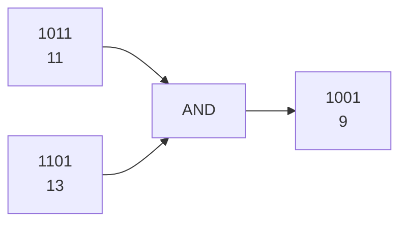

AND được dùng cực nhiều cho:

```text
check bit
clear bit
extract bits
intersection
power of two
count set bits
```

---

# 4. OR — `|`

Truth table:

|  A |  B | A | B |
| -: | -: | ----: |
|  0 |  0 |     0 |
|  0 |  1 |     1 |
|  1 |  0 |     1 |
|  1 |  1 |     1 |

Ví dụ:

```text
  1010
| 0101
------
  1111
```

Ý tưởng:

> OR dùng để **bật bit**.

Nếu một bit đã `1` thì vẫn `1`.

Đây là nền tảng của:

```text
set bit
combine flags
visited states
bitmask
```

---

# 5. XOR — `^`

Truth table:

|  A |  B | A ^ B |
| -: | -: | ----: |
|  0 |  0 |     0 |
|  0 |  1 |     1 |
|  1 |  0 |     1 |
|  1 |  1 |     0 |

XOR đặc biệt quan trọng.

Có thể nhớ:

> XOR = khác nhau thì `1`.

Ví dụ:

```text
  1011
^ 1101
------
  0110
```

---

# 6. Các property cực kỳ quan trọng của XOR

Có bốn property bạn nên thuộc.

```text
x ^ x = 0
x ^ 0 = x
x ^ y = y ^ x
(x ^ y) ^ z = x ^ (y ^ z)
```

Đặc biệt:

```text
x ^ x = 0
```

là nền tảng của hàng loạt bài interview.

Ví dụ:

```text
4 ^ 1 ^ 2 ^ 1 ^ 2
```

do XOR có commutative + associative:

```text
= 4 ^ (1 ^ 1) ^ (2 ^ 2)

= 4 ^ 0 ^ 0

= 4
```

Đây chính là tư tưởng của LeetCode 136 — Single Number.

---

# 7. NOT — `~`

NOT đảo tất cả bit:

```text
0 → 1
1 → 0
```

Ví dụ về mặt ý tưởng:

```text
x

00001010

~x

11110101
```

Nhưng Java `int` có **32 bits**, nên:

```java
int x = 10;
System.out.println(~x);
```

không trả về `5`.

Nó trả:

```text
-11
```

Vì Java dùng biểu diễn signed two's complement.

Có công thức rất hữu ích:

```text
~x = -(x + 1)
```

Ví dụ:

```text
~10 = -11
~5  = -6
~0  = -1
```

---

# 8. Left Shift `<<`

Bit manipulation gần như không thể học riêng AND/OR/XOR mà không học shift.

```java
x << k
```

dịch các bit sang trái `k` vị trí.

Ví dụ:

```text
0011 = 3

3 << 1

0110 = 6
```

Thông thường:

```text
x << k ≈ x × 2^k
```

Ví dụ:

```java
5 << 3
```

≈

```text
5 × 8 = 40
```

---

# 9. Right Shift `>>`

```java
x >> k
```

dịch bit sang phải.

Ví dụ:

```text
1100 = 12

12 >> 2

0011 = 3
```

Thông thường với số dương:

```text
x >> k ≈ x / 2^k
```

---

# 10. `>>` và `>>>` trong Java

Java có hai right shifts.

```java
>>
```

là signed right shift.

Nó giữ sign bit.

Trong khi:

```java
>>>
```

là unsigned right shift.

Nó chèn `0` vào bên trái.

Ví dụ:

```java
int x = -8;

System.out.println(x >> 1);
System.out.println(x >>> 1);
```

Hai kết quả rất khác nhau.

Điều này đặc biệt quan trọng khi làm bit trên `int`.

---

# 11. Bitmask là gì?

Đây là phần quan trọng nhất.

Giả sử ta có một tập:

```text
{A, B, C, D}
```

Ta có thể dùng 4 bit để biểu diễn việc phần tử có tồn tại hay không.

```text
bit 0 → A
bit 1 → B
bit 2 → C
bit 3 → D
```

Ví dụ:

```text
mask = 1011
```

nghĩa là:

```text
D = 1
C = 0
B = 1
A = 1
```

tức tập:

```text
{A, B, D}
```

Mermaid:

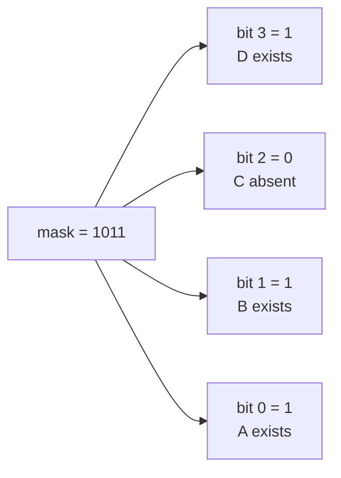

Một integer có thể trở thành một **mini set**.

---

# 12. Pattern 1 — Check một bit

Câu hỏi:

> Bit thứ `k` có đang bật không?

Tạo mask:

```java
1 << k
```

sau đó:

```java
(x & (1 << k)) != 0
```

Ví dụ:

```text
x = 101101
```

muốn check bit `2`:

```text
mask = 000100
```

AND:

```text
  101101
& 000100
--------
  000100
```

khác `0`.

Vậy bit 2 đang bật.

Template:

```java
boolean isSet(int x, int k) {
    return (x & (1 << k)) != 0;
}
```

---

# 13. Pattern 2 — Set một bit

Muốn bật bit `k`:

```java
x | (1 << k)
```

Ví dụ:

```text
x = 1001
```

muốn bật bit 2:

```text
  1001
| 0100
------
  1101
```

Template:

```java
int setBit(int x, int k) {
    return x | (1 << k);
}
```

---

# 14. Pattern 3 — Clear một bit

Muốn đưa bit `k` về `0`.

Không thể dùng:

```java
x & (1 << k)
```

vì biểu thức này chỉ giữ bit đó.

Thay vào đó:

```java
x & ~(1 << k)
```

Ví dụ:

```text
x = 1101
```

clear bit 2:

```text
1 << 2

0100
```

NOT:

```text
1011
```

AND:

```text
  1101
& 1011
------
  1001
```

Template:

```java
int clearBit(int x, int k) {
    return x & ~(1 << k);
}
```

---

# 15. Pattern 4 — Toggle một bit

Toggle:

```text
0 → 1
1 → 0
```

XOR làm đúng việc đó.

```java
x ^ (1 << k)
```

Ví dụ:

```text
x = 1011
```

toggle bit 1:

```text
  1011
^ 0010
------
  1001
```

Template:

```java
int toggleBit(int x, int k) {
    return x ^ (1 << k);
}
```

---

# 16. Bốn operation nên thuộc lòng

```java
// check
(x & (1 << k)) != 0

// set
x |= (1 << k);

// clear
x &= ~(1 << k);

// toggle
x ^= (1 << k);
```

Đây là bảng nền móng của bitmask.

---

# 17. Pattern 5 — XOR Cancellation

Pattern:

> Các phần tử xuất hiện chẵn lần tự triệt tiêu.

Do:

```text
x ^ x = 0
```

## Bài toán: LeetCode 136 — Single Number

Array:

```text
[4,1,2,1,2]
```

Mỗi số xuất hiện hai lần trừ một số.

Brute force có thể dùng HashMap:

```text
O(n) time
O(n) space
```

Nhưng XOR:

```java
public int singleNumber(int[] nums) {

    int xor = 0;

    for (int num : nums) {
        xor ^= num;
    }

    return xor;
}
```

Flow:

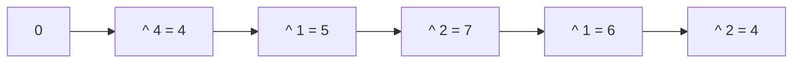

Complexity:

```text
Time:  O(n)
Space: O(1)
```

---

# 18. Pattern 6 — Missing Number bằng XOR

LeetCode 268.

Có các số:

```text
0 → n
```

nhưng thiếu một số.

Ví dụ:

```text
nums = [3,0,1]
```

Range đáng lẽ:

```text
0,1,2,3
```

missing:

```text
2
```

Ý tưởng XOR:

```text
0 ^ 1 ^ 2 ^ 3
^
3 ^ 0 ^ 1
```

Các số xuất hiện cả hai phía cancel.

Còn lại:

```text
2
```

Implementation:

```java
public int missingNumber(int[] nums) {

    int xor = nums.length;

    for (int i = 0; i < nums.length; i++) {

        xor ^= i;
        xor ^= nums[i];
    }

    return xor;
}
```

Ví dụ:

```text
nums.length = 3

xor = 3

i=0:
3 ^ 0 ^ 3

i=1:
^ 1 ^ 0

i=2:
^ 2 ^ 1
```

Các số:

```text
0
1
3
```

triệt tiêu.

Còn lại:

```text
2
```

---

# 19. Pattern 7 — Check power of two

Các power of two có dạng:

```text
1  = 0001
2  = 0010
4  = 0100
8  = 1000
16 = 10000
```

Đặc điểm:

> Chỉ có đúng một bit `1`.

Xét:

```text
x = 8

1000
```

`x - 1`:

```text
0111
```

AND:

```text
1000
0111
----
0000
```

Do đó:

```java
n > 0 && (n & (n - 1)) == 0
```

LeetCode 231:

```java
public boolean isPowerOfTwo(int n) {
    return n > 0 && (n & (n - 1)) == 0;
}
```

---

# 20. Pattern 8 — `x & (x - 1)`

Đây là một trong những công thức quan trọng nhất của bit manipulation.

Nó có ý nghĩa:

> Xóa lowest set bit.

Ví dụ:

```text
x = 1011000
```

Lowest `1` nằm ở:

```text
0001000
```

Xét:

```text
x     = 1011000
x - 1 = 1010111
```

AND:

```text
  1011000
& 1010111
---------
  1010000
```

Một bit `1` đã biến mất.

---

# 21. Pattern 9 — Count set bits

Bài LeetCode 191 — Number of 1 Bits.

Cách thông thường:

```java
int count = 0;

while (n != 0) {

    count += n & 1;

    n >>>= 1;
}
```

Có thể phải chạy 32 lần.

Nhưng Brian Kernighan Algorithm:

```java
public int hammingWeight(int n) {

    int count = 0;

    while (n != 0) {

        n &= (n - 1);

        count++;
    }

    return count;
}
```

Ví dụ:

```text
n = 1011000
```

Lần 1:

```text
1011000
1010111
-------
1010000
```

Lần 2:

```text
1010000
1001111
-------
1000000
```

Lần 3:

```text
1000000
0111111
-------
0000000
```

Có 3 bit `1`.

Complexity:

```text
O(number of set bits)
```

thay vì luôn phải kiểm tra tất cả bit.

---

# 22. Pattern 10 — Isolate Lowest Set Bit

Một công thức nổi tiếng:

```text
x & -x
```

Nó lấy riêng lowest set bit.

Ví dụ:

```text
x = 12

1100
```

lowest set bit là:

```text
0100
```

và:

```text
12 & -12 = 4
```

Tại sao?

Do two's complement:

```text
-x = ~x + 1
```

Ví dụ:

```text
x

...001100

~x

...110011

+1

...110100
```

AND:

```text
...001100
...110100
---------
...000100
```

---

# 23. Bài toán cực điển hình — Single Number III

LeetCode 260.

Đề:

```text
[1,2,1,3,2,5]
```

Có hai số xuất hiện một lần:

```text
3
5
```

Các số còn lại xuất hiện hai lần.

Nếu XOR toàn bộ:

```text
xor = 3 ^ 5
```

Ta chưa có trực tiếp `3` và `5`.

Nhưng vì:

```text
3 != 5
```

nên:

```text
3 ^ 5
```

phải có ít nhất một bit bằng `1`.

Bit đó nói rằng:

> 3 và 5 khác nhau tại vị trí này.

Ta isolate một bit:

```java
int diffBit = xor & -xor;
```

Sau đó chia array thành hai nhóm.

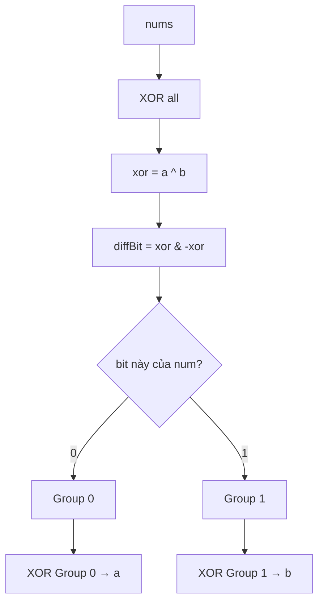

Implementation:

```java
public int[] singleNumber(int[] nums) {

    int xor = 0;

    for (int num : nums) {
        xor ^= num;
    }

    int diffBit = xor & -xor;

    int a = 0;
    int b = 0;

    for (int num : nums) {

        if ((num & diffBit) == 0) {
            a ^= num;
        } else {
            b ^= num;
        }
    }

    return new int[]{a, b};
}
```

Complexity:

```text
Time:  O(n)
Space: O(1)
```

---

# 24. Pattern 11 — Bitmask biểu diễn một tập hợp

Giả sử:

```text
items = {A,B,C,D}
```

Mask:

```text
1010
```

nghĩa là:

```text
B và D được chọn
```

Nếu muốn kiểm tra item `i`:

```java
(mask & (1 << i)) != 0
```

Đây chính là cơ sở của bài **Subsets**.

---

# 25. LeetCode 78 — Subsets bằng Bitmask

Input:

```text
[1,2,3]
```

Có:

```text
2^3 = 8
```

subsets.

Mỗi subset có thể tương ứng với một binary mask:

```text
000 → []
001 → [1]
010 → [2]
011 → [1,2]
100 → [3]
101 → [1,3]
110 → [2,3]
111 → [1,2,3]
```

Mermaid:

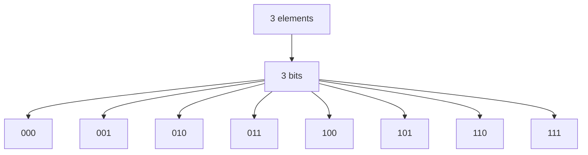

Implementation:

```java
public List<List<Integer>> subsets(int[] nums) {

    List<List<Integer>> result = new ArrayList<>();

    int n = nums.length;

    int totalMasks = 1 << n;

    for (int mask = 0; mask < totalMasks; mask++) {

        List<Integer> subset = new ArrayList<>();

        for (int i = 0; i < n; i++) {

            if ((mask & (1 << i)) != 0) {
                subset.add(nums[i]);
            }
        }

        result.add(subset);
    }

    return result;
}
```

Complexity:

```text
Có 2^n subsets.

Mỗi subset check n bits.

Time:
O(n × 2^n)

Space output:
O(n × 2^n)
```

---

# 26. Pattern 12 — Permissions / Flags

Đây là ứng dụng thực tế cực phổ biến.

Giả sử hệ thống có quyền:

```text
READ
WRITE
DELETE
ADMIN
```

Ta gán:

```java
static final int READ   = 1 << 0; // 0001
static final int WRITE  = 1 << 1; // 0010
static final int DELETE = 1 << 2; // 0100
static final int ADMIN  = 1 << 3; // 1000
```

Một user có:

```text
READ + WRITE
```

thì:

```java
int permissions = READ | WRITE;
```

binary:

```text
0011
```

Check:

```java
if ((permissions & WRITE) != 0) {
    System.out.println("Can write");
}
```

Add permission:

```java
permissions |= DELETE;
```

Remove permission:

```java
permissions &= ~WRITE;
```

Toggle:

```java
permissions ^= ADMIN;
```

Mermaid:

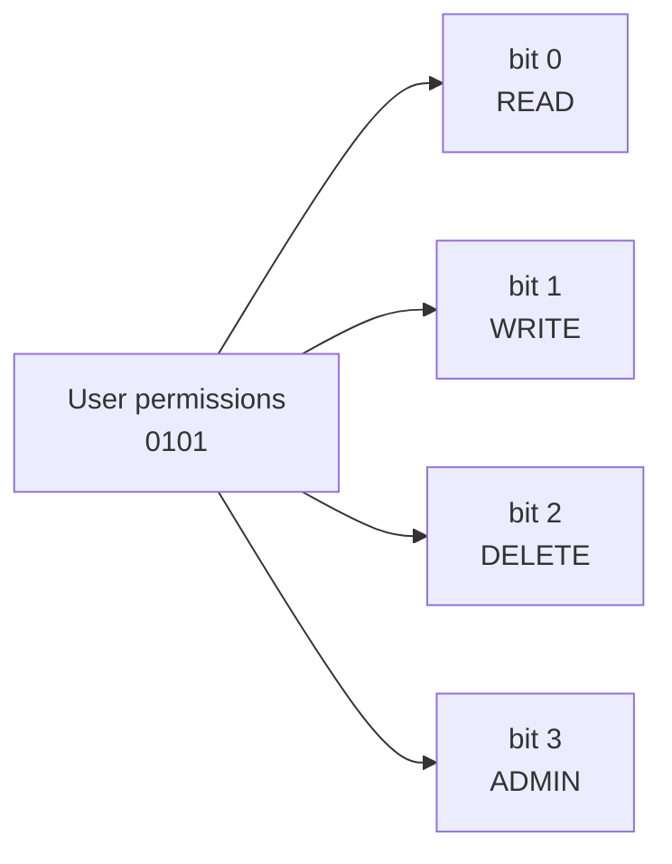

Đây chính là một bitmask trong production system.

---

# 27. Pattern 13 — AND để tìm intersection

Nếu hai mask biểu diễn hai tập:

```text
A = 10110
B = 01110
```

Intersection:

```text
A & B
```

```text
  10110
& 01110
-------
  00110
```

Ví dụ practical:

```text
userPermissions & requiredPermissions
```

Hoặc:

```text
skillsCandidate & requiredSkills
```

---

# 28. Pattern 14 — OR để Union

Union của hai set:

```java
A | B
```

Ví dụ:

```text
A = 10100
B = 00111
```

```text
  10100
| 00111
-------
  10111
```

Tức:

```text
A ∪ B
```

---

# 29. Pattern 15 — XOR để tìm Difference

XOR của hai bitmask:

```java
A ^ B
```

cho biết:

> Những bit khác nhau giữa hai state.

Ví dụ:

```text
before = 101101
after  = 111001
```

```text
before ^ after

010100
```

Các bit `1` chính là những state đã thay đổi.

Application:

```text
change detection
board state
game state
permissions
version diff
```

---

# 30. Pattern 16 — Minimum Flips dùng XOR

Giả sử cần biến:

```text
A
```

thành:

```text
B
```

Mỗi operation flip một bit.

Số bit cần flip:

```text
number of 1 bits in A ^ B
```

Ví dụ:

```text
A = 10110
B = 11101
```

XOR:

```text
01011
```

Có 3 bit `1`.

Vậy cần:

```text
3 flips
```

Implementation:

```java
int minFlips(int a, int b) {

    int diff = a ^ b;

    int count = 0;

    while (diff != 0) {
        diff &= diff - 1;
        count++;
    }

    return count;
}
```

---

# 31. Pattern 17 — OR equation

Bài điển hình:

> Minimum Flips to Make `a OR b == c`

LeetCode 1318.

Ta xét từng bit.

Với mỗi bit:

```text
aBit
bBit
cBit
```

Nếu:

```text
cBit = 1
```

thì:

```text
aBit OR bBit
```

phải có ít nhất một `1`.

Nếu:

```text
aBit = 0
bBit = 0
```

cần một flip.

Ngược lại nếu:

```text
cBit = 0
```

thì:

```text
aBit
bBit
```

đều phải `0`.

Mỗi bit đang là `1` cần một flip.

Implementation:

```java
public int minFlips(int a, int b, int c) {

    int result = 0;

    while (a != 0 || b != 0 || c != 0) {

        int bitA = a & 1;
        int bitB = b & 1;
        int bitC = c & 1;

        if (bitC == 1) {

            if (bitA == 0 && bitB == 0) {
                result++;
            }

        } else {

            result += bitA + bitB;
        }

        a >>= 1;
        b >>= 1;
        c >>= 1;
    }

    return result;
}
```

---

# 32. Pattern 18 — Prefix XOR

Bạn rất quen:

```text
prefix sum
```

thì XOR cũng có:

```text
prefix XOR
```

Định nghĩa:

```text
prefix[i] =
arr[0] ^ arr[1] ^ ... ^ arr[i]
```

Do:

```text
x ^ x = 0
```

range XOR:

```text
L ... R
```

có thể tính:

```text
prefix[R] ^ prefix[L - 1]
```

Tại sao?

Ví dụ:

```text
prefix[R]

a0 ^ a1 ^ a2 ^ a3 ^ a4
```

và:

```text
prefix[L-1]

a0 ^ a1
```

XOR:

```text
a0 ^ a1 ^ a2 ^ a3 ^ a4
^
a0 ^ a1
```

`a0` và `a1` cancel.

Còn:

```text
a2 ^ a3 ^ a4
```

Mermaid:

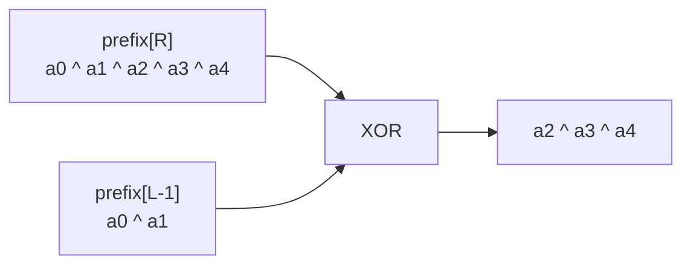

Implementation:

```java
int[] prefix = new int[n];

prefix[0] = nums[0];

for (int i = 1; i < n; i++) {
    prefix[i] = prefix[i - 1] ^ nums[i];
}
```

Range:

```java
int rangeXor;

if (left == 0) {
    rangeXor = prefix[right];
} else {
    rangeXor = prefix[right] ^ prefix[left - 1];
}
```

---

# 33. Prefix Sum vs Prefix XOR

Hai pattern gần như giống hệt nhau.

Prefix sum:

```text
prefix[r] - prefix[l-1]
```

Prefix XOR:

```text
prefix[r] ^ prefix[l-1]
```

Lý do khác nhau:

```text
sum cần inverse là subtraction

XOR inverse chính là XOR
```

vì:

```text
x ^ x = 0
```

---

# 34. Pattern 19 — Bitmask + DP

Đây là pattern nâng cao cực quan trọng.

Ví dụ:

> Có `n` thành phố. Hãy đi qua tất cả thành phố với minimum cost.

Ta cần lưu:

```text
đã visit thành phố nào?
```

Thay vì dùng:

```java
boolean[] visited;
```

trong DP state, ta dùng:

```text
mask
```

Ví dụ:

```text
mask = 1011
```

nghĩa là:

```text
city 0 visited
city 1 visited
city 2 not visited
city 3 visited
```

State:

```text
dp[mask][city]
```

nghĩa là:

> Minimum cost khi đã visit các city trong `mask` và đang đứng tại `city`.

Mermaid:

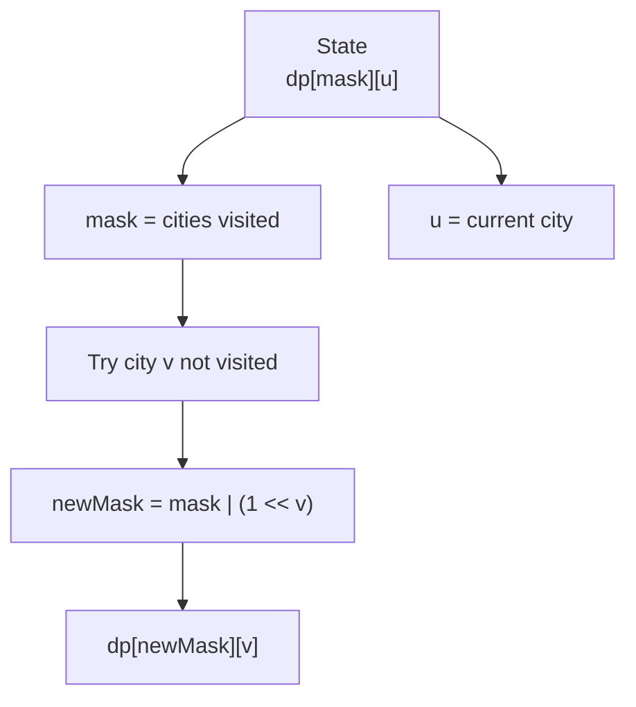

Transition:

```java
int newMask = mask | (1 << next);

dp[newMask][next] =
    Math.min(
        dp[newMask][next],
        dp[mask][current] + cost[current][next]
    );
```

Complexity thường:

```text
O(2^n × n²)
```

Đây là lý do bitmask DP chỉ thường dùng khi:

```text
n ≈ 15–20
```

---

# 35. Pattern 20 — Enumerate tất cả submasks

Đây là pattern nâng cao nhưng rất hay gặp trong competitive programming / hard interview.

Nếu:

```text
mask = 10110
```

ta muốn iterate tất cả submask của nó.

Template:

```java
for (int sub = mask; sub > 0; sub = (sub - 1) & mask) {

}
```

Ví dụ nếu mask có:

```text
k
```

bits bật thì có:

```text
2^k
```

submasks.

Đây là một template đáng nhớ nếu học bitmask DP sâu.

---

# 36. Pattern 21 — Counting Bits DP

LeetCode 338 — Counting Bits.

Yêu cầu:

```text
ans[i] = số lượng bit 1 của i
```

Ví dụ:

```text
0 → 0
1 → 1
2 → 1
3 → 2
4 → 1
5 → 2
```

Ta biết:

```text
i & (i - 1)
```

xóa một set bit.

Vì vậy:

```text
bits[i] =
bits[i & (i - 1)] + 1
```

Implementation:

```java
public int[] countBits(int n) {

    int[] dp = new int[n + 1];

    for (int i = 1; i <= n; i++) {

        dp[i] = dp[i & (i - 1)] + 1;
    }

    return dp;
}
```

Ví dụ:

```text
i = 12

1100

12 & 11

1100
1011
----
1000 = 8
```

Nên:

```text
bits[12]
=
bits[8] + 1
```

---

# 37. Pattern 22 — Check odd/even

Bit cuối cùng quyết định parity.

```text
even → bit cuối = 0
odd  → bit cuối = 1
```

Thay vì:

```java
x % 2
```

có thể:

```java
(x & 1)
```

Check odd:

```java
boolean odd = (x & 1) == 1;
```

Check even:

```java
boolean even = (x & 1) == 0;
```

Ví dụ:

```text
6 = 110
7 = 111
```

---

# 38. Pattern 23 — Get bit thứ k

Có hai cách.

Cách 1:

```java
(x & (1 << k)) != 0
```

Cách 2:

```java
(x >> k) & 1
```

Ví dụ:

```java
int bit = (x >> k) & 1;
```

Nếu bit đang `1`:

```text
return 1
```

ngược lại:

```text
return 0
```

---

# 39. Pattern 24 — Find highest / lowest set bit

Lowest set bit:

```java
x & -x
```

Lowest set bit position có thể dùng Java:

```java
Integer.numberOfTrailingZeros(x)
```

Highest set bit:

```java
Integer.highestOneBit(x)
```

Ví dụ:

```java
Integer.highestOneBit(13);
```

```text
13 = 1101
```

highest one bit:

```text
1000 = 8
```

---

# 40. Pattern 25 — Range Bitwise AND

LeetCode 201.

Ví dụ:

```text
left  = 5 = 101
right = 7 = 111
```

Ta cần:

```text
5 & 6 & 7
```

```text
101
110
111
---
100
```

Observation:

> Các bit thấp thay đổi liên tục trong một range, nên chúng cuối cùng thành `0`.

Chỉ common binary prefix còn tồn tại.

```text
5 = 101
6 = 110
7 = 111
```

Common prefix:

```text
1__
```

answer:

```text
100
```

Solution:

```java
public int rangeBitwiseAnd(int left, int right) {

    int shifts = 0;

    while (left < right) {

        left >>= 1;
        right >>= 1;

        shifts++;
    }

    return left << shifts;
}
```

Mermaid:

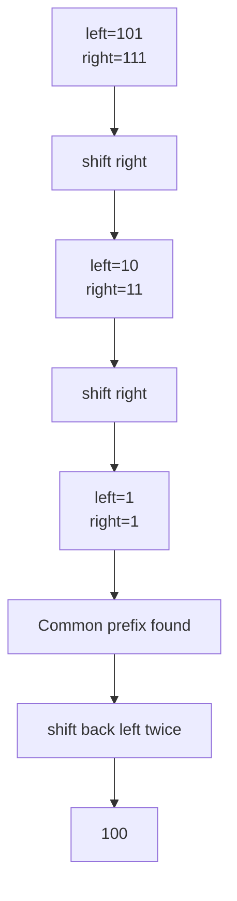

---

# 41. Một điều rất quan trọng: Bitwise vs Logical Operator

Trong Java:

```java
&
|
^
~
```

là bitwise operators.

Trong khi:

```java
&&
||
!
```

là logical operators.

Ví dụ:

```java
true && false
```

cho:

```text
false
```

Nhưng:

```java
5 & 3
```

là:

```text
101
011
---
001
```

result:

```text
1
```

Đừng nhầm:

```text
&  ≠ &&
|  ≠ ||
~  ≠ !
```

---

# 42. Một bug precedence rất hay gặp

Giả sử muốn check bit:

```java
if ((mask & (1 << i)) != 0)
```

Hãy luôn dùng ngoặc rõ ràng.

Đừng cố viết biểu thức quá ngắn.

Trong interview, readability quan trọng hơn việc khoe bit trick.

---

# 43. Java int có bao nhiêu bit?

Java:

```java
int
```

luôn:

```text
32 bits
```

```java
long
```

luôn:

```text
64 bits
```

Nếu dùng bitmask với hơn 31 state:

```java
1 << i
```

có thể overflow.

Khi dùng long:

```java
1L << i
```

Ví dụ:

```java
long mask = 1L << 40;
```

không phải:

```java
long mask = 1 << 40;
```

Đây là bug rất phổ biến.

---

# 44. Dấu âm và sign bit

Với Java `int`:

```text
bit 31
```

là sign bit.

Ví dụ:

```text
00000000 ... 0001 = 1
```

nhưng:

```text
10000000 ... 0000
```

là:

```text
Integer.MIN_VALUE
```

Do two's complement.

Vì vậy, khi thao tác 32 bits, đôi khi bạn nên dùng:

```java
>>>
```

thay vì:

```java
>>
```

---

# 45. Mental Model quan trọng nhất

Bạn có thể phân loại operators như sau:

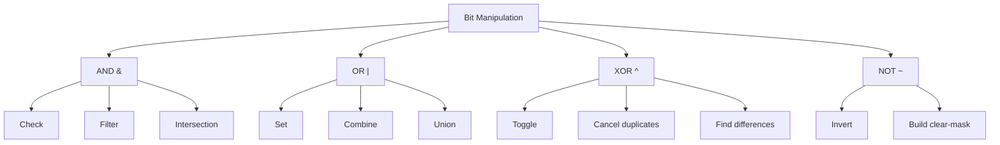

Có thể nhớ ngắn:

```text
AND → giữ
OR  → bật
XOR → đổi / cancel
NOT → đảo
```

---

# 46. Pattern Recognition trong coding interview

Khi đọc đề, nếu thấy những dấu hiệu sau thì nên nghĩ đến bit manipulation:

```text
unique number
appears twice
power of two
binary
flags
permissions
subset
small n ≈ 20
state compression
toggle
minimum bit flips
Hamming distance
XOR range
parity
set membership
```

Đặc biệt câu:

> Every element appears twice except one.

Gần như interviewer đang hét:

```text
XOR!
```

---

# 47. Các công thức bit manipulation nên thuộc

Đây là bảng quan trọng nhất của cả bài.

| Operation         | Formula                       |
| ----------------- | ----------------------------- |
| Check bit k       | `(x & (1 << k)) != 0`         |
| Get bit k         | `(x >> k) & 1`                |
| Set bit k         | `x \| (1 << k)`               |
| Clear bit k       | `x & ~(1 << k)`               |
| Toggle bit k      | `x ^ (1 << k)`                |
| Remove lowest 1   | `x & (x - 1)`                 |
| Get lowest 1      | `x & -x`                      |
| Check power of 2  | `x > 0 && (x & (x - 1)) == 0` |
| Odd/even          | `x & 1`                       |
| Multiply by `2^k` | `x << k`                      |
| Divide by `2^k`   | `x >> k`                      |
| Union             | `A \| B`                      |
| Intersection      | `A & B`                       |
| Difference/change | `A ^ B`                       |

---

# 48. Roadmap bài tập nên luyện

Nếu mục tiêu của bạn là coding interview, tôi khuyên luyện theo thứ tự pattern, không luyện random.

### Level 1 — Bit basics

```text
191. Number of 1 Bits
231. Power of Two
338. Counting Bits
461. Hamming Distance
2220. Minimum Bit Flips to Convert Number
```

Mục tiêu:

```text
&
^
x & (x-1)
```

---

### Level 2 — XOR pattern

```text
136. Single Number
268. Missing Number
389. Find the Difference
260. Single Number III
```

Mục tiêu:

```text
x ^ x = 0
prefix XOR
lowest set bit
```

---

### Level 3 — Bitmask

```text
78. Subsets
401. Binary Watch
784. Letter Case Permutation
```

Mục tiêu:

```text
mask = 0 → (1 << n) - 1
```

và:

```java
(mask & (1 << i)) != 0
```

---

### Level 4 — Bitwise reasoning

```text
1318. Minimum Flips to Make a OR b Equal to c
201. Bitwise AND of Numbers Range
137. Single Number II
1442. Count Triplets That Can Form Two Arrays of Equal XOR
```

---

### Level 5 — Advanced bitmask

```text
473. Matchsticks to Square
698. Partition to K Equal Sum Subsets
847. Shortest Path Visiting All Nodes
1125. Smallest Sufficient Team
```

Đây là vùng:

```text
DFS + bitmask
BFS + bitmask
DP + bitmask
```

rất quan trọng nếu gặp bài state compression.

---

# 49. Một template suy nghĩ khi gặp bài bit

Khi gặp một bài nghi ngờ bit manipulation, bạn có thể tự hỏi theo flow sau:

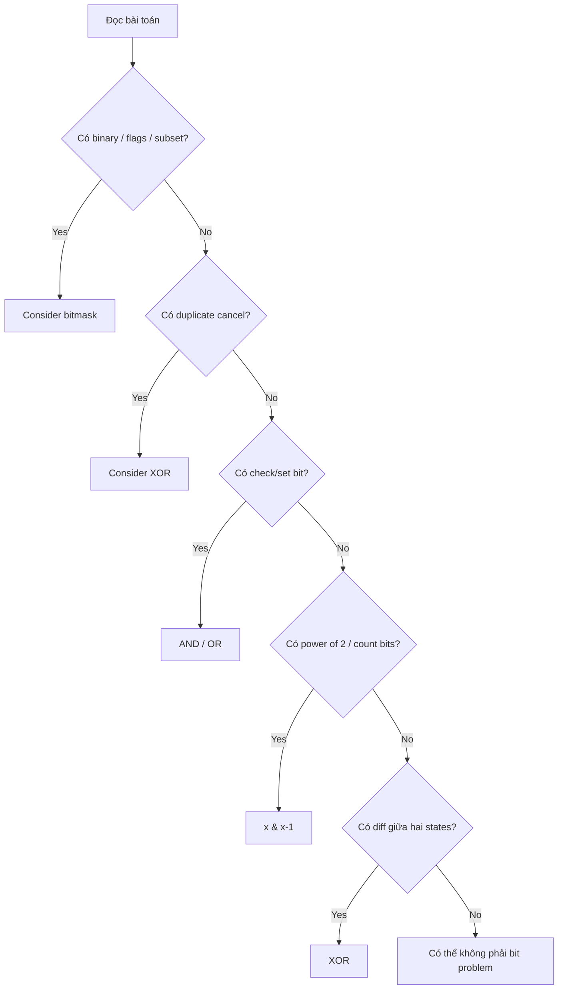

---

# 50. Bốn mental models bạn nên nhớ cho interview

Thay vì cố nhớ hàng chục trick, hãy nhớ:

### AND

```text
AND = filter
```

Ví dụ:

```text
check một bit
intersection
giữ lại một số bits
```

### OR

```text
OR = add / combine
```

Ví dụ:

```text
set một bit
thêm state vào mask
union
```

### XOR

```text
XOR = difference / toggle / cancellation
```

Ví dụ:

```text
remove duplicate pairs
compare states
toggle bit
prefix XOR
```

### NOT

```text
NOT = inversion
```

Thường kết hợp với AND:

```java
x & ~(1 << k)
```

để clear bit.

---

# 51. Bộ template Java nên thuộc

```java
// Check bit
boolean set = (mask & (1 << i)) != 0;

// Set bit
mask |= (1 << i);

// Remove bit
mask &= ~(1 << i);

// Toggle bit
mask ^= (1 << i);

// Get bit
int bit = (mask >> i) & 1;

// Remove lowest set bit
mask &= mask - 1;

// Get lowest set bit
int lowest = mask & -mask;

// Power of two
boolean powerOfTwo =
        mask > 0 &&
        (mask & (mask - 1)) == 0;

// Count set bits
int count = 0;

while (mask != 0) {
    mask &= mask - 1;
    count++;
}
```

Với subset:

```java
for (int mask = 0; mask < (1 << n); mask++) {

    for (int i = 0; i < n; i++) {

        if ((mask & (1 << i)) != 0) {

            // nums[i] belongs to this subset
        }
    }
}
```

Với submask:

```java
for (
    int sub = mask;
    sub > 0;
    sub = (sub - 1) & mask
) {

}
```

---

# 52. Mindmap tổng kết

```mermaid
flowchart TD
    ROOT["Bit Manipulation"]

    ROOT --> AND["AND &"]
    ROOT --> OR["OR |"]
    ROOT --> XOR["XOR ^"]
    ROOT --> NOT["NOT ~"]
    ROOT --> MASK["Bitmask"]
    ROOT --> SHIFT["Shift"]

    AND --> A1["Check bit"]
    AND --> A2["Intersection"]
    AND --> A3["x & x-1"]

    OR --> O1["Set bit"]
    OR --> O2["Union"]
    OR --> O3["Add state"]

    XOR --> X1["Toggle"]
    XOR --> X2["Cancel duplicate"]
    XOR --> X3["Difference"]
    XOR --> X4["Prefix XOR"]

    NOT --> N1["Invert"]
    NOT --> N2["Clear bit"]

    MASK --> M1["Subset"]
    MASK --> M2["Permissions"]
    MASK --> M3["State compression"]
    MASK --> M4["DP / BFS / DFS"]

    SHIFT --> S1["1 << k"]
    SHIFT --> S2["Extract bit"]
    SHIFT --> S3["Multiply / divide powers of 2"]
```

Nếu mục tiêu hiện tại của bạn là **coding interview Axon**, nhóm cần thuộc chắc nhất là: `check/set/clear bit`, `x & (x-1)`, `x & -x`, XOR cancellation, Single Number I/III, Missing Number, Counting Bits, Subsets bằng bitmask, Prefix XOR và Bitmask + BFS/DP. Đây là phần có tỷ lệ ứng dụng cao nhất; các bit trick hiếm hơn chỉ nên học sau khi những pattern này đã thành phản xạ.
