# B-tree Deeper Mechanics in Database Systems

> Mục tiêu: hiểu B-tree ở mức **database internals** — từ page layout, search path, split/merge, concurrency, WAL, MVCC, composite index cho tới cost model — thay vì chỉ ghi nhớ `O(log N)`.

---

## 1. Mental model đúng: B-tree là cây được thiết kế cho **page-oriented storage**

Điểm khởi đầu quan trọng nhất là: B-tree không sinh ra để thắng Binary Search Tree về số phép so sánh CPU. Nó sinh ra để giảm số lần phải truy cập **storage page/block**.

Một BST cân bằng có branching factor xấp xỉ 2. Nếu có 1 tỷ key, chiều cao khoảng 30. Trong khi một B-tree node có thể chứa hàng trăm separator keys và hàng trăm child pointers, nên branching factor (fan-out) có thể là hàng trăm. Vì vậy cây thường chỉ cao 3–5 page levels, ngay cả khi có hàng trăm triệu hay hàng tỷ rows.

Bayer & McCreight ngay từ công trình gốc đã mô tả B-tree như một cách tổ chức index cho storage ngẫu nhiên kiểu disk/drum, với mục tiêu giảm số lần truy cập thiết bị lưu trữ [1].

### 1.1 Node trong textbook ≈ page trong DBMS

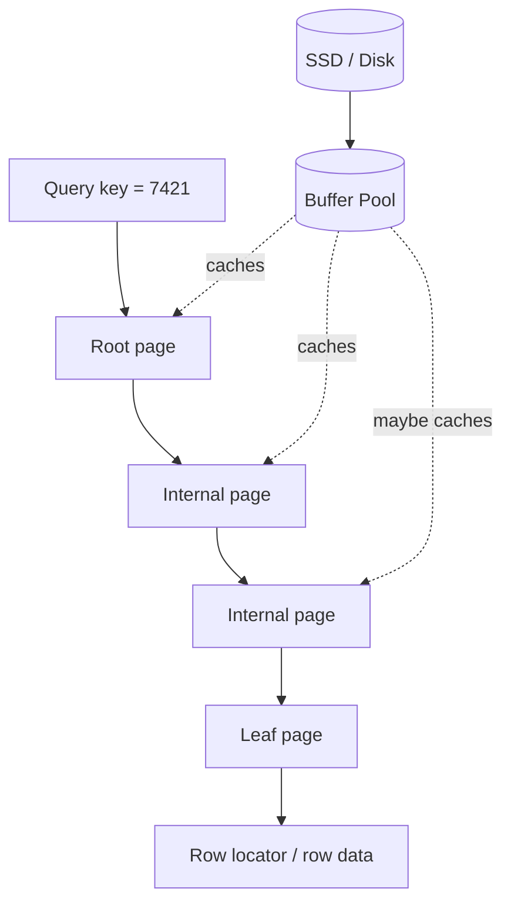

Mỗi lần đi xuống một level về mặt logic là một lần chọn child pointer; về mặt physical, nếu page chưa nằm trong buffer pool thì DBMS phải fetch page từ storage.

Do đó chi phí thực tế gần với:

```text
cost ≈ page reads + CPU comparisons + possible heap/clustered-row lookup
```

chứ không chỉ đơn giản là `log N`.

---

## 2. B-tree, B+Tree và cái DBMS gọi là “B-tree”

### 2.1 Classic B-tree

Classic B-tree có thể chứa key/value records ở cả internal node và leaf node.

### 2.2 B+Tree

B+Tree thường có:

- internal pages: separator/pivot keys + child pointers;
- leaf pages: actual index entries;
- leaf pages nối ngang với nhau để range scan hiệu quả.

Các DBMS hiện đại thường triển khai một cấu trúc thuộc họ B+Tree/B-link-tree dù tài liệu vendor thường gọi chung là **B-tree**.

PostgreSQL mô tả internal pages chứa tuples trỏ xuống level dưới, leaf pages chứa tuples trỏ tới table rows; các page trên cùng level được nối ngang. InnoDB cũng lưu index records ở leaf pages [2][5].

```mermaid
flowchart TB
    R[Root: separators 100 | 500 | 900]
    R --> A[Internal: <100]
    R --> B[Internal: 100..499]
    R --> C[Internal: 500..899]
    R --> D[Internal: >=900]

    B --> L1[Leaf: 100..199]
    B --> L2[Leaf: 200..349]
    B --> L3[Leaf: 350..499]

    L1 <--> L2
    L2 <--> L3
```

Điểm quan trọng: separator trong internal node không nhất thiết là một “record thật” cần trả về query. Nó chủ yếu mô tả **key-space routing**.

---

## 3. Invariants cốt lõi

Một B-tree/B+Tree đúng phải giữ một số invariants:

1. Keys trong page được sắp xếp theo comparator/operator class.
2. Internal separator keys chia toàn bộ key space thành các khoảng không chồng lấn về mặt routing.
3. Tất cả leaf pages nằm cùng depth.
4. Node có giới hạn occupancy; khi quá đầy phải split, khi quá rỗng có thể redistribute/merge.
5. Root là ngoại lệ: có thể chứa ít entries hơn minimum occupancy.

Điều số 3 làm B-tree luôn balanced. Không giống BST, không có trường hợp một branch sâu 20 level còn branch khác sâu 3 level.

---

## 4. Fan-out: lý do B-tree rất “nông”

Giả sử một internal page usable khoảng 8 KiB và mỗi separator + pointer + metadata tốn trung bình 24–32 bytes.

```text
fan-out ≈ usable_page_bytes / bytes_per_internal_entry
```

Ví dụ rất thô:

```text
8192 / 32 ≈ 256 children/page
```

Nếu fan-out xấp xỉ 256 và mỗi leaf chứa khoảng 256 entries:

```text
1 leaf level                   ≈ 256 rows
root -> leaf                   ≈ 256^2  = 65,536 rows
root -> internal -> leaf       ≈ 256^3  = 16.7 million rows
root -> int -> int -> leaf     ≈ 256^4  = 4.29 billion rows
```

Đây chỉ là toy model; key width, tuple overhead, fillfactor, compression, INCLUDE columns và duplicate representation đều làm fan-out thay đổi. Nhưng nó cho thấy ý tưởng chính: **height thấp vì branching factor cực lớn**.

PostgreSQL còn dùng suffix truncation để làm pivot tuples nhỏ hơn, qua đó tăng fan-out và trì hoãn internal/root split [3].

---

## 5. Physical page layout: node không phải một Java/C++ object đơn giản

Một database page thường là một block bytes với header, slot/item pointers, free space và tuple payload.

PostgreSQL mặc định dùng page 8 KiB; page có `PageHeaderData`, item identifier array, free space, items và index-specific special space. B-tree dùng special space để lưu sibling links và metadata của page [4]. MySQL InnoDB mặc định dùng index page 16 KiB [5]. SQLite cũng mô tả B-tree page gồm header, cell pointer array, unallocated space và cell content area [6].

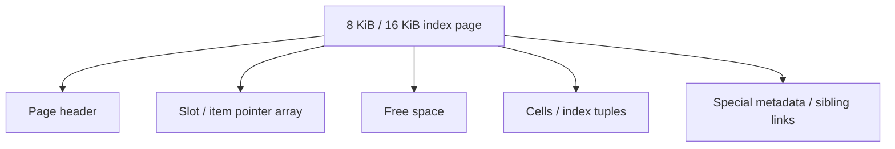

Một layout kiểu slotted-page cho phép tuple payload dịch chuyển khi compact page nhưng slot ID vẫn tương đối ổn định.

### 5.1 Vì sao sorted order không có nghĩa bytes nằm liên tục theo key order?

SQLite là ví dụ rất rõ: cell pointer array được giữ theo key order, nhưng cell contents có thể nằm ở các offsets khác nhau trong page [6]. Điều này cho phép DBMS quản lý variable-length records và fragmentation mà không phải luôn shift toàn bộ page content khi insert.

---

## 6. Lookup mechanics: chuyện gì xảy ra với `WHERE id = 7421`

Giả sử B+Tree index trên `id`.

### Phase 1 — root lookup

Root page chứa các separator keys. DBMS binary-search trong page để chọn child range phù hợp.

PostgreSQL implementation có `_bt_binsrch()` thực hiện binary search trong một B-tree page [7].

### Phase 2 — descend internal levels

Mỗi internal page tiếp tục binary search separator keys và follow downlink.

### Phase 3 — leaf lookup

Ở leaf page, DBMS binary-search để tìm vị trí đầu tiên có key `>= search_key`, rồi kiểm tra equality/scan condition.

### Phase 4 — resolve row

Tùy storage engine:

- PostgreSQL secondary B-tree entry thường chứa heap TID → cần tới heap page để đọc row, trừ khi index-only scan đủ điều kiện.
- InnoDB primary clustered index leaf chứa row data trực tiếp.
- InnoDB secondary index leaf chứa secondary key + primary key → thường phải dùng primary key để lookup clustered index lần hai nếu cần các cột không có trong secondary index [8].

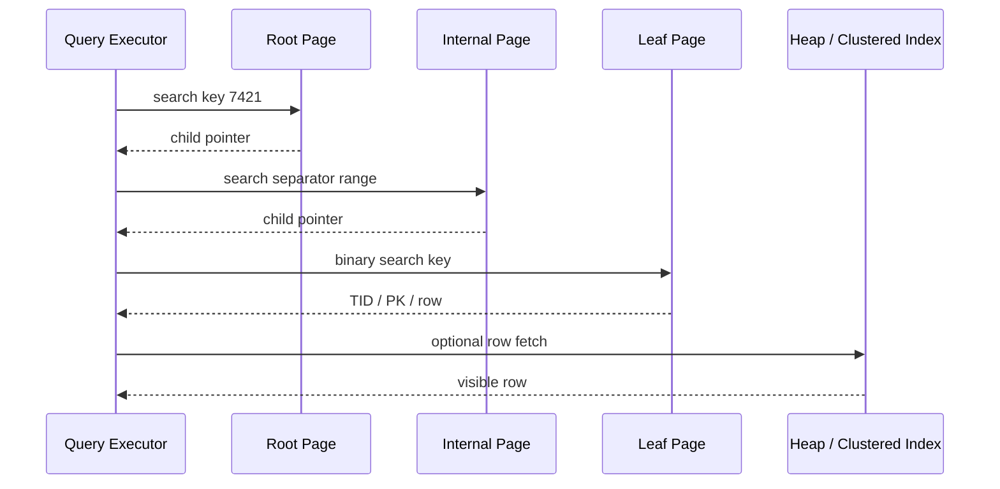

### Complexity nên diễn đạt thế nào?

Không nên chỉ nói:

```text
O(log N)
```

Nên nói:

```text
Tree navigation requires roughly O(log_F N) page levels,
where F is the fan-out.
Within each page, the engine usually performs a binary search over sorted entries.
```

F rất lớn nên `log_F N` nhỏ.

---

## 7. Range scan: nơi B+Tree vượt trội hash index

Query:

```sql
SELECT *
FROM events
WHERE user_id = 42
  AND created_at >= '2026-09-01'
  AND created_at <  '2026-10-01'
ORDER BY created_at;
```

Với index:

```sql
CREATE INDEX idx_events_user_created
ON events(user_id, created_at);
```

DBMS chỉ cần:

1. descend tree để tìm lower bound `(42, 2026-09-01)`;
2. scan sequentially các leaf entries;
3. follow right-sibling links;
4. stop khi key vượt `(42, 2026-10-01)`.

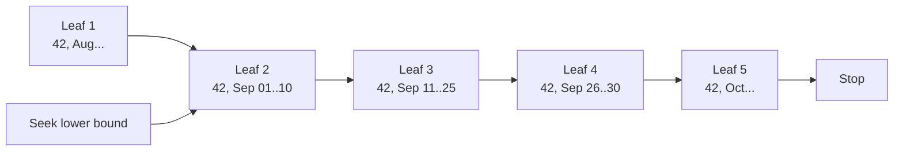

Đây là lý do B-tree rất phù hợp với:

- equality;
- `<`, `<=`, `>`, `>=`;
- `BETWEEN`;
- ordered scans;
- prefix/lexicographic range trên composite key.

---

## 8. Insert mechanics: từ một insert nhỏ tới cascading split

Giả sử leaf page đang gần đầy.

### 8.1 Simple insert

Nếu page còn đủ free space:

1. tìm leaf;
2. tìm insertion position;
3. chèn tuple/cell;
4. update page metadata;
5. ghi WAL/redo tương ứng;
6. mark page dirty.

### 8.2 Leaf page full → split

Nếu new tuple không fit:

1. allocate một page mới;
2. xác định split point;
3. chia keys/tuples giữa left và right page;
4. sửa sibling links;
5. tạo separator/pivot cho parent;
6. insert new downlink vào parent.

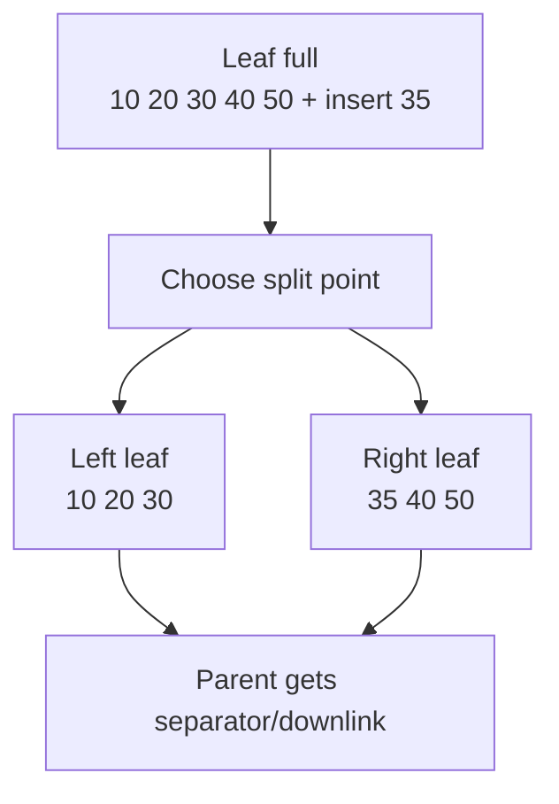

PostgreSQL docs mô tả page split có thể propagate lên parent; nếu parent cũng full thì parent lại split, và cuối cùng root split tạo thêm một level [2].

### 8.3 Root split

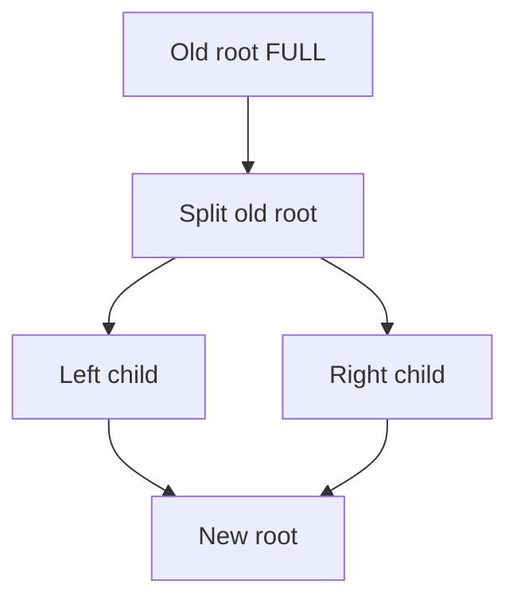

Root split là thời điểm tree height tăng đúng 1.

---

## 9. Split point không đơn giản là “chia đôi số keys”

Textbook thường nói chia khoảng 50/50 theo số key. Production engine phải quan tâm **bytes**, vì key có độ dài khác nhau.

PostgreSQL source ghi rõ: với variable-size keys, không có fixed max key count/page; khi split, implementation cố cân bằng số bytes chứ không đơn giản số items [3]. Ngoài ra nó còn tối ưu split point để suffix truncation tạo separator ngắn hơn.

Điều này tạo ra một insight quan trọng:

> B-tree balancing trong DBMS là balancing **page occupancy / byte space**, không phải chỉ balancing node count.

---

## 10. Fill factor và page occupancy

Nếu luôn fill page 100%, chỉ cần một insert vào giữa key-space là có thể gây split ngay.

Vì vậy DBMS có khái niệm fillfactor/reserved free space.

MySQL InnoDB cố để khoảng 1/16 page trống cho future insert/update khi insert vào clustered index; sequential inserts có thể làm page khoảng 15/16 full, còn random inserts có thể cho occupancy từ khoảng 1/2 tới 15/16 [5]. PostgreSQL B-tree default leaf fillfactor là 90%; source hiện tại dùng 70% cho non-leaf pages trong một số build/split policies [9].

Trade-off:

```text
Lower fill factor
+ fewer near-term page splits
+ potentially better write behavior
- larger index
- lower cache density
- more pages to scan
```

---

## 11. Sequential key vs random key

### Sequential insert, ví dụ auto-increment

Keys mới thường đi vào rightmost leaf page.

Ưu điểm:

- locality tốt;
- ít random page touches;
- predictable split pattern;
- dễ cache hot path.

PostgreSQL thậm chí có fast-path cache cho repeated inserts vào rightmost leaf, hữu ích với auto-increment và datetime-like indexes [10].

Nhược điểm tiềm năng:

- rightmost leaf/root path có thể trở thành hotspot trong workload concurrency cực cao.

### Random key, ví dụ random UUID v4

Writes phân tán toàn index:

- nhiều page cache misses hơn;
- nhiều random page modifications;
- page split phân tán;
- index fragmentation/space utilization có thể kém hơn.

Đây là lý do primary key design ảnh hưởng rất mạnh tới physical write pattern.

---

## 12. Delete: textbook merge khác production reality

Trong textbook:

- delete key;
- nếu node underfull, borrow từ sibling;
- nếu không borrow được, merge;
- có thể propagate lên trên.

Production DBMS thường phức tạp hơn vì MVCC và concurrency.

### 12.1 PostgreSQL và MVCC version churn

PostgreSQL B-tree không trực tiếp coi nhiều row versions là một logical row duy nhất. UPDATE có thể tạo thêm index tuple versions. PostgreSQL dùng bottom-up index deletion để dọn các version-churn tuples nhằm tránh unnecessary page splits [2].

Nói cách khác, “delete from logical table” không đồng nghĩa “ngay lập tức remove physical B-tree entry”.

### 12.2 Deferred cleanup là feature, không phải bug

Immediate merge/rebalance có thể gây:

- latch contention;
- parent modifications;
- WAL volume;
- structural churn.

Một DBMS có thể chọn delayed cleanup/tombstone/vacuum-like strategy để giữ throughput ổn định.

---

## 13. Duplicate keys: index vật lý vẫn cần total order

Một non-unique index có thể có hàng nghìn rows cùng key:

```text
status = 'ACTIVE'
```

Nhưng tree navigation cần một physical ordering đủ deterministic.

PostgreSQL dùng heap TID như tiebreaker trong heapkeyspace B-tree để các physical tuples có total ordering [3][9]. Nó còn có B-tree deduplication: nhiều duplicate logical keys có thể được gom thành một posting-list tuple chứa một key và array các TIDs, giảm index size và trì hoãn page split [2][3].

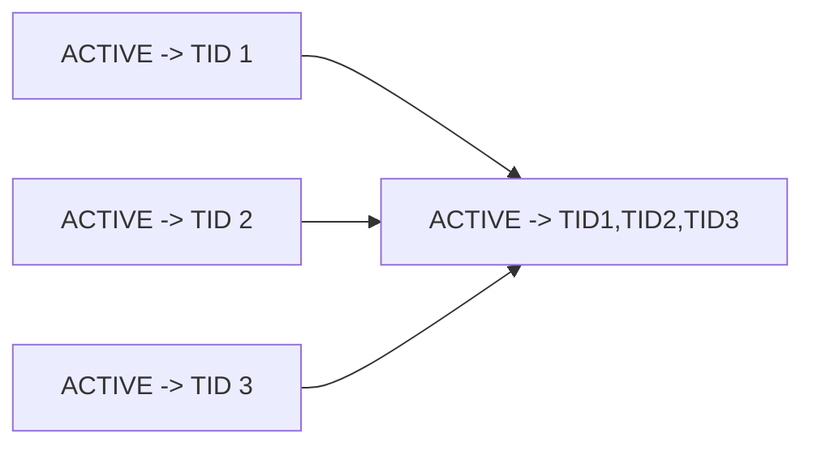

---

## 14. Composite index deeper mechanics: lexicographic ordering

Index:

```sql
(user_id, created_at)
```

không phải hai index “ghép lại”. Nó là **một sorted key space** theo tuple comparison:

```text
(user_id first, created_at second)
```

Ví dụ:

```text
(10, 09:00)
(10, 09:10)
(10, 11:00)
(11, 08:00)
(11, 12:00)
(12, 07:00)
```

### 14.1 Vì sao leftmost prefix quan trọng?

Nếu query:

```sql
WHERE user_id = 10
  AND created_at >= '09:30'
```

DBMS có thể seek trực tiếp tới khoảng key bắt đầu bằng `10`, rồi range-scan `created_at`.

Nếu query chỉ:

```sql
WHERE created_at >= ...
```

thì values của `created_at` bị chia thành nhiều vùng theo từng `user_id`. Một conventional B-tree descent không có một contiguous interval duy nhất tương ứng với predicate đó.

PostgreSQL docs nêu rõ multicolumn B-tree hiệu quả nhất khi có constraints trên leading columns; equality ở leading columns và inequality trên column đầu tiên không có equality sẽ giới hạn phần index cần scan [11]. PostgreSQL 18 còn có skip-scan optimization cho một số trường hợp, nhưng mental model leftmost-prefix vẫn là nền tảng [11].

### 14.2 Equality trước, range sau

Với workload:

```sql
WHERE user_id = ?
  AND created_at BETWEEN ? AND ?
```

`(user_id, created_at)` thường tự nhiên hơn `(created_at, user_id)` vì:

- equality trên `user_id` khóa một contiguous key prefix;
- range trên `created_at` trở thành contiguous sub-range bên trong prefix đó.

---

## 15. Separator keys không cần giữ toàn bộ composite key

Một advanced optimization: internal pivot chỉ cần đủ thông tin để phân biệt left và right ranges.

Ví dụ hai leaf boundary:

```text
left max:  (user_id=42, created_at=10:15:00, event_id=991)
right min: (user_id=43, created_at=00:01:00, event_id=12)
```

Chỉ `user_id=43` có thể đã đủ để route sang right page. Các suffix attributes còn lại không nhất thiết cần nằm trong pivot.

PostgreSQL gọi kỹ thuật này là **suffix truncation**, mục tiêu chính là làm pivot tuples nhỏ hơn để tăng fan-out [3].

---

## 16. Concurrency: lock và latch là hai thứ khác nhau

Đây là phần rất hay bị nhầm.

### Transaction lock

Bảo vệ logical database objects/rows/ranges trong transaction semantics.

Ví dụ:

```text
row lock, key lock, predicate/range lock
```

Lifetime có thể kéo dài tới COMMIT/ROLLBACK.

### Latch

Bảo vệ **in-memory physical data structure** trong thời gian rất ngắn.

Ví dụ:

```text
read latch page
write latch page
```

Mục tiêu: không để hai threads cùng mutate page bytes hoặc để reader thấy page ở trạng thái nửa-update.

Một DBMS không thể giữ transaction lock trên root B-tree page cho mọi operation; như vậy root trở thành global serialization point.

CMU database notes mô tả latch crabbing/coupling: grab parent latch, grab child latch, rồi release parent khi child đã “safe”; search, insert và delete có tiêu chí safe khác nhau [12].

---

## 17. B-link tree / Lehman–Yao: giải bài toán concurrent split

Giả sử Thread A đang search key 80.

Trong lúc A vừa đọc parent và chuẩn bị xuống child, Thread B split child thành hai pages. Parent có thể chưa kịp được update downlink tương ứng.

Nếu implementation textbook không có cơ chế recovery, A có thể đi xuống page cũ và kết luận sai rằng key không tồn tại.

Lehman–Yao giải quyết bằng hai metadata quan trọng:

1. **right-link**: pointer tới right sibling;
2. **high key**: upper bound của key-space page hiện tại.

PostgreSQL nbtree implementation dựa trên algorithm này [3][13].

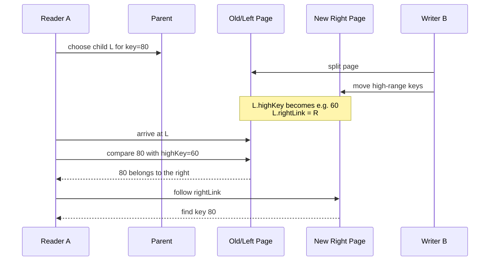

Điều tuyệt vời ở đây là:

> Parent update có thể lag một chút so với child split, nhưng search vẫn correct nhờ side-link + high-key invariant.

Đây là một ví dụ rất đẹp về việc production DBMS chấp nhận một **temporarily non-ideal but searchable tree state** để tăng concurrency.

---

## 18. Latch crabbing / coupling

Basic protocol:

```text
1. latch parent
2. latch child
3. khi child safe, release parent
4. tiếp tục xuống dưới
```

Với search, read latch parent có thể release ngay sau khi child được latch.

Với insert, child “safe” nếu nó còn room và sẽ không split do operation hiện tại.

Với delete, child “safe” nếu delete không làm nó cần merge/redistribute theo policy implementation.

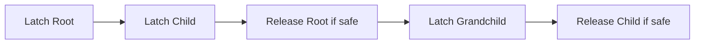

Optimistic variants thường giả định split hiếm, descend bằng read latches trước, rồi retry với stronger latches nếu leaf thực sự cần structural modification [12].

---

## 19. WAL / redo: split phải survive crash

Page split thường sửa nhiều physical pages:

- old left page;
- new right page;
- sibling links;
- parent downlink;
- đôi khi metapage/root.

Không thể giả định tất cả page writes tới disk là một atomic hardware operation.

PostgreSQL xử lý bằng WAL records. Một split ở child level và parent insertion có thể là hai atomic WAL actions. Nếu crash xảy ra ở giữa, search vẫn phải hoạt động; PostgreSQL dùng `INCOMPLETE_SPLIT` và right-link để có thể finish split sau đó [13][14].

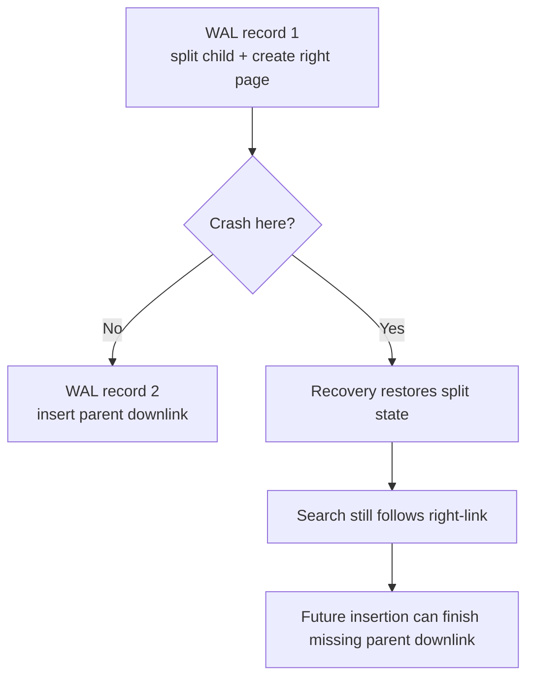

Điểm interview-level rất mạnh:

> A B-tree implementation is not only an algorithm for sorted keys; it is a crash-recoverable, concurrently mutable page graph.

---

## 20. Buffer pool: tại sao B-tree thường nhanh hơn con số disk I/O thô

DBMS không đọc root page từ SSD cho mỗi query. Những pages hot thường nằm trong buffer pool / OS cache.

Top levels cực nhỏ so với leaf level, nên root và upper internal pages gần như luôn hot trong workload đủ ổn định.

Ví dụ tree 4 levels:

```text
root                  -> almost certainly cached
upper internal        -> very likely cached
lower internal        -> often cached
leaf                  -> may or may not be cached
heap/clustered page   -> may or may not be cached
```

Do đó một lookup “4-level tree” không đồng nghĩa 4 physical disk reads.

PostgreSQL planner thậm chí có `effective_cache_size` để ước lượng lượng cache có thể hỗ trợ query, và `random_page_cost` để mô hình hóa cost của non-sequential page access [15].

---

## 21. Why index can still be slower than sequential scan

Một common misconception:

> “Có index thì DB phải dùng index.”

Sai.

Nếu predicate trả về 40–80% table, index scan có thể gây:

- traverse index;
- rất nhiều leaf reads;
- rất nhiều random heap lookups;

trong khi sequential scan chỉ đọc table pages tuần tự.

Do đó optimizer so sánh estimated costs, không chỉ kiểm tra index có tồn tại hay không.

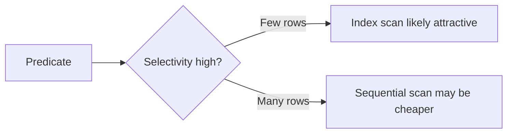

---

## 22. PostgreSQL vs InnoDB: row locator khác nhau làm cost khác nhau

### PostgreSQL

PostgreSQL indexes là secondary indexes tách khỏi heap. Ordinary index scan tìm TID trong index rồi fetch heap tuple. Index-only scan có thể tránh heap fetch khi query chỉ cần columns lưu trong index và visibility conditions cho phép [16].


### MySQL InnoDB

Primary key index là clustered index; leaf chứa row data. Secondary index leaf chứa secondary key + primary key. Vì vậy secondary lookup có thể là “double lookup” [8].


Implication:

- long primary keys làm secondary indexes lớn hơn trong InnoDB;
- primary-key locality ảnh hưởng physical row locality;
- covering secondary index có thể tránh second lookup nếu đủ columns.

---

## 23. Index-only / covering scan

Giả sử:

```sql
CREATE INDEX idx_orders_user_created_status
ON orders(user_id, created_at)
INCLUDE (status);
```

Query:

```sql
SELECT created_at, status
FROM orders
WHERE user_id = 42;
```

Nếu engine có thể trả toàn bộ requested columns từ index, nó có thể giảm/loại table lookup.

PostgreSQL B-tree hỗ trợ index-only scans khi query chỉ cần columns có trong index; tuy nhiên MVCC visibility vẫn có thể buộc kiểm tra heap nếu page không được visibility map chứng minh all-visible [16].

Trade-off của INCLUDE/covering:

```text
+ fewer heap/clustered lookups
+ lower read latency for target query
- larger leaf tuples
- fewer entries per page
- lower fan-out / cache density at leaf level
- more write amplification
```

---

## 24. Large keys và overflow

Một index key không thể được coi là “free”. Key width ảnh hưởng:

- entries per leaf;
- internal separator size;
- tree height;
- cache residency;
- split frequency;
- WAL volume.

SQLite mô tả large index payload có thể spill sang overflow pages theo page-format rules [6]. PostgreSQL giới hạn maximum B-tree index item dựa trên usable page space để đảm bảo một số items tối thiểu có thể fit trên page [9].

Đây là lý do index một `VARCHAR(1000)` hoặc nhiều columns lớn có thể đắt hơn rất nhiều so với index một integer/bigint.

---

## 25. Hot page, contention và scaling

B-tree có thể scale read rất tốt nhưng write hotspots vẫn tồn tại.

### Case 1 — sequential PK

All new rows đi rightmost leaf.

```text
Thread 1 ---> rightmost leaf
Thread 2 ---> rightmost leaf
Thread 3 ---> rightmost leaf
Thread 4 ---> rightmost leaf
```

Locality tốt nhưng latch contention có thể tăng.

### Case 2 — random PK

Writes rải nhiều leaves.

```text
Thread 1 -> Leaf A
Thread 2 -> Leaf M
Thread 3 -> Leaf F
Thread 4 -> Leaf Z
```

Contention có thể giảm nhưng cache locality và random I/O/dirty-page distribution tệ hơn.

Không có universal winner; workload quyết định.

---

## 26. Page split cost không chỉ là “O(1)”

Một split có thể gây:

- allocate new page;
- copy/move many tuples;
- update sibling metadata;
- dirty multiple buffers;
- create WAL records;
- parent insert;
- potential recursive parent splits;
- cache churn.

Vì vậy write amplification của index là lý do bạn không nên tạo index cho mọi column.

Một table có 7 indexes thì mỗi INSERT logic có thể trở thành nhiều independent B-tree modifications.

---

## 27. `user_id + created_at`: phân tích nhiều solutions như interview

Query workload:

```sql
SELECT *
FROM events
WHERE user_id = ?
  AND created_at >= ?
  AND created_at < ?
ORDER BY created_at;
```

### Solution 1 — no index / full table scan

**Mechanics**

DB đọc rất nhiều table pages và test predicate từng row.

**Pros**

- zero index storage;
- inserts cheapest;
- có thể tốt nếu query trả phần rất lớn table.

**Cons**

- poor selectivity performance;
- latency tăng theo table size.

### Solution 2 — separate indexes

```sql
INDEX(user_id)
INDEX(created_at)
```

Engine có thể chọn một index hoặc bitmap/index-merge strategy tùy DBMS.

**Pros**

- mỗi index phục vụ được independent queries;
- flexible.

**Cons**

- hai index trees phải maintain;
- không biểu diễn trực tiếp contiguous ordering `(user_id, created_at)`;
- có thể cần merge candidates/filter nhiều hơn.

### Solution 3 — composite B-tree

```sql
INDEX(user_id, created_at)
```

Physical order:

```text
(user1, t1)
(user1, t2)
(user1, t3)
(user2, t1)
(user2, t2)
```

Query có thể seek chính xác đến `(user_id, lower_time)` rồi scan một contiguous range.

**Pros**

- rất tốt cho equality + range;
- hỗ trợ ordered output theo `created_at` bên trong một user prefix;
- giảm scanned key space.

**Cons**

- write/storage overhead;
- không lý tưởng cho query chỉ filter `created_at` trong classical leftmost-prefix model;
- thêm columns làm leaf entries lớn hơn.

### Interview answer mẫu

> “I would first identify the access pattern. With no index the database has to scan table pages. Two separate indexes can help independent predicates, but the engine may still need to combine candidate sets. A composite B-tree on `(user_id, created_at)` matches the logical ordering of the query: equality on `user_id` selects a contiguous prefix, then the timestamp predicate becomes a bounded range scan. The trade-off is additional storage, write amplification, and reduced usefulness for queries that only constrain `created_at`.”

---

## 28. Khi column order thay đổi

Index:

```text
(created_at, user_id)
```

Query:

```text
user_id = 42 AND created_at BETWEEN t1 AND t2
```

DB có thể seek time range trước, nhưng trong range đó có rows của tất cả users; `user_id=42` phải được filtered trong entries thuộc range.

Index:

```text
(user_id, created_at)
```

thì toàn bộ `(42, t1..t2)` là một compact contiguous region.

Đây là cách nên giải thích column ordering: **key-space geometry**, không chỉ thuộc lòng “leftmost prefix rule”.

---

## 29. Một B-tree lookup thực tế có những CPU operations nào?

Ở mỗi page:

1. obtain/fetch buffer;
2. latch buffer/page;
3. parse page metadata/slots;
4. binary-search sorted slot entries;
5. compare datums using collation/operator class;
6. choose downlink hoặc tuple offset;
7. release/move latch/pin theo concurrency protocol;
8. repeat.

Nếu string collation phức tạp, compare cost có thể cao hơn integer comparison. Nếu key prefix dài và nhiều values giống nhau, comparator có thể phải đọc nhiều bytes hơn.

Vì vậy “index complexity” có cả:

```text
I/O complexity
CPU comparison cost
cache behavior
concurrency overhead
```

---

## 30. Collation và comparator là một phần của physical ordering

B-tree không tự hiểu string hay timestamp. Nó cần một total/consistent ordering relation.

Nếu index xây theo một collation/operator semantics, query phải dùng operators phù hợp với ordering đó để exploit navigation hiệu quả.

PostgreSQL B-tree operator classes định nghĩa comparison semantics cho indexable datatypes; tree correctness phụ thuộc vào consistent ordering [2].

---

## 31. Why B-tree supports ORDER BY efficiently

Nếu requested order trùng với index key order, engine có thể scan leaf entries theo thứ tự index mà không cần materialize toàn bộ result rồi sort.

Ví dụ:

```sql
SELECT *
FROM events
WHERE user_id = 42
ORDER BY created_at
LIMIT 20;
```

Với `(user_id, created_at)`, engine có thể:

1. seek prefix `user_id=42`;
2. sequentially lấy 20 leaf entries đầu;
3. stop early.

Đây là optimization rất mạnh vì `LIMIT` cho phép short-circuit.

---

## 32. Why pagination bằng cursor hợp B-tree hơn OFFSET lớn

Query offset:

```sql
ORDER BY created_at, id
LIMIT 20 OFFSET 100000;
```

DB vẫn có thể phải traverse/skip khoảng 100000 ordered entries trước khi trả 20 rows.

Cursor/keyset:

```sql
WHERE (created_at, id) > (?, ?)
ORDER BY created_at, id
LIMIT 20;
```

với matching B-tree `(created_at, id)` có thể seek gần như trực tiếp tới lower bound mới rồi scan 20 entries.

Mental model:

```text
OFFSET pagination = count/skip work
cursor pagination = B-tree seek + short range scan
```

---

## 33. B-tree vs Hash index

### B-tree

```text
Equality        good
Range           excellent
Ordering        natural
Prefix/range    good when key ordering matches
```

### Hash

```text
Equality        excellent potential
Range           no natural order
ORDER BY        cannot exploit hash ordering
```

B-tree thắng vì nó là một **ordered search structure**, không chỉ lookup structure.

---

## 34. B-tree vs LSM-tree: write path khác nhau

B-tree:

```text
point update -> locate page -> modify page -> WAL -> flush later
```

LSM:

```text
append/update memory structure -> WAL -> immutable sorted runs -> compaction
```

B-tree thường mạnh ở read/update latency ổn định và point/range access trực tiếp; LSM đổi lại sequential write throughput cao hơn nhưng trả giá bằng compaction và read amplification. Đây là một hướng mở rộng quan trọng khi học storage engines.

---

## 35. Những câu interviewer có thể đào sâu

### “Why is B-tree optimized for databases?”

Đừng trả lời chỉ “because O(log N)”.

Nên trả lời:

> “Because it has a high fan-out that aligns nodes with storage pages, so a lookup touches very few pages. It also preserves sorted order, making range scans and ordered retrieval efficient.”

### “Why not use binary search tree?”

> “A balanced BST has fan-out two, so its height is much larger. Even though both are logarithmic asymptotically, DB cost is dominated by page/cache accesses, and B-trees minimize tree depth.”

### “What happens when a leaf is full?”

> “The engine allocates a sibling page, redistributes entries according to a split policy, updates sibling metadata, and inserts a separator/downlink into the parent. If the parent is full, the split can cascade upward. A root split increases tree height.”

### “Can readers still work while a page is splitting?”

Advanced answer:

> “Production engines use latching and concurrency-aware variants such as B-link trees. PostgreSQL’s Lehman–Yao-based implementation adds right sibling links and high keys, so a reader that lands on the old left page after a concurrent split can detect that its search key is above the page’s high key and move right.”

### “Why does composite index order matter?”

> “Because the index is sorted lexicographically. Leading equality predicates narrow the search to a contiguous prefix; a range on the next column then maps to a contiguous interval. If the leading column is unconstrained, the desired values may be scattered across many prefixes.”

### “Why can an index hurt writes?”

> “Each DML can modify multiple index pages, generate WAL/redo, dirty buffers, cause splits, and consume cache/storage. More indexes also multiply maintenance work.”

### “What is the difference between a lock and a latch?”

> “A lock protects logical transactional state and may live for a transaction. A latch protects an in-memory physical structure such as a B-tree page for a very short critical section.”

---

## 36. Mental model cuối cùng

Hãy hình dung B-tree trong DBMS như sau:

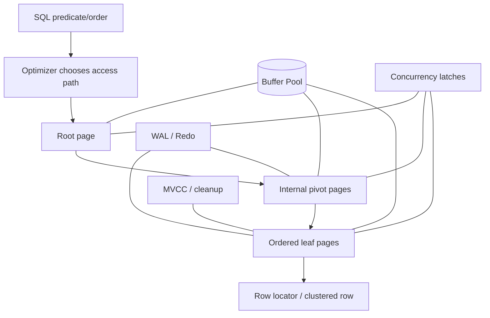

B-tree không chỉ là “balanced tree”. Nó là sự kết hợp của:

```text
ordered key space
+ page-oriented storage
+ high fan-out
+ binary search inside pages
+ linked leaf/pages
+ split/merge policies
+ buffer caching
+ short-term latching
+ crash recovery via WAL/redo
+ MVCC-aware cleanup
+ optimizer cost model
```

Nếu bạn hiểu được toàn bộ chain này, câu “index làm query nhanh hơn vì sao?” sẽ không còn là câu trả lời thuộc lòng.

---

# Source Notes

[1] Rudolf Bayer, Edward M. McCreight, “Organization and Maintenance of Large Ordered Indexes,” Acta Informatica 1, 1972. DOI: https://doi.org/10.1007/BF00288683

[2] PostgreSQL 17/18 Documentation, B-Tree Indexes / Implementation. https://www.postgresql.org/docs/17/btree.html and https://www.postgresql.org/docs/18/btree.html

[3] PostgreSQL source, `src/backend/access/nbtree/README` (Lehman–Yao algorithm, high keys, side links, suffix truncation, deduplication, WAL considerations). https://github.com/postgres/postgres/blob/master/src/backend/access/nbtree/README

[4] PostgreSQL Documentation, Database Page Layout. https://www.postgresql.org/docs/17/storage-page-layout.html

[5] MySQL 8.4 Reference Manual, “The Physical Structure of an InnoDB Index.” https://dev.mysql.com/doc/refman/8.4/en/innodb-physical-structure.html

[6] SQLite, Database File Format, B-tree Pages. https://www.sqlite.org/fileformat.html

[7] PostgreSQL source, `nbtsearch.c`, `_bt_binsrch()`. https://github.com/postgres/postgres/blob/master/src/backend/access/nbtree/nbtsearch.c

[8] MySQL 8.0 Reference Manual, “Clustered and Secondary Indexes.” https://dev.mysql.com/doc/refman/8.0/en/innodb-index-types.html

[9] PostgreSQL source, `src/include/access/nbtree.h` (page metadata, high key, fillfactor constants, tuple formats). https://github.com/postgres/postgres/blob/master/src/include/access/nbtree.h

[10] PostgreSQL source, `nbtinsert.c` (rightmost leaf fast-path optimization). https://github.com/postgres/postgres/blob/master/src/backend/access/nbtree/nbtinsert.c

[11] PostgreSQL 18 Documentation, “Multicolumn Indexes.” https://www.postgresql.org/docs/18/indexes-multicolumn.html

[12] Carnegie Mellon 15-445/645 Database Systems, Index Concurrency Control lecture notes / B+Tree latching. https://15445.courses.cs.cmu.edu/fall2021/notes/08-indexconcurrency.pdf

[13] Philip L. Lehman, S. Bing Yao, “Efficient Locking for Concurrent Operations on B-Trees,” ACM TODS 6(4), 1981, pp. 650–670. https://www.cs.cmu.edu/~dga/15-712/F07/papers/Lehman81.pdf

[14] PostgreSQL source, `src/backend/access/transam/README` and `nbtxlog.c` (WAL atomic actions, incomplete split recovery). https://github.com/postgres/postgres/blob/master/src/backend/access/transam/README and https://github.com/postgres/postgres/blob/master/src/backend/access/nbtree/nbtxlog.c

[15] PostgreSQL Documentation, Query Planning cost parameters (`effective_cache_size`, `random_page_cost`). https://www.postgresql.org/docs/17/runtime-config-query.html

[16] PostgreSQL Documentation, Index-Only Scans and Covering Indexes. https://www.postgresql.org/docs/14/indexes-index-only-scans.html