# Database — P0 cho Technical Interview

Mục tiêu của phần Database trong tech screen không phải là nhớ nhiều câu lệnh SQL. Interviewer thường muốn kiểm tra xem bạn có hiểu:

> **“Khi hệ thống có data lớn và concurrency cao, database thực sự hoạt động như thế nào, và tại sao bạn chọn solution đó?”**

Đặc biệt với dạng câu:

> “Can you think of multiple solutions?”

Bạn nên có tư duy:

```text
Correctness
    ↓
Simple solution
    ↓
Performance problem
    ↓
Optimization
    ↓
Trade-offs
```

---

# 1. Mental model tổng quát về Database

Giả sử chúng ta có bảng:

```sql
CREATE TABLE orders (
    id BIGINT PRIMARY KEY,
    user_id BIGINT NOT NULL,
    status VARCHAR(20),
    amount DECIMAL(12, 2),
    created_at TIMESTAMP NOT NULL
);
```

Có:

```text
100 million orders
```

Và API:

```http
GET /users/{userId}/orders
```

Query:

```sql
SELECT *
FROM orders
WHERE user_id = 123
ORDER BY created_at DESC
LIMIT 20;
```

Đây là case rất tốt để nói về gần như toàn bộ phần Database.

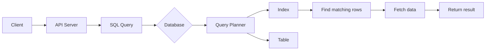

Câu hỏi quan trọng:

> Nếu có 100 triệu rows thì DB tìm 20 orders của user 123 như thế nào?

Đây chính là lý do chúng ta cần hiểu **index**.

---

# 2. Index — tại sao query nhanh hơn?

## 2.1 Không có index

Query:

```sql
SELECT *
FROM orders
WHERE user_id = 123;
```

Nếu `user_id` không có index, DB có thể phải thực hiện:

```text
row 1 → check user_id
row 2 → check user_id
row 3 → check user_id
...
row 100,000,000
```

Đây gọi là:

```text
Full Table Scan
```

Time complexity ở mức conceptual:

```text
O(N)
```

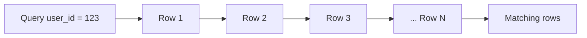

Nếu table rất lớn thì rất expensive.

---

# 3. Index thực chất là gì?

Index là một **data structure riêng biệt** được database duy trì để giúp tìm row nhanh hơn.

Ví dụ:

```sql
CREATE INDEX idx_orders_user_id
ON orders(user_id);
```

Conceptually:

```text
user_id      row/location

100          → row A
100          → row B
101          → row C
123          → row D
123          → row E
123          → row F
...
```

Thay vì scan toàn bộ table, DB:

```text
Search index
    ↓
find user_id = 123
    ↓
get row references
    ↓
retrieve rows
```

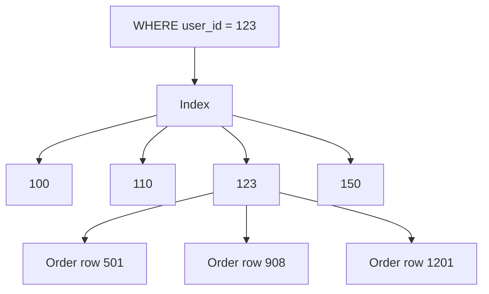

Trong relational DB, index phổ biến nhất sử dụng:

```text
B-tree / B+ tree
```

---

# 4. B-tree — cơ chế high-level

Không cần implement B-tree trong interview database thông thường.

Nhưng bạn phải hiểu tại sao nó nhanh.

Một B-tree có cấu trúc đại khái:

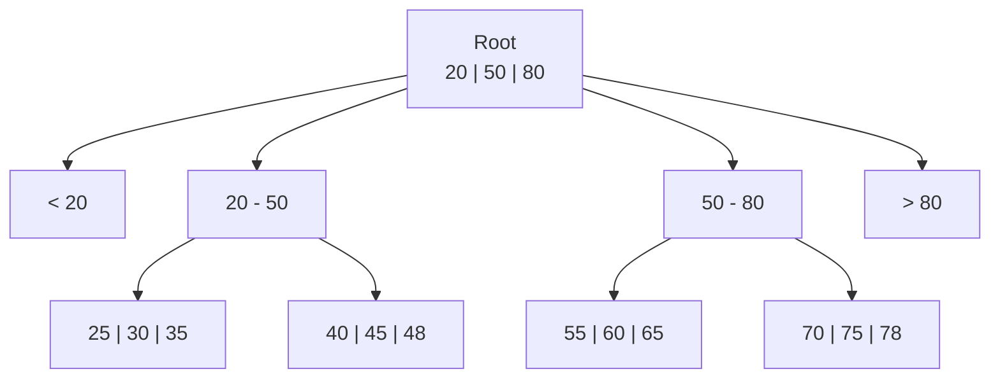

Giả sử tìm:

```text
user_id = 60
```

DB không cần đọc từ đầu tới cuối.

Nó đi:

```text
Root
 ↓
50–80
 ↓
55–60–65
 ↓
60
```

Complexity conceptual:

```text
O(log N)
```

thay vì:

```text
O(N)
```

---

# 5. Tại sao database dùng B-tree thay vì Binary Search Tree?

Một B-tree node chứa nhiều keys.

Ví dụ conceptual:

```text
[10 | 20 | 30 | 40 | 50 | ...]
```

Một node có thể có rất nhiều children.

Điều này tạo ra:

```text
high branching factor
```

và khiến tree:

```text
very shallow
```

Ví dụ:

```text
100,000,000 records
```

Không có nghĩa tree depth = hàng chục level.

Nó có thể chỉ cần vài level.

Đây đặc biệt quan trọng vì database đọc:

```text
disk / SSD pages
```

Chúng ta muốn giảm số lượng page accesses.

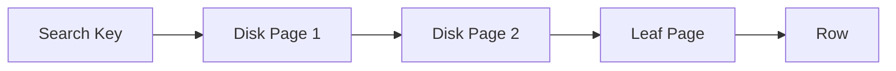

Do đó:

> B-tree được thiết kế rất phù hợp với block/page-based storage.

---

# 6. Index không miễn phí

Đây là điểm interviewer rất thích hỏi.

Index cải thiện:

```text
READ
```

nhưng làm tăng cost của:

```text
WRITE
```

Ví dụ insert:

```sql
INSERT INTO orders (...)
VALUES (...);
```

Không chỉ insert vào table.

DB còn phải update indexes.

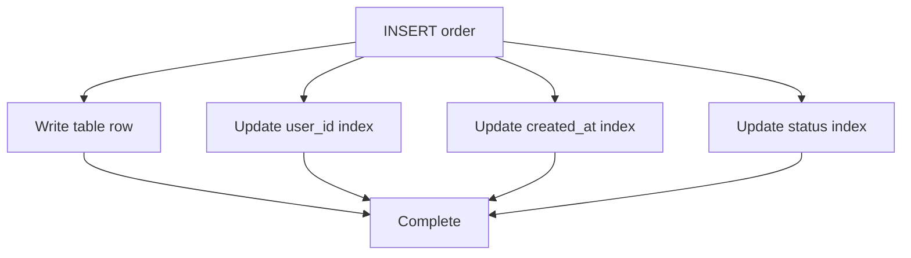

Vì vậy:

| Index      | Advantage           | Cost              |
| ---------- | ------------------- | ----------------- |
| More index | faster reads        | slower writes     |
| More index | more query options  | more storage      |
| More index | less table scanning | index maintenance |

Một câu trả lời interview tốt:

> An index improves read performance by allowing the database to locate records without scanning the entire table. However, indexes consume additional storage and introduce write overhead because INSERT, UPDATE and DELETE operations may also need to update the index.

---

# 7. Composite Index

Đây là một trong những phần **P0 nhất**.

Quay lại query:

```sql
SELECT *
FROM orders
WHERE user_id = ?
ORDER BY created_at DESC;
```

Ta thường tạo:

```sql
CREATE INDEX idx_orders_user_created
ON orders(user_id, created_at);
```

Đây gọi là:

```text
Composite Index
```

hay:

```text
Multi-column Index
```

---

# 8. Composite Index được sắp xếp thế nào?

Index:

```text
(user_id, created_at)
```

không có nghĩa hai column độc lập.

Nó được sắp xếp giống:

```text
sort by user_id first

then

sort by created_at inside each user
```

Ví dụ:

```text
user_id    created_at

100        Jan 01
100        Jan 03
100        Jan 10

101        Jan 02
101        Jan 05

123        Jan 01
123        Jan 04
123        Jan 09
```

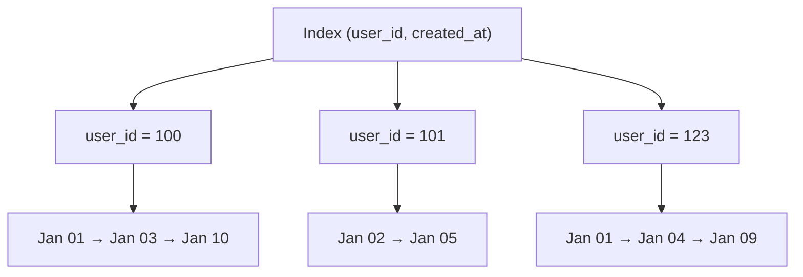

Do đó query:

```sql
WHERE user_id = 123
ORDER BY created_at
```

rất phù hợp.

DB:

```text
find user_id = 123
        ↓
already has created_at ordered
```

---

# 9. Column order cực kỳ quan trọng

Hai indexes:

```sql
(user_id, created_at)
```

và:

```sql
(created_at, user_id)
```

**không giống nhau**.

---

# 10. Leftmost Prefix Principle

Index:

```text
(A, B, C)
```

thường có thể hiệu quả cho:

```text
A
A + B
A + B + C
```

nhưng không tối ưu cho:

```text
B
C
B + C
```

Conceptually:

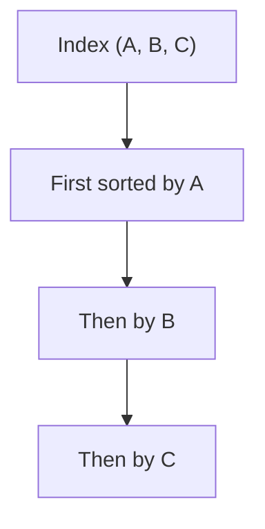

Ví dụ index:

```sql
(user_id, created_at)
```

Tốt cho:

```sql
WHERE user_id = 10
```

và:

```sql
WHERE user_id = 10
  AND created_at > ...
```

và:

```sql
WHERE user_id = 10
ORDER BY created_at;
```

Nhưng không lý tưởng cho:

```sql
WHERE created_at = ...;
```

Bởi vì index global **không sorted chỉ theo created_at**.

---

# 11. Vì sao `(user_id, created_at)` hợp lý hơn `(created_at, user_id)`?

Query chính:

```sql
WHERE user_id = ?
ORDER BY created_at
```

Ta muốn:

```text
1. Narrow down to one user
2. Navigate records by time
```

Do đó:

```text
(user_id, created_at)
```

rất tự nhiên.

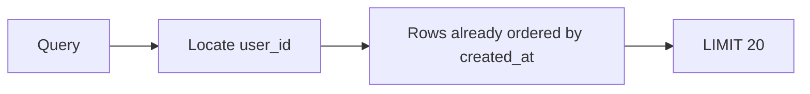

Đây cũng là index rất phù hợp với:

```text
cursor pagination
```

mà chúng ta sẽ nói sau.

---

# 12. Axon-style question: Có nhiều solution không?

Interviewer:

> We frequently query orders using `user_id` and `created_at`. How would you optimize this?

Đừng nói ngay:

> Composite index.

Nên trình bày các option.

---

## Solution 1 — Full Table Scan

Không tạo index.

```sql
SELECT *
FROM orders
WHERE user_id = 123
  AND created_at >= ...
```

DB scan table.

```text
Complexity ~ O(N)
```

Ưu điểm:

```text
No index storage
Fast writes
Simple
```

Nhược điểm:

```text
Poor read performance at scale
```

Phù hợp nếu:

```text
table tiny
query rarely executed
```

---

# 13. Solution 2 — Separate indexes

```sql
CREATE INDEX idx_user
ON orders(user_id);

CREATE INDEX idx_created
ON orders(created_at);
```

Database có thể:

```text
use one index
```

hoặc một số DB/query planner có thể thực hiện:

```text
index intersection / bitmap operations
```

Conceptually:

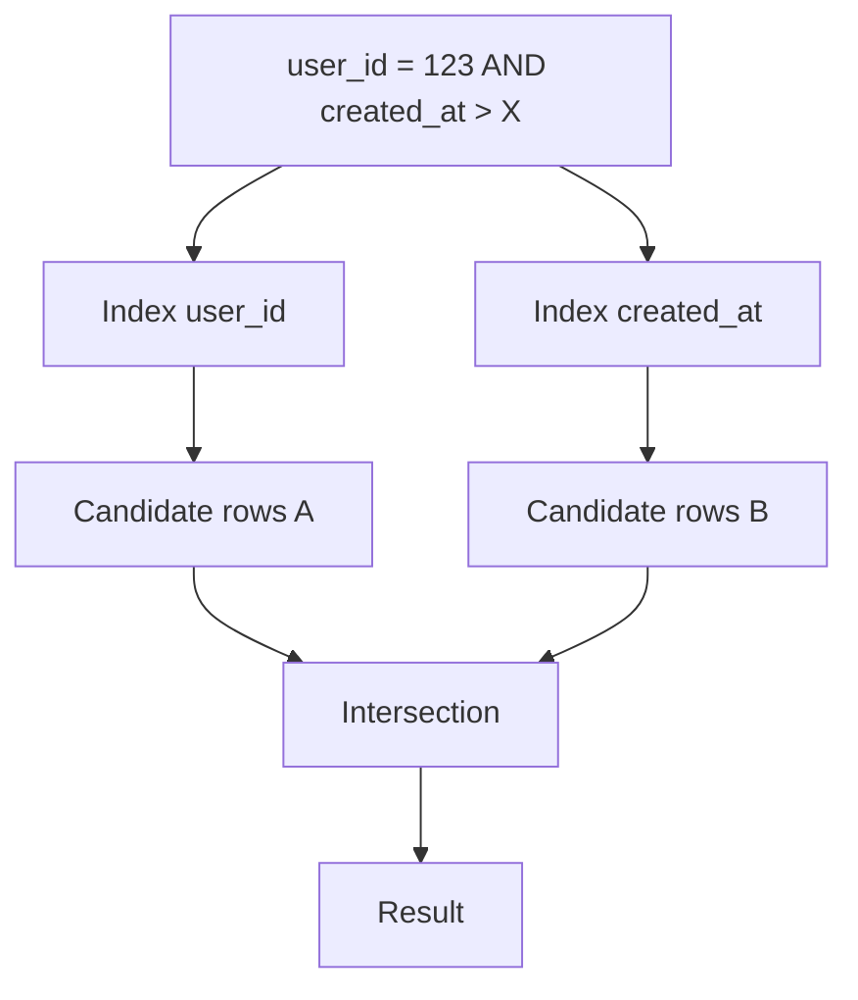

Nhưng thường không tốt bằng index được thiết kế đúng cho query pattern.

---

# 14. Solution 3 — Composite index

```sql
CREATE INDEX idx_orders_user_created
ON orders(user_id, created_at);
```

Database có thể tìm:

```text
user_id = 123
```

rồi tìm range:

```text
created_at >= X
```

ngay trong cùng index.

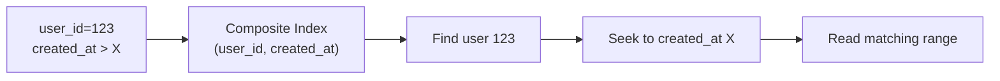

Đây thường là solution tốt nhất cho query pattern này.

---

# 15. Có nên index mọi column không?

Không.

Ví dụ tạo:

```text
10 indexes
```

thì mỗi:

```sql
INSERT
UPDATE
DELETE
```

có thể phải maintain nhiều indexes.

Ví dụ update:

```sql
UPDATE orders
SET user_id = 20
WHERE id = 100;
```

Nếu `user_id` indexed:

```text
old index entry remove
+
new index entry insert
```

Do đó index design dựa trên:

```text
actual access pattern
```

chứ không phải:

```text
index everything
```

---

# 16. Selectivity

Một concept bonus rất nên biết.

Giả sử:

```text
status =
PENDING
COMPLETED
FAILED
```

Chỉ có 3 values trên 100 triệu rows.

Index:

```sql
CREATE INDEX idx_status
ON orders(status);
```

có thể ít hữu ích cho:

```sql
WHERE status = 'COMPLETED'
```

nếu:

```text
90% rows = COMPLETED
```

Vì DB cuối cùng vẫn phải đọc rất nhiều rows.

Trong khi:

```text
email
user_id
order_id
```

thường có selectivity cao hơn.

---

# 17. ACID

ACID là foundation của transaction.

```text
A — Atomicity
C — Consistency
I — Isolation
D — Durability
```

---

# 18. Atomicity

Một transaction:

```text
all or nothing
```

Ví dụ transfer:

```text
A - $100
B + $100
```

Không được xảy ra:

```text
A - $100 success
B + $100 failed
```

Database phải đảm bảo:

```text
both happen
or
none happen
```

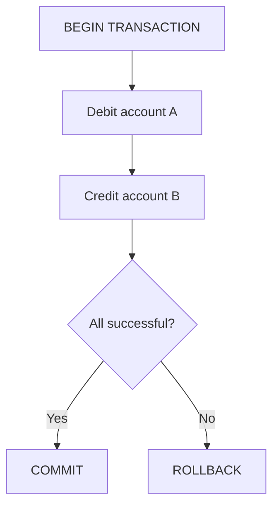

---

# 19. Consistency

Consistency nghĩa là transaction đưa database từ:

```text
valid state
```

sang:

```text
another valid state
```

Ví dụ constraint:

```sql
balance >= 0
```

hoặc:

```sql
email UNIQUE
```

Database không được commit state phá vỡ invariant.

Ví dụ:

```text
Before:

A = 500
B = 200

Total = 700
```

Transfer 100:

```text
After:

A = 400
B = 300

Total = 700
```

Invariant được giữ.

---

# 20. Isolation

Isolation xử lý:

```text
multiple concurrent transactions
```

Ví dụ:

```text
Transaction A
Transaction B
```

đang chạy cùng lúc.

Isolation quyết định:

> Transaction A có thể thấy những thay đổi chưa hoàn thành hoặc đang thay đổi của transaction B ở mức nào?

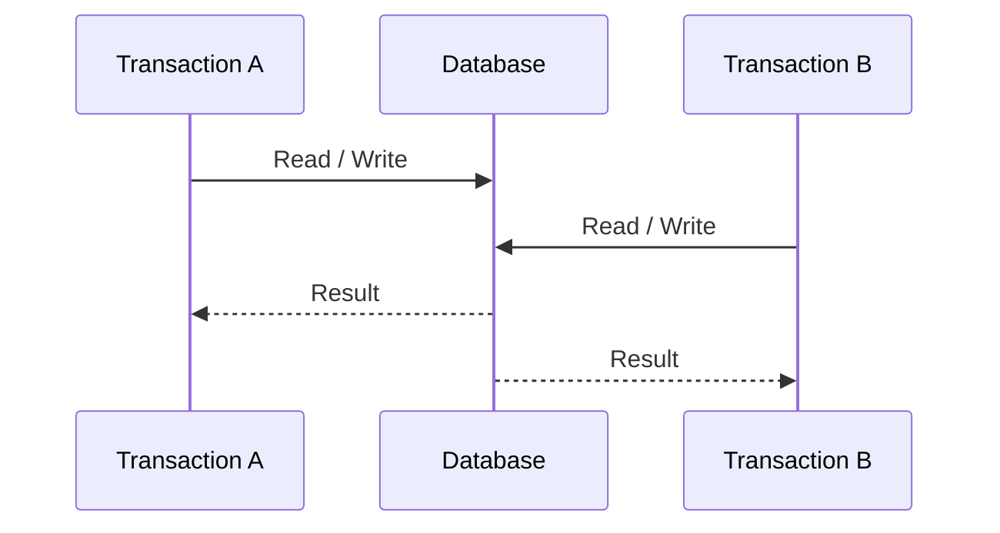

Từ đây xuất hiện:

```text
Dirty Read
Non-repeatable Read
Phantom Read
```

---

# 21. Durability

Sau khi:

```sql
COMMIT
```

thành công, data phải tồn tại kể cả khi:

```text
process crash
machine restart
power failure
```

DB thường sử dụng concepts như:

```text
transaction log
WAL — Write Ahead Log
```

High-level:

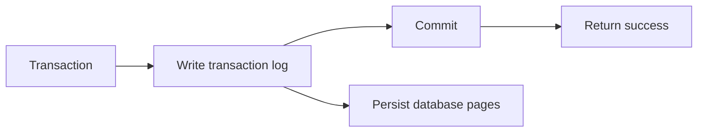

Không cần quá sâu vào WAL nếu interviewer không hỏi.

---

# 22. Transaction là gì?

Transaction là một tập operations cần được coi như:

```text
one logical business operation
```

Ví dụ đặt hàng:

```sql
BEGIN;

INSERT INTO orders ...;

UPDATE inventory
SET quantity = quantity - 1
WHERE product_id = 100;

INSERT INTO payments ...;

COMMIT;
```

Concept:

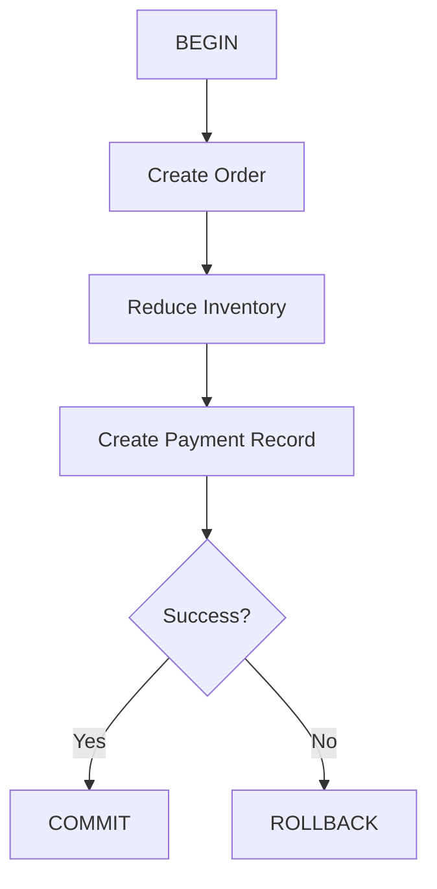

Một lỗi phổ biến:

```text
1 HTTP request = 1 transaction
```

không phải lúc nào cũng đúng.

Đúng hơn:

> A transaction should usually represent an atomic unit of data consistency.

---

# 23. Isolation anomalies

## Dirty Read

Transaction A thay đổi data nhưng chưa commit.

Transaction B đọc data đó.

Sau đó A rollback.

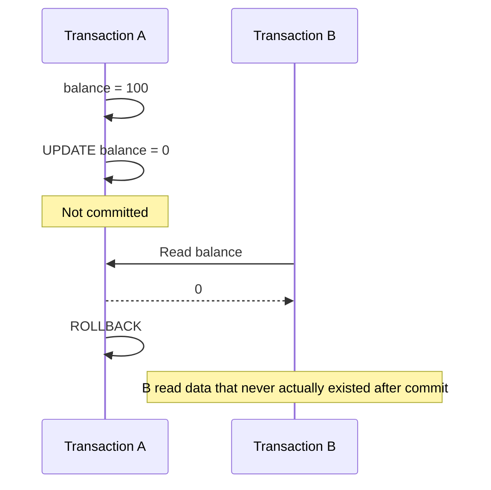

Đây là:

```text
Dirty Read
```

---

# 24. Non-repeatable Read

Transaction A đọc cùng row hai lần.

Giữa hai lần đó Transaction B update và commit.

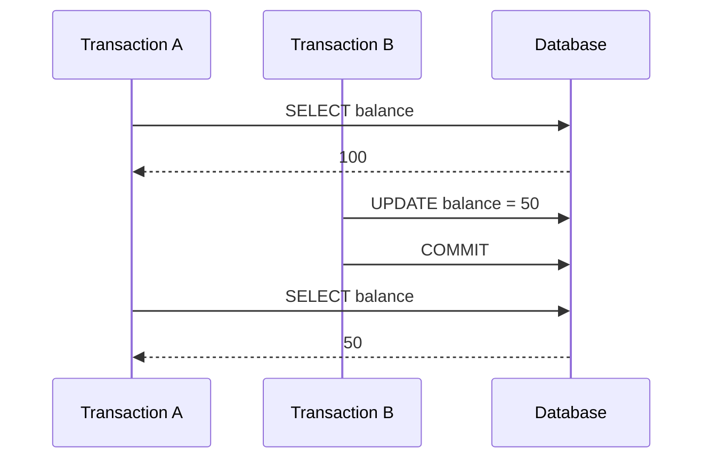

Cùng query:

```text
first read = 100
second read = 50
```

---

# 25. Phantom Read

Transaction A query:

```sql
SELECT *
FROM orders
WHERE amount > 100;
```

Kết quả:

```text
10 rows
```

Transaction B:

```sql
INSERT INTO orders(amount)
VALUES (500);

COMMIT;
```

Transaction A query lại.

Kết quả:

```text
11 rows
```

Một row mới xuất hiện như một:

```text
phantom
```

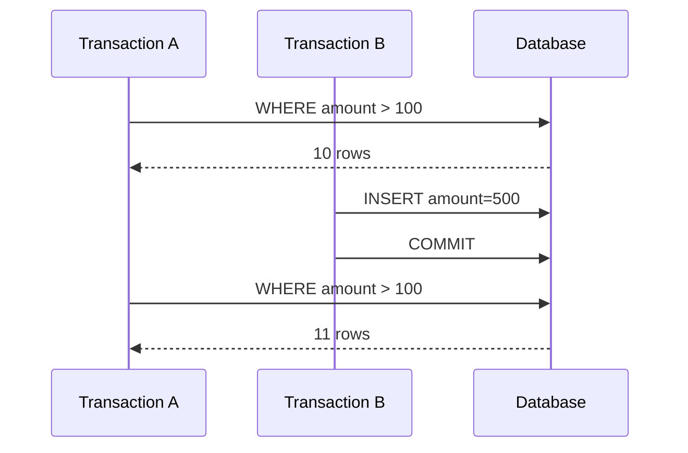

Khác biệt quan trọng:

```text
Non-repeatable read
→ existing row changed

Phantom read
→ result set changed because rows appeared/disappeared
```

---

# 26. Isolation Levels

High-level:

| Isolation        |     Dirty | Non-repeatable |                               Phantom |
| ---------------- | --------: | -------------: | ------------------------------------: |
| Read Uncommitted |  possible |       possible |                              possible |
| Read Committed   | prevented |       possible |                              possible |
| Repeatable Read  | prevented |      prevented | DB-dependent / traditionally possible |
| Serializable     | prevented |      prevented |                             prevented |

Ý tưởng chung:

```text
Higher isolation
        ↓
better consistency
        ↓
less concurrency / more coordination
```

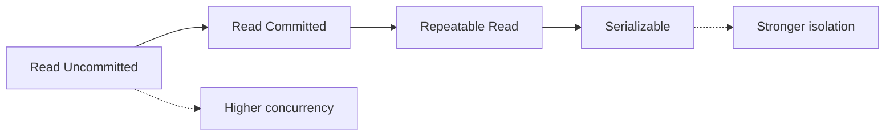

Không nên học table này một cách tuyệt đối cho mọi DB engine vì implementation cụ thể có thể khác.

---

# 27. Lock — concurrency control

Giả sử hai transactions đồng thời:

```sql
UPDATE accounts
SET balance = balance - 100
WHERE id = 1;
```

Database cần coordinate để tránh race condition.

Một kỹ thuật là:

```text
locking
```

Hai concept chính:

```text
Shared Lock
Exclusive Lock
```

High-level:

```text
Shared lock
→ read

Exclusive lock
→ write
```

Nhiều readers có thể coexist.

Writer cần quyền exclusive.

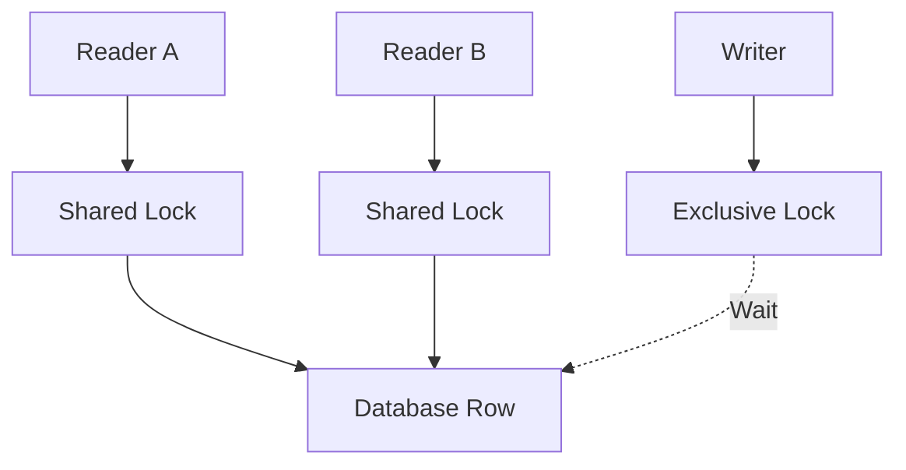

---

# 28. Pessimistic locking

Giả sử stock:

```text
quantity = 1
```

Hai users cùng mua.

Có thể dùng:

```sql
SELECT *
FROM inventory
WHERE product_id = 10
FOR UPDATE;
```

Transaction 1 lấy lock.

Transaction 2 phải chờ.

```mermaid
sequenceDiagram
    participant T1
    participant DB
    participant T2

    T1->>DB: SELECT ... FOR UPDATE
    DB-->>T1: Lock acquired

    T2->>DB: SELECT ... FOR UPDATE
    Note over T2,DB: Wait

    T1->>DB: UPDATE quantity
    T1->>DB: COMMIT

    DB-->>T2: Lock acquired
```

Đây gọi là:

```text
Pessimistic concurrency control
```

Tư duy:

> Conflict is likely, so lock first.

---

# 29. Optimistic concurrency

Một solution khác:

```text
version column
```

Ví dụ:

```text
product

id
quantity
version
```

Transaction đọc:

```text
quantity = 10
version = 5
```

Update:

```sql
UPDATE inventory
SET quantity = 9,
    version = 6
WHERE id = 100
  AND version = 5;
```

Nếu:

```text
affected rows = 0
```

nghĩa là có transaction khác đã update.

```mermaid
flowchart TD
    R["Read quantity=10 version=5"]

    R --> U["UPDATE ... WHERE version=5"]

    U --> C{Rows affected?}

    C -->|1| SUCCESS[Success]
    C -->|0| CONFLICT[Concurrent modification]

    CONFLICT --> RETRY[Retry / Reject]
```

Pessimistic:

```text
prevent conflict
```

Optimistic:

```text
detect conflict
```

---

# 30. Deadlock

Deadlock là dạng câu cực hay hỏi.

Có:

```text
Transaction A
Transaction B
```

A lock:

```text
Row 1
```

B lock:

```text
Row 2
```

Sau đó:

```text
A wants Row 2
B wants Row 1
```

```mermaid
flowchart LR
    A[Transaction A]

    R1[Row 1]
    R2[Row 2]

    B[Transaction B]

    A -->|holds| R1
    A -. waits .-> R2

    B -->|holds| R2
    B -. waits .-> R1
```

Kết quả:

```text
A waits B
B waits A

forever
```

nếu DB không can thiệp.

Database thường:

```text
detect deadlock
```

và abort một transaction.

---

# 31. Cách tránh Deadlock

Technique rất quan trọng:

```text
Acquire locks in consistent order
```

Sai:

```text
Transaction A:
lock user 1
lock user 2

Transaction B:
lock user 2
lock user 1
```

Tốt hơn:

```text
Transaction A:
lock smaller ID first

Transaction B:
lock smaller ID first
```

```mermaid
flowchart TD
    TX1[Transaction A] --> R1[Lock Row 1]
    R1 --> R2[Lock Row 2]

    TX2[Transaction B] --> WAIT[Wait Row 1]
    WAIT --> R1
```

Bây giờ không còn circular wait.

Ngoài consistent ordering, thực tế còn:

```text
keep transactions short
avoid locking more rows than necessary
proper indexes
retry deadlock victims
```

Đặc biệt **proper indexes** cũng liên quan đến locking: query scan quá nhiều rows có thể giữ/đụng nhiều locks hơn cần thiết.

---

# 32. SQL vs NoSQL

Đừng trả lời:

```text
SQL = tables
NoSQL = JSON
```

Quá nông.

Phải nói về:

```text
data model
consistency
queries
relationships
scaling
access patterns
```

---

# 33. SQL Database

Ví dụ:

```text
PostgreSQL
MySQL
SQL Server
```

Phù hợp khi:

```text
strong consistency
transactions
relationships
joins
constraints
complex querying
```

Ví dụ:

```text
Order
Payment
User
Inventory
```

có nhiều relationships.

```mermaid
erDiagram
    USER ||--o{ ORDER : places
    ORDER ||--o{ PAYMENT : has
    ORDER ||--o{ ORDER_ITEM : contains
    PRODUCT ||--o{ ORDER_ITEM : referenced_by
```

SQL rất natural.

---

# 34. NoSQL

NoSQL là một category lớn.

Ví dụ:

```text
Document DB
Key-value DB
Wide-column DB
Graph DB
```

MongoDB có thể represent:

```json
{
  "userId": 100,
  "name": "Quan",
  "orders": [...]
}
```

Redis:

```text
key → value
```

Cassandra:

```text
partition-oriented wide-column model
```

Không có:

```text
SQL always better

or

NoSQL always faster
```

Cần dựa vào requirement.

---

# 35. SQL vs NoSQL — interview answer

| Requirement                   | SQL                          | NoSQL                            |
| ----------------------------- | ---------------------------- | -------------------------------- |
| Complex relationships         | strong                       | depends                          |
| Joins                         | strong                       | commonly avoided/model-dependent |
| Strong relational constraints | strong                       | varies                           |
| Flexible schema               | possible but more structured | often strong                     |
| Transactions                  | strong                       | varies by product                |
| Horizontal scale              | possible                     | often design focus               |
| Access-pattern-specific model | possible                     | common                           |

Một câu tốt:

> I wouldn't choose SQL or NoSQL based only on scale. I would first look at the data model, access patterns, consistency requirements, transaction requirements and expected scaling characteristics.

---

# 36. Normalization

Normalization nhằm:

```text
reduce redundancy
prevent update anomalies
improve data integrity
```

Sai design:

```text
orders

order_id
customer_id
customer_name
customer_email
customer_address
```

Nếu customer có:

```text
10,000 orders
```

thì:

```text
customer_name
customer_email
customer_address
```

lặp 10,000 lần.

Thay bằng:

```mermaid
erDiagram
    CUSTOMER ||--o{ ORDER : places

    CUSTOMER {
        bigint id
        varchar name
        varchar email
    }

    ORDER {
        bigint id
        bigint customer_id
        decimal amount
    }
```

Database lưu:

```text
Customer once

Orders reference customer_id
```

---

# 37. Vì sao duplication có vấn đề?

Giả sử email:

```text
old@example.com
```

nằm trong 1000 order rows.

Customer thay đổi email.

Bạn phải update:

```text
1000 rows
```

Nếu update được:

```text
998 rows
```

thì database có inconsistent data.

Normalization giảm vấn đề này.

---

# 38. Denormalization

Nhưng normalization không phải lúc nào cũng tối ưu cho read.

Ví dụ API phải join:

```text
Order
User
Product
Address
Payment
Shipping
```

mỗi request.

Một high-read system có thể chủ động duplicate một số data.

Ví dụ:

```text
orders

order_id
customer_id
customer_display_name
...
```

Đây là:

```text
denormalization
```

Trade-off:

```text
faster reads
        ↓
more duplication
        ↓
more difficult consistency
```

```mermaid
flowchart LR
    N[Normalized] -->|Fewer duplicates| C[Strong consistency]
    N -->|More joins| R1[Read complexity]

    D[Denormalized] -->|Fewer joins| R2[Fast read]
    D -->|Duplicate data| U[Harder updates]
```

Một câu interview rất tốt:

> Normalization optimizes data integrity and reduces duplication, while denormalization intentionally duplicates data to optimize specific read patterns. I would denormalize only when there's a demonstrated read-performance requirement.

---

# 39. Pagination

Hai kiểu cực quan trọng:

```text
Offset pagination
Cursor pagination
```

---

# 40. Offset Pagination

Ví dụ:

```sql
SELECT *
FROM orders
ORDER BY created_at DESC
LIMIT 20
OFFSET 1000000;
```

Ý nghĩa:

```text
skip 1,000,000 rows

return next 20
```

API:

```http
?page=50000&size=20
```

Ưu điểm lớn:

```text
simple
easy random page navigation
```

Nhưng scale kém.

---

# 41. Vì sao OFFSET lớn chậm?

Conceptually:

```text
OFFSET 1,000,000
```

DB không magically jump đến row thứ 1,000,001 theo nghĩa logical query.

Nó có thể phải traverse/identify rất nhiều preceding entries trước khi discard chúng.

```mermaid
flowchart LR
    Q["OFFSET 1,000,000 LIMIT 20"]

    Q --> A["Rows 1..1,000,000"]

    A --> D["Discard"]

    D --> B["Rows 1,000,001..1,000,020"]

    B --> R["Return 20"]
```

Page càng sâu:

```text
cost càng lớn
```

---

# 42. Cursor Pagination

Thay vì nói:

```text
skip N rows
```

ta nói:

> Continue after the last item I received.

Ví dụ page đầu:

```sql
SELECT *
FROM orders
WHERE user_id = 123
ORDER BY created_at DESC, id DESC
LIMIT 20;
```

Last row:

```text
created_at = 2026-09-10 10:00
id = 400
```

Next request gửi cursor đó.

Query:

```sql
SELECT *
FROM orders
WHERE user_id = 123
  AND (
      created_at < '2026-09-10 10:00'
      OR (
          created_at = '2026-09-10 10:00'
          AND id < 400
      )
  )
ORDER BY created_at DESC, id DESC
LIMIT 20;
```

---

# 43. Cursor + Index

Index:

```sql
CREATE INDEX idx_order_pagination
ON orders(user_id, created_at DESC, id DESC);
```

Conceptually:

```mermaid
flowchart LR
    C["Cursor<br/>created_at=T,id=400"]

    C --> IDX["Composite Index<br/>(user_id, created_at, id)"]

    IDX --> SEEK["Seek directly near cursor"]

    SEEK --> R1[Next record]
    R1 --> R2[Next]
    R2 --> RN["... 20 records"]
```

Không cần skip:

```text
1 million rows
```

Ta:

```text
seek near cursor
+
read 20
```

---

# 44. Vì sao cursor thường scale tốt hơn?

Offset:

```text
page 1
→ cheap

page 10
→ cheap

page 100,000
→ increasingly expensive
```

Cursor:

```text
seek after cursor
→ fetch k rows
```

Cost gần hơn với:

```text
O(log N + K)
```

conceptually khi có index phù hợp.

---

# 45. Cursor còn giải quyết consistency tốt hơn khi data thay đổi

Giả sử page size:

```text
3
```

Initial:

```text
10
9
8
7
6
5
```

Page 1:

```text
10
9
8
```

Trước page 2 có new record:

```text
11
```

Data:

```text
11
10
9
8
7
6
5
```

Offset page 2:

```text
OFFSET 3
```

có thể trả:

```text
8
7
6
```

`8` bị duplicate.

Cursor:

```text
created_at < created_at_of_8
```

trả:

```text
7
6
5
```

ổn định hơn đối với kiểu feed này.

---

# 46. Nhưng Cursor cũng có trade-off

Cursor không phải luôn thắng.

Offset phù hợp với:

```text
admin UI
small dataset
jump to page 37
```

Cursor phù hợp:

```text
feeds
infinite scrolling
large datasets
timeline
orders/history
```

Trade-off quan trọng:

```text
Offset
+ simple
+ random page
- deep page slow
- unstable under inserts/deletes

Cursor
+ scales well
+ stable continuation
- harder implementation
- difficult random page jumping
```

---

# 47. Unique Constraint

Cực kỳ quan trọng trong backend interview.

Giả sử:

```text
email must be unique
```

Một developer làm:

```java
if (!repository.existsByEmail(email)) {
    repository.save(user);
}
```

Nhìn có vẻ đúng.

Nhưng có race condition.

---

# 48. Check-then-insert Race Condition

Hai requests:

```text
Request A
Request B
```

```mermaid
sequenceDiagram
    participant A as Request A
    participant DB as Database
    participant B as Request B

    A->>DB: Does a@x.com exist?
    DB-->>A: No

    B->>DB: Does a@x.com exist?
    DB-->>B: No

    A->>DB: INSERT a@x.com
    B->>DB: INSERT a@x.com

    Note over DB: Duplicate data possible without DB constraint
```

Cả hai đều nhìn thấy:

```text
doesn't exist
```

sau đó cùng insert.

Application-level check không đủ đảm bảo correctness dưới concurrency.

---

# 49. Database Unique Constraint

Solution:

```sql
ALTER TABLE users
ADD CONSTRAINT uq_users_email
UNIQUE(email);
```

Bây giờ:

```mermaid
sequenceDiagram
    participant A as Request A
    participant DB as Database
    participant B as Request B

    A->>DB: INSERT email
    DB-->>A: Success

    B->>DB: INSERT same email
    DB-->>B: Unique constraint violation
```

Correctness được enforce ở nơi:

```text
all writers eventually meet
```

chính là database.

---

# 50. Application validation vẫn có cần không?

Có.

Application check có ích để:

```text
give nice error message
fail early
```

Nhưng database constraint dùng để:

```text
guarantee correctness
```

Nên thường:

```text
Application validation
        +
Database constraint
```

```mermaid
flowchart TD
    R[Create User]

    R --> A[Application validation]
    A --> DB[INSERT]

    DB --> U{Unique constraint}

    U -->|OK| S[Success]
    U -->|Conflict| E[Duplicate email error]
```

Đây là một câu interview rất mạnh:

> Application-level validation improves user experience, but the database constraint is the final correctness guarantee because application-level check-then-insert is vulnerable to race conditions.

---

# 51. Primary Key vs Unique Constraint

Primary key:

```sql
PRIMARY KEY(id)
```

đảm bảo:

```text
unique
not null
row identity
```

Unique:

```sql
UNIQUE(email)
```

đảm bảo:

```text
business uniqueness
```

Ví dụ:

```text
id
→ technical identity

email
→ business constraint
```

Một table chỉ có một primary key constraint logic, nhưng có thể có nhiều unique constraints.

---

# 52. Composite Unique Constraint

Ví dụ một user chỉ được review một product một lần:

```sql
UNIQUE(user_id, product_id)
```

```text
user 1 + product 10
→ only one row allowed

user 1 + product 20
→ allowed

user 2 + product 10
→ allowed
```

Đây là cách rất tốt để đưa:

```text
business invariant
```

xuống DB.

---

# 53. Index vs Unique Constraint

Hai concept liên quan nhưng không đồng nghĩa.

```text
Index
→ primarily performance/access structure

Unique constraint
→ correctness rule
```

Database thường implement unique constraint bằng unique index, nhưng ý nghĩa thiết kế khác nhau.

Ví dụ:

```sql
CREATE INDEX idx_orders_user
ON orders(user_id);
```

Ý nghĩa:

```text
performance
```

Trong khi:

```sql
UNIQUE(email)
```

ý nghĩa:

```text
duplicate emails are invalid
```

---

# 54. Một case interview hoàn chỉnh

Interviewer:

> We have an orders table with tens of millions of records. The application frequently queries a user's orders sorted by creation time. What solutions can you think of?

Bạn có thể bắt đầu:

> The simplest solution is to execute the query without an index. That works functionally, but as the table grows the database may need a full table scan, which is roughly linear in the number of rows.

Sau đó:

> A second option is to create separate indexes on `user_id` and `created_at`. This can help, and some database engines may combine indexes, but it doesn't directly represent our main access pattern.

Sau đó:

> Since the common query filters by `user_id` and then orders or ranges by `created_at`, I would consider a composite index on `(user_id, created_at)`.

```mermaid
flowchart TD
    PROBLEM["Query<br/>WHERE user_id=?<br/>ORDER BY created_at"]

    PROBLEM --> S1[Solution 1<br/>No index]
    PROBLEM --> S2[Solution 2<br/>Separate indexes]
    PROBLEM --> S3[Solution 3<br/>Composite index]

    S1 --> T1["Low write cost<br/>Poor scaling"]

    S2 --> T2["Useful independently<br/>May require extra work"]

    S3 --> T3["Matches access pattern<br/>Fast range/order"]

    T3 --> COST["Extra storage<br/>Write overhead"]
```

Kết luận:

> I would choose the composite index if this is a hot query, but I wouldn't add it blindly. I'd verify the query plan and workload because every additional index increases storage usage and write amplification.

Đây là một answer tốt hơn rất nhiều so với:

> “Use index.”

---

# 55. Interviewer hỏi: Tại sao `user_id` đứng trước `created_at`?

Answer:

> Because the query first narrows the search using equality on `user_id`, and then needs records ordered or ranged by `created_at`. With an index on `(user_id, created_at)`, records are grouped by user and then ordered by creation time within each user.

Có thể vẽ:

```mermaid
flowchart TD
    IDX["(user_id, created_at)"]

    IDX --> U1["User 1"]
    IDX --> U2["User 2"]
    IDX --> U3["User 3"]

    U2 --> T1["10:00"]
    T1 --> T2["11:00"]
    T2 --> T3["12:00"]
```

---

# 56. Nếu query thay đổi thì sao?

Giả sử ngoài query:

```sql
WHERE user_id = ?
ORDER BY created_at
```

còn query rất nhiều:

```sql
WHERE created_at BETWEEN ? AND ?
```

trên **tất cả users**.

Index:

```text
(user_id, created_at)
```

không tối ưu cho query thứ hai.

Có thể cần:

```sql
CREATE INDEX idx_created
ON orders(created_at);
```

Đây là điểm rất quan trọng:

> Index design should follow access patterns, not individual columns in isolation.

---

# 57. Query Plan

Bonus P0/P1 nên biết:

```sql
EXPLAIN
SELECT ...
```

Database có:

```text
Query Planner / Optimizer
```

Nó quyết định:

```text
Table Scan?
Index Scan?
Join order?
Which index?
```

```mermaid
flowchart TD
    SQL[SQL Query]

    SQL --> P[Query Planner]

    P --> A[Plan A<br/>Table Scan]
    P --> B[Plan B<br/>Index Scan]
    P --> C[Plan C<br/>Different Join Order]

    A --> COST[Estimate Cost]
    B --> COST
    C --> COST

    COST --> BEST[Choose execution plan]
```

Đây là lý do:

> Having an index does not automatically mean the database will use it.

Nếu planner thấy:

```text
query returns 80% table
```

full scan đôi khi rẻ hơn index lookup + table lookup.

---

# 58. Covering Index — bonus

Giả sử query:

```sql
SELECT user_id, created_at
FROM orders
WHERE user_id = 10;
```

Index:

```text
(user_id, created_at)
```

đã chứa tất cả fields cần trả về.

Một số engine có thể xử lý query phần lớn/chỉ bằng index mà không phải lookup row data.

Concept:

```text
Index-only scan / covering index
```

```mermaid
flowchart LR
    Q[Query] --> I["Index contains<br/>user_id + created_at"]

    I --> RESULT[Return result]

    I -.->|No need in favorable cases| TABLE[Table pages]
```

Không cần học sâu ngay, nhưng biết concept là điểm cộng.

---

# 59. Database decision framework khi interview

Khi interviewer hỏi:

> How would you design/optimize this?

Đừng nhảy ngay vào technology.

Hãy đi theo flow:

```mermaid
flowchart TD
    Q[Understand Query Pattern]

    Q --> C[Correctness Requirements]
    C --> SCALE[Estimate Scale]

    SCALE --> SIMPLE[Start Simple]

    SIMPLE --> BOTTLENECK[Identify Bottleneck]

    BOTTLENECK --> OPTIONS[Compare Solutions]

    OPTIONS --> TRADEOFF[Discuss Trade-offs]

    TRADEOFF --> VERIFY[Measure / EXPLAIN / Benchmark]
```

Đây chính là mindset:

```text
Don't optimize because you know a trick.

Optimize because a requirement creates a bottleneck.
```

---

# 60. Rapid-fire questions bạn phải trả lời được

### “Why does an index make queries faster?”

> Because it creates an additional ordered search structure, typically a B-tree, that lets the database locate matching records without scanning every row.

---

### “Why don't we index every column?”

> Because indexes consume storage and make writes more expensive since INSERT, UPDATE and DELETE operations may need to maintain every affected index.

---

### “What's a composite index?”

> An index built over multiple columns. The order matters because the index is sorted by the first column, then the second column within equal values of the first, and so on.

---

### “Why `(user_id, created_at)`?”

> Because our access pattern first filters by `user_id` and then ranges or orders by `created_at`.

---

### “What is ACID?”

> Atomicity means all-or-nothing, consistency preserves database invariants, isolation controls interactions between concurrent transactions, and durability ensures committed data survives failures.

---

### “Dirty read?”

> Reading uncommitted data written by another transaction.

---

### “Non-repeatable read?”

> Reading the same row twice inside a transaction and getting different committed values.

---

### “Phantom read?”

> Repeating a predicate query and seeing rows appear or disappear because another transaction inserted or deleted matching records.

---

### “What is a deadlock?”

> Two or more transactions each hold resources that the others need, creating a circular wait.

---

### “How do you reduce deadlocks?”

> Keep transactions short, acquire locks in a consistent order, access only necessary rows, make queries efficient, and retry transactions selected as deadlock victims.

---

### “Normalization?”

> Structuring data to reduce duplication and update anomalies, typically by separating entities and referencing them through keys.

---

### “Denormalization?”

> Intentionally duplicating or precomputing data to improve read performance, at the cost of additional storage and consistency complexity.

---

### “Offset vs cursor pagination?”

> Offset is simple but deep pages become increasingly expensive and can be unstable when data changes. Cursor pagination continues from a known indexed position and is generally better for large ordered datasets and feeds.

---

### “Why database unique constraint if backend already checks?”

> Because application-level checks have race conditions. The database constraint provides the final atomic guarantee that duplicates cannot be committed.

---

# 61. P0 Map — phần nào phải học sâu nhất

Với thời gian ôn tech screen ngắn, mình sẽ ưu tiên như sau:

```mermaid
flowchart TD
    DB[Database P0]

    DB --> INDEX[Indexing]
    DB --> TX[Transactions]
    DB --> CONC[Concurrency]
    DB --> DESIGN[Data Design]

    INDEX --> I1[B-tree]
    INDEX --> I2[Composite index]
    INDEX --> I3[Column ordering]
    INDEX --> I4[Trade-offs]

    TX --> T1[ACID]
    TX --> T2[Isolation]

    CONC --> C1[Locks]
    CONC --> C2[Deadlock]
    CONC --> C3[Race conditions]

    DESIGN --> D1[Normalization]
    DESIGN --> D2[SQL vs NoSQL]
    DESIGN --> D3[Pagination]
    DESIGN --> D4[Constraints]
```

Nếu xếp mức độ:

| Priority | Topic                       | Mức cần đạt                      |
| -------- | --------------------------- | -------------------------------- |
| **P0++** | Index / Composite Index     | Explain mechanism + trade-off    |
| **P0++** | Transaction / ACID          | Explain bằng business case       |
| **P0++** | Isolation                   | Dirty / Non-repeatable / Phantom |
| **P0++** | Lock / Deadlock             | Explain concurrency scenarios    |
| **P0**   | Unique Constraint           | Race condition + DB correctness  |
| **P0**   | Offset vs Cursor            | Explain scaling                  |
| **P0**   | SQL vs NoSQL                | Requirement-driven decision      |
| **P0**   | Normalization               | Duplication / anomalies          |
| **P1**   | B-tree deeper mechanics     | High-level đủ trước              |
| **P1**   | Covering Index / Query Plan | Điểm cộng                        |

---

# 62. Cách trả lời Database chuẩn trong interview

Mình khuyên bạn dùng template này gần như mọi câu database:

```text
1. Clarify access pattern / requirement

2. Give simplest solution

3. Identify why it may fail at scale

4. Give optimized solution

5. Explain WHY it works

6. Discuss trade-offs

7. Mention how you would verify it
```

Ví dụ:

```text
Question:
How would you optimize queries by user_id and created_at?
```

Answer flow:

```mermaid
flowchart TD
    A["Access pattern:<br/>user_id + created_at"]

    A --> B["Option 1:<br/>Full scan"]

    B --> C["Problem:<br/>O(N)-like scan at scale"]

    C --> D["Option 2:<br/>Separate indexes"]

    D --> E["Option 3:<br/>Composite index"]

    E --> F["(user_id, created_at)"]

    F --> G["Why:<br/>equality first + range/order second"]

    G --> H["Trade-off:<br/>write + storage overhead"]

    H --> I["Verify:<br/>EXPLAIN + production metrics"]
```

Đây mới là cách thể hiện:

> **engineering thinking**

thay vì chỉ:

> **memorized database knowledge**.

---

# 63. Một câu trả lời mẫu hoàn chỉnh bằng tiếng Anh

Nếu Axon hỏi:

> **“We have a very large orders table and frequently query by `user_id` and `created_at`. How would you optimize it? Are there multiple solutions?”**

Bạn có thể trả lời:

> “There are several options. The simplest one is to keep the table without an additional index, but as the table grows, the database may have to perform a full table scan, so that won't scale well for a frequently executed query.
>
> Another option is to create separate indexes on `user_id` and `created_at`. That may improve some queries independently, and depending on the database the optimizer may be able to combine indexes, but it doesn't directly match our primary access pattern.
>
> Since we normally filter by a specific `user_id` and then filter or sort by `created_at`, I would consider a composite index on `(user_id, created_at)`. The index groups entries by user first and orders creation times within each user, so the database can efficiently seek to a user's records and then scan only the relevant time range.
>
> The trade-off is additional storage and write overhead, because every insert, delete or relevant update has to maintain the index. So I would verify the actual workload and use `EXPLAIN` or query metrics to confirm that the index improves the critical query before adding unnecessary indexes.”

Đây là mức answer bạn nên hướng tới ở tech screen: **solution → mechanism → alternatives → trade-off → verification**.
