# Bài giảng Apache Kafka — từ Foundation → Production → Interview

Kafka nên được học theo mental model này:

```text
Kafka
   ↓
Distributed Event Log
   ↓
Topic
   ↓
Partitions
   ↓
Ordered append-only logs
   ↓
Producer writes events
   ↓
Consumer reads by offset
   ↓
Consumer Group scales processing
   ↓
Replication provides fault tolerance
```

Điểm quan trọng nhất:

> **Đừng chỉ nghĩ Kafka là một message queue.**

Mental model chính xác hơn là:

> **Kafka là một distributed, replicated, partitioned event log / event-streaming platform.**

Producer ghi event vào một log bền vững, còn consumer tự giữ vị trí mình đã đọc đến. Event không biến mất chỉ vì một consumer đã đọc nó; nó được giữ theo retention policy và có thể đọc lại. Apache Kafka hiện tại cũng mô tả chính mình theo hướng event-streaming platform: publish/subscribe, durable storage và stream processing. ([Kafka][1])

---

# 1. Kafka giải quyết bài toán gì?

Giả sử hệ thống e-commerce có:

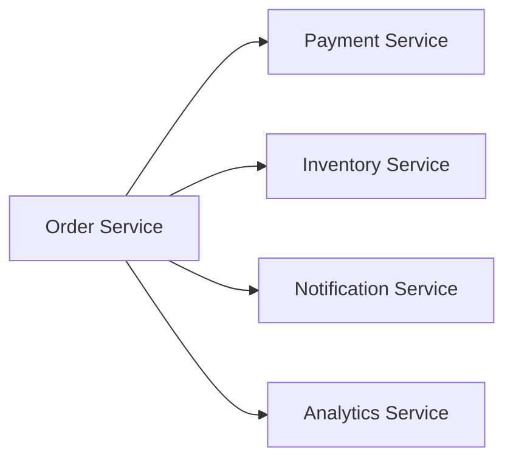

Nếu `Order Service` gọi tất cả service synchronously:

```text
Order Service
  |
  +--> Payment
  +--> Inventory
  +--> Notification
  +--> Analytics
```

ta có một số vấn đề:

```text
Coupling
Failure propagation
Latency accumulation
Traffic spike
Retry complexity
Scaling dependency
```

Ví dụ:

```text
Notification Service down

        ↓

Order creation bị fail?
```

Trong nhiều business flow:

> Không nhất thiết phải vậy.

Ta có thể thay đổi architecture:

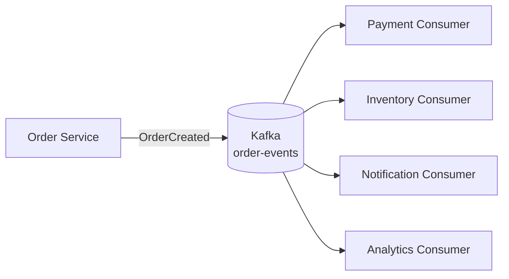

Order Service chỉ cần nói:

```text
OrderCreated
```

thay vì:

```text
Payment làm cái này
Inventory làm cái kia
Notification làm cái kia
Analytics làm cái kia
```

Đây là một bước chuyển rất quan trọng:

```text
Command-oriented coupling
            ↓
Event-driven architecture
```

---

# 2. Event là gì?

Event mô tả:

> Một điều gì đó **đã xảy ra**.

Ví dụ:

```text
OrderCreated
PaymentCompleted
UserRegistered
ProductPriceChanged
ShipmentDelivered
```

Một Kafka record thường có conceptually:

```text
key
value
timestamp
headers
```

Ví dụ:

```json
{
  "eventType": "OrderCreated",
  "orderId": "ORD-123",
  "userId": "USER-42",
  "amount": 500000
}
```

Kafka docs mô tả event gồm key, value, timestamp và optional metadata headers. ([Kafka][1])

Một naming convention tốt thường dùng past tense:

```text
OrderCreated
PaymentAuthorized
InventoryReserved
```

vì event nói:

```text
"something happened"
```

không phải:

```text
"please do something"
```

---

# 3. Kiến trúc Kafka cơ bản

Mental model:

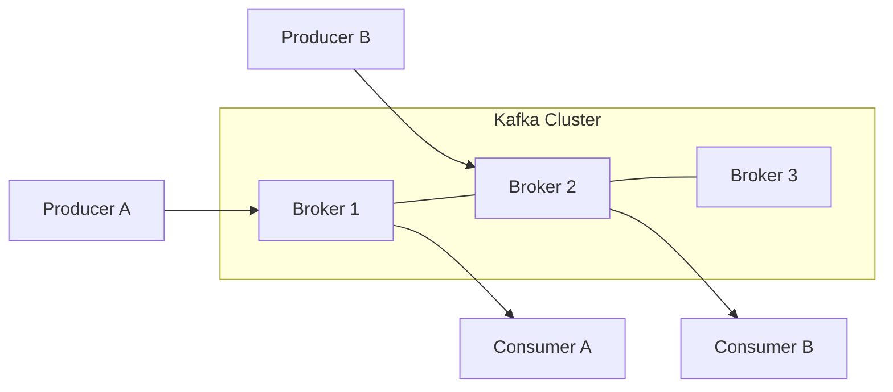

Các thành phần quan trọng:

| Component      | Vai trò                                 |
| -------------- | --------------------------------------- |
| Producer       | Gửi event                               |
| Broker         | Kafka server lưu và phục vụ dữ liệu     |
| Topic          | Logical stream/category                 |
| Partition      | Đơn vị physical/logical để scale topic  |
| Consumer       | Đọc event                               |
| Consumer Group | Nhóm consumer chia nhau workload        |
| Offset         | Vị trí của record trong partition       |
| Replica        | Bản copy của partition                  |
| Controller     | Quản lý metadata/leadership trong KRaft |

---

# 4. Topic là gì?

Topic giống một logical event stream.

Ví dụ:

```text
orders
payments
inventory-events
user-events
```

Producer:

```text
Order Service
     |
     | OrderCreated
     v
orders topic
```

Consumers:

```text
orders
  |
  +--> Payment Service
  +--> Analytics Service
  +--> Notification Service
```

Topic **không chỉ có một consumer**.

Một topic có thể:

```text
0 producer
1 producer
many producers

0 consumer
1 consumer
many consumers
```

Kafka topics được thiết kế multi-producer và multi-subscriber. ([Kafka][1])

---

# 5. Partition — concept quan trọng nhất của Kafka

Một topic không nhất thiết là một log.

Nó được chia thành nhiều:

```text
partitions
```

Ví dụ:

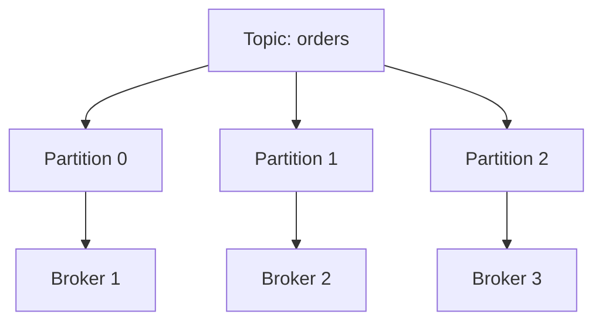

Bên trong mỗi partition:

```text
Partition 0

offset
  0   OrderCreated A
  1   OrderPaid A
  2   OrderCreated B
  3   OrderCancelled C
  4   ...
```

Kafka partition là một:

> **Ordered append-only log.**

New record chỉ được append vào cuối log.

---

# 6. Offset là gì?

Mỗi record trong partition được gán một:

```text
offset
```

Ví dụ:

```text
Partition 0

Offset
  0     A
  1     B
  2     C
  3     D
  4     E
```

Offset có thể hiểu là:

> Vị trí của record trong partition.

Điểm cực kỳ quan trọng:

```text
Offset chỉ unique trong một partition.
```

Do đó:

```text
Topic = orders

Partition 0 / Offset 10
Partition 1 / Offset 10
```

là hai records hoàn toàn khác nhau.

Kafka consumer có thể giữ offset và sau khi restart tiếp tục từ offset đã commit. ([Kafka][2])

---

# 7. Kafka không xóa message khi consumer đọc

Đây là difference rất lớn so với mental model traditional queue.

Giả sử:

```text
Partition:

0 A
1 B
2 C
3 D
```

Consumer đọc:

```text
A B C
```

Kafka **không lập tức xóa A B C**.

Log vẫn:

```text
0 A
1 B
2 C
3 D
```

Consumer chỉ nhớ:

```text
position = 3
```

Do đó consumer có thể:

```text
seek(0)
```

và đọc lại.

Kafka giữ event theo configured retention thay vì delete vì consumer đã đọc. ([Kafka][1])

---

# 8. Tại sao design này rất mạnh?

Giả sử Analytics team phát hiện bug.

Hôm qua họ tính revenue sai.

Với destructive queue:

```text
old messages đã biến mất
```

Khó replay.

Kafka:

```text
Events still retained

      ↓

Reset offset

      ↓

Replay

      ↓

Recompute analytics
```

Đây là một trong những khả năng quan trọng nhất của event log:

```text
replayability
```

---

# 9. Producer gửi message vào partition nào?

Producer phải chọn:

```text
Topic
+
Partition
```

Thông thường có hai case.

### Record có key

Ví dụ:

```text
key = orderId
```

Producer partitioning function sẽ map key vào partition:

```text
hash(key)
    ↓
partition
```

Mental model:

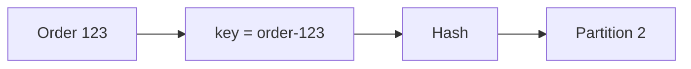

Các event cùng key sẽ được route vào cùng partition, giúp giữ ordering của key đó. Kafka docs cũng lấy ví dụ các event cùng event key được ghi vào cùng partition. ([Kafka][1])

---

# 10. Vì sao key quan trọng?

Giả sử order:

```text
ORDER-123
```

có events:

```text
OrderCreated
PaymentCompleted
OrderShipped
OrderDelivered
```

Ta muốn:

```text
Created
   ↓
Payment
   ↓
Shipped
   ↓
Delivered
```

Nếu tất cả:

```text
key = ORDER-123
```

thì chúng vào cùng partition.

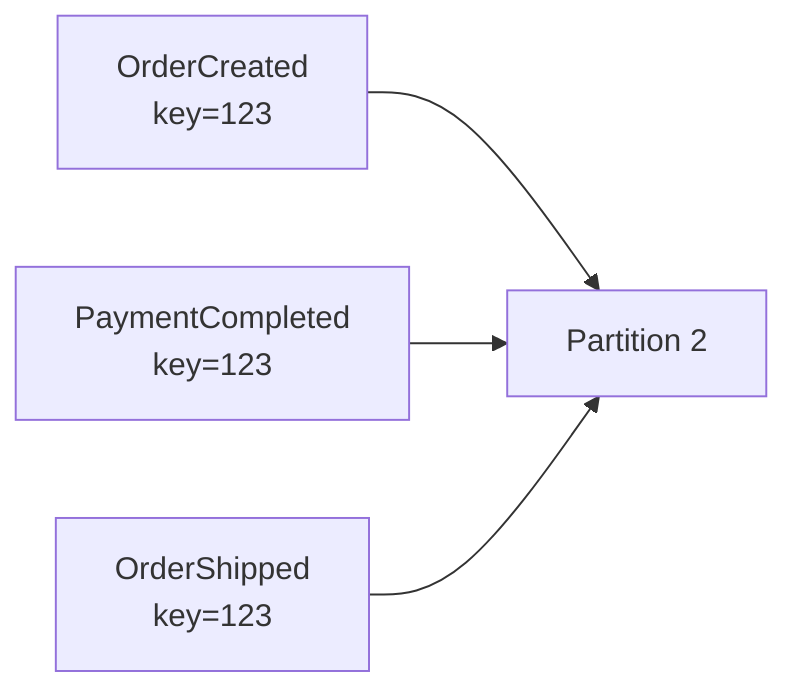

Partition:

```text
offset 100 OrderCreated
offset 101 PaymentCompleted
offset 102 OrderShipped
```

Ordering được giữ.

---

# 11. Kafka ordering guarantee

Câu phỏng vấn:

> Does Kafka guarantee ordering?

Không nên trả lời:

> Yes.

Câu đúng:

> **Kafka guarantees ordering within a partition, not across the whole topic.**

Ví dụ:

```text
Partition 0          Partition 1

A1                   B1
A2                   B2
A3                   B3
```

Ta biết chắc:

```text
A1 → A2 → A3
```

và:

```text
B1 → B2 → B3
```

Nhưng không có global relationship:

```text
A1 vs B1
A2 vs B2
```

Kafka chính thức chỉ đảm bảo ordered consumption trên từng topic-partition. ([Kafka][1])

---

# 12. Nếu cần global ordering thì sao?

Có thể dùng:

```text
1 partition
```

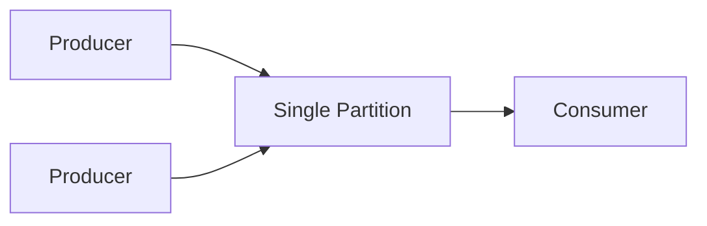

Nhưng trade-off:

```text
Global ordering
      ↑
      |
      ↓
Parallelism
```

Một partition tạo bottleneck.

Đây là nguyên tắc quan trọng:

> **Partition là đơn vị của cả ordering lẫn parallelism.**

---

# 13. Consumer hoạt động như thế nào?

Kafka consumer dùng pull model.

Nó gửi request kiểu:

```text
Give me records from:

partition = 2
offset >= 500
```

Broker trả:

```text
500
501
502
...
```

Flow:

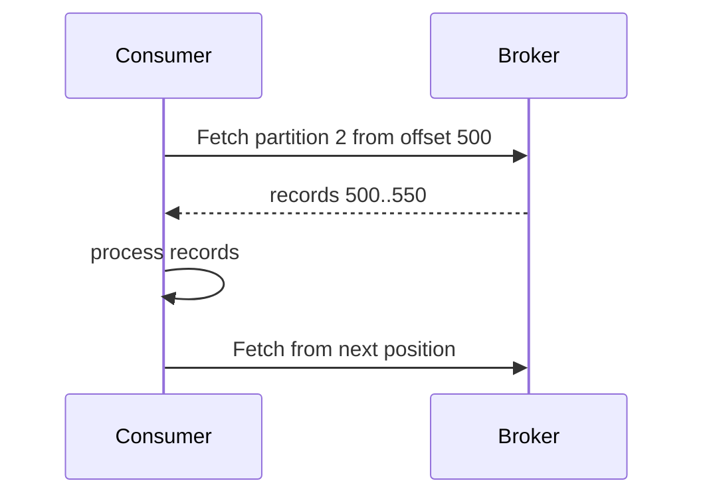

Kafka consumer fetch dữ liệu từ broker và tự chỉ định offset bắt đầu cho mỗi fetch; consumer cũng có thể rewind position để reconsume. ([Kafka][3])

---

# 14. Consumer Group

Giả sử topic có:

```text
6 partitions
```

và service có:

```text
3 consumer instances
```

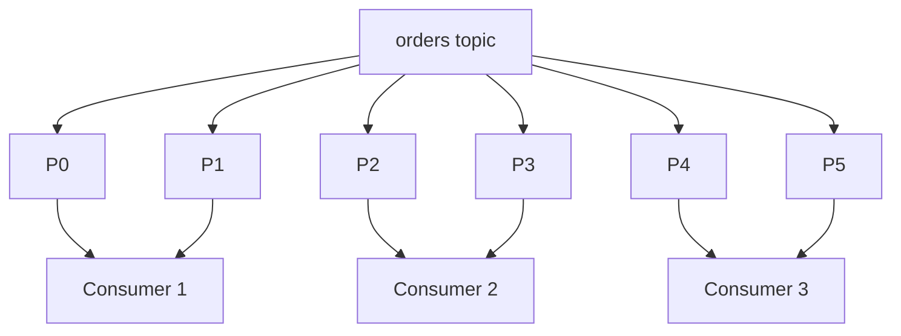

Trong một traditional consumer group:

> Một partition được assign cho tối đa một consumer trong cùng group tại một thời điểm.

Nhưng:

```text
one consumer
```

có thể consume:

```text
many partitions
```

---

# 15. Consumer Group giúp scale như thế nào?

Giả sử:

```text
12 partitions
```

Nếu:

```text
1 consumer
```

thì một consumer xử lý:

```text
12 partitions
```

Thêm consumer:

```text
Consumer 1 → P0 P1 P2
Consumer 2 → P3 P4 P5
Consumer 3 → P6 P7 P8
Consumer 4 → P9 P10 P11
```

Parallelism tăng.

Nhưng nếu:

```text
12 partitions
20 consumers
```

với traditional consumer group thì:

```text
12 consumers active with partition assignment
8 consumers effectively idle
```

Mental model:

```text
Maximum partition-processing parallelism
≈
number of partitions
```

---

# 16. Hai Consumer Groups khác nhau thì sao?

Ví dụ:

```text
Topic: orders
```

Group A:

```text
payment-service
```

Group B:

```text
analytics-service
```

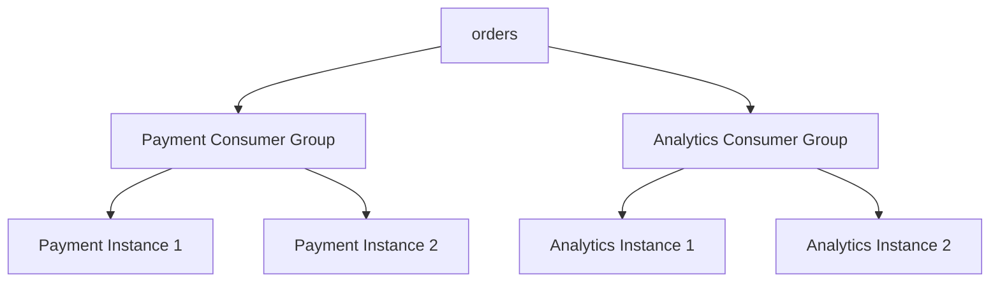

Hai group consume hoàn toàn độc lập.

Payment có thể ở:

```text
offset 500
```

Analytics:

```text
offset 430
```

Không ảnh hưởng nhau.

---

# 17. Consumer offset: position vs committed offset

Có hai concept dễ nhầm:

```text
current position
```

và:

```text
committed offset
```

Ví dụ consumer poll:

```text
offset 100
101
102
103
104
```

Sau khi fetch:

```text
current position ≈ 105
```

nhưng committed offset có thể vẫn:

```text
100
```

Nếu consumer crash lúc này:

```text
restart
↓
resume from committed offset
```

Có thể đọc lại 100–104.

---

# 18. Offset được lưu ở đâu?

Kafka lưu committed offsets của consumer groups trong internal compacted topic:

```text
__consumer_offsets
```

Group Coordinator xử lý offset commits/fetches cho group. ([Kafka][4])

Mental model:

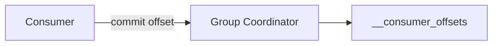

Điều này cho phép consumer restart trên máy khác và vẫn biết:

```text
đã xử lý đến đâu
```

---

# 19. Commit trước hay sau processing?

Đây chính là nơi delivery semantics xuất hiện.

Giả sử:

```text
Message M
```

### Commit trước process


Nếu crash sau commit nhưng trước processing hoàn tất:

```text
Kafka nghĩ M đã xử lý
```

Consumer restart:

```text
skip M
```

Message bị mất về mặt business processing.

Đây gần với:

```text
at-most-once
```

---

# 20. Process trước rồi commit

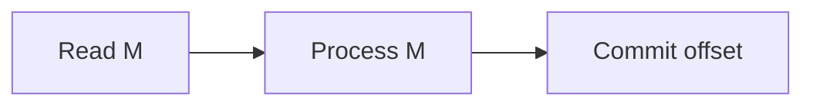

Nếu:

```text
process successful
↓
crash
↓
chưa commit
```

Consumer restart và đọc lại M.

```text
M processed twice
```

Đây là:

```text
at-least-once
```

---

# 21. Ba delivery semantics

Kafka docs chia ba semantics quen thuộc như sau: at-most-once có thể mất message nhưng không redeliver; at-least-once không mất nhưng có thể redeliver; exactly-once hướng đến mỗi message được xử lý đúng một lần. ([Kafka][3])

| Semantics     |       Loss |                     Duplicate |
| ------------- | ---------: | ----------------------------: |
| At-most-once  |     có thể |                         không |
| At-least-once | tránh loss |                        có thể |
| Exactly-once  |      tránh | tránh trong phạm vi guarantee |

Trong production, rất thường gặp:

```text
At-least-once
+
Idempotent consumer
```

---

# 22. Tại sao consumer nên idempotent?

Giả sử event:

```text
PaymentCompleted
paymentId = PAY-123
amount = 500000
```

Consumer làm:

```text
wallet.balance += 500000
```

Nếu message duplicate:

```text
500000
+
500000
=
1000000
```

Sai.

Idempotent handling:

```text
if payment PAY-123 already processed
    ignore
else
    process
```

Ví dụ database:

```text
processed_events

event_id
---------
PAY-123
```

và có:

```sql
UNIQUE(event_id)
```

Flow:

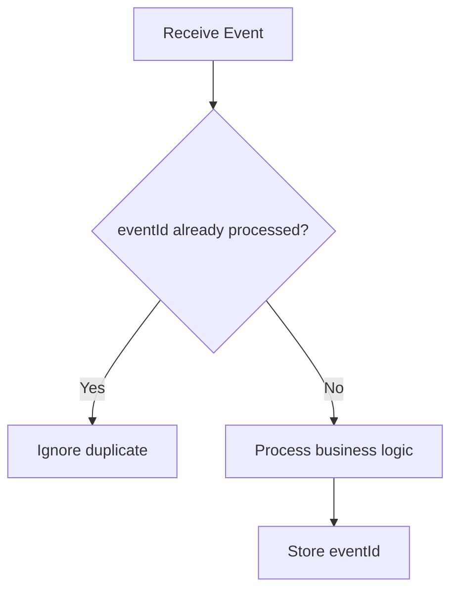

Đây là một câu interview rất đáng nhớ:

> **Kafka retries/at-least-once means your consumer should usually be designed to tolerate duplicates.**

---

# 23. Producer flow end-to-end

Producer không đơn giản:

```text
send()
→ Kafka
```

Một mental model tốt hơn:

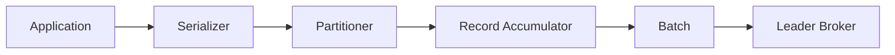

Producer có thể batch nhiều records của cùng partition để gửi trong một request.

Điều này tăng throughput mạnh.

---

# 24. `batch.size` và `linger.ms`

Nếu gửi từng message ngay:

```text
message
network request

message
network request

message
network request
```

network overhead cao.

Kafka producer có thể gom:

```text
M1
M2
M3
M4
M5
```

thành:

```text
Batch
```

rồi gửi một lần.

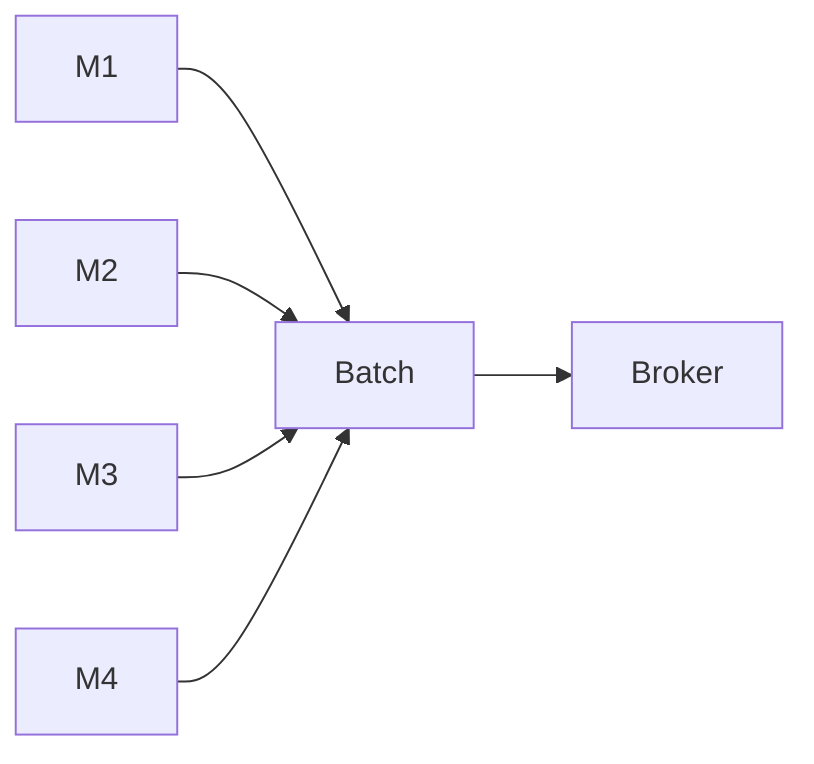

Trade-off:

```text
larger batches
→ higher throughput
→ better compression

but

waiting to form batch
→ potentially more latency
```

Kafka 4.3 producer docs hiện đặt default `batch.size=16384` và `linger.ms` mặc định 5ms; `linger.ms` được đổi mặc định từ 0 sang 5 từ Kafka 4.0 để cải thiện batching efficiency. ([Kafka][5])

---

# 25. Tại sao Kafka nhanh dù ghi xuống disk?

Câu interview rất quan trọng:

> Kafka stores data on disk. Why is it still fast?

Không nên chỉ trả lời:

> Vì SSD nhanh.

Các lý do quan trọng gồm:

```text
Sequential append
OS page cache
Batching
Compression
Zero-copy/sendfile
Partition parallelism
Large sequential fetches
```

Kafka deliberately dựa nhiều vào filesystem/page cache và sử dụng append-oriented sequential I/O thay vì random writes; batching biến nhiều small operations thành larger sequential operations. ([Kafka][3])

---

# 26. Sequential I/O

Random disk access:

```text
seek
read
seek
write
seek
read
```

rất đắt.

Kafka chủ yếu:

```text
append
append
append
append
```

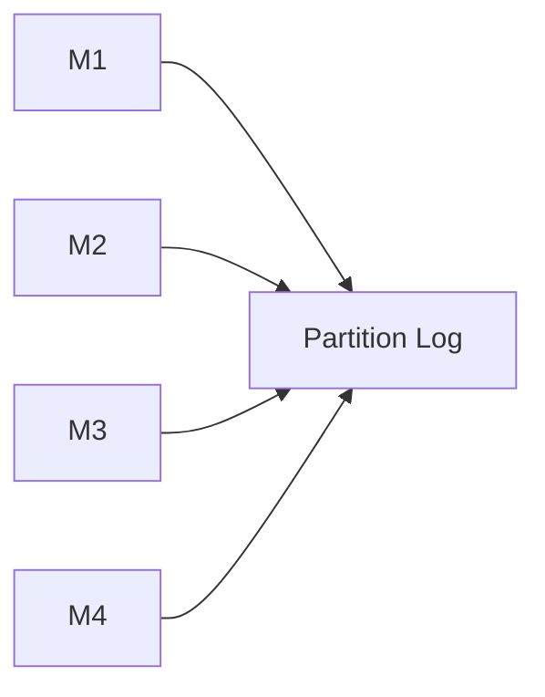

Append sequential giúp filesystem và disk hoạt động hiệu quả.

---

# 27. Page Cache

Kafka không cố giữ toàn bộ records trong Java heap.

Nó dựa nhiều vào:

```text
OS Page Cache
```

Mental model:

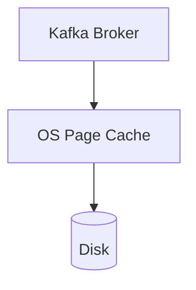

Nếu consumer đang gần producer:

```text
Producer writes
     ↓
Page Cache
     ↓
Consumer fetches
```

Dữ liệu có thể được phục vụ từ RAM/page cache mà không phải physical disk read.

Kafka docs giải thích architecture này nhằm tận dụng OS caching, tránh duplicate cache trong JVM và giảm GC pressure. ([Kafka][3])

---

# 28. Zero-copy

Naive path:

```text
Disk
 ↓
Kernel Page Cache
 ↓
Application Buffer
 ↓
Socket Buffer
 ↓
NIC
```

Nhiều copying.

Kafka có thể tận dụng Linux `sendfile`:

```text
Page Cache
    ↓
Socket / NIC
```

giảm copy qua user-space.

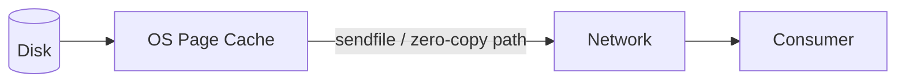

Kafka docs mô tả `sendfile` giúp data đi từ page cache ra network mà tránh việc copy qua application user-space; lưu ý optimization này không được dùng theo cùng cách khi SSL yêu cầu xử lý user-space. ([Kafka][3])

---

# 29. Compression

Kafka hỗ trợ batch compression.

Mental model:

```text
M1
M2
M3
M4
 ↓
compress batch
 ↓
Broker
 ↓
store compressed
 ↓
Consumer
 ↓
decompress
```

Kafka hiện hỗ trợ GZIP, Snappy, LZ4 và ZStandard, và batch có thể được lưu và truyền ở compressed form. ([Kafka][3])

Trade-off:

```text
Compression
→ lower network/disk usage

but

→ CPU cost
```

---

# 30. Replication

Nếu mỗi partition chỉ có một copy:

```text
Broker dies
↓
data unavailable
```

Do đó Kafka replication.

Ví dụ:

```text
Replication Factor = 3
```

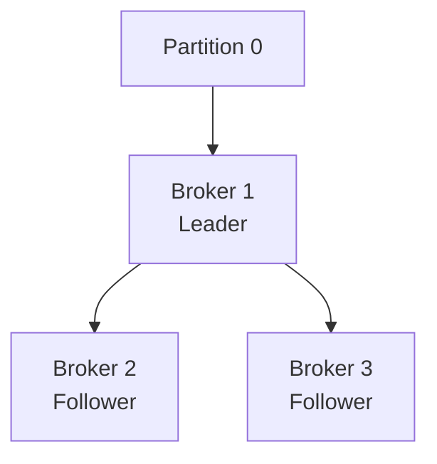

Một replica là:

```text
Leader
```

các replica khác:

```text
Followers
```

---

# 31. Ai nhận producer write?

Producer không broadcast tới mọi replica.

Producer ghi vào:

```text
Partition Leader
```

sau đó followers replicate.

```mermaid
sequenceDiagram

    participant P as Producer
    participant L as Leader
    participant F1 as Follower 1
    participant F2 as Follower 2

    P->>L: Produce M

    L->>L: Append M

    F1->>L: Fetch
    L-->>F1: M

    F2->>L: Fetch
    L-->>F2: M
```

Producer có metadata để biết broker nào đang là leader và gửi trực tiếp đến leader broker. ([Kafka][3])

---

# 32. ISR — In-Sync Replicas

Không phải follower nào cũng khỏe như nhau.

Ví dụ:

```text
Leader     offset 1000
Follower A offset 999
Follower B offset 400
```

Follower B tụt quá xa.

Kafka duy trì:

```text
ISR
=
In-Sync Replicas
```

Ví dụ:

```text
Leader
Follower A
```

thuộc ISR.

Follower B:

```text
out of ISR
```

Kafka sử dụng dynamic ISR set và bình thường chỉ replica đủ đồng bộ mới eligible cho leader election trong safety model thông thường. ([Kafka][3])

---

# 33. `acks`

Producer có thể cấu hình mức durability bằng:

```text
acks
```

## `acks=0`

Producer:

```text
send
↓
không chờ broker response
```

Fast nhưng weakest guarantee.

```mermaid
sequenceDiagram
    participant P as Producer
    participant L as Leader

    P->>L: Message
    Note over P: Doesn't wait for ACK
```

---

# 34. `acks=1`

Leader:

```text
append locally
↓
ACK producer
```

Không chờ followers đầy đủ.

```mermaid
sequenceDiagram

    participant P as Producer
    participant L as Leader
    participant F as Follower

    P->>L: M

    L->>L: append

    L-->>P: ACK

    L-->>F: replicate later
```

Failure window:

```text
Leader writes
↓
ACK producer
↓
Leader crashes
↓
Follower chưa có message
```

Có thể mất message.

Kafka docs mô tả đúng failure này cho `acks=1`. ([Kafka][5])

---

# 35. `acks=all`

Leader chờ:

```text
all current ISR replicas
```

acknowledge trước khi produce được coi successful.

```mermaid
sequenceDiagram

    participant P as Producer
    participant L as Leader
    participant F1 as Follower 1
    participant F2 as Follower 2

    P->>L: M

    L->>L: append

    L->>F1: replicate M
    L->>F2: replicate M

    F1-->>L: replicated
    F2-->>L: replicated

    L-->>P: ACK
```

`acks=all` là strongest producer acknowledgement mode hiện tại và cũng là requirement cho idempotent producer. ([Kafka][5])

---

# 36. Một nuance quan trọng về `min.insync.replicas`

Giả sử:

```text
replication.factor = 3

min.insync.replicas = 2

acks = all
```

Đừng hiểu rằng:

```text
Kafka luôn chỉ chờ 2 replica.
```

Nếu ISR hiện tại là:

```text
Broker A
Broker B
Broker C
```

thì `acks=all` chờ **toàn bộ current ISR**.

`min.insync.replicas=2` nói rằng:

> Nếu ISR tụt xuống dưới 2 thì không chấp nhận write có `acks=all`.

Ví dụ:

```text
ISR = {A, B, C}
→ write possible

ISR = {A, B}
→ write possible

ISR = {A}
→ reject write
```

Kafka docs hiện minh hoạ production setup điển hình bằng replication factor 3 + min ISR 2 + `acks=all`. ([Kafka][6])

---

# 37. Availability vs Durability

Giả sử:

```text
RF = 3
minISR = 2
acks = all
```

Nếu hai brokers chết:

```text
ISR = 1
```

Kafka có thể chọn:

```text
reject writes
```

thay vì:

```text
accept writes risking durability
```

Đây là classic distributed-systems trade-off:

```text
Availability
      ↔
Durability / consistency
```

Interview không nên chỉ nói:

> replication makes Kafka reliable.

Hãy thêm:

> Reliability phụ thuộc replication factor, ISR health, `acks`, `min.insync.replicas`, leader election policy và failure scenario.

---

# 38. Broker leader chết thì sao?

Ban đầu:

```text
Partition 0

Broker A Leader
Broker B Follower ISR
Broker C Follower ISR
```

A chết.

```mermaid
flowchart TD

    Fail[Leader A fails]

    Controller[Controller detects failure]

    ISR[Choose eligible replica]

    Promote[Promote B as Leader]

    Metadata[Update cluster metadata]

    Clients[Clients refresh metadata]

    Fail --> Controller --> ISR --> Promote --> Metadata --> Clients
```

Producer/consumer refresh metadata và tiếp tục nói chuyện với leader mới.

---

# 39. KRaft là gì?

Bạn có thể từng học architecture cũ:

```text
Kafka
+
ZooKeeper
```

Từ Apache Kafka 4.0, ZooKeeper mode đã bị loại bỏ; Kafka 4.x chạy bằng **KRaft**, trong đó Kafka controllers tự duy trì cluster metadata bằng metadata quorum. Current Apache docs tại thời điểm này là Kafka 4.3. ([Kafka][7])

Architecture hiện đại:

```mermaid
flowchart TD

    subgraph Controllers[KRaft Controller Quorum]
        C1[Controller 1]
        C2[Controller 2]
        C3[Controller 3]
    end

    subgraph Brokers[Kafka Brokers]
        B1[Broker 1]
        B2[Broker 2]
        B3[Broker 3]
    end

    C1 --- C2
    C2 --- C3

    Controllers --> Brokers
```

---

# 40. Broker vs Controller

Broker:

```text
store partitions
serve producer requests
serve consumer fetches
replicate partition data
```

Controller:

```text
cluster metadata
partition leadership
broker registration/state
metadata coordination
```

Trong KRaft server có thể được configured:

```text
broker
controller
broker,controller
```

nhưng combined broker-controller mode chủ yếu đơn giản cho small/development deployments; Kafka docs không khuyến nghị combined mode cho critical deployments vì giảm isolation và khả năng scale/roll independently. ([Kafka][8])

---

# 41. Vì sao KRaft cần nhiều controllers?

Ta muốn controller layer vẫn hoạt động nếu một node chết.

Ví dụ:

```text
3 controllers
```

có thể chịu một controller failure trong quorum.

General rule:

```text
to tolerate N simultaneous controller failures
→ 2N + 1 controllers
```

Kafka docs khuyến nghị 3 hoặc nhiều controllers tùy failure tolerance mong muốn. ([Kafka][9])

---

# 42. Consumer Rebalance

Giả sử:

```text
Topic = 4 partitions

Group:
Consumer A
Consumer B
```

Ban đầu:

```text
A → P0 P1
B → P2 P3
```

Consumer C join:

```text
A → P0
B → P1
C → P2 P3
```

Partition assignment thay đổi.

Đây gọi là:

```text
rebalance
```

```mermaid
flowchart TD

    Join[Consumer joins/leaves/fails]

    Coordinator[Group Coordinator]

    Rebalance[Rebalance]

    Assignment[New partition assignment]

    Resume[Consumers continue]

    Join --> Coordinator --> Rebalance --> Assignment --> Resume
```

---

# 43. Vì sao rebalance có thể gây vấn đề?

During rebalance:

```text
processing may pause / assignments change
```

Nếu consumer constantly:

```text
join
leave
crash
restart
```

ta có:

```text
rebalance storm
```

Symptoms:

```text
latency
consumer lag
duplicate processing
unstable throughput
```

Các configuration và patterns liên quan:

```text
session timeout
heartbeat
max.poll.interval.ms
static membership
cooperative assignment
```

Không cần thuộc hết default numbers khi interview, nhưng phải hiểu:

> Consumer group membership thay đổi thì partition ownership có thể phải được điều phối lại.

---

# 44. Consumer Lag

Một metric cực quan trọng.

Giả sử partition latest offset:

```text
100000
```

consumer committed:

```text
95000
```

Consumer lag:

```text
100000 - 95000
=
5000
```

Mental model:

```text
Producer rate
     >
Consumer processing rate
```

thì:

```text
lag ↑
```

```mermaid
flowchart LR

    Producer[Producer<br/>1000 msg/s]

    Kafka[(Kafka)]

    Consumer[Consumer<br/>500 msg/s]

    Lag[Backlog grows]

    Producer --> Kafka
    Kafka --> Consumer
    Kafka --> Lag
```

Lag không nhất thiết là lỗi.

Nhưng:

```text
lag continuously increasing
```

là warning mạnh rằng consumer không theo kịp.

---

# 45. Backpressure

Giả sử producer:

```text
10k events/s
```

consumer:

```text
2k events/s
```

Kafka có thể buffer backlog trên disk trong một khoảng thời gian.

Đây là lợi thế:

```text
Producer
     ↓
Kafka durable buffer
     ↓
slow consumer
```

Producer không nhất thiết phải chạy theo tốc độ consumer ngay lập tức.

Tuy nhiên backlog không vô hạn:

```text
retention
disk capacity
SLA
processing delay
```

vẫn phải được quan tâm.

---

# 46. Hot Partition

Giả sử có:

```text
10 partitions
```

nhưng 90% events có:

```text
key = "GLOBAL"
```

Tất cả map vào:

```text
Partition 3
```

```mermaid
flowchart TD

    Events[90% Events]

    Hot[P3 HOT]

    P0[P0]
    P1[P1]
    P2[P2]

    Events --> Hot
```

Bây giờ:

```text
P3 throughput bottleneck
Consumer owning P3 overloaded
other consumers mostly idle
```

Đây gọi là:

```text
partition skew / hot partition
```

Solution có thể involve:

```text
better partition key
key bucketing
more granular keys
rethink ordering requirement
```

---

# 47. Partition key trade-off

Ví dụ payment events.

Nếu key:

```text
userId
```

thì tất cả transactions một user có ordering.

Nhưng một enterprise customer rất hot:

```text
userId = BIG_CLIENT
```

có thể tạo hot partition.

Nếu key:

```text
transactionId
```

distribution tốt hơn.

Nhưng ordering theo user không còn guaranteed.

Đây là trade-off:

```text
Ordering locality
      ↔
Distribution / parallelism
```

Đây là cách interviewer muốn bạn reasoning, không phải chỉ:

> “hash key % partitions.”

---

# 48. Bao nhiêu partitions là hợp lý?

Không có một số cố định.

More partitions:

```text
+ more producer parallelism
+ more consumer parallelism
+ greater throughput potential
```

nhưng cũng:

```text
+ more metadata
+ more files
+ more replica work
+ more leader elections
+ more rebalance complexity
+ more operational overhead
```

Vì vậy:

> **Partition count là capacity/design decision.**

Không phải:

```text
càng nhiều càng tốt
```

---

# 49. Retention

Kafka có thể giữ event:

```text
7 days
30 days
by total bytes
...
```

depending configuration.

Ví dụ:

```text
orders

M1 day 1
M2 day 1
M3 day 2
M4 day 3
```

Nếu retention:

```text
3 days
```

old segments eventually deleted.

Retention thường áp dụng theo:

```text
log segments
```

không phải từng record được delete ngay lập tức khi chạm đúng TTL.

---

# 50. Log Segment

Một partition trên disk không phải một file vô hạn.

Conceptually:

```text
Partition P0

00000000000000000000.log
00000000000001000000.log
00000000000002000000.log
```

```mermaid
flowchart LR

    Partition[P0]

    S1[Segment 0]

    S2[Segment 1]

    S3[Active Segment]

    Partition --> S1
    Partition --> S2
    Partition --> S3
```

Old closed segments dễ:

```text
delete
compact
move/tier
```

hơn việc mutate một giant file.

---

# 51. Delete retention vs Log Compaction

Hai concept khác nhau.

### Delete policy

```text
old data
↓
delete based on time/size
```

### Log compaction

Giữ:

```text
latest value for each key
```

Ví dụ log:

```text
user1 → Hanoi
user2 → HCMC
user1 → Da Nang
user3 → Hue
user1 → Hai Phong
```

Sau compaction conceptually:

```text
user1 → Hai Phong
user2 → HCMC
user3 → Hue
```

Kafka cung cấp log compaction như một retention model riêng cho keyed records. ([Kafka][3])

---

# 52. Khi nào Log Compaction hữu ích?

Ví dụ topic:

```text
user-profile
```

Events:

```text
user1 name=A
user1 name=B
user1 name=C
```

Bạn muốn topic vẫn có khả năng reconstruct:

```text
latest state
```

mà không giữ mọi historical update mãi.

Log compaction rất phù hợp với:

```text
changelog
CDC state
Kafka Streams state-store changelog
latest entity state
```

---

# 53. Idempotent Producer

Giả sử:

```text
Producer sends M
```

Broker persist M nhưng ACK bị mất:

```text
Producer -> Broker: M

Broker persists

Broker -> Producer: ACK
                   X network failure
```

Producer không biết:

```text
M stored?
or not?
```

Retry có thể tạo:

```text
M
M
```

Kafka hỗ trợ idempotent producer.

Conceptually broker có thể sử dụng producer identity + sequence information để phát hiện duplicate retries. Kafka docs mô tả producer ID và sequence numbers dùng để deduplicate resend. ([Kafka][3])

Trong Kafka 4.3 Java producer, idempotence mặc định enabled nếu không có conflicting configuration; nó yêu cầu `acks=all`, retries và `max.in.flight.requests.per.connection <= 5`. ([Kafka][5])

---

# 54. Producer idempotence không đồng nghĩa end-to-end exactly once

Giả sử:

```text
Kafka topic
↓
Consumer
↓
Charge credit card API
```

Idempotent producer giúp:

```text
Producer retry
→ không append duplicate Kafka record
```

Nhưng consumer vẫn có thể:

```text
call payment API
↓
crash before offset commit
↓
consume again
↓
call payment API again
```

Do đó:

```text
producer idempotence
≠
business-operation idempotence
```

Đây là distinction cực quan trọng.

---

# 55. Kafka Transactions

Kafka transaction giải bài toán như:

```text
Consume from Topic A
        ↓
Process
        ↓
Produce to Topic B
        ↓
Commit input offsets
```

Ta muốn:

```text
output records
+
consumer offsets
```

commit atomically.

Conceptual flow:

```mermaid
flowchart TD

    Begin[Begin Transaction]

    Read[Read input events]

    Process[Process]

    Write[Produce output]

    Offset[Send offsets to transaction]

    Commit[Commit transaction]

    Begin --> Read --> Process --> Write --> Offset --> Commit
```

Kafka hỗ trợ atomic writes across partitions bằng transactions, và Kafka Streams / consume-process-produce pipelines có thể sử dụng transactional producer cùng `read_committed` consumers để đạt exactly-once semantics trong Kafka boundary. ([Kafka][3])

Kafka 4.x cũng có strengthened server-side transaction protocol. ([Kafka][10])

---

# 56. Exactly-once có phạm vi

Một câu trả lời không tốt:

> Kafka guarantees exactly once.

Câu tốt hơn:

> Kafka có primitives để đạt exactly-once processing trong các Kafka-to-Kafka transactional flows, nhưng nếu side effect nằm ở external system như payment gateway hoặc arbitrary database thì phải phối hợp với destination đó hoặc thiết kế idempotency/transaction phù hợp.

Kafka docs cũng nhấn mạnh exactly-once với external destinations thường cần cooperation từ destination system. ([Kafka][3])

---

# 57. Dual Write Problem

Đây là một trong những phần quan trọng nhất khi dùng Kafka với microservices.

Giả sử Order Service:

```text
1. INSERT order DB
2. Publish OrderCreated Kafka
```

Code:

```java
repository.save(order);
kafkaTemplate.send("orders", event);
```

Problem:

```mermaid
flowchart TD

    DB[DB INSERT succeeds]

    Crash[Application crashes]

    Kafka[Kafka publish never happens]

    DB --> Crash --> Kafka
```

DB:

```text
Order exists
```

Kafka:

```text
No OrderCreated
```

System inconsistent.

---

# 58. Đổi thứ tự cũng không giải được

Nếu:

```text
1. Kafka publish
2. DB write
```

Failure:

```text
Kafka publish success
↓
DB write fails
```

Bây giờ:

```text
Consumers think order exists
```

nhưng database:

```text
order absent
```

Do đó đây không phải vấn đề:

```text
chọn thứ tự đúng
```

mà là:

```text
distributed atomicity problem
```

---

# 59. Transactional Outbox Pattern

Một solution rất phổ biến.

Trong một DB transaction:

```text
INSERT order
+
INSERT outbox event
```

```mermaid
flowchart TD

    App[Order Service]

    Tx[DB Transaction]

    Order[(orders)]

    Outbox[(outbox_events)]

    Publisher[Outbox Publisher / CDC]

    Kafka[(Kafka)]

    App --> Tx

    Tx --> Order
    Tx --> Outbox

    Outbox --> Publisher --> Kafka
```

Nếu transaction commit:

```text
order
+
event
```

đều tồn tại.

Publisher sau đó retry publish outbox event vào Kafka.

---

# 60. Vì sao Outbox tốt hơn dual write?

Ta biến:

```text
DB write
+
Kafka write
```

hai distributed operations thành:

```text
one local DB transaction
```

sau đó eventual delivery.

Still need:

```text
publisher retries
duplicate protection
outbox cleanup
consumer idempotency
```

nhưng mất atomic dual-write window nguy hiểm nhất.

---

# 61. Retry

Consumer gặp:

```text
temporary database timeout
```

Ta thường muốn retry.

Nhưng retry immediately:

```text
fail
retry
fail
retry
fail
retry
```

có thể gây:

```text
retry storm
```

Một strategy:

```text
retry
+
backoff
+
bounded attempts
```

Ví dụ:

```text
1s
5s
30s
```

---

# 62. Poison Message và Dead Letter Topic

Giả sử message malformed:

```json
{
  "amount": "abc"
}
```

Consumer luôn fail.

Nếu retry vô hạn:

```text
same message
same failure
forever
```

Poison message có thể block progress tùy processing strategy.

Ta có thể route:

```mermaid
flowchart TD

    Kafka[(Main Topic)]

    Consumer[Consumer]

    Success[Processed]

    Retry[Retry]

    DLT[(Dead Letter Topic)]

    Kafka --> Consumer

    Consumer -->|success| Success

    Consumer -->|temporary failure| Retry
    Retry --> Consumer

    Consumer -->|permanent / retries exhausted| DLT
```

DLT/DLQ thường cần lưu:

```text
original payload
error reason
original topic
partition
offset
timestamp
retry count
```

để troubleshoot/replay.

---

# 63. Ordering vs Retry

Một subtle problem.

Partition:

```text
M1
M2
M3
```

M1 fails.

Nếu gửi M1 sang retry topic rồi tiếp tục:

```text
M2 processed
M3 processed
M1 retried later
```

Business ordering trở thành:

```text
M2
M3
M1
```

Nếu strict order quan trọng:

```text
cannot simply skip failed event
```

Do đó retry architecture phải cân bằng:

```text
availability / throughput
       ↔
ordering guarantee
```

---

# 64. Kafka vs synchronous REST

Câu interview:

> Why don't services just call each other using REST?

Đừng trả lời:

> Kafka scales better.

Hãy structure:

### REST

```mermaid
sequenceDiagram

    participant A as Order Service
    participant B as Payment Service

    A->>B: Create Payment

    B-->>A: Response
```

Ưu:

```text
simple request-response
immediate result
easy reasoning
```

Nhược:

```text
temporal coupling
failure propagation
latency coupling
traffic spike propagation
```

Kafka:

```mermaid
sequenceDiagram

    participant A as Order Service
    participant K as Kafka
    participant B as Payment Service

    A->>K: OrderCreated

    K-->>A: ACK

    B->>K: Fetch

    K-->>B: OrderCreated
```

Ưu:

```text
decoupling
durable buffering
fan-out
replay
independent scaling
```

Nhược:

```text
eventual consistency
duplicate handling
ordering complexity
debugging harder
operational complexity
```

---

# 65. Kafka vs RabbitMQ

Simplified mental model:

| Kafka                          | RabbitMQ                                  |
| ------------------------------ | ----------------------------------------- |
| Distributed event log          | Traditional message broker                |
| Retention based                | Queue/ack-oriented                        |
| Replay native                  | Traditional queue consumption             |
| Partition-based ordering       | Queue/routing semantics                   |
| Very high streaming throughput | Rich messaging/routing                    |
| Event streaming/data pipelines | Tasks/commands/routing often natural      |
| Consumer controls offset       | Broker tracks delivery/acks more directly |

Không nên hỏi:

> Kafka hay RabbitMQ cái nào tốt hơn?

Nên hỏi:

```text
What problem am I solving?
```

---

# 66. Kafka vs Redis Pub/Sub

Redis Pub/Sub:

```text
live subscriber
↓
message delivered
```

offline subscriber:

```text
message missed
```

Kafka:

```text
event persisted
↓
consumer can read later
```

Cho durable event processing:

```text
Kafka
```

thường phù hợp hơn Pub/Sub.

---

# 67. Kafka vs Redis Streams

Redis Streams và Kafka overlap nhiều hơn.

Redis Streams phù hợp khi:

```text
already have Redis
moderate event workload
simple durable queue/stream
low operational footprint desired
```

Kafka phù hợp mạnh khi:

```text
high-throughput event backbone
many consumers
long retention
replay
large distributed event pipeline
stream ecosystem
large-scale partitioned processing
```

Không có câu:

```text
Kafka always better
```

mà là trade-off.

---

# 68. Kafka vs Database Queue

Một cách đơn giản:

```sql
SELECT *
FROM jobs
WHERE status = 'PENDING'
```

có thể đủ cho small systems.

Ưu:

```text
simple
transaction with business data
no Kafka infrastructure
```

Nhưng khi:

```text
high throughput
many subscribers
long event history
replay
stream processing
independent consumer groups
```

Kafka trở nên hấp dẫn hơn.

Đừng introduce Kafka chỉ vì:

> microservice phải có Kafka.

---

# 69. Schema Evolution

Producer version 1:

```json
{
  "orderId": "123",
  "amount": 500
}
```

Producer version 2:

```json
{
  "orderId": "123",
  "amount": 500,
  "currency": "VND"
}
```

Consumer cũ có đọc được không?

Đây là:

```text
schema compatibility
```

Production Kafka thường dùng:

```text
Avro
Protobuf
JSON Schema
```

cùng schema-management strategy.

Cần nghĩ:

```text
backward compatibility
forward compatibility
versioning
optional fields
default values
```

---

# 70. Event design: tránh đưa database entity trực tiếp

Anti-pattern:

```json
{
  "entire_order_database_row": "..."
}
```

Event nên phản ánh:

```text
business contract
```

chứ không nhất thiết là:

```text
database representation
```

Ví dụ:

```json
{
  "eventId": "evt-123",
  "eventType": "PaymentCompleted",
  "occurredAt": "...",
  "paymentId": "PAY-10",
  "orderId": "ORD-20",
  "amount": 500000,
  "currency": "VND"
}
```

Điều này giúp reduce coupling giữa:

```text
DB schema
```

và:

```text
event contract
```

---

# 71. Event ID rất hữu ích

Event nên thường có:

```text
eventId
```

Ví dụ:

```text
7ab2...
```

Consumer dùng nó cho:

```text
deduplication
tracing
audit
debugging
```

Ví dụ idempotency:

```sql
INSERT INTO processed_event(event_id)
VALUES ('7ab2...')
```

với:

```text
UNIQUE(event_id)
```

---

# 72. Kafka trong Spring Boot

Producer:

```java
@Service
@RequiredArgsConstructor
public class OrderEventProducer {

    private final KafkaTemplate<String, OrderCreatedEvent> kafkaTemplate;

    public void publish(OrderCreatedEvent event) {

        kafkaTemplate.send(
            "order-events",
            event.orderId(),
            event
        );
    }
}
```

Key:

```text
event.orderId()
```

giúp các events cùng order được route consistent vào một partition.

Consumer:

```java
@Component
public class PaymentConsumer {

    @KafkaListener(
        topics = "order-events",
        groupId = "payment-service"
    )
    public void consume(OrderCreatedEvent event) {

        process(event);
    }
}
```

Notification có group khác:

```java
@KafkaListener(
    topics = "order-events",
    groupId = "notification-service"
)
```

Do khác group:

```text
Payment receives event

AND

Notification receives event
```

---

# 73. Multiple instances Spring service

Giả sử Payment Service chạy:

```text
Instance A
Instance B
Instance C
```

tất cả:

```text
groupId = payment-service
```

Kafka chia partitions cho chúng.

```mermaid
flowchart TD

    Kafka[(order-events)]

    P0[P0]
    P1[P1]
    P2[P2]

    A[Payment A]
    B[Payment B]
    C[Payment C]

    Kafka --> P0
    Kafka --> P1
    Kafka --> P2

    P0 --> A
    P1 --> B
    P2 --> C
```

Đây là horizontal scaling của consumer.

---

# 74. Monitoring Kafka

Một production Kafka system ít nhất nên nghĩ theo four areas:

```text
Broker health
Producer health
Consumer health
Disk / replication health
```

Một metric rất quan trọng:

```text
consumer lag
```

Ngoài ra cần quan tâm các dạng signal như:

```text
under-replicated / unavailable partitions
ISR changes
request latency
produce/fetch error rate
throughput
disk utilization
network utilization
rebalance frequency
producer retries
```

Không nên monitor chỉ:

```text
Kafka process alive?
```

---

# 75. Failure reasoning framework

Khi interviewer đưa Kafka architecture, hãy tự động hỏi:

```mermaid
flowchart TD

    Q[Kafka Design]

    P[Producer failure?]

    B[Broker failure?]

    C[Consumer failure?]

    N[Network failure?]

    Dup[Duplicate?]

    Order[Ordering?]

    Backlog[Backpressure?]

    Q --> P
    Q --> B
    Q --> C
    Q --> N
    Q --> Dup
    Q --> Order
    Q --> Backlog
```

Ví dụ producer:

```text
send succeeded but ACK lost?
```

Consumer:

```text
business processing succeeded but offset commit failed?
```

Broker:

```text
leader crashes before followers replicate?
```

Đây mới là distributed-system thinking.

---

# 76. Một flow hoàn chỉnh: Order Event

Giả sử user checkout.

```mermaid
sequenceDiagram

    participant Client

    participant Order as Order Service

    participant DB as PostgreSQL

    participant Outbox as Outbox

    participant Kafka

    participant Payment

    participant Notification

    Client->>Order: POST /orders

    Order->>DB: BEGIN

    Order->>DB: INSERT order

    Order->>Outbox: INSERT OrderCreated

    Order->>DB: COMMIT

    Order-->>Client: Order Created

    Outbox->>Kafka: Publish OrderCreated

    Kafka-->>Outbox: ACK

    Kafka->>Payment: OrderCreated

    Payment->>Payment: Process idempotently

    Kafka->>Notification: OrderCreated

    Notification->>Notification: Send notification
```

Nếu Notification chết:

```text
Order creation vẫn có thể hoàn thành
```

Notification restart:

```text
resume from committed offset
```

Đó là một ví dụ rõ về:

```text
decoupling
+
durability
+
independent recovery
```

---

# 77. Mental model Producer

Nhớ:

```text
Application
   ↓
serialize
   ↓
choose partition
   ↓
batch
   ↓
partition leader
   ↓
replication
   ↓
ACK depending on acks
```

Mermaid:

```mermaid
flowchart LR

    App[App]

    Ser[Serialize]

    Part[Partition]

    Batch[Batch]

    Leader[Leader]

    ISR[ISR Replicas]

    Ack[ACK]

    App --> Ser --> Part --> Batch --> Leader --> ISR --> Ack
```

---

# 78. Mental model Consumer

```text
Consumer
   ↓
join group
   ↓
receive partition assignment
   ↓
fetch from offset
   ↓
process
   ↓
commit offset
```

```mermaid
flowchart LR

    Join[Join Group]

    Assign[Partition Assignment]

    Fetch[Fetch]

    Process[Process]

    Commit[Commit Offset]

    Join --> Assign --> Fetch --> Process --> Commit
```

Failure point:

```text
Process
   ↓
CRASH
   ↓
Commit
```

→ duplicate.

Đó là lý do idempotency quan trọng.

---

# 79. Mental model Replication

```text
Producer
   ↓
Leader
   ↓
Followers
   ↓
ISR
   ↓
Commit
```

```mermaid
flowchart TD

    Producer

    Leader

    F1[Follower]

    F2[Follower]

    Producer --> Leader

    Leader --> F1
    Leader --> F2

    F1 --> ISR[ISR]
    F2 --> ISR

    ISR --> Commit[Committed]
```

---

# 80. Mental map toàn bộ Kafka

```mermaid
flowchart TD

    Kafka[Apache Kafka]

    Kafka --> DataModel[Data Model]
    Kafka --> Producer
    Kafka --> Consumer
    Kafka --> Reliability
    Kafka --> Performance
    Kafka --> Production

    DataModel --> Topic
    DataModel --> Partition
    DataModel --> Offset
    DataModel --> Key
    DataModel --> Retention
    DataModel --> Compaction

    Producer --> Partitioning
    Producer --> Batching
    Producer --> Compression
    Producer --> Acks
    Producer --> Idempotence

    Consumer --> Group[Consumer Group]
    Consumer --> Commit[Offset Commit]
    Consumer --> Rebalance
    Consumer --> Lag
    Consumer --> Idempotency

    Reliability --> Replication
    Reliability --> Leader
    Reliability --> ISR
    Reliability --> MinISR[min.insync.replicas]
    Reliability --> Transactions
    Reliability --> KRaft

    Performance --> SequentialIO[Sequential I/O]
    Performance --> PageCache[Page Cache]
    Performance --> ZeroCopy[Zero Copy]
    Performance --> Parallelism[Partition Parallelism]

    Production --> Retry
    Production --> DLT[Dead Letter Topic]
    Production --> HotPartition[Hot Partition]
    Production --> Outbox
    Production --> Monitoring
    Production --> Schema[Schema Evolution]
```

---

# 81. Cách trả lời câu “How does Kafka work?”

Một answer interview tốt có thể đi theo flow:

> A producer publishes an event to a Kafka topic. Because a topic is partitioned, the producer chooses a partition, often based on the event key when ordering for the same entity is required.
>
> Each partition is an ordered append-only log, and each record receives an offset. The producer writes to the partition leader, and followers replicate the data for fault tolerance.
>
> Consumers normally belong to consumer groups. Kafka distributes topic partitions among the consumers in a group, allowing parallel processing while preserving ordering within each partition.
>
> Consumers track and commit their offsets so that they can resume after failures. Depending on when processing and offset commits occur, the system may provide at-most-once or at-least-once semantics. For at-least-once processing, consumers should generally be idempotent.
>
> Kafka achieves high throughput using partition-level parallelism, sequential log I/O, batching, OS page cache, compression, and optimized network transfer.

Đây tốt hơn rất nhiều so với:

> Producer sends message to topic and consumer receives it.

---

# 82. Cách trả lời “Why is Kafka fast?”

Nên reasoning:

```text
1. Partitioning
→ parallel reads/writes.

2. Append-oriented sequential I/O
→ avoid expensive random disk access.

3. OS page cache
→ hot data often served from memory.

4. Batching
→ amortize network + I/O overhead.

5. Compression
→ reduce network/disk bandwidth.

6. Zero-copy/sendfile
→ reduce unnecessary memory copying.

7. Pull-based consumers
→ consumers fetch efficient batches.
```

Apache Kafka's design docs explicitly highlight sequential log access, page cache, batching and `sendfile`/zero-copy as major efficiency techniques. ([Kafka][3])

---

# 83. Cách trả lời “Kafka guarantees no duplicate?”

Không.

Structure:

```text
Producer side
→ idempotent producer can deduplicate retries.

Consumer side
→ processing can still repeat if consumer
   processes successfully but crashes before committing offset.

Therefore
→ design consumers idempotently.

Exactly-once
→ requires specific transactional boundaries
   and does not magically make arbitrary external side effects
   exactly-once.
```

Đây là answer production-level.

---

# 84. Cách trả lời “What happens if a consumer dies?”

```text
1. Consumer stops heartbeating / membership expires.

2. Group detects membership change.

3. Rebalance occurs.

4. Its partitions are assigned to surviving consumers.

5. New owner resumes from committed offsets.

6. Records after last commit may be reprocessed.

7. Therefore consumers should tolerate duplicates.
```

Flow:

```mermaid
flowchart TD

    Die[Consumer A dies]

    Detect[Group detects failure]

    Rebalance[Rebalance]

    Reassign[Assign A partitions to B/C]

    Offset[Read committed offsets]

    Resume[Resume processing]

    Die --> Detect --> Rebalance --> Reassign --> Offset --> Resume
```

---

# 85. Cách trả lời “How do you choose a partition key?”

Đừng chỉ nói:

> userId.

Hãy đánh giá:

```text
What ordering do I require?

Which events must stay together?

How evenly distributed is this key?

Could one key become extremely hot?

How much parallelism do I need?

Can the partition count change later?

What happens to stateful consumers if mapping changes?
```

Ví dụ:

```text
Need order lifecycle ordering
→ orderId

Need account-level ordering
→ accountId

Need maximum distribution
→ high-cardinality identifier
```

---

# 86. Cách trả lời “At-least-once vs exactly-once?”

Strong answer:

```text
At-least-once:

process
↓
commit

If processing succeeds but commit fails,
the message may be delivered again.

Therefore:
duplicates are possible.

Exactly-once:

requires controlling both the input offset
and the output effect atomically.

Kafka can provide this naturally for certain
Kafka-to-Kafka transactional flows.

If the destination is an external database,
payment API, email system, etc.,
additional coordination or idempotency is required.
```

---

# 87. 15 câu Kafka mình nghĩ bạn nên trả lời được trước interview

1. Kafka là gì và khác traditional message queue thế nào?
2. Topic và partition khác nhau thế nào?
3. Offset là gì?
4. Kafka guarantee ordering ở phạm vi nào?
5. Producer chọn partition thế nào?
6. Consumer Group hoạt động ra sao?
7. Vì sao số consumer hữu ích bị giới hạn bởi số partition?
8. Consumer offset commit hoạt động thế nào?
9. At-most-once / at-least-once / exactly-once khác nhau ra sao?
10. Vì sao consumer phải idempotent?
11. Leader / follower / ISR là gì?
12. `acks=0`, `1`, `all` khác nhau thế nào?
13. `min.insync.replicas` để làm gì?
14. Broker/consumer/producer crash thì chuyện gì xảy ra?
15. Vì sao Kafka nhanh dù dữ liệu persistent trên disk?

Sau đó mới mở rộng sang:

```text
KRaft
transactions
log compaction
rebalance
hot partition
outbox
retry/DLT
schema evolution
consumer lag
```

---

# 88. Framework tư duy khi gặp câu Kafka/System Design

Với mỗi câu Kafka, thay vì chỉ mô tả **how**, hãy chạy mental framework:

```mermaid
flowchart LR

    R[Requirement]

    Flow[Data Flow]

    Partition[Partitioning / Ordering]

    Guarantee[Delivery Guarantee]

    Failure[Failure Cases]

    Scale[Scaling]

    Ops[Operations]

    Tradeoff[Trade-offs]

    R --> Flow
    Flow --> Partition
    Partition --> Guarantee
    Guarantee --> Failure
    Failure --> Scale
    Scale --> Ops
    Ops --> Tradeoff
```

Ví dụ interviewer hỏi:

> Design Kafka for payment events.

Đừng nhảy ngay tới:

```text
create topic payment-events
```

Mà nghĩ:

```text
What event?

PaymentInitiated?
PaymentCompleted?
RefundCompleted?

What key?
paymentId?
orderId?
userId?

Ordering required between which events?

Can duplicate payment event occur?

What happens if consumer processes payment
but crashes before offset commit?

Need idempotency key?

What's the source of truth?

How do DB transaction and Kafka publish stay consistent?

Outbox?

What is required durability?

acks=all?

RF=3?
minISR=2?

What happens if Kafka unavailable?

What lag is acceptable?

How do we retry?

What goes to DLT?
```

Đây chính là bước chuyển từ:

```text
"biết Kafka"
```

sang:

```text
"biết thiết kế production system với Kafka"
```

và cũng là kiểu mở rộng **flow → failure → trade-off → mitigation** rất hữu ích cho vòng CS Foundation/Backend interview của bạn.

[1]: https://kafka.apache.org/43/getting-started/introduction/ "Introduction | Apache Kafka"
[2]: https://kafka.apache.org/43/implementation/distribution/ "Distribution | Apache Kafka"
[3]: https://kafka.apache.org/43/design/design/ "Design | Apache Kafka"
[4]: https://kafka.apache.org/42/implementation/distribution/?utm_source=chatgpt.com "Distribution | Apache Kafka"
[5]: https://kafka.apache.org/43/configuration/producer-configs/ "Producer Configs | Apache Kafka"
[6]: https://kafka.apache.org/42/configuration/topic-configs/?utm_source=chatgpt.com "Topic Configs | Apache Kafka"
[7]: https://kafka.apache.org/42/getting-started/upgrade/?utm_source=chatgpt.com "Upgrading | Apache Kafka"
[8]: https://kafka.apache.org/43/operations/kraft/ "KRaft | Apache Kafka"
[9]: https://kafka.apache.org/42/operations/kraft/?utm_source=chatgpt.com "KRaft | Apache Kafka"
[10]: https://kafka.apache.org/43/operations/transaction-protocol/ "Transaction Protocol | Apache Kafka"
