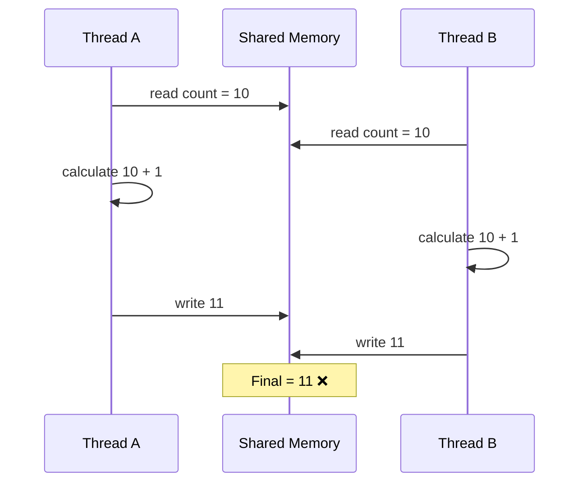
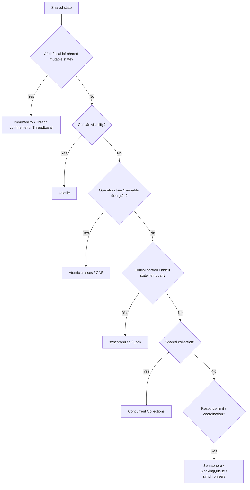
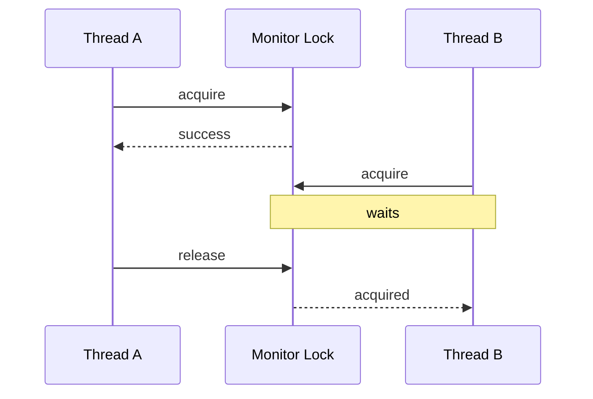
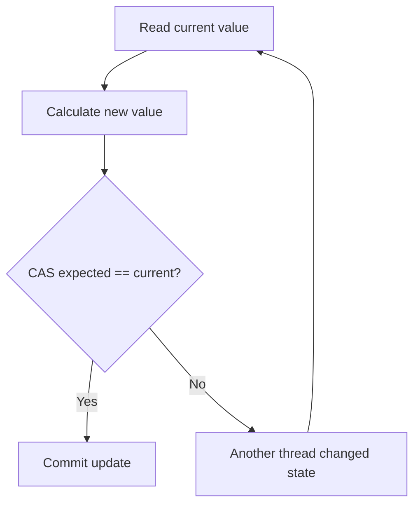
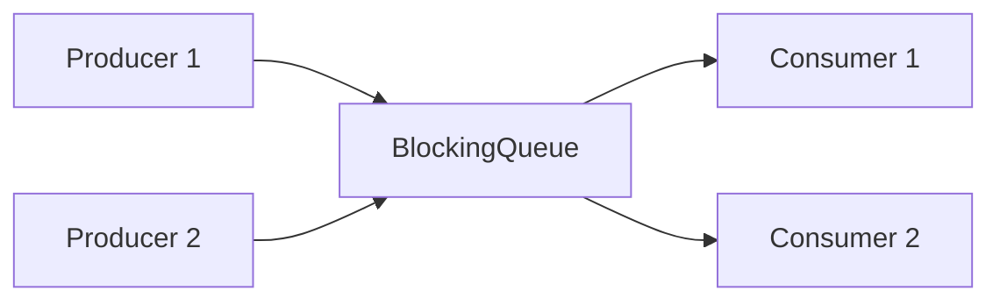
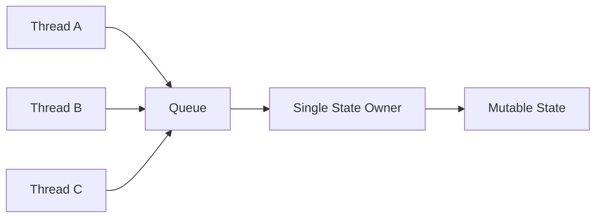
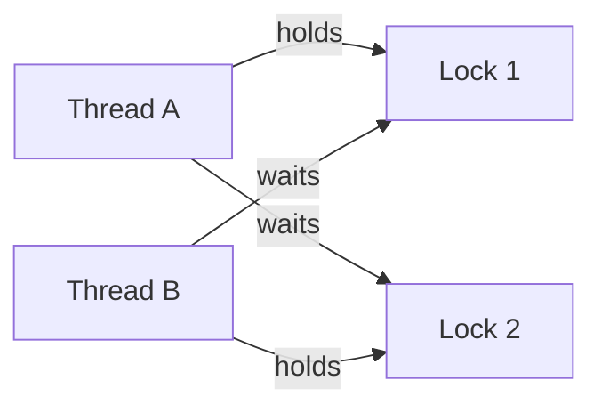
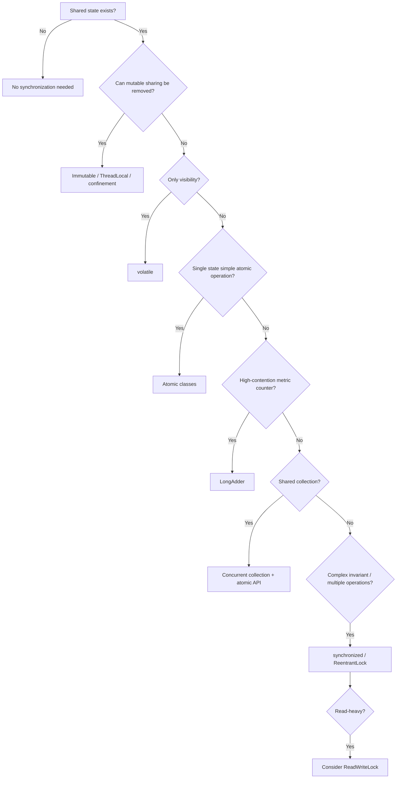

Race condition là một trong những khái niệm quan trọng nhất của Java concurrency. Nếu hiểu bản chất của nó, bạn sẽ biết lúc nào dùng `synchronized`, `volatile`, `AtomicInteger`, `ReentrantLock`, `ConcurrentHashMap`, `ThreadLocal`, v.v. thay vì chỉ học thuộc API.

---

# 1. Race condition là gì?

**Race condition** xảy ra khi:

> Kết quả của chương trình phụ thuộc vào thứ tự/timing mà nhiều thread truy cập hoặc thay đổi shared mutable state.

Ba yếu tố thường xuất hiện cùng nhau:

```text
Multiple threads
        +
Shared state
        +
At least one thread modifies it
```

Ví dụ:

```java
class Counter {
    int count = 0;

    void increment() {
        count++;
    }
}
```

Giả sử:

```text
count = 10
```

Thread A và Thread B cùng gọi:

```java
count++;
```

Ta mong đợi:

```text
10 + 1 + 1 = 12
```

nhưng có thể nhận:

```text
11
```

Tại sao?

Vì:

```java
count++;
```

không phải một instruction atomic duy nhất.

Conceptually nó là:

```text
1. read count
2. count + 1
3. write count
```

Hai thread có thể interleave:



Đây gọi cụ thể là:

> **Lost update**

---

# 2. Một race condition không nhất thiết xảy ra mọi lần

Đây là điều khiến concurrent bug rất khó debug.

Chương trình có thể:

```text
Run 1 → correct
Run 2 → correct
Run 3 → correct
Run 4 → wrong
Run 5 → correct
```

Bởi vì OS scheduler có thể schedule thread khác nhau mỗi lần.

Ví dụ:

```text
Thread A → CPU
Thread B → CPU
```

có thể interleave theo:

```text
A A A B B B
```

hoặc:

```text
A B A B B A
```

hoặc hàng nghìn permutation khác.

Race condition vì vậy thường:

```text
non-deterministic
```

---

# 3. Race condition không chỉ là `count++`

Ví dụ nguy hiểm hơn:

```java
if (balance >= amount) {
    balance -= amount;
}
```

Giả sử:

```text
balance = 100

Thread A withdraw 80
Thread B withdraw 80
```

Execution:

```text
A: balance >= 80 → true
B: balance >= 80 → true

A: withdraw
B: withdraw
```

Vấn đề ở đây không phải riêng phép trừ.

Critical operation thực sự là:

```text
CHECK
+
UPDATE
```

Hai bước phải được xem như **một operation atomic ở business level**.

Đây là ý cực kỳ quan trọng khi interview.

---

# 4. Ba vấn đề nền tảng trong Java concurrency

Khi nói về shared state, thường cần quan tâm ba thứ:

| Concept    | Ý nghĩa                                      |
| ---------- | -------------------------------------------- |
| Atomicity  | Operation có thể bị chen ngang không?        |
| Visibility | Thread khác có nhìn thấy update mới không?   |
| Ordering   | Compiler/CPU/JVM có reorder operation không? |

Ví dụ:

```java
count++;
```

vấn đề chính là:

```text
Atomicity
```

Trong khi:

```java
boolean running = true;
```

Thread A update:

```java
running = false;
```

Thread B đọc:

```java
while (running) {}
```

thì vấn đề chủ yếu là:

```text
Visibility
```

Đây là lý do `volatile` giải quyết được case thứ hai nhưng không giải quyết được `count++`.

---

# 5. Tổng quan các cách chống race condition trong Java

Một mental model tốt:



Bây giờ đi từng cơ chế.

---

# 6. Cách 1 — Loại bỏ shared mutable state

Đây thực ra thường là cách tốt nhất.

Thay vì:

```text
N threads
   ↓
same mutable object
```

ta thiết kế:

```text
Thread A → own data

Thread B → own data

Thread C → own data
```

Nếu không share mutable state:

```text
không có concurrent write
→ không có data race
```

## Immutable object

Ví dụ:

```java
public final class User {

    private final String name;
    private final int age;

    public User(String name, int age) {
        this.name = name;
        this.age = age;
    }

    public String getName() {
        return name;
    }

    public int getAge() {
        return age;
    }
}
```

Object sau khi tạo không thay đổi.

Nhiều thread đọc:

```text
Thread A ─┐
Thread B ─┼→ Immutable Object
Thread C ─┘
```

hoàn toàn an toàn nếu object thực sự immutable và được publish đúng cách.

### Ưu điểm

Không cần lock, không contention, reasoning đơn giản và scale tốt.

### Nhược điểm

Không phải state nào cũng có thể immutable. Nếu update liên tục, bạn có thể phải tạo object mới nhiều lần.

### Khi dùng

Configuration, DTO immutable, value object, snapshot state.

---

# 7. Cách 2 — Thread confinement

Ý tưởng:

> Đừng để một mutable object được nhiều thread nhìn thấy.

Ví dụ:

```java
void process() {
    List<String> temp = new ArrayList<>();
}
```

Nếu `temp` chỉ tồn tại trong một invocation và không escape ra ngoài:

```text
Thread A → tempA
Thread B → tempB
```

không cần synchronization.

Đây là một trong những pattern quan trọng nhất:

> Local variables thường an toàn vì mỗi thread có stack riêng.

Tuy nhiên object được reference bởi local variable vẫn có thể bị share nếu bạn đưa reference ra ngoài.

---

# 8. Cách 3 — `ThreadLocal`

Nếu mỗi thread cần một version riêng của cùng một variable:

```java
ThreadLocal<String> context =
        ThreadLocal.withInitial(() -> "default");
```

Mỗi thread:

```text
Thread A → value A
Thread B → value B
Thread C → value C
```

Không cùng sửa một object.

Ví dụ:

```java
private static final ThreadLocal<String> USER =
        new ThreadLocal<>();

public void handle(String user) {
    try {
        USER.set(user);

        doSomething();
    } finally {
        USER.remove();
    }
}
```

### Ưu điểm

Không cần lock cho dữ liệu thread-specific. Hữu ích với context, correlation ID, legacy non-thread-safe state.

### Nhược điểm

Không dùng được nếu state thực sự phải share.

Đặc biệt với thread pool:

```text
thread được reuse
```

nếu quên:

```java
threadLocal.remove();
```

có thể gây stale state hoặc memory retention.

Với virtual threads hiện đại cũng nên cẩn thận không biến `ThreadLocal` thành nơi chứa quá nhiều state dài hạn.

---

# 9. Cách 4 — `synchronized`

Đây là cơ chế mutual exclusion cơ bản của Java.

```java
class Counter {

    private int count;

    public synchronized void increment() {
        count++;
    }
}
```

Java đảm bảo:

```text
Thread A enters synchronized
Thread B waits

A leaves
B enters
```

Conceptually:



## `synchronized` bảo vệ gì?

Không phải variable tự nhiên được bảo vệ.

Bạn đang bảo vệ:

> critical section bằng cùng một monitor lock.

Ví dụ:

```java
synchronized (lock) {
    count++;
}
```

Mọi thread phải sử dụng cùng `lock`.

---

# 10. `synchronized` còn giải quyết visibility

Đây là điểm rất quan trọng.

`synchronized` không chỉ cung cấp:

```text
Mutual exclusion
```

mà còn cung cấp memory visibility.

Unlock trên monitor:

```text
Thread A release lock
```

happens-before thread B sau đó acquire cùng monitor.

Nói đơn giản:

```text
A changes shared state
A unlocks

B locks
→ B sees A's preceding updates
```

Vì vậy `synchronized` giải quyết cả:

```text
atomicity
visibility
ordering constraints
```

---

# 11. Ưu nhược điểm `synchronized`

### Ưu điểm

Syntax đơn giản:

```java
synchronized
```

JVM tự quản lý lock/unlock. Không sợ quên unlock như explicit lock.

Modern JVM đã optimize monitor khá tốt, nên không nên mặc định nghĩ "`synchronized` luôn rất chậm".

### Nhược điểm

Nếu lock contention cao:

```text
many threads
      ↓
one lock
```

throughput giảm.

Critical section dài có thể khiến thread khác chờ lâu.

Không linh hoạt bằng `ReentrantLock` trong các trường hợp cần timeout, interruptible lock hoặc nhiều condition.

---

# 12. Granularity của lock rất quan trọng

Ví dụ:

```java
public synchronized void process() {

    readFile();

    callExternalAPI();

    count++;

    sendEmail();
}
```

Nếu cả method lock:

```text
read file
API request
count++
email
```

đều nằm trong critical section.

Rất tệ nếu chỉ:

```java
count++
```

cần protection.

Tốt hơn:

```java
public void process() {

    readFile();
    callExternalAPI();

    synchronized (lock) {
        count++;
    }

    sendEmail();
}
```

Rule:

> Critical section nên nhỏ nhất có thể nhưng vẫn phải đủ lớn để bảo vệ invariant.

Không được thu nhỏ đến mức làm mất atomicity của business operation.

---

# 13. Cách 5 — `ReentrantLock`

Java cung cấp:

```java
java.util.concurrent.locks.ReentrantLock
```

Ví dụ:

```java
private final ReentrantLock lock =
        new ReentrantLock();

public void increment() {

    lock.lock();

    try {
        count++;
    } finally {
        lock.unlock();
    }
}
```

Tại sao cần `finally`?

Vì:

```java
count++;
```

hoặc logic bên trong có exception:

```text
exception
↓
unlock vẫn phải chạy
```

Nếu không:

```text
lock forever
→ deadlock-like blocking
```

---

# 14. Tại sao gọi là Reentrant?

Giả sử:

```java
lock.lock();

methodA();
```

và `methodA()` lại:

```java
lock.lock();
```

Cùng thread có thể acquire cùng lock nhiều lần.

Conceptually lock giữ:

```text
owner = Thread A
holdCount = 2
```

Thread đó phải unlock tương ứng hai lần.

`synchronized` monitor cũng reentrant.

---

# 15. `ReentrantLock` mạnh hơn `synchronized` ở đâu?

Ví dụ:

```java
if (lock.tryLock()) {
    try {
        ...
    } finally {
        lock.unlock();
    }
}
```

Thread có thể:

```text
try
↓
failed
↓
do something else
```

Thay vì block vô hạn.

Hoặc:

```java
lock.tryLock(1, TimeUnit.SECONDS);
```

Có timeout.

Hoặc:

```java
lock.lockInterruptibly();
```

Thread đang chờ lock có thể bị interrupt.

Có thể tạo:

```java
Condition condition = lock.newCondition();
```

để phối hợp thread.

---

# 16. Trade-off `synchronized` vs `ReentrantLock`

| `synchronized`          | `ReentrantLock`               |
| ----------------------- | ----------------------------- |
| Đơn giản                | Linh hoạt                     |
| Auto unlock             | Phải unlock                   |
| Ít boilerplate          | Nhiều boilerplate             |
| Good default            | Dùng khi cần advanced control |
| Không có `tryLock()`    | Có                            |
| Không timeout trực tiếp | Có                            |
| Monitor wait/notify     | `Condition`                   |

Default tốt trong nhiều codebase:

> Nếu không cần feature đặc biệt của `Lock`, dùng `synchronized` thường đơn giản hơn.

---

# 17. Cách 6 — `ReadWriteLock`

Có những object:

```text
1000 reads
10 writes
```

Nếu dùng mutex bình thường:

```text
Reader A
Reader B
Reader C
```

vẫn phải tuần tự nếu tất cả dùng cùng exclusive lock.

`ReadWriteLock` tách:

```text
read lock
write lock
```

Nhiều reader được cùng lúc:

```text
R1 ─┐
R2 ─┼→ Shared State
R3 ─┘
```

nhưng writer cần exclusive access.

Java:

```java
private final ReadWriteLock lock =
        new ReentrantReadWriteLock();

private final Lock readLock = lock.readLock();
private final Lock writeLock = lock.writeLock();
```

Read:

```java
readLock.lock();

try {
    return value;
} finally {
    readLock.unlock();
}
```

Write:

```java
writeLock.lock();

try {
    value++;
} finally {
    writeLock.unlock();
}
```

### Ưu điểm

Có thể tăng concurrency khi workload read-heavy.

### Nhược điểm

Phức tạp hơn mutex.

Nếu critical section cực ngắn, overhead của read/write lock có thể lớn hơn benefit.

Có thể xảy ra contention/starvation tùy workload và policy.

---

# 18. Cách 7 — `StampedLock`

`StampedLock` hỗ trợ một optimization thú vị:

```text
Optimistic Read
```

Ví dụ:

```java
long stamp = lock.tryOptimisticRead();

int x = this.x;
int y = this.y;

if (!lock.validate(stamp)) {

    stamp = lock.readLock();

    try {
        x = this.x;
        y = this.y;
    } finally {
        lock.unlockRead(stamp);
    }
}
```

Idea:

```text
đọc mà chưa lock
↓
check xem có writer chen vào không
↓
nếu không → dùng result
nếu có → fallback read lock
```

### Ưu điểm

Có thể rất hiệu quả cho:

```text
many reads
few writes
```

### Nhược điểm

Phức tạp hơn đáng kể.

`StampedLock` cũng không reentrant như `ReentrantLock`.

Thường không phải first choice trừ khi đã xác định contention/read pattern rõ ràng.

---

# 19. Cách 8 — `AtomicInteger`, `AtomicLong`, `AtomicReference`

Đây là cách rất quan trọng cho state đơn giản.

Ví dụ:

```java
AtomicInteger count = new AtomicInteger();

count.incrementAndGet();
```

không cần:

```java
synchronized
```

Atomic classes cung cấp atomic operations.

Ví dụ:

```java
incrementAndGet()
getAndIncrement()
addAndGet()
compareAndSet()
```

---

# 20. Atomic classes dùng CAS

CAS:

```text
Compare-And-Set
```

Pseudo:

```java
boolean compareAndSet(
    expected,
    newValue
)
```

Atomic concept:

```text
if current == expected:
    current = newValue
    success
else:
    fail
```

Giả sử:

```text
count = 10
```

A:

```text
CAS(10, 11)
→ success
```

B:

```text
CAS(10, 11)
→ fail
```

B retry:

```text
read 11
CAS(11,12)
→ success
```



---

# 21. Vì sao CAS thường gọi là lock-free?

Thread không cần:

```text
sleep
wait for mutex owner
wake up
```

Thay vào đó:

```text
try
fail
retry
```

Nhưng đừng hiểu:

```text
lock-free = free performance
```

Nếu contention cực lớn:

```text
100 threads
→ same AtomicInteger
```

rất nhiều CAS fail:

```text
retry
retry
retry
```

CPU bị tiêu tốn.

---

# 22. Khi Atomic classes tốt?

Rất tốt với:

```java
counter.incrementAndGet();
```

hoặc state transition đơn giản:

```java
state.compareAndSet(OLD, NEW);
```

Nhưng không phải lựa chọn tốt nếu có nhiều state liên quan:

```java
if (balance >= amount) {
    balance -= amount;
    transactionCount++;
    lastTransaction = ...
}
```

Ba state phải consistent cùng nhau.

`AtomicInteger balance` riêng lẻ không magically biến toàn bộ operation thành transaction atomic.

---

# 23. `AtomicReference`

Không chỉ primitive.

Ví dụ:

```java
AtomicReference<State> state =
        new AtomicReference<>(initialState);
```

Có thể dùng immutable state:

```java
while (true) {

    State oldState = state.get();

    State newState =
            calculate(oldState);

    if (state.compareAndSet(
            oldState,
            newState)) {
        break;
    }
}
```

Đây là một pattern mạnh:

```text
Immutable state
+
AtomicReference
+
CAS
```

---

# 24. ABA problem của CAS

Advanced interview concept.

Giả sử thread A đọc:

```text
value = A
```

Trong lúc đó:

```text
A → B → A
```

Sau đó thread đầu chạy CAS:

```text
expected = A
current = A
```

CAS tưởng:

```text
nothing changed
```

nhưng state đã thay đổi rồi quay về A.

Đây gọi là:

```text
ABA problem
```

Java có những class như:

```java
AtomicStampedReference
```

để gắn version/stamp.

---

# 25. Cách 9 — `LongAdder`

Nếu bạn có high-contention counter:

```java
AtomicLong requests =
        new AtomicLong();
```

với rất nhiều thread:

```text
T1 ─┐
T2 ─┤
T3 ─┼→ same CAS variable
...
T100┘
```

contention cao.

`LongAdder` phân tán update:

```text
Thread A → Cell 1
Thread B → Cell 2
Thread C → Cell 3
```

sau đó:

```text
sum()
=
base + cells
```

Ví dụ:

```java
LongAdder counter = new LongAdder();

counter.increment();

long total = counter.sum();
```

### Ưu điểm

Rất tốt cho high-contention metrics counter.

### Nhược điểm

`sum()` không phải snapshot transactional hoàn hảo trong lúc concurrent updates đang diễn ra.

Không thích hợp nếu bạn cần logic kiểu:

```java
if (counter == 100) {
    ...
}
```

với strict atomic semantics.

---

# 26. `AtomicLong` vs `LongAdder`

Mental model:

```text
Need exact atomic value/state transition
→ AtomicLong

Need high-throughput statistics counter
→ LongAdder
```

Ví dụ:

```text
Bank balance
→ AtomicLong / lock

HTTP request count metric
→ LongAdder
```

---

# 27. Cách 10 — `volatile`

Đây là phần rất hay bị hiểu sai.

Ví dụ:

```java
private volatile boolean running = true;
```

Thread A:

```java
while (running) {
    work();
}
```

Thread B:

```java
running = false;
```

`volatile` đảm bảo update được nhìn thấy đúng giữa các thread theo Java Memory Model.

Nó chủ yếu cung cấp:

```text
Visibility
+
Ordering guarantees
```

---

# 28. Nhưng `volatile` không làm `count++` atomic

Sai:

```java
volatile int count = 0;

count++;
```

Vẫn race.

Vì:

```text
count++
=
read
modify
write
```

Hai thread vẫn có thể:

```text
read 10
read 10
write 11
write 11
```

Nên:

```text
volatile != mutex
volatile != atomic compound operation
```

---

# 29. Khi nào `volatile` phù hợp?

Tốt cho state đơn giản mà:

```text
one write / simple read
```

Ví dụ:

```java
volatile boolean shutdown;
volatile Config currentConfig;
```

Đặc biệt hữu ích với:

```text
publish latest reference
flags
state visibility
```

Không phù hợp với:

```java
x++;
if (x > 10) x = 0;
check-then-act
read-modify-write
```

---

# 30. Cách 11 — Concurrent Collections

Không nên làm:

```java
HashMap<String, Integer> map =
        new HashMap<>();
```

rồi cho nhiều thread update mà không synchronization.

Java cung cấp:

```java
ConcurrentHashMap
ConcurrentLinkedQueue
CopyOnWriteArrayList
BlockingQueue
ConcurrentSkipListMap
```

Ví dụ:

```java
ConcurrentHashMap<String, Integer> map =
        new ConcurrentHashMap<>();
```

---

# 31. `ConcurrentHashMap`

Thay vì lock toàn bộ map cho mọi operation, implementation hỗ trợ concurrency ở mức fine-grained hơn và sử dụng nhiều kỹ thuật nội bộ tùy operation/version JVM.

Bạn nên dùng API atomic của map.

Ví dụ không tốt:

```java
if (!map.containsKey(key)) {
    map.put(key, 1);
}
```

Vì:

```text
containsKey
+
put
```

là hai operation riêng.

Thread A và B có thể interleave.

Tốt hơn:

```java
map.putIfAbsent(key, 1);
```

hoặc:

```java
map.compute(key, (k, value) ->
        value == null ? 1 : value + 1);
```

Đây là lesson cực kỳ quan trọng:

> Thread-safe collection không có nghĩa rằng chuỗi nhiều method call của bạn tự động atomic.

---

# 32. `CopyOnWriteArrayList`

Mỗi lần write:

```text
copy underlying array
→ modify new copy
→ publish
```

Readers không bị block theo kiểu normal lock-heavy list access.

Tốt khi:

```text
reads rất nhiều
writes rất ít
```

Ví dụ:

```text
listener list
configuration subscribers
```

Không tốt cho:

```text
frequent writes
large lists
```

vì mỗi write phải copy.

---

# 33. `BlockingQueue`

Một trong những cách tốt nhất để giảm shared-state concurrency complexity là:

```text
message passing
```

Ví dụ:

```java
BlockingQueue<Task> queue =
        new LinkedBlockingQueue<>();
```

Producer:

```java
queue.put(task);
```

Consumer:

```java
Task task = queue.take();
```

Architecture:



Thay vì nhiều thread cùng trực tiếp mutate shared object:

```text
shared state everywhere
```

bạn channel communication qua queue.

Đây thường là architecture an toàn hơn.

---

# 34. Cách 12 — Semaphore

Semaphore không phải primary primitive để bảo vệ một `count++`, nhưng nó kiểm soát mức concurrency.

Ví dụ:

```java
Semaphore semaphore =
        new Semaphore(10);
```

Chỉ cho 10 thread vào:

```java
semaphore.acquire();

try {
    useResource();
} finally {
    semaphore.release();
}
```

Use cases:

```text
DB connection limit
external API concurrency limit
resource pool
```

Trade-off:

Semaphore giới hạn số thread, nhưng nếu:

```text
permits = 10
```

10 thread vẫn có thể cùng race trên shared variable.

Nên:

> Semaphore không tự động thay thế mutex cho arbitrary shared mutable state.

---

# 35. Cách 13 — Message passing thay vì shared memory

Đây là solution ở architecture level.

Thay vì:

```text
Thread A ─┐
Thread B ─┼→ mutable shared state
Thread C ─┘
```

ta có:

```text
Thread A ─┐
Thread B ─┼→ Queue → Single owner
Thread C ─┘
```



Một thread duy nhất mutate state.

Các thread khác gửi command/message.

Đây gần với:

```text
Actor model
event loop
single-writer principle
```

### Ưu điểm

Giảm lock và race rất mạnh.

### Nhược điểm

Architecture phức tạp hơn, có queue latency, cần xử lý ordering/backpressure/failure.

---

# 36. Cách 14 — Database-level concurrency control

Trong backend Java, race condition không chỉ nằm trong một JVM.

Giả sử có:

```text
Application instance A
Application instance B
```

Cả hai chạy:

```java
synchronized
```

Nhưng:

```text
synchronized chỉ bảo vệ trong một JVM
```

Không bảo vệ:

```text
Server A
Server B
```

Ví dụ:

```text
inventory = 1
```

Hai server cùng bán item cuối.

Local Java lock không đủ.

Bạn cần có thể dùng:

```text
DB transaction
row lock
optimistic locking
unique constraint
distributed lock
atomic DB update
```

Ví dụ atomic SQL:

```sql
UPDATE product
SET stock = stock - 1
WHERE id = ?
  AND stock > 0;
```

Sau đó kiểm tra:

```text
affected rows
```

Đây là một distinction cực kỳ quan trọng trong system design.

---

# 37. Optimistic Locking

Ví dụ entity:

```text
balance = 100
version = 5
```

Thread/process đọc:

```text
balance = 100
version = 5
```

Update:

```sql
UPDATE account
SET balance = 80,
    version = 6
WHERE id = 1
AND version = 5;
```

Nếu process khác đã update version:

```text
version = 6
```

query sẽ update:

```text
0 rows
```

→ conflict.

JPA hỗ trợ:

```java
@Version
private Long version;
```

Trade-off:

```text
Low contention
→ excellent

High contention
→ lots of retry/conflict
```

---

# 38. Pessimistic Locking

DB lock row trước:

```sql
SELECT ...
FOR UPDATE;
```

Sau đó transaction khác phải chờ.

Mental model:

```text
"Conflict likely, lock first."
```

Optimistic:

```text
"Conflict unlikely, detect later."
```

Trade-off:

```text
Optimistic
→ high concurrency
→ retry on conflict

Pessimistic
→ stronger serialization
→ blocking/deadlock risk
```

---

# 39. Một bảng tổng hợp quan trọng

| Mechanism              |          Atomicity |                Visibility |                  Blocking | Best use                   |
| ---------------------- | -----------------: | ------------------------: | ------------------------: | -------------------------- |
| Immutable              |                N/A |   Safe publication needed |                        No | Read-only shared state     |
| Thread confinement     |     ✅ by isolation |                       N/A |                        No | Per-thread state           |
| `ThreadLocal`          |     ✅ by isolation |                       N/A |                        No | Thread-specific context    |
| `volatile`             |     ❌ compound ops |                         ✅ |                        No | Flags/latest reference     |
| `synchronized`         |                  ✅ |                         ✅ |                       Yes | Critical sections          |
| `ReentrantLock`        |                  ✅ |                         ✅ |                       Yes | Advanced locking           |
| `ReadWriteLock`        |                  ✅ |                         ✅ |                     Maybe | Read-heavy shared state    |
| Atomic classes         |    ✅ per atomic op |                         ✅ | Usually no mutex-blocking | Counters/state transitions |
| `LongAdder`            |     Increment-safe |                         ✅ |   No mutex-style blocking | High-contention metrics    |
| Concurrent collections |      API-dependent |                         ✅ |                  Internal | Shared collections         |
| Semaphore              | Limits concurrency | ✅ synchronization effects |                       Yes | Resource limits            |
| BlockingQueue          |     Queue ops safe |                         ✅ |                 Can block | Producer-consumer          |

---

# 40. Điều quan trọng: "thread-safe" phụ thuộc vào invariant

Giả sử:

```java
AtomicInteger balance;
AtomicInteger transactions;
```

Cả hai đều thread-safe riêng lẻ.

Nhưng operation:

```java
balance.addAndGet(-100);
transactions.incrementAndGet();
```

không atomic cùng nhau.

Thread khác có thể nhìn thấy:

```text
new balance
old transactions
```

Nếu invariant của bạn là:

```text
balance update và transaction count
phải thay đổi cùng nhau
```

thì vẫn có race ở business-level.

Đây là một trong những câu quan trọng nhất về concurrency:

> Thread-safe individual operations do not automatically make a compound operation thread-safe.

---

# 41. Check-then-act race

Một pattern race rất phổ biến:

```java
if (!users.containsKey(id)) {
    users.put(id, user);
}
```

Đây là:

```text
check
↓
act
```

Thread A:

```text
check false
```

Thread B:

```text
check false
```

A put.

B put.

Fix bằng một atomic API:

```java
users.putIfAbsent(id, user);
```

Hoặc lock toàn bộ:

```java
synchronized (lock) {
    if (!users.containsKey(id)) {
        users.put(id, user);
    }
}
```

---

# 42. Read-modify-write race

Pattern:

```java
x++;
```

hoặc:

```java
balance -= amount;
```

Fix thường là:

```text
Atomic class
```

hoặc:

```text
lock
```

tùy operation complexity.

---

# 43. Lazy initialization race

Ví dụ:

```java
if (instance == null) {
    instance = new Service();
}
```

Hai thread có thể cùng tạo.

Ngày nay có nhiều solution:

```java
static final
```

Initialization-on-demand holder:

```java
class Holder {
    static final Service INSTANCE =
            new Service();
}
```

hoặc synchronization phù hợp.

Nếu dùng double-checked locking:

```java
private static volatile Service instance;
```

`volatile` là bắt buộc để publication/reordering semantics đúng.

---

# 44. Deadlock không phải race condition

Hai khái niệm khác nhau.

Race condition:

```text
threads run
but result may be incorrect
```

Deadlock:

```text
threads cannot make progress
```

Ví dụ:

```text
Thread A holds L1
waits L2

Thread B holds L2
waits L1
```



Một solution chống race dùng lock không đúng có thể tạo deadlock.

Đó chính là trade-off của lock-based synchronization.

---

# 45. Starvation cũng khác

Starvation:

```text
Thread A liên tục không có cơ hội acquire resource
```

Ví dụ writer liên tục bị readers chiếm lock.

Program vẫn progress overall:

```text
nhưng một thread không progress
```

---

# 46. Livelock cũng khác

Hai thread không blocked nhưng cứ phản ứng qua lại:

```text
A yields to B
B yields to A
A yields to B
...
```

Threads active:

```text
nhưng không accomplish useful work
```

---

# 47. Java Memory Model và happens-before

Nếu muốn deep dive Java concurrency, đây là khái niệm cốt lõi.

Java Memory Model định nghĩa khi một thread được đảm bảo nhìn thấy write của thread khác.

Ví dụ:

```text
unlock monitor
happens-before
later lock same monitor
```

Volatile:

```text
write volatile
happens-before
subsequent read same volatile
```

Thread lifecycle cũng có relationships như:

```text
Thread.start()
Thread.join()
```

Các synchronization primitives không chỉ "ngăn hai thread chạy cùng lúc"; chúng còn thiết lập memory ordering/visibility guarantees.

---

# 48. Cách chọn mechanism

Nếu gặp bài toán concurrency, đừng nhảy ngay vào `synchronized`.

Hãy tự hỏi theo flow này:



---

# 49. Trade-off lớn nhất: Lock-based vs Lock-free

## Lock-based

Ví dụ:

```java
synchronized
ReentrantLock
```

Mental model:

```text
Only one thread enters
others wait
```

Ưu điểm:

```text
simple correctness model
easy to protect multiple variables
good for complex invariants
```

Nhược:

```text
blocking
contention
deadlock possibility
context scheduling overhead
```

---

## Lock-free

Ví dụ:

```java
AtomicInteger
AtomicReference
CAS
```

Mental model:

```text
optimistically update
if conflict → retry
```

Ưu:

```text
no lock ownership
no classical mutex deadlock
good for small atomic state
```

Nhược:

```text
harder reasoning
CAS retry under contention
ABA
very difficult for complex invariants
```

---

# 50. Một misunderstanding cần tránh

Không phải:

```text
AtomicInteger always faster than synchronized
```

hay:

```text
Lock-free always better
```

Performance phụ thuộc:

```text
contention
critical-section duration
CPU count
workload
read/write ratio
JVM implementation
```

Ví dụ CAS với contention cực cao:

```text
100 threads
    ↓
same CAS
    ↓
many failed retries
```

có thể rất tốn CPU.

Lock đôi khi cho thread sleep/park và hiệu quả hơn.

---

# 51. Một hierarchy dễ nhớ

Từ đơn giản nhất đến mạnh hơn:

```text
Avoid sharing
    ↓
Immutable state
    ↓
Thread confinement
    ↓
volatile
    ↓
Atomic classes
    ↓
Concurrent collections
    ↓
synchronized
    ↓
ReentrantLock
    ↓
ReadWriteLock / StampedLock
    ↓
DB/distributed concurrency control
```

Không có nghĩa cái dưới "tốt hơn".

Nó có nghĩa:

```text
chỉ dùng complexity đủ để giải bài toán
```

---

# 52. Một ví dụ tổng hợp

Giả sử server có:

```java
class OrderService {

    int processedCount;

    boolean shutdown;

    Map<String, Order> orders;
}
```

Bạn có thể thiết kế:

```java
private final AtomicInteger processedCount =
        new AtomicInteger();

private volatile boolean shutdown;

private final ConcurrentHashMap<String, Order> orders =
        new ConcurrentHashMap<>();
```

Ở đây:

```text
processedCount
→ AtomicInteger
vì independent counter

shutdown
→ volatile
vì visibility flag

orders
→ ConcurrentHashMap
vì concurrent collection
```

Nhưng nếu có operation:

```java
if (inventory >= quantity) {
    inventory -= quantity;
    orders.put(orderId, order);
    processedCount++;
}
```

thì đây là một invariant lớn hơn.

Không thể nói:

```text
AtomicInteger + ConcurrentHashMap
→ automatically safe
```

Bạn phải xem toàn bộ operation cần atomicity ở boundary nào.

Có thể cần:

```java
synchronized
```

hoặc transaction DB.

---

# 53. Cách trả lời trong interview

Nếu interviewer hỏi:

> How do you prevent race conditions in Java?

Một câu trả lời tốt sẽ không chỉ nói "`synchronized`".

Bạn có thể trả lời theo framework:

> First, a race condition occurs when multiple threads access shared mutable state and the correctness of the program depends on their execution ordering.
>
> My first preference is usually to reduce or eliminate shared mutable state through immutability or thread confinement.
>
> If state must be shared, the synchronization mechanism depends on the invariant. For simple visibility, `volatile` may be sufficient. For atomic operations on a single variable, Java atomic classes using CAS are useful. For compound operations or multiple pieces of state that must remain consistent together, I would use `synchronized` or a lock such as `ReentrantLock`.
>
> For shared collections, I would prefer concurrent collections such as `ConcurrentHashMap`, while making sure that compound operations use atomic APIs such as `compute` or `putIfAbsent`.
>
> For distributed applications, JVM locks are not sufficient, so concurrency may need to be handled at the database or distributed-system level.

Đây là cách trả lời mạnh hơn rất nhiều so với:

> "I use synchronized."

Vì nó cho interviewer thấy bạn hiểu:

```text
race condition
→ shared mutable state
→ invariant
→ atomicity
→ visibility
→ locking
→ CAS
→ architecture boundary
```

## Tóm tắt ngắn nhất để ghi nhớ

Có một câu bạn nên nhớ:

> **Race condition không đơn giản là "nhiều thread chạy cùng lúc". Nó xảy ra khi nhiều thread cạnh tranh trên shared mutable state và correctness phụ thuộc vào execution ordering.**

Và khi chống race condition, hãy nghĩ theo thứ tự:

```text
1. Can I avoid sharing?
2. Can I make the state immutable?
3. Do I only need visibility? → volatile
4. Is it one simple atomic variable? → Atomic*
5. Is it a shared collection? → Concurrent*
6. Is it a compound invariant? → synchronized / Lock
7. Is the state shared across JVMs? → DB/distributed concurrency control
```

Đây là mental model đáng dùng cho cả **Java concurrency, OS foundation và backend system design interview**.
