Đây là chỗ rất dễ bị lẫn vì trong Java hiện đại có **2 scheduler khác nhau** cùng tham gia:

```text
Virtual Thread
    ↓
JDK Scheduler
    ↓
Platform Thread / Carrier
    ↓
OS Scheduler
    ↓
Logical CPU / CPU Core
```

Với platform thread thì bỏ hẳn tầng `JDK Scheduler` ở giữa; OS schedule thread đó trực tiếp. Với virtual thread thì JDK phải quyết định virtual thread nào được “gắn” lên carrier trước, sau đó OS mới schedule carrier lên CPU. JEP 444 gọi đây là mô hình **M:N scheduling**. ([OpenJDK][1])

## 1. Trước tiên: Platform Thread thực sự là gì?

Khi bạn viết:

```java
Thread thread = new Thread(() -> {
    doSomething();
});

thread.start();
```

đây là một **platform thread**.

Mental model gần đúng:

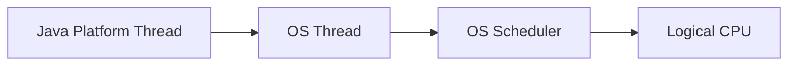

Mối quan hệ gần như:

```text
1 Java Platform Thread
        ↓
1 OS Thread
```

OpenJDK mô tả platform thread là một `java.lang.Thread` được implement như một thin wrapper quanh OS thread, và platform thread giữ OS thread đó trong suốt lifetime của mình. ([OpenJDK][1])

Ví dụ bạn tạo:

```text
Java Platform Thread A
Java Platform Thread B
Java Platform Thread C
```

thì mental model:

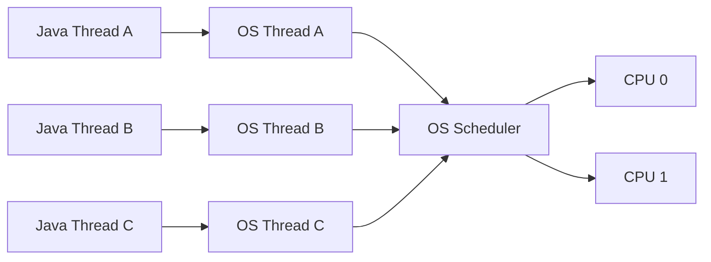

Ở đây JVM không cần một scheduler riêng để multiplex A/B/C.

OS đã biết trực tiếp:

```text
OS Thread A
OS Thread B
OS Thread C
```

và OS scheduler quyết định:

```text
Thread A chạy CPU 0
Thread B chạy CPU 1
Thread C đợi
```

---

# 2. "Java platform thread là wrapper quanh OS thread" nghĩa chính xác là gì?

Đừng hiểu `"wrapper"` là:

```text
Java Thread object
contains
whole OS thread
```

Nó nên được hiểu theo abstraction:

```text
Java Thread object
       ↓ associated with
native / OS thread
```

JVM quản lý Java-side information:

```text
Thread object
name
priority
ThreadLocal
Java stack information
state exposed to Java
...
```

OS quản lý execution entity thực tế:

```text
native thread ID
register context
scheduler state
kernel stack
CPU scheduling
...
```

Có thể hình dung:

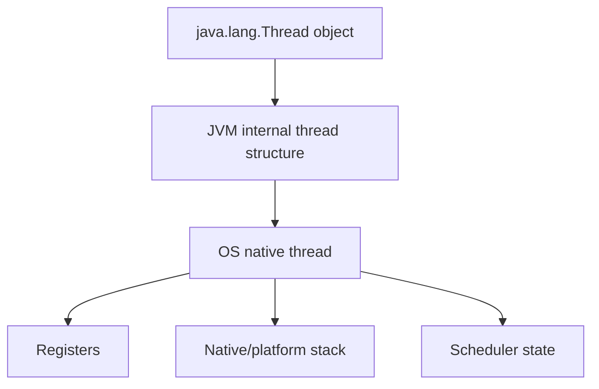

Khi OS thread được chạy, Java platform thread chạy.

Khi OS thread bị preempt, Java platform thread cũng ngừng chạy.

---

# 3. Ví dụ thực tế: 1,000 platform threads

Giả sử Spring server của bạn có:

```text
1,000 requests
```

và mỗi request dùng một platform thread:

```text
Request 1 -> Thread 1 -> OS Thread 1
Request 2 -> Thread 2 -> OS Thread 2
...
Request 1000 -> Thread 1000 -> OS Thread 1000
```

Architecture:

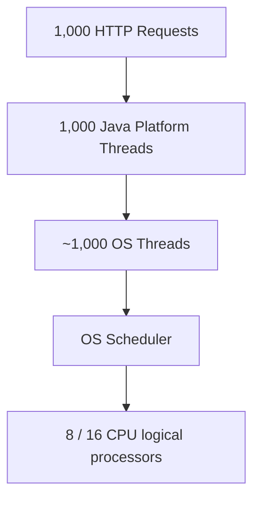

Nếu máy chỉ có:

```text
8 cores
16 logical CPUs
```

thì không phải 1,000 threads thực sự chạy simultaneously.

Phần lớn:

```text
RUNNABLE but waiting CPU
BLOCKED
WAITING
TIMED_WAITING
```

OS phải quản lý hàng nghìn threads.

---

# 4. Vấn đề lớn nhất: blocking

Giả sử một request thread chạy:

```java
User user = repository.findById(id);
```

DB mất 200 ms để trả lời.

Với platform thread:

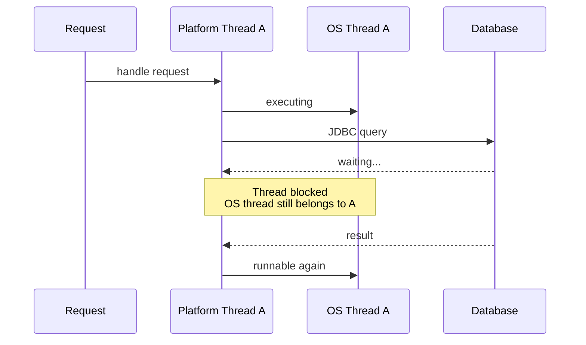

Điểm quan trọng:

```text
Java Platform Thread A
        ↕
OS Thread A
```

mối quan hệ tồn tại suốt lifetime.

Khi A đợi DB:

```text
A không dùng CPU
```

nhưng OS Thread A vẫn là OS resource gắn với A.

Nó không được JVM lấy ra để chạy một Java platform thread B khác.

Đây là câu OpenJDK gọi là platform thread **captures** OS thread for its entire lifetime. ([OpenJDK][1])

---

# 5. Thread pool giải quyết được gì?

Vì OS threads expensive nên Java applications thường không:

```java
new Thread(...)
```

cho mọi request.

Thay vào đó:

```java
ExecutorService pool =
    Executors.newFixedThreadPool(200);
```

Ta có:

```text
10,000 requests
       ↓
200 platform threads
       ↓
200 OS threads
```

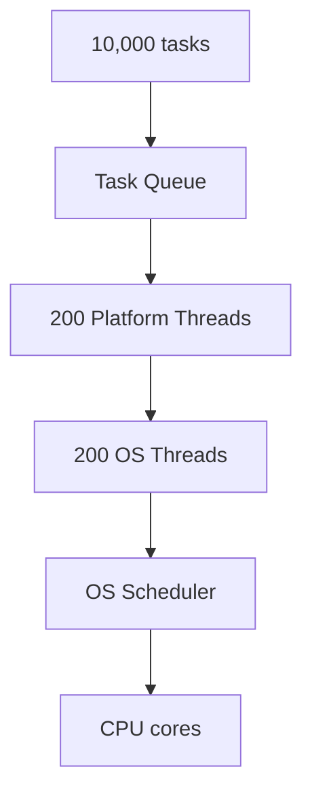

Điều này **bound OS-thread count**.

Nhưng nó tạo vấn đề khác.

Nếu 200 threads đều chờ DB:

```text
Thread 1 -> waiting
Thread 2 -> waiting
...
Thread 200 -> waiting
```

request 201:

```text
cannot start
↓
sits in queue
```

CPU có thể chỉ:

```text
CPU = 15%
```

nhưng throughput bị giới hạn bởi số threads.

Đây chính là một trong những motivation lớn của virtual threads. ([OpenJDK][1])

---

# 6. Virtual Thread thay đổi điều gì?

Bây giờ:

```java
Thread.startVirtualThread(() -> {
    handleRequest();
});
```

Virtual thread vẫn là:

```java
java.lang.Thread
```

nhưng không có permanent 1:1 mapping với OS thread.

Mental model:

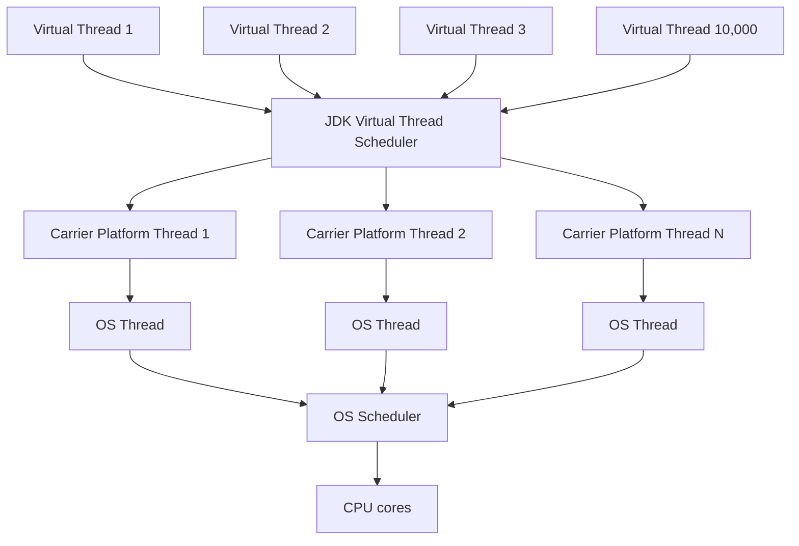

Ở đây có thể có:

```text
100,000 virtual threads

        multiplexed onto

8 carrier platform threads

        backed by

8 OS threads
```

Không nhất thiết chính xác 8, nhưng đây là mental model.

---

# 7. M:N nghĩa là gì?

Giả sử:

```text
M = 10,000 virtual threads
N = 8 carrier / OS threads
```

Ta có:

```text
10,000 : 8
```

hay:

```text
M virtual threads
      ↓
N OS threads
```

Đó là **M:N scheduling**.

JEP 444 mô tả virtual threads theo đúng mô hình này: một lượng lớn virtual threads được JDK schedule lên một lượng nhỏ hơn platform/OS threads. ([OpenJDK][1])

---

# 8. Nhưng virtual thread chạy ở đâu?

Một virtual thread **không tự chạy trực tiếp trên CPU**.

CPU không biết:

```text
VirtualThread
```

CPU chỉ biết OS thread đang chạy.

Chain luôn là:

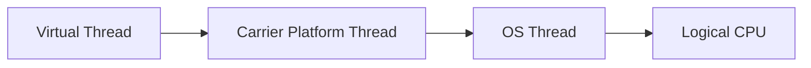

Vì thế để VT1 chạy:

```text
VT1
 ↓ mount
Carrier 1
 ↓
OS Thread 1
 ↓
CPU
```

OpenJDK gọi operation này là:

> **mounting the virtual thread on a carrier**. ([OpenJDK][1])

---

# 9. Mount nghĩa là gì?

Giả sử VT1 đang có execution:

```java
void handle() {
    User u = loadUser();
    process(u);
}
```

JDK muốn chạy VT1.

Nó chọn carrier C1:

```text
VT1
 ↓
C1
```

Ta nói:

```text
VT1 is mounted on C1
```

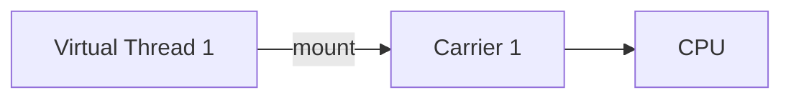

Lúc này:

```text
Thread.currentThread()
```

trong Java code trả về:

```text
VT1
```

chứ không trả về carrier. OpenJDK cố tình giữ virtual-thread identity độc lập với carrier. ([OpenJDK][1])

---

# 10. Sau đó VT1 chạy Java code

Ví dụ:

```java
void handle() {
    validate();
    calculate();
    queryDatabase();
}
```

Khi đang execute CPU work:

```text
VT1
 ↓ mounted on
Carrier C1
 ↓ OS Thread
 ↓ CPU
```

Lúc này carrier đang thực sự bận chạy code VT1.

---

# 11. Và đây là magic quan trọng nhất: blocking I/O

VT1 đến:

```java
socket.read();
```

Data chưa có.

Với platform thread:

```text
Platform Thread
↓
OS thread blocked
```

Với virtual thread, trong nhiều blocking operations được JDK hỗ trợ:

```text
VT1 blocked logically
```

nhưng:

```text
carrier does NOT have to remain blocked
```

JDK có thể **unmount VT1**. ([OpenJDK][1])

Flow:

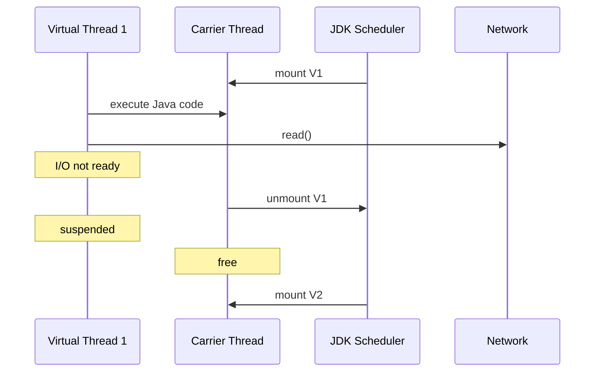

Đây là sự khác biệt cực lớn.

---

# 12. Carrier không ngồi chờ VT1

Giả sử:

```text
VT1 waiting database
VT2 waiting Redis
VT3 runnable
VT4 runnable
```

Carrier C1 ban đầu chạy VT1:

```text
C1 → VT1
```

VT1 block:

```text
VT1 unmount
```

C1 ngay lập tức có thể:

```text
C1 → VT3
```

Sau đó VT3 block:

```text
VT3 unmount
```

C1 chạy:

```text
C1 → VT4
```

Timeline:

```text
Time ------------------------------------------------>

Carrier 1:

| VT1 CPU | VT3 CPU | VT4 CPU | VT2 CPU | VT1 CPU |
          ↑         ↑
       VT1 wait   VT3 wait
```

Trong khi virtual thread lifetime:

```text
VT1:
RUN ───────── WAIT DB ───────────────────── RUN
```

Quan trọng:

```text
waiting virtual thread != occupied OS thread
```

đây chính là scalability win.

---

# 13. Khi DB response của VT1 về thì sao?

Giả sử lúc này VT1 đang suspended.

DB trả data:

```text
DB data ready
```

JDK/runtime biết VT1 có thể tiếp tục.

Nó đưa VT1 trở lại scheduler:

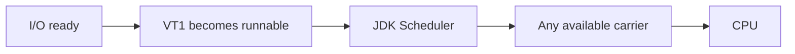

Một nuance cực quan trọng:

VT1 **không nhất thiết quay lại Carrier C1**.

Ví dụ ban đầu:

```text
VT1 → Carrier 1
```

sau khi resume:

```text
VT1 → Carrier 5
```

Hoàn toàn bình thường. OpenJDK nói scheduler không duy trì carrier affinity cho virtual thread. ([OpenJDK][1])

---

# 14. Ví dụ đầy đủ

Request:

```java
void handleRequest() {
    User user = database.getUser();

    Order order = orderService.getOrder();

    return buildResponse(user, order);
}
```

Giả sử request chạy VT100.

### Phase 1 — CPU work

```text
VT100
mount
↓
Carrier 3
↓
CPU 2
```

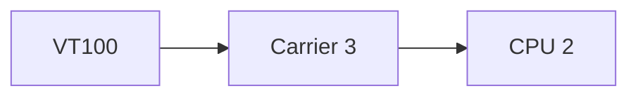

VT100 chạy:

```text
parse request
validate id
```

---

### Phase 2 — DB I/O

```java
database.getUser();
```

DB chưa trả data.

VT100:

```text
RUNNING
↓
WAITING
```

JDK:

```text
unmount VT100
```

Carrier 3:

```text
free
```

---

### Phase 3 — C3 chạy request khác

```text
Carrier 3
 ↓
VT532
```

VT100 vẫn tồn tại:

```text
VT100 WAITING
```

nhưng không chiếm Carrier 3.

---

### Phase 4 — DB result arrives

```text
VT100 becomes runnable
```

Scheduler có thể chọn:

```text
Carrier 6
```

bây giờ:

```text
VT100
↓
Carrier 6
↓
OS Thread 6
↓
CPU 7
```

VT100 tiếp tục **chính xác sau DB call**.

Từ góc nhìn programmer:

```java
User user = database.getUser();

// looks perfectly synchronous
process(user);
```

Bạn không viết callback.

Không viết:

```java
future.thenApply(...)
```

Không cần manually reschedule.

Đây là lợi ích rất lớn của Loom.

---

# 15. Tại sao stack vẫn tiếp tục đúng?

Bạn có thể hỏi:

> Nếu VT100 rời carrier C3 rồi sang C6, stack của nó nằm ở đâu?

Đây là điểm rất hay.

Platform thread stack có strong relationship với native OS thread stack.

Virtual-thread stack được JVM quản lý theo cách cho phép nó được:

```text
suspend
store
resume
```

không phụ thuộc permanent OS stack.

Mental model:

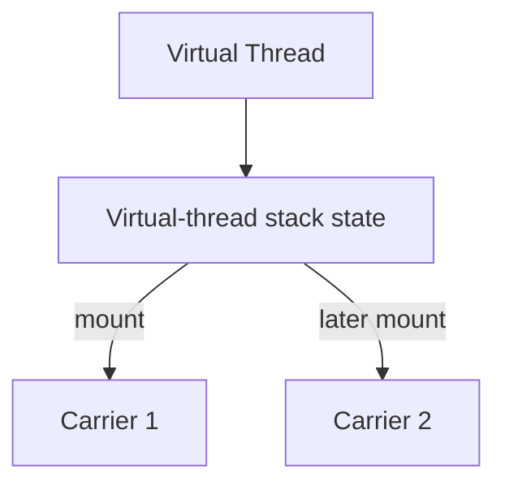

JVM có thể lưu continuation/stack state của virtual thread trong heap-managed structures.

Bạn nên hiểu high level:

```text
Virtual thread execution state
is not permanently tied to carrier native stack.
```

Do đó VT có thể migrate giữa carriers.

---

# 16. Hai schedulers hoạt động liên tiếp

Đây là điểm quan trọng nhất.

## Scheduler #1 — JDK Virtual Thread Scheduler

Nó quyết định:

```text
Which virtual thread
        ↓
runs on which carrier
```

Ví dụ:

```text
VT10 → Carrier 2
```

JEP 444 mô tả scheduler này là một `ForkJoinPool` riêng theo work-stealing strategy, với parallelism mặc định dựa trên số processors available. ([OpenJDK][1])

---

## Scheduler #2 — OS Scheduler

OS không biết:

```text
VT10
```

OS chỉ thấy:

```text
Carrier 2 / OS Thread 2
```

OS quyết định:

```text
OS Thread 2
      ↓
CPU Core 4
```

---

Toàn bộ chain:

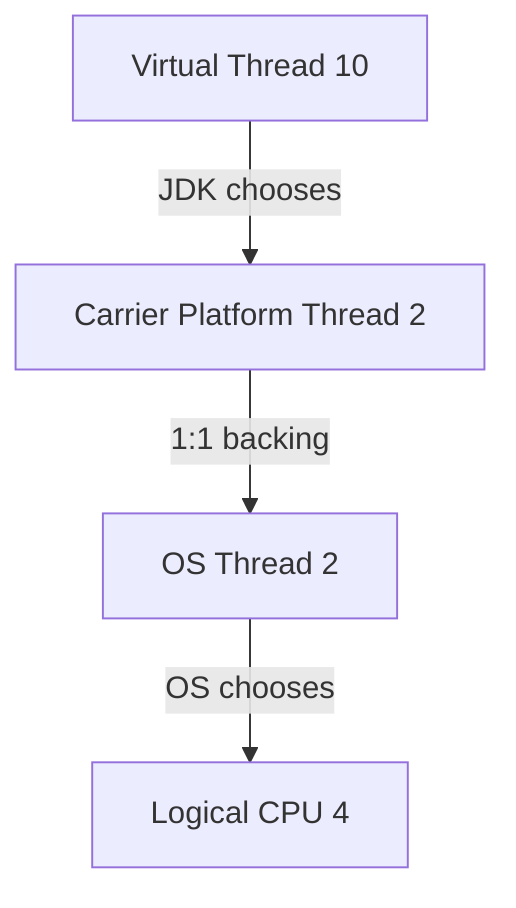

Có hai scheduling decisions:

```text
JDK scheduler:
VT → Carrier

OS scheduler:
Carrier/OS thread → CPU
```

---

# 17. So sánh side-by-side

## Platform Thread

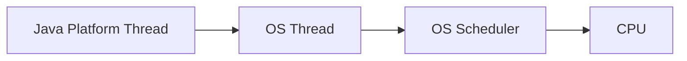

```text
Java thread lifetime
====================

OS thread lifetime
====================
```

Thread Java giữ OS thread suốt lifetime.

---

## Virtual Thread


Timeline:

```text
VT1:

RUN(C1)
   ↓
WAIT DB
   ↓
RUN(C5)
   ↓
WAIT Redis
   ↓
RUN(C2)
```

Một virtual thread có thể chạy qua nhiều carrier khác nhau.

---

# 18. Vậy tại sao virtual threads "lightweight"?

Không phải vì:

> virtual thread không có stack.

Nó có logical stack.

Không phải vì:

> virtual thread không phải thread.

Nó là `java.lang.Thread`.

Lightweight ở đây chủ yếu vì nó không yêu cầu:

```text
1 virtual thread
=
1 OS thread
```

suốt lifetime.

Platform:

```text
100,000 Platform Threads
≈
100,000 OS Threads
```

rất khó/scary.

Virtual:

```text
100,000 Virtual Threads
         ↓
small carrier pool
         ↓
small number OS threads
```

Do đó virtual threads có thể plentiful hơn nhiều. ([OpenJDK][1])

---

# 19. Nhưng 100k virtual threads có chạy parallel không?

Không.

Đây là distinction:

```text
Concurrency != Parallelism
```

Giả sử:

```text
100,000 VT
8 CPU cores
```

Có thể có:

```text
100,000 concurrent tasks
```

nhưng roughly chỉ số tasks phù hợp với available CPU execution slots mới chạy CPU cùng lúc.

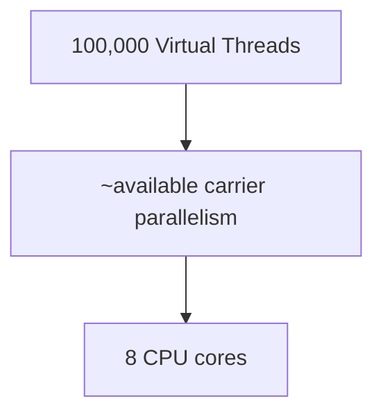

Virtual threads tăng:

```text
concurrency
```

không tăng:

```text
physical CPU parallelism
```

---

# 20. Vì vậy virtual threads không làm CPU-bound faster

Ví dụ:

```java
for (long i = 0; i < 10_000_000_000L; i++) {
    calculate();
}
```

Tạo:

```text
10 platform threads
```

vs

```text
10,000 virtual threads
```

không tự làm CPU mạnh hơn.

JEP 444 nhấn mạnh virtual threads nhằm cung cấp **scale/throughput**, không phải làm code chạy nhanh hơn; CPU-bound workload không hưởng lợi từ việc tăng thread vượt processor capacity. ([OpenJDK][1])

Virtual threads shine ở:

```text
I/O-bound workloads
```

như:

```text
HTTP call
Database call
Redis call
Kafka wait
socket read
sleep
queue take
```

---

# 21. Ví dụ backend cực điển hình

Giả sử mỗi request:

```text
CPU work = 10 ms
DB waiting = 200 ms
Redis waiting = 50 ms
HTTP service waiting = 300 ms
```

Tổng lifetime:

```text
~560 ms
```

nhưng actual CPU:

```text
10 ms
```

Với platform thread:

```text
thread occupied for ~560 ms
```

dù CPU chỉ cần nó 10 ms.

Với virtual thread:

```text
carrier used during CPU execution
```

khi waiting:

```text
VT suspended
carrier reused
```

Đó là lý do server workloads rất phù hợp.

---

# 22. "Virtual threads should not be pooled" nghĩa là gì?

Platform threads expensive nên:

```java
Executors.newFixedThreadPool(100);
```

Pooling hợp lý.

Virtual threads cheap nên pattern intended là:

```java
try (var executor =
        Executors.newVirtualThreadPerTaskExecutor()) {

    executor.submit(task1);
    executor.submit(task2);
    executor.submit(task3);
}
```

Mental model:

```text
one task
↓
one virtual thread
```

chứ không phải:

```text
100 virtual threads
↓
reuse for 1,000,000 tasks
```

JEP 444 khuyến nghị không pool virtual threads chỉ để hạn chế thread count; nếu cần giới hạn access đến scarce resource như 20 DB connections, hãy giới hạn resource concurrency bằng semaphore/pool tương ứng. ([OpenJDK][1])

---

# 23. Nhưng virtual thread có thể "pin" carrier không?

Có. Đây là một nuance quan trọng.

Bình thường:

```text
VT blocks
↓
unmount
↓
carrier reused
```

Nhưng có trường hợp virtual thread không thể unmount.

Ta gọi:

```text
pinned
```

Theo current Oracle documentation, một case quan trọng là khi virtual thread chạy native/foreign function; pinning có thể làm carrier bị giữ trong blocking period và giảm scalability. ([Oracle Docs][2])

Mental model:

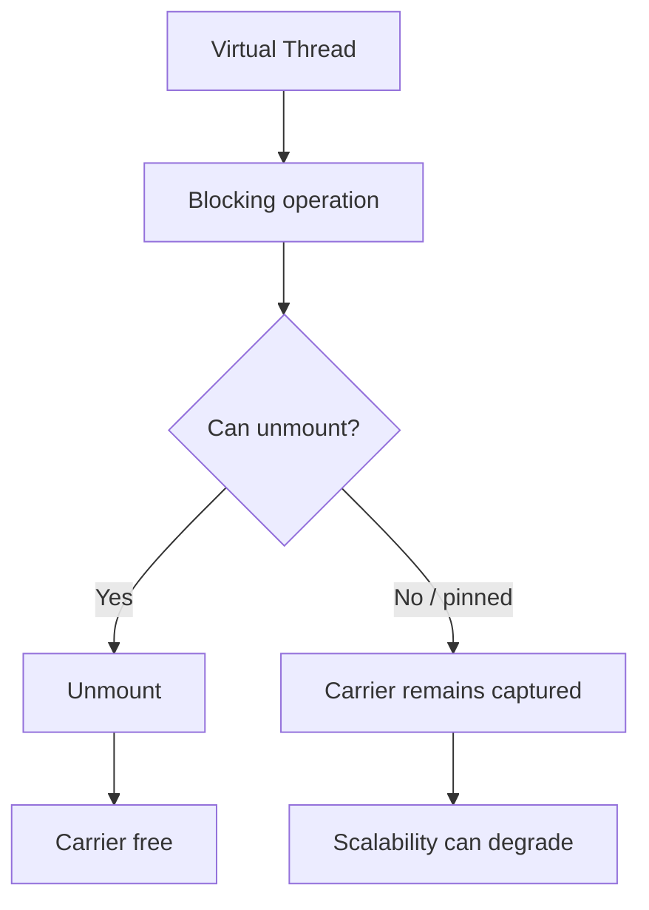

Lưu ý version nuance: JEP 491 đã cải thiện tình trạng pinning quanh `synchronized` trong JDK mới hơn, vì vậy không nên học thuộc statement cũ kiểu "`synchronized` luôn pin virtual thread" cho mọi Java version hiện đại.

---

# 24. Carrier có phải Thread mà application code thấy không?

Không.

Giả sử:

```text
VT42 mounted on Carrier 7
```

Code:

```java
System.out.println(Thread.currentThread());
```

logical identity vẫn là:

```text
VT42
```

không phải:

```text
Carrier 7
```

OpenJDK còn tách:

* stack trace của carrier;
* stack trace của virtual thread;
* ThreadLocal carrier;
* ThreadLocal virtual thread.

([OpenJDK][1])

Tức là carrier gần giống:

```text
execution vehicle
```

hơn là application-level thread.

---

# 25. Kết nối lại với phần CPU bạn vừa hỏi

Đây chính là full hierarchy:

### Platform thread

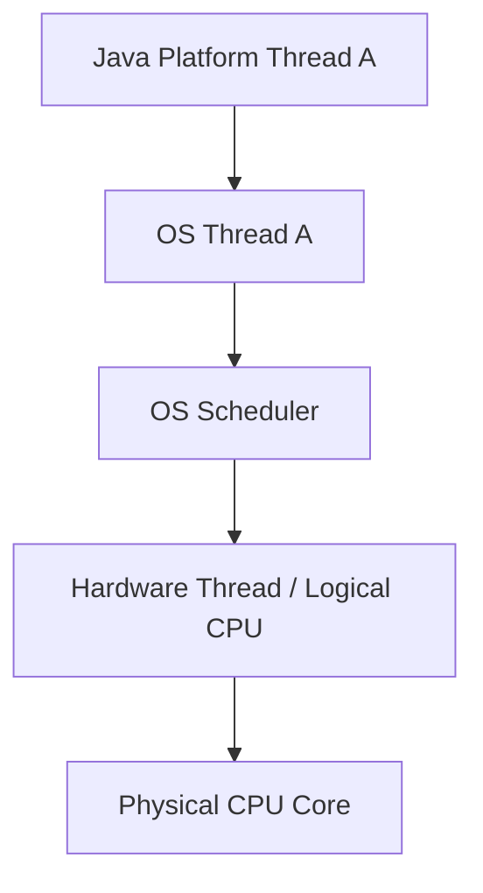

Khi context switch:

```text
OS handles A ↔ B
```

---

### Virtual thread

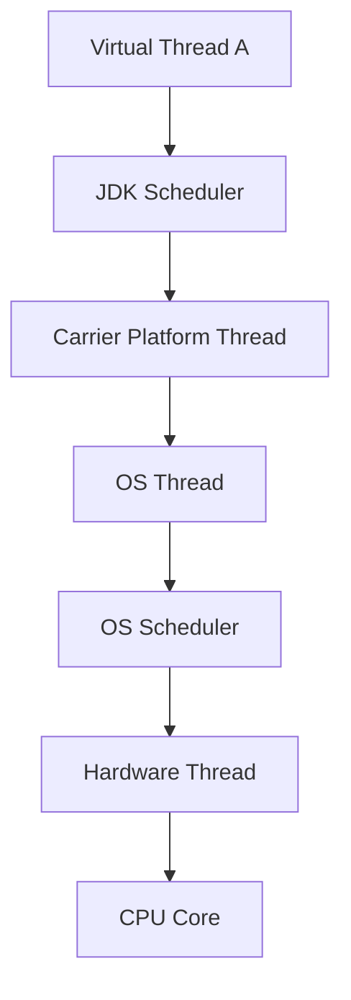

Ở đây có hai loại switching hoàn toàn khác nhau.

### Virtual thread scheduling

```text
VT1 unmount
VT2 mount
```

do JDK runtime quản lý.

Nó không nhất thiết là OS context switch.

### OS context switch

```text
OS Thread A
→
OS Thread B
```

do kernel scheduler quản lý.

Đây là distinction cực kỳ quan trọng.

---

# 26. Một ví dụ cuối để thấy cả hai scheduler

Giả sử:

```text
VT1
VT2
VT3
VT4

Carrier C1
Carrier C2
```

JDK:

```text
VT1 → C1
VT2 → C2
```

OS:

```text
C1 → CPU0
C2 → CPU1
```

Sau 5 ms:

```text
VT1 calls DB
```

JDK:

```text
VT1 unmount C1
VT3 mount C1
```

Không nhất thiết OS phải đổi OS Thread:

```text
C1 vẫn chính là C1
```

nhưng code chạy trên C1 chuyển:

```text
VT1 code
→
VT3 code
```

Trong khi CPU có thể vẫn đang execute same carrier native thread.

Sau đó OS scheduler có thể:

```text
C1 → preempt
C5 → CPU0
```

Đó mới là OS-level context switch.

Diagram:

```mermaid
sequenceDiagram
    participant V1 as VT1
    participant V3 as VT3
    participant C1 as Carrier C1
    participant J as JDK Scheduler
    participant OS as OS Scheduler
    participant CPU as CPU0

    J->>C1: mount VT1
    OS->>CPU: schedule C1
    C1->>CPU: execute VT1 code

    V1->>J: blocking I/O
    J->>C1: unmount VT1
    J->>C1: mount VT3
    C1->>CPU: execute VT3 code

    OS->>CPU: preempt C1
    Note over CPU: OS may now run another OS thread
```

Đây chính là lý do mình muốn bạn nhớ:

```text
Virtual thread switching
≠
OS thread context switching
```

---

# 27. Mental model chuẩn để mang vào interview

Hãy nhớ 4 tầng:

```mermaid
flowchart TB
    L1["Layer 1<br/>Java Task / Virtual Thread"]
    L2["Layer 2<br/>Carrier Platform Thread"]
    L3["Layer 3<br/>OS Thread"]
    L4["Layer 4<br/>Logical CPU / Core"]

    L1 -->|"JDK schedules"| L2
    L2 -->|"roughly 1:1"| L3
    L3 -->|"OS schedules"| L4
```

Với platform thread:

```text
Layer 1 và Layer 2 gần như là cùng Java-thread abstraction
```

nên:

```text
Platform Thread
→ OS Thread
→ CPU
```

Với virtual thread:

```text
Virtual Thread
→ JDK Scheduler
→ Carrier
→ OS Thread
→ CPU
```

---

## Câu trả lời interview khoảng 1 phút

> A traditional Java platform thread is implemented as a thin wrapper around an OS thread, so it has roughly a one-to-one relationship with that OS thread for its lifetime. The operating-system scheduler is responsible for scheduling that thread onto a CPU.
>
> A virtual thread is different because it is scheduled by the Java runtime. The JDK mounts many virtual threads onto a much smaller set of platform threads called carriers. Those carrier threads are still normal OS-backed threads and are scheduled by the operating system. When a virtual thread blocks on a supported I/O operation, the JDK can suspend and unmount it, freeing the carrier to execute another virtual thread. This is M:N scheduling and allows Java applications to support very large numbers of concurrent mostly-blocking tasks without requiring the same number of OS threads. ([OpenJDK][1])

Công thức bạn nên nhớ:

```text
Platform Thread:
1 Java thread ≈ 1 OS thread

Virtual Thread:
M virtual threads
       ↓ JDK scheduler
N carrier/platform threads
       ↓ OS scheduler
N OS threads
       ↓
CPU cores
```

Và quan trọng nhất:

> **Virtual threads không tạo thêm CPU. Chúng giúp bạn dùng một số ít OS threads hiệu quả hơn trong workload có rất nhiều thời gian chờ I/O.**

[1]: https://openjdk.org/jeps/444?utm_source=chatgpt.com "JEP 444: Virtual Threads"
[2]: https://docs.oracle.com/en/java/javase/26/core/virtual-threads.html?utm_source=chatgpt.com "Virtual Threads"
