Chỗ này nên hiểu theo một mental model rất cụ thể: CPU không “chạy Java thread” theo cách JVM gọi tên nó. CPU chỉ đang giữ một bộ trạng thái thực thi hiện tại, rồi thực thi instruction tiếp theo dựa trên trạng thái đó. Khi OS chuyển từ Thread A sang Thread B, điều thực sự xảy ra là bộ trạng thái của CPU được thay từ “state của A” sang “state của B”.

Giả sử Thread A đang chạy đoạn:

```java
int c = a + b;
c++;
```

Sau khi compile, CPU chỉ thấy một chuỗi machine instructions đại loại như:

```text
LOAD  R1, [a]
LOAD  R2, [b]
ADD   R3, R1, R2
STORE [c], R3
ADD   R3, R3, 1
STORE [c], R3
```

Đó chính là một instruction stream:

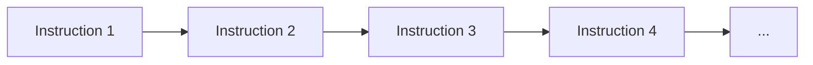

Muốn tiếp tục đúng chỗ, CPU cần biết ít nhất hai thứ: đang đứng ở instruction nào và các giá trị trung gian hiện nằm trong registers ra sao. Vì vậy execution state của một thread thường gắn với những thành phần như instruction pointer/program counter, general-purpose registers, stack pointer, flags và các phần state kiến trúc khác.

Ví dụ CPU đang chạy Thread A với trạng thái:

```text
RAX = 10
RBX = 20
RSP = 0x7000
RIP = 0x401000
```

Ở đây `RIP` là instruction pointer trên x86-64. Nó nói với CPU rằng instruction tiếp theo nằm ở địa chỉ `0x401000`. `RSP` trỏ vào stack hiện tại của Thread A. `RAX`, `RBX` có thể đang giữ các giá trị trung gian mà A còn cần.

Nếu scheduler muốn chuyển sang Thread B, nó không thể đơn giản “bắt đầu chạy B” mà bỏ mặc đống register hiện tại. Những register đó đang chứa state của A. Nếu ghi đè chúng luôn thì khi quay lại A sau này, A sẽ không thể tiếp tục đúng chỗ.

Hãy hình dung A đang có:

```text
Thread A

RAX = 10
RBX = 20
RCX = 30
RSP = 0x7000
RIP = 0x401000
```

Còn B lần trước bị dừng ở:

```text
Thread B

RAX = 100
RBX = 200
RCX = 999
RSP = 0x9000
RIP = 0x501000
```

Khi chuyển A → B, kernel phải lưu đủ context của A, rồi restore context của B. Sau đó CPU trở thành:

```text
RAX = 100
RBX = 200
RCX = 999
RSP = 0x9000
RIP = 0x501000
```

Và từ đó CPU tiếp tục instruction của B tại `0x501000`.

Toàn bộ flow có thể nhìn như này:

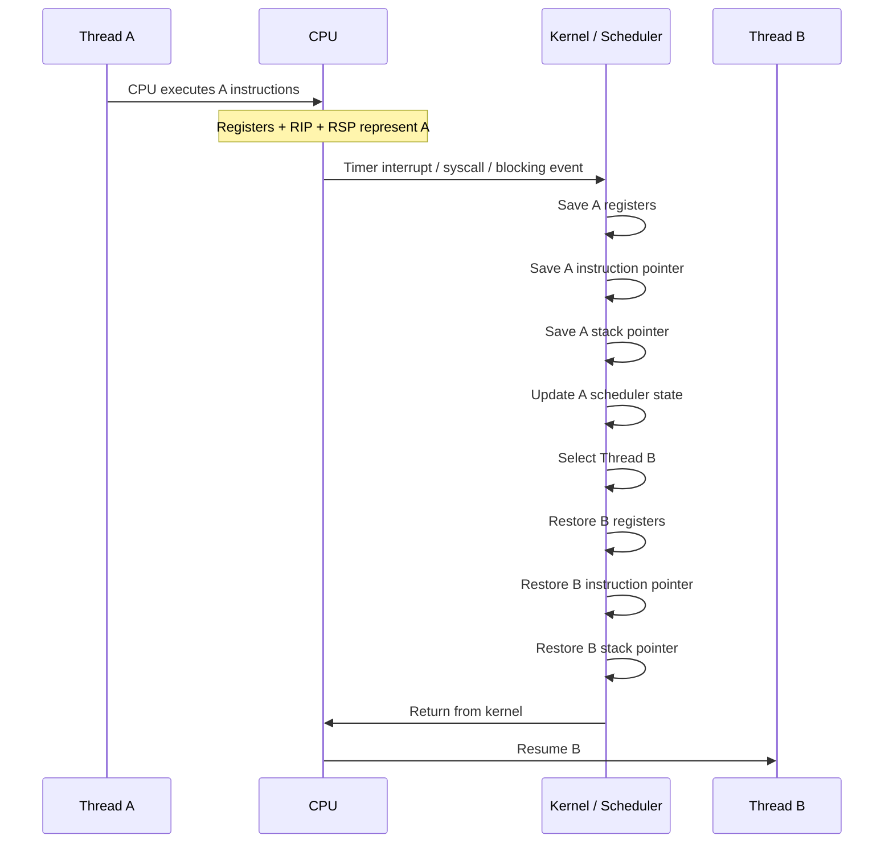

Điểm quan trọng nhất là: CPU không hề có hai bộ `RAX`, một cho A và một cho B, theo mental model cơ bản. Logical CPU tại một thời điểm chỉ có một bộ architectural state đang active. Thread nào được chạy thì state của thread đó phải được nạp vào CPU.

Instruction pointer là phần rất quan trọng. Giả sử A đang chạy:

```java
void calculate() {
    int a = 10;
    int b = 20;
    int c = a + b;

    doSomething();

    c++;
}
```

Nếu A bị preempt ngay trước `doSomething()`, OS cần nhớ chính xác vị trí hiện tại. Khi A được schedule lại, CPU phải quay lại đúng instruction đó chứ không chạy lại từ đầu method hay nhảy sang chỗ khác. Đó là lý do instruction pointer phải được save/restore.

Registers cũng tương tự. Ví dụ một phép tính đang dở:

```text
RAX = 10
RBX = 20

ADD RAX, RBX
```

sau đó:

```text
RAX = 30
```

Nếu context switch xảy ra ngay lúc đó, `RAX = 30` có thể là state A cần dùng ở instruction tiếp theo. Vì B cũng cần sử dụng `RAX`, kernel phải lưu giá trị của A trước khi load giá trị `RAX` thuộc B.

Stack pointer còn quan trọng hơn vì mỗi thread có stack riêng. Ví dụ:

```text
Thread A stack
0x7000 ...

Thread B stack
0x9000 ...
```

Khi A chạy:

```text
RSP = 0x7000
```

Khi chuyển sang B:

```text
RSP = 0x9000
```

Nếu không đổi stack pointer thì B sẽ vô tình dùng stack của A. Return address, local execution state, method-call frames đều có thể bị phá.

Có thể hình dung như sau:

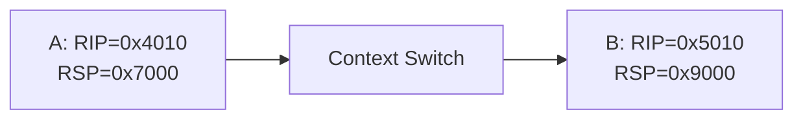

Vì thế khi nói “mỗi thread có stack riêng”, đây không chỉ là khái niệm ở Java. Ở execution level, CPU phải có stack pointer phù hợp với thread hiện tại.

Một ví dụ rõ hơn:

```text
Thread A
foo()
  bar()

Thread B
hello()
  world()
```

Stacks:

```text
Thread A Stack

+-------------+
| bar frame   |
+-------------+
| foo frame   |
+-------------+


Thread B Stack

+-------------+
| world frame |
+-------------+
| hello frame |
+-------------+
```

Khi A chạy:

```text
RSP -> A stack
RIP -> code inside bar()
```

Khi B chạy:

```text
RSP -> B stack
RIP -> code inside world()
```

Vậy câu “Registers và instruction pointer phải phản ánh thread mới” thực chất nghĩa là:

```text
CPU current state
=
state of whichever thread is currently scheduled
```

Còn câu hỏi tiếp theo là: vì sao kernel có cơ hội chạy scheduler?

Một trường hợp là timer interrupt. Nếu A cứ chạy mãi mà không tự nguyện dừng, OS cần một cơ chế giành lại CPU. Hardware timer phát interrupt định kỳ:

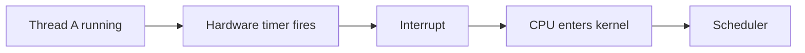

Scheduler có thể quyết định A đã chạy đủ time slice và B nên được chạy. Đây là preemption.

Trường hợp khác là A tự block, ví dụ:

```java
socket.read();
```

Nếu network data chưa tới, A không có việc hữu ích để làm. Flow conceptual:

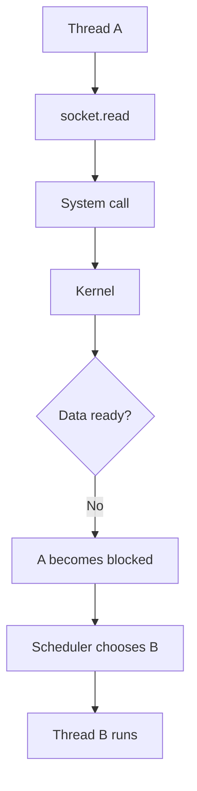

Ở đây A chủ động đi vào trạng thái không runnable cho tới khi I/O hoàn tất, nên CPU được dùng cho thread khác.

Một case nữa là A chờ lock:

```java
synchronized (lock) {
    ...
}
```

Nếu lock đang bị thread khác giữ:

```text
A tries lock
↓
lock unavailable
↓
A waits / parks
↓
scheduler runs another runnable thread
```

Phần “save context” cũng không nên hiểu là CPU cất hết mọi thứ trong một kho riêng bên trong processor. Kernel duy trì dữ liệu per-thread/task để có thể resume thread sau này. Có thể hình dung:

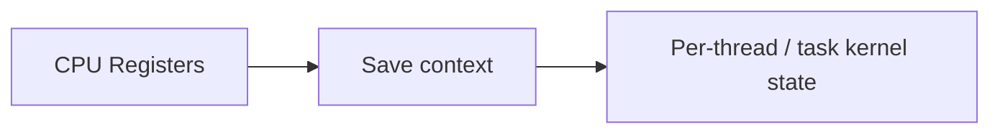

Mental model:

```text
Thread A state

saved_RAX = ...
saved_RBX = ...
saved_RSP = ...
saved_RIP = ...
scheduler_state = ...
priority = ...
```

Tên cấu trúc thực tế tùy OS. Trên Linux có `task_struct` và các cấu trúc architecture-specific khác, nên trong interview an toàn hơn khi nói:

> Kernel stores enough per-thread execution context in kernel-managed thread/task state so that the thread can later resume.

Có thêm một layer nữa: address space.

Nếu switch:

```text
Thread A1
→
Thread A2
```

và cả hai cùng thuộc Process A:

```text
Process A
 ├── Thread A1
 └── Thread A2
```

thì hai thread dùng cùng virtual address space. Vì vậy memory-translation context về mặt logical vẫn thuộc cùng process.

Nhưng nếu chuyển:

```text
Thread A of Process A
→
Thread B of Process B
```

thì address-space context cũng thay đổi.

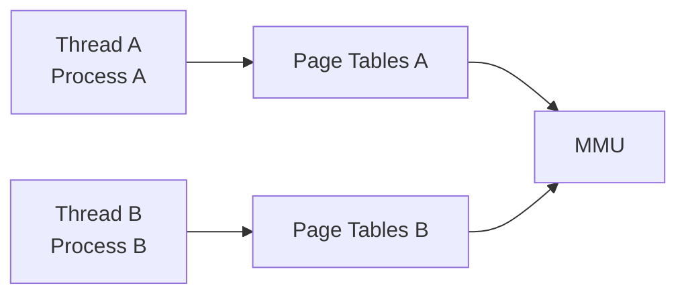

Điều này liên quan trực tiếp tới TLB.

TLB cache các mapping dạng:

```text
Virtual Page -> Physical Frame
```

Ví dụ Process A:

```text
VA page 0x100 -> frame 42
```

Process B có thể có:

```text
VA page 0x100 -> frame 900
```

Nên khi đổi process, CPU phải phân biệt translation thuộc address space nào. Modern CPUs dùng cơ chế tagging như ASID hoặc PCID để tránh phải flush toàn bộ TLB trong mọi context switch.

Vì thế câu:

> Context switch always flushes the TLB.

là quá đơn giản.

Cách nói tốt hơn:

> A cross-address-space switch can disturb TLB locality or require some translation invalidation, but modern CPUs can tag translations with address-space identifiers so a full flush is not always necessary.

CPU cache cũng chịu ảnh hưởng, nhưng không theo kiểu “scheduler chạy lệnh clear cache”.

Giả sử A đang xử lý:

```text
User
Order
Payment
```

L1/L2 cache đang hot với working set đó.

Sau khi switch sang B, B xử lý:

```text
Kafka buffer
Deserializer
Consumer state
```

B sẽ đưa data/code của mình vào cache và dần đẩy các cache lines của A ra ngoài.

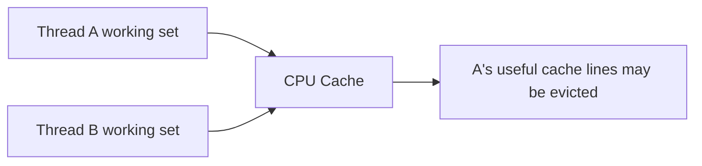

Khi quay lại A, dữ liệu A cần có thể không còn ở cache gần nhất nữa, dẫn đến cache miss. Đây là indirect cost của context switching.

Một nuance nữa là hardware thread. Câu “CPU core chỉ thực thi một instruction stream tại một thời điểm” nên chỉnh cho chính xác hơn khi có SMT.

Một physical core có thể expose nhiều hardware threads/logical CPUs. Ví dụ:

```text
Physical Core 0
   ├── Hardware Thread 0
   └── Hardware Thread 1
```

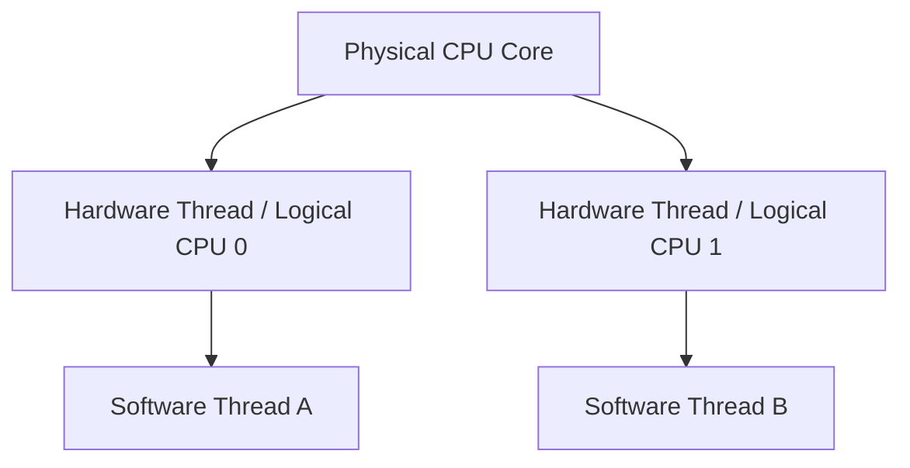

Hai hardware threads có architectural state riêng, nhưng cùng chia sẻ một số execution resources của physical core.

Cách nói chuẩn hơn là:

> Mỗi logical CPU/hardware thread duy trì một architectural execution context tại một thời điểm. Một physical core có thể có nhiều hardware threads nếu CPU hỗ trợ SMT.

Điều này giúp phân biệt ba tầng rất dễ nhầm:

| Layer           | Meaning                           |
| --------------- | --------------------------------- |
| Java Thread     | JVM-level thread abstraction      |
| OS Thread       | Entity được OS scheduler schedule |
| Hardware Thread | Logical CPU execution context     |
| CPU Core        | Physical execution resources      |

Với Java platform thread:

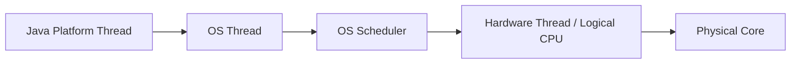

Nếu một máy có:

```text
8 physical cores
16 logical CPUs
```

và Java process có:

```text
100 platform threads
```

thì không có nghĩa 100 thread chạy thật sự cùng lúc. Chỉ số lượng phù hợp với logical CPUs mới có thể thực thi đồng thời; số còn lại có thể đang runnable nhưng chờ CPU, hoặc đang blocked/waiting.

Với một logical CPU và ba software threads:

```text
Time ------------------------------------------------------>

CPU:
|--- A ---|--- B ---|------ A ------|-- C --|---- B ----|
```

Đây là concurrency bằng interleaving, không phải parallelism thực sự.

Nếu có nhiều logical CPUs:

```text
CPU 0: A
CPU 1: B
CPU 2: C
CPU 3: D
```

thì mới có actual parallel execution ở cùng thời điểm.

Một cách nhìn rất hữu ích là đừng tưởng tượng “Thread B được nhét vào CPU”. Thực tế gần hơn là:


Scheduler chọn thread nào thì kernel restore saved execution state của thread đó vào logical CPU.

Có thể gói toàn bộ phần này thành diagram:

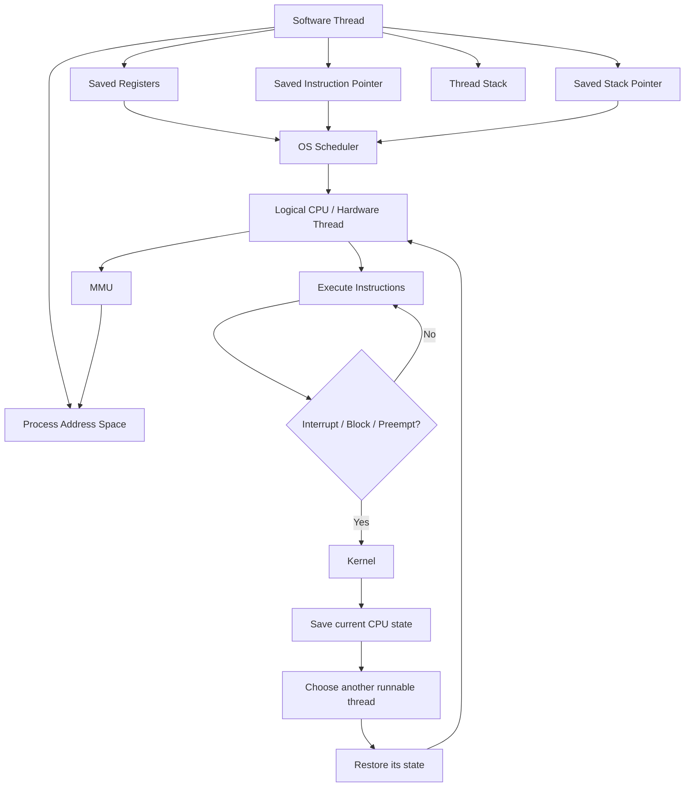

Nếu interviewer hỏi:

> What exactly happens when the OS switches from Thread A to Thread B?

Bạn có thể trả lời:

> The CPU is executing with architectural state that currently belongs to Thread A, including its instruction pointer, stack pointer, and registers. When an interrupt, blocking operation, or preemption transfers control to the kernel, the OS saves enough of A’s execution context so it can resume later. The scheduler then chooses Thread B, restores B’s saved execution state, and returns to execution. At that point, the CPU continues B from the instruction where B previously stopped.

Nếu hỏi tiếp:

> Why can that be expensive?

thì nói:

> There is direct cost from entering the kernel, scheduling, and saving/restoring state. There is also indirect cost because the incoming thread may have a different cache and TLB working set, so locality can degrade. Cross-process switches may additionally change the virtual-address-space context.

Mental model ngắn nhất nên nhớ là:

```text
Thread
=
execution position
+
register state
+
stack
+
scheduler state
+
associated address space
```

và:

```text
Context switch
=
save current state
+
choose next runnable thread
+
restore next state
+
resume execution
```

Cốt lõi của toàn bộ phần này là: logical CPU tại một thời điểm chỉ có một architectural state đang active. OS tạo ra cảm giác “nhiều threads cùng tiến triển” bằng cách liên tục lưu state của thread hiện tại và khôi phục state của thread tiếp theo.
