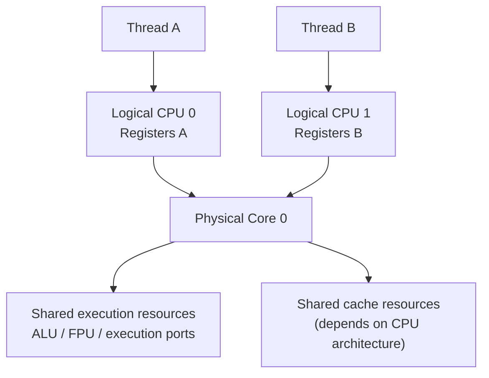
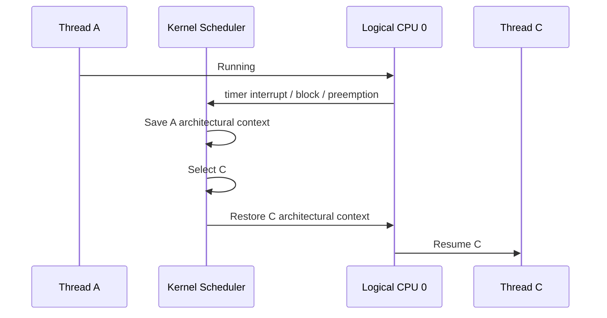
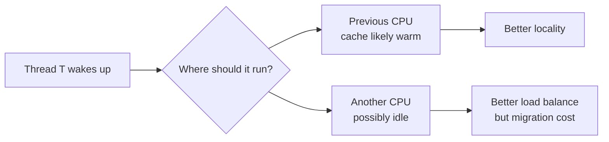
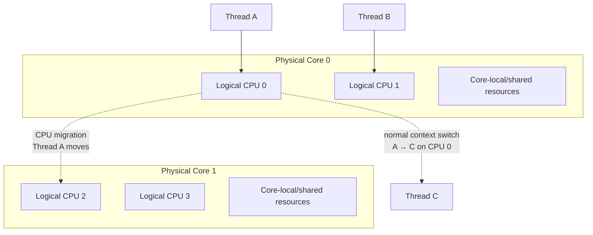

Bạn đang suy luận **gần đúng ở phần “migration sang core khác thường đắt hơn”**, nhưng có một chỗ rất quan trọng cần sửa:

> **SMT không switch context giữa 2 logical CPU.**
> Hai logical CPU trên cùng một physical core có **hardware context riêng và có thể active đồng thời**.

Intel mô tả rõ rằng mỗi logical processor có architectural state riêng, gồm general-purpose registers, control registers..., trong khi chúng chia sẻ một phần execution resources của physical core. ([Intel][1])

Vì vậy để hiểu chi phí, ta phải phân biệt **context switch** và **CPU migration**.

---

## 1. Trước hết sửa mental model về SMT

Giả sử:

```text
Physical Core 0
├── Logical CPU 0
└── Logical CPU 1
```

Có:

```text
Thread A → Logical CPU 0
Thread B → Logical CPU 1
```

Không phải:

```text
A chạy
↓
save A
↓
B chạy
↓
save B
↓
A chạy
```

Đó là time slicing, **không phải SMT**.

SMT gần với:

```text
Logical CPU 0            Logical CPU 1
Thread A                 Thread B
   │                        │
   │ architectural state A  │ architectural state B
   │                        │
   └─────────┬──────────────┘
             ↓
       Physical Core
             ↓
      shared resources
```

Hai hardware contexts cùng tồn tại.



CPU có thể lấy instruction từ cả A và B để feed pipeline/execution units. Intel xác nhận hai logical processors trên một HT core chia sẻ execution engine/cache resources, trong khi mỗi logical processor giữ architectural state riêng. ([Intel][2])

Cho nên:

```text
A ↔ B trên hai SMT siblings
```

không phải là một OS context switch.

---

# 2. Context switch thực sự xảy ra ở đâu?

Giả sử **Logical CPU 0** hiện chạy:

```text
Thread A
```

Scheduler quyết định:

```text
Thread A → Thread C
```

trên chính Logical CPU 0.

Lúc đó mới là context switch:



Đây là:

```text
Thread A
   ↓
save state
   ↓
Thread C
   ↓
restore state
```

Và nó có thể xảy ra độc lập trên cả hai SMT logical CPUs.

Ví dụ:

```text
Physical Core 0

Logical CPU 0:
A → context switch → C

Logical CPU 1:
B vẫn đang chạy
```

---

# 3. Vậy câu hỏi thực sự của bạn nên là

Thay vì hỏi:

> Context switch giữa hai threads trên cùng core và giữa hai cores khác nhau cái nào đắt hơn?

Nên chia thành:

| Case | Chuyện gì xảy ra?                                | Chi phí                                          |
| ---- | ------------------------------------------------ | ------------------------------------------------ |
| A    | T1 → T2 trên **cùng logical CPU**                | normal context switch                            |
| B    | T1 và T2 chạy trên **2 SMT siblings**            | không phải context switch giữa chúng             |
| C    | T1 từng chạy trên Core A, giờ chuyển sang Core B | context switch + **CPU migration/locality cost** |

Và **Case C thường có indirect cost lớn hơn Case A**, chủ yếu vì cache/TLB/locality, không phải vì kernel phải “save nhiều registers hơn”.

Đây mới là phần rất thú vị.

---

# 4. Case A — Switch thread nhưng vẫn ở cùng logical CPU

Giả sử:

```text
Core 0
└── Logical CPU 0

T1
↓
context switch
↓
T2
```

Kernel phải làm những việc như:

```text
save T1 state
restore T2 state
switch kernel bookkeeping
possibly switch address-space state
```

Ví dụ conceptual:

```text
T1 registers:

RAX = ...
RBX = ...
RSP = ...
RIP = ...

↓ save

task_struct(T1)

↓ load

task_struct(T2)

RAX = ...
RBX = ...
RSP = ...
RIP = ...

↓ resume
```

Nhưng physical CPU vẫn là:

```text
Core 0
```

nên một phần dữ liệu/cache state liên quan có thể vẫn còn gần đó.

Đặc biệt nếu T1 và T2 là threads của cùng process:

```text
Process P
├── Thread T1
└── Thread T2
```

chúng share:

```text
virtual address space
heap
code
shared data
```

nên switching giữa chúng thường có locality tốt hơn switching giữa unrelated processes.

---

# 5. Case C — Thread migrate từ Core A sang Core B

Đây là cái bạn đang nghĩ tới.

Ban đầu:

```text
Core A
└── Logical CPU 0
      ↓
     T1
```

Sau đó scheduler quyết định:

```text
Core B
└── Logical CPU 4
      ↓
     T1
```

Đây gọi là:

> **task migration / CPU migration**

Linux scheduler thực sự có CPU runqueues riêng và có cơ chế di chuyển runnable tasks giữa CPUs để load balance. Linux cũng xây scheduler domains theo topology như SMT → physical cores → NUMA, thay vì coi mọi logical CPU hoàn toàn giống nhau. ([Kernel.org][3])

---

# 6. Register save/restore không phải vấn đề lớn nhất của migration

Đây là insight quan trọng.

Bạn có thể nghĩ:

```text
same core switch:
save registers
restore registers

different core:
save registers
transfer registers across CPU
restore registers
```

Nhưng mental model đó chưa chính xác.

Không phải CPU A lấy:

```text
RAX
RBX
RCX
...
```

rồi gửi trực tiếp qua một dây sang CPU B.

Thông thường state của task đã được kernel lưu vào memory/kernel structures.

Conceptually:


Vì vậy phần register state không nhất thiết tạo ra khác biệt khổng lồ giữa:

```text
switch trên CPU A
```

và:

```text
resume task trên CPU B
```

Khác biệt lớn thường nằm ở **microarchitectural state / locality**.

---

# 7. Vấn đề lớn: Cache locality

Giả sử T1 đang chạy trên Core A và liên tục dùng:

```text
Object X
Array Y
Stack
instructions của function foo()
```

Sau một thời gian:

```text
Core A

L1 cache:
[X][Y][foo code][stack...]

L2 cache:
[...]
```

Tức là T1 đang **cache-hot** trên Core A.

Linux documentation thậm chí thống kê riêng các trường hợp scheduler cố di chuyển một task đang “cache-hot”, cho thấy cache affinity là một yếu tố scheduler quan tâm. ([Kernel.org][4])

Nếu T1 tiếp tục chạy trên Core A:

```text
T1
↓
load X
↓
L1 hit
```

rất nhanh.

Nhưng migrate:

```text
Core A
    T1
     │
     │ migrate
     ↓
Core B
```

Core B có thể có:

```text
L1:
unrelated data

L2:
unrelated data
```

Bây giờ:

```text
T1 → load X
```

có thể thành:

```text
L1 miss
↓
L2 miss
↓
shared LLC hit
```

hoặc tệ hơn:

```text
LLC miss
↓
RAM
```

Đây chính là một trong những **indirect costs lớn nhất của CPU migration**.

---

# 8. Minh họa trực quan

Trước migration:

```text
Core A
┌──────────────────────────────┐
│ Thread T                     │
│                              │
│ L1: A B C D ← hot            │
│ L2: E F G   ← hot            │
└──────────────────────────────┘


Core B
┌──────────────────────────────┐
│ Other workload               │
│                              │
│ L1: X Y Z                    │
│ L2: P Q R                    │
└──────────────────────────────┘
```

Migration:

```text
              Thread T
Core A ───────────────────────→ Core B
```

Bây giờ Core B cần lại:

```text
A B C D E F G
```

nên có thể phải refill cache.

Đó là lý do scheduler thường thích:

```text
previous CPU
```

nếu nó vẫn là một lựa chọn tốt.

Linux scheduler documentation mô tả topology theo hierarchy và thực hiện balancing theo các scheduling domains; nó cũng có khái niệm task cache-hot khi quyết định migration. ([Kernel.org][3])

---

# 9. Đây chính là CPU affinity / cache affinity

Khái niệm này thường gọi là:

```text
processor affinity
CPU affinity
cache affinity
```

Ý tưởng:

> Nếu một thread vừa chạy trên CPU X, tiếp tục cho nó chạy trên CPU X thường tốt cho cache locality.

Ví dụ:



Scheduler phải trade-off:

```text
cache locality
vs
load balancing
vs
latency
```

Không phải cứ tránh migration bằng mọi giá.

---

# 10. Nhưng còn 2 logical CPUs trên cùng physical core thì sao?

Đây là case thú vị nhất liên quan câu hỏi của bạn.

Giả sử:

```text
Physical Core 0
├── Logical CPU 0
└── Logical CPU 1
```

T1 trước chạy:

```text
Logical CPU 0
```

sau đó được schedule lên:

```text
Logical CPU 1
```

Về mặt OS:

```text
CPU 0 → CPU 1
```

vẫn là migration giữa hai **logical CPUs**.

Linux coi mỗi hardware thread là một scheduling unit/logical Linux CPU. ([Tài liệu Kernel][5])

Tuy nhiên hai logical CPU này cùng physical core nên thường share nhiều resource/cache hơn hai logical CPUs thuộc hai physical cores.

Conceptually:

```text
              Physical Core 0
        ┌────────────────────────────┐
        │                            │
CPU 0   │    Logical CPU 0           │
 T1 ────│                            │
        │       shared cache         │
        │       shared core          │
        │                            │
CPU 1   │    Logical CPU 1           │
        │                            │
        └────────────────────────────┘
```

Do đó locality penalty **có thể nhỏ hơn** migration sang một physical core hoàn toàn khác.

Intel cũng lưu ý rằng threads trên associated logical processors có thể hưởng lợi từ cache reuse khi cache được share, nhưng đồng thời chúng tranh chấp execution resources. ([Intel][2])

Tuy nhiên:

> Di chuyển giữa sibling logical CPUs vẫn **không miễn phí**.

Intel từng lưu ý rõ việc di chuyển thread giữa logical CPUs vẫn có cost ngay cả khi chúng share cache. ([Cộng Đồng Intel][6])

---

# 11. Có một trade-off rất thú vị

Giả sử:

```text
Core 0
├── CPU 0 → Thread A
└── CPU 1 → idle

Core 1
├── CPU 2 → idle
└── CPU 3 → idle
```

Bây giờ Thread B cần chạy.

Có hai lựa chọn.

### Cùng physical core

```text
Core 0
├── CPU 0 → A
└── CPU 1 → B
```

Ưu điểm có thể là locality/cache-sharing.

Nhưng:

```text
A + B
```

phải share:

```text
execution units
cache bandwidth
load/store resources
...
```

### Khác physical core

```text
Core 0
└── A

Core 1
└── B
```

Mặc dù B có thể mất một chút locality tùy lịch sử chạy, nhưng:

```text
A
```

có cả Core 0,

và:

```text
B
```

có cả Core 1.

Đối với CPU-intensive threads, đây thường là lựa chọn tốt hơn.

Một tài liệu Linux scheduler cũ nhưng minh họa rất đúng nguyên lý: với hai runnable tasks và SMT, scheduler nên đặt chúng lên **hai physical cores khác nhau** trước thay vì hai virtual siblings của cùng core, để tránh contention. ([Kernel.org][7])

---

# 12. Vì vậy đừng nghĩ SMT là “context switch optimization”

Đây là chỗ mình muốn bạn sửa mental model mạnh nhất.

Sai:

```text
Physical Core
    ↓
SMT
    ↓
switch rất nhanh:
Thread A ↔ Thread B
```

Đúng:

```text
              Physical Core
         ┌──────────┴──────────┐
         ↓                     ↓
 Logical CPU 0           Logical CPU 1
 Hardware context A      Hardware context B
         ↓                     ↓
      Thread A              Thread B

        execute concurrently
                 ↓
        share core resources
```

SMT giải quyết một vấn đề khác:

> **Giữ nhiều hardware execution contexts resident để physical core có thể lấy work từ thread kia khi một thread không tận dụng hết execution resources.**

Không phải:

> làm OS context switching nhanh hơn.

---

# 13. Vậy thứ tự “đắt” nên hình dung thế nào?

Không thể đưa ra một công thức cố định kiểu:

```text
same core = 100 ns
different core = 500 ns
```

vì nó phụ thuộc rất mạnh vào CPU, kernel, cache hierarchy, working set, NUMA, process/thread relationship, PCID/TLB state và workload.

Nhưng về **locality penalty**, mental model hợp lý là:

```text
resume trên cùng logical CPU
        ↓
thường tốt nhất cho locality

migrate sang SMT sibling cùng physical core
        ↓
có thể vẫn giữ được một số shared-cache locality

migrate sang physical core khác cùng LLC/socket
        ↓
mất private-cache locality nhiều hơn

migrate sang core ở NUMA node/socket khác
        ↓
có khả năng đắt nhất
```

Không phải đây là luật tuyệt đối về latency của mọi context switch, mà là **xu hướng về locality/migration cost**.

---

# 14. TLB cũng liên quan

CPU không chỉ cache data.

Nó còn có:

```text
TLB
```

để cache virtual-address → physical-address translations.

Nếu chuyển address space, TLB state có thể bị ảnh hưởng. Trên x86 hiện đại, PCID giúp giảm chi phí vì không phải lúc nào cũng flush toàn bộ TLB khi đổi page tables; Linux documentation mô tả PCID chính xác là một cơ chế làm page-table/context switching rẻ hơn. ([Kernel.org][8])

Với threads cùng process:

```text
Thread A
Thread B
```

chúng share address space:

```text
same page tables
```

nên thường thuận lợi hơn nhiều so với:

```text
Process A
→
Process B
```

về memory translation state.

---

# 15. NUMA còn đắt hơn nữa

Server có thể có:

```text
Socket 0
├── CPU cores
└── RAM Node 0

Socket 1
├── CPU cores
└── RAM Node 1
```

Nếu Thread T ban đầu chạy:

```text
Socket 0
```

và memory của nó phần lớn nằm:

```text
NUMA Node 0
```

sau đó migrate sang:

```text
Socket 1
```

T vẫn có thể truy cập dữ liệu đó, nhưng giờ có:

```text
Core on Node 1
        ↓
interconnect
        ↓
memory on Node 0
```

Remote memory access có latency/bandwidth khác local memory.

Linux scheduler topology vì thế còn có NUMA domains phía trên SMT và SMP/core domains. ([Tài liệu Kernel][9])

---

# 16. Đặt toàn bộ picture lại

Mental model đầy đủ nên là:



Có hai hoàn toàn khác nhau:

```text
Context switch
Thread A → Thread C
on one logical CPU
```

và:

```text
Migration
Thread A:
Logical CPU 0 → Logical CPU 2
```

Migration thường kéo theo:

```text
context scheduling cost
+
runqueue/load-balancing work
+
cache locality loss
+
possibly TLB/local microarchitectural effects
+
possibly NUMA penalty
```

---

# 17. Một ví dụ rất thực tế

CPU:

```text
8 physical cores
16 logical CPUs
```

Application có 8 CPU-bound Java threads:

```text
T1 T2 T3 T4 T5 T6 T7 T8
```

Ideal placement thường sẽ gần với:

```text
Core 0: T1 + SMT sibling idle
Core 1: T2 + SMT sibling idle
Core 2: T3 + SMT sibling idle
...
Core 7: T8 + SMT sibling idle
```

chứ không phải:

```text
Core 0: T1 T2
Core 1: T3 T4
Core 2: T5 T6
Core 3: T7 T8

Core 4-7: idle
```

bởi hai SMT threads trên cùng core tranh chấp execution resources. Intel cũng khuyến nghị suy nghĩ về scaling theo physical cores trước và dùng HT để tăng utilization khi phù hợp workload. ([Intel CDRD][10])

Nếu có 16 CPU-bound threads:

```text
T1 ... T16
```

thì lúc đó:

```text
Core 0 → T1 + T9
Core 1 → T2 + T10
...
```

SMT siblings mới cùng được sử dụng.

---

# Kết luận ngắn gọn

Ý của bạn:

> “Chuyển thread sang core khác chắc đắt hơn giữ nó trên cùng core.”

**Thường đúng về locality**, nhưng lý do không phải:

```text
SMT context switch rẻ
```

mà là:

```text
SMT:
2 hardware contexts cùng tồn tại
→ không cần context switch giữa hai siblings để cả hai chạy
```

Còn:

```text
same-CPU context switch
```

là:

```text
save A
restore B
```

trong khi:

```text
cross-core migration
```

thường là:

```text
save/schedule task
        +
move to another CPU's runqueue
        +
restore/resume there
        +
lose some cache locality
        +
possibly additional TLB/NUMA effects
```

Vì vậy insight quan trọng nhất để mang vào phần **OS Scheduler / Java Threads** là:

> **The expensive part of migrating a thread to another core is often not merely saving and restoring registers; it is the loss of microarchitectural locality, especially cache locality.**

Và:

> **SMT does not context-switch two threads on the same physical core. It provides two independent architectural contexts that can execute concurrently while sharing the core's physical execution resources.**

Đây là distinction rất hay bị nhầm khi học **Thread → Scheduler → CPU**, và khi đã phân biệt được nó thì phần tiếp theo về **CPU affinity, scheduler runqueue, cache-hot task và thread migration** sẽ rất dễ hiểu.

[1]: https://edc.intel.com/content/www/us/en/design/products-and-solutions/processors-and-chipsets/core-ultra-200h-and-200u-series-processors-datasheet-volume-1-of-2/intel-hyper-threading-technology/?utm_source=chatgpt.com "Intel® Hyper-Threading Technology - 002 - ID:842704 | Intel® Core™ Ultra 200H and 200U Series Processors"
[2]: https://www.intel.com/content/www/us/en/developer/articles/guide/hyper-thread-tuning-guide-for-video-ai-workload.html?utm_source=chatgpt.com "Hyper-Thread tuning guide for End to End video AI workload"
[3]: https://www.kernel.org/doc/html/v5.10/scheduler/sched-domains.html?utm_source=chatgpt.com "Scheduler Domains — The Linux Kernel documentation"
[4]: https://origin.kernel.org/doc/html/latest/scheduler/sched-stats.html?utm_source=chatgpt.com "Scheduler Statistics — The Linux Kernel documentation"
[5]: https://docs.kernel.org/arch/x86/topology.html?utm_source=chatgpt.com "4. x86 Topology — The Linux Kernel documentation"
[6]: https://community.intel.com/t5/Software-Archive/FAQs-Compiler/m-p/982454?utm_source=chatgpt.com "FAQs: Compiler - Intel Community"
[7]: https://www.kernel.org/doc/mirror/ols2004v1.pdf?utm_source=chatgpt.com "Linux Symposium 2004 • Volume One • 93"
[8]: https://www.kernel.org/doc/html/v6.12/arch/x86/pti.html?utm_source=chatgpt.com "21. Page Table Isolation (PTI) — The Linux Kernel documentation"
[9]: https://docs.kernel.org/5.10/scheduler/sched-domains.html?utm_source=chatgpt.com "Scheduler Domains — The Linux Kernel documentation"
[10]: https://cdrdv2-public.intel.com/814198/248966-Optimization-Reference-Manual-V1-049.pdf?utm_source=chatgpt.com "Intel 64 and IA-32 Architectures Optimization Reference Manual Volume 1"
