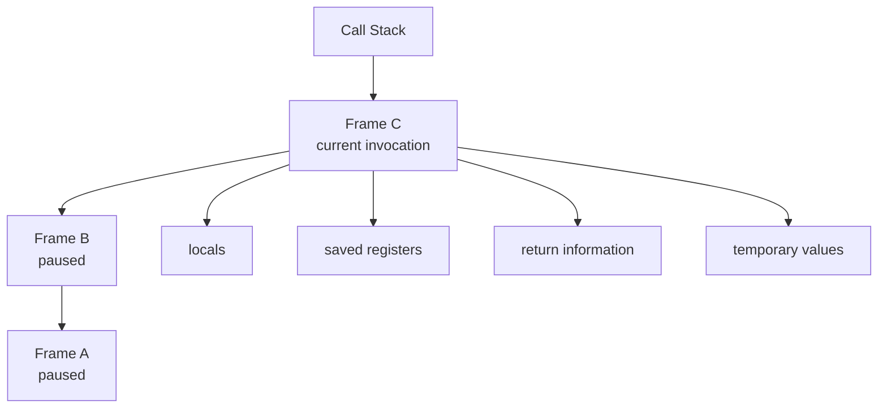
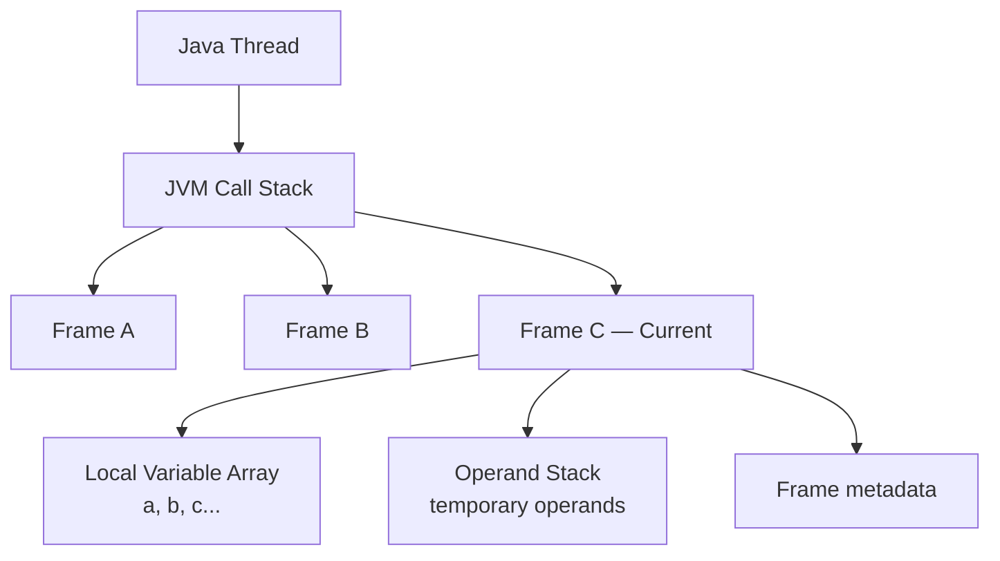
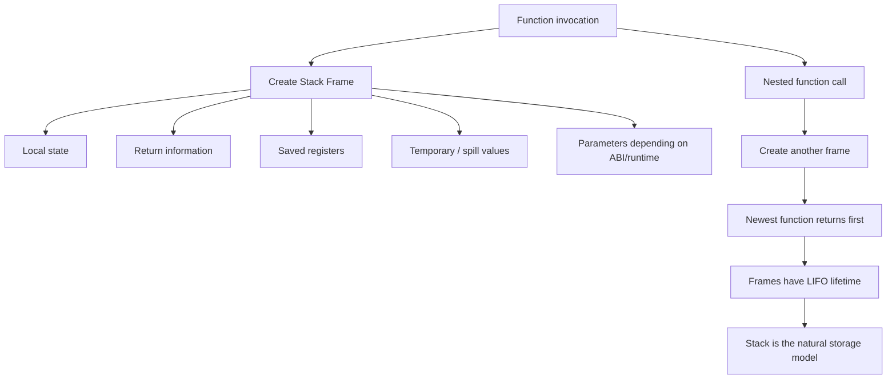

# Call Stack Memory — Stack Frame lưu gì, Local Variables được truy cập thế nào và vì sao Stack phù hợp với Function Calls?

Cách hiểu của bạn có **một phần đúng nhưng có một điểm rất quan trọng cần sửa**:

```java
int a = 10;
int b = 20;
```

Không nên hình dung rằng:

```text
TOP
┌──────┐
│ b=20 │ ← chỉ truy cập được b
├──────┤
│ a=10 │ ← muốn lấy a phải pop b
└──────┘
```

Đó là cách hoạt động của **Stack ADT** khi ta dùng `push/pop`.

Call stack thì khác:

> **LIFO chủ yếu áp dụng giữa các stack frame của các function calls, không có nghĩa các local variables bên trong một frame chỉ có thể được truy cập theo LIFO.**

Ví dụ `a` vẫn có thể được đọc trực tiếp dù sau nó đã khai báo `b`.

---

## 1. Phân biệt hai khái niệm "stack"

Khi học DSA, bạn có:

```text
Stack ADT

push()
pop()
peek()
```

Ví dụ:

```text
push(10)
push(20)

TOP
20
10
```

Muốn lấy `10` theo API stack thông thường thì phải pop `20`.

Nhưng **call stack memory** không hoạt động như một container mà mỗi local variable là một phần tử stack độc lập.

Nó gần với:

```text
Call Stack

Frame C
Frame B
Frame A
```

LIFO áp dụng ở cấp:

```text
Frame A
Frame B
Frame C
```

chứ không phải:

```text
variable a
variable b
variable c
```

---

# 2. Một function call tạo ra một Stack Frame

Ví dụ:

```java
void calculate() {
    int a = 10;
    int b = 20;

    int c = a + b;
}
```

Conceptually, khi `calculate()` chạy, nó có một stack frame:

```text
Stack Frame: calculate()

┌───────────────────────────┐
│ return address            │
├───────────────────────────┤
│ saved registers           │
├───────────────────────────┤
│ local variable a = 10     │
├───────────────────────────┤
│ local variable b = 20     │
├───────────────────────────┤
│ local variable c          │
├───────────────────────────┤
│ temporary / spill slots   │
└───────────────────────────┘
```

Đây chỉ là conceptual layout. Layout thực tế phụ thuộc:

```text
CPU architecture
ABI
compiler
JVM
JIT compiler
optimization level
```

Nhưng mental model quan trọng là:

> **Một frame chứa execution state của một invocation.**

---

# 3. Vậy `b` nằm sau `a`, làm sao CPU lấy lại `a`?

CPU không truy cập local variables bằng:

```text
peek()
pop()
```

Nó truy cập chúng thông qua **memory address / offset**.

Ví dụ giả sử:

```text
a → [frame_pointer - 4]
b → [frame_pointer - 8]
c → [frame_pointer - 12]
```

Conceptually:

```text
Frame Pointer
      │
      ▼

+0    return information
-4    a = 10
-8    b = 20
-12   c
```

Khi cần:

```java
c = a + b;
```

CPU/compiler có thể thực hiện đại loại:

```text
load [FP - 4]   → a
load [FP - 8]   → b
add
store result
```

Nó hoàn toàn có thể truy cập `a` trực tiếp.

Không cần:

```text
pop b
get a
push b back
```

---

# 4. Stack Pointer không có nghĩa chỉ TOP mới được đọc

Đây là một misunderstanding phổ biến.

`Stack Pointer` thường là một register như:

```text
SP
RSP on x86-64
```

nó chỉ vị trí hiện tại của stack.

Nhưng CPU vẫn có thể đọc memory ở các địa chỉ khác.

Ví dụ:

```text
RSP
 ↓
┌───────────────┐
│ temporary     │
├───────────────┤
│ b = 20        │
├───────────────┤
│ a = 10        │
├───────────────┤
│ return addr   │
└───────────────┘
```

CPU hoàn toàn có thể truy cập:

```text
[RSP + 8]
[RSP + 16]
[RSP + 24]
```

tùy layout.

Vì vậy:

> `TOP` quan trọng để **quản lý lifetime/allocation của frame**, chứ không giới hạn memory access chỉ ở phần tử top.

---

# 5. Vậy tại sao nó vẫn gọi là Stack?

Bởi vì thứ thực sự tuân theo LIFO là **lifetime của function invocation**.

Ví dụ:

```java
void A() {
    B();
}

void B() {
    C();
}

void C() {
}
```

Call:

```text
A
↓
B
↓
C
```

Stack:

```text
TOP
┌─────────┐
│ Frame C │
├─────────┤
│ Frame B │
├─────────┤
│ Frame A │
└─────────┘
```

C return:

```text
pop Frame C
```

sau đó:

```text
TOP
┌─────────┐
│ Frame B │
├─────────┤
│ Frame A │
└─────────┘
```

B return:

```text
pop Frame B
```

Đây mới chính là:

```text
Last In
First Out
```

---

# 6. Local variables bên trong frame không bắt buộc LIFO

Ví dụ:

```java
int a = 10;
int b = 20;
int c = a * 2;
int d = b + a;
```

Execution:

```text
create/use a
create/use b

sau đó:
read a

sau đó:
read b
read a
```

Access order là:

```text
a
b
a
b
a
```

rõ ràng **không phải LIFO**.

Không vấn đề gì cả.

Bởi vì:

```text
LIFO
```

không phải requirement cho access pattern của từng local variable.

LIFO chỉ phù hợp với:

```text
lifetime của nested function frames
```

---

# 7. Một mental model tốt hơn

Đừng tưởng tượng:

```text
Stack
=
stack of variables
```

Nên tưởng tượng:

```text
Call Stack
=
stack of execution contexts
```

Mỗi execution context là:

```text
Stack Frame
```

và bên trong frame có nhiều pieces of data.



---

# 8. Stack Frame thực tế có thể lưu những gì?

Không phải mọi architecture/compiler đều giống nhau, nhưng một frame có thể chứa các nhóm sau.

## Local variables

Ví dụ:

```java
int age = 20;
long count = 100;
```

Có thể nằm trong frame.

Nhưng lưu ý rất quan trọng:

> Compiler/JIT có thể giữ chúng trong CPU registers thay vì memory stack.

Ví dụ source:

```java
int a = 10;
int b = 20;
int c = a + b;
```

Compiler có thể nhận ra ngay:

```text
c = 30
```

thậm chí không cần tạo memory slots cho `a` và `b`.

---

# 9. Parameters

Ví dụ:

```java
int add(int a, int b) {
    return a + b;
}
```

Conceptually frame cần biết `a`, `b`.

Nhưng trên CPU hiện đại, parameters thường được truyền qua:

```text
registers first
```

theo calling convention.

Nếu cần, chúng có thể được spill ra stack.

Do đó không nên học cứng:

> "Function parameters luôn nằm trên stack."

Không luôn đúng.

---

# 10. Return Address

Đây là một trong những state quan trọng nhất.

Ví dụ:

```java
void A() {
    int x = 10;

    B();

    x++;
}
```

Khi gọi `B()`, hệ thống phải nhớ:

```text
B return xong thì quay lại đâu?
```

Cụ thể:

```text
resume ở instruction sau call B
```

Conceptually:

```text
Frame A

x = 10
return information
saved state
```

B gọi C thì B cũng cần return information của mình.

Nested calls:

```text
A waits for B
B waits for C
C runs
```

nên return state tự nhiên cũng được unwind:

```text
C
↓
B
↓
A
```

---

# 11. Saved Registers

Một function có thể đang dùng CPU registers:

```text
RAX
RBX
R12
...
```

Theo calling convention, một số registers phải được giữ nguyên qua function call.

Ví dụ conceptual:

```text
A using register X

A calls B

B wants X
↓
save old X
use X
restore old X
return
```

Saved register values có thể được lưu trong frame.

---

# 12. Temporary / Spill Values

CPU có số register hữu hạn.

Giả sử computation cần rất nhiều intermediate values:

```java
int x = complicatedExpression(...);
```

Compiler có thể cần:

```text
register A
register B
register C
...
```

nhưng không đủ registers.

Nó có thể đưa một số temporary values xuống stack.

Đây gọi là:

```text
register spilling
```

Ví dụ:

```text
registers full
     ↓
temporarily store value on stack
     ↓
use register for something else
     ↓
reload previous value later
```

---

# 13. Frame bookkeeping

Một frame cũng có thể chứa metadata phục vụ:

```text
stack unwinding
exception handling
debugging
GC maps
runtime bookkeeping
```

Tùy runtime và implementation.

---

# 14. Nhưng Local Object có nằm trên Stack không?

Đây là chỗ rất quan trọng trong Java.

Ví dụ:

```java
void test() {
    Person p = new Person();
}
```

Không nên đơn giản nói:

```text
p nằm trên stack
Person nằm trên heap
```

Mental model cơ bản thường là:

```text
Stack frame
└── reference p

Heap
└── Person object
```

Conceptually:

```text
Stack                          Heap

Frame test()
┌──────────────┐
│ p ───────────┼────────────→ Person object
└──────────────┘
```

`p` là reference.

Object được tạo bằng:

```java
new Person()
```

theo Java memory model/runtime abstraction thường được xem là heap object.

Tuy nhiên JIT có thể sử dụng optimization như:

```text
escape analysis
scalar replacement
```

nên implementation thực tế đôi khi không giống mental model này.

Khi học architecture, hãy dùng:

```text
local reference → frame
object → heap
```

như conceptual model, nhưng nhớ compiler có thể optimize.

---

# 15. Primitive thì sao?

Ví dụ:

```java
int a = 10;
double b = 20.5;
```

Conceptually local primitive values thuộc local state của method invocation.

Có thể hình dung chúng nằm trong frame:

```text
Frame

a = 10
b = 20.5
```

Nhưng runtime/JIT có thể để:

```text
a → CPU register
b → CPU register
```

hoặc optimize hoàn toàn.

Vì vậy cách nói chính xác hơn:

> **Stack frame logically owns the local state, but the physical value does not necessarily have to live in stack memory at every moment.**

---

# 16. Java còn có khái niệm Local Variable Array

Nếu đang học Java bytecode/JVM thì cần thêm một layer.

Mỗi JVM frame conceptually chứa:

```text
JVM Frame
├── Local Variable Array
├── Operand Stack
└── Frame Data
```

Đây rất quan trọng.

Ví dụ:

```java
int a = 10;
int b = 20;
int c = a + b;
```

Conceptually:

```text
Local Variable Array

slot 0 → a = 10
slot 1 → b = 20
slot 2 → c
```

Khi bytecode tính:

```java
a + b
```

nó có thể conceptually:

```text
load a
↓
Operand Stack

10

load b
↓

20 ← top
10

iadd
↓

30

store c
```

Ở đây mới xuất hiện một **operand stack thực sự theo LIFO**.

---

# 17. Đây là hai "stack" khác nhau trong JVM

Rất dễ nhầm:

```text
Thread Call Stack
```

và:

```text
Operand Stack inside each JVM Frame
```

Một thread:

```text
Thread
└── JVM Stack
    ├── Frame A
    ├── Frame B
    └── Frame C
```

Mỗi frame:

```text
Frame
├── Local Variable Array
└── Operand Stack
```

Sơ đồ:



Đây là distinction rất đáng nhớ.

---

# 18. Với ví dụ của bạn, JVM conceptual model sẽ rõ hơn

Code:

```java
int a = 10;
int b = 20;

int c = a + b;
```

Local Variable Array:

```text
slot 0 → 10  // a
slot 1 → 20  // b
slot 2 → ?   // c
```

Không phải:

```text
TOP
b
a
```

Local variable slots có thể được access theo index.

Ví dụ conceptual bytecode:

```text
load local 0   // a
load local 1   // b
add
store local 2  // c
```

Trong lúc `add`, operand stack mới là:

```text
after load a:

TOP
10
```

sau `load b`:

```text
TOP
20
10
```

`add` lấy:

```text
20
10
```

rồi push:

```text
30
```

---

# 19. Vậy tại sao Local Variable Array không phải Stack?

Bởi vì local variables có random-ish access pattern.

Ví dụ:

```java
int a = 10;
int b = 20;
int c = 30;

System.out.println(a);
System.out.println(c);
System.out.println(b);
System.out.println(a);
```

Order:

```text
a
c
b
a
```

Không có LIFO.

Do đó local variables hợp với:

```text
indexed slots / registers / fixed offsets
```

hơn là LIFO access.

---

# 20. Vậy tại sao Operand Stack lại dùng Stack?

Expression evaluation có thể rất tự nhiên theo stack-machine semantics.

Ví dụ:

```java
(a + b) * c
```

Có thể xử lý:

```text
push a
push b
add

push c
multiply
```

Minh họa:

```text
a = 10
b = 20
c = 3
```

Operand stack:

```text
push a

10
```

```text
push b

20
10
```

```text
add

30
```

```text
push c

3
30
```

```text
multiply

90
```

Ở đây LIFO rất hợp lý bởi toán tử cần lấy những operands vừa được tạo gần nhất.

---

# 21. Vì sao Call Frame lại phù hợp với Stack?

Bây giờ ta quay về câu hỏi chính.

Stack phù hợp vì **lifetime**.

Giả sử:

```java
A() {
    int a;
    B();
}

B() {
    int b;
    C();
}

C() {
    int c;
}
```

Khi C đang chạy:

```text
Frame C → contains state C
Frame B → contains suspended state B
Frame A → contains suspended state A
```

Ai chết trước?

```text
C
```

sau đó:

```text
B
```

sau đó:

```text
A
```

Tức:

```text
allocation order:
A → B → C

deallocation order:
C → B → A
```

Chính xác:

```text
LIFO
```

---

# 22. Stack cực kỳ hiệu quả cho lifetime này

Nếu biết:

```text
last allocated frame
=
first frame to be destroyed
```

thì allocation cực kỳ đơn giản.

Giả sử:

```text
SP = stack pointer
```

Call function:

```text
move SP
```

Return:

```text
move SP back
```

Conceptually:

```text
Before B:

┌────────────┐
│ Frame A    │
└────────────┘
      ↑ SP
```

A calls B:

```text
┌────────────┐
│ Frame A    │
├────────────┤
│ Frame B    │
└────────────┘
      ↑ SP
```

B returns:

```text
SP simply goes back
```

Không cần:

```text
search free block
allocate arbitrary memory
track fragmented blocks
GC individual frames
```

---

# 23. So sánh với Heap

Nếu mỗi function frame phải allocate trên heap:

```text
A frame → heap allocation
B frame → heap allocation
C frame → heap allocation
```

runtime có thể phải:

```text
find free memory
manage allocator metadata
possibly deal with fragmentation
free objects individually
```

Trong khi stack biết trước lifetime:

```text
C always dies before B
B always dies before A
```

nên chỉ cần:

```text
move stack pointer
```

Đó là một lý do stack rất efficient.

---

# 24. Stack có locality tốt

Frames của nested calls thường nằm gần nhau trong memory.

Ví dụ:

```text
Frame A
Frame B
Frame C
Frame D
```

liên tiếp.

Điều này tốt cho:

```text
CPU cache locality
```

so với rất nhiều allocations rải rác trên heap.

Đây là một lợi thế performance khác.

---

# 25. Nhưng tại sao không giữ toàn bộ state trong Registers?

Bởi vì registers rất ít.

Ví dụ CPU có một số lượng hữu hạn general-purpose registers.

Trong khi program có thể:

```text
A()
 ↓
B()
 ↓
C()
 ↓
D()
 ↓
E()
 ...
```

với rất nhiều:

```text
locals
temporaries
saved values
return state
```

Registers không đủ để giữ tất cả.

Stack cung cấp vùng memory mở rộng rất tự nhiên cho execution state.

---

# 26. Vì sao không dùng Queue?

Nested calls:

```text
A calls B
B calls C
```

Lifetime:

```text
C dies first
B dies second
A dies last
```

Queue lại:

```text
A first
B second
C third
```

FIFO không khớp.

---

# 27. Vì sao không dùng HashMap?

Có thể tưởng tượng:

```text
frameId → Frame
```

nhưng mỗi lần return phải tìm:

```text
caller frame nào?
```

rồi quản lý allocation/free riêng.

Không cần thiết.

Nested calls đã cho ta một invariant cực mạnh:

```text
caller cần resume
=
frame ngay dưới current frame
```

Stack cho ta điều đó miễn phí.

---

# 28. Vì sao không dùng Linked List?

Có thể.

Ví dụ:

```text
Frame C → Frame B → Frame A
```

về mặt logic vẫn hỗ trợ LIFO.

Nhưng call stack thường dùng contiguous memory vì:

```text
allocation/deallocation rất rẻ
cache locality tốt
SP arithmetic đơn giản
hardware/calling convention hỗ trợ tốt
```

Nếu dùng linked nodes trên heap thì overhead sẽ cao hơn.

---

# 29. Một distinction rất quan trọng: "Stack is LIFO" nói về allocation lifetime

Hãy ghi nhớ:

```text
Stack LIFO does NOT mean:

variables can only be read from top.
```

Nó nghĩa:

```text
stack storage is allocated/deallocated
in nested LIFO order.
```

Ví dụ:

```text
Frame A allocated
Frame B allocated
Frame C allocated

Frame C released
Frame B released
Frame A released
```

Trong từng frame:

```text
a
b
c
d
```

có thể được truy cập theo bất kỳ order nào mà machine/compiler cho phép.

---

# 30. Một ví dụ tổng hợp

```java
void A() {

    int x = 10;
    int y = 20;

    B(x);

    int z = x + y;
}
```

A's logical state:

```text
Frame A

x = 10
y = 20
return information
saved state
```

A gọi B:

```java
void B(int value) {
    int n = value * 2;
}
```

Call stack:

```text
TOP
┌────────────────────────┐
│ Frame B                │
│ value                  │
│ n                      │
│ return info            │
├────────────────────────┤
│ Frame A                │
│ x                      │
│ y                      │
│ return info            │
└────────────────────────┘
```

B return:

```text
remove Frame B
```

trở về:

```text
Frame A
```

A vẫn có thể:

```java
x + y
```

vì:

```text
x
y
```

vẫn thuộc active Frame A.

Không quan trọng `y` được khai báo sau `x`.

---

# 31. Nếu scope kết thúc thì sao?

Ví dụ:

```java
void test() {

    int a = 10;

    {
        int b = 20;
        System.out.println(b);
    }

    System.out.println(a);
}
```

Ở Java source level:

```text
b
```

không còn accessible sau block.

Nhưng điều đó là:

```text
language scope rule
```

không có nghĩa JVM bắt buộc ngay lập tức:

```text
pop b khỏi physical stack
```

Compiler/JIT có thể reuse slot hoặc optimize theo cách khác.

Phải phân biệt:

```text
source-level scope
```

và:

```text
physical runtime memory layout
```

---

# 32. Khi method return thì chuyện gì xảy ra?

Ví dụ:

```text
A
↓
B
```

B có:

```text
locals
temporaries
saved registers
return info
```

Khi B return:

```text
Frame B no longer needed
```

toàn bộ frame có thể được giải phóng **cùng một lúc**.

Đây là điểm rất mạnh.

Không cần:

```text
free local a
free local b
free temp1
free temp2
free return info
```

từng cái.

Chỉ cần conceptual:

```text
pop entire Frame B
```

---

# 33. Đây mới là lý do Stack cực kỳ hợp lý

Một method invocation có property:

```text
Tất cả state local của invocation
có gần như cùng lifetime.

Method starts
↓
state becomes active

Method returns
↓
state no longer needed
```

Do đó gom chúng thành:

```text
one frame
```

rất hợp lý.

Nested method invocations lại có:

```text
nested lifetime
```

nên:

```text
stack of frames
```

cực kỳ hợp lý.

---

# 34. Mental model hoàn chỉnh



---

# 35. Hãy sửa câu hiểu ban đầu của bạn như sau

Bạn đang nghĩ:

> "Nếu `b` được đưa lên stack sau `a`, thì `b` nằm trên top. Vậy muốn lấy `a` có phải phải đi qua `b` không?"

Câu trả lời:

**Không.**

Bởi vì local variables không được quản lý như các elements độc lập của một DSA stack.

Đúng hơn:

```text
Call Stack
    ↓
Stack Frame
    ↓
contains local state
```

Trong một frame:

```text
a → known slot/address/register
b → known slot/address/register
```

nên có thể access trực tiếp.

---

# 36. Công thức ghi nhớ cuối cùng

### LIFO ở đâu?

```text
LIFO applies to:

Function Frames
```

không phải:

```text
arbitrary accesses to local variables
```

### Stack lưu gì?

Conceptually:

```text
Stack Frame
├── local state
├── parameters / argument-related state
├── return information
├── saved registers
├── temporary/spilled values
└── runtime bookkeeping
```

Không phải tất cả luôn thực sự nằm trong stack memory vì compiler/JIT có thể:

```text
keep values in registers
optimize values away
reuse slots
scalar replace objects
```

### Vì sao dùng stack?

```text
Function calls are nested
        ↓
Their lifetimes are nested
        ↓
Newest invocation finishes first
        ↓
LIFO lifetime
        ↓
Stack
```

Và lợi ích:

```text
O(1)-like frame allocation/deallocation
+
simple stack-pointer movement
+
good memory locality
+
easy caller restoration
+
naturally matches nested execution
```

Câu quan trọng nhất để ghi vào note:

> **The call stack is a stack because function invocations have LIFO lifetimes, not because every local variable must be accessed in LIFO order. A stack frame is a block of execution state, and values inside that frame can be addressed independently.**

Với Java, nên thêm một câu nữa:

> **At the JVM level, each frame conceptually contains a local-variable array and an operand stack. Local variables are indexed rather than accessed in LIFO order; the operand stack itself follows LIFO semantics during bytecode expression evaluation.**
