# Memory + Operating Systems — Interview-Oriented Deep-Dive Lecture

> Mục tiêu: sau bài này, bạn có thể đi từ **high-level mental model → OS mechanism → hardware support → Java/JVM behavior → production debugging → interview deep dive** thay vì học thuộc định nghĩa.

---

## 0. Cách học bài này

Bài giảng được xây theo dependency:

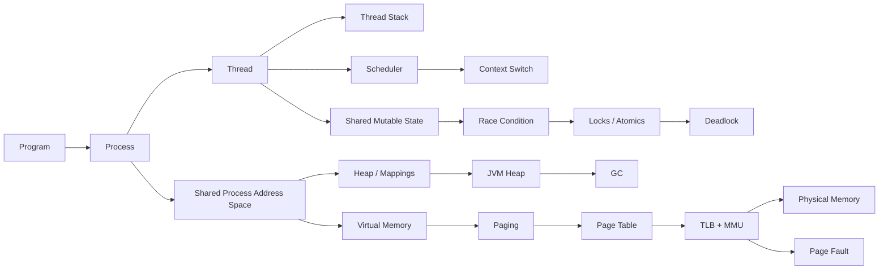

Cách đọc mỗi phần:

1. **Problem first** — concept tồn tại để giải quyết vấn đề gì?
2. **Intuition** — mental model dễ nhớ.
3. **Precise definition** — định nghĩa kỹ thuật.
4. **Layer 1: Developer** — backend developer cần hiểu gì?
5. **Layer 2: OS** — kernel quản lý như thế nào?
6. **Layer 3: Hardware** — CPU/MMU/TLB/cache tham gia ra sao?
7. **Java/JVM connection**
8. **Performance + debugging**
9. **Interview questions**
10. **Self-check**

---

# Part I — Process, Thread, Stack, Heap

# 1. Process vs Thread

## 1.1 Problem first — tại sao cần Process và Thread?

Giả sử máy tính chỉ có một chương trình duy nhất chạy từ lúc boot tới lúc shutdown. Khi đó ta gần như không cần abstraction "process".

Nhưng hệ điều hành hiện đại phải giải quyết đồng thời:

- nhiều chương trình cùng chạy;
- mỗi chương trình cần được bảo vệ khỏi chương trình khác;
- CPU phải được chia sẻ;
- tài nguyên như memory, files, sockets cần ownership rõ ràng;
- một ứng dụng lại muốn làm nhiều việc đồng thời mà không cần tạo một address space hoàn toàn mới cho mỗi việc.

Hai abstraction xuất hiện:

- **Process** giải quyết chủ yếu bài toán **resource ownership + isolation**.
- **Thread** giải quyết chủ yếu bài toán **multiple execution flows inside the same resource container**.

Một Spring Boot service là ví dụ rất tốt:

- Bạn thường chạy **một JVM process**.
- Bên trong có nhiều execution flows:
  - request worker threads,
  - GC threads,
  - JIT compiler threads,
  - Kafka consumer threads,
  - connection-pool maintenance threads,
  - scheduler threads.

Nếu mỗi request phải tạo một process riêng, việc chia sẻ heap, connection pool và application state sẽ rất nặng.

---

## 1.2 Intuition

Hãy coi:

- **Process = một căn hộ có khóa cửa riêng.**
- **Thread = những người đang làm việc bên trong căn hộ.**

Các căn hộ:

- có không gian riêng;
- không thể tự ý đọc đồ trong căn khác.

Những người trong cùng căn hộ:

- dùng chung phòng khách, tủ lạnh, tài nguyên;
- nhưng mỗi người có **bộ giấy tờ/công việc đang làm riêng**.

Technical translation:

- process có **virtual address space riêng**;
- threads trong cùng process **share address space**;
- mỗi thread có execution state riêng như:
  - registers,
  - program counter,
  - stack,
  - scheduler state.

---

## 1.3 Precise definition

### Process

Một **process** là một running program cùng với execution environment và resource context mà OS quản lý, thường bao gồm:

- virtual address space;
- executable mappings;
- heap/memory mappings;
- open file/socket handles;
- credentials/security context;
- process ID;
- one or more threads.

### Thread

Một **thread** là một schedulable execution flow bên trong process.

Một thread cần riêng:

- instruction pointer / program counter;
- CPU register state;
- stack;
- scheduling state;
- thread-local state.

Threads trong cùng process thường share:

- virtual address space;
- code;
- heap;
- globals;
- memory mappings;
- open process resources.

Trên Linux/POSIX, tài liệu pthreads mô tả threads trong một process share global memory/data/heap, còn mỗi thread có stack riêng. Linux `clone()` cho phép kernel tạo execution contexts với mức sharing khác nhau thông qua flags như `CLONE_VM` và `CLONE_THREAD`.

Trên Windows, process có virtual address space và resources; thread là entity được scheduler chạy, có register context, user stack, kernel stack và thread-local state.

**Source anchors:** [7], [8], [10].

---

## 1.4 Process vs Thread — comparison

| Dimension | Process | Thread |
|---|---|---|
| Address space | Thường riêng | Share process address space |
| Heap | Mỗi process có mappings riêng | Threads cùng process thấy cùng heap |
| Stack | Có ít nhất stack của main thread | Mỗi thread có stack riêng |
| Isolation | Mạnh hơn | Yếu hơn |
| Communication | IPC/shared memory/socket… | Shared memory trực tiếp |
| Creation cost | Thường lớn hơn | Thường nhỏ hơn |
| Context switch | Có thể đổi address-space context | Cùng process có thể giữ cùng address-space context |
| Failure impact | Crash thường cô lập ở process | Memory corruption/fatal failure có thể hạ cả process |
| Synchronization | IPC synchronization | Locks/atomics/shared-memory synchronization |

### Điều cần nói cẩn thận ở interview

Không nên nói:

> "Thread nhẹ hơn process vì thread không có memory."

Sai. Thread vẫn cần stack, register context và kernel/runtime metadata.

Câu tốt hơn:

> Thread thường rẻ hơn vì các threads trong cùng process **reuse/share phần lớn process resources**, đặc biệt address space và open resources, thay vì tạo một resource container hoàn toàn độc lập.

---

## 1.5 Three layers

### Layer 1 — Developer

Trong backend:

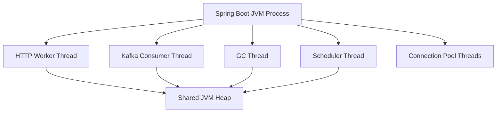

Điều này dẫn tới hai hệ quả:

1. Chia sẻ state rất nhanh.
2. Shared mutable state có thể gây race condition.

### Layer 2 — OS

Kernel scheduler không "chạy process" theo nghĩa đơn giản; scheduler thực tế chọn **schedulable execution entities**, thường là threads/tasks.

OS lưu metadata của execution context và quyết định:

- runnable;
- running;
- sleeping/blocked;
- stopped;
- terminated.

Threads của cùng process chia sẻ memory mappings nhưng vẫn có scheduler state riêng.

### Layer 3 — Hardware

CPU core chỉ thực thi một instruction stream tại một thời điểm trên một hardware thread.

Khi scheduler chuyển execution:

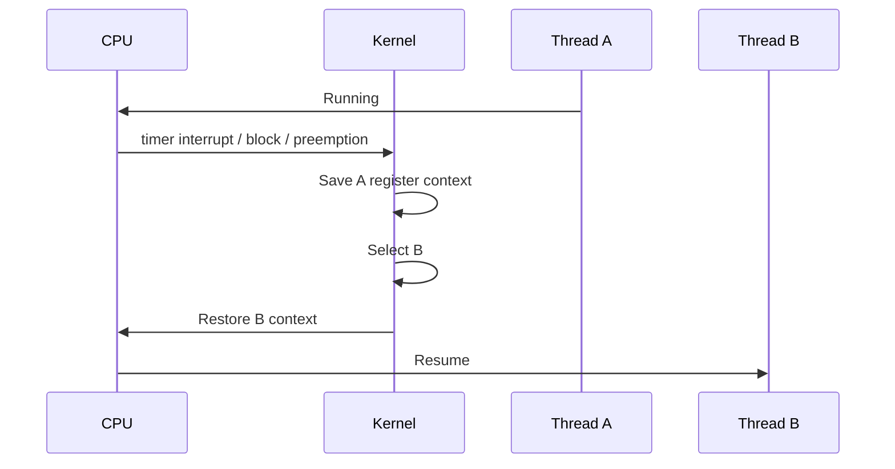

Registers và instruction pointer phải phản ánh thread mới.

---

## 1.6 Java/JVM connection

### Java process là gì?

Khi chạy:

```bash
java -jar app.jar
```

thông thường OS tạo một **process** chạy JVM implementation.

JVM không phải "một thread"; JVM là runtime chạy bên trong process và tạo/quản lý nhiều threads.

### Java thread map xuống OS thread thế nào?

Với **platform threads** trong Java hiện đại:

- Java platform thread là wrapper mỏng quanh OS thread.
- OS scheduler schedule OS thread.

**Source anchors:** [15], [16].

Với **virtual threads** (finalized từ JDK 21):

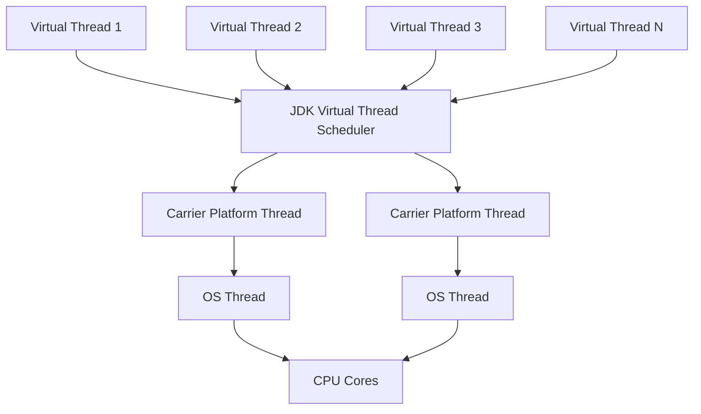

Virtual threads dùng **M:N scheduling**: rất nhiều virtual threads được multiplex lên số ít platform/OS threads.

### Backend implication

- Platform thread-per-request có thể bị giới hạn bởi thread count.
- Virtual threads tốt cho workload có rất nhiều blocking I/O.
- Virtual threads **không làm CPU code chạy nhanh hơn**; mục tiêu là scalability/throughput.

---

## 1.7 Performance

Quá nhiều platform threads có thể gây:

- nhiều thread stacks;
- scheduler overhead;
- context-switch pressure;
- cache locality kém;
- lock contention tăng;
- latency tail tăng.

Trong backend, thread pool không chỉ là "tái sử dụng object Thread"; nó còn là cách **bound concurrency** đối với một resource hữu hạn.

Ví dụ database:

```text
500 request threads
          ↓
20 DB connections
```

Dù có 500 threads, chỉ 20 request có thể dùng DB cùng lúc. 480 threads còn lại có thể blocked.

---

## 1.8 Interview section

### Level 1

**Q: What is the difference between a process and a thread?**

**30-second answer**

> A process is mainly a resource and isolation boundary with its own virtual address space. A thread is an execution flow inside a process. Threads in the same process share the address space and many resources, but each thread has its own stack, registers, program counter, and scheduling state.

**1–2 minute expansion**

> Because threads share the process resources, creating and communicating between threads is usually cheaper than doing the same between separate processes. The trade-off is isolation: a bug in shared memory or synchronization can affect the whole process.

### Level 2

**Q: Why are threads cheaper than processes?**

Good answer:

> Not because a thread is "just code", but because it reuses the process's address space and resource tables. A new thread mainly needs execution state and stack, while a new process requires a separate process context and typically separate virtual-memory mappings.

### Level 3

**Q: If threads share memory, what exactly do they not share?**

Mention:

- registers;
- PC/instruction pointer;
- stack;
- scheduler state;
- thread local storage;
- signal mask/details depending on OS.

**Q: Can two processes share memory?**

Yes. Process isolation is the default abstraction, not an absolute prohibition. OS can intentionally map the same physical pages into both address spaces via shared memory / memory-mapped files.

---

## 1.9 Common mistakes

❌ "A process has one thread."  
→ Một process có **at least one**, có thể có many threads.

❌ "Threads share everything."  
→ Không. Stack/register/scheduling state là per-thread.

❌ "Java thread always equals OS thread."  
→ Platform thread gần 1:1; virtual thread không.

---

## 1.10 Self-check

1. Tại sao process isolation giúp system reliability?
2. Tại sao thread communication thường rẻ hơn process IPC?
3. Thread nào sở hữu heap?
4. Mỗi thread có stack riêng vì sao?
5. Java virtual thread khác platform thread ở scheduling layer nào?
6. Nếu 5,000 platform threads đang sleep, CPU usage có nhất thiết cao không?
7. Vì sao dù CPU thấp latency vẫn có thể tăng?

<details>
<summary>Đáp án gợi ý</summary>

1. Separate virtual address spaces và protection làm lỗi memory của process này khó trực tiếp phá process khác.  
2. Threads có thể đọc/write shared address space trực tiếp.  
3. Heap thuộc process/JVM runtime, được threads share.  
4. Mỗi thread có call chain, local execution state riêng.  
5. Virtual thread do JDK scheduler multiplex lên carrier platform threads; platform threads do OS schedule.  
6. Không; sleeping threads không cần CPU liên tục, nhưng vẫn tiêu memory/resources.  
7. Có thể blocked I/O, connection-pool saturation, lock contention, scheduling delays hoặc page/GC pressure.

</details>

---

# 2. Stack vs Heap

## 2.1 Problem first

Một chương trình cần quản lý hai loại lifetime rất khác nhau:

1. Execution state theo **nested function/method calls**.
2. Data có lifetime không nhất thiết khớp call stack.

Nếu mọi data đều gắn chặt vào function call:

- object cần sống sau khi method return sẽ không tồn tại được.

Nếu mọi local execution state đều allocation kiểu general-purpose heap:

- quản lý call/return sẽ phức tạp và tốn overhead hơn.

Do đó ta có hai mental models quan trọng:

- **stack** rất phù hợp với LIFO lifetime của calls;
- **heap** phù hợp với dynamic lifetime.

---

## 2.2 Stack mental model

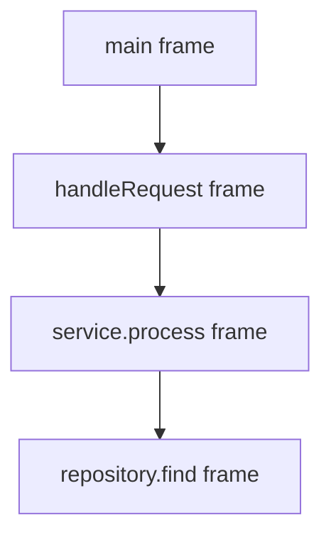

Khi `repository.find()` return:

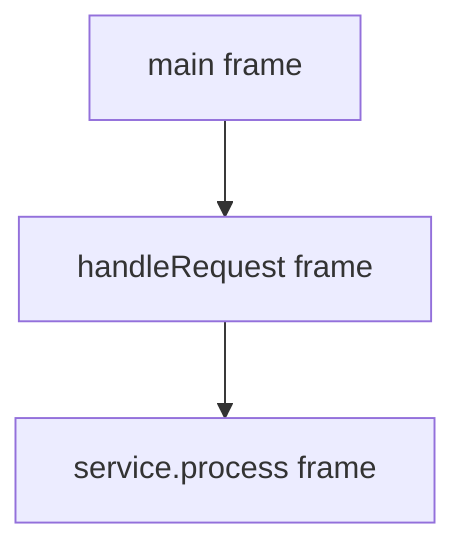

Stack rất tự nhiên vì function calls nested theo LIFO.

---

## 2.3 JVM stack frame

JVM specification mô tả mỗi Java thread có một JVM stack. Mỗi method invocation tạo một frame chứa conceptual structures như:

**Source anchor:** [13].

- local variables;
- operand stack;
- dynamic linking information;
- method return state.

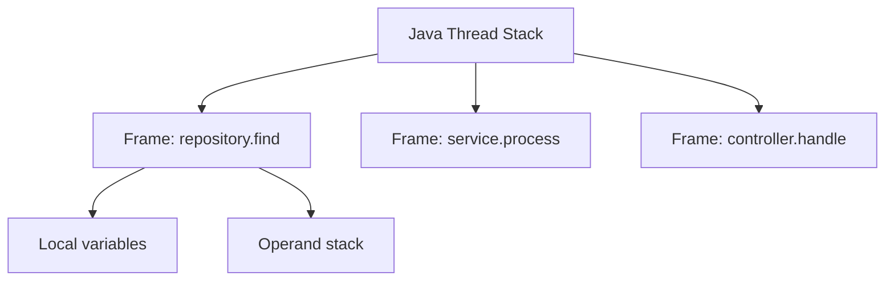

### Ví dụ

```java
User loadUser(long id) {
    User user = repository.find(id);
    return user;
}
```

Conceptually:

- `id` nằm trong local-variable area của frame.
- `user` là một **reference value** trong frame.
- `User` instance thường được allocate trong JVM heap.

Nhưng phải nhớ chữ **conceptually**.

JIT có thể:

- giữ local trong CPU register;
- eliminate allocation bằng escape analysis;
- scalar-replace object;
- inline method, làm machine-level stack shape khác source-level mental model.

---

## 2.4 Stack vs Heap table

| Dimension | Stack | Heap |
|---|---|---|
| Primary role | Method execution state | Dynamic objects/data |
| Lifetime | Thường gắn call lifetime | Reachability/dynamic lifetime |
| Ownership | Per thread | Shared by JVM threads |
| Allocation style | Push/pop frame-like | Runtime allocator |
| Java objects | Không nên nói "không bao giờ" | Spec says heap is storage for class instances/arrays |
| GC | Stack references là roots/inputs | GC reclaims heap objects |
| Failure | StackOverflowError | OutOfMemoryError variants |
| Concurrency | Stack private giảm sharing | Shared heap cần synchronization |

---

## 2.5 "Primitive on stack, object on heap" có đúng không?

Đây là statement interview thường bị oversimplified.

```java
class A {
    int x;       // primitive field
    User user;   // reference field
}
```

Nếu instance `A` ở heap:

- field `x` nằm **trong object A**, tức là trong object storage;
- field `user` cũng nằm trong object A.

Ngược lại:

```java
void f() {
    int x = 10;
    User u = new User();
}
```

- local `x`: conceptual local slot;
- local `u`: reference value trong frame;
- `new User()` instance: JVM heap theo spec.

Vì vậy câu "primitive = stack, object = heap" là sai.

---

## 2.6 Three layers

### Developer

Stack liên quan:

- recursion depth;
- call chains;
- thread creation;
- `StackOverflowError`;
- thread dump.

Heap liên quan:

- object allocation;
- GC;
- cache objects;
- queues;
- request payloads;
- memory leaks.

### OS

JVM process xin virtual address ranges từ OS để backing:

- heap;
- thread stacks;
- code cache;
- class metadata;
- native libraries;
- direct buffers;
- internal runtime structures.

Java heap chỉ là **một phần** của process virtual memory.

### Hardware

Sau cùng cả stack/heap accesses đều đi qua virtual-memory translation:

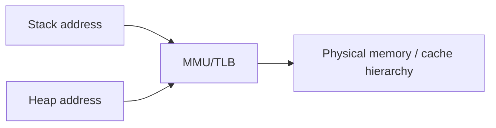

CPU không có khái niệm "Java object" khi load một memory address. CPU xử lý address, cache line, register, instruction.

---

## 2.7 Java memory picture

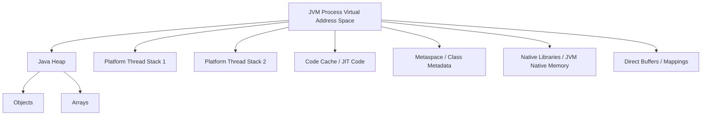

### Java heap != physical RAM

Không có equality:

```text
Java heap == physical RAM
```

Heap là JVM-managed address range. Các pages của range đó có thể:

- resident trong physical RAM;
- chưa fault-in;
- bị OS reclaim/swap tùy platform/policy;
- backed theo các cơ chế khác nhau.

---

## 2.8 StackOverflowError

JVM spec cho phép stacks:

- fixed size;
- hoặc dynamically expandable tùy implementation.

Nếu computation cần stack lớn hơn giới hạn cho phép → `StackOverflowError`.

Classic example:

```java
void f() {
    f();
}
```

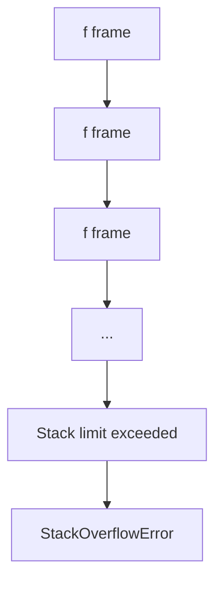

---

## 2.9 Production implication: too many threads

Ví dụ:

```text
5,000 platform threads
```

Ngay cả khi mỗi thread stack reserve/commit behavior phụ thuộc OS/JVM, hàng nghìn platform threads vẫn tạo pressure từ:

- stack address ranges;
- kernel thread structures;
- scheduler queues;
- native memory;
- context switching.

Đây là lý do "heap còn trống" không có nghĩa JVM process chắc chắn tạo thêm thread được.

---

## 2.10 Interview

**Q: Where are local variables stored in Java?**

30s:

> Conceptually, local variables belong to the current JVM frame on the thread's JVM stack. But the JIT may keep values in registers or optimize frames, so I would separate the JVM specification model from the exact physical implementation.

**Q: Does every Java object live on the heap?**

Strong interview answer:

> The JVM specification defines the heap as the run-time data area from which class instances and arrays are allocated. However, a sufficiently optimizing JVM may eliminate an allocation or scalar-replace an object if its observable semantics are preserved. So "every `new` becomes a physically materialized heap object" is too strong.

**Q: Is JVM heap the same as virtual memory?**

> No. The JVM heap is a JVM-managed region that itself lives within the process's virtual address space. Virtual memory is the OS/hardware abstraction for the entire process address space.

---

## Part I Production checkpoint — Thread explosion

### Scenario

```text
Spring Boot service
Heap: 45%
RSS: 88%
Platform threads: 6,000
CPU: 25%
```

### Reasoning

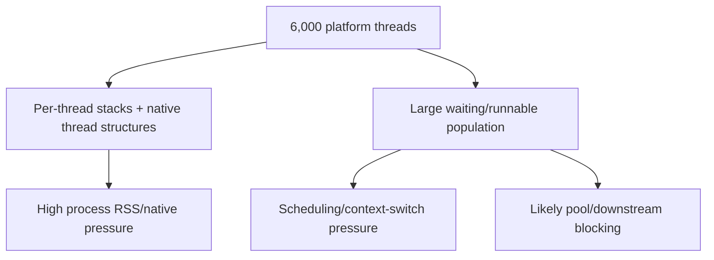

### What to inspect

1. `jcmd <pid> Thread.print` — thread states and repeated stacks.
2. OS process/thread counts.
3. Native Memory Tracking if enabled.
4. DB/HTTP connection-pool wait metrics.
5. Context-switch counters.
6. Heap usage separately from total RSS.

### Key conclusion

**High process memory is not automatically high Java heap.** Thousands of platform threads can create significant non-heap/native pressure.

---

# Part II — Virtual Memory, Paging, TLB, Page Fault

# 3. Virtual Memory

## 3.1 Problem first

Không có virtual memory, application phải đối mặt trực tiếp với physical-memory layout.

Vấn đề:

1. Hai processes có thể muốn dùng cùng một address.
2. Program cần contiguous logical memory trong khi RAM bị fragmented.
3. OS cần isolation/protection.
4. Program memory footprint có thể lớn hơn resident RAM.
5. Shared libraries và shared memory cần mapping linh hoạt.

Virtual memory tạo một level of indirection:

```text
virtual address != physical address
```

---

## 3.2 Mental model

Mỗi process được cho một "bản đồ địa chỉ" riêng.

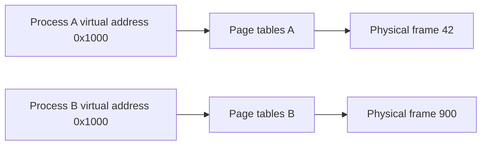

Cùng virtual address `0x1000` nhưng map đến physical frame khác nhau.

Đây là nền tảng của process isolation.

---

## 3.3 Precise definition

**Virtual address space** là tập các virtual addresses process có thể dùng.

Virtual-memory subsystem phối hợp:

- OS page tables/mappings;
- CPU MMU;
- permissions;
- page-fault exceptions;
- backing storage / file mappings;
- page allocation/reclamation.

Virtual memory **không chỉ là "RAM + disk"**.

Cốt lõi abstraction là:

> chương trình truy cập virtual addresses, trong khi OS + hardware quyết định translation/protection/backing.

Disk paging chỉ là một khả năng của subsystem.

---

## 3.4 Three layers

### Developer

Bạn thấy:

```java
byte[] data = new byte[100_000_000];
```

Bạn không chọn physical RAM frame nào chứa array.

### OS

Kernel:

- quản lý process mappings;
- tạo/modify page-table entries;
- set protection bits;
- cấp physical frames khi cần;
- handle faults;
- reclaim pages under memory pressure.

### Hardware

CPU tạo virtual address.

MMU:

- lookup TLB;
- nếu miss thì page-table walk (architecture-dependent);
- kiểm tra permission;
- tạo physical address;
- memory hierarchy tiếp tục L1/L2/L3/DRAM.

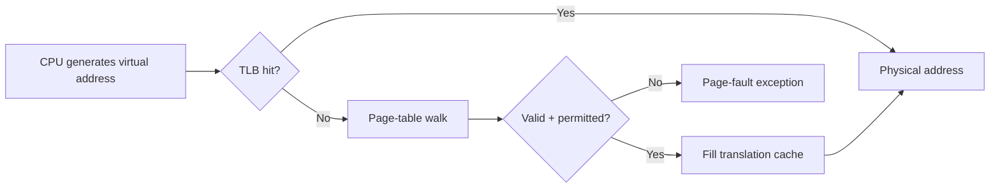

---

## 3.5 Why isolation works

Giả sử Process A thử access virtual address `0x7abc...`.

MMU không hỏi:

> "Địa chỉ số này tồn tại trong toàn máy không?"

Nó dùng **address-space translation context của process hiện tại**.

Nếu mapping:

- absent;
- non-readable;
- non-writable;
- non-executable;

hardware có thể trap sang kernel.

OS quyết định:

- legitimate demand fault → resolve;
- illegal access → signal/exception.

---

## 3.6 Virtual memory in Windows vs Linux

### Common conceptual model

Cả Linux và Windows đều có:

- per-process virtual address space;
- page-based mapping;
- page faults;
- protected kernel/user memory.

### Linux

Linux kernel docs mô tả page tables map CPU-visible virtual addresses sang physical addresses và có hierarchy architecture-dependent. Linux hiện expose generic hierarchy có thể tới 5 levels, với folding nếu architecture không cần đủ levels.

**Source anchors:** [5], [6].

### Windows

Microsoft docs mô tả mỗi user-mode process có private virtual address space; page tables dịch virtual → physical. Windows thường dùng terminology như **working set** cho subset pages hiện resident trong physical memory.

### Interview wording

> The concept is shared across modern OSes, but page-table depth, page sizes, working-set/reclamation policy, and fault terminology differ by OS and CPU architecture.

## 3.7 Interview section — Virtual Memory

### Level 1 — Basic

**Q: What is virtual memory?**

**30-second answer**

> Virtual memory is the abstraction that lets a process use virtual addresses instead of directly addressing physical RAM. The OS manages page tables and protection, while the MMU translates virtual addresses to physical addresses. This gives processes isolation and flexible memory mapping.

### Level 2 — Intermediate

**Q: Why is virtual memory useful if the machine already has enough RAM?**

> Because its value is not only extending memory with disk. Virtual memory gives per-process isolation, protection, relocation, sparse address spaces, shared mappings, memory-mapped files, and a stable virtual-address view independent of where pages physically reside.

### Level 3 — Deep follow-up

**Q: Can two different virtual addresses map to the same physical frame?**

Yes. This is useful for:

- shared memory;
- shared libraries/file-backed mappings;
- alias mappings.

**Q: Can the same virtual address in two processes map to different frames?**

Yes. That is the normal consequence of per-process address spaces.

**Common mistake**

❌ "Virtual memory is RAM plus swap."  
→ Swap/backing storage is one mechanism. The core abstraction is virtual-address translation and protection.

---

# 4. Paging, Page, Frame, Page Table, TLB

## 4.1 Why paging?

Nếu virtual memory map từng byte độc lập:

- mapping metadata khổng lồ;
- translation cực khó.

Do đó address space được chia thành fixed-size units.

| Term | Meaning |
|---|---|
| Page | Virtual-memory unit |
| Frame / page frame | Physical-memory unit |
| Page table | Mapping structure |
| PTE | Page Table Entry |
| VPN | Virtual Page Number |
| PFN | Physical Frame Number |
| Offset | Byte position inside page |
| TLB | Cache of address translations |

---

## 4.2 Address decomposition

Với page size là power of two:

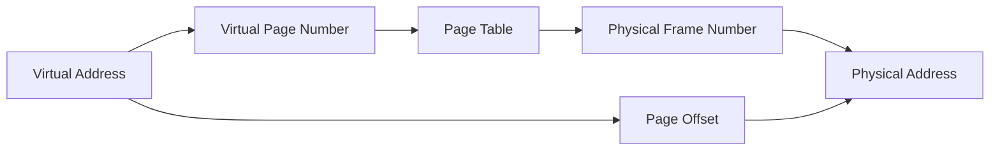

Formula:

```text
virtual_address = VPN * page_size + offset
physical_address = PFN * page_size + offset
```

**Offset không đổi** trong translation.

---

## 4.3 Concrete numeric example

Giả sử:

```text
Page size = 4 KiB = 4096 bytes = 0x1000
Virtual address = 0x12345
```

Tách:

```text
VPN = 0x12345 / 0x1000 = 0x12
Offset = 0x345
```

Giả sử page table:

```text
VPN 0x12 → PFN 0xABC
```

Thì:

```text
Physical address
= 0xABC * 0x1000 + 0x345
= 0xABC345
```

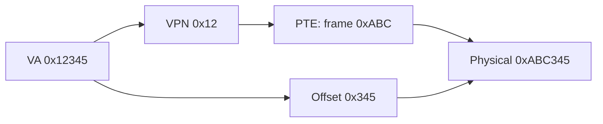

---

## 4.4 Page table entry có gì?

Architecture-specific, nhưng conceptually PTE thường encode:

- frame number / next-level table pointer;
- present/valid state;
- read/write permission;
- user/kernel permission;
- executable restriction;
- accessed/reference bits;
- dirty bit.

Do not memorize one exact bit layout unless interviewer asks x86-64 specifics.

---

## 4.5 Why multilevel page tables?

Giả sử giant flat table cho huge 64-bit virtual space.

Vấn đề: đa số virtual address range của process không được dùng.

Multilevel page table cho phép chỉ allocate lower-level tables cho ranges thực sự cần.

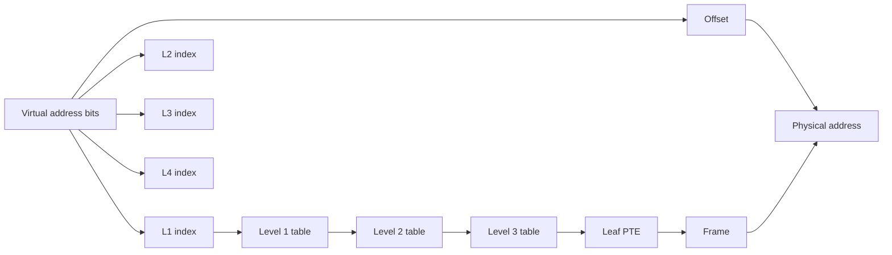

Linux generic MM abstraction hiện hỗ trợ hierarchy tới 5 levels, nhưng architecture có thể fold unused levels.

---

## 4.6 TLB — tại sao cần?

Nếu mỗi memory load cần nhiều extra RAM loads để page-table walk, memory access sẽ cực đắt.

TLB là cache translation:

```text
virtual page → physical frame
```

Flow:

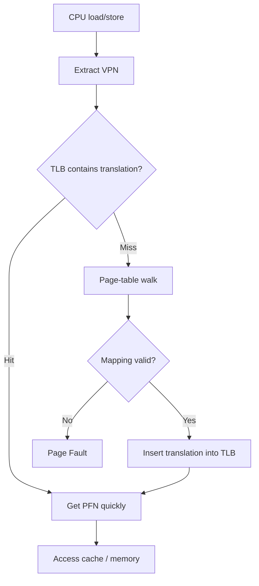

### Critical distinction

**TLB miss != page fault**

TLB miss có thể đơn giản là:

- translation chưa cache;
- page table vẫn có valid mapping;
- hardware/software page walk tìm ra PTE;
- fill TLB;
- tiếp tục.

Page fault xảy ra khi translation/access không thể hoàn tất theo current mapping/protection and CPU raises a fault exception.

---

## 4.7 Huge pages

Larger pages có thể:

- giảm số TLB entries cần cho cùng memory footprint;
- giảm page-table overhead;
- cải thiện TLB coverage.

Trade-offs:

- internal fragmentation;
- allocation/compaction challenges;
- workload dependent.

Linux docs nêu huge pages có thể reduce TLB pressure nhưng có memory-efficiency trade-offs.

---

## 4.8 Interview

### Q: Why does virtual memory exist?

30 seconds:

> Virtual memory gives each process a private address-space abstraction and lets the OS map virtual pages to physical frames flexibly. That provides isolation and protection, allows contiguous virtual regions to use noncontiguous RAM, supports sharing and memory-mapped files, and enables demand paging.

### Q: What is the difference between a page and a frame?

> A page is a unit in virtual address space; a frame is the corresponding fixed-size unit in physical memory.

### Q: What is the TLB?

> A small CPU-side cache of recent virtual-to-physical address translations. It avoids expensive page-table walks on most memory accesses.

### Deep follow-up: Does every TLB miss trap to the OS?

No. On many architectures hardware page walkers can walk page tables without a kernel trap when the mapping is valid. Architecture details differ.

---

## 4.9 Self-check

1. Virtual address và physical address khác nhau ở đâu?
2. Vì sao hai process có thể cùng dùng VA `0x1000`?
3. Offset có thay đổi khi page → frame mapping không?
4. TLB miss có phải page fault không?
5. Huge pages giảm pressure gì?
6. Page table nằm ở đâu?
7. MMU là hardware hay software?

<details>
<summary>Đáp án gợi ý</summary>

1. VA là address process/CPU instruction dùng trong current virtual address space; PA là address physical-memory side sau translation.  
2. Mỗi process có address-space translation riêng.  
3. Không; offset trong page/frame giữ nguyên.  
4. Không. TLB miss có thể page walk thành công.  
5. TLB/page-table pressure.  
6. Page tables là OS-managed data structures nằm trong memory; hardware MMU đọc chúng theo architecture rules.  
7. MMU là hardware component; OS cấu hình page tables và xử lý faults.

</details>

---

# 5. Page Fault Deep Dive

## 5.1 Problem first

Virtual memory cố tình cho phép một mapping "hợp lệ về mặt logic" nhưng page chưa resident trong RAM.

Làm sao CPU biết phải dừng và nhờ kernel xử lý?

→ **page fault** là exception/trap mechanism.

---

## 5.2 Precise flow

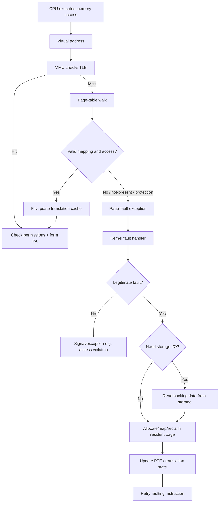

---

## 5.3 Common legitimate page-fault causes

- lazy allocation;
- demand paging;
- copy-on-write;
- first touch of anonymous memory;
- memory-mapped file;
- page reclaimed from working set/resident set;
- stack growth, depending on OS/runtime policy.

Illegal cases:

- unmapped address;
- write to read-only mapping;
- user access to privileged page;
- execute on non-executable page.

---

## 5.4 Minor vs Major page fault

### Linux terminology

Linux `getrusage()` distinguishes:

- `ru_minflt`: faults serviced without I/O activity.
- `ru_majflt`: faults that required I/O activity.

**Source anchor:** [9].

Mental model:

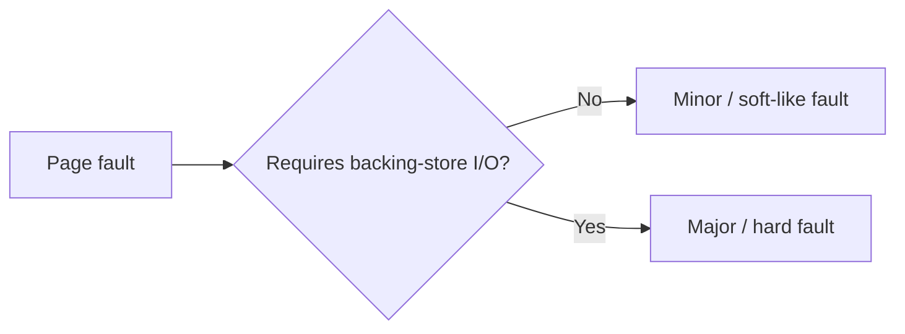

### Windows terminology

Windows commonly uses:

- **soft page fault**: resolved without reading backing store;
- **hard page fault**: requires reading from backing store.

**Source anchor:** [12].

Terminology is similar conceptually, but do not assume counters/definitions are byte-for-byte identical across OSes.

---

## 5.5 Why page fault expensive?

Fault cost has levels.

### Case A — cheap-ish minor fault

Still requires:

- exception transition;
- kernel handler;
- page-table work;
- possibly zeroing/allocating frame;
- TLB translation update;
- resume instruction.

So "minor" does not mean "free".

### Case B — major fault

May require storage I/O.

Relative latency intuition:

```text
CPU cycles / cache: nanoseconds-ish
DRAM: much slower than cache
SSD/storage I/O: orders of magnitude slower
```

Không cần học con số tuyệt đối vì hardware khác nhau. Ý chính là **major fault chèn storage-latency scale vào execution path**.

---

## 5.6 Page fault có thể xảy ra khi RAM còn nhiều không?

Có.

Ví dụ:

- first access to demand-allocated page;
- copy-on-write write fault;
- page mapped but not yet resident;
- mapped file first touch;
- permission-related fault.

Page fault không đồng nghĩa "RAM đã hết".

---

## 5.7 Java example — large heap and first touch

JVM có thể reserve virtual address space cho heap, nhưng physical backing/residency có thể được materialize dần tùy OS/JVM flags/policy.

Oracle G1 tuning docs đề cập `-XX:+AlwaysPreTouch` có thể move OS work of backing virtual memory with physical memory to VM startup time, giúp runtime pause consistency đổi lấy startup cost.

Mental model:

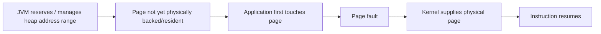

---

## 5.8 Detection

Linux:

```bash
/usr/bin/time -v java -jar app.jar
```

Có thể xem major/minor faults và voluntary/involuntary context switches.

Hoặc:

```bash
cat /proc/<pid>/status
```

cho context-switch counters; memory counters dùng các `/proc` views khác.

Java:

- JFR/JMC cho application + JVM behavior.
- OS tooling vẫn cần cho page faults/residency vì đây là OS layer.

---

## 5.9 Interview coaching

**Q: What happens when a page fault occurs?**

30s:

> The CPU cannot complete a memory access under the current page-table state, so it raises a page-fault exception and transfers control to the kernel. The kernel checks whether the access is valid. If it is, it resolves the fault—for example by allocating a frame or loading data from backing storage—updates the page tables, and retries the instruction. If the access is invalid, the process receives an access violation such as SIGSEGV on Linux.

Deep follow-up:

> A TLB miss is earlier in the path and is not itself a page fault. If a page-table walk finds a valid resident mapping, the CPU can refill the TLB and continue.

---

## Part II Production checkpoint — Major page-fault spike

### Scenario

```text
API p99 suddenly rises
CPU: moderate
GC pauses: normal
Major page faults: sharply increasing
Disk I/O latency: elevated
```

### Reasoning

```mermaid
flowchart TD
    A[Application touches cold/nonresident pages] --> PF[Major page faults]
    PF --> IO[Backing-store I/O]
    IO --> WAIT[Faulting threads wait]
    WAIT --> LAT[Latency rises]
```

### Investigation

- correlate major-fault rate with latency;
- check memory pressure/reclaim;
- inspect RSS/working set;
- determine whether mapped files or a very large cold heap are being touched;
- inspect container memory limit and host pressure;
- check whether another workload displaced the service's working set.

### Key conclusion

A major fault can dominate latency even when the Java GC itself looks healthy.

---

# Part III — Scheduling and Context Switching

# 6. Context Switch

## 6.1 Problem first

Một CPU core không thể chạy vô hạn mọi runnable thread cùng lúc.

OS cần:

- fairness;
- priority;
- responsiveness;
- I/O blocking;
- preemption.

Khi CPU đổi từ execution context A sang B, context phải được chuyển.

---

## 6.2 Core flow

```mermaid
sequenceDiagram
    participant A as Thread A
    participant CPU
    participant K as Kernel Scheduler
    participant B as Thread B

    A->>CPU: Execute
    CPU->>K: Timer interrupt / block / higher-priority event
    K->>K: Save A execution context
    K->>K: Update A scheduler state
    K->>K: Choose runnable B
    K->>K: Restore B execution context
    K->>CPU: Return to B
    CPU->>B: Execute
```

Context có thể bao gồm architecture/OS-dependent state:

- general-purpose registers;
- instruction pointer;
- stack pointer;
- flags;
- SIMD/FPU state as needed;
- kernel scheduler bookkeeping;
- address-space context if switching process.

---

## 6.3 Voluntary vs involuntary

### Voluntary context switch

Thread tự block/yield vì:

- waiting I/O;
- waiting lock/condition;
- sleeping;
- waiting queue.

### Involuntary

Scheduler preempts vì:

- time slice expired;
- higher-priority runnable task;
- scheduling policy.

Linux `getrusage()` expose voluntary (`ru_nvcsw`) và involuntary (`ru_nivcsw`) counters.

---

## 6.4 Why expensive?

### Direct cost

- enter kernel;
- scheduler work;
- save/restore state.

### Indirect cost

Thường quan trọng hơn:

- new thread's working set may not be hot in CPU caches;
- branch predictor/history locality changes;
- TLB locality can degrade;
- CPU may migrate thread to different core;
- NUMA locality may worsen.

### Nuance: context switch does not mean "cache cleared"

CPU cache không nhất thiết bị flush toàn bộ.

Đúng hơn:

> switching execution can reduce cache locality because the incoming thread accesses a different working set and evicts useful cache lines over time.

### Nuance: TLB

Switch giữa threads **same process/address space** thường có thể reuse address translation context.

Switch giữa different processes may require address-space switch. Modern CPUs/OSes use mechanisms such as address-space identifiers/PCIDs where supported to avoid indiscriminate full TLB flushes.

---

## 6.5 Backend scenario

Service:

```text
CPU = 35%
Threads = 5,000
Latency p99 = 2.5 s
```

"CPU only 35%" không loại trừ scheduling issue.

Possible chain:

```mermaid
flowchart TD
    A[Too many blocking platform threads] --> B[Large runnable/waiting population]
    B --> C[Scheduler overhead]
    B --> D[Lock / pool contention]
    C --> E[More context switching]
    E --> F[Poor cache locality]
    F --> G[Higher tail latency]
    D --> G
```

Nhưng phải đo, không đoán.

---

## 6.6 Thread pool sizing mental model

### CPU-bound

Nếu tasks chủ yếu compute:

- runnable threads >> CPU cores thường không tăng throughput;
- chỉ thêm scheduling/contention.

### I/O-bound

Threads có thể block nhiều, nên concurrency > core count có thể hợp lý.

Nhưng downstream resources phải bound:

- DB connections;
- HTTP connections;
- Kafka partitions;
- rate limits.

Thread count không phải throughput magic.

---

## 6.7 What to inspect

Linux:

```bash
pidstat -w -p <pid> 1
vmstat 1
perf stat -p <pid>
cat /proc/<pid>/status
```

Java:

```bash
jcmd <pid> Thread.print
```

JFR/JMC:

- thread states;
- monitor blocking;
- allocation;
- GC;
- CPU samples.

---

## 6.8 Interview

**Q: What happens during a context switch?**

30s:

> The OS stops one execution context, saves enough CPU/thread state to resume it later, chooses another runnable thread, restores that thread's state, and returns to execution. The cost is not only save/restore work; it can also hurt cache and TLB locality.

**Q: Why can increasing thread count make the app slower?**

> Once runnable concurrency exceeds useful hardware parallelism, extra threads add scheduling and synchronization overhead. They also compete for caches and shared resources, so throughput can plateau while latency rises.

---

## 6.9 Self-check

1. Waiting thread có consume CPU time liên tục không?
2. Context switch direct cost gồm gì?
3. Cache có luôn bị flush khi switch không?
4. Same-process thread switch và cross-process switch khác gì ở address-space level?
5. Tại sao CPU 30% không chứng minh thread count đang ổn?

<details>
<summary>Đáp án gợi ý</summary>

1. Không, blocked/sleeping thread không chạy cho tới khi runnable.  
2. Scheduler + save/restore execution context + mode transitions.  
3. Không. Cost chủ yếu là locality disruption, không phải unconditional flush.  
4. Same-process threads share address-space mappings; cross-process switch đổi address-space context.  
5. Bottleneck có thể là I/O, lock, pool, scheduler, page faults hoặc downstream capacity.

</details>

---

# Part IV — Race Conditions and Synchronization

# 7. Race Condition

## 7.1 Problem first

Shared memory rất nhanh, nhưng:

```text
fast sharing → synchronization problem
```

Hai threads cùng mutate state có thể tạo output phụ thuộc timing/interleaving.

---

## 7.2 `counter++` không phải một atomic transaction

Source:

```java
counter++;
```

Conceptually decomposes thành:

```text
read counter
add 1
write counter
```

Interleaving:

```mermaid
sequenceDiagram
    participant A as Thread A
    participant M as Shared counter
    participant B as Thread B

    A->>M: read 10
    B->>M: read 10
    A->>A: compute 11
    B->>B: compute 11
    A->>M: write 11
    B->>M: write 11
```

Expected after two increments:

```text
12
```

Actual:

```text
11
```

→ lost update.

---

## 7.3 Race condition vs Data race

### Race condition

Broad concept:

> correctness depends on relative timing/interleaving of concurrent events.

Có thể xảy ra ngay cả khi individual accesses dùng synchronization primitives nhưng protocol logic vẫn sai.

### Data race

Trong Java Memory Model terminology:

> two conflicting accesses to the same variable, at least one write, not ordered by happens-before.

Data race là precise memory-model concept.

### Relationship

```mermaid
flowchart TD
    RC[Race condition: broad correctness concept]
    DR[Data race: conflicting unsynchronized memory accesses]
    RC --> DR
```

Diagram chỉ biểu diễn "data race là một important subset/cause", không có nghĩa mọi race condition đều là data race.

---

## 7.4 Atomicity, Visibility, Ordering

Ba khái niệm phải tách.

### Atomicity

Operation appears indivisible relative to competing operations.

Example:

```java
AtomicInteger.incrementAndGet();
```

### Visibility

Thread B có guarantee thấy write của A không?

### Ordering

Compiler/JIT/CPU có thể reorder operations trong phạm vi memory model cho phép.

Java Memory Model dùng **happens-before** để xác định guarantees.

**Source anchors:** [14], [21].

---

## 7.5 Happens-before

Important edges:

- program order within a thread;
- monitor unlock → subsequent lock on same monitor;
- volatile write → subsequent volatile read of same field;
- `Thread.start()` → actions in started thread;
- thread completion → successful `join()` observation.

```mermaid
flowchart LR
    A[Thread A writes data] --> B[unlock monitor]
    B -->|synchronizes-with| C[Thread B locks same monitor]
    C --> D[Thread B reads data]
```

Do đó synchronization không chỉ mutual exclusion; nó còn thiết lập **memory visibility/order guarantees**.

---

## 7.6 `volatile` không biến compound operation thành atomic

```java
volatile int counter;
counter++;
```

Vẫn có lost update.

`volatile` giúp visibility/order semantics cho read/write field, nhưng increment là read-modify-write sequence.

Use:

```java
AtomicInteger counter = new AtomicInteger();
counter.incrementAndGet();
```

hoặc lock.

---

## 7.7 Backend examples

### In-memory cache statistics

```java
class Metrics {
    int requests;
}
```

Multiple HTTP threads:

```java
metrics.requests++;
```

→ race.

### Singleton service

Spring singleton bean được nhiều request threads share.

```java
@Service
class PaymentService {
    private int sequence;
}
```

Nếu `sequence++` không synchronized → race.

Spring bean singleton không có nghĩa methods tự động thread-safe.

---

## 7.8 Interview

**Q: What is a race condition?**

> A race condition occurs when program correctness depends on the relative timing or interleaving of concurrent operations. In shared-memory code, a common example is two threads performing an unsynchronized read-modify-write on the same variable.

**Q: What is the difference between race condition and data race?**

> Race condition is broader. A data race has a precise memory-model definition involving conflicting memory accesses without the required ordering. You can have higher-level race conditions even when individual reads/writes are synchronized.

**Q: Is `volatile int counter; counter++` safe?**

> No. Volatile gives visibility/order guarantees for the individual reads and writes, but increment is a compound read-modify-write operation and is not atomic.

---

# 8. Mutex / Lock / synchronized / ReentrantLock / Atomic

## 8.1 Why locks?

Need invariant:

```text
Only one thread modifies this critical state at a time.
```

Mutex provides **mutual exclusion**.

Conceptual flow:

```mermaid
stateDiagram-v2
    [*] --> Unlocked
    Unlocked --> LockedByA: Thread A acquire
    LockedByA --> WaitingB: Thread B tries acquire
    WaitingB --> LockedByA: B blocked/parked
    LockedByA --> Unlocked: A release
    Unlocked --> LockedByB: B acquires
```

---

## 8.2 Lock acquisition levels

Possible implementation path depends on JVM/lock state/contention:

1. Fast path attempts acquisition.
2. If uncontended, continue quickly.
3. If contention persists, runtime may spin/park/block.
4. Waiting thread stops consuming normal execution time while parked.
5. Unlock wakes/enables contender(s).
6. OS/JVM scheduler eventually runs winner.

Do not claim every Java monitor acquisition immediately makes a kernel syscall.

---

## 8.3 `synchronized`

Java object has associated monitor semantics.

**Source anchor:** [21].

```java
synchronized (lock) {
    // critical section
}
```

Properties:

- mutual exclusion;
- reentrant;
- automatic unlock on block exit, including abrupt completion;
- monitor unlock/lock provides happens-before relationship.

Good when:

- simple critical section;
- lexical locking;
- no special timeout/interrupt/fairness control needed.

---

## 8.4 `ReentrantLock`

```java
Lock lock = new ReentrantLock();

lock.lock();
try {
    // critical section
} finally {
    lock.unlock();
}
```

Useful features:

- `tryLock()`;
- timed acquisition;
- `lockInterruptibly()`;
- optional fairness policy;
- multiple `Condition`s.

Trade-off:

- unlock is manual; forgetting `finally` is dangerous.

---

## 8.5 AtomicInteger and CAS

CAS concept:

```text
compare current with expected
if equal:
    replace with new
else:
    fail
```

```mermaid
flowchart TD
    A[Read expected value] --> B[Compute new value]
    B --> C{CAS current == expected?}
    C -- Yes --> D[Atomically install new value]
    C -- No --> E[Another thread changed it]
    E --> A
```

For simple counter:

```java
AtomicInteger counter = new AtomicInteger();
counter.incrementAndGet();
```

Atomic classes are excellent for:

- counters;
- sequence numbers;
- simple independent state transitions.

Not a drop-in replacement for protecting a multi-field invariant.

---

## 8.6 Comparison

| Feature | `synchronized` | `ReentrantLock` | `AtomicInteger` |
|---|---|---|---|
| Mutual exclusion | Yes | Yes | Not general-purpose lock |
| Reentrant | Yes | Yes | N/A |
| Auto release | Yes | No | N/A |
| `tryLock` | No direct equivalent | Yes | CAS methods |
| Interruptible acquire | Monitor entry not same API | Yes | N/A |
| Multiple conditions | One monitor wait-set model | Yes | No |
| Good for | General simple critical section | Advanced lock control | Single-variable atomic state |
| Can block | Yes | Yes | CAS often retry/spin style |
| Protect multi-field invariant | Yes | Yes | Not by one independent atomic alone |

---

## 8.7 Lock granularity

### Coarse-grained

One lock protects large state.

Pros:

- simpler correctness;
- fewer lock-order bugs.

Cons:

- less concurrency;
- more contention.

### Fine-grained

Multiple locks protect partitions.

Pros:

- more concurrency.

Cons:

- complex ordering;
- deadlock risk;
- harder reasoning.

Backend example: one global lock around all cache keys vs lock per partition/key.

---

## 8.8 Contention

Lock itself không phải lúc nào cũng expensive.

Uncontended lock can be relatively cheap.

Performance breaks when:

- critical section long;
- many threads compete;
- lock guards I/O;
- lock ordering creates convoy;
- lock holder gets descheduled.

```mermaid
flowchart LR
    A[Many request threads] --> L[One hot lock]
    L --> Q[Wait queue]
    Q --> CS[More scheduling/context switching]
    Q --> LAT[Latency increases]
```

---

## 8.9 Interview

**Q: synchronized vs ReentrantLock?**

30s:

> Both provide mutual exclusion and memory-visibility guarantees. `synchronized` is simpler and automatically releases the monitor. `ReentrantLock` is useful when I need features like timed/interruptible acquisition, `tryLock`, fairness policy, or multiple conditions.

**Q: Lock vs AtomicInteger?**

> If the invariant is a single atomic variable transition, an atomic class can avoid general lock serialization. If multiple variables must change consistently as one invariant, a lock is often easier and safer.

---

## 8.10 Race + Lock self-check

1. Vì sao `volatile int x; x++` vẫn unsafe?
2. Mutual exclusion và visibility khác nhau thế nào?
3. `synchronized` thiết lập visibility guarantee bằng relationship nào?
4. Khi nào `AtomicInteger` hợp hơn lock?
5. Vì sao một `AtomicInteger` không đủ để bảo vệ invariant giữa `balance` và `version`?
6. Coarse-grained lock trade-off gì?
7. Fine-grained lock làm tăng risk nào?
8. Blocking lock có nhất thiết luôn gọi kernel syscall ở lần acquire đầu tiên không?

<details>
<summary>Đáp án gợi ý</summary>

1. `x++` là read-modify-write, không phải một volatile atomic transaction.  
2. Mutual exclusion giới hạn concurrent entry; visibility đảm bảo write được thread khác quan sát đúng theo memory model.  
3. Unlock trên monitor happens-before subsequent lock trên cùng monitor.  
4. Khi state transition độc lập trên một biến và API atomic diễn tả đúng invariant.  
5. Hai biến có thể được update/observe ở các thời điểm khác nhau; cần atomicity ở mức invariant.  
6. Dễ đúng hơn nhưng giảm concurrency và tăng contention.  
7. Lock ordering/deadlock và reasoning complexity.  
8. Không; implementation có thể có fast path trong user/JVM runtime trước khi blocking/parking.

</details>

---

# 9. Deadlock

## 9.1 Problem first

Locks solve races by making threads wait.

But "wait" creates a new failure mode:

> A waits for B while B waits for A forever.

---

## 9.2 Java example

```java
public class DeadlockDemo {
    private static final Object LOCK_A = new Object();
    private static final Object LOCK_B = new Object();

    public static void main(String[] args) {
        Thread t1 = new Thread(() -> {
            synchronized (LOCK_A) {
                sleep();
                synchronized (LOCK_B) {
                    System.out.println("t1");
                }
            }
        }, "t1");

        Thread t2 = new Thread(() -> {
            synchronized (LOCK_B) {
                sleep();
                synchronized (LOCK_A) {
                    System.out.println("t2");
                }
            }
        }, "t2");

        t1.start();
        t2.start();
    }

    static void sleep() {
        try {
            Thread.sleep(100);
        } catch (InterruptedException ignored) {
            Thread.currentThread().interrupt();
        }
    }
}
```

---

## 9.3 Step-by-step

1. T1 acquires A.
2. T2 acquires B.
3. T1 tries B → waits.
4. T2 tries A → waits.
5. Không thread nào release lock đang giữ.

```mermaid
flowchart LR
    T1[Thread 1] -->|holds| A[Lock A]
    T1 -->|waits for| B[Lock B]
    T2[Thread 2] -->|holds| B
    T2 -->|waits for| A
```

Cycle:

```mermaid
flowchart LR
    T1[Thread 1] --> B[Lock B]
    B --> T2[Thread 2]
    T2 --> A[Lock A]
    A --> T1
```

---

## 9.4 Four Coffman conditions

Deadlock requires all four concurrently.

### 1. Mutual exclusion

Resource cannot be simultaneously owned in incompatible mode.

### 2. Hold and wait

Thread holds one resource while requesting another.

### 3. No preemption

Resource cannot simply be forcibly taken away safely by scheduler.

### 4. Circular wait

Cycle exists:

```text
T1 waits T2
T2 waits T3
...
Tn waits T1
```

Break any one condition → prevent this class of deadlock.

---

## 9.5 Prevention

### Global lock ordering

Rule:

```text
Always acquire A before B.
```

Both threads:

```java
synchronized (LOCK_A) {
    synchronized (LOCK_B) {
        ...
    }
}
```

Break circular wait.

### Avoid hold-and-wait

Acquire needed resources together when feasible, or release before requesting another.

### `tryLock` with timeout

With `ReentrantLock`:

- try;
- back off;
- release held lock;
- retry later.

This can avoid indefinite circular waiting, though retry protocols can create livelock if poorly designed.

---

## 9.6 Avoidance vs prevention vs detection

### Prevention

Design system so one Coffman condition cannot hold.

### Avoidance

Before granting resource, assess whether system stays in a safe state. Classic academic example: Banker's algorithm. Less common directly in application locking.

### Detection + recovery

Allow possibility, then detect cycles and recover/restart/abort.

In Java production:

- thread dumps;
- `ThreadMXBean.findDeadlockedThreads()`;
- `jcmd <pid> Thread.print`;
- JFR/JMC.

---

## 9.7 Deadlock vs starvation vs livelock

| Problem | Description |
|---|---|
| Deadlock | Participants permanently wait in dependency cycle |
| Starvation | A participant may wait indefinitely because others keep winning |
| Livelock | Participants keep changing state/responding but make no useful progress |

### Livelock example

Two polite processes:

```text
A: "you go first"
B: "no, you go first"
A: retries
B: retries
...
```

They are active, not blocked, but progress = 0.

---

## 9.8 Production debugging

Command:

```bash
jcmd <pid> Thread.print
```

Look for:

- `BLOCKED`;
- monitor owner;
- repeated cycle;
- lock name/object;
- stack line acquiring second lock.

For platform threads, Java management API can detect monitor/ownable-synchronizer deadlock cycles.

**Source anchor:** [22].

---

## 9.9 Interview coaching

**Q: What are the four conditions for deadlock?**

30s:

> Mutual exclusion, hold-and-wait, no preemption, and circular wait. All four must hold for a deadlock. In application code, the most practical prevention technique is often consistent lock ordering, which breaks circular wait.

**Deep follow-up: How do you debug it?**

> I would capture thread dumps—ideally several—to identify threads blocked on locks and the owners. In Java I can use `jcmd Thread.print`, JFR/JMC, or `ThreadMXBean.findDeadlockedThreads()` for platform-thread monitor/ownable-synchronizer deadlocks.

---

## 9.10 Self-check

1. Deadlock cần đủ mấy Coffman conditions?
2. Lock ordering phá condition nào?
3. `tryLock(timeout)` giảm loại failure nào?
4. Deadlock khác starvation?
5. Vì sao thread dump hữu ích?
6. Nếu T1/T2 vẫn liên tục acquire/release nhưng không hoàn thành task, có thể là gì?

<details>
<summary>Đáp án gợi ý</summary>

1. 4.  
2. Circular wait.  
3. Indefinite hold/wait cycles; có thể dùng backoff/retry.  
4. Starvation không nhất thiết có cycle; một thread chỉ không được phục vụ.  
5. Nó cho biết thread states, call stacks và lock ownership/waiting relations.  
6. Livelock.

</details>

---

## Part IV Production checkpoint — Throughput collapse from one hot lock

### Scenario

```text
CPU: 45%
Request threads: 300
Blocked threads: 240
DB latency: normal
GC: normal
p99: 4 s
```

Thread dump shows most workers blocked at:

```java
synchronized (globalCache) {
    refreshFromRemote();
}
```

### Why this is dangerous

The critical section contains remote I/O.

```mermaid
flowchart TD
    A[Thread acquires global lock] --> B[Remote I/O while holding lock]
    B --> C[Hundreds of contenders queue]
    C --> D[Scheduling/wakeup overhead]
    C --> E[Serialized throughput]
    E --> LAT[p99 explodes]
```

### Fix direction

- do not hold broad lock across slow I/O if avoidable;
- reduce lock scope;
- use per-key coordination/single-flight pattern;
- use immutable snapshots or concurrent structures where appropriate;
- verify correctness before optimizing granularity.

---

# Part V — Java GC and JVM Memory

# 10. Java Garbage Collection

## 10.1 Problem first

Manual memory management đòi hỏi developer biết chính xác khi nào object không còn dùng.

Sai một trong hai hướng:

- free quá sớm → use-after-free;
- không free → leak.

Java dùng automatic storage management:

> runtime xác định objects còn reachable và reclaim unreachable storage.

---

## 10.2 Reachability mental model

```mermaid
flowchart TD
    R1[Thread stack references] --> A[Object A]
    R2[Static / VM roots] --> B[Object B]
    A --> C[Object C]
    B --> D[Object D]
    X[Object X] --> Y[Object Y]

    style X stroke-dasharray: 5 5
    style Y stroke-dasharray: 5 5
```

Nếu không có path từ GC roots đến X/Y:

→ unreachable → eligible for reclamation.

Important:

> GC không đơn giản "xóa object có ref count = 0". Modern Java GC uses tracing/reachability mechanisms.

---

## 10.3 JVM heap

JVM Spec:

- heap is shared among JVM threads;
- class instances and arrays are allocated from heap;
- automatic storage management reclaims object storage;
- heap may be fixed or expandable depending implementation;
- memory need not be physically contiguous.

**Source anchor:** [13].

---

## 10.4 Heap vs OS memory

```mermaid
flowchart TB
    P[OS Process Virtual Address Space]
    P --> H[JVM Heap]
    P --> S[Thread Stacks]
    P --> M[Metaspace / VM metadata]
    P --> C[JIT Code Cache]
    P --> N[Native VM allocations]
    P --> D[Direct buffers / mapped regions]
```

Therefore:

```text
-Xmx = 4g
```

does **not** mean:

```text
total process memory <= 4g
```

Process also needs non-heap/native memory.

---

## 10.5 `-Xms`, `-Xmx`

Conceptually:

- `-Xms`: initial/minimum Java heap sizing target.
- `-Xmx`: maximum Java heap size.

Current HotSpot ergonomics can choose defaults based on machine/resources if flags not provided.

Heap may grow/shrink within configured/runtime policy.

---

## 10.6 OutOfMemoryError does not mean "physical RAM = 0"

`OutOfMemoryError` means JVM cannot satisfy required allocation under relevant memory/resource constraints.

Possible contexts include:

- `Java heap space`;
- GC overhead / allocation failure variants;
- native-memory pressure;
- direct-buffer limits;
- unable to create native thread;
- metaspace/class metadata constraints.

So when seeing:

```text
java.lang.OutOfMemoryError: Java heap space
```

ask:

1. Heap live set too large?
2. Memory leak/retention?
3. Allocation spike?
4. `-Xmx` too small for workload?
5. GC unable to reclaim enough?

Not:

> "Server is out of RAM."

---

## 10.7 Direct buffers

`ByteBuffer.allocateDirect()` may place buffer contents outside normal GC heap.

**Source anchor:** [23].

Advantages:

- native I/O can avoid intermediate copies in some paths.

Costs:

- higher allocation/deallocation cost;
- memory footprint less obvious if only looking at Java heap.

This is a practical example of:

```text
RSS/process memory high
but
Java heap not full
```

---

## 10.8 G1 mental model

Modern HotSpot commonly uses G1 by default on server-class machines.

**Source anchors:** [17], [18].

G1 partitions heap into regions.

```mermaid
flowchart LR
    H[JVM Heap] --> E1[Eden regions]
    H --> S[Survivor regions]
    H --> O[Old regions]
    H --> HM[Humongous regions]
```

G1 aims to balance:

- throughput;
- pause-time target;
- incremental reclamation.

It performs work both:

- stop-the-world phases;
- concurrent phases.

Do not say "GC always stops the whole app for the entire collection."

Collector behavior differs.

---

## 10.9 GC and page faults

GC operates on JVM heap objects, but those objects ultimately occupy virtual pages.

Possible interaction:

- GC scans/touches many pages;
- a cold/reclaimed page may fault;
- heap growth can require additional pages;
- pre-touch can move page-backing work to startup;
- memory pressure can affect residency.

But:

> A page fault is an OS/hardware virtual-memory event, not a GC event.

They are separate layers that can interact.

---

## 10.10 Debugging OOM

### Heap OOM

Enable:

```bash
-XX:+HeapDumpOnOutOfMemoryError
```

Collect:

```bash
jcmd <pid> GC.heap_dump heap.hprof
jcmd <pid> GC.class_histogram
```

Analyze:

- retained size;
- dominator tree;
- high-count/high-retained classes;
- unexpected cache/session/queue retention.

### Native memory

Start with NMT enabled when feasible:

**Source anchor:** [19].

```bash
-XX:NativeMemoryTracking=summary
```

Then:

```bash
jcmd <pid> VM.native_memory summary
jcmd <pid> VM.native_memory baseline
jcmd <pid> VM.native_memory summary.diff
```

Important: NMT itself has overhead and does not track every third-party native allocation.

---

## 10.11 Interview

**Q: How does Java GC know what to collect?**

> At a high level, tracing collectors identify objects reachable from GC roots and treat unreachable objects as reclaimable. The exact phases and barriers depend on the collector, such as G1 or ZGC.

**Q: Is Java heap physical RAM?**

> No. The heap is a JVM-managed region inside the process virtual address space. The OS maps its pages to physical memory as needed.

**Q: What does `OutOfMemoryError: Java heap space` mean?**

> The JVM could not satisfy a heap allocation and GC could not make sufficient heap space available under the configured/runtime limit. It does not necessarily mean the machine has no free physical RAM.

---

## 10.12 Java GC self-check

1. GC root là gì ở mental-model level?
2. Unreachable khác `null` như thế nào?
3. Vì sao reachable object vẫn có thể là memory leak?
4. `-Xmx` có giới hạn toàn bộ RSS process không?
5. Direct buffer nằm ở đâu so với normal GC heap?
6. `OutOfMemoryError: Java heap space` có chứng minh host hết RAM không?
7. Heap dump dùng để tìm gì?
8. NMT dùng để quan sát gì?
9. GC và page fault là cùng một mechanism không?
10. Vì sao very large heap có thể ảnh hưởng latency dù GC collector tốt?

<details>
<summary>Đáp án gợi ý</summary>

1. Các starting references runtime dùng để trace reachability, ví dụ references từ active threads và VM-internal roots.  
2. `null` chỉ là một reference value; object collectible khi không còn path từ roots tới nó.  
3. Object còn được cache/static/queue giữ reference dù business logic không cần nữa.  
4. Không; stacks, metaspace, code cache, direct/native memory vẫn nằm ngoài heap.  
5. Contents của direct buffer có thể ở ngoài normal GC heap.  
6. Không; heap limit có thể bị chạm trước khi host RAM cạn.  
7. Object graph, retained size, dominators, unexpected retention.  
8. JVM/HotSpot native-memory categories khi NMT được enable.  
9. Không; GC là JVM object-lifetime mechanism, page fault là OS/hardware virtual-memory event.  
10. Larger live set/scanning footprint, locality, page residency and collector work can all affect latency.

</details>

## Part V Production checkpoint — Heap healthy, RSS unhealthy

### Scenario

```text
Container limit: 4 GiB
-Xmx: 2 GiB
Java heap used: 1.2 GiB
RSS: 3.9 GiB
Container gets OOM-killed
```

### Mental model

```mermaid
flowchart TD
    RSS[Process RSS] --> H[Java heap]
    RSS --> ST[Thread stacks]
    RSS --> META[Metaspace]
    RSS --> CODE[Code cache]
    RSS --> DB[Direct buffers]
    RSS --> JNI[Native/JNI/runtime allocations]
```

### Investigation

- compare heap metrics with RSS;
- count platform threads;
- inspect direct-buffer use;
- enable/use NMT where appropriate;
- inspect container cgroup limit;
- check third-party native libraries.

### Key conclusion

`-Xmx` is not a container memory budget.

---

# Part VI — Cross-topic Production Scenarios

# 11. Scenario 1 — 5,000 threads, memory 90%, latency rising

Metrics:

```text
CPU: 30%
Memory: 90%
Threads: 5,000
p99 latency: rising
```

## 11.1 Do not jump to one cause

Potential graph:

```mermaid
flowchart TD
    T[5,000 platform threads] --> S[Stack + native thread memory]
    T --> C[Context-switch/scheduler pressure]
    T --> L[More lock/pool contention]

    M[High memory pressure] --> P[Page reclaim / page faults]
    M --> G[GC pressure if heap involved]

    S --> LAT[Latency]
    C --> LAT
    L --> LAT
    P --> LAT
    G --> LAT
```

## 11.2 Investigation order

1. **Thread dump**
   - how many RUNNABLE?
   - BLOCKED?
   - WAITING on DB pool?
   - HTTP client pool?
2. **OS context switches**
3. **GC logs/JFR**
4. **Heap vs RSS**
5. **NMT/native memory**
6. **Page-fault counters**
7. **Downstream capacity**

Possible root cause:

- thread-per-request with blocking DB;
- 5,000 threads wait for 20 DB connections;
- high thread native memory;
- scheduler/lock overhead;
- no CPU saturation because most are waiting.

---

# 12. Scenario 2 — `OutOfMemoryError: Java heap space`

## 12.1 Meaning

The heap cannot satisfy allocation under current conditions.

```mermaid
flowchart TD
    A[Application allocates] --> B{Enough free heap?}
    B -- Yes --> C[Allocate]
    B -- No --> D[GC attempts reclamation]
    D --> E{Enough reclaimable space?}
    E -- Yes --> C
    E -- No --> OOM[OutOfMemoryError: Java heap space]
```

## 12.2 Does it mean RAM exhausted?

No.

Possible:

```text
Host RAM = 32 GiB
JVM -Xmx = 2 GiB
Heap live data = ~2 GiB
```

Heap OOM even if host has plenty of RAM.

## 12.3 Memory leak?

Possible, not guaranteed.

Leak in GC language often means:

> objects are still reachable but no longer semantically useful.

Examples:

- unbounded cache;
- static map;
- queue consumers slower than producers;
- retained request/session graph;
- listener registration never removed.

## 12.4 Tools

- heap dump;
- histogram;
- MAT/VisualVM/JMC;
- GC logs/JFR;
- object retention/dominator analysis.

---

# 13. Scenario 3 — API latency spike

Trace analysis framework:

```mermaid
flowchart TD
    A[API request] --> B[Application handler]
    B --> C[Thread / virtual thread]
    C --> D[CPU scheduling]
    D --> E[Memory accesses]
    E --> F[TLB + cache]
    F --> G[Page tables / RAM]
    B --> H[Locks]
    B --> I[DB / network I/O]
    B --> J[Allocation]
    J --> K[GC]
```

Questions:

### Application

- recent deployment?
- large payload?
- retry storm?

### Threads

- pool saturated?
- blocked?
- excessive runnable threads?

### CPU

- CPU saturation?
- throttling in container?
- involuntary switches?

### Locks

- hot monitor?
- deadlock?
- long synchronized I/O?

### Memory

- heap pressure?
- RSS pressure?
- native memory?
- major faults?

### GC

- long pauses?
- allocation rate spike?
- old-gen pressure?

### External

- DB pool;
- connection pool;
- Kafka broker;
- Redis;
- downstream service.

Interview value:

> Good systems reasoning does not blame "GC" or "context switch" without correlating evidence across layers.

---

# Part VII — How Everything Connects

# 14. One mental model for a Java backend request

Suppose a request enters Spring Boot:

```java
@GetMapping("/users/{id}")
public UserDto get(@PathVariable long id) {
    User user = repository.findById(id).orElseThrow();
    return mapper.toDto(user);
}
```

End-to-end picture:

```mermaid
flowchart TD
    REQ[HTTP Request] --> JVM[JVM Process]
    JVM --> TH[Request Thread / Virtual Thread]
    TH --> FRAME[Method Stack Frames]
    FRAME --> REF[Local references]
    REF --> OBJ[Objects in JVM Heap]
    OBJ --> VA[Virtual Addresses]
    VA --> TLB{TLB hit?}
    TLB -- Yes --> PA[Physical Address]
    TLB -- No --> PT[Page-table walk]
    PT --> VALID{Mapping valid/resident?}
    VALID -- Yes --> TLB
    VALID -- No --> PF[Page Fault]
    PF --> K[Kernel resolves]
    K --> PT
    PA --> CACHE[CPU Cache Hierarchy]
    CACHE --> CPU[CPU executes]
    TH --> LOCK{Shared mutable state?}
    LOCK -- Yes --> SYNC[Monitor / Lock / Atomic]
    SYNC --> CPU
    TH --> IO[DB / network wait]
    IO --> SCHED[Thread may block/unmount]
    SCHED --> CS[Scheduler runs another context]
```

---

## 14.1 Step-by-step

### Step 1 — request has an execution context

Tomcat/Jetty/Netty/Spring stack arranges request execution.

Depending architecture:

- platform worker thread;
- event-loop + offload model;
- virtual thread executor.

### Step 2 — method calls create execution state

At JVM conceptual level:

- frames;
- locals;
- operand stack.

### Step 3 — local reference points to object

`user` reference is part of method execution state.

User object/graph lives in JVM-managed heap if materialized.

### Step 4 — CPU accesses object memory

Compiled machine instruction loads from a virtual address.

### Step 5 — MMU translates

- TLB hit → quick translation.
- TLB miss → page walk.
- valid → continue.
- fault → kernel.

### Step 6 — CPU cache participates

Physical-address/cache implementation details vary, but data must pass through memory hierarchy.

### Step 7 — shared state may require synchronization

If another thread can mutate same state:

- lock;
- atomic;
- immutable design;
- thread confinement;
- message passing.

### Step 8 — I/O blocks progress

For platform thread:

- thread can block/park;
- OS may schedule another.

For virtual thread:

- JDK may unmount it from carrier during supported blocking operations and schedule another virtual thread on carrier.

### Step 9 — context switches alter locality

New execution may use different code/data.

### Step 10 — GC eventually reclaims unreachable objects

After request completes:

- stack frames go away conceptually;
- objects not reachable from any roots can become GC eligible.

---

# 15. Common Cross-Layer Interview Traps

## Trap 1

**"Heap is in RAM."**

Better:

> Heap is a JVM-managed memory region inside process virtual memory; its pages are backed/resident according to OS memory management.

## Trap 2

**"A page fault happens because RAM is full."**

Better:

> A page fault is raised when current translation/access cannot complete. It can be a first-touch/demand fault even with free RAM.

## Trap 3

**"TLB miss = page fault."**

Wrong.

## Trap 4

**"Context switch clears CPU cache."**

Wrong/oversimplified.

## Trap 5

**"volatile makes increments thread-safe."**

Wrong for read-modify-write.

## Trap 6

**"GC prevents memory leaks."**

Wrong. Reachable-but-useless objects can still leak application memory.

## Trap 7

**"More threads = more throughput."**

Only until useful concurrency/resource limits are reached.

---

# 16. Final Interview Cheat Sheet

| Topic | 1-sentence definition | Key terms | Common interview question |
|---|---|---|---|
| Process | Resource/isolation container with a virtual address space and one or more threads | PID, address space, resources | Process vs thread? |
| Thread | Schedulable execution flow inside a process | stack, registers, PC, TLS | What exactly do threads share? |
| Stack | Per-thread execution structure for method-call state | frame, locals, operand stack | Where are local variables? |
| Heap | JVM-managed shared region for object/array storage | allocation, live set, GC | Is heap equal to RAM? |
| Virtual Memory | Per-process address abstraction mapped to physical memory | VA, PA, protection | Why virtual memory? |
| Paging | Fixed-size virtual pages mapped to physical frames | page, frame, PTE | Page vs frame? |
| Page Table | Hierarchical mapping/protection metadata | VPN, PFN, PTE | How VA translates? |
| TLB | CPU cache of address translations | hit, miss, page walk | TLB miss vs page fault? |
| Page Fault | CPU exception when memory access cannot complete under current translation/protection | minor, major, demand paging | What happens on page fault? |
| Context Switch | Save/restore execution context to run another thread/task | scheduler, registers, cache locality | Why expensive? |
| Race Condition | Correctness depends on concurrent timing/interleaving | data race, atomicity | Why `counter++` unsafe? |
| Mutex/Lock | Mutual-exclusion synchronization primitive | acquire, release, contention | synchronized vs Lock? |
| Deadlock | Cyclic permanent waiting for resources | Coffman conditions | How prevent/debug? |
| Java GC | Automatic reclamation based on reachability | roots, live set, collector | How does GC know? |

---

# 17. Top 20 Memory + OS Interview Questions

## P0 — Must know

### 1. Process vs thread?

Expected core:

- process = resource/isolation;
- thread = execution;
- same-process threads share address space;
- per-thread stack/registers.

### 2. What do threads share?

Share:

- address space;
- heap;
- code;
- process resources.

Do not share:

- stack;
- registers;
- instruction pointer;
- scheduling state.

### 3. Stack vs heap?

Explain by:

- purpose;
- lifetime;
- ownership;
- Java/JVM model;
- GC relation.

### 4. What is virtual memory?

Do not answer only "memory management technique."

Say:

- private per-process address view;
- translation/protection;
- flexible mapping;
- demand paging/sharing.

### 5. Page vs frame?

Virtual unit vs physical unit.

### 6. What does page table do?

Maps virtual pages to frames plus access/protection metadata.

### 7. What is TLB?

Translation cache.

### 8. TLB miss vs page fault?

Miss can still page-walk successfully; page fault is exception because access cannot complete under mapping/protection state.

### 9. What happens on page fault?

CPU → kernel → validate → resolve/load/map → PTE update → retry, or reject access.

### 10. What happens during context switch?

Save current execution state → scheduler chooses next → restore state → resume; indirect locality cost.

### 11. Why `counter++` is unsafe?

Read-modify-write interleaving/lost update.

### 12. What are 4 Coffman conditions?

Mutual exclusion, hold and wait, no preemption, circular wait.

### 13. How does GC know an object is collectible?

Unreachable from roots under collector's reachability model.

### 14. Does OOM mean RAM is full?

No.

---

## P1 — Should know

### 15. Why can too many threads reduce performance?

Scheduling + memory + contention + locality.

### 16. `synchronized` vs `ReentrantLock` vs atomic?

Choose based on invariant and acquisition-control requirements.

### 17. Minor vs major page fault?

No-I/O vs requires-I/O in Linux `getrusage` terminology; Windows soft/hard concept similar.

### 18. Can two processes share memory?

Yes, by explicit shared mappings.

---

## P2 — Deep dive

### 19. Does every context switch flush the TLB?

No. Depends on address-space switch, architecture, tags/PCID/ASID, kernel strategy.

### 20. Does every `new Object()` physically allocate heap memory?

JVM semantic model says class instances/arrays are allocated from heap, but JIT may eliminate/materialize differently when semantics permit.

---

# 18. Mock Interview Answer Ladder

Use format này khi interviewer đào sâu.

## Example: "Why does virtual memory exist?"

### 30-second

> Virtual memory gives each process a private virtual address space and lets the OS map those virtual pages to physical frames. This provides isolation and protection while allowing flexible memory placement, sharing, memory-mapped files, and demand paging.

### 1–2 minute

> The CPU executes using virtual addresses. The MMU translates them using page tables managed by the OS, with the TLB caching recent translations. Because each process has its own translation context, the same virtual address can map to different physical frames. If a valid mapping is not resident yet, a page fault lets the kernel supply the page and retry the instruction.

### Deep follow-up

If interviewer asks "why TLB?"

> A multilevel page-table walk can require several memory accesses, so doing it on every load/store would be too expensive. The TLB caches translations so most accesses avoid the walk.

If interviewer asks "TLB miss = page fault?"

> No. A miss only means the translation is not cached. The page table can still contain a valid mapping.

---

# 19. Rapid Debugging Playbook

## High heap usage

```mermaid
flowchart TD
    A[High JVM heap] --> B{GC reclaims after full cycle?}
    B -- Yes --> C[Possibly healthy high utilization]
    B -- No --> D[Inspect retained objects]
    D --> E[Heap dump / histogram]
    E --> F[Leak / cache / queue / live-set analysis]
```

Commands:

```bash
jcmd <pid> GC.class_histogram
jcmd <pid> GC.heap_dump heap.hprof
```

---

## High RSS, heap moderate

```mermaid
flowchart TD
    A[High RSS] --> B[Compare JVM heap]
    B --> C[Native memory]
    C --> D[Thread stacks]
    C --> E[Direct buffers]
    C --> F[Metaspace / code cache]
    C --> G[JNI / third-party native]
```

Use NMT where applicable:

```bash
jcmd <pid> VM.native_memory summary
```

---

## High latency + many threads

```mermaid
flowchart TD
    A[High latency] --> B[Thread dump]
    B --> C{Main state?}
    C -->|BLOCKED| D[Lock contention/deadlock]
    C -->|WAITING| E[Pool/I-O/downstream]
    C -->|RUNNABLE massive| F[CPU/scheduler pressure]
    F --> G[Context switches / CPU saturation]
```

---

# 20. Self-test — 10 questions before interview

Try answering aloud without notes.

1. Explain process vs thread in 60 seconds.
2. Why is thread creation cheaper than process creation?
3. Draw virtual-address translation from CPU to RAM.
4. Explain TLB miss vs page fault.
5. Calculate VPN/offset for VA `0x12345` with 4KiB page.
6. Explain exactly why `counter++` can lose updates.
7. Compare atomicity, visibility, ordering.
8. Name and explain 4 Coffman conditions.
9. Explain why Java heap OOM does not imply host RAM exhaustion.
10. Walk one Spring request from Java method call down to MMU/TLB/page table and back.

---

# 21. Source-backed distinctions worth remembering

## Conceptual model vs implementation

| Statement | Status |
|---|---|
| A process has a virtual address space | Core OS model |
| Threads in same process share address space | Common POSIX/Windows model |
| Each Java thread has a JVM stack | JVM specification model |
| JVM heap is shared across JVM threads | JVM specification model |
| Java platform thread wraps OS thread | JDK implementation/platform model |
| Virtual thread maps M:N to carriers | Modern JDK implementation model |
| Linux page tables use exactly 5 hardware levels | False as a universal statement; Linux generic hierarchy can fold levels |
| Every page is 4 KiB | False; architecture/OS may support multiple page sizes |
| Every context switch flushes TLB | False |
| Every page fault requires disk | False |
| Every Java object created by `new` must physically materialize identically to source model | Too strong under JIT optimization |

---

# 22. References

The lecture intentionally combines textbook-level concepts with current primary documentation so that conceptual OS theory is separated from Linux/Windows/JVM implementation details.

1. Abraham Silberschatz, Peter B. Galvin, Greg Gagne, *Operating System Concepts*, 10th ed., Wiley.  
   https://www.wiley-vch.de/en/areas-interest/computing-computer-sciences/silberschatz-39-s-operating-system-concepts-978-1-119-45408-3

2. Andrew S. Tanenbaum, Herbert Bos, *Modern Operating Systems*, 5th ed., Pearson.  
   https://www.pearson.com/en-gb/subject-catalog/p/modern-operating-systems-global-edition/P200000010760/9781292727905

3. Randal E. Bryant, David R. O'Hallaron, *Computer Systems: A Programmer's Perspective*, 3rd ed., Pearson — especially memory hierarchy, exceptional control flow, virtual memory, concurrency.  
   https://www.pearson.com/en-us/subject-catalog/p/computer-systems-a-programmers-perspective/P200000003479/9780138105396

4. Michael Kerrisk, *The Linux Programming Interface*.  
   https://michaelkerrisk.com/tlpi/index.html

5. Linux Kernel Documentation — Page Tables.  
   https://docs.kernel.org/mm/page_tables.html

6. Linux Kernel Documentation — Cache and TLB Flushing Under Linux.  
   https://www.kernel.org/doc/html/latest/core-api/cachetlb.html

7. Linux man-pages — `pthreads(7)`.  
   https://man7.org/linux/man-pages/man7/pthreads.7.html

8. Linux man-pages — `clone(2)`.  
   https://man7.org/linux/man-pages/man2/clone.2.html

9. Linux man-pages — `getrusage(2)` for minor/major faults and context-switch counters.  
   https://man7.org/linux/man-pages/man2/getrusage.2.html

10. Microsoft Learn — About Processes and Threads.  
    https://learn.microsoft.com/en-us/windows/win32/procthread/about-processes-and-threads

11. Microsoft Learn — Virtual Address Space.  
    https://learn.microsoft.com/en-us/windows/win32/memory/virtual-address-space

12. Microsoft Learn — Working Set / hard and soft page faults.  
    https://learn.microsoft.com/en-us/windows/win32/memory/working-set

13. Java Virtual Machine Specification, Java SE 25 — Runtime Data Areas, JVM stacks, heap, frames.  
    https://docs.oracle.com/javase/specs/jvms/se25/html/

14. Java Language Specification — Threads and Locks / Java Memory Model.  
    https://docs.oracle.com/javase/specs/jls/se25/html/

15. OpenJDK JEP 444 — Virtual Threads.  
    https://openjdk.org/jeps/444

16. Oracle Java 25 — Virtual Threads guide.  
    https://docs.oracle.com/en/java/javase/25/core/virtual-threads.html

17. Oracle Java 25 — HotSpot GC Tuning Guide.  
    https://docs.oracle.com/en/java/javase/25/gctuning/index.html

18. Oracle Java 25 — G1 Garbage Collector.  
    https://docs.oracle.com/en/java/javase/25/gctuning/garbage-first-g1-garbage-collector1.html

19. Oracle Java 25 — Native Memory Tracking.  
    https://docs.oracle.com/en/java/javase/25/vm/native-memory-tracking.html

20. Oracle Java 25 API — `AtomicInteger`.  
    https://docs.oracle.com/en/java/javase/25/docs/api/java.base/java/util/concurrent/atomic/AtomicInteger.html

21. Oracle Java Language Specification — monitor synchronization and happens-before relationships.  
    https://docs.oracle.com/javase/specs/jls/se25/html/jls-17.html

22. Oracle Java 25 API — `ThreadMXBean`, including deadlock detection.  
    https://docs.oracle.com/en/java/javase/25/docs/api/java.management/java/lang/management/ThreadMXBean.html

23. Oracle Java 25 API — direct `ByteBuffer` behavior.  
    https://docs.oracle.com/en/java/javase/25/docs/api/java.base/java/nio/ByteBuffer.html

24. Oracle Java 25 Troubleshooting Guide — heap dumps, JFR, memory leak diagnosis.  
    https://docs.oracle.com/en/java/javase/25/troubleshoot/troubleshooting-guide.pdf

---

# Final mental model

If chỉ nhớ một diagram trước interview, hãy nhớ diagram này:

```mermaid
flowchart TD
    APP[Java Backend Application]
    APP --> PROC[JVM Process]
    PROC --> T[Threads]
    T --> STACK[Per-thread stacks / frames]
    PROC --> HEAP[Shared JVM heap]
    PROC --> NATIVE[Native memory / mappings]

    STACK --> VA[Process virtual addresses]
    HEAP --> VA
    NATIVE --> VA

    VA --> MMU[MMU]
    MMU --> TLB{TLB}
    TLB -->|Hit| PA[Physical address]
    TLB -->|Miss| PT[Page tables]
    PT -->|Valid| TLB
    PT -->|Fault| PF[Page fault]
    PF --> OS[OS kernel]
    OS --> PT

    PA --> CACHE[CPU caches]
    CACHE --> CPU[CPU core]

    T --> SCHED[OS/JDK scheduling]
    SCHED --> CS[Context switches]

    T --> SHARED[Shared mutable state]
    SHARED --> RACE[Race conditions]
    RACE --> LOCK[Locks / atomics]
    LOCK --> DEAD[Deadlock risk]

    HEAP --> GC[Garbage collection]
```

The most important interview sentence:

> **A Java backend request is ultimately an execution flow scheduled on CPU, operating on virtual addresses that the MMU translates through page tables/TLB into physical memory, while the JVM manages object lifetime and the OS manages process isolation, scheduling, and memory residency. Concurrency correctness lives on top of that shared-memory execution model.**