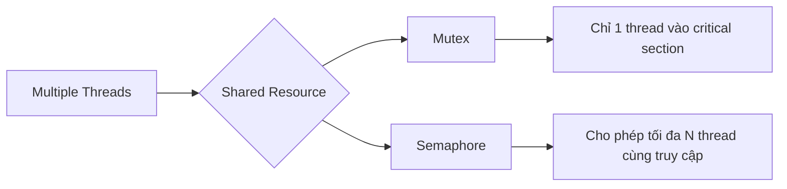
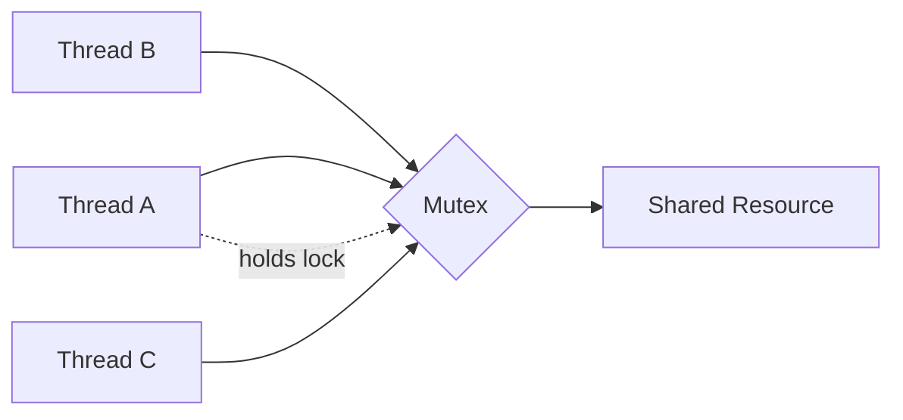
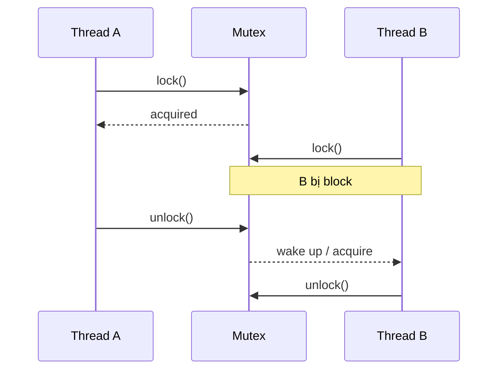
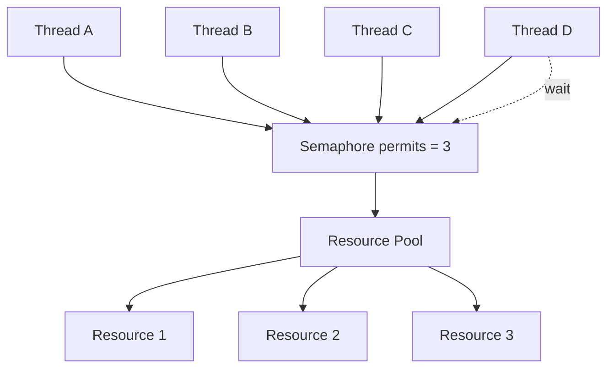
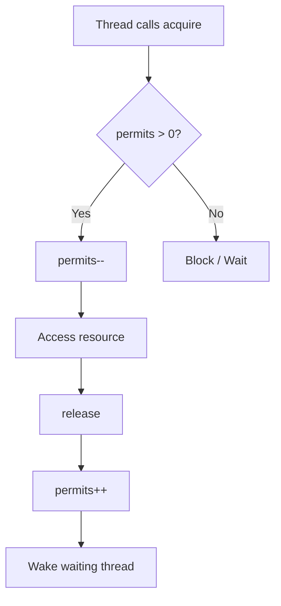
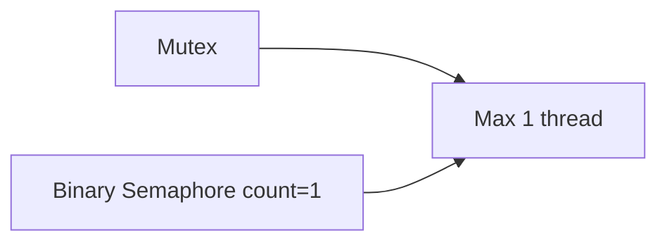
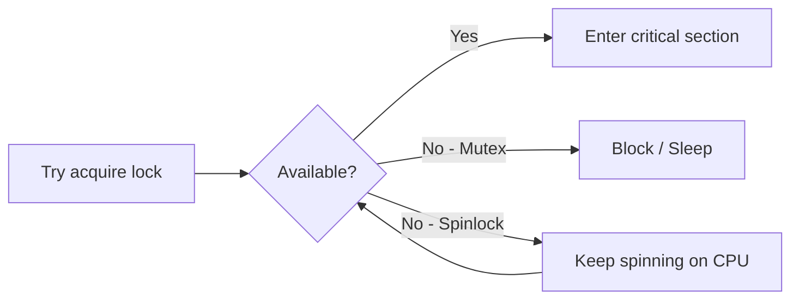
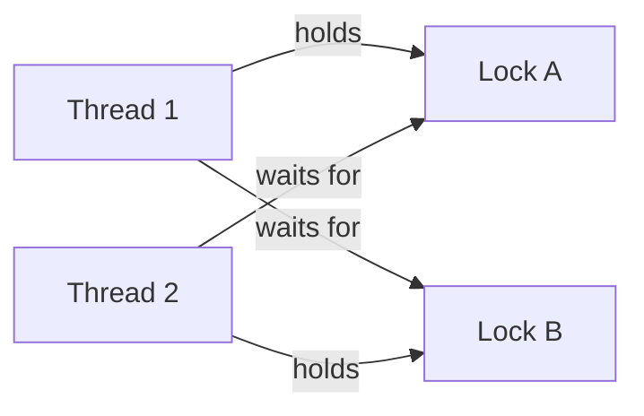
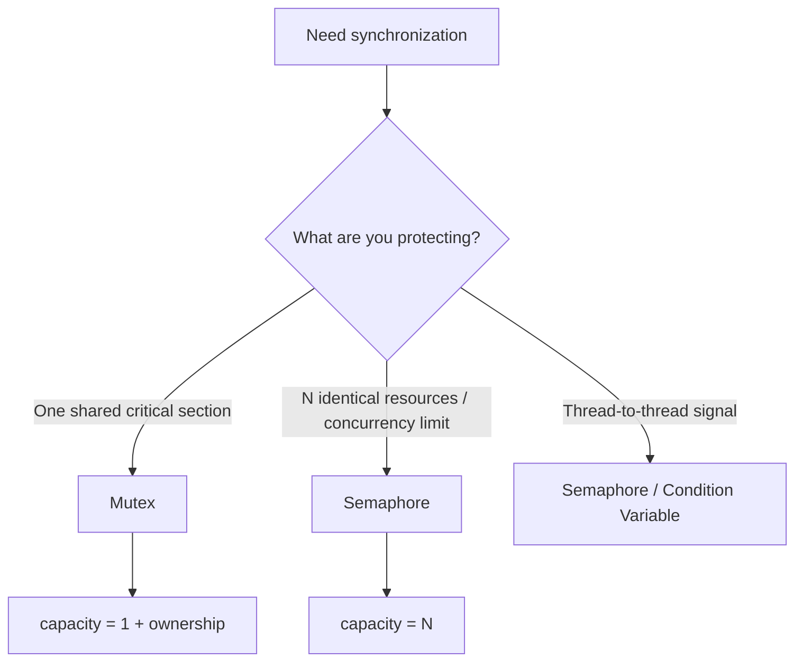

Mutex và Semaphore đều là **cơ chế synchronization** dùng để kiểm soát nhiều thread/process truy cập tài nguyên dùng chung. Chúng không hẳn là “cơ chế tránh lock”; chính xác hơn, chúng là **cơ chế khóa/phối hợp truy cập để tránh race condition**.

Một cách nhìn tổng quát:



## 1. Vấn đề mà Mutex/Semaphore giải quyết

Giả sử có biến chung:

```java
int balance = 100;
```

Hai thread cùng chạy:

```java
balance = balance - 10;
```

Ta tưởng kết quả:

```text
100 - 10 - 10 = 80
```

Nhưng câu lệnh trên thực tế gần giống:

```text
read balance
calculate balance - 10
write balance
```

Có thể xảy ra:

```text
Thread A: read 100
Thread B: read 100

Thread A: calculate 90
Thread B: calculate 90

Thread A: write 90
Thread B: write 90
```

Kết quả:

```text
90
```

thay vì:

```text
80
```

Đây là **race condition**.

Ta cần đảm bảo critical section:

```java
balance = balance - 10;
```

được truy cập theo một quy tắc nhất định.

---

# 2. Mutex là gì?

**Mutex = Mutual Exclusion.**

Ý tưởng:

> Tại một thời điểm, chỉ **một thread** được sở hữu mutex và đi vào critical section.

Hãy tưởng tượng một phòng chỉ có **1 chìa khóa**.



Nếu Thread A đã lock:

```text
Thread A
   |
 lock mutex
   |
critical section
   |
 unlock mutex
```

Thread B đến sau:

```text
Thread B
   |
 lock mutex
   |
 BLOCKED
```

cho đến khi Thread A unlock.

Flow:



Ví dụ pseudo-code:

```java
mutex.lock();

try {
    balance -= 10;
} finally {
    mutex.unlock();
}
```

Trong Java thường dùng:

```java
ReentrantLock lock = new ReentrantLock();

lock.lock();

try {
    // critical section
} finally {
    lock.unlock();
}
```

Hoặc:

```java
synchronized (object) {
    // critical section
}
```

---

# 3. Điểm rất quan trọng của Mutex: ownership

Mutex thường có khái niệm:

```text
owner
```

Thread nào lock mutex thì thread đó phải unlock.

Ví dụ:

```text
Thread A:
lock(mutex)

Thread B:
unlock(mutex)   ❌
```

Thông thường đây là hành vi không hợp lệ.

Ta có thể hình dung mutex lưu:

```text
Mutex
 ├── state: LOCKED
 └── owner: Thread A
```

Đây là một điểm khác biệt quan trọng với semaphore.

---

# 4. Semaphore là gì?

Semaphore không đơn thuần đại diện cho:

```text
locked / unlocked
```

Nó giữ một **counter**.

Ví dụ:

```text
Semaphore = 3
```

nghĩa là:

> Có tối đa 3 thread được phép truy cập resource cùng lúc.



Giả sử:

```text
Semaphore count = 3
```

Thread A gọi:

```text
acquire()
```

count:

```text
3 → 2
```

Thread B:

```text
2 → 1
```

Thread C:

```text
1 → 0
```

Thread D gọi:

```text
acquire()
```

nhưng:

```text
count = 0
```

nên Thread D phải chờ.

Khi Thread A gọi:

```text
release()
```

count tăng:

```text
0 → 1
```

Thread D có thể tiếp tục.

---

# 5. Semaphore algorithm

Về mặt conceptual:

```text
acquire():

    if permits > 0:
        permits--
        continue
    else:
        wait
```

và:

```text
release():

    permits++

    wake one waiting thread
```

Flow:



---

# 6. Ví dụ thực tế của Semaphore

Giả sử application có database connection pool:

```text
10 connections
```

Nhưng có:

```text
100 worker threads
```

Ta không muốn 100 thread cùng sử dụng DB.

Có thể dùng:

```java
Semaphore semaphore = new Semaphore(10);
```

Mỗi request:

```java
semaphore.acquire();

try {
    useDatabaseConnection();
} finally {
    semaphore.release();
}
```

Tại một thời điểm:

```text
maximum concurrent DB users = 10
```

---

# 7. Mutex vs Semaphore

Đây là phần quan trọng nhất khi interview.

|                        | Mutex               | Semaphore                        |
| ---------------------- | ------------------- | -------------------------------- |
| Mục đích chính         | Mutual exclusion    | Resource counting / coordination |
| Số thread vào cùng lúc | 1                   | N                                |
| Internal state         | locked/unlocked     | counter                          |
| Ownership              | Có                  | Thường không                     |
| Ai unlock/release      | Owner               | Có thể là thread khác            |
| Typical use            | Protect shared data | Limit concurrency                |
| Example                | shared HashMap      | DB connection pool               |

Ví dụ:

```text
Mutex

Thread A ─────┐
              │
Thread B ───> LOCK ──> Resource
              │
Thread C ─────┘

maximum = 1
```

Semaphore:

```text
Semaphore(3)

Thread A ─┐
Thread B ─┼──> Resource
Thread C ─┘

Thread D ---- WAIT

maximum = 3
```

---

# 8. Binary Semaphore

Semaphore có một trường hợp đặc biệt:

```text
Semaphore = 1
```

gọi là:

```text
Binary Semaphore
```

Nhìn bề ngoài:

```text
Mutex ≈ Binary Semaphore
```

vì cả hai đều cho tối đa 1 thread vào.



Nhưng chúng **không hoàn toàn giống nhau**.

Mutex:

```text
Thread A:
lock()

Thread A:
unlock()
```

Có ownership.

Binary semaphore:

```text
Thread A:
acquire()

Thread B:
release()
```

về mặt abstraction, điều này có thể hợp lệ vì semaphore không nhất thiết có ownership.

Do đó binary semaphore rất hữu ích cho **signaling**.

Ví dụ:

```text
Thread A:
wait until data ready

Thread B:
produce data
signal Thread A
```

---

# 9. Mutex thiên về protection

Mutex thường dùng khi bài toán là:

> Tôi có một shared object. Làm thế nào đảm bảo chỉ một thread modify nó?

Ví dụ:

```java
Map<String, Integer> map;
```

Hai thread cùng modify:

```text
Thread A
    \
     ---> HashMap
    /
Thread B
```

Ta dùng:

```java
lock.lock();

try {
    map.put(...);
} finally {
    lock.unlock();
}
```

Ý nghĩa:

```text
protect critical section
```

---

# 10. Semaphore thiên về resource management

Semaphore thường dùng khi bài toán là:

> Tôi có N resource, làm thế nào giới hạn số thread sử dụng chúng?

Ví dụ server chỉ muốn xử lý:

```text
100 requests concurrently
```

Ta có:

```java
Semaphore semaphore = new Semaphore(100);
```

Request 1 → 100:

```text
allowed
```

Request 101:

```text
wait
```

Đây là một dạng:

```text
Concurrency limiting
```

---

# 11. Một analogy rất dễ nhớ

## Mutex = phòng vệ sinh có 1 chìa khóa

Có một restroom:

```text
1 room
1 key
```

Ai cầm key thì vào.

```text
A gets key
   ↓
A uses restroom

B waits
C waits
```

A ra:

```text
A returns key
```

B mới vào.

Đây là:

```text
Mutex
```

---

## Semaphore = bãi đỗ xe

Parking lot có:

```text
3 slots
```

Semaphore:

```text
count = 3
```

Xe 1:

```text
3 → 2
```

Xe 2:

```text
2 → 1
```

Xe 3:

```text
1 → 0
```

Xe 4:

```text
WAIT
```

Xe 1 rời đi:

```text
0 → 1
```

Xe 4 đi vào.

Đây chính là semaphore.

---

# 12. Chúng có "tránh lock" không?

Điểm này nên sửa cách hiểu một chút.

Mutex và Semaphore thực tế đều có thể dẫn đến:

```text
blocking
```

Ví dụ mutex:

```text
Thread A holds lock
Thread B wants lock

B → BLOCKED
```

Semaphore:

```text
permits = 0

Thread B acquire()

B → BLOCKED
```

Nên không phải:

```text
Mutex / Semaphore
        ↓
avoid locking
```

mà là:

```text
Mutex / Semaphore
        ↓
Synchronization primitives
        ↓
coordinate concurrent execution
        ↓
prevent race conditions
```

---

# 13. Mutex/Semaphore khác Spinlock

Một điểm rất hay bị hỏi tiếp trong OS interview.

Mutex khi không lấy được lock thường:

```text
Thread
   ↓
BLOCKED
   ↓
Scheduler runs another thread
```

Spinlock:

```java
while (!tryLock()) {
    // keep spinning
}
```

Thread không sleep mà liên tục kiểm tra.



Trade-off:

```text
Mutex:
context switch overhead
but doesn't waste CPU while waiting

Spinlock:
no sleep/wakeup overhead
but wastes CPU while spinning
```

Spinlock phù hợp khi:

```text
critical section cực ngắn
```

Mutex phù hợp hơn khi:

```text
có thể phải wait lâu
```

---

# 14. Mutex vẫn có thể gây deadlock

Ví dụ hai locks:

```text
Lock A
Lock B
```

Thread 1:

```text
lock(A)
lock(B)
```

Thread 2:

```text
lock(B)
lock(A)
```

Ta có:



Không thread nào tiến tiếp:

```text
DEADLOCK
```

Semaphore cũng có thể tham gia vào các tình huống deadlock nếu acquire/release không đúng.

---

# 15. Câu trả lời phỏng vấn ngắn gọn

Nếu interviewer hỏi:

> What's the difference between a mutex and a semaphore?

Bạn có thể trả lời theo structure:

> A mutex is mainly used for mutual exclusion. It allows only one thread at a time to enter a critical section, and it normally has ownership — the thread that locks it should unlock it.
>
> A semaphore maintains a counter of permits. It can allow multiple threads to access a limited number of resources concurrently. For example, a semaphore initialized with 10 can limit a database connection pool to 10 concurrent users.
>
> A binary semaphore with one permit looks similar to a mutex, but the semantics are different because a semaphore generally doesn't have ownership and can also be used for signaling between threads.

Đây là distinction nên nhớ:

```text
Mutex
=
"Who owns this critical section?"

Semaphore
=
"How many permits/resources are available?"
```

Và mental model đơn giản nhất:



Nếu đang ôn **CS Foundation/OS cho interview**, phần nên học tiếp ngay sau Mutex/Semaphore là **Spinlock → Condition Variable → Monitor → atomic/CAS → deadlock**, vì interviewer thường nối chuỗi các khái niệm này với nhau.
