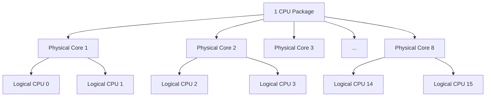
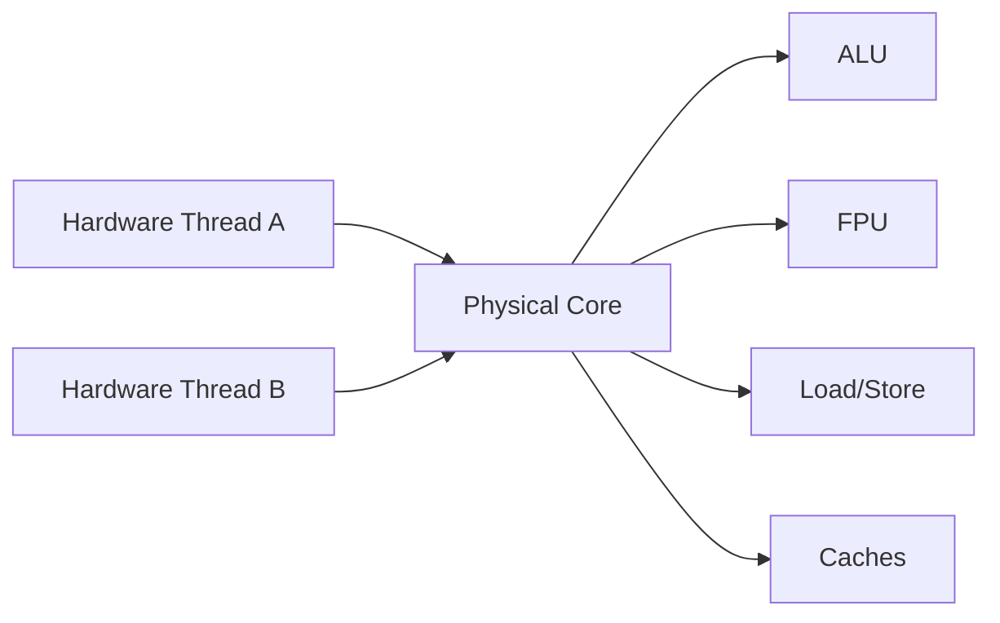
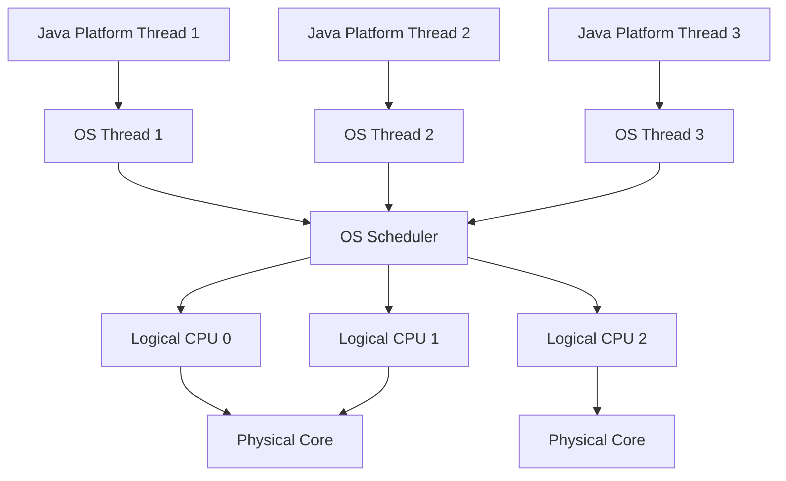
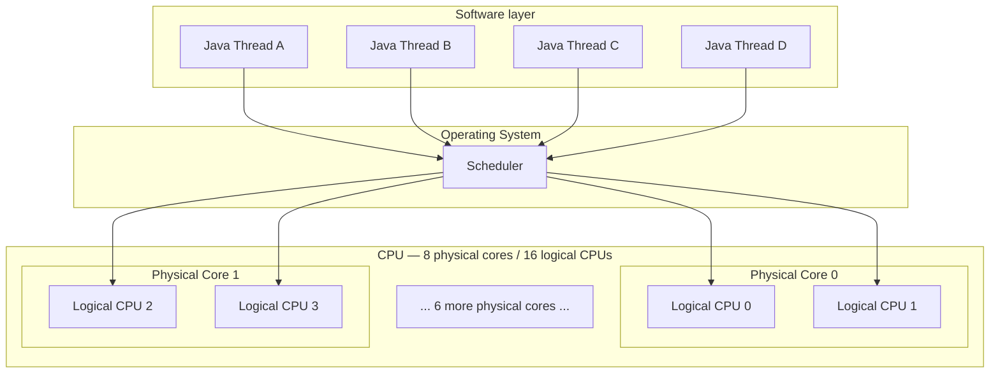

Đúng, khi thấy:

```text
8 physical cores
16 logical CPUs
```

thì trong cách nói thông thường có thể hiểu là:

> **CPU có 8 nhân vật lý, 16 luồng phần cứng**
> tức là trung bình mỗi physical core hỗ trợ **2 hardware threads** nhờ SMT/Hyper-Threading.

Nhưng cần phân biệt rất rõ: **16 logical CPUs không có nghĩa là 16 physical cores**, và cũng không phải là 16 Java threads.



## 1. Physical Core là gì?

Một **physical core** là một execution engine thực sự trong CPU.

Ví dụ một core có những tài nguyên như:

```text
Core
 ├── ALU
 ├── FPU
 ├── Load/Store units
 ├── Pipeline
 ├── L1 cache
 ├── L2 cache
 └── execution units
```

Core thực sự thực hiện instruction:

```text
ADD
MOV
LOAD
STORE
MUL
...
```

Ví dụ CPU:

```text
8 physical cores
```

nghĩa là về mặt vật lý CPU có:

```text
Core 0
Core 1
Core 2
Core 3
Core 4
Core 5
Core 6
Core 7
```

8 execution cores tương đối độc lập.

---

## 2. Logical CPU là gì?

Logical CPU là thứ mà **OS scheduler nhìn thấy như một CPU có thể schedule task lên**.

Ví dụ:

```text
Physical Core 0
   ├── Logical CPU 0
   └── Logical CPU 1
```

Đây thường là kết quả của:

```text
Intel Hyper-Threading
```

hoặc tên tổng quát:

```text
SMT
Simultaneous Multithreading
```

Với:

```text
8 cores
2 hardware threads / core
```

ta có:

```text
8 × 2 = 16 logical CPUs
```

OS có thể nhìn thấy:

```text
CPU 0
CPU 1
CPU 2
...
CPU 15
```

Và scheduler có thể schedule tối đa khoảng 16 software threads đồng thời lên 16 hardware execution contexts đó.

---

# 3. Tại sao 1 physical core lại có thể có 2 logical CPUs?

Đây là phần quan trọng nhất.

Một CPU core không phải lúc nào cũng sử dụng 100% tất cả execution units.

Ví dụ một thread đang chạy:

```text
Thread A
```

và gặp:

```text
LOAD data from memory
```

CPU phải đợi memory/cache.

Trong lúc đó một số execution units có thể đang rảnh.

Nếu core chỉ chạy một hardware thread:

```text
Core
 └── Thread A

Thread A waits for memory
       ↓
some CPU resources idle
```

SMT cho phép thêm:

```text
Thread B
```

vào cùng core.



Khi A đang không tận dụng được một số resource:

```text
A waiting
```

B có thể tận dụng chúng.

Đó chính là mục tiêu của SMT:

> **Tăng utilization của physical core.**

---

# 4. Hai logical CPUs có phải hai CPU hoàn toàn độc lập không?

Không.

Đây là điểm cực kỳ quan trọng.

Ví dụ:

```text
Core 0

Logical CPU 0
Logical CPU 1
```

Hai logical CPUs này có một số state riêng, nhưng **chia sẻ rất nhiều tài nguyên của physical core**.

Khái niệm hóa:

```text
                     Physical Core
              ┌────────────────────────┐
Logical CPU 0 │ Thread A state         │
              │ registers / context    │
              │                        │
Logical CPU 1 │ Thread B state         │
              │ registers / context    │
              │                        │
              │ ─── Shared ──────────  │
              │ ALU                    │
              │ FPU                    │
              │ execution ports        │
              │ caches                 │
              │ memory bandwidth       │
              └────────────────────────┘
```

Cho nên:

```text
2 logical CPUs
```

không tương đương:

```text
2 physical cores
```

---

# 5. So sánh dễ hiểu nhất

Giả sử physical core giống như một nhà bếp.

### Không có SMT

```text
1 kitchen
1 chef
```

Đôi lúc chef phải:

```text
wait for oven
wait for ingredients
```

Một số thiết bị trong bếp bị bỏ không.

### Có SMT

```text
1 kitchen
2 chefs
```

Chef A đang chờ lò:

```text
A → waiting
```

Chef B có thể dùng:

```text
knife
stove
other equipment
```

Hiệu suất tổng thể tăng.

Nhưng:

```text
1 kitchen + 2 chefs
```

không bằng:

```text
2 kitchens + 2 chefs
```

Vì hai chef vẫn tranh chấp:

```text
oven
stove
workspace
```

Tương tự:

```text
1 physical core + 2 hardware threads
```

không bằng:

```text
2 physical cores
```

---

# 6. Ví dụ thực tế 8 cores / 16 logical CPUs

OS có thể thấy:

```text
Logical CPU:
0 1 2 3 4 5 6 7 8 9 10 11 12 13 14 15
```

Nhưng có thể mapping như:

```text
Core 0 → CPU 0  + CPU 8
Core 1 → CPU 1  + CPU 9
Core 2 → CPU 2  + CPU 10
Core 3 → CPU 3  + CPU 11
Core 4 → CPU 4  + CPU 12
Core 5 → CPU 5  + CPU 13
Core 6 → CPU 6  + CPU 14
Core 7 → CPU 7  + CPU 15
```

Mapping chính xác phụ thuộc CPU/OS.

Ví dụ scheduler đang có 10 runnable threads:

```text
T1
T2
T3
...
T10
```

Scheduler có thể phân bố:

```text
Core 0 → T1
Core 1 → T2
Core 2 → T3
Core 3 → T4
Core 4 → T5
Core 5 → T6
Core 6 → T7
Core 7 → T8
```

8 physical cores đã có 8 threads.

Còn:

```text
T9
T10
```

có thể chạy trên sibling logical CPUs:

```text
Core 0
 ├── T1
 └── T9

Core 1
 ├── T2
 └── T10
```

---

# 7. Vậy 16 logical CPUs có nghĩa chạy được 16 threads cùng lúc không?

Ở góc nhìn scheduler:

> **Đúng, có thể có 16 software threads ở trạng thái running trên 16 logical CPUs.**

Ví dụ:

```text
Java Thread 1  → logical CPU 0
Java Thread 2  → logical CPU 1
Java Thread 3  → logical CPU 2
...
Java Thread 16 → logical CPU 15
```

Nhưng không nên hiểu rằng:

```text
16 threads
=
16 completely independent execution engines
```

Vì thực chất:

```text
16 hardware threads
↓
8 physical cores
```

Mỗi cặp sibling có thể tranh chấp resource.

---

# 8. Nếu chạy 8 CPU-bound threads thì sao?

Giả sử:

```text
8 physical cores
16 logical CPUs
```

và:

```text
8 CPU-intensive threads
```

Scheduler thường có khả năng phân bố chúng lên:

```text
Core 0 → Thread 1
Core 1 → Thread 2
...
Core 7 → Thread 8
```

Mỗi thread có gần như cả physical core.

Đây thường là tình huống rất tốt.

---

# 9. Nếu chạy 16 CPU-bound threads?

Bây giờ:

```text
Core 0
 ├── Thread 1
 └── Thread 9

Core 1
 ├── Thread 2
 └── Thread 10

...
```

Hai threads trên cùng core bắt đầu tranh chấp:

```text
execution ports
ALU
FPU
cache
memory bandwidth
```

Cho nên performance không phải:

```text
8 threads performance = 100

16 threads performance = 200
```

Mà có thể kiểu:

```text
8 threads  → 100
16 threads → 120~150
```

Con số thực tế phụ thuộc workload và CPU.

SMT chủ yếu tăng **throughput**, chứ không nhân đôi sức mạnh core.

---

# 10. CPU-bound và I/O-bound khác nhau rất nhiều

Giả sử Java application có:

```text
8 cores
16 logical CPUs
```

### CPU-bound

Ví dụ:

```java
while (...) {
    calculate();
    calculate();
    calculate();
}
```

Các thread liên tục cần CPU.

Có:

```text
100 threads
```

sẽ không làm CPU nhanh hơn.

Thực tế:

```text
16 logical CPUs
```

nhưng:

```text
100 runnable threads
```

thì OS phải liên tục:

```text
T1
T2
...
T16
↓
context switch
↓
T17
T18
...
```

Quá nhiều threads có thể làm performance giảm.

---

### I/O-bound

Ví dụ:

```java
requestDatabase();
requestHTTP();
readFile();
```

Thread thường:

```text
run
↓
wait I/O
↓
sleep/block
↓
run
```

Do đó dù CPU có:

```text
16 logical CPUs
```

application vẫn có thể có:

```text
100
500
1000
```

threads, bởi rất nhiều thread đang blocked chứ không tranh CPU cùng lúc.

Đây cũng là một trong những lý do virtual threads rất hữu ích cho I/O-heavy workloads.

---

# 11. Liên hệ với Java Platform Thread

Flow sẽ như sau:



Quan hệ cần nhớ:

```text
Java Platform Thread
        ↓
OS Thread
        ↓
OS Scheduler
        ↓
Logical CPU / Hardware Thread
        ↓
Physical Core
        ↓
Execution units
```

Đây là layer rất quan trọng.

---

# 12. "Hardware thread", "logical CPU", "logical core" có giống nhau không?

Trong nhiều tài liệu người ta dùng gần như tương đương:

```text
hardware thread
logical processor
logical CPU
logical core
```

Ví dụ:

```text
8 cores / 16 threads
```

nghĩa là:

```text
8 physical cores
16 hardware threads
16 logical CPUs visible to OS
```

Tuy nhiên nên hạn chế nói:

```text
16 software threads
```

vì Java Thread / pthread / OS thread là một khái niệm khác.

---

# 13. Một cách phân biệt cực kỳ quan trọng

Hãy chia thành ba layer:

```text
Software Thread
    ↓
Hardware Thread
    ↓
Physical Core
```

Ví dụ:

```text
Java Thread
    ↓
OS Thread
    ↓ scheduled onto
Logical CPU / Hardware Thread
    ↓ belongs to
Physical CPU Core
```

### Software thread

Ví dụ:

```java
new Thread(...)
```

Có thể có:

```text
1000 Java threads
```

### Hardware thread / logical CPU

Hardware cung cấp cố định:

```text
16 logical CPUs
```

### Physical core

Silicon thực sự:

```text
8 physical cores
```

Nên hoàn toàn có thể có:

```text
1000 Java threads
16 logical CPUs
8 physical cores
```

OS scheduler sẽ multiplex 1000 software threads lên 16 logical CPUs.

---

# 14. Đây cũng giải thích `availableProcessors()`

Trong Java:

```java
Runtime.getRuntime().availableProcessors()
```

trên máy:

```text
8 physical cores
16 logical CPUs
```

thường có thể trả về:

```text
16
```

chứ không nhất thiết là `8`.

Vì Java/OS thường quan tâm:

> Có bao nhiêu **logical processors** khả dụng để scheduler chạy task?

---

# 15. Một sơ đồ tổng thể nên nhớ



Điểm cốt lõi là:

```text
Logical CPU 0 + Logical CPU 1
```

có thể chạy hai execution streams cùng lúc, **nhưng chúng vẫn thuộc cùng một physical core và chia sẻ tài nguyên thực thi**.

---

## Công thức bạn có thể ghi nhớ

Với CPU SMT 2-way:

```text
Logical CPUs
=
Physical cores × Hardware threads per core
```

Ví dụ:

```text
8 physical cores
×
2 hardware threads/core
=
16 logical CPUs
```

Nhưng về performance:

```text
8 cores / 16 threads
≠
16 cores
```

Mà nên hình dung:

```text
Physical Core
= sức mạnh tính toán chính

Logical CPU / SMT
= cơ chế giúp tận dụng physical core tốt hơn
```

Và ở góc nhìn scheduler:

```text
16 logical CPUs
→ OS có 16 execution contexts để đặt runnable OS threads lên
```

Trong khi ở góc nhìn hardware:

```text
16 logical CPUs
→ cuối cùng vẫn dùng execution resources của 8 physical cores.
```

Đây chính là nền tảng để hiểu tiếp **vì sao OS scheduler thường ưu tiên trải threads ra các physical cores trước rồi mới dùng sibling SMT thread**, và cũng giải thích vì sao `thread pool size = number of CPUs` không đơn giản chỉ là nhìn số core vật lý.
