# Bài giảng Redis — từ nền tảng đến Production & Interview

Mình sẽ học Redis theo một mental model xuyên suốt:

```text
Redis
   ↓
In-memory data structure server
   ↓
Fast access + atomic operations
   ↓
Cache / Counter / Lock / Queue / Stream / Leaderboard...
   ↓
Nhưng phải xử lý:
TTL
Eviction
Persistence
Replication
Failover
Consistency
Hot key
Big key
Cache stampede
Distributed locking
```

Điểm quan trọng nhất: **đừng học Redis dưới dạng danh sách command**. Khi phỏng vấn, interviewer thường quan tâm hơn đến câu hỏi:

> “Tại sao Redis làm được điều đó, failure mode là gì, và trade-off ra sao?”

---

# 1. Redis là gì?

Redis thường được mô tả là:

> In-memory key-value store.

Nhưng cách mô tả này hơi thiếu.

Mental model tốt hơn là:

> **Redis là một in-memory data structure server.**

Value của Redis không chỉ là String. Redis có những structure native như String, Hash, List, Set, Sorted Set, Stream, Bitmap, HyperLogLog, Geospatial và các loại khác. ([Redis][1])

Ví dụ:

```text
"user:100"
        ↓
    Redis Key
        ↓
┌──────────────────┐
│ Hash             │
│ name = "Quan"    │
│ age  = 23        │
│ city = "Hanoi"   │
└──────────────────┘
```

Redis khác database truyền thống ở điểm dữ liệu hoạt động chủ yếu trong memory:

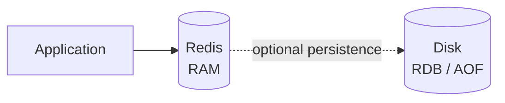

Do đó Redis thường được dùng cho:

```text
Cache
Session
Rate limiting
Distributed lock
Counters
Leaderboards
Queues
Event streams
Idempotency
Real-time state
```

---

# 2. Redis nằm ở đâu trong backend architecture?

Một architecture rất phổ biến:

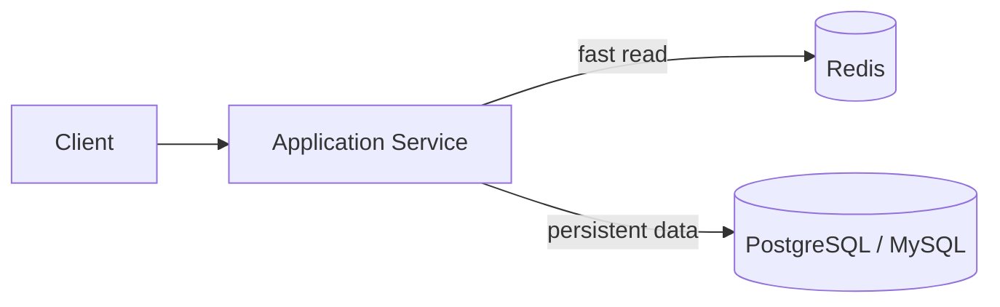

Ví dụ request:

```text
GET /products/123
```

Backend có thể làm:

```text
Redis có product?
        |
   +----+----+
   |         |
  Yes        No
   |         |
return     query DB
             |
          save Redis
             |
           return
```

Đây là **cache-aside pattern**, chúng ta sẽ phân tích kỹ sau.

---

# 3. Vì sao Redis nhanh?

Một câu trả lời interview yếu là:

> Redis nhanh vì chạy trên RAM.

Không sai, nhưng chưa đủ.

Một câu trả lời tốt hơn nên chia thành nhiều nguyên nhân.

## 3.1 Memory access

Database truyền thống thường phải tương tác với storage:

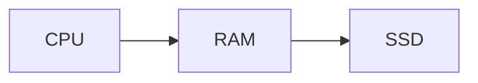

Redis giữ working dataset trong RAM nên phần lớn operation tránh storage I/O trên request path.

Nhưng đây mới chỉ là một phần.

---

# 4. Redis execution model

Đây là phần cực kỳ quan trọng.

Redis sử dụng mô hình **mostly single-threaded cho command execution**. Client requests được multiplex và các command được xử lý tuần tự trên main execution path. Redis hiện đại vẫn sử dụng thêm threads cho network I/O và background tasks; từ Redis 6, I/O threading có thể hỗ trợ socket read/write trong khi command execution vẫn chủ yếu được xử lý theo mô hình tuần tự. ([Redis][2])

Mental model:

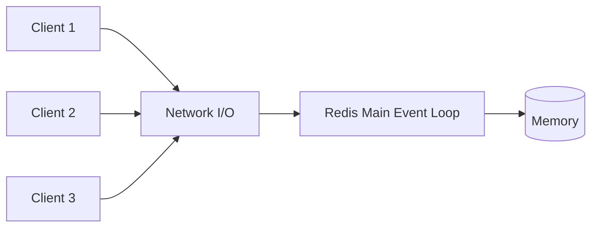

Giả sử:

```text
Client A: INCR counter
Client B: SET user:1 Quan
Client C: GET product:10
```

Execution có thể là:

```text
INCR counter
       ↓
SET user:1 Quan
       ↓
GET product:10
```

Không phải:

```text
INCR ─────┐
SET ──────┼── chạy đồng thời rồi tranh nhau memory
GET ──────┘
```

---

# 5. Tại sao single-thread lại có thể nhanh?

Đây là một câu phỏng vấn rất hay.

Thoạt nhìn:

```text
single thread
→ ít parallelism
→ phải chậm?
```

Nhưng Redis workload thường là:

```text
GET
SET
INCR
HGET
ZADD
...
```

Các operation này rất ngắn.

Redis đổi lại:

```text
Không cần nhiều synchronization giữa command execution
Không phải lock/unlock shared structures liên tục
Ít context switching
Data nằm trong memory
Event-driven non-blocking I/O
Data structures được tối ưu
```

Redis docs nhấn mạnh rằng single-threaded command path giúp tránh nhiều synchronization overhead, nhưng đồng thời một slow command có thể block các client khác. ([Redis][2])

Đây chính là trade-off:

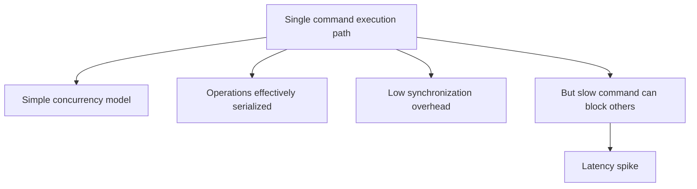

---

# 6. Một command Redis đi qua hệ thống như thế nào?

Ví dụ:

```text
GET user:123
```

Flow:

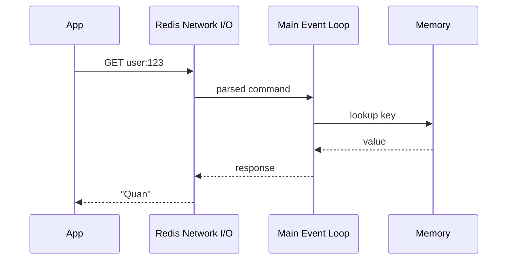

Điểm cần hiểu:

```text
Network latency
+
command processing
+
serialization/deserialization
```

mới tạo thành latency cuối cùng.

Đó là lý do pipeline có thể quan trọng dù bản thân `GET` cực nhanh.

---

# 7. Redis Key-Value model

Redis lưu:

```text
key → value
```

Ví dụ:

```text
user:123:name → "Quan"
```

Convention thường dùng:

```text
domain:id:field
```

Ví dụ:

```text
user:123
product:381
cart:user:123
session:abcxyz
order:10002
```

Việc đặt key tốt rất quan trọng vì Redis không có relational schema giống SQL.

---

# 8. Redis String

String là data type cơ bản nhất.

Ví dụ:

```bash
SET user:1:name "Quan"

GET user:1:name
```

String không nhất thiết chỉ chứa text. Nó có thể chứa:

```text
string
integer
JSON serialized
binary
```

Một đặc tính cực hữu ích:

```bash
INCR page:view
```

Redis tự xem value như integer.

Ví dụ:

```text
counter = 10

INCR counter

counter = 11
```

Use cases:

```text
cache object
counter
session token
feature flag
rate limiter
distributed lock
idempotency key
```

---

# 9. Atomicity của Redis command

Giả sử hai client đồng thời:

```text
counter = 10
```

Client A:

```bash
INCR counter
```

Client B:

```bash
INCR counter
```

Vì command execution được serialize:

```text
counter = 10

Client A
INCR
→ 11

Client B
INCR
→ 12
```

Không xảy ra:

```text
A read 10
B read 10

A write 11
B write 11
```

Đây là một trong những lý do Redis rất thích hợp cho counters.

---

# 10. Redis Hash

Hash giống:

```text
Map<String, String>
```

Ví dụ:

```bash
HSET user:123 name Quan age 23 city Hanoi
```

Structure:

```text
user:123
   ↓
{
    name: "Quan",
    age: "23",
    city: "Hanoi"
}
```

Get:

```bash
HGET user:123 name
```

Get nhiều field:

```bash
HMGET user:123 name city
```

Use case:

```text
User profile
Product attributes
Configuration
Session metadata
```

Thay vì:

```text
user:123:name
user:123:age
user:123:city
```

có thể dùng:

```text
user:123
     ↓
Hash
```

Redis tự sử dụng các internal encodings tiết kiệm memory cho object nhỏ và có thể chuyển sang representation tổng quát hơn khi structure lớn lên; ví dụ Hash nhỏ có thể dùng listpack, Set integer nhỏ có thể dùng intset, List dùng quicklist, Sorted Set lớn có thể dùng skiplist representation. ([Redis][3])

---

# 11. Redis List

List là ordered sequence:

```text
[A, B, C, D]
```

Commands:

```bash
LPUSH queue A
RPUSH queue B

LPOP queue
RPOP queue
```

Ví dụ:

```text
LPUSH
   ↓

[C][B][A]

       ↑
      RPOP
```

Ta có thể sử dụng nó như:

```text
Stack
Queue
```

Ví dụ queue:

```text
Producer
RPUSH jobs job1

Consumer
LPOP jobs
```


Nhưng production messaging system thường cần nhiều semantics hơn:

```text
acknowledgement
retry
consumer group
pending message
recovery
```

Khi đó Redis Streams thường phù hợp hơn List.

---

# 12. Redis Set

Set là:

```text
unordered unique collection
```

Ví dụ:

```bash
SADD online_users 100
SADD online_users 200
SADD online_users 100
```

Result:

```text
{100, 200}
```

Duplicate không được thêm.

Operations rất hữu ích:

```text
membership
union
intersection
difference
```

Ví dụ:

```text
users_follow_java
users_follow_spring
```

Muốn tìm người follow cả hai:

```bash
SINTER java_users spring_users
```

Use cases:

```text
unique visitors
tags
permissions
followers
membership checking
```

---

# 13. Sorted Set — một data structure rất quan trọng

Sorted Set:

```text
member + score
```

Ví dụ leaderboard:

```text
Alice → 100
Bob   → 80
John  → 120
```

Redis sẽ maintain order:

```text
John   120
Alice  100
Bob     80
```

Commands:

```bash
ZADD leaderboard 100 Alice
ZADD leaderboard 80 Bob
ZADD leaderboard 120 John
```

Get top:

```bash
ZREVRANGE leaderboard 0 9 WITHSCORES
```

Sorted Set chính thức được thiết kế như collection các member unique được sắp theo score và rất thích hợp cho leaderboard cũng như sliding-window rate limiting. ([Redis][4])

Mental model:

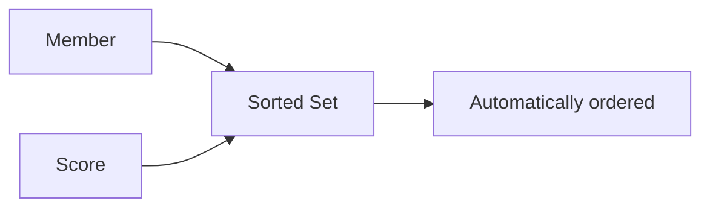

---

# 14. Một use case cực hay: Sliding Window Rate Limiter

Ta muốn:

```text
Maximum 100 requests / minute / user
```

Có thể dùng ZSet:

```text
key:

rate:user:123
```

Mỗi request:

```text
score = timestamp
member = request-id
```

Flow:

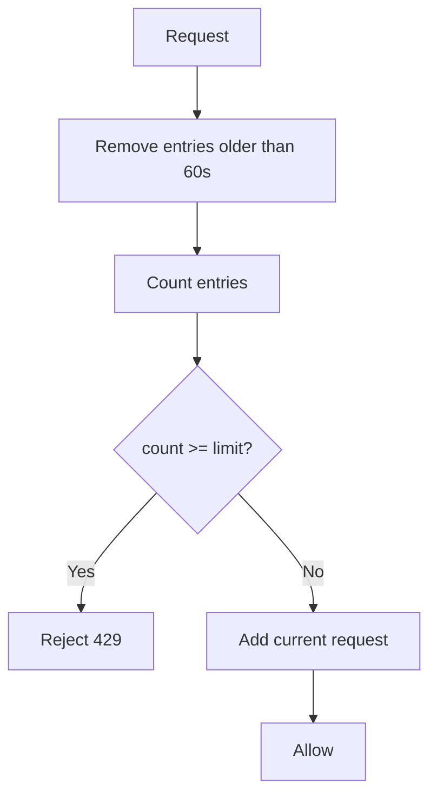

Ví dụ conceptual:

```bash
ZREMRANGEBYSCORE rate:user:123 0 now-60000

ZCARD rate:user:123

ZADD rate:user:123 now request-id
```

Nhưng có một vấn đề:

```text
REMOVE
COUNT
ADD
```

là ba command.

Client khác có thể chen giữa chúng.

Ta cần:

```text
MULTI/EXEC
hoặc
Lua script / server-side atomic operation
```

Đây chính là kiểu mở rộng interviewer rất thích.

---

# 15. TTL — Time To Live

Redis cho phép key tự expire.

Ví dụ:

```bash
SET session:abc data EX 3600
```

Có nghĩa:

```text
session:abc
TTL = 3600 seconds
```

Sau một giờ:

```text
key disappears
```

TTL có thể kiểm tra:

```bash
TTL session:abc
```

Redis expiration có độ phân giải millisecond và lưu expiry dưới dạng thời điểm tuyệt đối. ([Redis][5])

---

# 16. Redis xóa expired key như thế nào?

Một hiểu nhầm là:

> Redis tạo timer cho từng key.

Không phải vậy.

Redis kết hợp hai cơ chế.

## Passive expiration

Nếu:

```text
GET user:1
```

Redis phát hiện:

```text
expired
```

thì delete.

Flow:

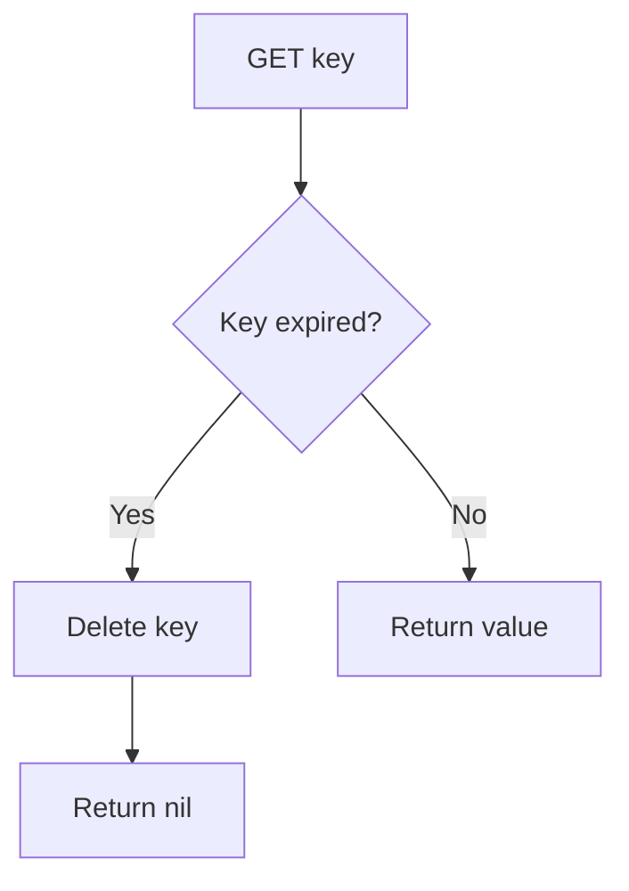

## Active expiration

Nếu key expired nhưng không ai đọc nó thì passive expiration chưa đủ.

Redis định kỳ sample những key có TTL và remove key đã hết hạn. ([Redis][5])

---

# 17. Expiration khác Eviction

Đây là câu rất dễ bị nhầm.

### Expiration

Application nói:

```text
key này sống 60 giây
```

Sau 60s:

```text
Redis remove
```

### Eviction

Redis bị memory pressure:

```text
used memory > maxmemory
```

Redis phải chọn:

```text
key nào để remove?
```

Flow:

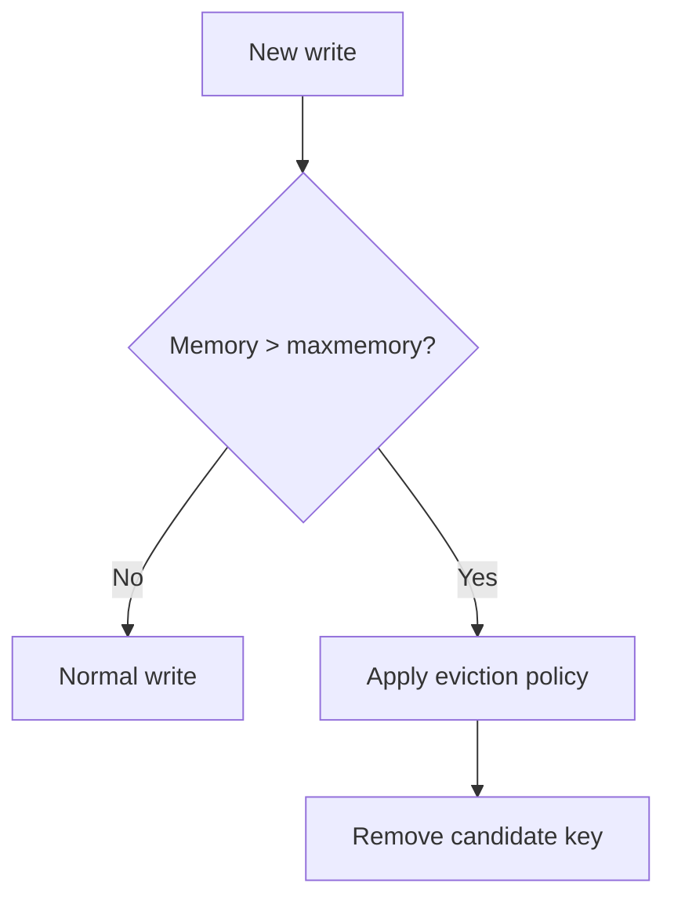

Redis Open Source cung cấp nhiều `maxmemory-policy`, gồm `noeviction`, `allkeys-lru`, `allkeys-lfu`, random và các biến thể `volatile-*` chỉ xét key có TTL. Redis dùng approximate LRU/LFU thay vì duy trì exact LRU để giảm overhead. ([Redis][6])

---

# 18. LRU vs LFU

## LRU

Least Recently Used:

```text
key cuối cùng được access khi nào?
```

Ví dụ:

```text
A → 1 second ago
B → 20 minutes ago
C → 5 seconds ago
```

Candidate:

```text
B
```

## LFU

Least Frequently Used:

```text
key được dùng bao nhiêu lần?
```

Ví dụ:

```text
A → 1000 accesses
B → 3
C → 800
```

Candidate:

```text
B
```

Mental distinction:

```text
LRU
→ recency

LFU
→ frequency
```

---

# 19. Cache-aside pattern

Đây là pattern bạn gần như chắc chắn nên biết khi phỏng vấn backend.

Flow:

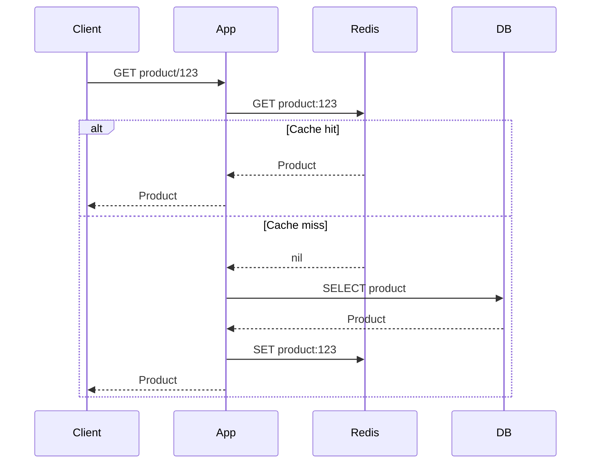

Pseudo-code:

```java
Product product = redis.get(key);

if (product != null) {
    return product;
}

product = repository.findById(id);

redis.set(key, product);

return product;
```

---

# 20. Cache hit và cache miss

Cache hit:

```text
Redis contains key
```

```text
Application
    ↓
Redis
    ↓
return
```

Rất nhanh.

Cache miss:

```text
Application
    ↓
Redis miss
    ↓
Database
    ↓
Redis update
    ↓
return
```

Tỷ lệ:

```text
Cache Hit Rate =
cache hits /
(cache hits + cache misses)
```

Là metric rất quan trọng.

---

# 21. Cache invalidation — vấn đề khó nhất của caching

Giả sử:

```text
DB product price = $10
Redis            = $10
```

User update:

```text
price = $20
```

Bây giờ phải đảm bảo cache không tiếp tục trả:

```text
$10
```

Một strategy phổ biến:

```text
Update DB
    ↓
Delete cache
```

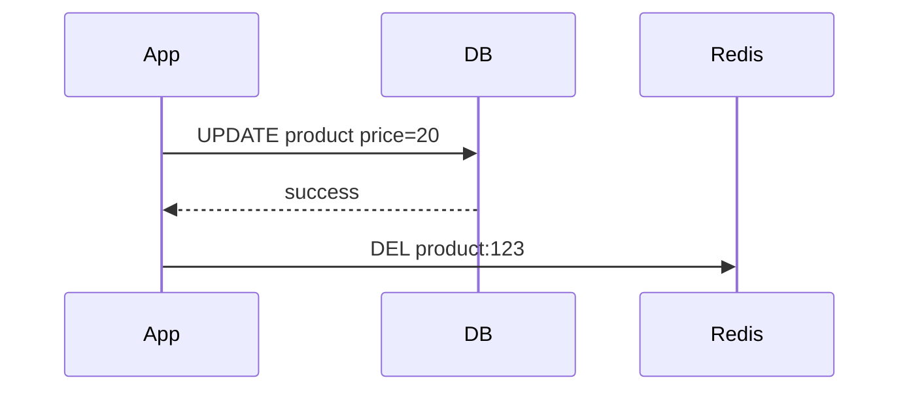

Request tiếp theo:

```text
cache miss
→ DB
→ load $20
→ cache
```

---

# 22. Tại sao DELETE cache thường tốt hơn UPDATE cache?

Giả sử update DB thành công:

```text
DB = newValue
```

Nếu application cố:

```text
UPDATE Redis
```

ta đang maintain cùng một state ở hai nơi:

```text
Database
Redis
```

Delete đơn giản hơn:

```text
DB = source of truth

cache miss
→ reconstruct Redis
```

Do đó pattern:

```text
Write DB
↓
Invalidate cache
```

rất phổ biến.

---

# 23. Cache penetration

Giả sử attacker liên tục request:

```text
product id = -999999
```

Redis:

```text
MISS
```

DB:

```text
MISS
```

Request sau:

```text
Redis MISS
DB MISS
```

Database tiếp tục bị hit.

Flow:

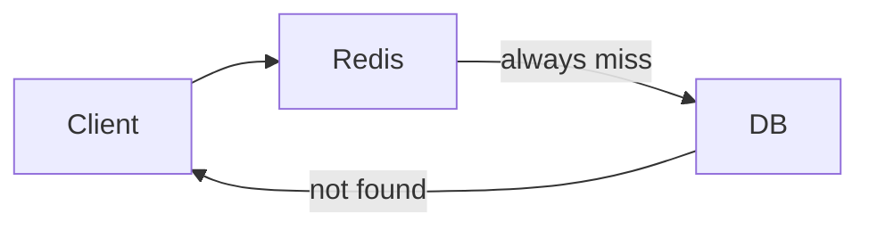

Một solution:

```text
cache negative result
```

Ví dụ:

```text
product:-999 → NULL
TTL = 30 seconds
```

Ngoài ra có thể dùng Bloom filter trong một số architecture.

---

# 24. Cache stampede

Đây là failure mode cực quan trọng.

Giả sử một hot key:

```text
product:iphone
```

có:

```text
100,000 requests/s
```

Key hết TTL.

Ngay lập tức:

```text
100,000 cache miss
```

Sau đó:

```text
100,000 query DB
```

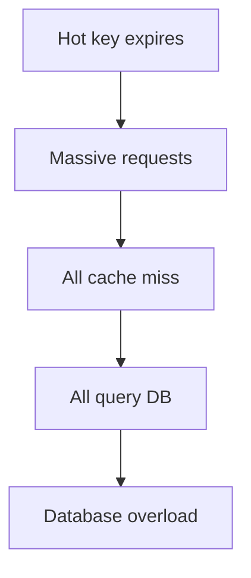

Đây gọi là:

```text
Cache Stampede
```

hoặc:

```text
Thundering Herd
```

---

# 25. Cách chống Cache Stampede

Một giải pháp là locking:

```text
Cache miss

try lock
    |
    +--- acquired
    |       |
    |     query DB
    |       |
    |     populate cache
    |
    +--- failed
            |
           wait/retry
```

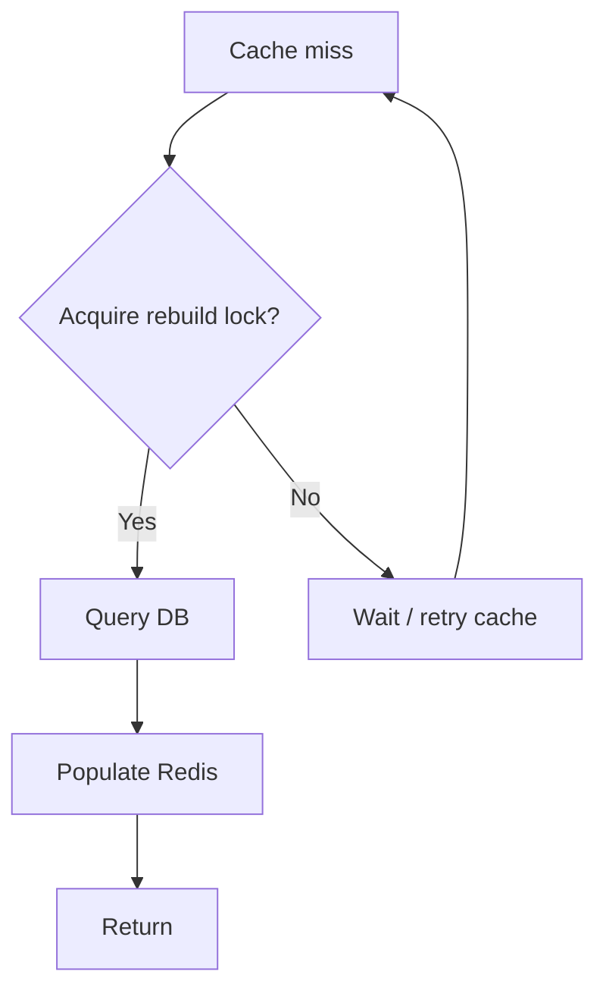

Các kỹ thuật khác:

```text
TTL jitter
stale-while-revalidate
refresh-ahead
request coalescing
```

---

# 26. Cache avalanche

Stampede thường liên quan đến một hoặc vài hot keys.

Avalanche là khi:

```text
rất nhiều keys expire gần cùng lúc
```

Ví dụ:

```text
100k cache entries

TTL tất cả = 1 hour
```

Đúng 1 giờ sau:

```text
100k entries expire
```

DB bị spike.

Một kỹ thuật phổ biến:

```text
baseTTL + random jitter
```

Ví dụ:

```text
TTL = 3600 + random(0..600)
```

Keys expire dàn ra theo thời gian.

---

# 27. Hot Key

Một key:

```text
product:iphone-18
```

chiếm phần lớn traffic:

```text
500k GET/s
```

Trong Redis Cluster, key chỉ thuộc một shard.

Do đó:

```text
Cluster có 10 nodes
```

không đồng nghĩa:

```text
hot key được chia 10 nodes
```

Key vẫn nằm trên **một shard**.

Flow:

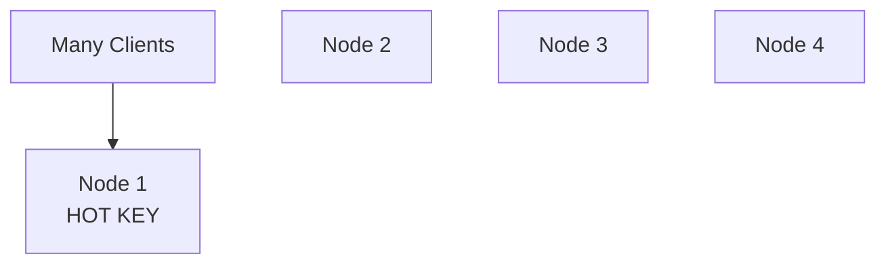

Đây là một ví dụ rất quan trọng về:

> Horizontal scaling không tự động giải quyết mọi bottleneck.

---

# 28. Big Key

Một key có thể quá lớn.

Ví dụ:

```text
user:followers
```

chứa:

```text
10 million members
```

Operation kiểu:

```bash
SMEMBERS user:followers
```

có thể rất đắt.

Vì Redis command execution path chủ yếu tuần tự, một command O(N) lớn có thể khiến client khác phải chờ. Redis docs đặc biệt cảnh báo slow commands có thể tạo latency spike vì command processing không chạy song song tùy ý. ([Redis][2])

Mental model:

```text
Command A: O(1)
0.1ms

Command B: O(N)
500ms
```

Execution:

```text
B running ─────────────────── 500ms

A
A
A
A
A
   all waiting
```

---

# 29. Vì vậy Complexity của Redis command rất quan trọng

Ví dụ:

```text
GET
O(1)

SET
O(1)

HGET
O(1)

SISMEMBER
O(1)
```

Nhưng một số command:

```text
KEYS *
SMEMBERS huge_set
LRANGE huge list
ZRANGE massive range
```

có thể trở nên expensive.

Một nguyên tắc production:

> Đừng chỉ hỏi “Redis có command này không?”. Hãy hỏi thêm **complexity của command trên cardinality thực tế là bao nhiêu?**

---

# 30. KEYS vs SCAN

Ví dụ:

```bash
KEYS user:*
```

Có thể phải scan toàn bộ keyspace.

Production thường ưu tiên:

```bash
SCAN
```

vì traversal incremental hơn.

Mental model:

```text
KEYS
→ give me everything now

SCAN
→ give me chunks progressively
```

---

# 31. Pipelining

Giả sử application cần chạy:

```text
100 commands
```

Không pipeline:

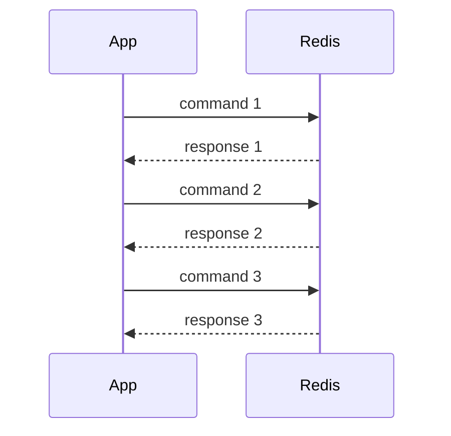

Nếu mỗi RTT:

```text
1ms
```

100 commands gần như phải trả nhiều lần cost network round-trip.

Pipeline:

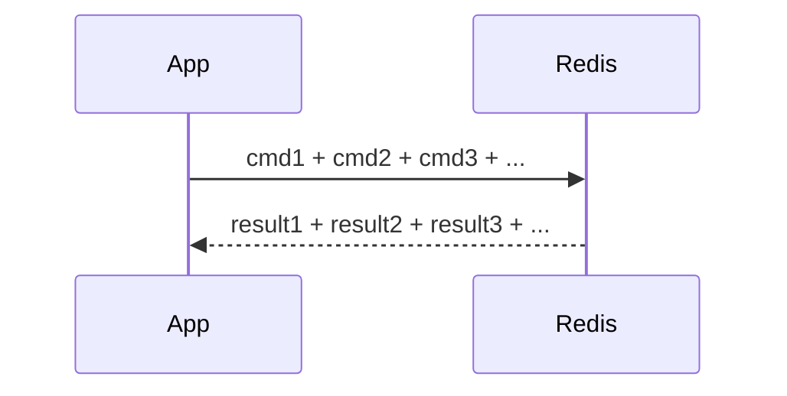

Redis pipelining cho phép client gửi nhiều command mà không phải chờ từng response, qua đó giảm đáng kể RTT overhead. Tuy nhiên server phải buffer replies nên pipeline cực lớn cũng làm tăng memory usage; docs khuyến nghị batching hợp lý thay vì gửi vô hạn commands một lần. ([Redis][7])

---

# 32. Pipeline không có nghĩa là transaction

Đây là distinction rất quan trọng.

Pipeline:

```text
optimize network
```

Transaction:

```text
atomic group execution
```

Pipeline:

```text
cmd A
cmd B
cmd C
```

Redis vẫn có thể xử lý theo semantics command thông thường.

Transaction:

```text
MULTI
A
B
C
EXEC
```

A B C được thực thi thành một uninterrupted transaction block. ([Redis][8])

---

# 33. Redis Transaction

Commands:

```bash
MULTI

SET a 1
INCR b

EXEC
```

Flow:

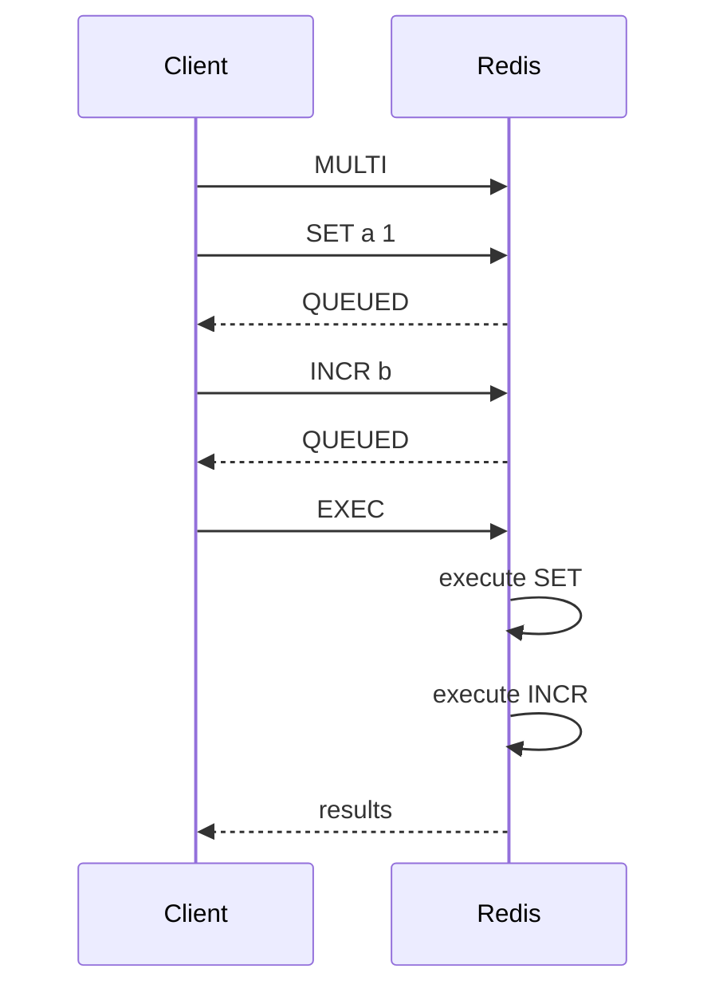

Redis bảo đảm commands trong transaction được serialize và không có command của client khác chen vào giữa execution block. ([Redis][8])

---

# 34. Nhưng Redis Transaction không giống PostgreSQL Transaction

Đây là câu interviewer rất thích.

SQL:

```sql
BEGIN;

UPDATE A;
UPDATE B;

ROLLBACK;
```

Redis không có rollback kiểu database relational.

Ví dụ nếu một command fail sau `EXEC`, các command khác vẫn có thể được thực thi. Redis docs nói rõ Redis Transactions không hỗ trợ rollback. ([Redis][8])

Vì vậy:

```text
Redis MULTI/EXEC
≠
full ACID transaction giống PostgreSQL
```

---

# 35. WATCH — optimistic locking

Giả sử:

```text
balance = 100
```

Client A:

```text
GET balance → 100
```

Client B:

```text
GET balance → 100
```

Cả hai tính:

```text
100 - 50 = 50
```

Sau đó cùng:

```text
SET balance 50
```

Lost update.

Redis cung cấp:

```bash
WATCH balance
```

Flow:

```mermaid
flowchart TD

    A[WATCH balance]

    B[GET balance]

    C[Compute new value]

    D[MULTI]

    E[SET balance]

    F[EXEC]

    G{Key changed since WATCH?}

    H[Abort]

    I[Commit]

    A --> B --> C --> D --> E --> F --> G

    G -->|Yes| H
    G -->|No| I
```

`WATCH` tạo optimistic concurrency control: nếu watched key thay đổi trước `EXEC`, transaction bị abort. ([Redis][8])

---

# 36. Lua Script

Một trường hợp khác:

```text
GET
compute
SET
```

Nếu làm từ client:

```text
Client → GET
Redis → result

Client computes

Client → SET
```

Có race window.

Redis Lua script có thể:

```text
execute logic server-side
```

Ví dụ conceptual:

```lua
local value = redis.call("GET", KEYS[1])

if tonumber(value) > 0 then
    return redis.call("DECR", KEYS[1])
end

return -1
```

Đây rất hữu ích khi cần:

```text
read
↓
business decision
↓
write
```

được thực hiện như một atomic server-side operation.

---

# 37. Persistence — Redis có mất dữ liệu khi restart không?

Câu trả lời:

> Depends on persistence configuration.

Redis cung cấp hai strategy chính:

```text
RDB
AOF
```

và có thể kết hợp cả hai. ([Redis][9])

---

# 38. RDB Snapshot

RDB:

```text
Point-in-time snapshot
```

Ví dụ:

```text
Memory at 12:00
        ↓
dump.rdb
```

```mermaid
flowchart LR

    Redis[(Redis RAM)]

    Snapshot[Snapshot]

    File[(dump.rdb)]

    Redis --> Snapshot --> File
```

Redis thường `fork()` child process để tạo snapshot, tận dụng copy-on-write semantics. ([Redis][9])

---

# 39. RDB trade-off

Ưu điểm:

```text
compact
backup dễ
restore nhanh
```

Nhược điểm:

```text
snapshot định kỳ
→ crash giữa hai snapshot
→ có thể mất dữ liệu gần nhất
```

Ví dụ:

```text
snapshot 12:00

writes:
12:01
12:02
12:03

crash 12:04
```

Nếu snapshot gần nhất 12:00:

```text
12:01–12:04 có nguy cơ mất
```

RDB phù hợp khi:

```text
small data-loss window acceptable
```

Redis docs cũng mô tả RDB có recovery nhanh và file compact nhưng không tối ưu nếu mục tiêu là giảm tối đa data-loss window. ([Redis][9])

---

# 40. AOF — Append Only File

AOF log các write operations.

Ví dụ:

```text
SET a 1
INCR counter
HSET user:1 name Quan
```

file:

```text
appendonly.aof
```

Khi restart:

```text
Replay write commands
        ↓
Reconstruct state
```

```mermaid
flowchart LR

    App --> Redis

    Redis --> Memory[(Memory)]

    Redis --> AOF[(Append Only File)]

    AOF -->|restart replay| Memory
```

Redis hiện dùng multi-part AOF, với base file và incremental files kể từ Redis 7.0. ([Redis][9])

---

# 41. AOF fsync policies

Có thể hình dung:

```text
appendfsync always
appendfsync everysec
appendfsync no
```

### always

```text
write
↓
fsync
↓
ack
```

Durability cao hơn nhưng latency/write cost cao.

### everysec

```text
writes
↓
buffer
↓
fsync khoảng mỗi second
```

Trade-off cân bằng.

### no

OS quyết định khi nào flush.

Trade-off nghiêng mạnh về performance.

---

# 42. RDB vs AOF

|             | RDB          | AOF            |
| ----------- | ------------ | -------------- |
| Model       | Snapshot     | Write log      |
| Durability  | thấp hơn     | cao hơn        |
| File        | compact      | lớn hơn        |
| Restart     | thường nhanh | replay lâu hơn |
| Disk I/O    | periodic     | continuous     |
| Typical use | backup       | durability     |

Redis docs khuyến nghị có thể kết hợp cả hai nếu cần độ an toàn dữ liệu tốt hơn. ([Redis][9])

---

# 43. Redis Replication

Architecture:

```mermaid
flowchart TD

    M[(Primary)]

    R1[(Replica 1)]
    R2[(Replica 2)]

    M --> R1
    M --> R2
```

Thông thường:

```text
Writes
→ Primary

Replication stream
→ Replicas
```

Replica cố duy trì copy của primary và có thể partial-resynchronize sau một số network disruptions. ([Redis][10])

---

# 44. Redis replication chủ yếu asynchronous

Điều này cực kỳ quan trọng.

Flow có thể là:

```text
Client
  |
SET x 10
  |
Primary
  |
ACK client
  |
  +---- replication ----> Replica
```

Có một window:

```text
Primary ACK
↓
Primary crashes
↓
Replica chưa nhận write
```

Write có thể mất.

Redis Cluster và Sentinel đều phải được hiểu trong bối cảnh replication asynchronous này; Redis docs cảnh báo acknowledged writes vẫn có thể bị mất trong một số failure window. ([Redis][11])

---

# 45. Replication không đồng nghĩa High Availability

Có:

```text
Primary
Replica
```

nhưng nếu Primary chết:

```text
Ai promote Replica?
Ai nói cho application biết Primary mới?
```

Đó là vai trò của:

```text
Redis Sentinel
```

hoặc Redis Cluster.

---

# 46. Redis Sentinel

Sentinel dùng cho high availability của non-clustered Redis.

Architecture:

```mermaid
flowchart TD

    S1[Sentinel 1]
    S2[Sentinel 2]
    S3[Sentinel 3]

    M[(Primary)]

    R1[(Replica)]
    R2[(Replica)]

    S1 -. monitor .-> M
    S2 -. monitor .-> M
    S3 -. monitor .-> M

    M --> R1
    M --> R2
```

Nếu Primary fail:

```mermaid
flowchart TD

    A[Sentinels detect failure]

    B[Reach quorum / authorization]

    C[Select Replica]

    D[Promote Replica]

    E[Configure remaining replicas]

    F[Clients discover new Primary]

    A --> B --> C --> D --> E --> F
```

Sentinel cung cấp monitoring, failure detection, automatic failover và discovery/configuration information cho clients. Tài liệu chính thức khuyến nghị ít nhất ba Sentinel instances cho deployment robust. ([Redis][12])

---

# 47. Redis Cluster

Sentinel giải:

```text
High Availability
```

nhưng không tự giải quyết:

```text
dataset quá lớn cho một Redis node
```

Redis Cluster thêm:

```text
Sharding + HA
```

Architecture:

```mermaid
flowchart TD

    Client

    A[Primary A<br/>slots 0..5000]
    B[Primary B<br/>slots 5001..10000]
    C[Primary C<br/>slots 10001..16383]

    AR[Replica A]
    BR[Replica B]
    CR[Replica C]

    Client --> A
    Client --> B
    Client --> C

    A --> AR
    B --> BR
    C --> CR
```

Redis Cluster chia keyspace thành **16384 hash slots**. Mỗi primary sở hữu một tập slots. ([Redis][11])

---

# 48. Redis Cluster xác định node bằng cách nào?

Conceptually:

```text
HASH_SLOT =
CRC16(key) mod 16384
```

Ví dụ:

```text
user:123
    ↓
CRC16
    ↓
slot 8392
    ↓
Node B
```

```mermaid
flowchart LR

    K[Key]

    H[CRC16]

    S[mod 16384]

    Slot[Hash Slot]

    Node[Redis Node]

    K --> H --> S --> Slot --> Node
```

Đây là cơ chế mapping chính thức của Redis Cluster. ([Redis][11])

---

# 49. Tại sao dùng hash slots chứ không hash trực tiếp node?

Giả sử:

```text
hash(key) % number_of_nodes
```

Nếu:

```text
3 nodes → 4 nodes
```

rất nhiều key mapping thay đổi.

Hash slots tạo một abstraction:

```text
key
↓
slot
↓
node
```

Khi thêm node:

```text
move slots
```

thay vì định nghĩa lại toàn bộ hash function mapping.

---

# 50. Hash Tag

Một vấn đề:

```text
user:123:profile
user:123:cart
```

có thể rơi vào hai slots khác nhau.

Redis Cluster hỗ trợ:

```text
{user:123}:profile

{user:123}:cart
```

Redis chỉ hash phần:

```text
user:123
```

Do đó cả hai key vào cùng slot. ([Redis][11])

Điều này quan trọng cho:

```text
multi-key operations
transactions
scripts
```

trong cluster.

---

# 51. Sentinel vs Cluster

|                       | Sentinel         | Cluster |
| --------------------- | ---------------- | ------- |
| HA                    | Yes              | Yes     |
| Automatic failover    | Yes              | Yes     |
| Sharding              | No               | Yes     |
| Dataset > single node | Không giải quyết | Có      |
| Complexity            | thấp hơn         | cao hơn |
| Hash slots            | No               | Yes     |

Mental model:

```text
Need HA only?
→ Sentinel

Need HA + horizontal data partitioning?
→ Cluster
```

---

# 52. Pub/Sub

Redis Pub/Sub:

```mermaid
flowchart LR

    P[Publisher]

    R[(Redis)]

    S1[Subscriber A]
    S2[Subscriber B]
    S3[Subscriber C]

    P -->|PUBLISH event| R

    R --> S1
    R --> S2
    R --> S3
```

Ví dụ:

```bash
SUBSCRIBE order-events
```

Publisher:

```bash
PUBLISH order-events "ORDER_CREATED"
```

Subscriber đang online nhận message.

Nhưng Pub/Sub không phải durable queue theo nghĩa truyền thống.

Nếu subscriber offline:

```text
message
→ không được giữ lại chờ consumer đó
```

Do đó:

```text
Pub/Sub
≈ transient real-time broadcasting
```

---

# 53. Redis Streams

Streams giải quyết use case messaging/event processing mạnh hơn.

Concept:

```text
Stream

ID              data
────────────────────────
1000-0          order=A
1001-0          order=B
1002-0          order=C
```

Producer:

```bash
XADD orders * orderId 123
```

Consumer:

```bash
XREAD ...
```

Redis Streams hỗ trợ consumer groups, tracking pending deliveries và acknowledgements; Streams cũng được persistence/replication như các Redis structures khác. ([Redis][13])

---

# 54. Consumer Group

Flow:

```mermaid
flowchart LR

    P[Producer]

    Stream[(Redis Stream)]

    CG[Consumer Group]

    C1[Consumer 1]
    C2[Consumer 2]
    C3[Consumer 3]

    P --> Stream

    Stream --> CG

    CG --> C1
    CG --> C2
    CG --> C3
```

Ý tưởng:

```text
message A → consumer 1
message B → consumer 2
message C → consumer 3
```

chứ không phải mọi consumer đều nhận mọi message như Pub/Sub.

---

# 55. Pub/Sub vs Streams

|                       | Pub/Sub       | Streams          |
| --------------------- | ------------- | ---------------- |
| Persistence semantics | yếu/transient | retained entries |
| Offline consumer      | dễ miss       | đọc sau được     |
| Consumer group        | No            | Yes              |
| Ack/Pending           | No            | Yes              |
| Broadcast             | tốt           | có thể           |
| Work queue            | hạn chế       | tốt hơn          |

Mental model:

```text
Live notification
→ Pub/Sub

Reliable event processing
→ Streams
```

---

# 56. Distributed Lock bằng Redis

Giả sử hai service cùng xử lý:

```text
order:123
```

Ta muốn:

```text
chỉ một worker xử lý tại một thời điểm
```

Naive:

```bash
SET lock:order:123 1
```

Nhưng nếu worker crash:

```text
lock tồn tại mãi
```

Deadlock.

Ta cần TTL.

---

# 57. SET NX EX

Một pattern tốt hơn:

```bash
SET lock:order:123 random-token NX EX 10
```

Ý nghĩa:

```text
NX
→ set only if key does not exist

EX 10
→ expires after 10 seconds
```

Flow:

```mermaid
flowchart TD

    A[Worker A]

    B[SET lock randomToken NX EX 10]

    C{Success?}

    D[Own lock]

    E[Do work]

    F[Release lock]

    G[Someone else owns lock]

    A --> B --> C

    C -->|Yes| D --> E --> F
    C -->|No| G
```

---

# 58. Vì sao lock cần random token?

Giả sử:

```text
Worker A obtains lock
TTL = 10s
```

A xử lý lâu:

```text
15s
```

Tại second 10:

```text
lock expires
```

Worker B acquire lock mới.

Second 15:

```text
A finishes
```

Nếu A chỉ:

```bash
DEL lock
```

A sẽ vô tình delete lock của B.

Sai.

---

# 59. Correct release

Lock phải chứa unique token:

```text
A owns:
abc123
```

B owns later:

```text
xyz789
```

A release chỉ khi:

```text
current value == abc123
```

Concept:

```text
IF GET(lock) == myToken
    DEL lock
```

Nhưng:

```text
GET
DEL
```

lại không atomic.

Do đó historically thường dùng Lua script hoặc atomic compare/delete support phù hợp của Redis client/version.

Redis docs về distributed locks nhấn mạnh unique random value và safe release là phần quan trọng của single-instance locking algorithm. ([Redis][14])

---

# 60. Distributed Lock failure mode

Đừng trả lời:

> Redis lock = SETNX + EXPIRE.

Interviewer mạnh có thể hỏi:

> Nếu Redis Primary crash sau khi acquire lock nhưng trước khi replicate lock sang Replica thì sao?

Flow:

```text
Client A
   |
acquire lock
   |
Primary
   |
ACK
   X crash
   |
Replica promoted
   |
lock chưa tồn tại
   |
Client B acquires lock
```

Bây giờ:

```text
A thinks it has lock
B thinks it has lock
```

Mutual exclusion bị phá.

Đây là lý do distributed locking là **distributed systems problem**, không chỉ là Redis command problem. Redis documentation về Redlock cũng bắt đầu bằng ba properties: mutual exclusion, deadlock freedom và fault tolerance, đồng thời cảnh báo failover-based lock đơn giản không cung cấp cùng guarantee. ([Redis][14])

---

# 61. Redlock

Redis docs mô tả Redlock sử dụng nhiều independent Redis masters.

Ví dụ:

```text
5 Redis nodes
```

Client cố acquire lock trên nhiều node.

Nếu acquire majority:

```text
>= 3/5
```

trong thời gian cho phép thì coi là lock thành công.

```mermaid
flowchart TD

    Client

    R1[(Redis 1)]
    R2[(Redis 2)]
    R3[(Redis 3)]
    R4[(Redis 4)]
    R5[(Redis 5)]

    Client --> R1
    Client --> R2
    Client --> R3
    Client --> R4
    Client --> R5
```

Redlock là một chủ đề có tranh luận trong distributed systems; ngay docs Redis cũng liên kết cả analysis phê bình lẫn counterpoint. Vì vậy khi interview, không nên nói:

> Redlock giải quyết distributed locking tuyệt đối.

Tốt hơn:

> Tôi sẽ xác định correctness guarantee cần thiết trước. Với critical correctness như financial ownership, tôi sẽ cân nhắc primitive có consensus/fencing semantics thay vì mặc định coi Redis lock là tuyệt đối an toàn. ([Redis][14])

---

# 62. Redis Rate Limiter đơn giản

Pattern đơn giản:

```text
IP: 1.2.3.4

counter = 0
TTL = 60s
```

Request:

```bash
INCR rate:1.2.3.4
```

Nếu first request:

```bash
EXPIRE rate:1.2.3.4 60
```

Check:

```text
counter > 100?
```

```mermaid
flowchart TD

    A[Request]

    B[INCR counter]

    C{counter > limit?}

    D[429 Too Many Requests]

    E[Allow]

    A --> B --> C

    C -->|Yes| D
    C -->|No| E
```

Production implementation phải quan tâm atomicity của:

```text
INCR + expiration
```

và lựa chọn algorithm:

```text
fixed window
sliding window
token bucket
leaky bucket
```

---

# 63. Idempotency với Redis

Ví dụ Payment API:

```text
POST /payments

Idempotency-Key:
payment-abc
```

Trước khi process:

```bash
SET idempotency:payment-abc PROCESSING NX EX 300
```

Nếu failed:

```text
key already exists
```

application có thể tránh duplicate execution.

Flow:

```mermaid
flowchart TD

    A[Request]

    B[SET idempotency key NX]

    C{Success?}

    D[Process payment]

    E[Store result]

    F[Duplicate request]

    G[Return existing result]

    A --> B --> C

    C -->|Yes| D --> E
    C -->|No| F --> G
```

Đây là use case rất thực tế cho payment systems.

---

# 64. Redis Session Store

Architecture:

```mermaid
flowchart LR

    Browser

    S1[Backend Instance 1]
    S2[Backend Instance 2]
    S3[Backend Instance 3]

    Redis[(Redis Session Store)]

    Browser --> S1
    Browser --> S2
    Browser --> S3

    S1 --> Redis
    S2 --> Redis
    S3 --> Redis
```

Nếu session nằm local memory:

```text
request 1 → server A
request 2 → server B
```

B không thấy session.

Redis cung cấp shared session state.

---

# 65. Local Cache vs Redis Cache

Ví dụ Caffeine:

```text
Application JVM
    ↓
Local Memory Cache
```

Redis:

```text
Application
   ↓ network
Redis
```

|                         | Local cache | Redis          |
| ----------------------- | ----------- | -------------- |
| Network                 | No          | Yes            |
| Latency                 | cực thấp    | cao hơn local  |
| Shared across instances | No          | Yes            |
| Capacity                | JVM/process | dedicated      |
| Consistency             | khó sync    | centralized    |
| Failure dependency      | local       | remote service |

Architecture tốt thường thậm chí dùng:

```text
L1 local cache
+
L2 Redis
+
Database
```

```mermaid
flowchart LR

    App --> L1[L1 Local Cache]

    L1 -->|miss| L2[(Redis)]

    L2 -->|miss| DB[(Database)]
```

Nhưng complexity invalidation tăng đáng kể.

---

# 66. Memory management

Redis là in-memory nên cần cực kỳ quan tâm:

```text
maxmemory
```

Ví dụ:

```text
machine RAM = 16GB
```

Không nên chỉ nghĩ:

```text
Redis maxmemory = 16GB
```

Vì còn:

```text
OS
Redis process overhead
replication buffers
AOF buffers
fork / copy-on-write
client buffers
memory fragmentation
```

Redis docs khuyến cáo chừa RAM cho replication/persistence buffers và theo dõi các memory metrics qua `INFO`. ([Redis][6])

---

# 67. Fork + Copy-On-Write

RDB snapshot cần:

```text
parent Redis
      |
    fork()
      |
   child
```

Ban đầu:

```text
Parent ─┐
        ├→ same memory pages
Child ──┘
```

Nếu parent sửa một page:

```text
old page
   ↓
copy
   ↓
new page
```

```mermaid
flowchart TD

    Original[Original Memory Page]

    Parent[Redis Parent]
    Child[RDB Child]

    Original --> Parent
    Original --> Child

    Parent -->|write causes COW| Copy[Copied Page]
```

Do đó large dataset + high write rate trong snapshot có thể tạo memory pressure.

---

# 68. Monitoring Redis

Trong production, ít nhất cần hiểu:

```text
INFO
SLOWLOG
MEMORY
LATENCY
```

`INFO` cung cấp statistics về server, clients, memory, persistence, replication, CPU, command stats, latency stats, cluster và I/O threads. ([Redis][15])

Metrics đáng quan tâm gồm:

```text
used_memory
used_memory_rss
evicted_keys
expired_keys
keyspace_hits
keyspace_misses
connected_clients
instantaneous_ops_per_sec
replication lag
```

---

# 69. Slowlog

Redis có:

```bash
SLOWLOG GET
```

để tìm command mất nhiều thời gian.

Ví dụ:

```text
SMEMBERS giant_set
ZRANGE giant_zset 0 -1
```

Redis Slow Log rất hữu ích vì một expensive command có thể block command processing của client khác. ([Redis][16])

---

# 70. Connection management

Một anti-pattern:

```text
Request
↓
create Redis TCP connection
↓
GET
↓
close
```

lặp lại liên tục.

Thường application dùng:

```text
long-lived connection
hoặc
connection pool
```

để tránh repeated connection overhead. Redis docs cũng khuyến nghị tránh connect/disconnect liên tục và giảm network round trips bằng aggregated commands/pipelining. ([Redis][2])

---

# 71. Redis trong Spring Boot

Với Spring:

```text
Application
↓
Spring Data Redis
↓
Lettuce / Jedis
↓
Redis
```

Ví dụ:

```java
@Service
public class ProductService {

    private final RedisTemplate<String, Product> redisTemplate;
    private final ProductRepository repository;

    public Product getProduct(Long id) {

        String key = "product:" + id;

        Product cached =
            (Product) redisTemplate.opsForValue().get(key);

        if (cached != null) {
            return cached;
        }

        Product product =
            repository.findById(id)
                .orElseThrow();

        redisTemplate.opsForValue()
            .set(
                key,
                product,
                Duration.ofMinutes(10)
            );

        return product;
    }
}
```

Mental model vẫn là:

```text
cache-aside
```

framework chỉ che command implementation.

---

# 72. Redis không nên được dùng cho mọi thứ

Ví dụ application cần:

```text
complex joins
foreign keys
multi-row ACID transactions
arbitrary queries
relational integrity
```

Redis không phải replacement trực tiếp cho PostgreSQL.

Architecture thường là:

```mermaid
flowchart TD

    App

    Redis[(Redis)]

    DB[(PostgreSQL)]

    App --> Redis

    App --> DB

    Redis -. derived / temporary / fast state .-> App
    DB -. durable source of truth .-> App
```

Một mental model rất tốt:

```text
PostgreSQL
→ source of truth

Redis
→ acceleration / coordination / ephemeral state
```

Dĩ nhiên Redis cũng có persistence, nhưng use-case architecture vẫn phải quyết định durability/consistency requirement.

---

# 73. Những tình huống Redis không phải lựa chọn mặc định

Hãy thận trọng khi:

```text
data > RAM rất lớn

strong consistency cực kỳ quan trọng

cross-record transaction phức tạp

query pattern không biết trước

analytics scan rất lớn

critical distributed coordination
```

Trong những trường hợp đó có thể cần:

```text
SQL
Kafka
ZooKeeper
etcd
Dynamo-style datastore
search engine
...
```

tùy problem.

---

# 74. Framework tư duy khi interviewer hỏi về Redis

Đây là phần mình nghĩ quan trọng nhất với cách bạn đang luyện CS Foundation.

Thay vì chỉ trả lời:

> Redis là cache chạy RAM.

Hãy trả lời theo flow:

```mermaid
flowchart LR

    A[What]

    B[How]

    C[Why]

    D[Trade-off]

    E[Failure Modes]

    F[Alternatives]

    A --> B --> C --> D --> E --> F
```

Ví dụ câu:

> Why is Redis fast?

Đừng dừng ở:

```text
Redis stores data in RAM.
```

Hãy mở rộng:

```text
1. Redis primarily serves the working dataset from memory.

2. Its command execution model is mostly sequential,
   which avoids much synchronization overhead.

3. It uses efficient specialized data structures.

4. It uses event-driven networking and can use I/O threads
   for network operations.

5. Most common commands are O(1) or O(log N).

6. But this architecture means expensive O(N) commands can
   block other requests on the same execution path.

7. Network RTT can still dominate latency, therefore
   pipelining and batching matter.
```

Đây mới là câu trả lời **có system thinking**.

---

# 75. Câu hỏi: “Redis is single-threaded, why is it fast?”

Một answer interview tốt:

> Redis command execution is mostly single-threaded, but that does not necessarily make it slow. Most Redis operations work entirely in memory and are designed to be very short, often O(1) or O(log N). Executing commands sequentially also reduces synchronization and locking overhead around shared data structures.
>
> Redis uses an event-driven networking model, and modern Redis versions can also use I/O threads for networking while keeping the core command execution model largely sequential.
>
> The trade-off is that a slow O(N) command can block other clients, so command complexity and avoiding big keys are important when operating Redis.

([Redis][2])

---

# 76. Câu hỏi: “Redis vs Database?”

Bạn có thể structure:

```text
Redis
↓
optimized for very low latency
in-memory structures
limited query model
optional/tunable durability

PostgreSQL
↓
durable relational storage
rich querying
ACID transactions
constraints
joins
```

Kết luận:

> Redis thường complement database hơn là replace database.

---

# 77. Câu hỏi: “RDB vs AOF?”

Structure:

```text
RDB
snapshot
↓
compact
fast recovery
but larger possible data-loss window

AOF
operation log
↓
better durability
but more disk I/O and larger log

Production can combine them depending
on durability and recovery requirements.
```

([Redis][9])

---

# 78. Câu hỏi: “Sentinel vs Cluster?”

Trả lời bằng dimension:

```text
Sentinel
→ HA
→ failover
→ no sharding

Cluster
→ HA
→ failover
→ sharding
→ 16384 hash slots
```

Sau đó trade-off:

```text
Cluster scales capacity/throughput horizontally
but adds topology, cross-slot and resharding complexity.
```

([Redis][12])

---

# 79. Câu hỏi: “Pub/Sub vs Streams?”

Answer:

```text
Pub/Sub
→ live fan-out
→ subscriber offline may miss message

Streams
→ retained log-like data structure
→ consumer groups
→ pending messages
→ acknowledgements
```

Do đó:

```text
notification
→ Pub/Sub

event processing / work distribution
→ Stream
```

([Redis][13])

---

# 80. Câu hỏi: “Can Redis lose acknowledged writes?”

Answer:

> Yes, depending on architecture and durability settings.

Hai dimension:

```text
Persistence
→ RDB/AOF

Replication
→ asynchronous replication
```

Một Primary có thể ACK rồi fail trước khi Replica nhận write.

Do đó:

```text
replication != zero data loss
```

([Redis][10])

---

# 81. Mental map tổng hợp Redis

Đây là sơ đồ bạn nên nhớ trước buổi interview:

```mermaid
flowchart TD

    Redis[Redis]

    Redis --> Architecture[Architecture]
    Redis --> Data[Data Structures]
    Redis --> Cache[Caching]
    Redis --> Durability[Durability]
    Redis --> HA[High Availability]
    Redis --> Distributed[Distributed Systems]

    Architecture --> EventLoop[Event Loop]
    Architecture --> SingleThread[Mostly Sequential Command Execution]
    Architecture --> Pipeline[Pipelining]

    Data --> String
    Data --> Hash
    Data --> List
    Data --> Set
    Data --> ZSet[Sorted Set]
    Data --> Stream

    Cache --> TTL
    Cache --> Eviction
    Cache --> Stampede
    Cache --> Penetration
    Cache --> Avalanche
    Cache --> HotKey[Hot Key]
    Cache --> BigKey[Big Key]

    Durability --> RDB
    Durability --> AOF

    HA --> Replication
    HA --> Sentinel
    HA --> Cluster

    Distributed --> Lock[Distributed Lock]
    Distributed --> RateLimiter[Rate Limiter]
    Distributed --> PubSub[Pub/Sub]
    Distributed --> Streams[Streams]
```

---

# 82. Một flow hoàn chỉnh để trả lời mọi câu Redis

Ví dụ interviewer hỏi:

> Would you use Redis for rate limiting?

Đừng trả lời ngay:

> Yes, use INCR.

Hãy đi qua 6 bước:

```text
1. Requirement

What kind of limiter?
per user?
per IP?
fixed window?
sliding window?
distributed?

          ↓

2. Data structure

Counter
or
Sorted Set

          ↓

3. Atomicity

Multiple commands?
Need Lua / transaction?

          ↓

4. TTL

How is state cleaned?

          ↓

5. Failure

What if Redis unavailable?
fail-open or fail-closed?

          ↓

6. Scale

hot key?
cluster?
cross-region?
```

Đây là difference giữa:

```text
“biết Redis”
```

và:

```text
“biết thiết kế system dùng Redis”.
```

---

# 83. Checklist kiến thức Redis nên thuộc trước CS/Backend interview

Nếu thời gian ôn hạn chế, thứ tự ưu tiên của mình cho bạn sẽ là:

1. **Redis architecture + tại sao Redis nhanh + single-thread/event-loop trade-off.**
2. **String, Hash, List, Set, Sorted Set và chọn đúng data structure.**
3. **TTL, expiration và eviction; LRU vs LFU.**
4. **Cache-aside, invalidation, stampede, penetration, avalanche, hot key, big key.**
5. **RDB vs AOF và durability trade-off.**
6. **Replication → Sentinel → Cluster và 16384 hash slots.**
7. **Atomic command → MULTI/EXEC → WATCH → Lua.**
8. **Distributed lock và failure khi primary fail trước replication.**
9. **Pub/Sub vs Streams và consumer groups.**
10. **Pipelining, network RTT, monitoring và slow commands.**

Nếu bạn làm chủ được 10 cụm này thì phần Redis cho một vòng **CS Foundation / Backend interview** đã khá chắc.

Điểm quan trọng nhất khi trình bày là luôn mở rộng câu trả lời theo chuỗi:

```text
How it works
      ↓
Why designed this way
      ↓
What benefit
      ↓
What trade-off
      ↓
What can fail
      ↓
How to mitigate
```

Đó cũng chính là cách để tránh tình trạng **chỉ mô tả Redis hoạt động như thế nào nhưng không mở rộng sang trade-off và production implications**.

[1]: https://redis.io/docs/latest/develop/data-types/?utm_source=chatgpt.com "Redis data types | Docs"
[2]: https://redis.io/docs/latest/operate/oss_and_stack/management/optimization/latency/?utm_source=chatgpt.com "Diagnosing latency issues | Docs"
[3]: https://redis.io/docs/latest/commands/object-encoding/?utm_source=chatgpt.com "OBJECT ENCODING | Docs"
[4]: https://redis.io/docs/latest/develop/data-types/sorted-sets/?utm_source=chatgpt.com "Redis sorted sets | Docs"
[5]: https://redis.io/docs/latest/commands/expire/?utm_source=chatgpt.com "EXPIRE | Docs"
[6]: https://redis.io/docs/latest/develop/reference/eviction/?utm_source=chatgpt.com "Key eviction | Docs"
[7]: https://redis.io/docs/latest/develop/using-commands/pipelining/?utm_source=chatgpt.com "Redis pipelining | Docs"
[8]: https://redis.io/docs/latest/develop/using-commands/transactions/?utm_source=chatgpt.com "Transactions | Docs"
[9]: https://redis.io/docs/latest/operate/oss_and_stack/management/persistence/?utm_source=chatgpt.com "Redis persistence | Docs"
[10]: https://redis.io/docs/latest/operate/oss_and_stack/management/replication/?utm_source=chatgpt.com "Redis replication | Docs"
[11]: https://redis.io/docs/latest/operate/oss_and_stack/reference/cluster-spec/?utm_source=chatgpt.com "Redis cluster specification | Docs"
[12]: https://redis.io/docs/latest/operate/oss_and_stack/management/sentinel/?utm_source=chatgpt.com "High availability with Redis Sentinel | Docs"
[13]: https://redis.io/docs/latest/develop/data-types/streams/?utm_source=chatgpt.com "Redis Streams | Docs"
[14]: https://redis.io/docs/latest/develop/clients/patterns/distributed-locks/?utm_source=chatgpt.com "Distributed Locks with Redis | Docs"
[15]: https://redis.io/docs/latest/commands/info/?utm_source=chatgpt.com "INFO | Docs"
[16]: https://redis.io/docs/latest/operate/rs/clusters/logging/redis-slow-log/?utm_source=chatgpt.com "View and manage Redis slow log | Docs"
