# Bài giảng Docker — từ nền tảng đến cơ chế bên trong và production

Mục tiêu của bài này là không chỉ biết chạy:

```bash
docker run
docker build
docker compose up
```

mà phải hiểu được:

```text
Docker giải quyết vấn đề gì?
        ↓
Container thực chất là gì?
        ↓
Image khác Container thế nào?
        ↓
Docker dùng Linux Kernel ra sao?
        ↓
Namespace / cgroup có vai trò gì?
        ↓
Docker networking hoạt động thế nào?
        ↓
Data nằm ở đâu?
        ↓
Dockerfile build image như thế nào?
        ↓
Docker Compose làm gì?
        ↓
Docker khác VM như thế nào?
        ↓
Security / performance / production trade-off
```

Docker hiện dùng kiến trúc client-server: Docker CLI gửi request đến Docker daemon, daemon quản lý image, container, network và volume. ([Docker Documentation][1])

---

# 1. Trước Docker, chúng ta gặp vấn đề gì?

Giả sử bạn viết một Spring Boot application.

Máy của bạn:

```text
Ubuntu
Java 21
PostgreSQL 17
Redis
Kafka
specific environment variables
specific library versions
```

Application chạy tốt.

Bạn gửi source code cho teammate:

```text
"It works on my machine."
```

Nhưng máy teammate:

```text
Java 17
PostgreSQL 15
Redis chưa cài
port 8080 đang bị chiếm
configuration khác
```

Application fail.

Production lại có:

```text
Java khác
Linux distribution khác
config khác
dependency khác
```

Đây là vấn đề:

```text
Environment inconsistency
```

Docker giải quyết bằng cách package application cùng môi trường runtime cần thiết thành **container image**. Docker mô tả image như một standardized package chứa files, binaries, libraries và configuration cần để chạy container. ([Docker Documentation][2])

---

# 2. Ý tưởng cốt lõi của Docker

Thay vì:

```text
Source code
   ↓
đem sang server
   ↓
cài Java
   ↓
cài dependencies
   ↓
configure
   ↓
hope it works
```

Docker:

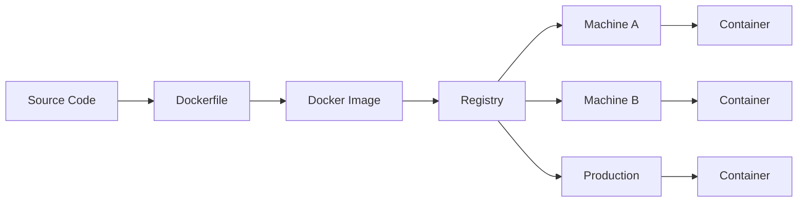

Ta package:

```text
Application
+
Runtime
+
Dependencies
+
Filesystem
+
Configuration defaults
```

thành:

```text
Docker Image
```

sau đó:

```text
Image
↓
run
↓
Container
```

---

# 3. Docker Image là gì?

Image là một **immutable template** dùng để tạo container.

Ví dụ:

```text
openjdk:21
postgres:17
redis:8
nginx
ubuntu
```

Hoặc image của bạn:

```text
quan/order-service:1.0
```

Docker image có hai đặc điểm rất quan trọng:

1. image immutable;
2. image được cấu tạo bởi nhiều filesystem layers. ([Docker Documentation][2])

Ví dụ:

```text
order-service:1.0
```

có thể gồm:

```text
Layer 5: application.jar
Layer 4: application user/config
Layer 3: Java runtime
Layer 2: OS libraries
Layer 1: base filesystem
```

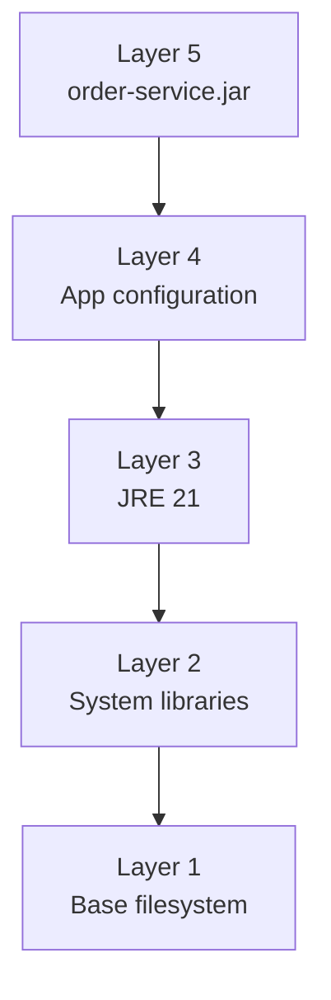

---

# 4. Container là gì?

Container là:

> Một runnable instance của image.

Ví dụ:

```bash
docker run nginx
```

`nginx` là image.

Sau khi run:

```text
nginx image
    ↓
container
```

Bạn có thể tạo nhiều container từ cùng một image:

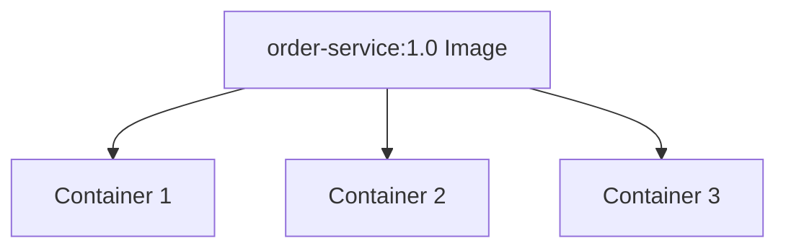

Image giống:

```text
Class
```

Container gần giống:

```text
Object / Instance
```

Dù analogy này không hoàn toàn chính xác về implementation, nó rất dễ nhớ.

---

# 5. Image vs Container

| Image                      | Container         |
| -------------------------- | ----------------- |
| Template                   | Running instance  |
| Immutable                  | Có writable layer |
| Không phải running process | Có process        |
| Dùng để distribute         | Dùng để execute   |
| Có thể push registry       | Runtime object    |

Ví dụ:

```bash
docker images
```

liệt kê image.

```bash
docker ps
```

liệt kê container đang chạy.

```bash
docker ps -a
```

liệt kê cả container đã stop.

---

# 6. Docker không phải Virtual Machine

Đây là câu interview cực kỳ phổ biến.

VM:

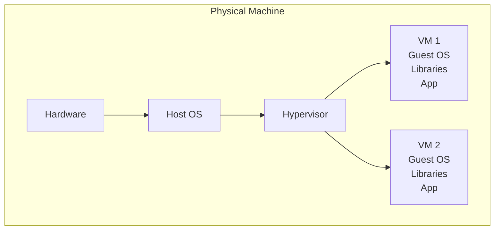

Container:

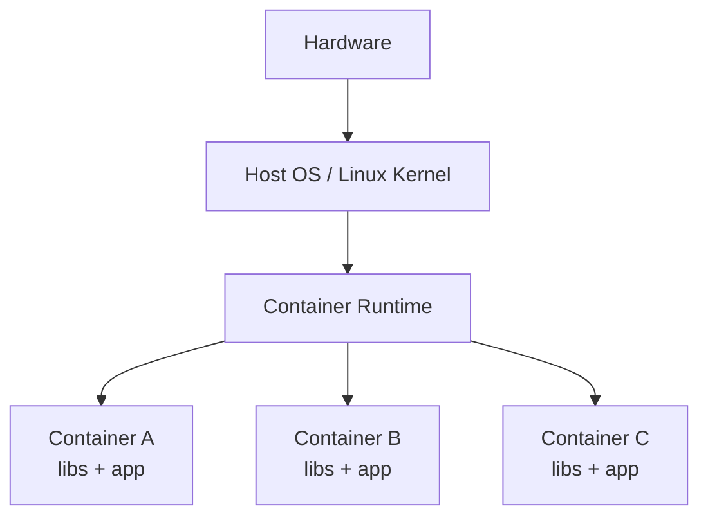

Điểm khác biệt lớn:

```text
VM
→ mỗi VM thường có Guest OS / kernel environment riêng

Container
→ containers trên Linux host chia sẻ host kernel
```

Do vậy container thường:

```text
nhẹ hơn
startup nhanh hơn
image nhỏ hơn VM disk image
mật độ workload cao hơn
```

Docker cũng mô tả container là lightweight alternative phù hợp cho high-density workloads. ([Docker Documentation][1])

---

# 7. Một hiểu nhầm rất phổ biến

Nhiều người nghĩ:

> Container là một mini virtual machine.

Không chính xác.

Một cách hiểu tốt hơn:

> Container về cơ bản là một hoặc nhiều Linux processes được kernel cô lập bằng namespaces và giới hạn tài nguyên bằng cgroups.

Ví dụ container:

```bash
docker run nginx
```

Trên host vẫn tồn tại process:

```text
nginx
```

Nhưng process này nhìn thế giới thông qua các namespace riêng.

---

# 8. Docker container thực sự hoạt động như thế nào?

Docker dựa rất nhiều vào Linux kernel.

Hai building blocks quan trọng:

```text
Namespaces
+
Control Groups (cgroups)
```

Docker documentation xác nhận khi container được tạo, Docker thiết lập namespaces và control groups để cung cấp isolation và resource management. ([Docker Documentation][3])

Mental model:

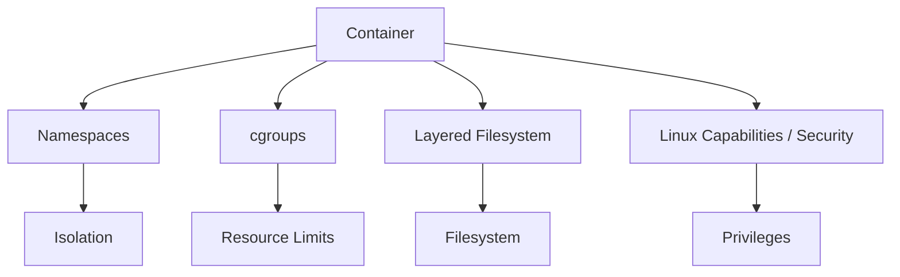

---

# 9. Linux Namespace

Namespace trả lời câu hỏi:

> Process này được phép **nhìn thấy gì?**

Ví dụ các namespace quan trọng:

```text
PID namespace
Network namespace
Mount namespace
UTS namespace
IPC namespace
User namespace
```

---

# 10. PID Namespace

Giả sử host:

```text
PID 1    systemd
PID 700  sshd
PID 1200 docker
PID 1500 java
```

Container có thể nhìn:

```text
PID 1 java
```

Trong container:

```bash
ps
```

có thể thấy:

```text
PID 1 java
```

nhưng ngoài host Java process thật sự có thể là:

```text
PID 9137
```

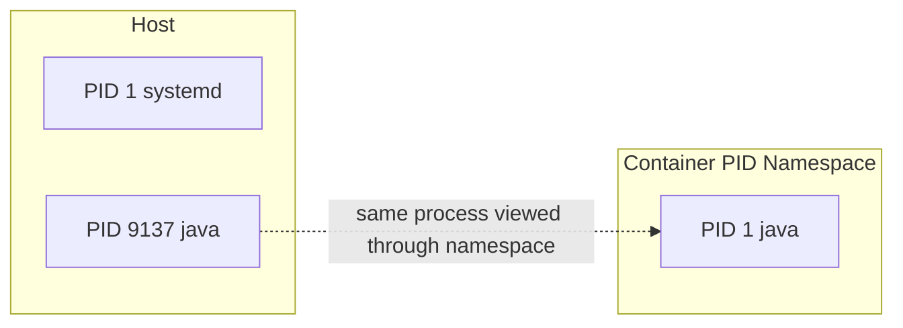

PID namespace giúp container không nhìn toàn bộ process của host.

---

# 11. Network Namespace

Mỗi container có thể có:

```text
network interfaces
IP addresses
routing table
ports
```

riêng.

Container A:

```text
eth0
172.18.0.2
```

Container B:

```text
eth0
172.18.0.3
```

Mặc dù cùng chạy trên một host.

---

# 12. Mount Namespace

Mount namespace tạo filesystem view riêng.

Container thấy:

```text
/
├── bin
├── app
├── etc
├── usr
└── ...
```

không giống toàn bộ filesystem của host.

Vì vậy:

```bash
rm -rf /something
```

bên trong container thông thường không có nghĩa là đang xóa cùng path trên host.

Ngoại lệ quan trọng:

```text
bind mount
```

mà chúng ta sẽ học ở phần storage.

---

# 13. UTS Namespace

Cho phép container có:

```text
hostname
domain name
```

riêng.

Ví dụ:

```bash
docker run --hostname order-service ubuntu
```

container có thể thấy:

```text
order-service
```

---

# 14. User Namespace

Cho phép mapping:

```text
UID inside container
        ↓
UID khác trên host
```

Ví dụ:

```text
Container root UID 0
        ↓
Host UID 231072
```

Điều này làm giảm rủi ro container root trở thành host root. Docker hỗ trợ `userns-remap`; Rootless mode còn chạy cả daemon và containers mà không cần root privileges theo mô hình thông thường. ([Docker Documentation][4])

---

# 15. cgroups là gì?

Nếu namespaces trả lời:

> Process được nhìn thấy gì?

thì cgroups trả lời:

> Process được sử dụng **bao nhiêu resource?**

Ví dụ:

```text
CPU
Memory
Disk IO
...
```

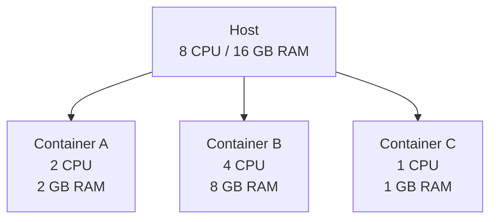

Docker dùng cgroups để accounting và limit resource usage. ([Docker Documentation][3])

---

# 16. Resource limit trong Docker

Nếu không đặt limit, container mặc định có thể sử dụng tài nguyên theo khả năng host/kernel scheduler cho phép. ([Docker Documentation][5])

Ví dụ giới hạn memory:

```bash
docker run \
  --memory="512m" \
  my-app
```

Giới hạn CPU:

```bash
docker run \
  --cpus="1.5" \
  my-app
```

Có thể kết hợp:

```bash
docker run \
  --memory="1g" \
  --cpus="2" \
  order-service
```

Nếu không kiểm soát memory:

```text
Container A memory leak
        ↓
host memory exhausted
        ↓
OOM
        ↓
kernel kills processes
```

Docker docs đặc biệt khuyến nghị cân nhắc memory limits để tránh một container gây ảnh hưởng host. ([Docker Documentation][5])

---

# 17. Docker Architecture

Docker dùng client-server architecture. ([Docker Documentation][1])

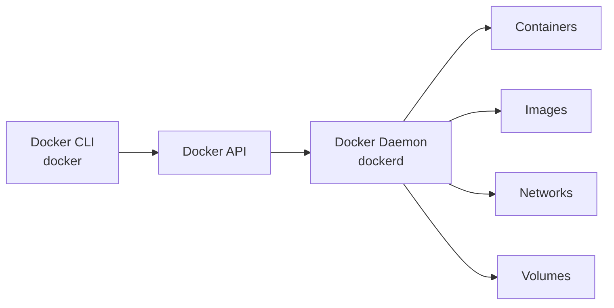

Khi chạy:

```bash
docker run nginx
```

không phải CLI trực tiếp tạo process.

Conceptually:

```text
docker CLI
   ↓
Docker API
   ↓
dockerd
   ↓
container runtime
   ↓
Linux kernel
   ↓
container process
```

---

# 18. Docker Daemon

Process:

```text
dockerd
```

chịu trách nhiệm quản lý:

```text
images
containers
networks
volumes
API requests
```

Bạn có thể kiểm tra:

```bash
systemctl status docker
```

hoặc:

```bash
ps aux | grep dockerd
```

---

# 19. Docker CLI

Khi chạy:

```bash
docker ps
```

CLI:

```text
docker
```

gửi request tới daemon.

Tương tự:

```bash
docker images
docker run
docker stop
docker rm
docker build
```

CLI và daemon thậm chí có thể ở:

```text
different machines
```

vì Docker API có thể được expose qua network, dù việc này cần cấu hình security rất cẩn thận.

---

# 20. Registry

Registry là nơi lưu Docker images.

Ví dụ phổ biến:

```text
Docker Hub
GitHub Container Registry
AWS ECR
Google Artifact Registry
Azure Container Registry
private registry
```

Flow:

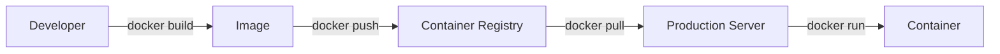

Ví dụ:

```bash
docker pull nginx
```

Docker lấy image từ registry.

Push:

```bash
docker push quan/order-service:1.0
```

---

# 21. Container lifecycle

Một container thường đi qua:

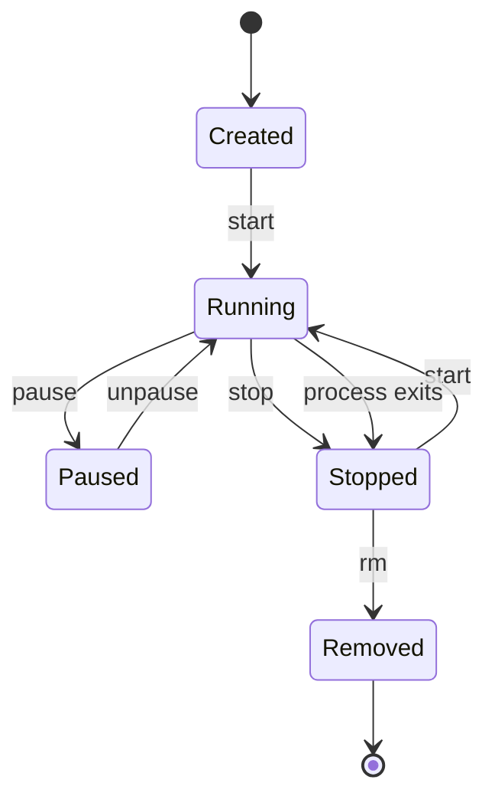

Các command:

```bash
docker create
docker start
docker run
docker stop
docker restart
docker pause
docker unpause
docker rm
```

---

# 22. `docker run` thực chất làm gì?

```bash
docker run nginx
```

Có thể nghĩ gần tương đương:

```text
docker pull nginx        nếu image chưa có

docker create nginx
        ↓
docker start container
```

Flow:

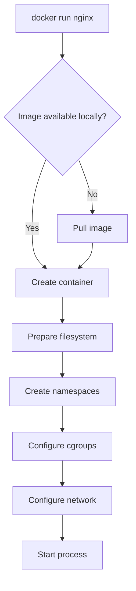

---

# 23. Foreground vs Detached mode

Foreground:

```bash
docker run nginx
```

Terminal attach vào container output.

Detached:

```bash
docker run -d nginx
```

`-d`:

```text
detached
```

Container chạy background.

Xem:

```bash
docker ps
```

---

# 24. Naming container

Thay vì random:

```text
happy_turing
```

dùng:

```bash
docker run \
  --name nginx-server \
  nginx
```

Sau đó:

```bash
docker stop nginx-server
docker start nginx-server
docker logs nginx-server
```

---

# 25. Port mapping

Giả sử application trong container listen:

```text
8080
```

Nhưng container có network namespace riêng.

Để host truy cập:

```bash
docker run \
  -p 8080:8080 \
  my-app
```

Syntax:

```text
HOST_PORT : CONTAINER_PORT
```

Ví dụ:

```text
8081 : 8080
```

```bash
docker run -p 8081:8080 my-app
```

Flow:

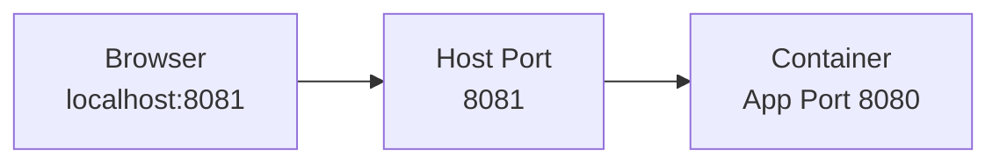

---

# 26. `EXPOSE` khác `-p`

Dockerfile:

```dockerfile
EXPOSE 8080
```

không tự động publish port ra host.

Nó chủ yếu mô tả/document:

```text
container expects to listen on 8080
```

Actual publishing:

```bash
docker run -p 8080:8080 app
```

---

# 27. Dockerfile là gì?

Dockerfile mô tả:

> Cách build Docker image.

Ví dụ Spring Boot:

```dockerfile
FROM eclipse-temurin:21-jre

WORKDIR /app

COPY target/order-service.jar app.jar

EXPOSE 8080

ENTRYPOINT ["java", "-jar", "app.jar"]
```

Build:

```bash
docker build -t order-service:1.0 .
```

Run:

```bash
docker run -p 8080:8080 order-service:1.0
```

---

# 28. Dockerfile flow

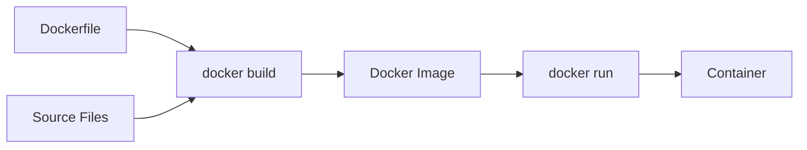

---

# 29. `FROM`

```dockerfile
FROM eclipse-temurin:21-jre
```

xác định base image.

```text
Your application image
        ↓
Java runtime
        ↓
base filesystem
```

Không cần nhét compiler/dev tools vào runtime image nếu không cần.

---

# 30. `WORKDIR`

```dockerfile
WORKDIR /app
```

Sau đó:

```dockerfile
COPY app.jar .
```

sẽ copy tới:

```text
/app/app.jar
```

Nó cũng ảnh hưởng working directory của subsequent:

```text
RUN
CMD
ENTRYPOINT
```

---

# 31. `COPY`

```dockerfile
COPY target/app.jar app.jar
```

copy file từ:

```text
build context
```

vào image.

Không nên:

```dockerfile
COPY . .
```

một cách vô thức nếu project có:

```text
.git
node_modules
logs
IDE files
secrets
large artifacts
```

---

# 32. `.dockerignore`

Ví dụ:

```text
.git
.idea
target/
*.log
.env
node_modules/
```

Docker docs khuyến nghị giữ build context nhỏ và dùng `.dockerignore` để tránh gửi file không cần thiết tới builder, đồng thời giảm unnecessary cache invalidation. ([Docker Documentation][6])

---

# 33. `RUN`

Dockerfile:

```dockerfile
RUN apt-get update && apt-get install -y curl
```

Được thực thi trong:

```text
image build time
```

Không phải runtime.

Đây là distinction quan trọng:

```text
RUN
→ build time

CMD / ENTRYPOINT
→ container runtime
```

---

# 34. `CMD`

Ví dụ:

```dockerfile
CMD ["java", "-jar", "app.jar"]
```

cung cấp default command/arguments.

Có thể override:

```bash
docker run image some-other-command
```

---

# 35. `ENTRYPOINT`

Ví dụ:

```dockerfile
ENTRYPOINT ["java", "-jar", "app.jar"]
```

thường dùng khi container đại diện cho một executable cụ thể.

Ví dụ combine:

```dockerfile
ENTRYPOINT ["java", "-jar", "app.jar"]

CMD ["--spring.profiles.active=prod"]
```

thì conceptual command:

```bash
java -jar app.jar --spring.profiles.active=prod
```

---

# 36. Environment variables

Run:

```bash
docker run \
  -e DB_HOST=postgres \
  -e DB_PORT=5432 \
  order-service
```

Application:

```text
DB_HOST=postgres
DB_PORT=5432
```

Trong Spring:

```yaml
spring:
  datasource:
    url: jdbc:postgresql://${DB_HOST}:${DB_PORT}/order
```

Đây là pattern rất phổ biến:

```text
image
=
application artifact

runtime environment
=
configuration
```

---

# 37. Image Layers

Dockerfile:

```dockerfile
FROM eclipse-temurin:21-jre

WORKDIR /app

COPY app.jar app.jar

ENTRYPOINT ["java", "-jar", "app.jar"]
```

Image được tổ chức theo layer model.

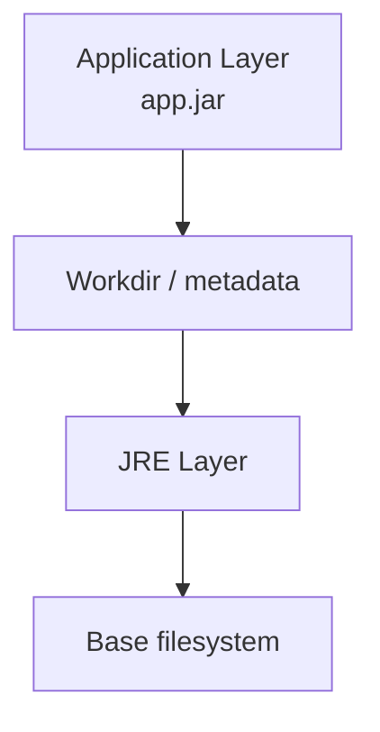

Image layers có thể được reuse giữa images.

Đây là một lý do container images có thể tiết kiệm storage hiệu quả.

---

# 38. Layer caching

Giả sử:

```dockerfile
FROM node:24

WORKDIR /app

COPY package.json .
RUN npm install

COPY . .

CMD ["npm", "start"]
```

Nếu source code thay đổi nhưng:

```text
package.json
```

không thay đổi:

```text
FROM          → cache
WORKDIR       → cache
COPY package  → cache
npm install   → cache

COPY source   → rebuild
```

Docker docs khuyên sắp xếp layers sao cho phần thay đổi ít nằm trước để tăng khả năng reuse build cache. ([Docker Documentation][6])

---

# 39. Một Dockerfile không tối ưu

```dockerfile
FROM node:24

WORKDIR /app

COPY . .

RUN npm install

CMD ["npm", "start"]
```

Chỉ cần thay:

```text
README.md
```

`COPY . .` cache invalidated.

Sau đó:

```text
npm install
```

có thể phải chạy lại.

Tốt hơn:

```dockerfile
FROM node:24

WORKDIR /app

COPY package*.json ./

RUN npm ci

COPY . .

CMD ["npm", "start"]
```

---

# 40. Multi-stage build

Đây là một pattern production cực kỳ quan trọng.

Ví dụ Java:

```dockerfile
FROM maven:3.9-eclipse-temurin-21 AS builder

WORKDIR /app

COPY pom.xml .
COPY src ./src

RUN mvn clean package -DskipTests


FROM eclipse-temurin:21-jre

WORKDIR /app

COPY --from=builder \
     /app/target/app.jar \
     app.jar

ENTRYPOINT ["java", "-jar", "app.jar"]
```

Flow:


Build stage có:

```text
Maven
compiler
source files
build cache
```

Final image chỉ cần:

```text
JRE
app.jar
```

Docker khuyến nghị multi-stage build vì nó giúp tách build environment khỏi runtime environment, giảm image size và attack surface. ([Docker Documentation][7])

---

# 41. Container Writable Layer

Image:

```text
read-only layers
```

Khi tạo container Docker thêm:

```text
writable container layer
```

Conceptually:

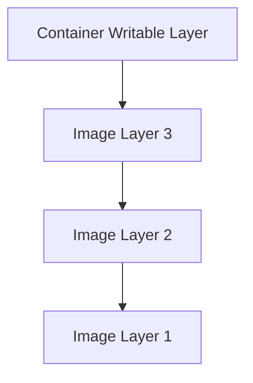

Container ghi:

```text
/tmp/test.txt
```

vào writable layer.

---

# 42. Điều gì xảy ra khi container bị xóa?

Nếu dữ liệu chỉ tồn tại trong writable container layer:

```bash
docker rm container
```

→ dữ liệu đó mất cùng container.

Vì vậy:

> Không lưu database production data chỉ trong container writable layer.

Ta cần:

```text
Volume
```

---

# 43. Docker Storage

Ba concept quan trọng:

```text
Container writable layer

Volume

Bind mount
```

---

# 44. Docker Volume

Tạo volume:

```bash
docker volume create postgres-data
```

Run:

```bash
docker run \
  -v postgres-data:/var/lib/postgresql/data \
  postgres
```

Architecture:

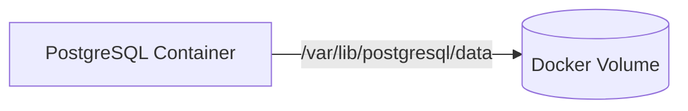

Container bị remove:

```text
volume vẫn còn
```

Docker Compose cũng coi volumes là persistent data stores được container engine quản lý. ([Docker Documentation][8])

---

# 45. Bind Mount

Bind mount mapping trực tiếp host path:

```bash
docker run \
  -v /home/quan/project:/app \
  node
```

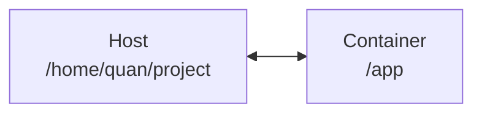

File host thay đổi:

```text
→ container nhìn thấy
```

Rất hữu ích development.

---

# 46. Volume vs Bind Mount

| Volume                       | Bind Mount                  |
| ---------------------------- | --------------------------- |
| Docker quản lý               | Host path quản lý           |
| Portable hơn                 | Tied to host filesystem     |
| Tốt cho persistent app data  | Tốt cho development/config  |
| DB data thường dùng volume   | Source code dev thường bind |
| Dễ backup/manage theo Docker | Direct access host files    |

Mental model:

```text
Database
→ Volume

Local source code hot reload
→ Bind mount
```

---

# 47. Docker Storage Layers — current note

Historically bạn sẽ học rất nhiều về:

```text
overlay2 / OverlayFS
```

Concept này vẫn rất hữu ích để hiểu image layers và container writable layer.

Tuy nhiên, Docker Engine 29+ dùng **containerd image store mặc định cho fresh installations**, sử dụng snapshotters thay cho classic storage drivers trong cấu hình đó. Docker docs vẫn giữ tài liệu classic `overlay2` vì nó giải thích layer model và vẫn tồn tại trên nhiều installation. ([Docker Documentation][9])

Đây là nuance tốt nếu interviewer hỏi Docker internals hiện đại.

---

# 48. OverlayFS mental model

Classic OverlayFS có:

```text
lowerdir
upperdir
merged
workdir
```

Concept:

```text
lowerdir
=
read-only image layers

upperdir
=
container changes

merged
=
filesystem view container sees
```

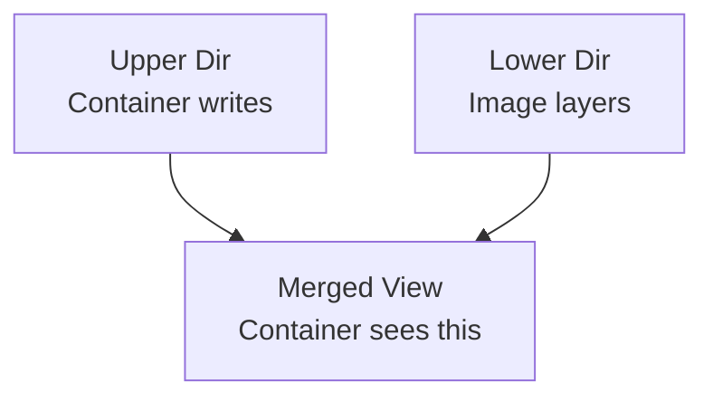

Docker's OverlayFS documentation mô tả các `lowerdir`, `upperdir`, `merged`, `workdir` constructs này cho `overlay2`. ([Docker Documentation][10])

---

# 49. Docker Networking

Docker có các network drivers như:

```text
bridge
host
none
overlay
ipvlan
macvlan
```

trên Linux. ([Docker Documentation][11])

Đối với backend developer, quan trọng nhất trước hết:

```text
bridge
host
none
```

---

# 50. Bridge network

Đây là network phổ biến cho containers trên cùng Docker host.

```mermaid
flowchart TB
    HOST[Docker Host]

    B["Docker Bridge"]

    C1["Container A<br/>172.18.0.2"]
    C2["Container B<br/>172.18.0.3"]
    C3["Container C<br/>172.18.0.4"]

    HOST --> B

    B --> C1
    B --> C2
    B --> C3
```

Containers trên cùng suitable user-defined bridge có thể communicate.

---

# 51. User-defined bridge

Tạo:

```bash
docker network create backend-network
```

Run:

```bash
docker run \
  --name postgres \
  --network backend-network \
  postgres
```

Sau đó:

```bash
docker run \
  --name backend \
  --network backend-network \
  backend-image
```

Backend có thể connect tới:

```text
postgres:5432
```

thay vì hard-code IP.

Docker khuyến nghị user-defined bridge thay vì default `bridge` cho những use case thông thường cần container networking. ([Docker Documentation][12])

---

# 52. Vì sao không dùng container IP trực tiếp?

Container có thể restart:

```text
172.18.0.2
     ↓
restart
     ↓
172.18.0.7
```

Nếu hard-code:

```text
jdbc:postgresql://172.18.0.2:5432/db
```

→ lỗi.

Dùng service/container DNS name:

```text
jdbc:postgresql://postgres:5432/db
```

ổn định hơn.

---

# 53. Host network

```bash
docker run --network host app
```

Container dùng network stack của host.

Conceptually:

```text
Normal:
Host Network
     ↓
Container Network Namespace

Host mode:
Container
     ↓
Host Network directly
```

Docker docs lưu ý host networking bỏ network isolation giữa container và host; port mapping không cần/không áp dụng theo cách bridge mode. ([Docker Documentation][13])

Trade-off:

```text
+ less networking translation
+ useful for certain system-level workloads

- less isolation
- port conflicts
- application sees host network more directly
```

---

# 54. `none` network

```bash
docker run --network none app
```

Container không có normal external networking.

Use case:

```text
isolated computation
security-sensitive workload
```

---

# 55. Docker Compose

Một real application hiếm khi chỉ có một container.

Ví dụ microservice local stack:

```text
Backend
PostgreSQL
Redis
Kafka
```

Nếu manual:

```bash
docker run postgres ...
docker run redis ...
docker run kafka ...
docker run backend ...
```

khó quản lý.

Docker Compose cho phép định nghĩa multi-container application trong YAML, bao gồm services, networks, volumes và các cấu hình runtime liên quan. ([Docker Documentation][14])

---

# 56. Compose example

```yaml
services:

  backend:
    build: .
    ports:
      - "8080:8080"
    environment:
      DB_HOST: postgres
      REDIS_HOST: redis
    depends_on:
      - postgres
      - redis

  postgres:
    image: postgres:17
    environment:
      POSTGRES_DB: shop
      POSTGRES_USER: admin
      POSTGRES_PASSWORD: password
    volumes:
      - postgres-data:/var/lib/postgresql/data

  redis:
    image: redis:alpine

volumes:
  postgres-data:
```

Run:

```bash
docker compose up
```

Background:

```bash
docker compose up -d
```

Stop:

```bash
docker compose down
```

---

# 57. Compose architecture

```mermaid
flowchart TD
    U[User]

    C["compose.yaml"]

    DC["Docker Compose"]

    BE[Backend]
    DB[(PostgreSQL)]
    R[(Redis)]

    V[(postgres-data Volume)]

    N[Default Compose Network]

    U --> DC
    C --> DC

    DC --> BE
    DC --> DB
    DC --> R

    BE --> N
    DB --> N
    R --> N

    DB --> V
```

Compose mặc định tạo network cho project; services tham gia network này và có thể được discover bằng service name. ([Docker Documentation][15])

Do đó backend dùng:

```text
postgres:5432
redis:6379
```

không phải:

```text
localhost
```

---

# 58. `localhost` trong container là ai?

Đây là lỗi beginner cực kỳ phổ biến.

Backend container:

```text
localhost
```

nghĩa là:

```text
backend container itself
```

không phải PostgreSQL container.

Sai:

```text
jdbc:postgresql://localhost:5432/db
```

Nếu PostgreSQL chạy service:

```yaml
postgres:
```

thì:

```text
jdbc:postgresql://postgres:5432/db
```

---

# 59. Port giữa containers có cần publish không?

Giả sử:

```text
Backend → PostgreSQL
```

trên cùng Compose network.

Không nhất thiết phải:

```yaml
ports:
  - "5432:5432"
```

để backend truy cập database.

`ports` là để expose tới:

```text
host / external access
```

Container-to-container communication có thể dùng internal network trực tiếp.

Production-wise, nếu DB không cần host access:

```text
không publish DB port
```

thường là tốt hơn.

---

# 60. `depends_on` không đồng nghĩa app ready

Một nuance quan trọng.

```yaml
depends_on:
  - postgres
```

không nên được hiểu đơn giản là:

```text
PostgreSQL is fully ready to accept queries.
```

Startup có thể:

```text
Postgres process starts
        ↓
Backend starts
        ↓
Postgres still initializing
        ↓
connection failed
```

Nên application cần:

```text
retry
health checks
resilience
```

Docker Compose quickstart hiện cũng hướng dẫn xử lý startup race bằng health checks. ([Docker Documentation][16])

---

# 61. Health Check

Ví dụ:

```dockerfile
HEALTHCHECK \
  --interval=30s \
  --timeout=3s \
  CMD curl -f http://localhost:8080/actuator/health || exit 1
```

Container có thể:

```text
running
```

nhưng:

```text
unhealthy
```

Đây là distinction quan trọng:

```text
Process alive
≠
Application healthy
```

---

# 62. Logs

Xem:

```bash
docker logs container-name
```

Follow:

```bash
docker logs -f container-name
```

Compose:

```bash
docker compose logs
```

Follow:

```bash
docker compose logs -f backend
```

Production pattern tốt:

```text
application
→ stdout/stderr
→ container runtime
→ logging infrastructure
```

thay vì cố nhét toàn bộ log management vào filesystem container.

---

# 63. Exec vào container

```bash
docker exec -it backend bash
```

Nếu không có bash:

```bash
docker exec -it backend sh
```

Ví dụ:

```bash
docker exec -it postgres psql -U postgres
```

Mental model:

```text
docker exec
=
start another process inside existing container
```

không phải SSH vào VM.

---

# 64. Inspect

Một command rất hữu ích:

```bash
docker inspect container
```

Có thể xem:

```text
environment
mounts
networks
IP address
state
configuration
```

Ví dụ:

```bash
docker inspect postgres
```

---

# 65. Security — container không phải security boundary tuyệt đối như VM

Container cùng chia sẻ host kernel.

Do đó:

```text
kernel vulnerability
misconfiguration
privileged container
dangerous host mounts
excessive capabilities
```

đều có thể gây rủi ro.

Docker security architecture dựa trên namespaces, cgroups, capabilities và các kernel hardening mechanisms. ([Docker Documentation][3])

---

# 66. Không chạy app dưới root nếu không cần

Dockerfile không tốt:

```dockerfile
FROM eclipse-temurin:21-jre

COPY app.jar /app.jar

ENTRYPOINT ["java", "-jar", "/app.jar"]
```

có thể chạy process bằng user mặc định của image, đôi khi là root tùy image.

Tốt hơn:

```dockerfile
FROM eclipse-temurin:21-jre

RUN useradd -r appuser

WORKDIR /app

COPY app.jar app.jar

USER appuser

ENTRYPOINT ["java", "-jar", "app.jar"]
```

Principle:

```text
Least privilege
```

Docker cũng khuyến nghị chạy application trong container bằng unprivileged users khi có thể. ([Docker Documentation][4])

---

# 67. `--privileged` nguy hiểm

```bash
docker run --privileged ...
```

cấp container quyền rất rộng.

Không nên dùng để:

```text
"fix permission problem"
```

Nếu application chỉ cần một capability cụ thể, có thể cân nhắc:

```bash
--cap-add
--cap-drop
```

thay vì bật toàn bộ privilege.

---

# 68. Docker daemon cũng là security-sensitive

Một điều rất quan trọng:

> Ai có quyền điều khiển Docker daemon thường có khả năng thực hiện những hành động rất privileged trên host.

Ví dụ một user có thể mount:

```text
/
```

của host vào container nếu được Docker daemon cho phép.

Docker docs vì vậy cảnh báo chỉ trusted users nên được quyền control daemon. ([Docker Documentation][3])

Đây là lý do membership:

```text
docker group
```

không nên coi như một permission vô hại.

---

# 69. Rootless Docker

Rootless mode:

```text
Docker daemon
+
containers
```

chạy không cần root privileges theo mô hình thông thường, sử dụng user namespace để giảm impact nếu daemon/runtime bị compromise. ([Docker Documentation][17])

```mermaid
flowchart TD
    U[Normal User]

    D[Rootless Docker Daemon]

    C[Container]

    NS[User Namespace]

    U --> D
    D --> C
    C --> NS
```

Trade-off:

```text
+ smaller privilege impact
+ stronger host protection

- một số networking/storage/privileged use cases phức tạp hơn
```

---

# 70. Seccomp

Container cuối cùng vẫn gọi:

```text
Linux syscalls
```

Ví dụ:

```text
read()
write()
open()
socket()
mount()
```

Seccomp cho phép restrict syscall surface.

Docker có default seccomp profile chặn một số syscall không nên available cho normal container workloads. ([Docker Documentation][18])

Mental model:

```mermaid
flowchart LR
    APP[Container App]

    SEC[Seccomp Filter]

    K[Linux Kernel]

    APP -->|syscall| SEC

    SEC -->|allowed| K
    SEC -->|denied| X[Reject]
```

---

# 71. Secrets

Không nên:

```dockerfile
ENV DB_PASSWORD=supersecret
```

rồi bake password vào image.

Cũng không nên:

```dockerfile
COPY .env .
```

Image có thể:

```text
push registry
share
cache
inspect
```

Secrets nên inject tại runtime bằng secret management phù hợp:

```text
Docker/Compose secrets where applicable
Kubernetes Secrets + external secret stores
AWS Secrets Manager
Vault
cloud secret managers
```

Compose model cũng có dedicated `secrets` concept thay vì coi secret như normal configuration. ([Docker Documentation][19])

---

# 72. Docker anti-pattern: một container chạy quá nhiều thứ

Không nên mặc định làm:

```text
Container
├── nginx
├── Java
├── PostgreSQL
├── Redis
└── cron
```

Better:

```mermaid
flowchart LR
    N[Nginx Container]
    J[Java Container]
    P[(Postgres Container)]
    R[(Redis Container)]

    N --> J
    J --> P
    J --> R
```

Rule of thumb:

> Một container nên có một main responsibility/process model rõ ràng.

Không phải tuyệt đối "one Linux process only", mà là:

```text
one service responsibility
```

---

# 73. PID 1 problem

Main process của container thường trở thành:

```text
PID 1
```

PID 1 có special behavior liên quan:

```text
signals
child process reaping
```

Vì vậy app/container entrypoint phải xử lý signals đúng để:

```bash
docker stop
```

có thể graceful shutdown.

Đối với Java/Spring Boot, nên dùng exec-form:

```dockerfile
ENTRYPOINT ["java", "-jar", "app.jar"]
```

thay vì unnecessary shell wrapping:

```dockerfile
ENTRYPOINT java -jar app.jar
```

để signal delivery đơn giản hơn.

---

# 74. `docker stop` hoạt động conceptual thế nào?

```text
docker stop
   ↓
send termination signal
   ↓
application gets chance to shutdown
   ↓
grace period
   ↓
force kill if necessary
```

Với Spring Boot:

```text
SIGTERM
↓
graceful shutdown
↓
stop accepting requests
↓
finish ongoing work
↓
close resources
```

Đây rất quan trọng trong production orchestration.

---

# 75. Image Tags

Ví dụ:

```text
order-service:1.0
order-service:1.1
order-service:latest
```

Không nên dựa quá nhiều vào:

```text
latest
```

production.

Tốt hơn:

```text
order-service:1.4.7
```

hoặc immutable digest.

Vì deployment cần:

```text
reproducibility
```

Bạn muốn biết chính xác:

```text
Which artifact is running?
```

---

# 76. Docker Image Best Practices

Một production image nên hướng tới:

```text
small
reproducible
secure
minimal
non-root
no unnecessary tools
no secrets
versioned
```

Ví dụ:

```text
Build image:
Maven + JDK + source

Runtime image:
JRE + jar
```

Multi-stage build giúp đạt mục tiêu này. ([Docker Documentation][7])

---

# 77. Docker và Microservices

Docker rất phù hợp microservices vì mỗi service có thể package độc lập.

```mermaid
flowchart TD
    GW[API Gateway Container]

    U[User Service Container]
    O[Order Service Container]
    P[Payment Service Container]

    DB1[(User DB)]
    DB2[(Order DB)]
    DB3[(Payment DB)]

    GW --> U
    GW --> O
    GW --> P

    U --> DB1
    O --> DB2
    P --> DB3
```

Mỗi service:

```text
own image
own version
own runtime
own dependencies
```

Ví dụ:

```text
user-service:2.1
order-service:4.7
payment-service:1.3
```

Deploy độc lập.

---

# 78. Nhưng Docker không phải orchestration platform đầy đủ

Docker đơn lẻ giải quyết tốt:

```text
build
package
run
isolation
network
storage
```

Khi có:

```text
100 machines
500 containers
auto scaling
self-healing
rolling deployment
service discovery
scheduling
```

ta cần orchestration system như:

```text
Kubernetes
```

Mental model:

```text
Docker
→ containerization

Kubernetes
→ container orchestration
```

---

# 79. Docker Compose vs Kubernetes

| Docker Compose                         | Kubernetes                    |
| -------------------------------------- | ----------------------------- |
| Multi-container application definition | Distributed orchestration     |
| Local/dev rất tốt                      | Production clusters           |
| Đơn giản                               | Complex                       |
| Một Docker environment thường gặp      | Multi-node scheduling         |
| `docker compose up`                    | Deployment/Pod/Service/...    |
| Developer friendly                     | Platform/infrastructure level |

Compose không đơn thuần chỉ dành riêng development, nhưng production orchestration requirements lớn thường cần platform phù hợp hơn.

---

# 80. Java/Spring Boot Docker example

Giả sử project:

```text
order-service/
├── pom.xml
├── src/
└── Dockerfile
```

Dockerfile:

```dockerfile
FROM maven:3.9-eclipse-temurin-21 AS builder

WORKDIR /build

COPY pom.xml .

RUN mvn dependency:go-offline

COPY src ./src

RUN mvn clean package -DskipTests


FROM eclipse-temurin:21-jre

WORKDIR /app

RUN useradd -r appuser

COPY --from=builder \
    /build/target/order-service.jar \
    app.jar

USER appuser

EXPOSE 8080

ENTRYPOINT ["java", "-jar", "app.jar"]
```

---

# 81. Vì sao `pom.xml` copy trước?

Đây là layer cache optimization.

```text
pom.xml
↓
download dependencies
↓
copy source
↓
compile
```

Source code thay đổi thường xuyên:

```text
pom.xml unchanged
```

dependency layer có thể reuse.

Nếu:

```dockerfile
COPY . .
RUN mvn package
```

thì source thay một file có thể invalidate nhiều cache hơn.

---

# 82. Spring + PostgreSQL Compose

```yaml
services:

  order-service:
    build: .
    ports:
      - "8080:8080"
    environment:
      DB_HOST: postgres
      DB_PORT: 5432
      DB_NAME: orders
      DB_USER: admin
      DB_PASSWORD: password
    depends_on:
      - postgres

  postgres:
    image: postgres:17
    environment:
      POSTGRES_DB: orders
      POSTGRES_USER: admin
      POSTGRES_PASSWORD: password
    volumes:
      - postgres-data:/var/lib/postgresql/data

volumes:
  postgres-data:
```

Spring configuration:

```yaml
spring:
  datasource:
    url: jdbc:postgresql://${DB_HOST}:${DB_PORT}/${DB_NAME}
    username: ${DB_USER}
    password: ${DB_PASSWORD}
```

Flow:

```mermaid
flowchart LR
    HOST["Browser<br/>localhost:8080"]

    APP["order-service<br/>:8080"]

    PG["postgres<br/>:5432"]

    VOL[(postgres-data)]

    HOST -->|published port| APP
    APP -->|Docker network| PG
    PG --> VOL
```

---

# 83. Một số Docker commands cần nhớ

Lifecycle:

```bash
docker run
docker create
docker start
docker stop
docker restart
docker rm
```

Inspect:

```bash
docker ps
docker ps -a
docker inspect
docker logs
docker stats
```

Images:

```bash
docker images
docker pull
docker build
docker tag
docker push
docker rmi
```

Inside container:

```bash
docker exec -it <container> sh
```

Network:

```bash
docker network ls
docker network create
docker network inspect
docker network rm
```

Volume:

```bash
docker volume ls
docker volume create
docker volume inspect
docker volume rm
```

Compose:

```bash
docker compose up
docker compose up -d
docker compose ps
docker compose logs
docker compose down
docker compose build
docker compose pull
```

---

# 84. Debugging flow nên nhớ

Container không chạy:

```mermaid
flowchart TD
    A[Container problem] --> B[docker ps -a]

    B --> C[docker logs container]

    C --> D[docker inspect container]

    D --> E{Startup failure?}

    E -->|Yes| F[Check command / env / config]
    E -->|No| G{Networking?}

    G -->|Yes| H[Check network / DNS / port]

    G -->|No| I{Storage?}

    I -->|Yes| J[Check mounts / permission]

    I -->|No| K[Check CPU / Memory / OOM]
```

Bạn có thể check:

```bash
docker stats
```

cho:

```text
CPU
memory
network
block IO
```

---

# 85. `docker ps` thấy container biến mất ngay

Ví dụ:

```bash
docker run ubuntu
```

container exit ngay.

Tại sao?

Container sống theo:

> Main process.

Nếu main process exit:

```text
container stops
```

Container không phải VM có background OS luôn chạy.

Ví dụ:

```bash
docker run ubuntu sleep 1000
```

thì process:

```text
sleep
```

còn sống → container còn running.

---

# 86. Container stateless vs stateful

Application service:

```text
Spring Backend
```

thường nên cố gắng stateless:

```text
request
↓
process
↓
DB/cache/external storage
```

để container có thể:

```text
destroy
recreate
scale
```

DB lại stateful:

```text
PostgreSQL
```

nên cần persistent storage.

---

# 87. Vì sao stateless container dễ scale?

```mermaid
flowchart LR
    LB[Load Balancer]

    C1[Backend Container 1]
    C2[Backend Container 2]
    C3[Backend Container 3]

    DB[(Database)]

    LB --> C1
    LB --> C2
    LB --> C3

    C1 --> DB
    C2 --> DB
    C3 --> DB
```

Nếu backend giữ session chỉ trong RAM container:

```text
Request 1 → C1
Request 2 → C2
```

có thể mất state.

Giải pháp:

```text
stateless token
Redis/session store
sticky session trong một số case
```

---

# 88. Docker performance trade-offs

Docker không magic.

Bạn vẫn có:

```text
CPU scheduling
memory pressure
disk I/O
networking
filesystem overhead
context switching
```

Containers share host resources.

Nếu 10 containers cùng tranh:

```text
CPU
RAM
disk
```

host vẫn bị contention.

Cgroups giúp limit và account resources, nhưng không tạo ra tài nguyên mới.

---

# 89. Docker isolation vs resource allocation

Cần phân biệt:

```text
Namespaces
→ isolation

cgroups
→ resource accounting/control
```

Ví dụ:

```text
PID namespace
→ container không nhìn host processes như normal host view

network namespace
→ container có network stack riêng

cgroup
→ container max 2 CPU / 1 GB RAM
```

Đây là câu trả lời interview rất đáng nhớ.

---

# 90. Docker vs JVM

Một misconception khác:

> Docker thay thế JVM?

Không.

Ví dụ Java:

```mermaid
flowchart TB
    H[Host Linux Kernel]

    C[Container]

    J[JVM]

    A[Spring Boot App]

    H --> C
    C --> J
    J --> A
```

Docker isolate/process/package application.

JVM:

```text
Java bytecode runtime
GC
JIT
memory management
threads
```

Hai tầng khác nhau.

---

# 91. JVM memory và container limit

Giả sử:

```text
Host RAM = 16GB
Container RAM limit = 1GB
```

Java application cần được cấu hình/quan sát phù hợp với container memory environment.

Nếu process vượt memory limit:

```text
container cgroup limit
↓
memory pressure
↓
OOM kill possible
```

Điều này khác với chỉ nhìn:

```text
free RAM của host
```

Nên production Java container cần monitor:

```text
heap
native memory
metaspace
thread stacks
direct buffers
container memory
```

không chỉ `-Xmx`.

---

# 92. Docker Security checklist

Production mindset:

```text
Do not run as root unless necessary
Use minimal images
Use versioned images
Don't embed secrets
Set resource limits
Use read-only filesystem where practical
Drop unnecessary Linux capabilities
Avoid --privileged
Scan images
Keep base images patched
Use trusted registries
Restrict Docker daemon access
Limit host mounts
```

Đặc biệt:

```text
-v /:/host
```

hoặc mount:

```text
/var/run/docker.sock
```

vào untrusted container là cực kỳ sensitive.

---

# 93. Một câu interview: Container có OS không?

Câu trả lời nên cẩn thận.

Image Ubuntu có:

```text
/bin
/usr
/etc
libraries
package manager
userspace tools
```

nên trông giống một OS filesystem.

Nhưng container Linux bình thường:

> Không boot một independent Linux kernel riêng.

Nó dùng host Linux kernel.

Do đó:

```text
Ubuntu container
≠
full Ubuntu VM
```

---

# 94. Vậy làm sao Ubuntu container chạy trên Windows/macOS?

Docker Desktop trên Windows/macOS thường cung cấp Linux environment/VM layer để Linux containers có Linux kernel phù hợp.

Conceptually:

```mermaid
flowchart TB
    HW[Mac / Windows Hardware]

    HOST[Host OS]

    VM[Linux VM / Docker Desktop Environment]

    K[Linux Kernel]

    C1[Linux Container]
    C2[Linux Container]

    HW --> HOST
    HOST --> VM
    VM --> K
    K --> C1
    K --> C2
```

Điều này vẫn nhất quán với principle:

```text
Linux container requires Linux kernel semantics.
```

---

# 95. Docker Interview Question: Why containers are lightweight?

Không chỉ trả lời:

> Because containers are smaller.

Hãy trả lời:

> Containers share the host kernel instead of requiring a full guest operating system per workload. Isolation is primarily provided using kernel mechanisms such as namespaces, while resource accounting and limits are provided using cgroups. Images also use a layered filesystem model that allows layers to be shared and cached.

Đây là answer mạnh hơn.

---

# 96. Docker Interview Question: Image vs Container

Answer:

> An image is an immutable, layered package containing the filesystem and configuration required to run an application. A container is a runtime instance of that image, with runtime configuration and a writable layer added on top.

---

# 97. Docker Interview Question: Why does deleting a container lose data?

Because:

```text
container-specific writable layer
```

thuộc lifecycle container.

Nếu data cần persistence:

```text
volume / external persistent storage
```

---

# 98. Docker Interview Question: Volume vs bind mount

Bạn có thể trả lời:

> A Docker volume is managed by the container engine and is generally preferable for persistent application data. A bind mount maps a specific host path into the container, giving direct coupling to the host filesystem, which is especially useful for development or explicit host-file access.

---

# 99. Docker Interview Question: How do containers communicate?

Answer:

```text
Containers attach to Docker networks.

On a user-defined bridge network:
container/service names can be used for discovery.

Container internal port
≠
host published port.
```

Example:

```text
backend → postgres:5432
```

không cần:

```text
localhost:5432
```

---

# 100. Docker Interview Question: What happens when `docker run` executes?

Một answer hệ thống:

```text
1. Docker CLI sends request to Docker daemon.

2. Docker checks whether image exists locally.

3. If needed, image is pulled from a registry.

4. Docker prepares the container filesystem from image layers
   plus writable runtime state.

5. Runtime isolation such as namespaces is configured.

6. Resource controls/cgroups are configured.

7. Networking and mounts are configured.

8. Container's configured process is started.

9. The container remains running while its main process remains alive.
```

Flow:

```mermaid
flowchart TD
    CLI[docker run]

    D[dockerd]

    IMG{Image local?}

    R[Registry]

    FS[Filesystem]

    NS[Namespaces]

    CG[cgroups]

    NET[Network]

    P[Start Process]

    CLI --> D
    D --> IMG

    IMG -->|No| R
    R --> FS

    IMG -->|Yes| FS

    FS --> NS
    NS --> CG
    CG --> NET
    NET --> P
```

---

# 101. Docker Interview Question: Namespace vs cgroup

Câu cực kỳ dễ ghi điểm:

> Namespaces answer **what a process can see**, while cgroups answer **how much resource a process can use**.

Ví dụ:

```text
PID namespace
→ process isolation

network namespace
→ network isolation

mount namespace
→ filesystem view isolation

cgroup
→ CPU / memory / IO accounting and limits
```

Docker documentation mô tả chính xác hai nhóm kernel mechanisms này là nền tảng của container isolation và resource management. ([Docker Documentation][3])

---

# 102. Một mental model tổng thể về Docker

Cuối cùng hãy giữ sơ đồ này trong đầu:

```mermaid
flowchart TD
    DEV[Developer]

    DF[Dockerfile]

    BUILD[docker build]

    IMG[Docker Image]

    REG[Container Registry]

    RUN[docker run]

    C[Container]

    subgraph Linux["Linux Kernel"]
        NS[Namespaces]
        CG[cgroups]
        NET[Networking]
        FS[Filesystem]
        SEC[Security]
    end

    V[(Volumes)]

    DEV --> DF
    DF --> BUILD
    BUILD --> IMG

    IMG --> REG
    REG --> RUN
    IMG --> RUN

    RUN --> C

    C --> NS
    C --> CG
    C --> NET
    C --> FS
    C --> SEC

    C --> V
```

Docker có thể được tóm lại thành:

```text
Dockerfile
    ↓
defines how to build
    ↓
Image
    ↓
immutable distributable artifact
    ↓
docker run
    ↓
Container
    ↓
isolated processes
    ↓
Namespaces
+
cgroups
+
filesystem layers
+
networking
+
security controls
```

---

# 103. Framework ôn Docker cho phỏng vấn

Nếu interviewer hỏi bất kỳ câu nào về Docker, bạn có thể tư duy theo **5 layer**:

```text
Layer 1 — WHY
Docker giải quyết environment consistency / packaging.

Layer 2 — ARTIFACT
Dockerfile → Image → Registry.

Layer 3 — RUNTIME
Image → Container → Process.

Layer 4 — KERNEL
Namespaces → isolation.
cgroups → resources.
Filesystem layers → storage.
Network namespaces / bridges → networking.

Layer 5 — PRODUCTION
Volumes
resource limits
security
health checks
logging
multi-stage build
orchestration
```

Ví dụ interviewer hỏi:

> Why Docker instead of just running the JAR?

Đừng chỉ nói:

> Docker is portable.

Hãy mở rộng:

```text
1. JAR solves application packaging.

2. Docker packages runtime environment too.

3. Image becomes an immutable deployment artifact.

4. Container provides isolation.

5. Registry provides distribution/versioning.

6. Runtime configuration can be injected separately.

7. Containers integrate naturally with orchestration platforms.

Trade-off:
Docker adds another abstraction/runtime layer,
image management,
network/storage complexity,
and security considerations.
```

Đó chính là kiểu trả lời **không chỉ mô tả Docker hoạt động thế nào mà còn mở rộng context và trade-off**, rất phù hợp với dạng CS/Foundation interview bạn đang luyện. ([Docker Documentation][1])

[1]: https://docs.docker.com/get-started/docker-overview/?utm_source=chatgpt.com "What is Docker? | Docker Docs"
[2]: https://docs.docker.com/get-started/docker-concepts/the-basics/what-is-an-image/?utm_source=chatgpt.com "What is an image? | Docker Docs"
[3]: https://docs.docker.com/engine/security/?utm_source=chatgpt.com "Docker Engine security | Docker Docs"
[4]: https://docs.docker.com/engine/security/userns-remap/?utm_source=chatgpt.com "Isolate containers with a user namespace | Docker Docs"
[5]: https://docs.docker.com/engine/containers/resource_constraints/?utm_source=chatgpt.com "Resource constraints | Docker Docs"
[6]: https://docs.docker.com/build/cache/optimize/?utm_source=chatgpt.com "Optimize cache usage in builds | Docker Docs"
[7]: https://docs.docker.com/get-started/docker-concepts/building-images/multi-stage-builds/?utm_source=chatgpt.com "Multi-stage builds | Docker Docs"
[8]: https://docs.docker.com/reference/compose-file/volumes/?utm_source=chatgpt.com "Define and manage volumes in Docker Compose | Docker Docs"
[9]: https://docs.docker.com/engine/storage/drivers/?utm_source=chatgpt.com "Storage drivers | Docker Docs"
[10]: https://docs.docker.com/engine/storage/drivers/overlayfs-driver/?utm_source=chatgpt.com "OverlayFS storage driver | Docker Docs"
[11]: https://docs.docker.com/engine/network/?utm_source=chatgpt.com "Networking overview | Docker Docs"
[12]: https://docs.docker.com/engine/network/drivers/bridge/?utm_source=chatgpt.com "Bridge network driver | Docker Docs"
[13]: https://docs.docker.com/compose/how-tos/networking/?utm_source=chatgpt.com "Networking in Compose | Docker Docs"
[14]: https://docs.docker.com/compose?utm_source=chatgpt.com "Docker Compose | Docker Docs"
[15]: https://docs.docker.com/reference/compose-file/networks/?utm_source=chatgpt.com "Define and manage networks in Docker Compose | Docker Docs"
[16]: https://docs.docker.com/compose/gettingstarted/?utm_source=chatgpt.com "Docker Compose Quickstart | Docker Docs"
[17]: https://docs.docker.com/engine/security/rootless/?utm_source=chatgpt.com "Rootless mode | Docker Docs"
[18]: https://docs.docker.com/engine/security/seccomp/?utm_source=chatgpt.com "Seccomp security profiles for Docker | Docker Docs"
[19]: https://docs.docker.com/compose/intro/compose-application-model/?utm_source=chatgpt.com "How Compose works | Docker Docs"
