# Computer Networking + HTTP for Backend Interviews & Production

> Mục tiêu của bài giảng: không học networking theo kiểu `TCP = reliable`, `DNS = hostname -> IP`, mà xây một mental model đủ sâu để khi gọi một API, bạn có thể lần theo request từ application xuống wire, đi qua hạ tầng, vào backend, xuống database rồi quay trở lại; đồng thời biết symptom production tương ứng với failure ở từng layer.

## Cách học bài này

Hãy luôn reason theo chuỗi sau:

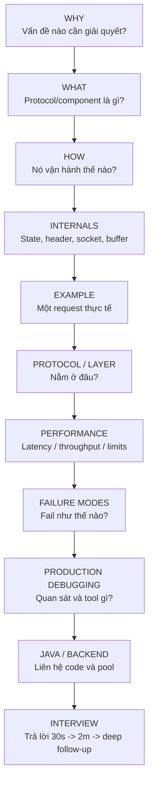

Một lưu ý nền tảng: OSI là **reference model**, không phải implementation specification. ISO mô tả nó như một mô hình tham chiếu để đặt các chuẩn vào đúng ngữ cảnh và điều phối việc phát triển chuẩn; Internet protocol suite thực tế thường được reason theo TCP/IP layers.[^1][^2]

---

# Part I — Unified Mental Model

## 1. Khi gọi một API, điều gì thực sự xảy ra?

Ví dụ:

```bash
curl https://api.example.com/orders
```

High-level lifecycle:

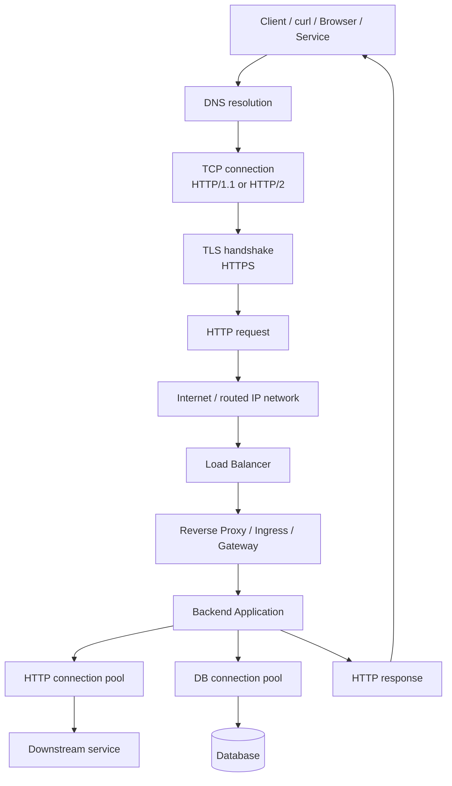

Không phải request nào cũng tạo mới toàn bộ các bước. DNS có thể cache; TCP/TLS connection có thể được reuse; HTTP/2 có thể multiplex nhiều requests trên một connection; HTTP/3 chạy trên QUIC/UDP thay vì TCP. Đó là lý do phải phân biệt **logical request lifecycle** với **physical connection lifecycle**.

---

# Part II — OSI Model và TCP/IP Model

## 2. Tại sao cần layer?

Nếu một hệ thống networking phải tự xử lý trong cùng một khối cả encoding JSON, encryption, reliable delivery, routing, MAC forwarding và truyền tín hiệu điện/radio, nó sẽ gần như không thể thiết kế, thay đổi và debug độc lập.

Layering tạo một contract:

- Layer trên dùng **service** của layer dưới.
- Mỗi layer giải quyết một lớp vấn đề riêng.
- Implementation ở một layer có thể thay đổi mà không bắt buộc rewrite mọi layer khác.
- Khi debug, ta có thể hỏi: failure nằm ở DNS/application, transport, routing hay link?

ISO OSI có 7 layer, từ Application xuống Physical.[^1]

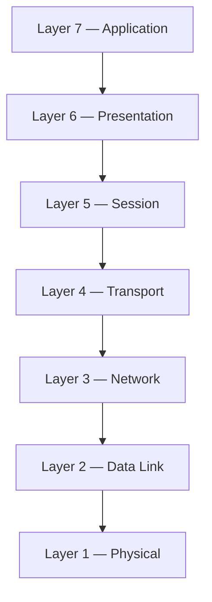

## 3. OSI 7 Layers — vai trò thực sự

| Layer | Responsibility | Typical PDU | Addressing / identifier | Examples | Backend mental model |
|---|---|---|---|---|---|
| L7 Application | Semantics của ứng dụng/network service | Message | URL, hostname, application identifiers | HTTP, DNS, SMTP | `GET /orders`, DNS query |
| L6 Presentation | Representation, serialization, crypto-related transformation | Data | Không có một universal network address riêng | Encoding, compression, crypto concepts | JSON/UTF-8; TLS thường được nói gần vùng này nhưng mapping không 1-1 |
| L5 Session | Quản lý logical dialog/session | Data | Session identifier tùy protocol | Session/checkpoint concepts | Không map trực tiếp đẹp vào HTTP hiện đại |
| L4 Transport | End-to-end process communication, ports, reliability/ordering tùy protocol | TCP segment / UDP datagram | Port | TCP, UDP | socket `srcIP:srcPort -> dstIP:dstPort` |
| L3 Network | Routing packet qua nhiều network | IP packet | IP address | IPv4, IPv6, ICMP | router quyết định next hop |
| L2 Data Link | Delivery trên một local link, framing, medium access | Frame | MAC (Ethernet/Wi-Fi context) | Ethernet, 802.11 | NIC -> switch/AP -> gateway |
| L1 Physical | Truyền raw bits bằng physical medium | Bits/symbols | Không có logical address kiểu IP | electrical, optical, radio | cable/fiber/Wi-Fi radio |

### 3.1 Layer 7 — Application

**Problem solved:** Làm sao hai applications hiểu ý nghĩa message? HTTP định nghĩa method, target, headers, status; DNS định nghĩa query/record semantics.

**Practical example:** Backend nhận `POST /api/orders` không quan tâm frame Ethernet vừa đi qua switch nào. Nó nhận byte stream/message đã được lower layers đưa lên.

**Failure symptom:** `404`, `401`, malformed JSON, wrong Host header, bad API route — transport có thể hoàn toàn khỏe.

**Interview checkpoint:** “HTTP có phải là transport protocol không?” → Không. HTTP định nghĩa application semantics và dùng một transport phù hợp, ví dụ TCP cho HTTP/1.1 và HTTP/2; QUIC cho HTTP/3.[^6][^8]

### 3.2 Layer 6 — Presentation

OSI tách representation ra thành một layer riêng, nhưng Internet stack hiện đại không bắt buộc một protocol duy nhất tương ứng L6. Encoding, compression, cryptographic representation có thể được implement ở nhiều vị trí.

**Important trap:** nói “TLS = OSI layer 6” như universal truth là quá cứng. Thực tế TLS nằm giữa application protocol và transport trong TCP-based HTTPS, nhưng OSI mapping chỉ là conceptual approximation.

### 3.3 Layer 5 — Session

Conceptually quản lý dialog/session: establish, maintain, synchronize, resume. Trong web stack hiện đại, session semantics thường nằm trong application/framework hoặc transport/security protocol khác nhau, chứ không có “the Session Layer protocol” duy nhất bạn thấy trong production.

**Interview insight:** Nếu interviewer hỏi “WebSocket session nằm L5?” tốt nhất trả lời: có thể dùng L5 như conceptual analogy, nhưng implementation thực tế của WebSocket là application protocol chạy trên underlying transport; không nên ép 1-to-1.

### 3.4 Layer 4 — Transport

L4 trả lời câu hỏi: **process nào ở host đích nhận data?** và nếu dùng TCP thì làm sao tạo reliable ordered byte stream.

Port numbers giúp demultiplex về đúng socket/process. TCP cung cấp connection state, sequence space, ACK, retransmission, flow control và congestion control; UDP là minimal datagram transport và không tự cung cấp các cơ chế congestion/reliability này.[^3][^5]

### 3.5 Layer 3 — Network

IP cung cấp addressing và routing qua nhiều network. Router chủ yếu quyết định packet đi next hop nào dựa trên destination IP và routing table.

**Important distinction:** IP address có end-to-end routing significance; MAC address chủ yếu có local-link significance. Khi packet đi qua router, L2 frame thường được tạo lại cho link kế tiếp trong khi IP packet tiếp tục được routed.

### 3.6 Layer 2 — Data Link

L2 đóng gói network-layer packet thành frame phù hợp với local medium. Ethernet và Wi-Fi có cơ chế framing/addressing riêng. Switch hoạt động chủ yếu ở L2; router ở boundary L3.

### 3.7 Layer 1 — Physical

Bits cuối cùng phải được biểu diễn bằng tín hiệu điện, ánh sáng hoặc radio. Đây là lý do một lỗi “network” đôi khi đơn giản là link down, cable/fiber/transceiver/Wi-Fi signal problem.

---

## 4. OSI vs TCP/IP

Internet architecture thường reason theo 4 lớp: Application, Transport, Internet, Link.[^2]

| OSI | TCP/IP mental model | Mapping note |
|---|---|---|
| Application | Application | HTTP, DNS, SMTP |
| Presentation | Application | Encoding/TLS-related concerns thường được absorb |
| Session | Application | Session semantics thường ở app/protocol |
| Transport | Transport | TCP, UDP |
| Network | Internet | IP, ICMP |
| Data Link | Link | Ethernet/Wi-Fi link layer |
| Physical | Link / physical implementation | TCP/IP model thường không tách chi tiết như OSI |

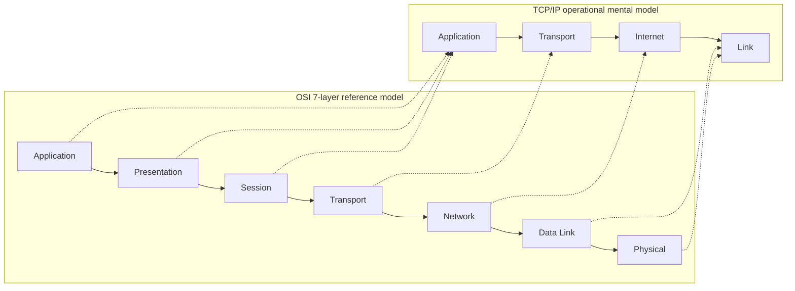

### Tại sao engineers thường dùng TCP/IP model hơn?

Vì nó map gần hơn với protocol suite thật của Internet. OSI rất hữu ích để **phân lớp tư duy và interview explanation**, nhưng TCP/IP hữu ích hơn khi bạn đọc socket, packet capture, routing, TCP state hay HTTP trace.

---

## 5. Memory trick cho OSI

Từ L7 xuống L1:

**A**pplications **P**resent **S**essions **T**hrough **N**etwork **D**ata **P**aths.

Điểm quan trọng không phải câu mnemonic, mà mental picture:

```mermaid
flowchart TB
    U[User intent<br/>"Create order"] --> A[Application<br/>HTTP semantics]
    A --> P[Presentation<br/>representation/security concept]
    P --> S[Session<br/>dialog continuity concept]
    S --> T[Transport<br/>process-to-process]
    T --> N[Network<br/>host-to-host routing]
    N --> D[Data Link<br/>next hop on local link]
    D --> PH[Physical<br/>signals]
```

### Scenario: mở `https://example.com`

1. **Application:** browser parse URL; DNS lookup; chuẩn bị HTTP request.
2. **Presentation-ish/security:** HTTPS security được TLS xử lý trong TCP-based versions.
3. **Session-ish:** browser/client quản lý connection/session reuse, cookies, TLS session resumption tùy implementation.
4. **Transport:** TCP connection đến `IP:443` cho HTTP/1.1/2, hoặc QUIC/UDP cho HTTP/3.
5. **Network:** IP packet routed qua routers.
6. **Data Link:** mỗi local hop đóng IP packet trong frame phù hợp link.
7. **Physical:** bits truyền trên wire/fiber/radio.

---

# Part III — Encapsulation / Decapsulation

## 6. Encapsulation là gì?

Mỗi layer nhận payload từ layer trên và thêm metadata/header của mình.

Với HTTPS trên HTTP/1.1 hoặc HTTP/2, mental model thường là:

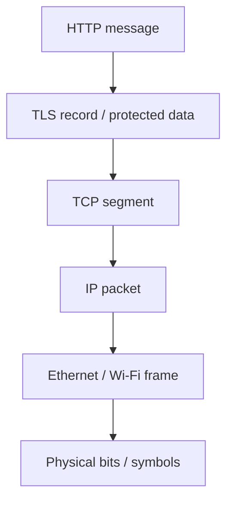

Receiver làm ngược lại:

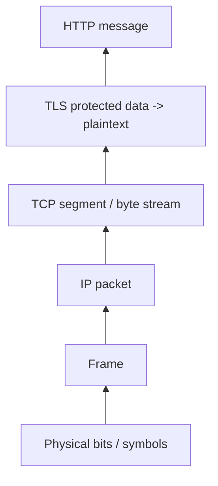

### Payload là gì?

“Payload” luôn relative với layer đang nói.

- Payload của Ethernet frame có thể là IP packet.
- Payload của IP packet có thể là TCP segment.
- Payload của TCP segment là bytes thuộc TCP byte stream.
- Những bytes đó có thể chứa TLS records.
- Sau TLS decryption, application thấy HTTP bytes/frames.

### Header được add/remove ở đâu?

Sender add header khi data đi xuống stack; receiver validate/consume metadata khi đi lên stack.

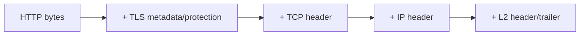

### Segment vs Packet vs Frame

| Term | Layer | Scope chính | Contains |
|---|---|---|---|
| TCP segment | L4 | transport endpoints | TCP header + stream bytes |
| UDP datagram | L4 | transport endpoints | UDP header + application datagram |
| IP packet | L3 | routed end-to-end qua IP path | IP header + L4 payload |
| Ethernet/Wi-Fi frame | L2 | một link/hop context | L2 header + L3 packet + trailer tùy protocol |

**Interview trap:** Trong casual conversation mọi người hay gọi tất cả là “packet”. Khi interview sâu, hãy dùng terminology chính xác theo layer.

### MTU và segmentation

L2 link có maximum transmission unit. TCP thường phối hợp với path MTU/MSS để chia stream thành segments phù hợp. Không nên suy luận rằng “một HTTP request = một TCP segment = một IP packet”; một request có thể trải trên nhiều segments, và nhiều application messages cũng có thể chia sẻ byte stream theo cách không trùng boundary.

### HTTP/3 exception

Với HTTP/3, không dùng stack `HTTP -> TLS record -> TCP` như trên. HTTP/3 chạy trên QUIC; QUIC chạy trên UDP và tích hợp TLS 1.3 handshake/key schedule vào transport security.[^8][^9]

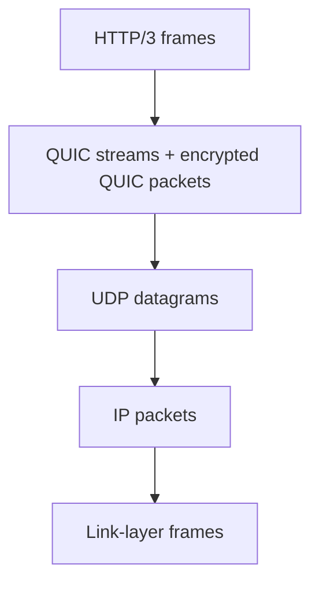

---

## 7. Interview & Self-test — OSI + Encapsulation

### Basic Questions

1. OSI có bao nhiêu layer và thứ tự?
2. TCP thuộc layer nào? IP thuộc layer nào?
3. Port và IP address khác nhau thế nào?
4. Segment, packet, frame khác nhau thế nào?

### Intermediate Questions

5. Tại sao MAC address không thay thế IP address để route Internet?
6. Khi packet qua router, phần nào thường thay đổi ở L2?
7. HTTP request có luôn vừa một TCP segment không?

### Deep Dive Questions

8. Tại sao mapping TLS vào OSI không hoàn toàn 1-to-1?
9. HTTP/3 làm mental model “HTTP over TCP” sai ở đâu?
10. OSI là implementation spec hay reference model?

### Production Questions

11. `curl` trả 404 thì bạn có cần debug L2 trước không? Tại sao?
12. DNS resolve được nhưng TCP connect timeout — layer suspicion chuyển sang đâu?

## Answers & Explanation

1. Application, Presentation, Session, Transport, Network, Data Link, Physical.
2. TCP L4; IP L3.
3. IP xác định host/interface trong routing context; port giúp OS demultiplex traffic đến process/socket.
4. Chúng là protocol data unit ở các layer khác nhau.
5. MAC addressing phục vụ local-link delivery; Internet cần hierarchical routable addressing.
6. Router thường decapsulate incoming L2 frame và tạo L2 frame mới cho next hop; IP packet tiếp tục được route.
7. Không; TCP là byte stream và segmentation không buộc trùng boundary application.
8. OSI là conceptual reference model; TLS implementation nằm giữa app protocol và transport trong TCP-based HTTPS nhưng không phải “universal L6 implementation”.
9. HTTP/3 dùng QUIC trên UDP, không dùng TCP.
10. Reference model.[^1]
11. 404 chứng minh request đã đi đủ xa để một HTTP component trả response; ưu tiên route/application config hơn physical layer.
12. Sau khi DNS có IP, nghi TCP/network path/firewall/listener/overload trước.


# Part IV — TCP vs UDP Deep Dive

## 8. TCP và UDP đang giải quyết hai contract khác nhau

Sai lầm phổ biến là học:

> TCP = reliable nhưng chậm. UDP = unreliable nhưng nhanh.

Câu này quá đơn giản. UDP cung cấp một transport datagram tối giản. TCP cung cấp một reliable, ordered byte stream với connection state, retransmission, flow control và congestion control. UDP **không cấm** application xây reliability, congestion control hay encryption phía trên; QUIC là ví dụ nổi bật: nó chạy trên UDP nhưng tự implement những cơ chế transport phức tạp hơn.[^3][^5][^9]

| Property | TCP | UDP |
|---|---|---|
| Connection model | Connection-oriented | Connectionless datagram API |
| Data model | Ordered byte stream | Message/datagram boundaries được giữ |
| Reliability | Có retransmission/ACK machinery | Không built-in |
| Ordering | In-order delivery to application | Không guarantee |
| Duplicate handling | TCP machinery xử lý stream delivery semantics | Application phải tự quyết |
| Flow control | Có, bảo vệ receiver | Không built-in |
| Congestion control | Có | Không built-in; application/protocol dùng UDP phải tự kiểm soát phù hợp[^5] |
| Header overhead | Lớn hơn UDP | Minimal |
| Startup cost | Có connection establishment | Không có TCP handshake |
| Typical examples | HTTP/1.1, HTTP/2, DB protocols | DNS thường dùng UDP cho nhiều query; QUIC/HTTP/3 chạy trên UDP |

### “UDP faster” có luôn đúng không?

Không. UDP có ít built-in machinery hơn, nhưng end-to-end latency phụ thuộc application protocol, congestion, loss, handshake design, packet size và network path. HTTP/3/QUIC dùng UDP nhưng không phải “raw UDP”; nó bổ sung encryption, reliability và congestion control.

---

## 9. TCP connection được định danh như thế nào?

Operationally, một TCP flow thường được nhận diện bởi tuple:

```text
(source IP, source port, destination IP, destination port)
```

Cùng server `10.0.0.5:443` có thể phục vụ hàng nghìn client connections vì source IP/source port khác nhau.

### Socket mental model

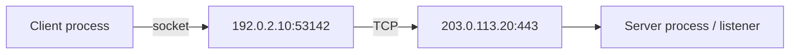

Server thường có một listening socket trên `:443`; OS tạo per-connection state khi handshake hoàn tất và application `accept()` connection.

---

## 10. TCP Three-Way Handshake

RFC 9293 mô tả basic three-way handshake bằng SYN, SYN-ACK và ACK, đồng thời sequence space của hai phía được synchronize.[^3]

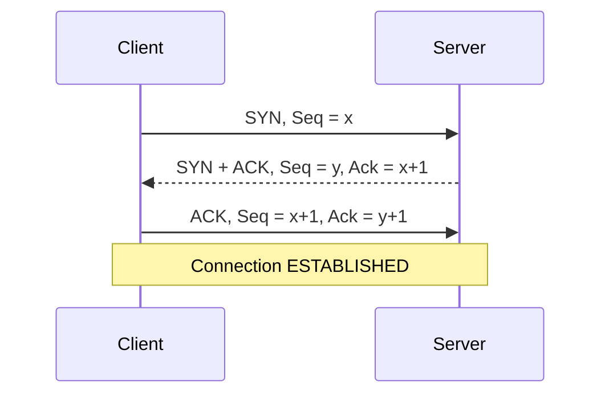

### SYN là gì?

`SYN` báo rằng endpoint muốn synchronize sequence number space và establish connection.

### ACK là gì?

`ACK` flag nói acknowledgment field hợp lệ. Acknowledgment number thường nghĩa là **next sequence number receiver expects**.

### Sequence number là packet number không?

Không. TCP sequence space track **bytes trong byte stream**, không đơn giản đếm packet. SYN chiếm một sequence number; pure ACK không chiếm sequence number. RFC 9293 minh họa chính xác điều này.[^3]

Ví dụ:

```text
Client SYN: Seq = 100
Server SYN-ACK: Ack = 101
```

Server đang nói: “Tôi đã nhận SYN ở sequence 100; byte/sequence tiếp theo tôi chờ là 101.”

### Tại sao cần 3 bước, không phải 2?

Handshake cần cả hai phía chứng minh:

1. đường client -> server hoạt động;
2. đường server -> client hoạt động;
3. cả hai đã biết initial sequence number của nhau và client đã nhận SYN của server.

Nếu chỉ `SYN -> SYN-ACK`, server chưa có xác nhận cuối rằng client đã nhận được server SYN và đồng bộ state.

### State machine interview-level

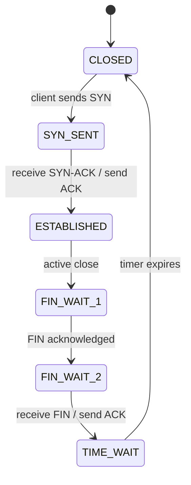

Server-side establishment:

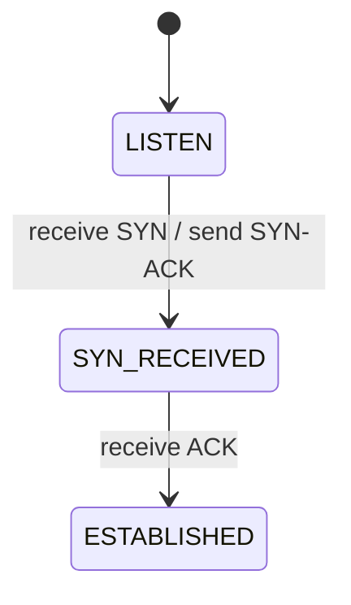

**Implementation note:** TCP state machine thực tế có nhiều state hơn: `CLOSE_WAIT`, `LAST_ACK`, `CLOSING`, v.v. Đừng biến diagram interview-level thành toàn bộ RFC state machine.

---

## 11. TCP Reliability — “reliable” thật sự nghĩa là gì?

TCP không làm packet “không bao giờ mất”. Network vẫn có thể drop, reorder hoặc duplicate packet. TCP tạo abstraction cho application rằng nó nhận **ordered byte stream**, hoặc connection fail rõ ràng nếu không thể tiếp tục.

Các mechanism cốt lõi:

- sequence numbers;
- acknowledgments;
- retransmission timeout;
- duplicate ACK / loss detection;
- receive window;
- sender-side congestion control;
- reassembly buffer.

### Scenario: segment chứa bytes giữa stream bị mất

Giả sử simplified stream:

```text
Segment A: bytes 1..1000       -> received
Segment B: bytes 1001..2000    -> LOST
Segment C: bytes 2001..3000    -> received
```

Receiver có thể nhận C nhưng không thể giao contiguous stream vượt qua gap B cho application theo semantics thông thường. Nó tiếp tục ACK vị trí contiguous tiếp theo đang chờ; sender phát hiện loss qua ACK behavior/SACK/loss detection hoặc timeout và retransmit dữ liệu thiếu.

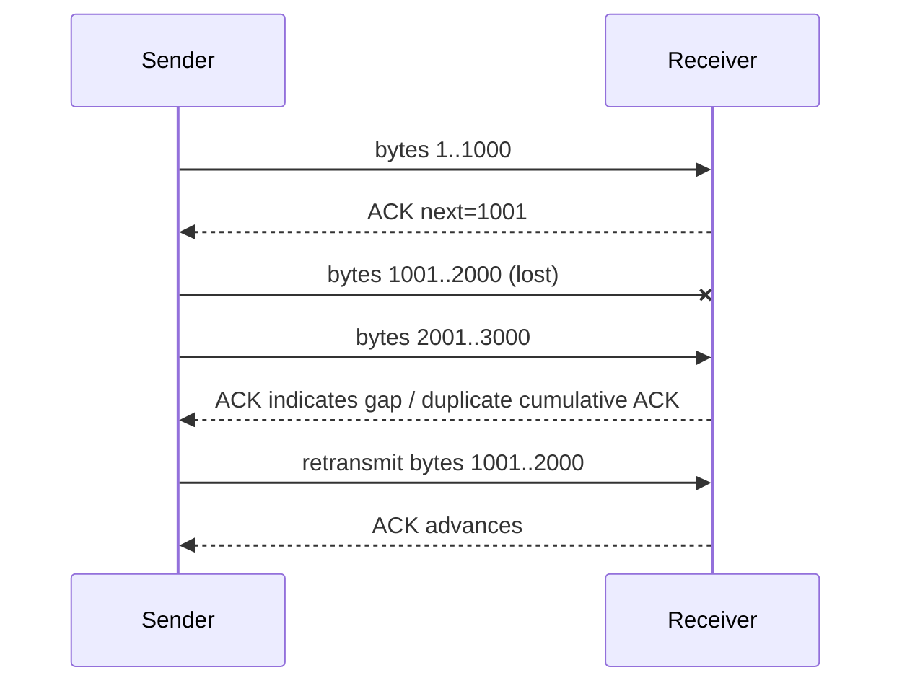

### Duplicate ACK và Fast Retransmit

Classic TCP congestion control mô tả fast retransmit/fast recovery để retransmit nghi ngờ mất packet mà không luôn phải đợi retransmission timer.[^4]

**Nuance:** Modern TCP stacks có SACK, RACK và các loss detection improvements. Trong interview cơ bản, cumulative ACK + duplicate ACK + RTO là mental model tốt; nếu interviewer hỏi implementation Linux cụ thể, hãy nói algorithm có thể hiện đại hơn baseline RFC 5681.

---

## 12. Sliding Window và Flow Control

### Problem

Nếu sender gửi 10 Gbps nhưng receiver application chỉ consume 10 Mbps, receive buffers có thể overflow.

### Mechanism

Receiver advertise receive window (`rwnd`) để nói bao nhiêu receive capacity đang available.

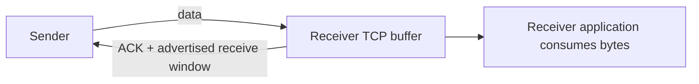

Sender không nên vượt receive window theo protocol semantics.

### Window không đồng nghĩa một packet

Window là lượng data in flight / sequence space cho phép, không phải “số packet cố định”.

---

## 13. Congestion Control

Flow control bảo vệ **receiver**; congestion control bảo vệ **network path và fairness**.

Classic standardized TCP congestion-control building blocks gồm slow start, congestion avoidance, fast retransmit và fast recovery.[^4]

### Sender có hai giới hạn quan trọng

Conceptually:

```text
sendable in-flight data <= min(rwnd, cwnd)
```

- `rwnd`: receiver capacity signal.
- `cwnd`: congestion window — sender estimate/policy về lượng data network có thể chịu.

### Slow start

Khi chưa biết path capacity, TCP không nên lập tức flood network. Nó probe capacity bằng cách tăng window theo ACK feedback.

### Congestion avoidance

Sau giai đoạn probe, growth thận trọng hơn. Loss/ECN/congestion signals khiến sender giảm sending rate tùy algorithm.

### Modern implementation detail

RFC 5681 là baseline conceptual algorithm. Production OS có thể dùng CUBIC, BBR hoặc algorithm khác. Interview nên nói rõ:

> “Conceptually TCP adapts its send rate using congestion feedback; the exact congestion-control algorithm is implementation-dependent.”

---

## 14. Flow Control vs Congestion Control

| Question | Flow Control | Congestion Control |
|---|---|---|
| Protects | Receiver | Network path / overall stability |
| Main concern | Receiver buffer/app consume kịp không? | Path có overloaded/congested không? |
| Key signal | Advertised receive window `rwnd` | Congestion window `cwnd`, loss/ECN/ACK dynamics |
| If ignored | Receiver buffer pressure | Packet loss, queueing, congestion collapse |
| Controlled by | Receiver feedback + sender behavior | Sender congestion algorithm |

### Interview answer 30 seconds

> Flow control prevents a fast sender from overwhelming the receiver, mainly through the advertised receive window. Congestion control prevents senders from overwhelming the network path, using a congestion window and feedback such as ACK/loss signals. The sender is constrained by both, conceptually by the minimum of `rwnd` and `cwnd`.

---

## 15. TCP Connection Termination

TCP is full duplex: mỗi direction được closed độc lập. Vì vậy graceful teardown thường được mô tả bằng FIN/ACK ở cả hai phía.

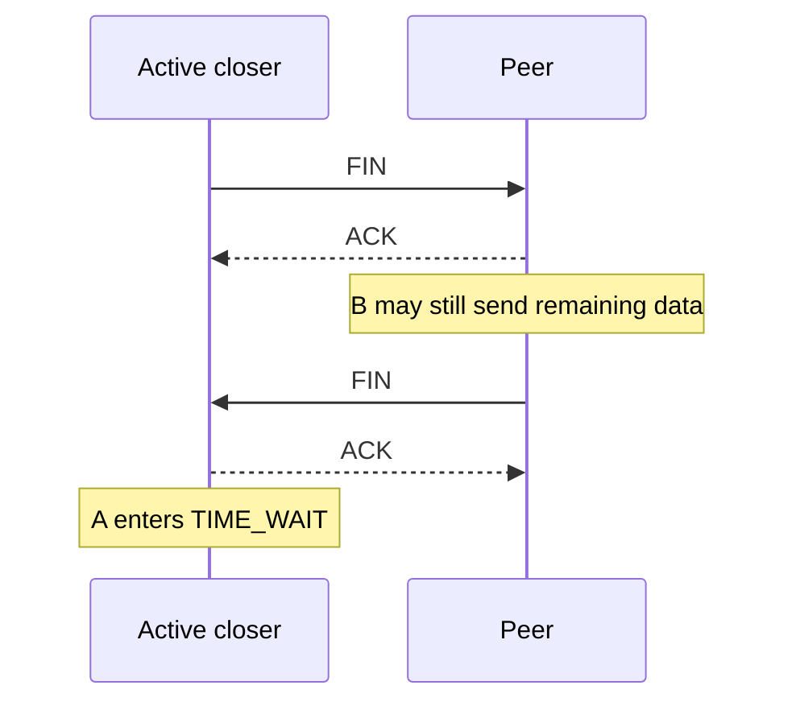

### FIN

Endpoint nói: “Tôi không còn data mới để gửi trong direction này.”

### CLOSE_WAIT

Khi local host nhận FIN từ peer và đã ACK, connection có thể ở `CLOSE_WAIT` trong lúc chờ local application đóng socket.

**Production signal:** rất nhiều `CLOSE_WAIT` lâu dài thường khiến bạn nghi application không close socket/resource sau khi peer đã đóng.

### TIME_WAIT

Active closer thường giữ TIME_WAIT để:

1. cho delayed segments của old connection hết lifetime;
2. có khả năng re-ACK final FIN nếu final ACK bị mất.

RFC 9293 mô tả TIME-WAIT và 2 MSL timer behavior.[^3]

### 100k TIME_WAIT có phải leak?

Không tự động. High request churn + short-lived TCP connections có thể tạo nhiều TIME_WAIT. Nó đáng lo khi đi kèm:

- ephemeral port exhaustion;
- memory/socket table pressure;
- connection establishment failures;
- latency do excessive connection churn.

**Đừng “fix” bằng kernel tuning ngẫu nhiên trước khi hỏi vì sao application không reuse connections.** Thường first principle tốt hơn là kiểm tra keep-alive/pooling.

---

## 16. TCP vs UDP — use-case reasoning

### Chọn TCP khi

- cần reliable ordered byte stream;
- protocol/library ecosystem dựa trên connection semantics;
- không muốn tự implement congestion/retransmission;
- DB protocol, HTTP/1.1/2, many RPC systems.

### Chọn UDP khi

- application cần message-oriented datagrams;
- loss có thể được xử lý theo domain-specific logic;
- protocol phía trên tự cung cấp transport semantics, ví dụ QUIC;
- latency/connection behavior yêu cầu khác TCP.

**Interview rule:** Không trả lời “video dùng UDP vì speed” rồi dừng. Hãy nói application có thể chấp nhận/handle loss khác với reliable ordered delivery, nhưng Internet-facing UDP protocol vẫn cần congestion behavior phù hợp.[^5]

---

## 17. Interview & Self-test — TCP/UDP

### Basic Questions

1. Three-way handshake gồm gì?
2. Sequence number và ACK number mang ý nghĩa gì?
3. TCP byte stream khác UDP datagram thế nào?
4. Flow control là gì?

### Intermediate Questions

5. Vì sao TCP cần three-way thay vì two-way handshake?
6. Nếu segment giữa stream mất nhưng segment sau đến, receiver làm gì?
7. `rwnd` và `cwnd` khác nhau thế nào?
8. Tại sao `CLOSE_WAIT` nhiều đáng nghi hơn `TIME_WAIT` trong một số leak scenario?

### Deep Dive Questions

9. Fast retransmit tránh chờ RTO như thế nào ở mức concept?
10. HTTP/2 vẫn có thể chịu TCP-level head-of-line blocking vì sao?
11. “UDP has no congestion control” có nghĩa protocol chạy trên UDP được phép ignore congestion không?

### Production Questions

12. Connect timeout có thể do server process không listen hay do firewall drop SYN không?
13. 100k TIME_WAIT — ba điều đầu tiên bạn kiểm tra?

## Answers & Explanation

1. SYN → SYN-ACK → ACK.
2. TCP sequence space theo bytes; ACK thường chỉ next sequence expected.
3. TCP không preserve message boundaries; UDP preserve datagram boundaries.
4. Cơ chế để sender không overwhelm receiver.
5. Cần đồng bộ sequence space hai phía và xác nhận client đã nhận server SYN.
6. Buffer out-of-order data nếu có thể, ACK gap, rồi nhận retransmission để hoàn thành contiguous stream.
7. `rwnd` phản ánh receiver capacity; `cwnd` phản ánh congestion-control constraint của network path.
8. `CLOSE_WAIT` nghĩa peer đã đóng nhưng local application chưa close; số lượng tăng lâu dài có thể phản ánh resource handling bug. TIME_WAIT thường là expected protocol state của active closer.
9. ACK pattern có thể báo loss trước timer, cho phép retransmit sớm hơn.[^4]
10. HTTP/2 streams multiplex logic trên một TCP byte stream; khi TCP mất bytes, TCP phải repair gap trước khi byte stream tiếp tục tiến cho higher layer.
11. Không. RFC 8085 nhấn mạnh UDP applications/protocols cần congestion behavior phù hợp để tránh congestion collapse.[^5]
12. Có; connect timeout chỉ là symptom rằng connection không established trong deadline.
13. Connection churn rate; keep-alive/pool reuse; ephemeral ports/socket resources và bên nào active-close.


# Part V — DNS Deep Dive

## 18. DNS không chỉ là “hostname -> IP”

DNS là distributed hierarchical naming system. Nó có nhiều record types, caching, delegation và authoritative ownership. `A`/`AAAA` chỉ là một phần của DNS.[^10][^11]

### Vocabulary

- **Hostname:** tên của một host/service trong naming context, ví dụ `api.example.com`.
- **Domain:** một node/subtree trong DNS namespace.
- **Stub resolver / OS resolver:** client-side component gửi query thay cho application.
- **Recursive resolver:** resolver làm phần lớn công việc lookup, cache kết quả và trả answer cho client.
- **Root servers:** điểm bắt đầu delegation hierarchy khi cache không đủ.
- **TLD servers:** authoritative cho zone cấp cao như `.com` ở delegation level.
- **Authoritative server:** nguồn authoritative data cho zone.

---

## 19. DNS resolution lifecycle

Một flow uncached, simplified:

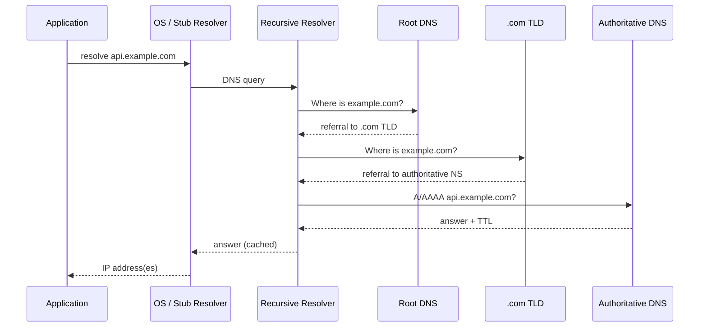

### Nhưng production thường không đi hết flow này

Cache có thể tồn tại ở nhiều nơi. Nếu recursive resolver đã cache A/AAAA/CNAME/delegation, nó skip nhiều bước. Browser có thể có cache riêng tùy implementation; OS/runtime cũng có thể cache theo policy.

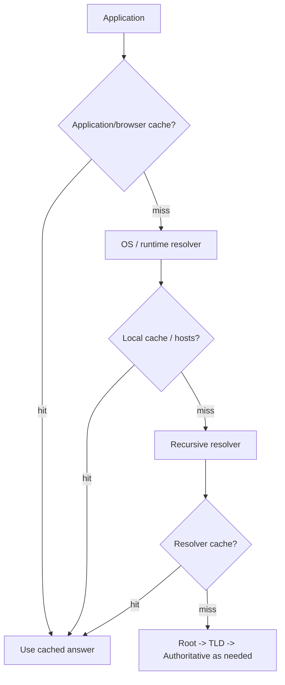

---

## 20. DNS Record Types cần biết

| Record | Meaning | Example use |
|---|---|---|
| A | Name -> IPv4 address | `api.example.com -> 203.0.113.10` |
| AAAA | Name -> IPv6 address | IPv6 endpoint |
| CNAME | Alias -> canonical name | `www -> edge.provider.net` |
| NS | Zone delegated to name servers | authoritative delegation |
| MX | Mail exchanger | email routing |
| TXT | Arbitrary text records | verification, SPF-related data, metadata |
| SOA | Zone authority metadata | serial, timers, primary authority metadata |

### CNAME nuance

CNAME không phải “redirect HTTP”. DNS resolver follows naming alias chain to obtain address records; browser không nhận một HTTP 301 chỉ vì CNAME.

---

## 21. TTL và DNS caching

RFC 1034/1035 định nghĩa TTL là thời gian record có thể được giữ trong cache trước khi nguồn data cần được hỏi lại.[^10][^11]

### Tại sao TTL quan trọng?

**High TTL**
- ít query authoritative hơn;
- lookup nhanh hơn/caching tốt;
- thay đổi endpoint/failover propagate chậm hơn.

**Low TTL**
- thay đổi được thấy nhanh hơn về lý thuyết;
- tăng DNS query load;
- không đảm bảo mọi client thay đổi ngay lập tức vì caching layers/policies có thể khác nhau.

### “DNS propagation” thực chất là gì?

Không phải một packet “propagate” khắp Internet. Thường đó là giai đoạn các caches cũ hết TTL và resolver bắt đầu lấy record mới.

### Stale cache

Nếu client/resolver giữ answer cũ lâu hơn expected hoặc có policy serve-stale, bạn có thể thấy một số traffic vẫn đi endpoint cũ. Vì thế deployment/failover cần overlap window, không nên assume DNS change = instant cutover.

---

## 22. DNS load balancing và failover

Authoritative DNS có thể trả nhiều addresses hoặc policy-based answer. Nhưng DNS load balancing khác L4/L7 load balancer:

- DNS quyết định **name resolution result**, không inspect từng HTTP request.
- Cached answer làm traffic stick theo TTL/policy.
- Client có thể chọn trong nhiều addresses theo algorithm riêng.
- Health/failover speed bị ràng buộc bởi caching behavior.

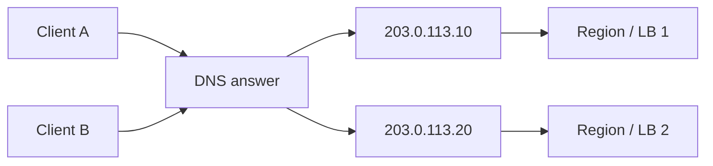

---

## 23. DNS troubleshooting

### Symptom

```text
java.net.UnknownHostException: service.example.com
```

### Reasoning order

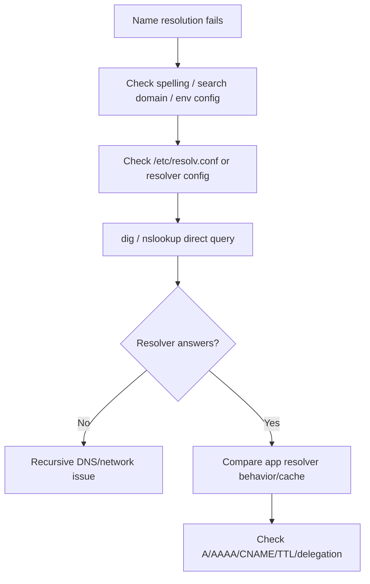

### Commands

```bash
# Normal resolver query
dig api.example.com

# Only useful answer section
dig +noall +answer api.example.com

# Query a specific resolver
dig @8.8.8.8 api.example.com

# Trace delegation path (diagnostic, not same as normal recursive lookup)
dig +trace api.example.com

# Ask OS/NSS path used by many applications
getent hosts api.example.com

# Legacy/common utility
nslookup api.example.com
```

BIND documentation mô tả `dig` là tool linh hoạt để interrogate DNS servers và troubleshoot DNS.[^21]

### Important production distinction

`dig` thành công nhưng application vẫn `UnknownHostException` không vô lý. `dig` có thể query DNS trực tiếp, trong khi application/runtime đi qua resolver/cache/NSS/container config khác.

---

## 24. Interview & Self-test — DNS

### Basic Questions

1. A và AAAA khác nhau gì?
2. CNAME có phải HTTP redirect không?
3. TTL dùng làm gì?
4. Recursive resolver và authoritative server khác nhau thế nào?

### Intermediate Questions

5. Tại sao DNS change không instant với mọi client?
6. Root server có trả IP cuối cùng của `api.example.com` luôn không?
7. `dig` pass nhưng Java app fail resolution — bạn nghĩ gì?

### Deep Dive Questions

8. DNS load balancing khác L7 load balancing thế nào?
9. Cached CNAME/delegation có thể làm resolver skip bước nào?
10. Low TTL có trade-off gì?

### Production Questions

11. Một region IP chết nhưng DNS đã đổi — vì sao vẫn có traffic vào IP cũ?
12. Trong Kubernetes, service discovery bằng DNS liên quan đến Service name thế nào?

## Answers & Explanation

1. A map IPv4; AAAA map IPv6.
2. Không; CNAME là DNS alias.
3. Giới hạn thời gian cache record trước khi refresh.[^10][^11]
4. Recursive resolver thực hiện/cached lookup cho client; authoritative server giữ authoritative zone data.
5. Caches hết hạn ở thời điểm khác nhau và policy resolver có thể khác.
6. Thường root trả referral xuống lower-level authoritative hierarchy, không phải final host address.
7. So sánh resolver path: JVM/runtime cache, `/etc/nsswitch.conf`, `/etc/resolv.conf`, container DNS, search domain.
8. DNS chọn resolution result; L7 LB có thể inspect từng HTTP request và chọn backend per-request.
9. Resolver có thể bỏ qua root/TLD hoặc authoritative query nếu cache đủ data.
10. Nhanh thích nghi thay đổi hơn nhưng tăng query load và không đảm bảo zero-stale.
11. TTL/cache cũ vẫn còn hiệu lực; client còn connection cũ cũng có thể reuse connection mà không re-resolve DNS.
12. Kubernetes tạo DNS records cho Services/Pods để workloads discover Services bằng stable names.[^19]

---

# Part VI — HTTP Deep Dive

## 25. HTTP là protocol về semantics của request/response

HTTP định nghĩa method semantics, target resource, field semantics, status codes, caching model và message abstraction. HTTP/1.1, HTTP/2 và HTTP/3 giữ core semantics nhưng khác wire framing/transport mapping.[^6][^7][^8]

### HTTP/1.1 request example

```http
POST /api/orders HTTP/1.1
Host: example.com
Content-Type: application/json
Authorization: Bearer <token>
Content-Length: 18

{"productId":123}
```

### Anatomy

- **Method:** operation semantics (`POST`).
- **Request target/path:** `/api/orders`.
- **Protocol version:** HTTP/1.1 ở textual start-line.
- **Header fields:** metadata/control information.
- **Body/content:** representation/content sent with request.

**Important:** HTTP/2 và HTTP/3 không serialize wire request bằng exact textual start-line/headers như HTTP/1.1; chúng use binary framing/streams, nhưng logical semantics vẫn map sang method, scheme, authority, path, fields và content.

---

## 26. HTTP Methods — Safe, Idempotent, Cacheable

RFC 9110 định nghĩa:

- **Safe:** semantics essentially read-only từ góc nhìn client request.
- **Idempotent:** intended effect của nhiều identical requests giống một request.
- **Cacheable:** method semantics cho phép caching trong điều kiện spec/cache policy phù hợp.[^6]

| Method | Safe | Idempotent | Cacheability / typical note | Typical use |
|---|---:|---:|---|---|
| GET | Yes | Yes | Commonly cacheable when response rules allow | Read representation |
| HEAD | Yes | Yes | Cache-related semantics exist | GET metadata without body |
| POST | No | No by default | Spec has caching semantics but caches rarely use it without explicit conditions | Create/action/command |
| PUT | No | Yes | Not typically cached as response reuse pattern | Replace target state |
| PATCH | No | Not guaranteed | Typically not cache-focused | Partial modification |
| DELETE | No | Yes | Response not generally used as reusable representation | Remove target state |
| OPTIONS | Yes | Yes | Usually capability metadata | Discover communication options |

### Idempotent ≠ no side effects

`DELETE /orders/123` có thể write logs mỗi lần. Idempotency nói về **intended effect requested by client**. Repeating DELETE vẫn có intended final state “resource absent”.[^6]

### POST có thể được retry không?

Có thể, nhưng automatic retry phải reason về semantics. Với non-idempotent operation như payment, retry mù có thể duplicate side effect. Solution thường là domain-level idempotency key, dedupe store hoặc unique operation ID.

---

## 27. HTTP Status Codes — semantic, không chỉ class

### Success

| Code | Meaning | Backend example |
|---|---|---|
| 200 OK | Request succeeded; response content depends method | GET order |
| 201 Created | Request created resource | POST order |
| 202 Accepted | Accepted for processing, not necessarily completed | async job queued |
| 204 No Content | Success with no response content | update/delete no body |

### Client-side / request-side

| Code | Meaning | Important nuance |
|---|---|---|
| 400 Bad Request | Server cannot/will not process due request error | malformed syntax/framing/invalid request form |
| 401 Unauthorized | Request lacks valid authentication credentials | historically named “Unauthorized”; typically authn challenge |
| 403 Forbidden | Server understood request but refuses to fulfill | authentication may or may not be the reason |
| 404 Not Found | Target resource not found / server unwilling to disclose | can be security-motivated too |
| 409 Conflict | Conflict with current resource state | version conflict, duplicate state transition |
| 422 Unprocessable Content | Content type/syntax understood but instructions semantically unprocessable | validation semantics[^22] |
| 429 Too Many Requests | Rate limiting / too many requests | may include `Retry-After`[^12] |

### Server/gateway

| Code | Meaning | Typical production interpretation |
|---|---|---|
| 500 Internal Server Error | Origin encountered unexpected condition | application bug/failure |
| 502 Bad Gateway | Gateway/proxy got invalid response from upstream | reset, protocol error, invalid upstream response |
| 503 Service Unavailable | Temporarily unable, overload/maintenance | load shedding, no healthy backend, maintenance |
| 504 Gateway Timeout | Gateway/proxy did not receive timely upstream response | backend/downstream too slow relative to gateway timeout |

### 401 vs 403

Interview-safe answer:

> 401 is about missing/invalid authentication credentials for the target resource and usually involves an authentication challenge. 403 means the server understood the request but refuses to fulfill it. “401 = unauthenticated, 403 = authenticated but unauthorized” is a useful rule of thumb, but 403 semantics are broader than that.[^6]

### 400 vs 422

> 400: request itself is malformed/unacceptable at a more syntactic/protocol level. 422: media type and syntax are understood, but contained instructions fail semantic processing.[^22]

Example:

```json
{
  "quantity": -10
}
```

JSON syntax valid; domain says quantity must be positive → 422 can be a good semantic choice.

### 502 vs 503 vs 504

```mermaid
flowchart LR
    C[Client] --> G[Gateway / Proxy]
    G --> B[Backend]
    B --> D[(DB / downstream)]
```

- **502:** gateway tried to act as gateway/proxy but upstream response was invalid/unusable.
- **503:** service currently unavailable/overloaded/maintenance/no capacity.
- **504:** gateway waited for upstream but deadline expired.

**Trap:** 504 does **not** prove backend is down; backend may still be processing after gateway gave up.

---

## 28. HTTP/1.1

HTTP/1.1 uses textual message syntax and usually TCP. Persistent connections are a major performance feature; modern HTTP/1.1 connection is persistent unless closure is signaled according to message/connection rules.[^7]

### Keep-alive benefit

Without reuse:

```mermaid
sequenceDiagram
    participant C as Client
    participant S as Server
    C->>S: TCP handshake
    C->>S: TLS handshake (HTTPS)
    C->>S: Request 1
    S-->>C: Response 1
    C-xS: Close
    C->>S: New TCP handshake
    C->>S: New TLS handshake
    C->>S: Request 2
```

With persistent connection:

```mermaid
sequenceDiagram
    participant C as Client
    participant S as Server
    C->>S: TCP + TLS setup once
    C->>S: Request 1
    S-->>C: Response 1
    C->>S: Request 2 on same connection
    S-->>C: Response 2
    C->>S: Request 3 on same connection
```

### Pipelining

HTTP/1.1 permits pipelining conceptually: send multiple requests without waiting for each response, nhưng responses phải tương ứng theo order. In practice browser/client adoption historically limited because response ordering and failure behavior make it awkward; modern systems prefer HTTP/2 multiplexing.[^7]

---

## 29. HTTP/2

HTTP/2 keeps HTTP semantics but changes wire representation to binary frames and multiplexed streams. RFC 9113 describes independent streams, flow control và header compression.[^13]

```mermaid
flowchart TB
    C[One TCP connection] --> S1[Stream 1<br/>request/response A]
    C --> S2[Stream 3<br/>request/response B]
    C --> S3[Stream 5<br/>request/response C]
```

### Key concepts

- **Binary framing:** HEADERS/DATA/etc frames.
- **Streams:** independent logical bidirectional sequences within connection.
- **Multiplexing:** multiple requests concurrently use one TCP connection.
- **HPACK:** compress repeated header fields.
- **Flow control:** per-stream + connection-level.

### HTTP/2 head-of-line nuance

At HTTP layer, one slow stream need not block other streams logically. Nhưng tất cả HTTP/2 frames still ride a single TCP byte stream. Nếu TCP packet carrying bytes is lost, TCP must repair the byte-stream gap before higher-layer bytes after the gap can progress. Đó là **TCP-level HOL blocking**.

---

## 30. HTTP/3 + QUIC

HTTP/3 maps HTTP semantics onto QUIC. QUIC provides streams, per-stream flow control, low-latency connection establishment và runs over UDP; HTTP/3 uses QPACK for field compression.[^8][^9]

```mermaid
flowchart TB
    Q[QUIC connection over UDP] --> A[QUIC Stream A<br/>HTTP request A]
    Q --> B[QUIC Stream B<br/>HTTP request B]
    Q --> C[QUIC Stream C<br/>HTTP request C]
```

### Why it mitigates HTTP/2 TCP HOL

Loss affecting bytes for one QUIC stream does not require unrelated streams to wait for a single global TCP byte-stream gap. RFC 9114 explicitly notes streams are independent such that loss/blocking on one stream does not prevent progress on others.[^8]

### TLS integration

QUIC uses TLS 1.3 cryptographic handshake components integrated into QUIC; it is not “open TCP then run TLS records”.

### Connection migration

QUIC uses connection IDs so a connection can survive address/path change better than a TCP connection identified by the traditional address/port tuple — useful when mobile client moves Wi-Fi ↔ cellular, subject to protocol validation/security rules.[^9]

---

## 31. HTTP/1.1 vs HTTP/2 vs HTTP/3

| Property | HTTP/1.1 | HTTP/2 | HTTP/3 |
|---|---|---|---|
| Semantics | HTTP | Same core HTTP semantics | Same core HTTP semantics |
| Wire | Textual messages | Binary frames | Binary HTTP/3 frames over QUIC |
| Transport | Usually TCP | TCP | QUIC over UDP |
| Multiplexing | Limited; pipelining concept exists | Yes, streams | Yes, QUIC streams |
| Header compression | No equivalent HPACK | HPACK | QPACK |
| Loss impact | per TCP connection | loss can block all streams at TCP byte-stream level | loss generally isolated better across QUIC streams |
| TLS | HTTPS adds TLS | HTTPS commonly TLS | QUIC integrates TLS 1.3 machinery |
| Connection migration | TCP tuple makes migration difficult | same | QUIC supports connection migration concepts |

---

## 32. Interview & Self-test — HTTP

### Basic Questions

1. Safe và idempotent khác nhau thế nào?
2. GET idempotent không? POST mặc định idempotent không?
3. 401 và 403 khác nhau thế nào?
4. 502 và 504 khác nhau thế nào?

### Intermediate Questions

5. Tại sao keep-alive giảm latency?
6. HTTP/2 multiplexing giải quyết vấn đề gì?
7. Tại sao HTTP/2 vẫn chịu TCP-level HOL?
8. 422 khác 400 thế nào?

### Deep Dive Questions

9. HTTP/3 dùng TCP không?
10. Tại sao HTTP/3 không chỉ là “HTTP/2 chạy trên UDP”?
11. POST có thể cache không?
12. Idempotency của DELETE có nghĩa second DELETE phải trả cùng status code không?

### Production Questions

13. Proxy trả 504 nhưng backend log cho thấy request complete 2s sau đó — mâu thuẫn không?
14. App tạo TCP/TLS connection cho mọi HTTP request — symptom gì?

## Answers & Explanation

1. Safe nói request không yêu cầu state change; idempotent nói repeat identical request có same intended effect.[^6]
2. GET yes; POST không guaranteed.
3. 401 authentication credentials; 403 understood but refused.[^6]
4. 502 invalid upstream response; 504 upstream did not respond in gateway deadline.
5. Reuse tránh repeated TCP/TLS setup và slow-start/reset effects.
6. Nhiều logical request/response concurrently trên một connection.[^13]
7. Vì streams vẫn serialize qua một TCP byte stream và TCP loss repair phải fill gaps.
8. 422 = syntactically understood content nhưng semantically cannot process.[^22]
9. Không; HTTP/3 dùng QUIC trên UDP.[^8]
10. QUIC provides its own stream, loss recovery, congestion control, connection IDs, TLS integration.
11. RFC 9110 có caching semantics cho POST trong điều kiện phù hợp, nhưng practical caches overwhelmingly focus GET/HEAD.[^6]
12. Không nhất thiết. Idempotency nói intended server effect; response code có thể khác do resource state/history.
13. Không. Gateway deadline ngắn hơn backend processing time; gateway trả 504 trước khi backend xong.
14. High handshake latency/CPU, TIME_WAIT/ephemeral-port churn, low throughput; inspect keep-alive and pool reuse.


# Part VII — HTTPS + TLS Deep Dive

## 33. HTTPS không chỉ là “HTTP + encryption”

Với HTTP/1.1 hoặc HTTP/2, simplified stack:

```mermaid
flowchart TD
    H[HTTP] --> TLS[TLS]
    TLS --> TCP[TCP]
    TCP --> IP[IP]
    IP --> L2[Ethernet / Wi-Fi]
```

TLS giải quyết ba nhóm vấn đề chính:

1. **Confidentiality** — người trung gian không đọc plaintext application data dễ dàng.
2. **Integrity** — phát hiện data bị sửa đổi.
3. **Authentication** — thường client xác thực server identity qua certificate chain; mutual TLS có thể authenticate client nữa.

TLS 1.3 handshake định nghĩa certificate, CertificateVerify signature, key establishment và sau đó application traffic dùng traffic secrets/keys được derive.[^14]

---

## 34. Certificate, CA, Public Key, Private Key

### Certificate

Certificate bind một public key với identity/subject information và được signer/CA ký theo PKI rules.

### CA

Client trust một set root CAs. Server thường gửi leaf certificate và intermediate certificates; client xây/validate chain đến trust anchor phù hợp.

### Public key / Private key

- Public key có thể chia sẻ.
- Private key phải giữ bí mật.
- TLS 1.3 certificate authentication thường dùng private key để **sign handshake context** qua `CertificateVerify`, chứng minh server sở hữu private key tương ứng certificate.[^14]

### Digital signature

Signature không giống encryption payload. Nó chứng minh possession/authenticity/integrity của signed context.

---

## 35. TLS 1.3 handshake mental model

Simplified full handshake:

```mermaid
sequenceDiagram
    participant C as Client
    participant S as Server

    C->>S: ClientHello<br/>supported versions, key share, SNI/ALPN...
    S-->>C: ServerHello<br/>selected parameters, key share
    Note over C,S: Both derive handshake secrets
    S-->>C: EncryptedExtensions
    S-->>C: Certificate
    S-->>C: CertificateVerify
    S-->>C: Finished
    C->>S: Finished
    Note over C,S: Encrypted application traffic
```

### Certificate validation client-side

Client conceptually kiểm tra:

- chain/signature hợp lệ;
- trust anchor được tin cậy;
- hostname/service identity phù hợp;
- validity time;
- key usage/policies;
- revocation behavior tùy client/PKI context.

### Key establishment

TLS 1.3 thường dùng ephemeral Diffie-Hellman family key exchange để hai phía derive shared secrets. Sau đó derive **symmetric traffic keys**.

---

## 36. Tại sao server không dùng private key để encrypt toàn bộ HTTP traffic?

Đây là câu interview rất hay.

### Answer ngắn

> Public-key crypto đắt hơn và không phù hợp để encrypt bulk traffic. Trong TLS 1.3, asymmetric cryptography chủ yếu dùng để authenticate handshake và establish/verify key agreement. Sau đó hai phía derive symmetric traffic keys và dùng symmetric authenticated encryption cho application data.

### Deep reasoning

1. Symmetric encryption nhanh hơn rất nhiều cho bulk data.
2. TLS 1.3 thiết kế ephemeral key agreement để có forward-secrecy properties.
3. Server certificate private key chủ yếu chứng minh identity bằng signature; nó không trở thành “AES key cho toàn session”.

**Interview trap:** “HTTPS uses asymmetric encryption” là incomplete. Correct mental model là **asymmetric authentication/key establishment + symmetric traffic encryption**.

---

## 37. TCP handshake vs TLS handshake

Với HTTPS trên TCP:

```mermaid
flowchart LR
    DNS[DNS] --> TCP[TCP 3-way handshake]
    TCP --> TLS[TLS handshake]
    TLS --> HTTP[Encrypted HTTP traffic]
```

Nếu reuse existing connection, request tiếp theo có thể skip TCP/TLS handshakes entirely.

### TLS session resumption

TLS có mechanisms để resume prior cryptographic state và giảm setup cost. TLS 1.3 cũng có 0-RTT early data option, nhưng early data có replay considerations nên không nên dùng bừa cho non-idempotent operations.

---

## 38. TLS termination

Load balancer/reverse proxy có thể terminate TLS:

```mermaid
flowchart LR
    C[Client] -->|TLS connection A| LB[Load Balancer / Reverse Proxy]
    LB -->|HTTP plaintext or TLS connection B| APP[Backend]
```

### Implications

- Client TCP/TLS connection **không nhất thiết** là cùng TCP connection tới backend.
- Proxy có thể inspect L7 only nếu nó decrypt/terminate TLS hoặc có another mechanism.
- “HTTPS end-to-end” cần clarify termination topology: client→LB encrypted, LB→backend có thể encrypted hoặc plaintext depending architecture.

---

## 39. TLS failure symptoms

| Failure | Typical symptom | First checks |
|---|---|---|
| Expired cert | browser/client certificate error | validity dates |
| Hostname mismatch | certificate name error | SAN / requested host |
| Unknown CA | trust failure | chain/trust store |
| Protocol/cipher mismatch | handshake failure | supported TLS versions/ciphers |
| SNI routing mismatch | wrong cert/backend | SNI/proxy config |
| ALPN mismatch | HTTP version negotiation issue | ALPN + proxy/client support |
| Handshake timeout | timeout before HTTP | network/TLS server load/config |

### Debug

```bash
curl -v https://api.example.com/
openssl s_client -connect api.example.com:443 -servername api.example.com
```

`curl -v` hiển thị verbose connection/header diagnostics và rất hữu ích để xem DNS connect, TLS negotiation và HTTP exchange.[^20]

---

## 40. Interview & Self-test — TLS

### Basic Questions

1. HTTPS thêm gì so với HTTP?
2. Certificate dùng làm gì?
3. Symmetric và asymmetric crypto khác role thế nào trong TLS?

### Intermediate Questions

4. TLS handshake xảy ra trước hay sau TCP handshake với HTTP/2 over TCP?
5. Server private key dùng để encrypt toàn bộ HTTP body không?
6. TLS termination ở LB nghĩa là gì?

### Deep Dive Questions

7. CertificateVerify trong TLS 1.3 chứng minh điều gì?
8. Tại sao connection reuse giảm TLS cost?
9. HTTP/3 TLS flow khác TCP-based HTTPS thế nào?

### Production Questions

10. DNS + TCP connect OK nhưng request fail trước HTTP status — bạn suspect gì?
11. Backend logs không thấy request nhưng LB có TLS handshake errors — layer nào cần debug?

## Answers & Explanation

1. Confidentiality, integrity và authentication properties qua TLS.
2. Bind identity/public key theo PKI và giúp authenticate endpoint.
3. Asymmetric key/signature machinery authenticate/key-establish; symmetric keys protect bulk traffic.
4. Sau TCP connection establishment, trước encrypted HTTP application data.
5. Không. TLS 1.3 dùng derived symmetric traffic keys cho bulk data.[^14]
6. LB là endpoint TLS đối với client và có thể mở connection riêng tới backend.
7. Endpoint chứng minh possession của private key bằng signature trên handshake context.[^14]
8. Không cần full connection/handshake setup cho mỗi request.
9. QUIC integrates TLS 1.3 handshake cryptographic machinery; không có TCP layer ở dưới HTTP/3.[^8][^9]
10. TLS/certificate/SNI/ALPN/protocol negotiation.
11. TLS/proxy edge trước application.

---

# Part VIII — Connection Reuse và Connection Pools

## 41. Tại sao connection reuse quan trọng?

Connection creation có nhiều cost:

- TCP handshake latency;
- TLS handshake latency + crypto work;
- kernel socket state/buffers;
- congestion-control startup state;
- DB authentication/session setup;
- ephemeral ports và file descriptors.

Do đó production clients thường reuse connections thay vì create-per-request.

---

## 42. HTTP Client Connection Pool

```mermaid
flowchart TD
    A[Application requests] --> P[HTTP Connection Pool]
    P --> C1[Connection 1]
    P --> C2[Connection 2]
    P --> C3[Connection 3]
    C1 --> S[External Service]
    C2 --> S
    C3 --> S
```

### HTTP/1.1

Một connection thường phục vụ một in-flight request tại một thời điểm trong nhiều clients không dùng pipelining; concurrency cần multiple connections.

### HTTP/2

Một connection có thể multiplex nhiều concurrent streams. Vì vậy pool sizing mental model khác HTTP/1.1. Envoy documentation mô tả HTTP/1.1 pool bind requests vào available connections, còn HTTP/2/3 pools multiplex requests tới stream limit.[^15]

---

## 43. Database Connection Pool

```mermaid
flowchart TD
    T[Application threads/tasks] --> P[DB Connection Pool]
    P --> C1[JDBC Connection 1]
    P --> C2[JDBC Connection 2]
    P --> C3[JDBC Connection 3]
    P --> C4[JDBC Connection 4]
    C1 --> DB[(Database)]
    C2 --> DB
    C3 --> DB
    C4 --> DB
```

### Core parameters

- **maximumPoolSize:** upper bound physical DB connections.
- **minimumIdle:** target/min idle behavior depending pool.
- **connectionTimeout / acquisition timeout:** application chờ một pool connection tối đa bao lâu.
- **idleTimeout:** idle connection được retire sau bao lâu, theo pool semantics.
- **maxLifetime:** retire connection sau total lifetime limit.
- **keepalive:** test/refresh idle connection tùy pool.

HikariCP mô tả `maximumPoolSize`, `connectionTimeout`, `idleTimeout`, `maxLifetime`, `minimumIdle` với các semantics này.[^18]

### Critical distinction

`connectionTimeout` của **pool** có thể nghĩa “wait to acquire a pooled DB connection”, không phải network TCP connect timeout.

Tên giống nhau, layer khác nhau.

---

## 44. 10,000 application threads không có nghĩa cần 10,000 DB connections

DB connection là resource nặng hơn thread/task và database có finite concurrency capacity.

```mermaid
flowchart TD
    T[10,000 tasks/requests] --> Q[Queue / scheduler / backpressure]
    Q --> P[DB pool: e.g. bounded size]
    P --> DB[(Database finite CPU / I/O)]
```

Nếu mọi thread mở DB connection riêng:

- DB memory/process/thread overhead tăng;
- lock/contention tăng;
- CPU context switching tăng;
- database saturation sớm;
- “more connections” có thể làm throughput **tệ hơn**.

Pool là concurrency limiter và resource manager, không chỉ cache để “connect nhanh hơn”.

---

## 45. Pool exhaustion

Scenario:

```text
Application threads/tasks: 1000
DB pool: 50
DB max connections: 200
```

Nếu 50 connections đều busy:

```mermaid
flowchart LR
    R[Incoming request] --> A[Acquire DB connection]
    A -->|pool full| Q[Wait queue]
    Q -->|connection returned| DB[Run query]
    Q -->|acquisition timeout| E[Pool timeout error]
```

### Root causes

- queries chậm;
- transactions giữ connection quá lâu;
- connection leak;
- traffic spike;
- DB itself saturated;
- pool quá nhỏ so với healthy service capacity;
- downstream latency làm requests pile up.

### Wrong fix

Tăng pool từ 50 → 500 mà không check DB capacity có thể biến queue ở application thành overload trực tiếp ở DB.

---

## 46. Java backend examples

### JDK HttpClient

JDK `HttpClient.Builder.connectTimeout` đặt timeout cho phase establish new connection; nếu reuse prior connection thì timeout đó không áp dụng cho việc establishment vì không cần tạo connection mới.[^17]

```java
HttpClient client = HttpClient.newBuilder()
        .connectTimeout(Duration.ofSeconds(2))
        .version(HttpClient.Version.HTTP_2)
        .build();

HttpRequest request = HttpRequest.newBuilder()
        .uri(URI.create("https://api.example.com/orders"))
        .timeout(Duration.ofSeconds(5))
        .GET()
        .build();
```

### HikariCP/Spring Boot mental config

```yaml
spring:
  datasource:
    hikari:
      maximum-pool-size: 20
      minimum-idle: 5
      connection-timeout: 2000
      idle-timeout: 600000
      max-lifetime: 1800000
```

**Do not cargo-cult numbers.** Pool size phải dựa trên DB capacity, query duration, concurrency, workload và instance count.

---

## 47. Interview & Self-test — Connection Pools

### Basic Questions

1. Tại sao cần connection pool?
2. HTTP keep-alive và DB pool giống nhau ở ý tưởng nào?
3. Pool exhaustion là gì?

### Intermediate Questions

4. Tại sao 1000 app threads không cần 1000 DB connections?
5. Pool acquisition timeout khác TCP connect timeout thế nào?
6. HTTP/2 pool sizing khác HTTP/1.1 vì sao?

### Deep Dive Questions

7. Tại sao connection pool cũng là concurrency control mechanism?
8. Tăng DB pool size có thể làm hệ thống chậm hơn bằng cách nào?
9. maxLifetime giúp gì?

### Production Questions

10. Pool timeout tăng đột biến nhưng DB CPU thấp — bạn check gì?
11. Pool active=maximum, query p99 cao — inference gì?

## Answers & Explanation

1. Reuse expensive connections + bound/manage concurrency/resources.
2. Reuse underlying connection thay vì recreate mỗi operation.
3. Không còn connection available, callers phải wait rồi có thể timeout.
4. DB capacity finite; concurrency cần queue/bounded pool, không map 1:1 thread↔connection.
5. Acquisition timeout chờ resource trong pool; TCP connect timeout chờ network connection establishment.
6. HTTP/2 multiplex nhiều streams trên một connection.[^15]
7. Nó giới hạn số concurrent operations có thể giữ scarce downstream sessions.
8. Đẩy quá nhiều concurrent work vào DB, gây contention/queueing/cache pressure.
9. Retire old/stale connections và coordinate với infrastructure lifetime limits.
10. Connection leak, transactions giữ connection, blocked threads, pool instrumentation, network stalls.
11. DB/queries/downstream likely service-time bottleneck; increasing pool blindly có thể worsen saturation.

---

# Part IX — Load Balancer, Reverse Proxy, Forward Proxy, API Gateway

## 48. Load Balancer thực sự làm gì?

Load balancer phân phối traffic/connections/requests tới một pool backends theo policy và health state.

```mermaid
flowchart LR
    C[Clients] --> LB[Load Balancer]
    LB --> B1[Backend 1]
    LB --> B2[Backend 2]
    LB --> B3[Backend 3]
```

NGINX documentation nêu round-robin và least-connected; HAProxy cũng cung cấp round-robin, leastconn, weighted/hash families.[^23][^24]

### Algorithms

**Round robin**
- lần lượt distribute;
- tốt khi requests/backends tương đối đồng đều.

**Least connections**
- chọn backend có ít active connections hơn;
- hữu ích với long-lived/variable-duration connections.

**Weighted**
- backend mạnh hơn nhận nhiều traffic hơn.

**Consistent hashing — concept**
- hash key/client/resource vào backend ring/space;
- giảm remapping khi backend set thay đổi;
- dùng cho affinity/cache locality use cases, nhưng cần hiểu failure/rebalancing semantics.

---

## 49. L4 vs L7 Load Balancer

| | L4 LB | L7 LB |
|---|---|---|
| Understands mainly | TCP/UDP/IP connection metadata | HTTP semantics/headers/path etc. |
| Routing key | IP/port/connection | host/path/header/cookie + backend health |
| TLS | can pass-through or terminate depending product | often terminate to inspect HTTP |
| Performance | less application parsing | richer routing/policy |
| Example decision | send TCP connection to backend | `/payments` → payment service |

### L4 conceptual flow

```mermaid
flowchart LR
    C[Client TCP connection] --> LB[L4 LB]
    LB --> B[Chosen backend connection/path]
```

### L7 conceptual flow

```mermaid
flowchart LR
    C[HTTP request] --> LB[L7 LB / Proxy]
    LB -->|Host: api.example.com<br/>Path: /orders| O[Order Service]
    LB -->|Path: /payments| P[Payment Service]
```

---

## 50. Health checks và failover

LB không chỉ distribute; nó phải tránh unhealthy backends.

### Active health check

LB chủ động gọi health endpoint/TCP probe.

### Passive health signal

Proxy có thể infer failure từ resets, connect failures, response errors tùy implementation.

### Failure window

Health check interval/threshold tạo detection delay. Backend có thể unhealthy nhưng chưa bị eject ngay; ngược lại aggressive check có thể flap.

---

## 51. Reverse Proxy vs Forward Proxy

### Reverse proxy

Đứng phía server infrastructure, đại diện cho backends trước client.

```mermaid
flowchart LR
    C[Client] --> RP[Reverse Proxy]
    RP --> B1[Backend A]
    RP --> B2[Backend B]
```

### Forward proxy

Đứng phía client side, đại diện clients đi ra ngoài.

```mermaid
flowchart LR
    C1[Client A] --> FP[Forward Proxy]
    C2[Client B] --> FP
    FP --> I[Internet / external servers]
```

---

## 52. Reverse Proxy vs Load Balancer vs API Gateway

| Component | Main responsibility | Typical features |
|---|---|---|
| Reverse Proxy | Accept client traffic và forward tới upstream | TLS termination, headers, buffering, routing |
| Load Balancer | Distribute traffic across backends | algorithms, health checks, failover |
| API Gateway | API-oriented policy/control plane at edge | auth, rate limit, routing, transformation, observability |
| Forward Proxy | Proxy outbound client traffic | egress control, privacy, filtering, caching |

### Tại sao NGINX/Envoy vừa reverse proxy vừa load balancer?

Role overlap theo capability. Reverse proxy function “accept → forward” có thể chọn một trong nhiều upstreams theo load-balancing policy, vì vậy cùng một process có thể đảm nhiệm cả hai. NGINX docs explicitly describe proxying và HTTP load balancing; Envoy cluster manager exposes healthy upstream host selection and connection pools.[^16][^23]

---

## 53. API Gateway không phải một protocol layer mới

API Gateway là architectural role ở application edge. Nó có thể làm:

- authentication/authorization;
- rate limiting;
- request routing;
- schema/transformation;
- observability;
- retries/timeouts;
- canary/version routing.

Nó sử dụng HTTP/TCP/TLS bên dưới, không phải “Layer 8 protocol”.

---

## 54. Interview & Self-test — LB/Proxy

### Basic Questions

1. Reverse proxy khác forward proxy thế nào?
2. Load balancer làm gì?
3. Round robin vs least connections?

### Intermediate Questions

4. L4 LB vs L7 LB?
5. TLS termination thay đổi connection topology thế nào?
6. NGINX có thể vừa reverse proxy vừa LB không?

### Deep Dive Questions

7. Consistent hashing giải quyết churn gì?
8. Health check false positive/false negative ảnh hưởng gì?
9. Client connection và backend connection có phải một connection không?

### Production Questions

10. LB trả 503 vì “no healthy upstream” — backend app log có thể không có request không?
11. L7 routing sai Host header gây symptom gì?

## Answers & Explanation

1. Reverse proxy đại diện servers; forward proxy đại diện clients.
2. Chọn/distribute traffic tới healthy backends.
3. Round robin luân phiên; leastconn ưu tiên backend ít active connections hơn.[^23][^24]
4. L4 reason transport metadata; L7 hiểu HTTP semantics.
5. LB trở thành TLS endpoint và thường mở upstream connection riêng.
6. Có; đó là common architecture.[^23]
7. Giảm số keys remap khi node set thay đổi.
8. Có thể route tới bad backend hoặc eject good backend, gây capacity loss.
9. Không nhất thiết; proxy thường terminate client-side connection và maintain upstream pool riêng.
10. Có; proxy có thể reject trước khi request chạm application.
11. Wrong virtual host/backend, 404/421/502 hoặc cert/SNI mismatch tùy topology.


# Part X — Timeout, Retry, Idempotency

## 55. “Timeout” không phải một loại duy nhất

Một request có nhiều phase; timeout phải gắn với phase cụ thể.

```mermaid
flowchart LR
    D[DNS] --> C[TCP Connect]
    C --> T[TLS Handshake]
    T --> W[Write Request]
    W --> R[Wait / Read Response]
    R --> I[Idle between operations]
```

### Các timeout thường gặp

| Timeout | Applies to | Symptom / meaning |
|---|---|---|
| DNS timeout | name resolution | resolver không trả answer trong deadline |
| Connect timeout | establish transport connection | TCP/QUIC connection chưa established |
| TLS handshake timeout | security negotiation | network connected nhưng handshake chưa complete |
| Request / overall timeout | whole operation budget | tổng request vượt deadline |
| Write timeout | sending request bytes | peer/network không consume/progress write |
| Read timeout | waiting for/reading response progress | connection exists nhưng response không đến/progress |
| Idle timeout | no activity on connection | close stale/unused connections |
| Pool acquisition timeout | wait for pooled connection | pool exhausted / all resources busy |

### NGINX example

NGINX phân biệt `proxy_connect_timeout`, `proxy_send_timeout` và `proxy_read_timeout`. `proxy_read_timeout` là timeout **giữa hai successive read operations**, không nhất thiết là deadline cho toàn response.[^25]

Đây là lesson quan trọng: **tên timeout giống nhau giữa libraries không đảm bảo semantics giống nhau. Đọc docs của implementation.**

---

## 56. Request timeline với timeout budget

Giả sử user-facing SLO budget 2 giây:

```mermaid
flowchart LR
    A[Client request<br/>budget 2000ms] --> B[DNS<br/>100ms]
    B --> C[Connect + TLS<br/>300ms]
    C --> D[Service A work<br/>300ms]
    D --> E[Call Service B<br/>800ms]
    E --> F[DB work<br/>300ms]
    F --> G[Return response<br/>200ms]
```

Nếu Service A đặt downstream timeout 5s trong khi caller budget chỉ còn 800ms, timeout hierarchy sai. Caller có thể give up trước, trong khi downstream tiếp tục giữ CPU/DB connections làm useless work.

### Rule of thumb

Downstream deadlines nên **fit inside remaining caller budget**, chừa margin cho retry, cleanup và response propagation.

---

## 57. Connect timeout vs Read timeout

### Connect timeout

```text
DNS resolved -> try establish connection -> cannot establish before deadline
```

Possible causes:

- routing problem;
- firewall/security group silently drop;
- SYN loss;
- service not reachable;
- overloaded listener/backlog/path;
- wrong IP/port.

**Connection refused** khác connect timeout: refusal thường cho signal nhanh rằng host/path reachable nhưng target port không accept/listen hoặc reject.

### Read timeout

```text
Connection established -> request sent -> response/progress too slow
```

Possible causes:

- backend CPU saturation;
- thread/event-loop blocking;
- DB query slow;
- connection pool wait;
- external service slow;
- lock contention;
- GC pause;
- proxy buffering/stream stall.

---

## 58. Retry — tại sao vừa hữu ích vừa nguy hiểm?

Retry hữu ích cho **transient failures**, ví dụ short-lived connection reset hoặc temporary unavailable service.

Retry không giúp **permanent failure**, ví dụ validation error 422 hoặc wrong credentials 401.

### Naive retry

```mermaid
flowchart TD
    A[Service A] -->|request| B[Service B slow]
    B --> D[(DB overloaded)]
    A -->|timeout -> retry| B
    A -->|timeout -> retry| B
    A -->|timeout -> retry| B
```

Nếu B đang overload, retry tạo thêm load đúng lúc hệ thống ít capacity nhất.

### Retry storm

1000 callers × 3 retries có thể biến 1000 logical requests thành gần 4000 attempts nếu counting initial attempt + retries. Nếu nhiều instances retry đồng bộ, burst còn tệ hơn.

---

## 59. Retry policy đúng cần những gì?

### 1. Retry only retryable failures

Candidates thường có thể gồm:

- connect reset/failure trong một số context;
- selected 5xx/503;
- per-try timeout;
- rate limit khi server cho retry guidance.

Không retry mù:

- 400 syntax error;
- 401 invalid credentials;
- 403 policy refusal;
- 422 semantic validation;
- non-idempotent mutation không có dedupe semantics.

### 2. Bounded retries

Không infinite retry.

### 3. Exponential backoff

Ví dụ:

```text
attempt 1 -> wait ~100ms
attempt 2 -> wait ~200ms
attempt 3 -> wait ~400ms
```

### 4. Jitter

Randomize delay để clients không wake/retry cùng lúc.

```mermaid
flowchart LR
    F[Failure at t=0] --> A[Client A retries ~180ms]
    F --> B[Client B retries ~240ms]
    F --> C[Client C retries ~135ms]
```

### 5. Retry budget

Giới hạn aggregate retry volume. Envoy recommends retry budgets/circuit-breaking to prevent retry volume from exploding and causing cascading failure.[^26]

### 6. Per-try timeout + overall timeout

Envoy documentation distinguishes route timeout (includes retries) and per-try timeout, a good general mental model.[^27]

---

## 60. Circuit Breaker, Bulkhead, Backpressure

### Circuit breaker

Khi downstream failure rate/overload cao, stop sending some requests tạm thời thay vì hammering dependency.

### Bulkhead

Partition/constrain resources để failure một dependency không consume toàn bộ threads/connections của service.

### Backpressure

Khi consumer/downstream chậm, upstream phải giảm/limit admission thay vì infinite queue.

```mermaid
flowchart LR
    IN[Incoming traffic] --> RL[Rate / admission limit]
    RL --> Q[Bounded queue]
    Q --> W[Workers]
    W --> CB[Circuit breaker]
    CB --> D[Downstream]
```

---

## 61. Idempotency + Retry — Payment case

Scenario:

1. Client `POST /payments`.
2. Payment service charges successfully.
3. Response packet is lost / client times out.
4. Client cannot know whether payment executed.
5. Client retries same POST.
6. Without dedupe, user may be charged twice.

### Idempotency-Key flow

```mermaid
sequenceDiagram
    participant C as Client
    participant P as Payment Service
    participant I as Idempotency Store
    participant G as Payment Gateway

    C->>P: POST /payments<br/>Idempotency-Key: abc123
    P->>I: lookup abc123
    I-->>P: not found
    P->>I: reserve abc123 / mark processing
    P->>G: charge
    G-->>P: success
    P->>I: store final result
    P--xC: response lost
    C->>P: retry same key abc123
    P->>I: lookup abc123
    I-->>P: stored success result
    P-->>C: return same logical result, no second charge
```

### Concurrency race

Two identical requests with same key có thể arrive simultaneously. `check then insert` không atomic sẽ race.

Safer design needs one of:

- unique constraint on `(idempotency_key, operation_scope)`;
- atomic insert-if-absent;
- transaction/lock/state machine;
- store request fingerprint to reject key reuse with different payload.

### State machine

```mermaid
stateDiagram-v2
    [*] --> ABSENT
    ABSENT --> PROCESSING: atomic reserve key
    PROCESSING --> SUCCEEDED: persist result
    PROCESSING --> FAILED_RETRYABLE: failure policy
    PROCESSING --> FAILED_FINAL: permanent failure
    SUCCEEDED --> SUCCEEDED: same-key retry returns stored result
```

### Idempotency is not just HTTP method property

HTTP method `POST` is not idempotent by default, but your **application protocol** can make a specific POST operation idempotent with an operation ID/key and server-side deduplication.

---

## 62. Retry + timeout + pool: cascading failure chain

```mermaid
flowchart TD
    A[DB gets slow] --> B[Backend requests hold DB connections longer]
    B --> C[DB pool exhausts]
    C --> D[Requests queue and time out]
    D --> E[Upstream retries]
    E --> F[More concurrent requests]
    F --> C
    C --> G[Thread/task queues grow]
    G --> H[Service A becomes slow]
    H --> I[Its callers retry too]
    I --> J[Cascading failure]
```

**Critical production insight:** A “network timeout” may originate from a DB pool or CPU queue several layers deeper.

---

## 63. Interview & Self-test — Timeout/Retry/Idempotency

### Basic Questions

1. Connect timeout vs read timeout?
2. Exponential backoff để làm gì?
3. Jitter để làm gì?
4. Idempotency key giải quyết vấn đề gì?

### Intermediate Questions

5. Tại sao retry 503 có thể làm outage tệ hơn?
6. Overall timeout và per-try timeout khác nhau thế nào?
7. Tại sao POST payment cần domain-level idempotency?

### Deep Dive Questions

8. Hai requests cùng idempotency key đến đồng thời — bug gì nếu chỉ `SELECT` rồi `INSERT`?
9. Retry budget khác max retries per request thế nào?
10. Timeout budget nên propagate xuống downstream vì sao?

### Production Questions

11. Backend p99 tăng, pool timeout tăng, upstream retry count tăng — causal chain nào có thể xảy ra?
12. 504 tăng nhưng backend success logs vẫn cao — bạn check timeout hierarchy gì?

## Answers & Explanation

1. Connect timeout = establish connection chưa xong; read timeout = connection đã có nhưng response/progress quá chậm.
2. Tránh immediate repeated pressure, cho dependency time recover.
3. De-synchronize retry bursts.
4. Biến repeated logical operation thành at-most-one side-effect semantics theo application design.
5. 503 thường xuất hiện khi capacity thấp; retry tăng offered load.
6. Overall bao toàn operation/retries; per-try giới hạn một attempt.[^27]
7. Response loss tạo ambiguity: operation có thể đã thành công server-side.
8. Race condition; cả hai thấy absent rồi đều execute. Cần atomic reservation/unique constraint.
9. Max retries giới hạn từng request; retry budget giới hạn aggregate retry concurrency/volume.
10. Tránh downstream tiếp tục useless work sau khi caller deadline đã hết và bảo toàn end-to-end latency budget.
11. Slow DB → longer holds → pool exhaustion → queue/timeout → retries → more load → feedback loop.
12. Gateway/client timeout có thể ngắn hơn backend/downstream work; inspect per-hop deadlines.


# Part XI — Complete HTTP Request Lifecycle

## 64. What Exactly Happens When I Call an API?

Example:

```bash
curl https://api.example.com/orders
```

Full mental model:

```mermaid
flowchart TD
    A[1. Application parses URL] --> B[2. DNS resolution]
    B --> C[3. Transport connection<br/>TCP or QUIC]
    C --> D[4. TLS handshake / security setup]
    D --> E[5. HTTP request construction]
    E --> F[6. Protocol framing / segmentation]
    F --> G[7. IP routing + link transmission]
    G --> H[8. Load balancer]
    H --> I[9. Reverse proxy / gateway]
    I --> J[10. Backend server accepts request]
    J --> K[11. Thread / event loop scheduling]
    K --> L[12. Business logic]
    L --> M[13. Acquire downstream connection]
    M --> N[14. Database / Redis / Kafka / service]
    N --> O[15. Build HTTP response]
    O --> P[16. Transport sends bytes/frames]
    P --> Q[17. TLS decryption at client]
    Q --> R[18. HTTP response parsed]
    R --> S[19. Client receives result]
```

---

## 65. Lifecycle step-by-step table

| Step | Main protocol/component | Layer | Key data/state | Failure examples | Timeout / symptom |
|---|---|---|---|---|---|
| 1. Parse URL | App/runtime | L7 | scheme, host, port, path | malformed URL/config | client-side error |
| 2. DNS | DNS | L7 | query, A/AAAA/CNAME, TTL | NXDOMAIN, resolver down | DNS timeout / UnknownHost |
| 3. Connect | TCP or QUIC | L4-ish transport | socket state, SYN/ACK or QUIC handshake | firewall, route, listener | connect timeout/refused |
| 4. TLS | TLS | between app & transport conceptually | cert, key share, handshake secrets | expired cert, SNI, trust | TLS handshake error/timeout |
| 5. HTTP build | HTTP | L7 | method, path, fields, body | bad auth/header/body | 4xx |
| 6. Framing | HTTP/TLS/TCP or QUIC | L7-L4 | frames/records/segments | MTU/framing/protocol mismatch | reset/protocol error |
| 7. Network transit | IP/L2 | L3/L2 | IP packet/frame | loss, route, congestion | retransmission/latency |
| 8. LB | L4/L7 LB | L4/L7 | backend selection/health | no healthy target | 503/connect fail |
| 9. Proxy/gateway | HTTP proxy | L7 | route, timeout, retry | bad route/upstream reset | 502/504 |
| 10. Backend accept | socket/server | L4→L7 | accept queue/connection | backlog/server overload | connect/reset/latency |
| 11. Runtime scheduling | thread/event loop | app/runtime | task/queue | thread starvation/blocking | high latency |
| 12. Business logic | app | L7 | domain state | exceptions, validation | 4xx/5xx |
| 13. Acquire connection | pool | app/resource layer | pool queue, lease | exhaustion/leak | acquisition timeout |
| 14. Downstream | DB/HTTP/Redis/Kafka | app-specific | query/request | slow dependency | read/query timeout |
| 15. Response build | HTTP | L7 | status, fields, body | serialization | 500 |
| 16. Send response | transport | L4 | send buffer, congestion | peer closed, network loss | write/reset |
| 17. TLS decrypt | TLS | security | traffic keys/records | corrupt/close notify issues | TLS error |
| 18. Parse HTTP | HTTP | L7 | response status/headers/body | malformed upstream | client protocol error |
| 19. Deliver result | app | L7 | deserialized object | client parsing | app error |

---

## 66. Zoom-in: packet-level request mental model

### HTTP/1.1 or HTTP/2 over TLS/TCP

```mermaid
flowchart TD
    A[HTTP request semantics] --> B[HTTP bytes / HTTP2 frames]
    B --> C[TLS protected records]
    C --> D[TCP byte stream segments]
    D --> E[IP packets]
    E --> F[Ethernet/Wi-Fi frames]
    F --> G[Signals]
```

### HTTP/3

```mermaid
flowchart TD
    A[HTTP/3 request semantics] --> B[HTTP/3 frames]
    B --> C[QUIC stream data]
    C --> D[Encrypted QUIC packets]
    D --> E[UDP datagrams]
    E --> F[IP packets]
    F --> G[Link frames / signals]
```

---

## 67. Connection reuse changes the lifecycle

First request:

```mermaid
flowchart LR
    DNS[DNS] --> TCP[TCP] --> TLS[TLS] --> HTTP[HTTP request]
```

Second request on same persistent connection:

```mermaid
flowchart LR
    HTTP2[HTTP request 2] --> SAME[Reuse existing connection/security state]
```

**Critical interview point:** You cannot estimate “every HTTPS request costs DNS + TCP handshake + TLS handshake” without asking whether cache/connection reuse exists.

---

## 68. Backend server: thread-per-request vs event loop

Networking interview có thể zoom vào server runtime.

### Thread-per-request style mental model

```mermaid
flowchart LR
    N[Socket readable] --> A[Accept/request dispatch]
    A --> T[Worker thread]
    T --> BL[Business logic]
    BL --> DB[Blocking DB/HTTP call]
```

### Event-loop style mental model

```mermaid
flowchart LR
    E[Event loop] --> H[Handle ready events]
    H --> A[Async downstream call]
    A --> E
    A --> C[Completion callback/future]
```

**Nuance:** “Async = no threads” là sai. Event loops vẫn chạy trên threads; async architecture giảm blocking thread-per-wait behavior bằng non-blocking I/O/scheduling.

---

# Part XII — Production Networking Troubleshooting

## 69. Debug theo layer, không debug random

Core decision tree:

```mermaid
flowchart TD
    A[Cannot reach API] --> B{Name resolves?}
    B -- No --> C[DNS / resolver / service discovery]
    B -- Yes --> D{Transport connects?}
    D -- No --> E[Route / firewall / port / listener / SYN]
    D -- Yes --> F{TLS succeeds?}
    F -- No --> G[Certificate / SNI / trust / ALPN / TLS config]
    F -- Yes --> H{HTTP response?}
    H -- No --> I[Read/write timeout / reset / proxy]
    H -- Yes --> J{HTTP status expected?}
    J -- No --> K[Route/auth/app/upstream semantics]
    J -- Yes --> L{Latency healthy?}
    L -- No --> M[Proxy -> app -> pools -> DB/downstreams]
    L -- Yes --> N[Path healthy]
```

---

## 70. Case 1 — DNS failure

### Symptom

```text
API suddenly cannot reach service.example.com
UnknownHostException / could not resolve host
```

### Possible failure points

```mermaid
flowchart TD
    A[Application] --> B[Runtime / OS resolver]
    B --> C[resolv.conf / DNS config]
    C --> D[Recursive resolver]
    D --> E[Authoritative DNS path]
```

### Checklist

```bash
getent hosts service.example.com
dig service.example.com
dig +noall +answer service.example.com
cat /etc/resolv.conf
```

Questions:

- NXDOMAIN hay timeout?
- A/AAAA/CNAME có đúng?
- TTL còn bao lâu?
- App container/pod dùng resolver nào?
- Chỉ một pod fail hay toàn cluster?
- Search domain có làm query khác dự kiến?

---

## 71. Case 2 — Connection timeout

### Symptom

```text
connect timed out
```

Reasoning:

```mermaid
flowchart TD
    A[DNS returned IP] --> B[Attempt TCP connect]
    B --> C{SYN leaves client?}
    C -- No --> D[Local routing/firewall/socket issue]
    C -- Yes --> E{SYN reaches server?}
    E -- No --> F[Network route/firewall/security group]
    E -- Yes --> G{Server replies SYN-ACK/RST?}
    G -- RST --> H[Port closed/refused]
    G -- SYN-ACK --> I[Check return path / client ACK]
    G -- Nothing --> J[Listener/backlog/filter/host issue]
```

### Tools

```bash
nc -vz api.example.com 443
ss -tanp
tcpdump -nn -i any host <IP> and port 443
traceroute <IP>
```

**Packet capture insight:** Nếu thấy repeated SYN nhưng không SYN-ACK, application-layer debug còn quá sớm.

---

## 72. Case 3 — Read timeout

Connection đã established, request có thể đã gửi, nhưng response không đến đủ nhanh.

```mermaid
flowchart TD
    A[Client read timeout] --> LB[LB/Proxy queue?]
    LB --> APP[Backend CPU/thread/event loop?]
    APP --> POOL[Connection pool wait?]
    POOL --> DB[DB query/lock?]
    APP --> EXT[External service?]
```

### Evidence cần correlate

- proxy upstream response time;
- backend request duration;
- thread/event-loop queue;
- DB pool active/pending;
- DB slow queries;
- downstream latency;
- GC/CPU saturation.

---

## 73. Case 4 — HTTP 502

```mermaid
flowchart LR
    C[Client] --> P[Proxy / Gateway]
    P --> B[Backend]
```

Possible causes:

- upstream connection refused;
- upstream resets connection;
- invalid/malformed upstream response;
- protocol mismatch;
- upstream closes prematurely;
- proxy config points wrong endpoint.

**Do not answer:** “502 means backend returned a 500.” A gateway can generate 502 without receiving a valid HTTP response at all.

---

## 74. Case 5 — HTTP 504

```mermaid
sequenceDiagram
    participant C as Client
    participant P as Gateway
    participant B as Backend
    participant D as DB
    C->>P: request
    P->>B: upstream request
    B->>D: slow query
    Note over P: gateway timeout expires
    P-->>C: 504 Gateway Timeout
    D-->>B: query finishes later
    Note over B: backend may complete after client already gave up
```

Debug:

- proxy overall timeout;
- backend server timeout;
- downstream DB timeout;
- retry count;
- cancellation propagation.

---

## 75. Case 6 — High TIME_WAIT

### Diagnose

```bash
ss -tan state time-wait
ss -s
```

`ss` is designed to inspect socket statistics and exposes TCP state information.[^28]

### Ask

1. Which side actively closes?
2. Connections per second tăng không?
3. Keep-alive disabled không?
4. Pool reuse healthy không?
5. Ephemeral port exhaustion?
6. Same destination tuple causing high churn?

### When normal

High-volume edge/client making many short connections can naturally show many TIME_WAIT sockets.

### When dangerous

- cannot create outbound connections;
- “address already in use”/ephemeral exhaustion patterns;
- FD/memory/socket table pressure;
- unexpected churn because connection reuse broken.

---

## 76. Case 7 — Too many DB connections / pool exhaustion

```text
App threads/tasks: 1000
DB pool per instance: 50
10 app instances -> max 500 DB connections
DB configured max: 200
```

This is a **fleet-level** problem, không chỉ per-instance config.

```mermaid
flowchart TD
    A[10 app instances] -->|50 pool each| C[Potential 500 DB sessions]
    C --> DB[(DB max 200)]
    DB --> E[Connection rejection / saturation]
```

### Correct questions

- total pool capacity across replicas?
- DB reserved connections/admin headroom?
- actual active vs idle?
- query service time?
- pool acquisition wait?
- autoscaling có nhân pool count không?

---

## 77. Case 8 — Retry storm

```mermaid
flowchart TD
    B[Service B slows] --> A1[Service A instance 1 times out]
    B --> A2[Service A instance 2 times out]
    B --> A3[Service A instance N times out]
    A1 --> R[Retries]
    A2 --> R
    A3 --> R
    R --> B
    B --> O[More overload]
    O --> R
```

### Mitigations

- bounded retries;
- exponential backoff;
- jitter;
- retry budget;
- circuit breaker;
- bulkhead;
- timeout budget;
- rate limiting/load shedding;
- idempotency for mutations.

---

# Part XIII — Networking Tools

## 78. Tool map theo question

| Tool | Primary question | Layer focus | Example |
|---|---|---|---|
| `ping` | Host/path responds to ICMP echo? | L3/ICMP | `ping -c 4 1.1.1.1` |
| `curl` | DNS/TCP/TLS/HTTP transaction behavior? | L7 + lower clues | `curl -v https://...` |
| `wget` | Fetch resource / HTTP behavior | L7 | `wget -S URL` |
| `dig` | DNS answer/delegation/TTL? | L7 DNS | `dig +noall +answer host` |
| `nslookup` | Simple DNS query | L7 DNS | `nslookup host` |
| `getent` | What does OS/NSS resolve? | host resolver | `getent hosts host` |
| `traceroute` | Which routed hops are visible? | L3 | `traceroute host` |
| `mtr` | Repeated path/latency/loss observations | L3 | `mtr host` |
| `ss` | Which sockets/states/listeners exist? | L4/kernel | `ss -tanp` |
| `netstat` | legacy connection/routing stats | L3/L4 | `netstat -tanp` |
| `tcpdump` | What packets are actually on interface? | L2-L4+ payload visibility | `tcpdump -nn ...` |
| `nc` | Can I open TCP/UDP path to port? | L4 | `nc -vz host 443` |
| `telnet` | basic TCP interactive test | L4/app manual | `telnet host 80` |

---

## 79. `ping`

Linux `ping` sends ICMP Echo Request and expects Echo Reply.[^29]

```bash
ping -c 4 api.example.com
```

Read:

- packet loss;
- RTT min/avg/max;
- DNS resolution result if hostname used.

### Trap

Ping failure does **not** prove service down; ICMP may be filtered. Ping success does **not** prove port 443 or HTTP is healthy.

---

## 80. `curl -v`

```bash
curl -v https://api.example.com/orders
```

Useful signals:

- name resolution;
- selected IP;
- TCP connection;
- TLS version/certificate/ALPN clues;
- request headers (`>`);
- response headers (`<`);
- redirects/auth/status.

Curl official man page describes verbose mode as useful for debugging and shows sent/received protocol details.[^20]

### `curl -I`

```bash
curl -I https://example.com
```

Sends HEAD request by default to retrieve response headers without normal response body transfer semantics.

### Timing

```bash
curl -sS -o /dev/null \
  -w 'dns=%{time_namelookup} connect=%{time_connect} tls=%{time_appconnect} starttransfer=%{time_starttransfer} total=%{time_total}\n' \
  https://api.example.com/orders
```

This is excellent for splitting latency by phase.

---

## 81. `dig`

```bash
dig +noall +answer api.example.com
dig api.example.com A
dig api.example.com AAAA
dig api.example.com CNAME
dig +trace api.example.com
```

Read:

- status (`NOERROR`, `NXDOMAIN`, ...);
- ANSWER section;
- TTL;
- record type;
- resolver queried.

BIND docs recommend `dig` as a flexible DNS troubleshooting tool.[^21]

---

## 82. `ss -tanp`

```bash
ss -tanp
ss -lntp
ss -s
ss -tan state time-wait
ss -tan state close-wait
```

Read:

- local/peer address;
- `LISTEN`, `ESTAB`, `TIME-WAIT`, `CLOSE-WAIT`;
- owning process when permission allows;
- receive/send queue clues.

---

## 83. `tcpdump`

Examples:

```bash
# HTTPS traffic to a host
tcpdump -nn -i any host 203.0.113.20 and port 443

# Only TCP SYN/FIN/RST-ish investigation requires flags filter; start broad first
tcpdump -nn -i any tcp and port 443

# DNS packets
tcpdump -nn -i any port 53
```

### Mental model

`tcpdump` answers “What actually crossed this interface?” It helps distinguish:

- app never sent;
- SYN leaves but no SYN-ACK;
- server RSTs;
- repeated retransmission;
- DNS response never arrives.

### HTTPS limitation

Payload encrypted; packet capture still gives TCP/IP timing, sizes, flags, retransmission patterns, handshake metadata, but not plaintext HTTP body unless keys/decryption setup is available.

---

## 84. `traceroute` / `mtr`

`traceroute` discovers visible route hops using TTL/hop-limit behavior and ICMP responses; path visibility is imperfect because routers/firewalls can rate-limit/filter replies.[^30]

Use when:

- cross-region path unexpected;
- routing blackhole suspected;
- latency jumps at certain path segments;
- comparing network paths.

Do not interpret one non-responding hop as proof that hop drops actual application traffic if later hops respond.

---

## 85. Tool-based troubleshooting sequence

```mermaid
flowchart TD
    A[API failure] --> B[dig/getent<br/>Does name resolve?]
    B --> C[nc / curl connect<br/>Can transport establish?]
    C --> D[curl -v<br/>TLS + HTTP?]
    D --> E[ss<br/>Local socket state?]
    E --> F[tcpdump<br/>What packets actually flow?]
    F --> G[traceroute/mtr<br/>Path issue?]
    G --> H[Proxy/app/pool/DB telemetry]
```

---

## 86. Interview & Self-test — Troubleshooting

### Basic Questions

1. `ping` success có chứng minh HTTPS healthy không?
2. `dig` dùng để debug gì?
3. `ss` dùng để debug gì?
4. `tcpdump` cho bạn evidence gì?

### Intermediate Questions

5. SYN repeated nhưng không có SYN-ACK → suspect gì?
6. TCP handshake complete, TLS fails → debug layer nào?
7. TLS complete, HTTP 502 → debug path nào?
8. `curl` total 2s, `time_connect` 20ms, `time_starttransfer` 1.9s → inference gì?

### Deep Dive Questions

9. Tại sao `dig` và application resolver có thể cho result khác?
10. Tại sao traceroute có `* * *` ở middle hop nhưng service vẫn reachable?
11. Encrypted traffic thì tcpdump còn hữu ích không?

### Production Questions

12. Chỉ một pod không resolve Service name trong Kubernetes — scope check gì đầu tiên?
13. 502 chỉ ở một proxy instance — evidence nào cần compare?

## Answers & Explanation

1. Không; ICMP và HTTPS path/port/application khác nhau.
2. DNS resolution, records, TTL, authoritative/resolver behavior.
3. Local sockets/listeners/TCP states.
4. Actual packets/flags/timing trên interface.
5. Firewall/drop/return path/server listener/filter/path loss.
6. TLS/certificate/SNI/ALPN/trust, not HTTP app yet.
7. Proxy↔backend connection/protocol/backend response.
8. Connect nhanh, time-to-first-byte chậm → server/proxy/downstream processing likely dominates.
9. Khác resolver path/cache/config.
10. Intermediate router may not answer probes but still forward packets.
11. Có; metadata/timing/transport behavior vẫn visible.
12. Pod DNS config, `/etc/resolv.conf`, CoreDNS reachability, namespace/search suffix, network policy, node-specific path.
13. Upstream target selection, local connections, DNS/cache, config revision, packet capture, proxy logs/metrics.


# Part XIV — Backend Engineer Perspective

## 87. Nếu xây high-throughput API, networking nằm ở đâu?

```mermaid
flowchart TD
    C[Client] --> DNS[DNS]
    DNS --> CDN[CDN / edge if present]
    CDN --> LB[Load Balancer]
    LB --> RP[Reverse Proxy / API Gateway]
    RP --> APP[Backend Service]
    APP --> RT[Thread pool / Event loop]
    RT --> HP[HTTP Client Pool]
    RT --> DP[DB Connection Pool]
    HP --> SVC[Downstream Service]
    DP --> DB[(Database)]
```

Một backend engineer không cần implement TCP stack, nhưng cần hiểu các constraints của nó vì chúng xuất hiện thành latency, resource pressure và failure modes ở application.

---

## 88. Latency decomposition

End-to-end latency không chỉ là business logic.

Conceptually:

```text
T_total = T_dns
        + T_connect
        + T_tls
        + T_queue_edge
        + T_proxy
        + T_queue_app
        + T_business
        + T_pool_wait
        + T_db/downstream
        + T_response_network
```

Nếu connection reuse tốt, `T_dns`, `T_connect`, `T_tls` có thể gần như biến mất trên nhiều requests. Nếu pool saturated, `T_pool_wait` có thể dominate dù DB query itself nhanh.

### Interview response

> “I decompose latency by phase instead of calling everything network latency.”

---

## 89. Throughput và bottleneck

Throughput của pipeline bị giới hạn bởi bottleneck capacity và queueing behavior.

```mermaid
flowchart LR
    A[Incoming 5000 rps] --> B[Proxy capacity]
    B --> C[App worker capacity]
    C --> D[DB pool capacity]
    D --> E[DB query capacity]
```

Nếu DB chỉ sustainably xử lý 1000 concurrent-equivalent workload, tăng HTTP worker threads lên vô hạn không tạo 5000 rps healthy throughput. Nó tạo queue/timeout/retry.

---

## 90. Connection limits

Mỗi connection consume resources:

- file descriptor;
- kernel socket structures/buffers;
- application connection state;
- proxy pool slot;
- DB session memory/server resources.

Phải nhìn toàn fleet:

```text
max DB sessions potential = app replicas × max pool size per replica
```

Autoscaling app từ 10 → 50 instances có thể nhân 5 lần potential DB connection pressure nếu pool không được capacity-plan.

---

## 91. Keep-alive và connection churn

### Bad pattern

```mermaid
flowchart LR
    R1[Request] --> C1[New TCP/TLS]
    R2[Request] --> C2[New TCP/TLS]
    R3[Request] --> C3[New TCP/TLS]
```

Consequences:

- handshake cost;
- TLS CPU;
- TIME_WAIT churn;
- ephemeral ports;
- lower effective throughput;
- repeated congestion-control startup.

### Good pattern

Reuse pooled connections with bounded lifetime/idle policies appropriate to infrastructure.

---

## 92. Backpressure

High-throughput service cần **reject/slow admission before every dependency collapses**.

```mermaid
flowchart TD
    IN[Traffic spike] --> L[Concurrency limit]
    L -->|within capacity| Q[Bounded queue]
    L -->|over capacity| R[429 / 503 / load shedding]
    Q --> W[Workers]
    W --> D[Downstream]
```

Infinite queue đổi overload thành extreme latency + memory pressure. Bounded queue/concurrency limit làm failure predictable hơn.

---

## 93. Timeout hierarchy

Example healthy-ish hierarchy:

```mermaid
flowchart TD
    C[Client deadline 3s] --> G[Gateway timeout 2.7s]
    G --> A[App overall budget 2.4s]
    A --> B[Downstream B timeout 800ms]
    A --> D[DB statement/query timeout 500ms]
```

Exact values phải dựa workload, không copy diagram. Principle: inner operation không nên có deadline dài hơn caller budget còn lại.

---

## 94. Observability cần map theo layer

### Edge

- DNS resolution failures;
- TCP connect errors;
- TLS handshake errors;
- 4xx/5xx;
- upstream connect/response time.

### Application

- request rate/errors/duration;
- queue depth;
- active threads/event-loop lag;
- downstream request duration;
- retry attempts.

### Pools

- active/idle/pending;
- acquisition time;
- timeout count;
- connection creation/retirement.

### Database

- active sessions;
- query latency;
- locks;
- CPU/I/O;
- slow query distribution.

### Network/kernel

- retransmissions;
- socket states;
- packet drops;
- SYN backlog/listen queue indicators;
- connection errors.

---

## 95. Kubernetes networking connection

Kubernetes Service gives workloads a stable service abstraction/virtual IP behavior, while cluster DNS publishes Service/Pod names so workloads can discover services by DNS names.[^19][^31]

Simplified:

```mermaid
flowchart LR
    P1[Pod A] -->|orders.default.svc...| DNS[Cluster DNS]
    DNS --> SVC[Service virtual identity]
    SVC --> P2[Ready Pod B1]
    SVC --> P3[Ready Pod B2]
```

### Debug order trong Kubernetes

1. Service name resolves?
2. EndpointSlices/ready endpoints exist?
3. Service port/targetPort correct?
4. Pod listens expected port/interface?
5. NetworkPolicy?
6. kube-proxy/data plane/CNI issue?
7. Ingress/Gateway route?

**Conceptual caution:** exact packet implementation for Kubernetes Service depends on kube-proxy mode/data plane/CNI and evolves. Treat “iptables always does X” as implementation detail, not universal truth.

---

# Part XV — Common Networking Interview Mistakes

## 96. Mistake: “HTTPS uses asymmetric encryption”

❌ Incomplete.

✅ Better:

> TLS uses asymmetric cryptography for authentication/key establishment mechanisms and then protects bulk application traffic with symmetric traffic keys. In TLS 1.3, the certificate private key signs handshake context rather than encrypting the whole HTTP stream.[^14]

---

## 97. Mistake: “TCP is slower than UDP”

❌ Oversimplified.

✅ Better:

> TCP provides more built-in semantics and connection state; UDP is minimal. End-to-end performance depends on the protocol above, loss, congestion, handshakes and workload. QUIC demonstrates that a sophisticated reliable transport can run over UDP.[^5][^9]

---

## 98. Mistake: “DNS converts domain to IP”

❌ Too shallow.

✅ Better:

> DNS is a hierarchical distributed database with many record types, delegation and caching. A recursive resolver may answer from cache or follow root/TLD/authoritative delegation to obtain records.[^10][^11]

---

## 99. Mistake: “HTTP runs directly over TCP”

❌ Not universal.

✅ Better:

> HTTP/1.1 and HTTP/2 commonly use TCP; HTTP/3 maps HTTP semantics onto QUIC over UDP.[^8]

---

## 100. Mistake: “502 means backend returned an error”

❌ Not necessarily.

✅ Better:

> A gateway can generate 502 because it received an invalid/unusable upstream response, including reset/protocol/connect-related failures. The backend might never have produced a valid HTTP status.

---

## 101. Mistake: “504 means backend is down”

❌ Not necessarily.

✅ Better:

> The gateway did not receive a timely upstream response. Backend may be alive but slow, blocked on DB, overloaded or still processing after the gateway times out.

---

## 102. Mistake: “Retry makes systems more reliable”

❌ Only under controlled conditions.

✅ Better:

> Retry can mask transient failure but amplifies load during overload. Use bounded retries, backoff, jitter, retry budgets, time budgets and idempotency where required.[^26][^27]

---

## 103. Mistake: “Connection pool only exists because creating connection is expensive”

❌ Incomplete.

✅ Better:

> Pooling also bounds scarce downstream concurrency, protects DB/service capacity, manages lifecycle/idle state and provides queueing/acquisition behavior.

---

## 104. Mistake: “TIME_WAIT = socket leak”

❌ Wrong.

✅ Better:

> TIME_WAIT is a normal TCP state related to safe connection teardown. High count is a problem only when it causes resource/port pressure or indicates unnecessary connection churn.[^3]

---

## 105. Mistake: “OSI layer mapping is exact”

❌ Wrong mental model.

✅ Better:

> OSI is a reference model; Internet implementations often collapse or cross conceptual boundaries. TLS, sessions and modern protocols should not be forced into a fake 1:1 mapping.[^1]

---

# Part XVI — How Networking Concepts Connect

## 106. Unified dependency chain

```mermaid
flowchart TD
    DNS[DNS<br/>Name -> endpoint candidates] --> IP[IP routing]
    IP --> TRANS[TCP or QUIC/UDP transport]
    TRANS --> TLS[TLS / QUIC security]
    TLS --> HTTP[HTTP semantics]
    HTTP --> LB[Load Balancer]
    LB --> RP[Reverse Proxy / API Gateway]
    RP --> APP[Application]
    APP --> HP[HTTP pool]
    APP --> DP[DB pool]
    HP --> SVC[Service B]
    DP --> DB[(Database)]
```

### What failure looks like at each point

```mermaid
flowchart TD
    D[DNS fail] --> D1[Unknown host / DNS timeout]
    T[TCP fail] --> T1[Connect timeout / refused / reset]
    S[TLS fail] --> S1[Certificate / handshake error]
    H[HTTP fail] --> H1[4xx / 5xx]
    P[Proxy fail] --> P1[502 / 503 / 504]
    C[Pool fail] --> C1[Acquisition timeout]
    DB[DB slow] --> DB1[Read timeout / 504 upstream]
```

---

## 107. Timeout → Retry → Idempotency → Pool → Cascading Failure

```mermaid
flowchart TD
    A[Downstream latency rises] --> B[Timeouts]
    B --> C[Retries]
    C --> D[More concurrent attempts]
    D --> E[Connection pool pressure]
    E --> F[Queueing]
    F --> G[Even higher latency]
    G --> B
    C --> H{Mutation?}
    H -- Yes --> I[Need idempotency / dedupe]
    D --> J[Retry budget / circuit breaker]
    J --> K[Limit amplification]
```

This is why networking, resilience and database capacity cannot be studied as isolated topics.

---

# Part XVII — Final Mental Model

## 108. Board diagram bạn nên tự vẽ được trong interview

```mermaid
flowchart TD
    U[Client / Browser / Service] --> DNS[DNS]
    DNS --> NET[Internet / IP routing]
    NET --> T[Transport<br/>TCP for H1/H2<br/>QUIC over UDP for H3]
    T --> TLS[TLS security<br/>or QUIC-integrated TLS]
    TLS --> H[HTTP]
    H --> LB[Load Balancer]
    LB --> RP[Reverse Proxy / API Gateway]
    RP --> APP[Backend Service]
    APP --> RT[Thread pool / Event loop]
    RT --> HP[HTTP Connection Pool]
    RT --> DP[DB Connection Pool]
    HP --> B[Service B]
    DP --> DB[(Database)]
```

Nếu interviewer chỉ vào từng node:

- **DNS:** recursive resolution, cache, TTL, records.
- **Transport:** handshake, seq/ACK, flow vs congestion, QUIC difference.
- **TLS:** cert validation, key agreement, symmetric traffic keys.
- **HTTP:** semantics, methods/status, H1/H2/H3.
- **LB/Proxy:** L4/L7 routing, termination, upstream connection.
- **App runtime:** queue/thread/event loop.
- **Pool:** bounded resource concurrency.
- **DB/downstream:** latency propagates ngược lên thành HTTP timeout.

---

## 109. Map về OSI/TCP-IP — không ép 1-to-1

| Component | Practical layer view | Note |
|---|---|---|
| HTTP | Application | L7 |
| DNS | Application | L7 naming protocol |
| TLS | Between application and transport in common TCP stacks | Not a clean universal OSI layer mapping |
| TCP | Transport | L4 |
| UDP | Transport | L4 |
| QUIC | Transport protocol over UDP + integrated security/streams | Crosses naive “UDP = simple app transport” mental model |
| IP | Network / Internet | L3 |
| ICMP | Network control | L3-ish Internet layer |
| Ethernet | Data Link | L2 |
| Wi-Fi | Data Link + Physical aspects | not a single clean one-line mapping |
| Load Balancer | L4 or L7 role | depends implementation/mode |
| Reverse Proxy | Application layer role | typically HTTP-aware |
| DB pool | Application/resource management | not OSI layer |

---

# Part XVIII — Final Interview Cheat Sheet

## 110. One-line definitions

| Topic | One-line definition | Key concepts | Typical interview question |
|---|---|---|---|
| OSI | 7-layer reference model for communication architecture | layering, service, PDU | Why OSI if Internet uses TCP/IP? |
| TCP/IP | Practical Internet protocol suite layering | app/transport/internet/link | OSI vs TCP/IP? |
| TCP | Reliable ordered byte-stream transport | seq, ACK, retransmit, rwnd, cwnd | How does TCP guarantee reliability? |
| UDP | Minimal message-oriented transport | datagrams, no built-in reliability/CC | TCP vs UDP? |
| TCP Handshake | Synchronizes connection/sequence state | SYN, SYN-ACK, ACK | Why 3-way? |
| DNS | Distributed hierarchical naming database | resolver, cache, TTL, records | What happens during DNS lookup? |
| HTTP | Application protocol for request/response semantics | methods, fields, status, caching | Safe vs idempotent? |
| HTTPS | HTTP protected by TLS / QUIC security | cert, key establishment, symmetric traffic | How does HTTPS work? |
| TLS | Security protocol for authenticated encrypted communication | cert, handshake, traffic keys | Why not encrypt all data with private key? |
| Keep-alive | Reuse existing connection for multiple operations | lower handshake/churn | Why does it improve latency? |
| Connection Pool | Bounded reusable connection manager | max size, idle, acquisition timeout | Why not one DB conn per thread? |
| Load Balancer | Distributes traffic across healthy backends | algorithms, health, L4/L7 | L4 vs L7? |
| Reverse Proxy | Server-side intermediary forwarding client requests | TLS termination, routing | Proxy vs LB? |
| Timeout | Deadline/no-progress bound for a phase/operation | connect/read/write/overall | Connect vs read timeout? |
| Retry | Repeat failed attempt under controlled policy | backoff, jitter, budget | When can retry hurt? |
| HTTP/2 | Binary framed multiplexed HTTP over TCP | streams, HPACK, flow control | Why TCP HOL remains? |
| HTTP/3 | HTTP over QUIC | UDP, QUIC streams, QPACK, migration | Why HTTP/3? |

---

# Part XIX — Top 30 Networking Interview Questions

## P0 — Must Know

1. Explain OSI 7 layers and how they map to TCP/IP.
2. What happens when you open `https://example.com`?
3. TCP vs UDP?
4. Explain TCP three-way handshake.
5. Why is it three-way, not two-way?
6. How does TCP provide reliable ordered delivery?
7. Flow control vs congestion control?
8. What is DNS and how does recursive resolution work?
9. A vs AAAA vs CNAME vs NS?
10. What are safe and idempotent HTTP methods?
11. 401 vs 403?
12. 502 vs 503 vs 504?

## P1 — Should Know

13. What is HTTP keep-alive and why does it matter?
14. What is connection pooling?
15. Why can too many DB connections reduce performance?
16. Reverse proxy vs forward proxy?
17. Load balancer vs reverse proxy vs API gateway?
18. L4 vs L7 load balancing?
19. HTTP/1.1 vs HTTP/2?
20. HTTP/2 vs HTTP/3?
21. How does TLS handshake work at a high level?
22. Why does TLS use symmetric encryption for application traffic?

## P2 — Deep Dive

23. What is TCP TIME_WAIT and why does it exist?
24. What is CLOSE_WAIT and when is it concerning?
25. Why does HTTP/2 still suffer TCP head-of-line blocking?
26. How does QUIC mitigate cross-stream HOL blocking?
27. What is the interaction among `rwnd`, `cwnd` and bytes in flight?
28. Why can DNS failover be slow even after record changes?

## Production Troubleshooting

29. An API has connect timeout. Walk me through debugging it.
30. A service returns intermittent 504s while DB latency spikes. Explain the likely causal chain and mitigation.

---

# Part XX — Interview Answer Templates

## 111. “What happens when you call an HTTPS API?”

### 30-second answer

> First the client resolves the hostname using DNS unless it has a cached answer. It then establishes the transport connection — typically TCP for HTTP/1.1 or HTTP/2, or QUIC for HTTP/3. For TCP-based HTTPS, TLS authenticates the server and establishes symmetric traffic keys. The client sends the HTTP request, which may pass through a load balancer or reverse proxy to the backend. The backend may acquire pooled connections to databases or other services, then returns the HTTP response over the existing connection.

### 2-minute answer

> I break the lifecycle into name resolution, connection establishment, security, HTTP semantics, infrastructure routing and backend dependencies. DNS returns endpoint addresses through cache or recursive resolution. For HTTP/1.1 or HTTP/2, the client may create a TCP connection with SYN/SYN-ACK/ACK, then run TLS to validate the certificate and derive symmetric traffic keys. The HTTP request is framed, encrypted, segmented into TCP/IP and sent across the network. An L4/L7 load balancer or reverse proxy may terminate the client connection and create or reuse a separate upstream connection. The backend dispatches work on its thread pool or event loop, executes business logic and often acquires HTTP or DB connections from bounded pools. The response travels back through the proxy, transport and TLS layers. Importantly, DNS, TCP and TLS setup can be skipped on later requests if caches and persistent connections are reused.

### Deep follow-up

If asked “What can fail at each step?” answer layer-by-layer:

```mermaid
flowchart LR
    DNS[DNS] -->|NXDOMAIN / timeout| D1[Unknown host]
    TCP[TCP] -->|SYN no reply| T1[Connect timeout]
    TLS[TLS] -->|cert/SNI| S1[Handshake error]
    HTTP[HTTP] -->|auth/route| H1[4xx]
    Proxy[Proxy] -->|upstream failure| P1[502/504]
    Pool[Pool] -->|exhaustion| C1[Acquisition timeout]
    DB[DB] -->|slow query| DB1[End-to-end latency]
```

---

## 112. “TCP vs UDP?”

### 30-second answer

> TCP is a connection-oriented reliable ordered byte stream with retransmission, flow control and congestion control. UDP is a connectionless message-oriented datagram transport with minimal built-in behavior; reliability and congestion mechanisms, if needed, must be implemented by the application or protocol above it.

### 2-minute answer

> TCP maintains per-connection state, sequence numbers and ACKs, retransmits lost data, delivers bytes in order and limits sending according to both receiver flow control and network congestion control. UDP preserves datagram boundaries and adds only lightweight transport metadata such as ports and checksum semantics, but does not itself guarantee ordering or retransmission. That does not mean UDP applications can ignore congestion — Internet-facing protocols still need appropriate congestion control. QUIC is a good example: it runs over UDP but implements reliable streams, loss recovery, congestion control and TLS-integrated security above UDP.

### Deep follow-up

Explain why “TCP slower” is not universal; compare startup, loss behavior, application semantics, head-of-line and QUIC.

---

## 113. “Flow control vs congestion control?”

### 30-second answer

> Flow control protects the receiver from a sender that is too fast, mainly using the advertised receive window. Congestion control protects the network path from excessive load using a congestion window and feedback such as ACKs, loss or ECN. The sender is constrained by both.

### 2-minute answer

Explain `rwnd`, `cwnd`, in-flight bytes, receiver buffer, slow start/congestion avoidance and why the two mechanisms answer different questions.

### Deep follow-up

Mention that exact congestion-control algorithm is implementation-dependent; RFC 5681 is baseline, modern systems may use CUBIC/BBR-style algorithms.

---

## 114. “Why can retries make an outage worse?”

### 30-second answer

> Retry increases the number of attempts. If the downstream is already overloaded, retries add load exactly when capacity is lowest, creating a positive feedback loop. I use bounded retries, exponential backoff, jitter, retry budgets, circuit breakers and end-to-end timeout budgets.

### 2-minute answer

Add request amplification math and mention non-idempotent mutations.

### Deep follow-up

Connect retry storm to pool exhaustion, queueing, timeout amplification and cascading failure.

---

## 115. “What is TIME_WAIT?”

### 30-second answer

> TIME_WAIT is a normal TCP state usually held by the active closer after connection teardown. It allows delayed old segments to expire and lets the endpoint retransmit the final ACK if needed. A high TIME_WAIT count is not automatically a leak; it matters when it causes port/resource pressure or indicates excessive connection churn.

### Deep follow-up

Discuss 2 MSL, keep-alive, client-side ephemeral ports and why `CLOSE_WAIT` points to a different class of problem.

---

# Part XXI — Final Self-Test

## 116. Scenario Drill A — Browser to API

You type:

```text
https://api.shop.com/orders/123
```

Answer without looking back:

1. What does the browser/client need from DNS?
2. Which connection(s) may already exist and be reused?
3. If HTTP/2, where do streams live?
4. If TLS cert hostname mismatch, does request reach backend?
5. If LB terminates TLS, how many TCP connections may exist end-to-end?
6. If backend waits for DB pool 1.5s, which symptom might proxy see?
7. If proxy timeout is 1s and DB completes at 2s, what status may client see?

### Answers

1. Address/service discovery information, commonly A/AAAA possibly through aliases.
2. DNS cache, TCP/TLS/QUIC connection depending client/pool.
3. Logical streams multiplexed inside one HTTP/2 connection over TCP.
4. Usually no valid HTTP request reaches application because TLS authentication fails first.
5. At least client→LB and LB→backend can be separate TCP connections; more hops may add more.
6. Upstream response latency increases; pool acquisition timeout may surface.
7. 504 from gateway even if backend later succeeds internally.

---

## 117. Scenario Drill B — `connect timeout`

You receive:

```text
ConnectTimeoutException: api.internal:443
```

Before touching application code, answer:

1. Did DNS necessarily fail?
2. Does it prove server process is down?
3. Which packets would you want to see?
4. Which commands are useful?
5. If SYN goes out and SYN-ACK comes back but app still times out, what next?

### Answers

1. No; hostname may already have resolved.
2. No; could be route/firewall/drop/backlog/path.
3. SYN, SYN-ACK/RST, retries, ACK.
4. `dig/getent`, `nc`, `ss`, `tcpdump`, optionally `traceroute/mtr`.
5. Check client ACK/socket state, TLS phase, application timeout semantics and packet path.

---

## 118. Scenario Drill C — Payment retry

Client sends `POST /payments`, server commits charge, response is lost.

Questions:

1. Why can't client infer failure from timeout?
2. Why is naive retry unsafe?
3. What must Idempotency-Key implementation store?
4. How do you prevent two simultaneous same-key requests from charging twice?

### Answers

1. Timeout only says client didn't receive result before deadline; server may already have committed.
2. POST may execute side effect again.
3. Key scope, request fingerprint/payload identity, processing/final state and stored response/result.
4. Atomic reservation/unique constraint/transactional state machine so only one request owns execution.

---

## 119. Scenario Drill D — 100k TIME_WAIT

Questions:

1. Is it a leak?
2. Which side likely active-closes?
3. What should you check before kernel tuning?
4. Why might HTTP keep-alive help?

### Answers

1. Not necessarily.
2. TIME_WAIT typically sits on the active-closing side.
3. Connection creation rate, keep-alive, pool reuse, destinations, ephemeral ports, FD/socket pressure.
4. Fewer connection teardown cycles, fewer handshakes, less churn.

---

# Part XXII — Study Order for Interview Preparation

## 120. P0 sequence

Học theo order này để concepts build on nhau:

```mermaid
flowchart TD
    A[OSI vs TCP/IP] --> B[Encapsulation]
    B --> C[TCP handshake + reliability]
    C --> D[Flow vs congestion]
    D --> E[DNS]
    E --> F[HTTP semantics]
    F --> G[TLS/HTTPS]
    G --> H[HTTP/1.1 vs 2 vs 3]
    H --> I[Keep-alive + pools]
    I --> J[LB / Proxy / Gateway]
    J --> K[Timeout / Retry / Idempotency]
    K --> L[Production troubleshooting]
```

### Day-before-interview minimum

Bạn phải tự nói được, không nhìn note:

- Full HTTPS request lifecycle trong 2 phút.
- TCP handshake + why 3-way.
- Flow vs congestion control.
- DNS recursive resolution.
- Safe/idempotent.
- 401/403, 400/422, 502/503/504.
- HTTP/1.1 vs H2 vs H3.
- TLS: certificate + symmetric traffic keys.
- connect vs read timeout.
- retry storm + idempotency.
- TIME_WAIT/CLOSE_WAIT.
- `curl -v`, `dig`, `ss`, `tcpdump` troubleshooting order.

---

# Sources

The lecture prioritizes standards and official implementation documentation. Textbooks such as Kurose & Ross, Tanenbaum, Stevens *TCP/IP Illustrated* and *UNIX Network Programming* are recommended for deeper study, while claims below are grounded primarily in the freely accessible standards/official documentation listed here.

[^1]: ISO/IEC. [ISO/IEC 7498-1:1994 — Open Systems Interconnection — Basic Reference Model: The Basic Model](https://www.iso.org/standard/20269.html). OSI is presented as a reference model rather than an implementation specification.
[^2]: IETF. [RFC 1122 — Requirements for Internet Hosts — Communication Layers](https://www.rfc-editor.org/rfc/rfc1122.html). Internet protocol suite layering.
[^3]: IETF. [RFC 9293 — Transmission Control Protocol (TCP)](https://www.rfc-editor.org/rfc/rfc9293.html). Current core TCP specification, handshake/state/sequence semantics.
[^4]: IETF. [RFC 5681 — TCP Congestion Control](https://www.rfc-editor.org/rfc/rfc5681.html). Slow start, congestion avoidance, fast retransmit, fast recovery.
[^5]: IETF. [RFC 8085 — UDP Usage Guidelines](https://www.rfc-editor.org/rfc/rfc8085.html). UDP applications and congestion-control guidance.
[^6]: IETF. [RFC 9110 — HTTP Semantics](https://www.rfc-editor.org/rfc/rfc9110.html). Methods, safe/idempotent/cacheable semantics, status codes.
[^7]: IETF. [RFC 9112 — HTTP/1.1](https://www.rfc-editor.org/rfc/rfc9112.html). HTTP/1.1 messaging, persistent connections and pipelining.
[^8]: IETF. [RFC 9114 — HTTP/3](https://www.rfc-editor.org/rfc/rfc9114.html). HTTP over QUIC, independent streams and QPACK.
[^9]: IETF. [RFC 9000 — QUIC: A UDP-Based Multiplexed and Secure Transport](https://www.rfc-editor.org/rfc/rfc9000.html). QUIC transport, streams, connection IDs/migration, loss recovery framework.
[^10]: IETF. [RFC 1034 — Domain Names — Concepts and Facilities](https://www.rfc-editor.org/rfc/rfc1034.html). DNS hierarchy, resolvers, caching and TTL concepts.
[^11]: IETF. [RFC 1035 — Domain Names — Implementation and Specification](https://www.rfc-editor.org/rfc/rfc1035.html). DNS wire/record structure and TTL.
[^12]: IETF. [RFC 6585 — Additional HTTP Status Codes](https://www.rfc-editor.org/rfc/rfc6585.html). Includes 429 Too Many Requests.
[^13]: IETF. [RFC 9113 — HTTP/2](https://www.rfc-editor.org/rfc/rfc9113.html). Binary framing, streams, multiplexing, flow control and header compression.
[^14]: IETF. [RFC 8446 — The Transport Layer Security (TLS) Protocol Version 1.3](https://www.rfc-editor.org/rfc/rfc8446.html). TLS 1.3 handshake, CertificateVerify and traffic secrets.
[^15]: Envoy. [Connection Pooling](https://www.envoyproxy.io/docs/envoy/latest/intro/arch_overview/upstream/connection_pooling.html). HTTP/1.1 vs HTTP/2/3 upstream connection-pool behavior.
[^16]: Envoy. [Cluster Manager](https://www.envoyproxy.io/docs/envoy/latest/intro/arch_overview/upstream/cluster_manager). Healthy upstream selection and connection-pool abstraction.
[^17]: Oracle. [Java SE 21 `HttpClient.Builder`](https://docs.oracle.com/en/java/javase/21/docs/api/java.net.http/java/net/http/HttpClient.Builder.html). Connect timeout semantics and reusable connections.
[^18]: HikariCP. [Official README](https://github.com/brettwooldridge/HikariCP). `maximumPoolSize`, `connectionTimeout`, `idleTimeout`, `minimumIdle`, `maxLifetime` semantics.
[^19]: Kubernetes. [DNS for Services and Pods](https://kubernetes.io/docs/concepts/services-networking/dns-pod-service/). Cluster DNS names for Services and Pods.
[^20]: curl. [`curl` manual](https://curl.se/docs/manpage.html). Verbose HTTP/TLS diagnostics and command behavior.
[^21]: ISC BIND 9. [`dig` manual](https://bind9.readthedocs.io/en/stable/manpages.html#dig-dns-lookup-utility). DNS troubleshooting utility.
[^22]: IETF. [RFC 9110 §15.5.21 — 422 Unprocessable Content](https://www.rfc-editor.org/rfc/rfc9110.html#name-422-unprocessable-content). Semantic meaning of 422.
[^23]: NGINX. [Using nginx as HTTP load balancer](https://nginx.org/en/docs/http/load_balancing.html). Round-robin and least-connected HTTP load balancing.
[^24]: HAProxy. [Backends — Load Balancing Algorithms](https://www.haproxy.com/documentation/haproxy-configuration-tutorials/proxying-essentials/configuration-basics/backends/). Round-robin, leastconn and backend concepts.
[^25]: NGINX. [`ngx_http_proxy_module`](https://nginx.org/en/docs/http/ngx_http_proxy_module.html). `proxy_connect_timeout`, `proxy_send_timeout`, `proxy_read_timeout` semantics.
[^26]: Envoy. [Circuit Breaking](https://www.envoyproxy.io/docs/envoy/latest/intro/arch_overview/upstream/circuit_breaking). Retry circuit breakers/budgets and protection against retry amplification.
[^27]: Envoy. [Router filter / retries and timeouts](https://www.envoyproxy.io/docs/envoy/latest/configuration/http/http_filters/router_filter.html). Overall route timeout, per-try timeout and retry behavior.
[^28]: Linux man-pages. [`ss(8)`](https://man7.org/linux/man-pages/man8/ss.8.html). Socket statistics and TCP state inspection.
[^29]: Linux man-pages. [`ping(8)`](https://man7.org/linux/man-pages/man8/ping.8.html). ICMP Echo Request/Reply behavior.
[^30]: Linux man-pages. [`traceroute(8)`](https://man7.org/linux/man-pages/man8/traceroute.8.html). IP path tracing behavior.
[^31]: Kubernetes. [Service](https://kubernetes.io/docs/concepts/services-networking/service/). Service abstraction and virtual IP/service networking concepts.

---

# Closing Summary

Nếu chỉ nhớ một diagram, hãy nhớ diagram này:

```mermaid
flowchart TD
    A[Name<br/>DNS] --> B[Reach host<br/>IP routing]
    B --> C[Reach process reliably or by chosen transport<br/>TCP / QUIC-UDP]
    C --> D[Secure channel<br/>TLS / QUIC security]
    D --> E[Express application intent<br/>HTTP]
    E --> F[Distribute / route<br/>LB / Reverse Proxy]
    F --> G[Execute<br/>Backend runtime]
    G --> H[Use bounded downstream resources<br/>Connection pools]
    H --> I[Persist / call dependencies<br/>DB / Service]
    I --> J[Return response]

    K[Timeouts] -. constrain .-> C
    K -. constrain .-> E
    K -. constrain .-> H
    R[Retries] -. amplify or recover .-> E
    ID[Idempotency] -. makes safe retry possible .-> R
    BP[Backpressure] -. prevents overload .-> G
```

Goal cuối cùng không phải thuộc 20 definitions. Goal là khi interviewer hoặc production incident chỉ vào bất kỳ điểm nào trong chain, bạn có thể trả lời ba câu:

1. **Protocol/component này đang giải quyết vấn đề gì?**
2. **Nó vận hành bằng state/header/connection nào?**
3. **Nếu nó fail, symptom ở layer trên là gì và tôi chứng minh bằng evidence/tool nào?**

Đó là mental model của một backend engineer có thể reason từ code xuống network và từ symptom production ngược về root cause.