# Bài giảng chuyên sâu về DNS — Domain Name System

DNS là một trong những thành phần nền tảng nhất của Internet. Khi bạn truy cập:

```text
https://www.google.com
```

máy tính không thực sự kết nối bằng `"www.google.com"` mà cuối cùng phải tìm được một địa chỉ IP như:

```text
142.250.x.x
```

DNS chính là hệ thống chịu trách nhiệm biến:

```text
Domain Name
    ↓
IP Address
```

Nhưng nếu chỉ hiểu DNS là **“database map domain → IP”** thì chưa đủ cho system design/backend interview. DNS còn liên quan đến:

```text
distributed database
hierarchy
delegation
recursive lookup
iterative lookup
caching
TTL
load balancing
failover
CDN
security
DNSSEC
UDP/TCP
high availability
```

---

# 1. DNS là gì?

DNS = **Domain Name System**.

Nhiệm vụ cơ bản:

```text
www.example.com
        ↓
     DNS lookup
        ↓
93.184.216.34
```

Sau đó client mới có thể:

```text
Client
  ↓
TCP / QUIC connection
  ↓
Server IP
```

DNS vì thế nằm rất sớm trong request flow.

Một HTTP request thực tế có thể hình dung:

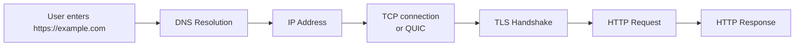

Nếu DNS fail:

```text
HTTP request thậm chí chưa bắt đầu.
```

---

# 2. Tại sao chúng ta cần DNS?

Giả sử không có DNS.

Bạn phải nhớ:

```text
Google     → 142.250.72.14
Facebook   → 157.240.x.x
My Server  → 103.x.x.x
```

Có ba vấn đề lớn.

### 2.1 IP khó nhớ

Con người thích:

```text
google.com
```

hơn:

```text
142.250.72.14
```

### 2.2 IP có thể thay đổi

Ví dụ:

```text
api.company.com
```

hôm nay:

```text
10.1.2.3
```

ngày mai deploy infrastructure mới:

```text
10.10.8.5
```

Client không cần biết.

Chỉ cần DNS thay đổi:

```text
api.company.com → 10.10.8.5
```

### 2.3 Một domain có thể map tới nhiều server

Ví dụ:

```text
example.com
```

có thể trả về:

```text
10.0.0.1
10.0.0.2
10.0.0.3
```

DNS có thể đóng vai trò trong:

```text
load balancing
failover
geo routing
CDN
```

---

# 3. DNS là một hệ thống phân tán

Không tồn tại một DNS server duy nhất chứa toàn bộ Internet.

Nếu có:

```text
One DNS Server
      ↓
Entire Internet
```

nó sẽ trở thành:

```text
single point of failure
performance bottleneck
storage bottleneck
attack target
```

DNS được thiết kế thành một hệ thống:

```text
distributed
hierarchical
delegated
cached
```

Kiến trúc high-level:

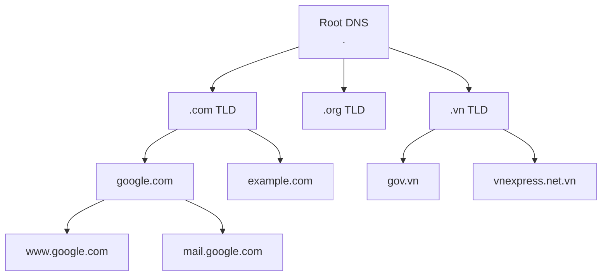

---

# 4. Cấu trúc của domain name

Ví dụ:

```text
api.shop.example.com
```

Phân tích từ phải sang trái:

```text
.
└── com
    └── example
        └── shop
            └── api
```

Tên đầy đủ về mặt DNS thực chất là:

```text
api.shop.example.com.
```

Dấu `.` cuối cùng đại diện cho:

```text
DNS Root
```

Thông thường browser/tool không hiển thị nó.

---

# 5. Các cấp trong DNS hierarchy

Ví dụ:

```text
www.example.com.
```

Có thể chia:

```text
.               Root
com             Top-Level Domain
example         Second-Level Domain
www             Host/Subdomain
```

Sơ đồ:

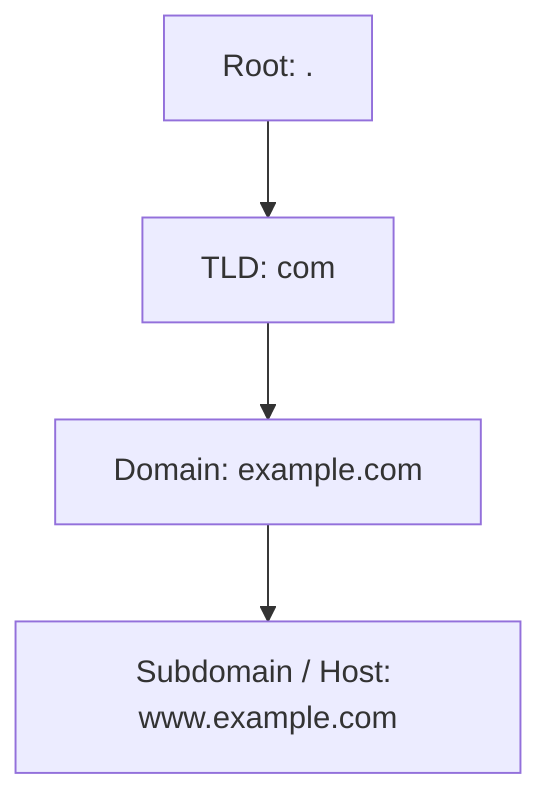

---

# 6. Những thành phần quan trọng trong DNS

Khi tìm IP của:

```text
www.example.com
```

thường có các thành phần sau:

```text
Client / Browser
Stub Resolver
Recursive Resolver
Root Name Server
TLD Name Server
Authoritative Name Server
```

---

# 7. Stub Resolver

Ứng dụng thường không tự đi hỏi Root/TLD DNS.

Operating System có một thành phần gọi là:

```text
Stub Resolver
```

Ví dụ application gọi:

```java
InetAddress.getByName("example.com");
```

Java không tự implement toàn bộ DNS hierarchy.

Nó thường đi qua:

```text
Java Application
      ↓
OS Resolver
      ↓
Configured DNS Resolver
```

Sơ đồ:

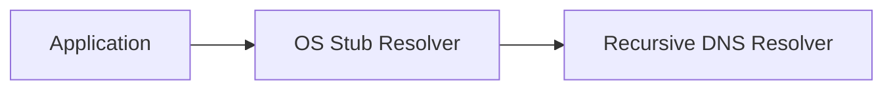

---

# 8. Recursive Resolver

Recursive Resolver là server đứng giữa client và DNS hierarchy.

Ví dụ:

```text
Google Public DNS
8.8.8.8

Cloudflare
1.1.1.1

ISP DNS
Company DNS
```

Client hỏi:

```text
What is the IP of www.example.com?
```

Recursive Resolver sẽ làm phần lớn công việc.

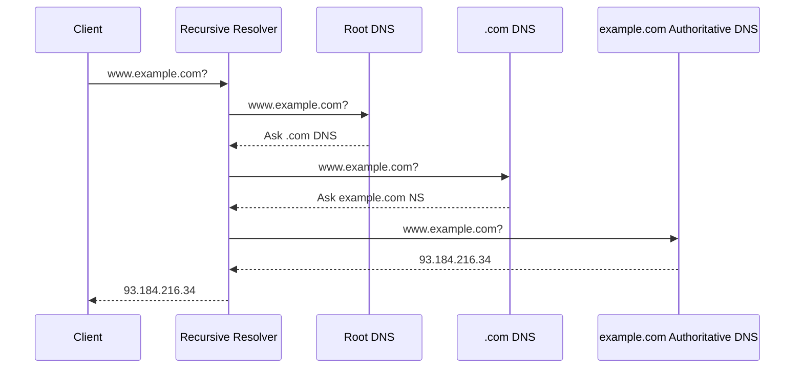

---

# 9. Root Name Server

Root server không nhất thiết biết:

```text
www.example.com → IP
```

Nó chủ yếu biết:

> Ai quản lý `.com`?

Client/resolver hỏi:

```text
www.example.com?
```

Root trả lời đại ý:

```text
Tôi không biết IP,
nhưng .com nameserver nằm ở đây.
```

Đây gọi là:

```text
referral
```

---

# 10. TLD Name Server

TLD = **Top-Level Domain**.

Ví dụ:

```text
.com
.net
.org
.vn
.io
.dev
```

TLD server biết:

```text
example.com
```

được quản lý bởi Authoritative Name Server nào.

Ví dụ:

```text
example.com
NS
ns1.example-dns.com
ns2.example-dns.com
```

---

# 11. Authoritative Name Server

Đây là nơi chứa DNS records thực tế của domain.

Ví dụ:

```text
www.example.com
A
93.184.216.34
```

Authoritative Server có thể trả lời:

```text
www.example.com → 93.184.216.34
```

Đây là nguồn authoritative cho zone đó.

---

# 12. Full DNS Resolution Flow

Giả sử user nhập:

```text
https://www.example.com
```

Flow đầy đủ:

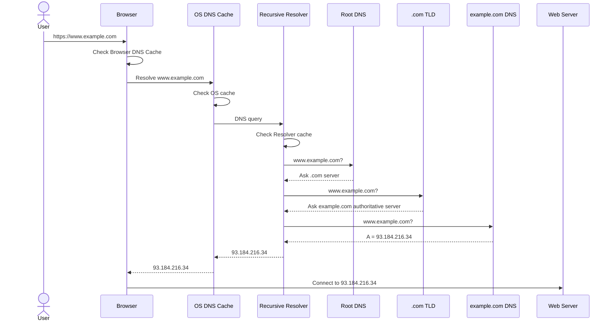

---

# 13. Một hiểu lầm phổ biến

Không phải mỗi request đều đi:

```text
Browser
↓
Root
↓
TLD
↓
Authoritative
```

Nếu vậy DNS sẽ rất chậm.

Thực tế caching xảy ra ở rất nhiều layer.

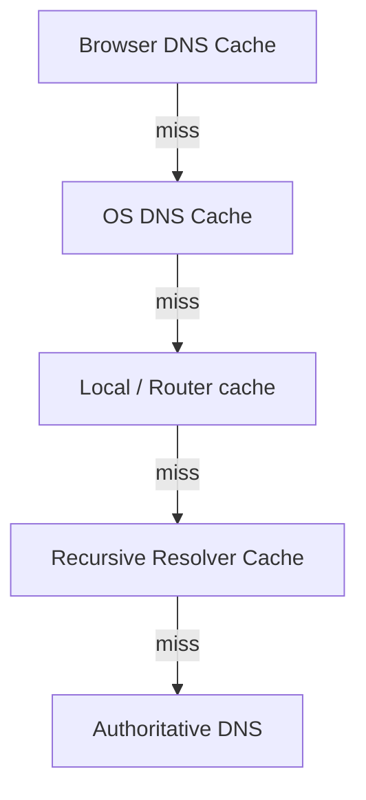

---

# 14. Recursive Query vs Iterative Query

Đây là câu rất hay xuất hiện trong interview.

## Recursive Query

Client yêu cầu server:

> Hãy tìm câu trả lời cuối cùng cho tôi.

Ví dụ:

```text
Client
↓
Recursive Resolver
```

Client hỏi:

```text
IP của example.com là gì?
```

Resolver phải trả về:

```text
93.x.x.x
```

hoặc error.

---

# 15. Iterative Query

Trong iterative query:

Server có thể trả lời:

> Tôi không biết, nhưng hãy hỏi server này.

Ví dụ:

```text
Resolver → Root
```

Root:

```text
Tôi không biết example.com.
Hãy hỏi .com DNS.
```

Resolver → `.com`:

```text
example.com?
```

`.com`:

```text
Hãy hỏi authoritative server này.
```

Sơ đồ:

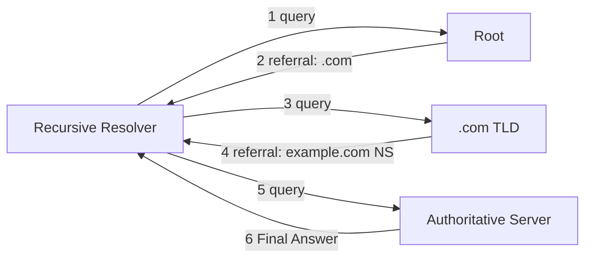

Do đó:

```text
Client → Resolver
```

thường là recursive.

Trong khi:

```text
Resolver → Root/TLD/Auth
```

thường mang tính iterative.

---

# 16. DNS Record là gì?

DNS không chỉ lưu:

```text
domain → IP
```

Nó lưu nhiều loại **Resource Record**.

Quan trọng nhất:

| Record | Chức năng                     |
| ------ | ----------------------------- |
| A      | Domain → IPv4                 |
| AAAA   | Domain → IPv6                 |
| CNAME  | Alias → canonical hostname    |
| MX     | Mail server                   |
| NS     | Name Server                   |
| TXT    | Arbitrary text / verification |
| SOA    | Zone metadata                 |
| PTR    | Reverse DNS                   |
| SRV    | Service discovery             |
| CAA    | CA được phép cấp certificate  |

---

# 17. A Record

A record:

```text
A = IPv4 Address
```

Ví dụ:

```text
api.example.com
A
10.20.30.40
```

Flow:

```text
api.example.com
       ↓
10.20.30.40
```

---

# 18. AAAA Record

AAAA:

```text
domain → IPv6
```

Ví dụ:

```text
example.com
AAAA
2606:2800:220:1:248:1893:25c8:1946
```

Tại sao tên là AAAA?

IPv6 address dài gấp 4 lần IPv4 address:

```text
IPv4 = 32 bit
IPv6 = 128 bit
```

Nên lịch sử đặt tên:

```text
A
AAAA
```

---

# 19. CNAME Record

CNAME = **Canonical Name**.

Dùng alias.

Ví dụ:

```text
www.example.com
CNAME
server.example.net
```

Sau đó:

```text
server.example.net
A
10.0.0.10
```

Flow:

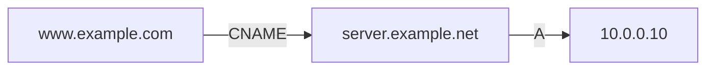

CNAME rất hữu ích khi infrastructure thay đổi.

Thay vì:

```text
www
api
shop
payment
```

tất cả phải update IP, có thể trỏ chúng tới hostname khác.

---

# 20. CNAME không phải HTTP redirect

Rất quan trọng.

DNS:

```text
www.example.com
CNAME
server.company.com
```

không có nghĩa browser URL đổi thành:

```text
server.company.com
```

Đây chỉ là DNS resolution.

HTTP redirect:

```http
HTTP/1.1 301 Moved Permanently
Location: https://server.company.com
```

là hoàn toàn khác.

---

# 21. MX Record

MX = **Mail Exchange**.

Ví dụ:

```text
example.com
MX 10 mail1.example.com
MX 20 mail2.example.com
```

Số:

```text
10
20
```

là priority.

Giá trị thấp hơn thường có priority cao hơn.

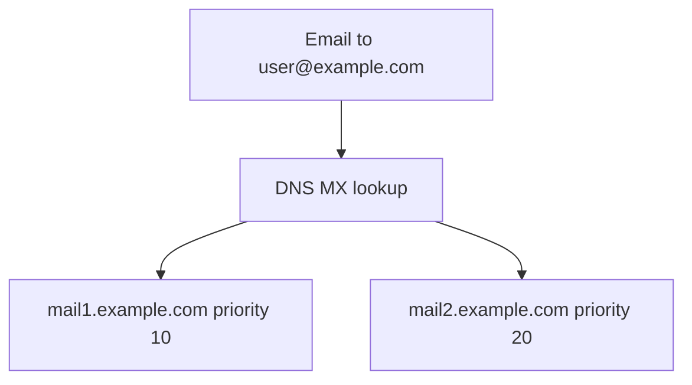

---

# 22. NS Record

NS = Name Server.

Nó nói rằng:

> Zone này được authoritative DNS nào quản lý?

Ví dụ:

```text
example.com
NS
ns1.cloudflare.com

example.com
NS
ns2.cloudflare.com
```

---

# 23. TXT Record

TXT lưu text.

Ban đầu khá generic nhưng hiện được dùng rất nhiều cho:

```text
domain ownership verification
SPF
DKIM
DMARC
Google verification
Microsoft verification
certificate verification
```

Ví dụ:

```text
example.com TXT "google-site-verification=..."
```

---

# 24. SOA Record

SOA = **Start of Authority**.

Chứa metadata về DNS zone.

Ví dụ conceptual:

```text
primary nameserver
admin contact
serial number
refresh
retry
expire
minimum TTL
```

Serial number đặc biệt quan trọng khi secondary DNS server synchronize zone.

---

# 25. PTR Record

PTR dùng cho reverse DNS:

Bình thường:

```text
domain → IP
```

Reverse DNS:

```text
IP → domain
```

Ví dụ:

```text
8.8.8.8
↓
dns.google
```

PTR thường quan trọng với mail server và diagnostics.

---

# 26. SRV Record

SRV hỗ trợ service discovery.

Có thể chứa:

```text
service
protocol
priority
weight
port
target
```

Ví dụ conceptual:

```text
_sip._tcp.example.com
```

có thể chỉ tới:

```text
sipserver.example.com:5060
```

---

# 27. CAA Record

CAA = **Certification Authority Authorization**.

Domain owner có thể nói:

> CA nào được phép cấp TLS certificate cho domain của tôi?

Ví dụ:

```text
example.com CAA 0 issue "letsencrypt.org"
```

---

# 28. DNS Zone là gì?

Domain và zone không hoàn toàn giống nhau.

Giả sử:

```text
example.com
```

có:

```text
www.example.com
api.example.com
shop.example.com
```

Nếu tất cả được quản lý chung:

```text
example.com Zone
```

có thể chứa:

```text
www A ...
api A ...
shop A ...
```

Nhưng bạn có thể delegate:

```text
shop.example.com
```

cho DNS server khác.

Lúc đó:

```text
example.com zone
```

và:

```text
shop.example.com zone
```

có thể được quản lý độc lập.

---

# 29. Zone Delegation

Đây là một concept rất quan trọng để hiểu DNS hierarchy.

Ví dụ:

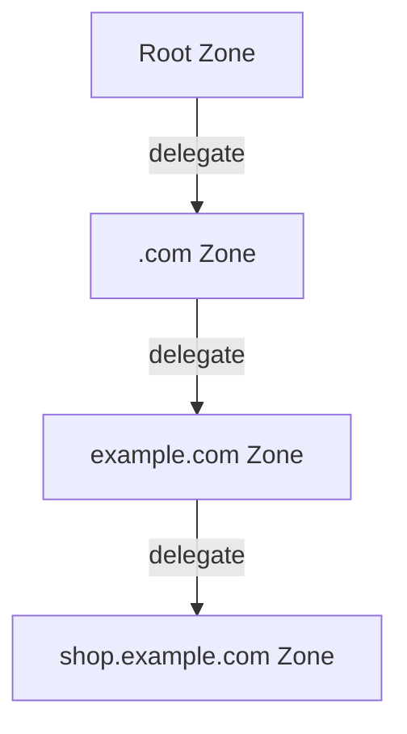

Mỗi layer không cần biết tất cả record ở dưới.

Nó chỉ cần biết:

```text
Ai chịu trách nhiệm tiếp theo?
```

Đây là lý do DNS scale được trên phạm vi toàn Internet.

---

# 30. Glue Record

Có một vấn đề thú vị.

Giả sử:

```text
example.com NS ns1.example.com
```

Muốn hỏi:

```text
ns1.example.com
```

ta lại cần resolve:

```text
example.com
```

Có nguy cơ circular dependency.

DNS giải quyết bằng:

```text
Glue Record
```

Parent zone có thể cung cấp IP của nameserver.

Ví dụ:

```text
example.com NS ns1.example.com
ns1.example.com A 1.2.3.4
```

---

# 31. DNS Cache

Caching là yếu tố cực kỳ quan trọng.

Giả sử authoritative server trả:

```text
example.com
A
10.0.0.1
TTL = 3600
```

Resolver có thể giữ kết quả:

```text
3600 seconds
=
1 hour
```

Trong một giờ:

```text
Client 1 ─┐
Client 2 ─┤
Client 3 ─┼→ Resolver Cache → 10.0.0.1
Client N ─┘
```

Không cần gọi authoritative DNS.

---

# 32. TTL là gì?

TTL = **Time To Live**.

Ví dụ:

```text
A record
example.com → 10.0.0.1

TTL = 300
```

Resolver có thể cache record khoảng:

```text
300 seconds
=
5 minutes
```

---

# 33. TTL Trade-off

TTL cao:

```text
TTL = 24 hours
```

Ưu điểm:

```text
less DNS traffic
lower DNS latency
lower authoritative DNS load
better resilience
```

Nhược điểm:

```text
record update propagates slowly
```

TTL thấp:

```text
TTL = 30 seconds
```

Ưu điểm:

```text
fast DNS changes
fast failover
```

Nhược điểm:

```text
more queries
more DNS load
less caching benefit
```

Trade-off:

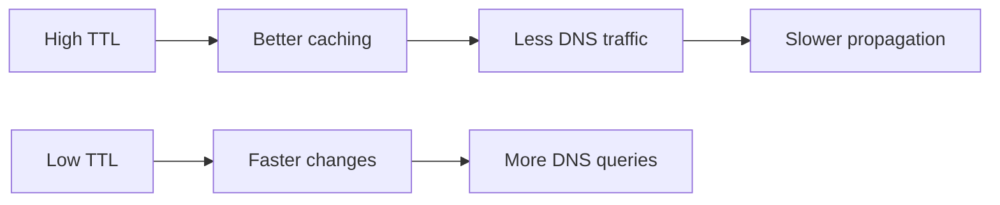

---

# 34. DNS Propagation là gì?

Giả sử:

```text
api.example.com
```

ban đầu:

```text
10.0.0.1
TTL = 3600
```

Bạn đổi thành:

```text
10.0.0.2
```

Authoritative DNS đã đổi ngay.

Nhưng một resolver vừa cache:

```text
10.0.0.1
```

có thể tiếp tục dùng nó cho đến khi TTL hết.

Do đó user A có thể tới:

```text
10.0.0.1
```

trong khi user B tới:

```text
10.0.0.2
```

Trong migration, chuyện này hoàn toàn bình thường.

---

# 35. Vì sao giảm TTL trước migration?

Giả sử hiện tại:

```text
TTL = 24 hours
```

Ngày mai muốn migrate server.

Nếu đổi DNS ngay:

```text
Old IP → New IP
```

một số resolver có thể giữ old IP 24 giờ.

Thực tế nên làm trước:

```text
Day -1:
TTL 86400 → 300
```

Đợi cache cũ hết.

Sau đó migration:

```text
Old IP → New IP
```

Clients sẽ cập nhật trong khoảng vài phút.

Sau khi ổn định:

```text
TTL 300 → 3600
```

hoặc cao hơn.

---

# 36. Positive vs Negative Caching

Không chỉ successful response được cache.

Ví dụ query:

```text
abc.example.com
```

và DNS trả:

```text
NXDOMAIN
```

nghĩa là:

```text
domain does not exist
```

Kết quả negative này cũng có thể được cache.

Gọi là:

```text
Negative Caching
```

Điều này giải thích một tình huống:

Bạn query domain trước khi tạo:

```text
api2.example.com
→ NXDOMAIN
```

sau đó vừa tạo record nhưng vẫn chưa resolve được ở một số nơi do negative cache.

---

# 37. UDP vs TCP trong DNS

DNS truyền thống sử dụng port:

```text
53
```

DNS thường dùng:

```text
UDP
```

vì:

```text
low overhead
no connection setup
fast
```

Flow:

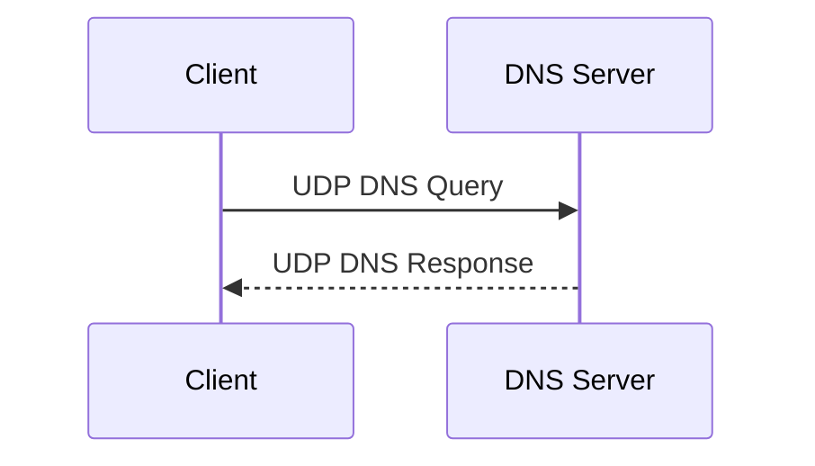

---

# 38. Khi nào DNS dùng TCP?

DNS có thể dùng TCP trong một số trường hợp.

Ví dụ:

```text
large responses
zone transfer
fallback from truncated UDP response
```

Zone transfer thường dùng TCP:

```text
AXFR
IXFR
```

Ngoài ra modern DNS với EDNS cho phép UDP packet lớn hơn giới hạn DNS cổ điển.

---

# 39. Vì sao UDP hợp với DNS?

So sánh:

TCP:

```text
SYN
SYN-ACK
ACK
DNS query
DNS response
```

UDP:

```text
DNS query
DNS response
```

DNS request thường nhỏ và stateless.

Do đó UDP rất phù hợp.

Tuy nhiên:

```text
UDP does not guarantee delivery.
```

DNS resolver phải xử lý:

```text
timeout
retry
another nameserver
TCP fallback
```

---

# 40. DNS over HTTPS và DNS over TLS

DNS truyền thống không mã hóa query.

Một observer trên network có thể thấy:

```text
example.com
google.com
bank.com
```

Dù HTTPS mã hóa HTTP payload.

Hai cơ chế phổ biến:

```text
DoH = DNS over HTTPS
DoT = DNS over TLS
```

---

# 41. DNS over HTTPS — DoH

DNS query được gửi qua HTTPS.

Thường:

```text
HTTPS
TCP/TLS
Port 443
```

Conceptually:

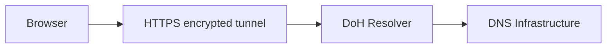

Ưu điểm:

```text
DNS query encrypted
harder for network observers to inspect
```

---

# 42. DNS over TLS — DoT

DoT chạy DNS thông qua TLS.

Thông thường:

```text
TCP 853
```

Khác DoH:

```text
DoH → HTTPS port 443
DoT → dedicated port 853
```

---

# 43. DNSSEC

Một vấn đề của DNS truyền thống:

Nếu attacker giả mạo response:

```text
bank.com
↓
Attacker IP
```

client có thể bị redirect.

DNSSEC = **DNS Security Extensions**.

DNSSEC cung cấp:

```text
authentication
integrity
```

thông qua digital signatures.

---

# 44. DNSSEC không mã hóa DNS

Điểm rất hay bị nhầm.

DNSSEC:

```text
❌ không encryption
✅ authenticity
✅ integrity
```

DoH/DoT:

```text
✅ encryption in transit
```

Nói đơn giản:

```text
DNSSEC:
"Response này có thật từ DNS owner không?"

DoH / DoT:
"Người khác có đọc được query của tôi không?"
```

---

# 45. DNSSEC chain of trust

DNSSEC xây dựng chain:

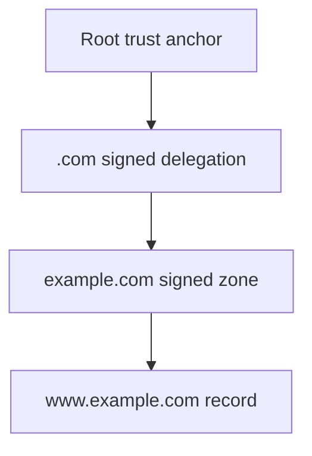

Resolver có thể kiểm tra chữ ký xuyên suốt hierarchy.

---

# 46. DNS Cache Poisoning

Một attack kinh điển:

```text
Resolver asks:
bank.com?
```

Attacker cố gửi response giả:

```text
bank.com → attacker IP
```

Nếu resolver cache:

```text
bank.com → attacker IP
```

rất nhiều user sau đó có thể bị ảnh hưởng.

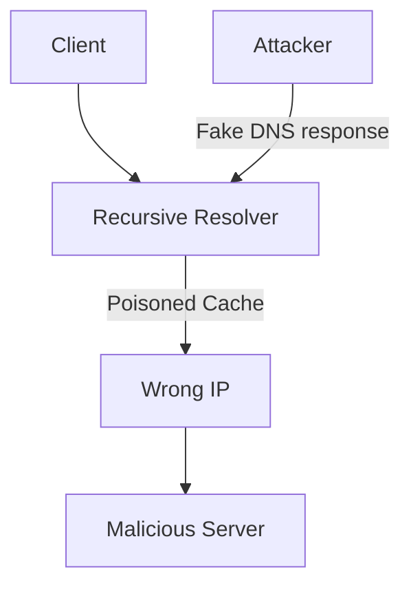

Các protection bao gồm:

```text
random transaction IDs
source port randomization
DNSSEC
secure resolver implementation
```

---

# 47. DNS Amplification Attack

DNS dùng UDP.

UDP dễ bị spoof source IP.

Attacker gửi:

```text
Small DNS request
source IP = victim
```

DNS server trả:

```text
Large DNS response
```

tới victim.

Nếu:

```text
request = 60 bytes
response = 3000 bytes
```

attacker đã khuếch đại traffic.

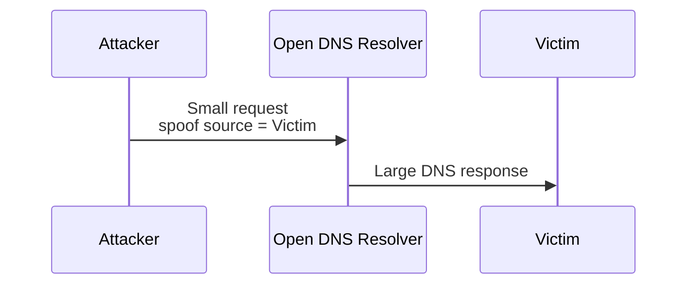

Đây gọi là:

```text
DNS amplification DDoS
```

---

# 48. Authoritative DNS High Availability

Một production domain không nên có:

```text
1 authoritative nameserver
```

Thường sẽ có nhiều:

```text
ns1.provider.com
ns2.provider.com
ns3.provider.com
```

Vì nếu một server fail:

```text
resolver → other nameserver
```

---

# 49. Anycast DNS

Các DNS provider lớn thường dùng:

```text
Anycast
```

Cùng một IP được quảng bá từ nhiều location.

Ví dụ conceptual:

```text
1.1.1.1
```

không nhất thiết chỉ là một physical server.

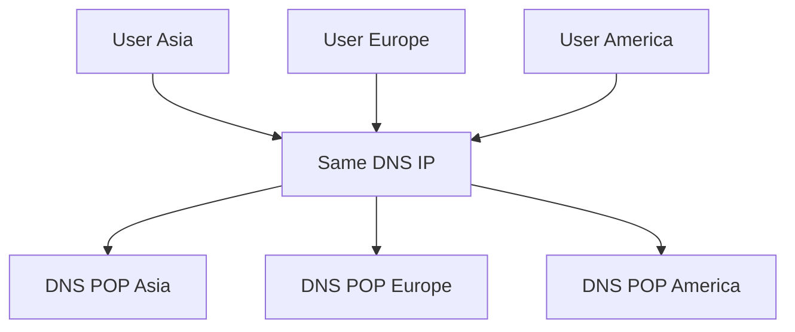

Network routing đưa user tới POP gần/phù hợp.

---

# 50. DNS và Load Balancing

Giả sử:

```text
api.example.com
```

có nhiều A record:

```text
api.example.com → 10.0.0.1
api.example.com → 10.0.0.2
api.example.com → 10.0.0.3
```

DNS có thể trả nhiều IP.

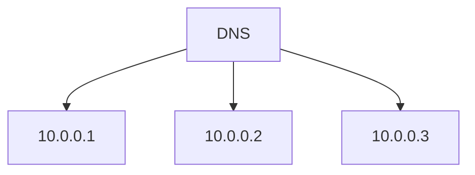

Client có thể chọn một address.

Đây thường được gọi là DNS round-robin kiểu đơn giản.

---

# 51. DNS Load Balancing có hạn chế gì?

DNS không phải full-featured Layer 7 Load Balancer.

Ví dụ DNS trả:

```text
10.0.0.1
```

TTL:

```text
5 minutes
```

Ngay sau đó server `10.0.0.1` chết.

Client vẫn có thể giữ IP cũ.

Trong khi Load Balancer:

```text
Client
   ↓
Load Balancer
   ↓
Healthy Backend
```

có thể health check backend thường xuyên.

---

# 52. DNS + Load Balancer

Production architecture rất thường gặp:

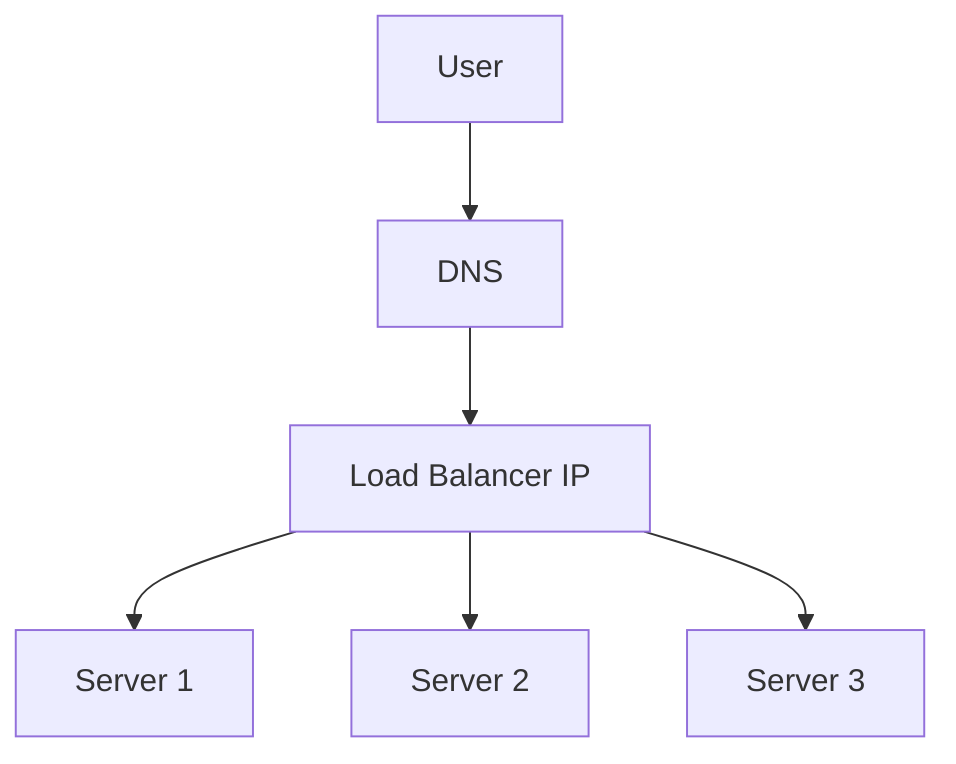

DNS:

```text
domain → LB
```

Load Balancer:

```text
request → backend
```

---

# 53. DNS + CDN

Một hệ thống phổ biến:

```text
www.example.com
       ↓
DNS
       ↓
CDN Edge
       ↓
Origin Server
```

Ví dụ:

```mermaid
flowchart LR
    U[User Vietnam]
    --> D[DNS]
    --> CDN[Nearby CDN Edge]
    --> O[Origin Server]
```

DNS/CDN infrastructure có thể route user tới edge phù hợp dựa trên:

```text
location
latency
network
availability
```

---

# 54. Geo DNS

Giả sử system có:

```text
Asia Region
Europe Region
US Region
```

DNS provider có thể trả different result.

```mermaid
flowchart TD
    DNS[Geo DNS]

    VN[User Vietnam]
    DE[User Germany]
    US[User USA]

    VN --> DNS
    DE --> DNS
    US --> DNS

    DNS --> ASIA[Asia Endpoint]
    DNS --> EU[Europe Endpoint]
    DNS --> USA[US Endpoint]
```

Ví dụ:

```text
Vietnam user:
api.example.com → Singapore IP

Germany user:
api.example.com → Frankfurt IP
```

---

# 55. DNS Failover

Một hệ thống:

```text
Primary Server
Backup Server
```

DNS provider thực hiện health check.

Normal:

```text
api.example.com → Primary
```

Nếu primary unhealthy:

```text
api.example.com → Backup
```

```mermaid
flowchart TD
    DNS[DNS with Health Check]

    DNS --> P[Primary]
    DNS -. failover .-> B[Backup]

    P -->|healthy| OK[Serve Traffic]
    P -->|unhealthy| DNS
```

Nhưng nhớ:

> DNS failover không instantaneous vì caching/TTL.

---

# 56. Split-Horizon DNS

Cùng domain nhưng kết quả khác tùy network.

Ví dụ:

Trong company network:

```text
db.company.com → 10.0.0.10
```

Ngoài Internet:

```text
db.company.com → NXDOMAIN
```

Hoặc:

```text
api.company.com
```

internal:

```text
10.0.0.20
```

external:

```text
203.0.113.20
```

Đây gọi là:

```text
Split DNS
Split-horizon DNS
```

---

# 57. Private DNS

Cloud environment thường có internal DNS.

Ví dụ:

```text
payment.internal
inventory.internal
database.internal
```

chỉ resolve được bên trong VPC/private network.

```mermaid
flowchart TD
    VPC[VPC]
    DNS[Private DNS]

    A[Payment Service] --> DNS
    B[Order Service] --> DNS
    C[Inventory Service] --> DNS

    DNS --> DB[db.internal<br/>10.0.3.20]
```

---

# 58. DNS trong Microservices

Trong microservice architecture:

```text
order-service
payment-service
inventory-service
```

service discovery có thể dựa trên DNS.

Ví dụ:

```text
payment-service.default.svc.cluster.local
```

được resolve tới Kubernetes Service.

---

# 59. DNS trong Kubernetes

Trong Kubernetes, CoreDNS thường cung cấp DNS.

Ví dụ:

```text
Order Pod
```

muốn gọi:

```text
payment-service
```

DNS resolution:

```text
payment-service.default.svc.cluster.local
```

→ ClusterIP của Service.

```mermaid
flowchart LR
    ORDER[Order Pod]
    --> CORE[CoreDNS]

    CORE --> SVC[payment-service<br/>ClusterIP]

    SVC --> P1[Payment Pod 1]
    SVC --> P2[Payment Pod 2]
```

Do đó application không cần biết:

```text
pod IP
```

vì Pod IP có thể thay đổi liên tục.

---

# 60. DNS vs Service Registry

Microservice architecture có thể dùng:

```text
DNS-based discovery
```

hoặc:

```text
Service Registry
```

Ví dụ bạn đã gặp:

```text
Eureka
Consul
```

DNS:

```text
payment-service
↓
10.0.0.10
```

Eureka:

```text
payment-service
↓
Service registry
↓
instance list
```

Mỗi mô hình có trade-off riêng.

---

# 61. Browser nhập URL — toàn bộ flow

Đây là một câu interview rất phổ biến:

> What happens when you type google.com into your browser?

DNS là một phần đầu tiên.

Flow high-level:

```mermaid
flowchart TD
    A[Type URL]
    --> B[Parse URL]
    --> C[DNS Lookup]
    --> D[Get Server IP]
    --> E[TCP or QUIC Connection]
    --> F[TLS Handshake]
    --> G[HTTP Request]
    --> H[Load Balancer / CDN]
    --> I[Backend]
    --> J[HTTP Response]
    --> K[Browser Render]
```

---

# 62. DNS resolution chi tiết trong browser

Một cách tư duy tốt:

```text
1. Browser cache
2. OS cache
3. hosts file / configured resolver logic
4. Recursive DNS resolver
5. Resolver cache
6. Root
7. TLD
8. Authoritative server
9. Cache result
10. Return IP
```

Không nhất thiết OS implementation nào cũng đi y hệt thứ tự này, nhưng đây là mental model tốt.

---

# 63. `/etc/hosts`

Trên Linux:

```bash
/etc/hosts
```

có thể chứa:

```text
127.0.0.1 localhost
10.0.0.10 api.example.com
```

Nếu cấu hình resolver ưu tiên hosts trước DNS:

```text
api.example.com
```

có thể resolve thẳng:

```text
10.0.0.10
```

mà không cần external DNS.

---

# 64. `/etc/resolv.conf`

Linux thường có:

```bash
cat /etc/resolv.conf
```

Ví dụ:

```text
nameserver 127.0.0.53
search company.local
```

Nó cho biết DNS resolver configuration của hệ thống, dù trên distro dùng systemd-resolved thì file này có thể chỉ trỏ tới local stub resolver.

---

# 65. Công cụ `nslookup`

Ví dụ:

```bash
nslookup google.com
```

Có thể thấy:

```text
Name:
Address:
```

Nhưng trên Linux/server debugging, `dig` thường mạnh hơn.

---

# 66. `dig`

Ví dụ:

```bash
dig google.com
```

Bạn có thể thấy:

```text
QUESTION SECTION
ANSWER SECTION
AUTHORITY SECTION
ADDITIONAL SECTION
```

Ví dụ query A record:

```bash
dig google.com A
```

AAAA:

```bash
dig google.com AAAA
```

MX:

```bash
dig google.com MX
```

NS:

```bash
dig google.com NS
```

TXT:

```bash
dig google.com TXT
```

---

# 67. Query một DNS resolver cụ thể

Ví dụ Google DNS:

```bash
dig @8.8.8.8 example.com
```

Cloudflare:

```bash
dig @1.1.1.1 example.com
```

Rất hữu ích khi debug:

```text
Is local DNS broken?
or
Is authoritative DNS broken?
```

---

# 68. `dig +trace`

Một command cực kỳ hay để học DNS:

```bash
dig +trace example.com
```

Nó cho bạn thấy gần giống:

```text
Root
 ↓
.com
 ↓
example.com NS
 ↓
answer
```

Conceptually:

```mermaid
flowchart LR
    A[dig +trace]
    --> B[Root]
    --> C[TLD]
    --> D[Authoritative]
    --> E[Final Record]
```

---

# 69. `host`

Command đơn giản:

```bash
host example.com
```

MX:

```bash
host -t MX example.com
```

---

# 70. `resolvectl`

Trên Linux dùng `systemd-resolved`:

```bash
resolvectl status
```

Query:

```bash
resolvectl query example.com
```

Có thể kiểm tra DNS server thực sự được sử dụng.

---

# 71. Những lỗi DNS phổ biến

Khi thấy:

```text
DNS_PROBE_FINISHED_NXDOMAIN
```

hoặc:

```text
UnknownHostException
```

hãy nghĩ theo layer.

```mermaid
flowchart TD
    A[DNS Failure]
    --> B{Domain exists?}

    B -->|No| C[NXDOMAIN]
    B -->|Yes| D{Resolver works?}

    D -->|No| E[Local / network DNS issue]
    D -->|Yes| F{Authoritative DNS healthy?}

    F -->|No| G[DNS provider / config issue]
    F -->|Yes| H[Cache / record / delegation issue]
```

---

# 72. NXDOMAIN

NXDOMAIN nghĩa là:

```text
Non-Existent Domain
```

Ví dụ:

```text
notexist123.example.com
```

DNS response:

```text
NXDOMAIN
```

Khác với:

```text
server timeout
```

Trong NXDOMAIN:

```text
server trả lời thành công rằng domain không tồn tại.
```

---

# 73. SERVFAIL

Một DNS resolver có thể trả:

```text
SERVFAIL
```

Nghĩa là resolver không hoàn thành được resolution.

Có thể do:

```text
authoritative DNS failure
DNSSEC validation failure
delegation problem
network failure
```

Không giống NXDOMAIN.

---

# 74. Timeout

Nếu resolver không trả lời:

```text
DNS timeout
```

có thể do:

```text
UDP/53 blocked
DNS server down
network issue
firewall
packet loss
```

Resolver có thể retry hoặc thử nameserver khác.

---

# 75. DNS và Java `UnknownHostException`

Ví dụ:

```java
HttpClient -> https://payment-service
```

nhận:

```java
java.net.UnknownHostException
```

Đừng ngay lập tức nghĩ rằng:

```text
Payment Service bị crash
```

Có thể:

```text
DNS resolution failed.
```

Flow:

```mermaid
flowchart LR
    A[Java App]
    --> B[Resolve payment-service]
    --> C{DNS Success?}

    C -->|No| D[UnknownHostException]
    C -->|Yes| E[Get IP]
    E --> F[Connect]
```

---

# 76. DNS khác Connection Refused như thế nào?

Ví dụ:

### DNS failure

```text
UnknownHostException
```

nghĩa là:

```text
hostname → IP failed
```

### Connection refused

```text
Connection refused
```

thường có nghĩa:

```text
DNS resolution succeeded
↓
we got an IP
↓
TCP connection failed/rejected
```

Hai lỗi xảy ra ở layer khác nhau.

---

# 77. Một debugging flow tốt

Nếu:

```text
https://api.example.com
```

không hoạt động:

```text
1. Can DNS resolve?
2. What IP is returned?
3. Is it the expected IP?
4. Is TTL/caching involved?
5. Can IP be reached?
6. Is port open?
7. Does TLS work?
8. Does HTTP work?
```

Ví dụ:

```bash
dig api.example.com

ping <ip>

nc -vz api.example.com 443

curl -v https://api.example.com
```

---

# 78. DNS caching và distributed systems

Có một insight quan trọng.

Bạn đổi:

```text
api.example.com
10.0.0.1 → 10.0.0.2
```

Nhưng không thể giả định:

```text
All clients immediately use 10.0.0.2
```

Trong một khoảng thời gian:

```mermaid
flowchart TD
    DNS[Authoritative DNS<br/>new = 10.0.0.2]

    A[Client A cache] --> OLD[10.0.0.1]
    B[Client B] --> NEW[10.0.0.2]
    C[Resolver C cache] --> OLD
    D[Client D] --> NEW
```

Vì vậy khi migration:

> Old infrastructure thường phải tiếp tục hoạt động trong một khoảng grace period.

---

# 79. DNS consistency model

DNS không phải strong consistency.

Một thay đổi record không được thấy đồng thời ở mọi nơi.

Gần hơn với:

```text
eventual visibility through cache expiration
```

DNS design đánh đổi:

```text
freshness
vs
performance
vs
availability
```

Thông qua:

```text
TTL
```

---

# 80. Một system design scenario

Giả sử bạn có:

```text
api.myshop.com
```

và hệ thống chạy:

```text
Singapore
Tokyo
Frankfurt
```

Architecture có thể là:

```mermaid
flowchart TD
    U[User]
    --> DNS[Global DNS]

    DNS --> SG[Singapore Load Balancer]
    DNS --> JP[Tokyo Load Balancer]
    DNS --> EU[Frankfurt Load Balancer]

    SG --> SG1[App]
    SG --> SG2[App]

    JP --> JP1[App]
    JP --> JP2[App]

    EU --> EU1[App]
    EU --> EU2[App]
```

DNS layer có thể thực hiện:

```text
latency routing
geolocation routing
health-based routing
failover
```

---

# 81. DNS không phải Service Mesh

Đừng nhầm:

```text
DNS
```

với:

```text
Load Balancer
API Gateway
Service Registry
Service Mesh
```

Chúng giải quyết những vấn đề khác nhau.

Ví dụ:

```mermaid
flowchart LR
    C[Client]
    --> DNS[DNS<br/>Name → Endpoint]
    --> GW[API Gateway<br/>Routing/Auth]
    --> LB[Load Balancer<br/>Backend Distribution]
    --> S[Service]
```

---

# 82. DNS vs Load Balancer

| DNS                          | Load Balancer                       |
| ---------------------------- | ----------------------------------- |
| Name → IP                    | Request → backend                   |
| Có caching                   | Thường route mỗi connection/request |
| TTL ảnh hưởng freshness      | Health checks nhanh hơn             |
| Không inspect HTTP như L7 LB | Có thể inspect HTTP                 |
| Global routing tốt           | Backend traffic distribution tốt    |

Thực tế chúng thường dùng cùng nhau, không phải chọn một trong hai.

---

# 83. DNS vs API Gateway

DNS:

```text
api.example.com
↓
10.0.0.5
```

API Gateway:

```text
/api/users
↓
User Service

/api/orders
↓
Order Service
```

DNS hoạt động ở name resolution.

Gateway làm:

```text
routing
authentication
rate limiting
logging
protocol handling
```

---

# 84. DNS Round Robin — ví dụ cụ thể

DNS:

```text
example.com A 1.1.1.1
example.com A 2.2.2.2
example.com A 3.3.3.3
```

Response có thể:

```text
Query 1:
1.1.1.1
2.2.2.2
3.3.3.3

Query 2:
2.2.2.2
3.3.3.3
1.1.1.1
```

Nhưng không nên xem DNS round robin là guarantee:

```text
33% traffic mỗi server.
```

Do:

```text
resolver caching
client behavior
TTL
connection reuse
NAT
```

---

# 85. Apex domain và CNAME

Ví dụ apex:

```text
example.com
```

Không phải:

```text
www.example.com
```

Theo mô hình DNS chuẩn, đặt CNAME ở zone apex gây vấn đề vì apex cũng cần records như:

```text
NS
SOA
```

Nhiều DNS provider cung cấp giải pháp provider-specific như:

```text
ALIAS
ANAME
CNAME flattening
```

để tạo trải nghiệm giống CNAME ở apex.

---

# 86. Wildcard DNS

Có thể cấu hình:

```text
*.example.com
```

Ví dụ:

```text
*.example.com A 1.2.3.4
```

khi đó:

```text
abc.example.com
shop.example.com
hello.example.com
```

có thể resolve tới:

```text
1.2.3.4
```

Nhưng wildcard DNS có semantics cụ thể và không đơn giản là string wildcard ở mọi trường hợp.

---

# 87. Search Domain

Trong company network hoặc Kubernetes, bạn có thể gọi:

```text
payment-service
```

thay vì:

```text
payment-service.default.svc.cluster.local
```

Resolver có thể thử append search domain:

```text
payment-service.default.svc.cluster.local
```

Điều này dựa vào resolver configuration.

---

# 88. FQDN

FQDN = **Fully Qualified Domain Name**.

Ví dụ:

```text
www.example.com.
```

là tên đầy đủ từ host tới root.

```text
www
↓
example
↓
com
↓
.
```

---

# 89. Authoritative vs Non-authoritative Answer

Nếu hỏi authoritative server trực tiếp:

```text
example.com?
```

nó trả lời từ zone mà nó quản lý.

Nếu hỏi recursive resolver:

```text
8.8.8.8
```

nó có thể trả từ cache.

Vì vậy tool đôi khi phân biệt:

```text
authoritative
non-authoritative
```

---

# 90. Primary và Secondary DNS

Một zone có thể có nhiều authoritative server.

Traditional model:

```text
Primary
   ↓ zone transfer
Secondary
```

```mermaid
flowchart LR
    P[Primary DNS]
    -->|AXFR / IXFR| S1[Secondary DNS 1]
    P -->|AXFR / IXFR| S2[Secondary DNS 2]

    C[Resolver] --> S1
    C --> S2
```

Secondary giúp:

```text
availability
redundancy
load distribution
```

---

# 91. AXFR và IXFR

AXFR:

```text
full zone transfer
```

IXFR:

```text
incremental zone transfer
```

Tức là thay vì copy toàn bộ zone:

```text
example.com
thousands of records
```

IXFR chỉ chuyển phần thay đổi khi có thể.

---

# 92. Một mental model rất quan trọng

Có thể nhớ DNS bằng ba ý:

```text
DNS = Hierarchy + Delegation + Caching
```

### Hierarchy

```text
Root
→ TLD
→ Domain
→ Host
```

### Delegation

```text
Tôi không quản lý phần này.
Hãy hỏi server kia.
```

### Caching

```text
Tôi vừa resolve rồi.
Không cần hỏi lại.
```

Ba concept này giải thích gần như toàn bộ khả năng scale của DNS.

---

# 93. Vì sao DNS scale được tới toàn Internet?

Nếu interviewer hỏi:

> DNS phục vụ hàng tỷ thiết bị như thế nào?

Không nên chỉ trả lời:

> Because it is distributed.

Hãy phân tích.

```mermaid
flowchart TD
    SCALE[DNS Scalability]

    SCALE --> H[Hierarchy]
    SCALE --> D[Delegation]
    SCALE --> C[Caching]
    SCALE --> A[Anycast]
    SCALE --> R[Redundant Name Servers]

    H --> H1[No server stores everything]
    D --> D1[Responsibility distributed]
    C --> C1[Most queries stop at caches]
    A --> A1[Global distribution]
    R --> R1[Failure tolerance]
```

---

# 94. Câu trả lời interview chuẩn: “How does DNS work?”

Một câu trả lời tốt có thể cấu trúc:

> DNS is a distributed hierarchical naming system that translates domain names into information such as IP addresses.
>
> When a user requests `www.example.com`, the browser or OS first checks local caches. If there is no cached result, it sends the request to a recursive DNS resolver.
>
> If the recursive resolver also has no cached result, it walks the DNS hierarchy. It queries a root server, which points it to the appropriate TLD server such as `.com`. The TLD server points it to the authoritative name server for `example.com`. The authoritative server then returns the relevant DNS record, for example an A record containing the IPv4 address.
>
> The resolver caches the result according to its TTL and returns the IP to the client. The browser can then establish a TCP or QUIC connection and continue with TLS and HTTP.

Quan trọng là câu trả lời có:

```text
cache
recursive resolver
root
TLD
authoritative
record
TTL
connection after DNS
```

---

# 95. Câu hỏi: “Why not have one global DNS database?”

Có thể trả lời:

```text
Single database:
↓
single point of failure
↓
global latency
↓
huge traffic
↓
huge storage
↓
administrative bottleneck
```

DNS dùng:

```text
hierarchical delegation
distributed authoritative servers
caching
```

để giải quyết.

---

# 96. Câu hỏi: “What happens when DNS cache expires?”

Giả sử:

```text
TTL = 300
```

Sau 300 giây:

```text
cached record becomes stale
```

Khi query tiếp theo tới:

```text
Resolver
↓
needs fresh resolution
↓
authoritative DNS
```

Sau đó resolver cache result mới.

---

# 97. Câu hỏi: “Why not use TTL = 0?”

Vì sẽ làm giảm đáng kể lợi ích của caching:

```text
every request
↓
DNS lookup
↓
higher latency
higher DNS traffic
higher authoritative load
lower resilience
```

TTL là trade-off:

```text
Freshness ↔ Caching
```

---

# 98. Câu hỏi: “What if authoritative DNS is down?”

Nếu resolver đã cache record:

```text
request có thể vẫn hoạt động
```

trong một khoảng thời gian tùy resolver/cache policy.

Nếu cache miss và không có authoritative server nào reachable:

```text
DNS resolution fails
```

Do đó production DNS cần:

```text
multiple authoritative servers
geographic redundancy
anycast
reliable DNS provider
```

---

# 99. Câu hỏi: “DNS uses UDP, so how can it be reliable?”

Một câu trả lời tốt:

> DNS commonly uses UDP because queries are usually small and UDP avoids connection setup overhead. Reliability is handled at the DNS/application layer: the resolver can retry a query, query another nameserver, or fall back to TCP when appropriate. DNS can also use TCP for cases such as larger responses and zone transfers.

---

# 100. Câu hỏi: “DNS vs HTTP redirect?”

```text
DNS:
name resolution
example.com → IP

HTTP redirect:
server instructs browser to use another URL
301/302/307/308
```

DNS xảy ra:

```text
before connecting to server
```

HTTP redirect xảy ra:

```text
after HTTP request reaches server.
```

---

# 101. Câu hỏi: “DNS cache issue khi deploy production?”

Một scenario rất hay.

Old:

```text
api.example.com → Server A
```

New:

```text
api.example.com → Server B
```

Không được:

```text
change DNS
immediately kill Server A
```

Vì một số resolver/client vẫn cache:

```text
Server A
```

Proper migration:

```mermaid
flowchart LR
    A[Reduce TTL beforehand]
    --> B[Deploy Server B]
    --> C[Update DNS]
    --> D[Keep Server A alive]
    --> E[Wait for old caches]
    --> F[Drain / shutdown A]
    --> G[Raise TTL]
```

Đây là một ví dụ cực tốt khi interviewer hỏi về DNS trade-offs.

---

# 102. DNS trong Request Path tổng thể

Có thể hình dung toàn bộ architecture:

```mermaid
flowchart LR
    USER[User]
    --> CACHE[Browser / OS Cache]
    --> RDNS[Recursive DNS]
    --> AUTH[Authoritative DNS]

    AUTH --> RDNS
    RDNS --> CACHE

    CACHE --> CDN[CDN / Load Balancer]
    CDN --> APP[Application]
    APP --> DB[(Database)]
```

DNS giải quyết:

```text
Where should I connect?
```

Load Balancer giải quyết:

```text
Which backend should handle this traffic?
```

Application giải quyết:

```text
What should happen for this request?
```

---

# 103. Framework tư duy DNS khi phỏng vấn

Khi được hỏi về DNS, thay vì chỉ giải thích:

```text
DNS maps hostname to IP
```

hãy trả lời theo 6 layer:

```text
1. Purpose
2. Architecture
3. Request flow
4. Caching
5. Failure / Trade-offs
6. Production usage
```

Ví dụ:

```mermaid
flowchart TD
    Q[DNS Question]
    --> P[Purpose]
    --> A[Architecture]
    --> F[Flow]
    --> C[Caching / TTL]
    --> T[Trade-offs / Failure]
    --> PROD[Production implications]
```

Đây cũng là pattern trả lời rất tốt cho CS foundation interview.

---

# 104. Checklist kiến thức DNS cần nhớ

Nếu chuẩn bị backend/system interview, nên chắc các phần sau:

| Priority | Concept                    |
| -------- | -------------------------- |
| P0       | Domain → IP                |
| P0       | Recursive Resolver         |
| P0       | Root / TLD / Authoritative |
| P0       | Recursive vs Iterative     |
| P0       | A / AAAA / CNAME           |
| P0       | DNS caching                |
| P0       | TTL                        |
| P0       | UDP vs TCP                 |
| P0       | DNS request flow           |
| P1       | MX / NS / TXT              |
| P1       | DNS propagation            |
| P1       | DNS load balancing         |
| P1       | DNS failover               |
| P1       | CDN + DNS                  |
| P1       | DNSSEC                     |
| P1       | Cache poisoning            |
| P2       | Glue record                |
| P2       | Zone delegation            |
| P2       | SOA                        |
| P2       | PTR / SRV / CAA            |
| P2       | AXFR / IXFR                |
| P2       | DoH / DoT                  |
| P2       | Split-horizon DNS          |

---

# 105. Sơ đồ tổng kết toàn bộ DNS

```mermaid
flowchart TD
    USER[User enters<br/>https://www.example.com]

    USER --> BC{Browser cache?}

    BC -->|Hit| IP[IP Address]
    BC -->|Miss| OS{OS cache?}

    OS -->|Hit| IP
    OS -->|Miss| RES[Recursive Resolver]

    RES --> RC{Resolver cache?}

    RC -->|Hit| IP
    RC -->|Miss| ROOT[Root DNS]

    ROOT -->|Referral| TLD[.com TLD]
    TLD -->|Referral| AUTH[example.com<br/>Authoritative DNS]

    AUTH -->|A / AAAA / CNAME| RES

    RES -->|Cache according to TTL| IP

    IP --> CONN[TCP or QUIC]
    CONN --> TLS[TLS]
    TLS --> HTTP[HTTP Request]
    HTTP --> SERVER[Web Server / CDN / LB]
```

---

# 106. Một câu chốt nên nhớ

Nếu cần mô tả DNS trong khoảng 20–30 giây:

> **DNS is a distributed, hierarchical and heavily cached naming system. A client normally sends a recursive query to a DNS resolver. If the resolver does not have the result cached, it performs iterative queries through the Root, TLD, and authoritative name servers until it finds the required DNS record. The result is cached according to its TTL and returned to the client, which can then connect to the resolved IP address.**

Và ba keyword quan trọng nhất cần giữ trong đầu là:

```text
Hierarchy
+
Delegation
+
Caching
```

Nếu hiểu chắc ba concept này, bạn không chỉ biết **DNS hoạt động như thế nào**, mà còn có thể reasoning được các vấn đề production như **TTL, failover, deployment migration, CDN, load balancing, DNS security và troubleshooting**.
