# TLS Termination trong System Design — Edge TLS, Re-encryption, Passthrough và mTLS

Phần này nên hiểu theo một mental model quan trọng:

> **TLS không nhất thiết bao phủ toàn bộ request bằng một connection duy nhất. Trong hệ thống thực tế, request thường đi qua nhiều hop và mỗi hop có thể có TLS connection riêng.**

Ví dụ:

```text
Client
   ↓
CDN / WAF
   ↓
Load Balancer
   ↓
API Gateway
   ↓
Backend Service
   ↓
Database
```

Bạn không nên hỏi đơn giản:

> “Hệ thống có HTTPS không?”

Mà nên hỏi:

> **TLS terminate ở đâu? Giữa những hop nào traffic được encrypt? Ai authenticate ai?**

---

# 1. Trước tiên: TLS Termination thực sự nghĩa là gì?

Giả sử:

```text
Client
   ↓ HTTPS
Load Balancer
   ↓
Backend
```

Client gửi:

```http
GET /orders/123
Authorization: Bearer ...
```

Trên Internet nó được TLS encrypt:

```text
HTTP plaintext
       ↓
TLS encrypt
       ↓
ciphertext
       ↓
Internet
```

Load Balancer nhận ciphertext.

Nếu LB **terminate TLS**, LB đóng vai trò TLS server:

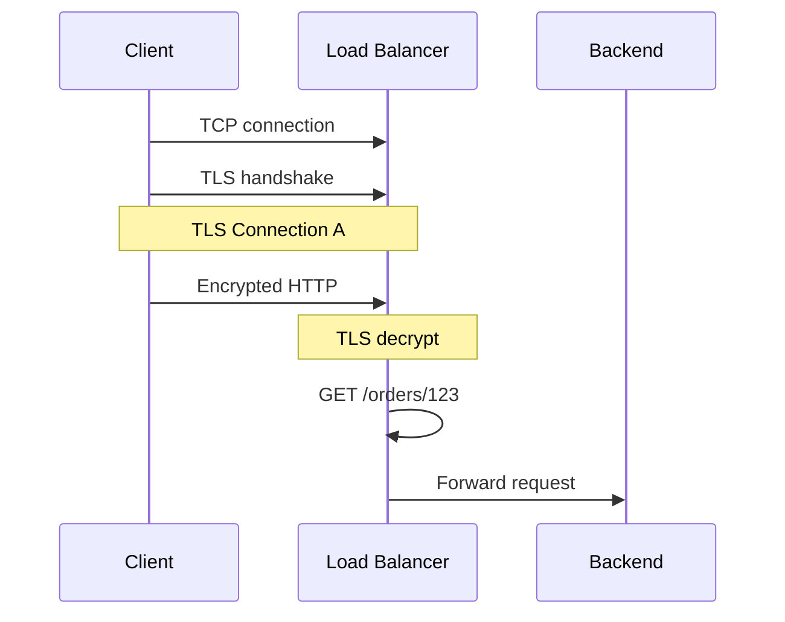

Tại LB:

```text
Encrypted bytes
      ↓
TLS decrypt
      ↓
GET /orders/123
Authorization: ...
```

LB lúc này **nhìn thấy HTTP plaintext**.

Đó chính là:

> **TLS termination**

AWS ALB hoạt động theo đúng mental model này: HTTPS listener sử dụng certificate tại load balancer để terminate frontend TLS connection và decrypt request trước khi forward tới targets. ([AWS Docs][1])

---

# 2. Certificate nằm ở đâu?

Nếu TLS terminate tại LB:

```text
Client
    |
    | TLS
    ↓
┌─────────────────────┐
│ Load Balancer       │
│                     │
│ certificate         │
│ private key         │
└─────────────────────┘
          |
          ↓
       Backend
```

Client thực sự TLS handshake với:

```text
Load Balancer
```

không phải trực tiếp với application instance.

Ví dụ client gọi:

```text
https://api.shop.com
```

certificate:

```text
api.shop.com
```

được LB sử dụng.

Client kiểm tra:

```text
api.shop.com certificate
        ↓
trusted CA?
hostname correct?
valid?
```

Sau handshake:

```text
Client ← TLS Connection → Load Balancer
```

Backend thậm chí có thể hoàn toàn không biết certificate public của `api.shop.com`.

---

# 3. Case A — TLS terminate ở LB, backend dùng HTTP

Đây là architecture đơn giản:

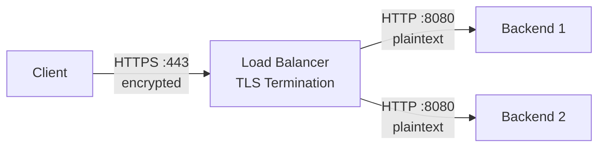

Có:

```text
Client → LB
TLS ✅

LB → Backend
TLS ❌
```

Request lifecycle:

```text
1. Client creates TLS connection with LB

2. Client sends encrypted request

3. LB decrypts request

4. LB sees:
   GET /orders

5. LB chooses backend

6. LB forwards:
   HTTP GET /orders

7. Backend processes request
```

Kubernetes Gateway API gọi client→gateway là **downstream connection**, và gateway→backend là **upstream connection**; hai phía được cấu hình độc lập. ([Gateway API][2])

---

# 4. Tại sao architecture này từng rất phổ biến?

Giả sử có:

```text
100 backend servers
```

Nếu backend tự handle public TLS:

```text
Backend 1 → cert
Backend 2 → cert
Backend 3 → cert
...
Backend 100 → cert
```

Bạn phải quản lý certificate/private key deployment ở rất nhiều nơi.

Nếu terminate tại LB:

```text
                 TLS
Client ─────────────────→ LB
                          │
                    certificate
                          │
              ┌───────────┼───────────┐
              ↓           ↓           ↓
             B1          B2          B3
```

Certificate management được centralize.

Ngoài ra encryption/decryption có thể được offload khỏi application servers. AWS cũng mô tả HTTPS listener của ALB như một cách offload encryption/decryption khỏi applications. ([AWS Docs][3])

---

# 5. Nhưng có một vấn đề

Đoạn:

```text
LB → Backend
```

là plaintext.

Ví dụ:

```text
Client
   │
   │ TLS encrypted
   ▼
Load Balancer
   │
   │ GET /payment
   │ Card data...
   ▼
Payment Service
```

Nếu attacker có khả năng sniff traffic trong internal network, plaintext có thể bị exposed.

Mental model cũ thường là:

> “Internal network của tôi trusted nên HTTP bên trong cũng được.”

Architecture hiện đại, đặc biệt khi áp dụng zero-trust principles, thường không muốn phụ thuộc hoàn toàn vào assumption đó.

Do đó xuất hiện:

# Re-encryption.

---

# 6. Case B — TLS Termination + Re-encryption

Architecture:

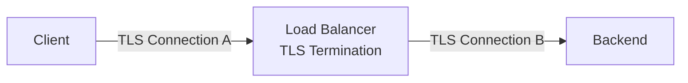

Có:

```text
Client → LB
HTTPS

LB → Backend
HTTPS
```

Nhìn sơ qua bạn có thể nghĩ:

```text
Client ───────── TLS ───────── Backend
```

Nhưng **không phải**.

Thực tế:

```text
Client
   │
   │ TLS Session A
   │
   ▼
Load Balancer
   │
   │ TLS Session B
   │
   ▼
Backend
```

Và:

```text
TLS A ≠ TLS B
```

---

# 7. LB đóng hai role khác nhau

Đây là cách hiểu cực kỳ quan trọng.

Với connection phía ngoài:

```text
Client → LB
```

LB là:

```text
TLS SERVER
```

ClientHello:

```text
Client
  ↓
LB
```

LB gửi:

```text
Certificate api.example.com
```

Nhưng phía trong:

```text
LB → Backend
```

LB lại trở thành:

```text
TLS CLIENT
```

Backend trở thành:

```text
TLS SERVER
```

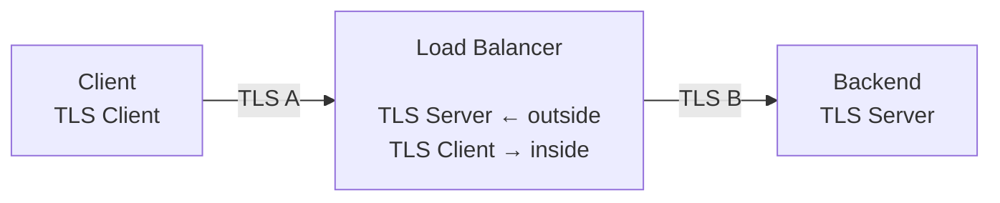

Đây là mental model quan trọng nhất của re-encryption.

---

# 8. Có hai TLS handshake khác nhau

Không phải handshake một lần.

Có:

```text
Handshake A:

Client
   ↕
Load Balancer
```

và:

```text
Handshake B:

Load Balancer
   ↕
Backend
```

Ví dụ:

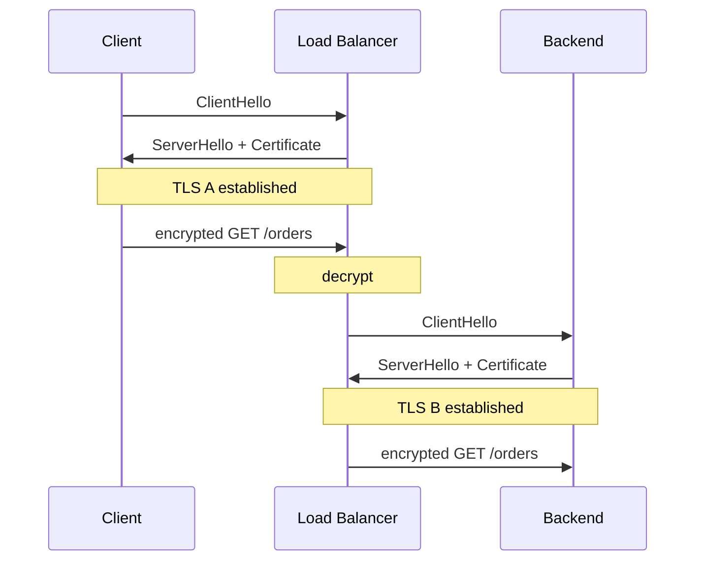

TLS A và TLS B có:

```text
different handshakes
different symmetric keys
different sequence numbers
different connection state
possibly different TLS versions
possibly different certificates
```

---

# 9. TCP Connections cũng khác

Với HTTPS over TCP:

```text
Client
  │
  │ TCP Connection A
  ▼
Load Balancer
  │
  │ TCP Connection B
  ▼
Backend
```

Do đó:

```text
TCP Connection A ≠ TCP Connection B
TLS Connection A ≠ TLS Connection B
```

LB không chỉ:

```text
copy packets
```

nữa.

Nó hoạt động như application-aware proxy.

---

# 10. Điều thú vị: hai connection không cần sống giống nhau

Ví dụ Client:

```text
Client A → LB
Client B → LB
Client C → LB
```

LB không nhất thiết tạo một backend connection mới cho từng request.

Proxy có thể maintain connection pools:

```text
                 Client A
                    │
                 Client B
                    │
                 Client C
                    ↓
              Load Balancer
                    │
            backend connection pool
               /       |       \
             B1        B2       B3
```

Frontend connection lifecycle và backend connection lifecycle có thể hoàn toàn khác nhau.

Đây là một consequence quan trọng của termination:

> LB trở thành connection boundary.

---

# 11. Tại sao LB muốn đọc HTTP?

Giả sử request:

```http
GET /products/123
Host: api.shop.com
Authorization: Bearer xxx
User-Agent: Chrome
```

Nếu LB decrypt TLS, nó nhìn được:

```text
Method = GET
Path = /products/123
Host = api.shop.com
Headers = ...
```

Từ đó làm được:

```text
L7 routing
WAF inspection
rate limiting
authentication integration
header manipulation
redirect
observability
logging
canary routing
A/B routing
```

---

# 12. Ví dụ Path-Based Routing

Bạn có microservices:

```text
/products → Product Service
/orders   → Order Service
/payment  → Payment Service
```

LB/API Gateway cần nhìn:

```http
GET /orders/123
```

thì mới biết route đi đâu.

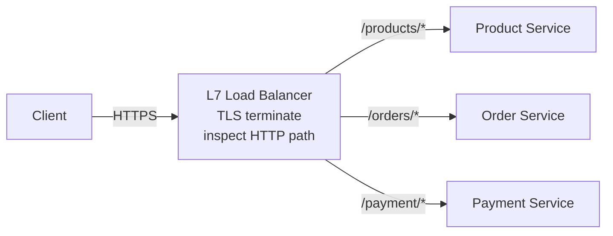

Nếu TLS chưa được decrypt:

```text
8FA921BC...
```

LB không nhìn thấy `/orders`.

Do đó không thể thực hiện normal HTTP path routing.

---

# 13. Host-Based Routing

Một LB có thể phục vụ:

```text
api.shop.com
admin.shop.com
seller.shop.com
```

Sau TLS termination:

```text
Host: api.shop.com
```

LB có thể route:

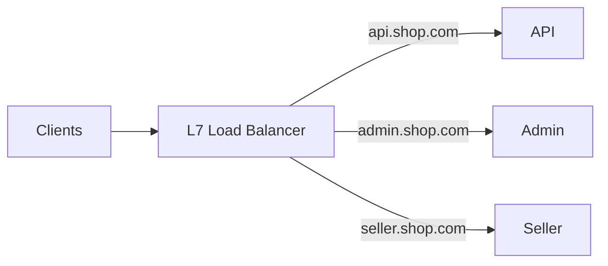

---

# 14. WAF cần TLS Termination để làm gì?

Giả sử attacker gửi:

```http
GET /search?q=<script>...
```

hoặc malicious request targeting an application vulnerability.

Nếu WAF chỉ thấy:

```text
TLS ciphertext
```

thì application payload bị mã hóa.

Nó không thể inspect HTTP body/path theo cách L7 thông thường.

Architecture phổ biến:

```text
Internet
   ↓
TLS
   ↓
CDN / WAF
   ↓
Application
```

WAF terminate/decrypt hoặc hoạt động tại một điểm đã có plaintext HTTP để inspect request.

---

# 15. Đây là trade-off cốt lõi

Terminate TLS càng sớm:

```text
+ visibility
+ routing
+ WAF
+ observability
+ centralized certificate management

BUT

- intermediary sees plaintext
- intermediary becomes security boundary
```

Không terminate:

```text
+ application owns cryptographic endpoint
+ intermediary can't inspect HTTP plaintext

BUT

- less L7 visibility
- less L7 routing functionality
- cert/TLS management moves to backend
```

---

# 16. Case C — TLS Passthrough

Architecture:

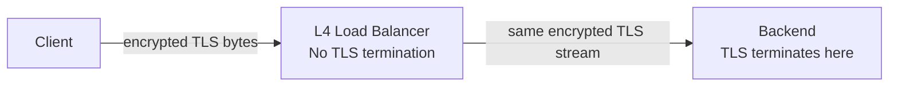

Ở đây:

```text
Client
        ───────── TLS ─────────
                             Backend
```

Load balancer không sở hữu TLS session.

Nó chỉ forward encrypted traffic.

AWS ví dụ trực tiếp rằng nếu muốn encrypted traffic đi tới target mà LB không decrypt, có thể dùng Network Load Balancer TCP listener trên port 443. ([AWS Docs][1])

---

# 17. Ai giữ certificate trong Passthrough?

Khác hoàn toàn case trước.

Terminate at LB:

```text
Certificate
Private Key
     ↓
    LB
```

Passthrough:

```text
Certificate
Private Key
     ↓
 Backend
```

Client handshake trực tiếp với backend endpoint về mặt TLS:

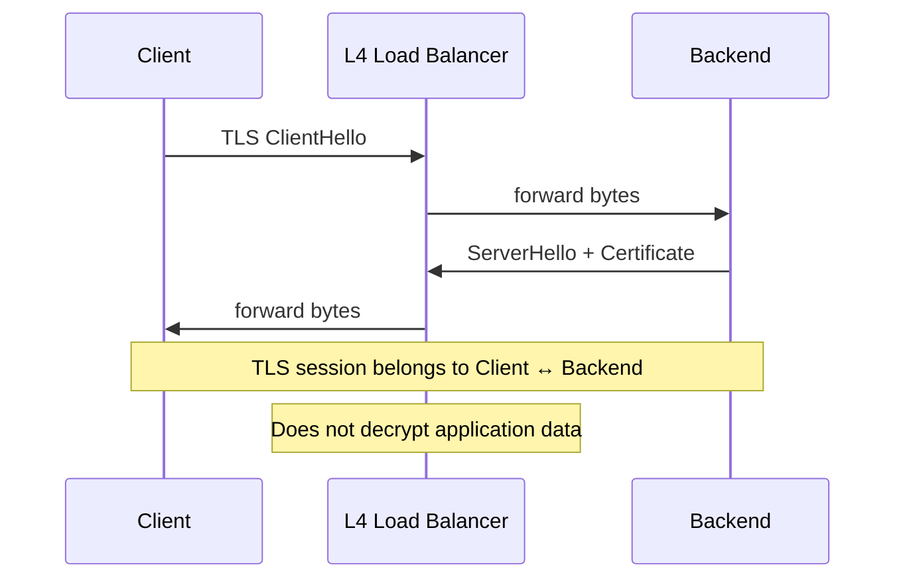

LB chỉ chuyển bytes.

---

# 18. L4 LB route bằng gì?

Không decrypt HTTP nên không thể nói:

```text
/payment → Service A
/orders  → Service B
```

theo plaintext HTTP path.

L4 thường dựa vào:

```text
IP
port
TCP connection
```

Một số TLS-aware passthrough gateways có thể route dựa trên TLS metadata như **SNI** mà không terminate application TLS session.

Kubernetes Gateway API `TLSRoute`, chẳng hạn, hỗ trợ passthrough routing theo SNI hostname trong TLS handshake. ([Gateway API][4])

Ví dụ:

```text
payments.example.com
      ↓
Payment backend

orders.example.com
      ↓
Order backend
```

nhưng gateway không cần đọc:

```text
POST /payment/charge
```

---

# 19. L4 vs L7 nên hiểu như thế này

## L4 load balancer

Quan tâm:

```text
IP
TCP
UDP
port
connection
```

Mental model:

> "Connection này phải đi server nào?"

---

## L7 load balancer

Quan tâm:

```text
HTTP method
Host
path
headers
cookies
gRPC metadata
...
```

Mental model:

> "Request này phải đi service nào?"

Để làm L7 HTTP routing với HTTPS traffic, proxy thường cần trở thành TLS endpoint/decrypt traffic.

---

# 20. So sánh ba topology quan trọng

|                                  | Terminate + HTTP | Terminate + re-encrypt | Passthrough |
| -------------------------------- | ---------------- | ---------------------- | ----------- |
| Client → LB encrypted            | ✅                | ✅                      | ✅           |
| LB đọc HTTP                      | ✅                | ✅                      | ❌           |
| LB → Backend encrypted           | ❌                | ✅                      | ✅           |
| Backend owns original client TLS | ❌                | ❌                      | ✅           |
| L7 routing tại LB                | ✅                | ✅                      | Hạn chế     |
| Cert public ở LB                 | ✅                | ✅                      | ❌           |
| Backend cần TLS cert             | ❌                | ✅                      | ✅           |

---

# 21. Re-encryption không phải Passthrough

Rất dễ nhầm.

### Re-encryption

```text
Client
  │
 TLS A
  ▼
 LB
decrypt
  ↓
HTTP
  ↓
encrypt
  │
 TLS B
  ▼
Backend
```

LB thấy plaintext.

---

### Passthrough

```text
Client
  │
  │
  ├──────── TLS session ────────┐
  │                             │
  ▼                             ▼
 LB ------------------------ Backend
         encrypted bytes
```

LB **không decrypt** application traffic.

Kubernetes Gateway API phân biệt chính thức hai mode `Terminate` và `Passthrough`; với passthrough, encrypted stream được chuyển tới backend, còn terminate thì gateway decrypt trước khi forwarding. ([Gateway API][5])

---

# 22. Một architecture thực tế đơn giản — Startup/Web Application

Giả sử:

```text
React
Spring Boot
PostgreSQL
```

deploy AWS:

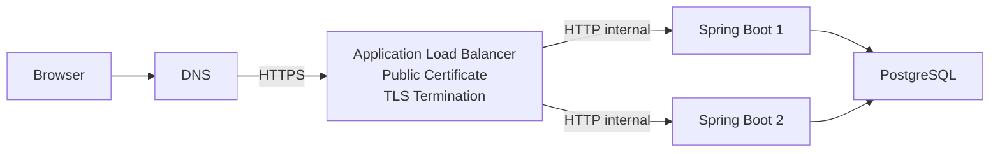

Đây là architecture hợp lý khi:

```text
internal environment strongly isolated
security requirements allow plaintext backend hop
simplicity matters
```

TLS certificate chỉ cần quản lý ở ALB.

AWS ALB HTTPS frontend hỗ trợ HTTP hoặc HTTPS target groups, nên chính architecture này hoặc re-encryption đều có thể triển khai. ([AWS Docs][6])

---

# 23. Architecture mạnh hơn — Re-encryption

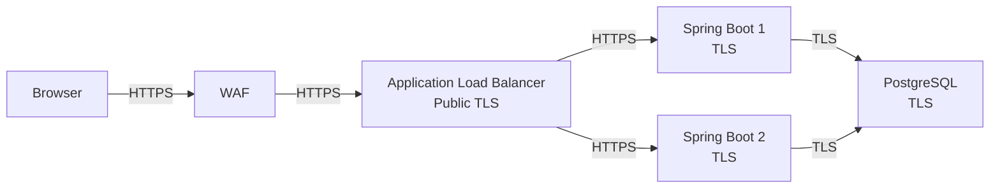

Traffic encrypted trên mỗi network hop.

Nhưng nhớ:

```text
Client ↔ WAF
WAF ↔ ALB
ALB ↔ Backend
Backend ↔ DB
```

có thể là **4 cryptographic connections khác nhau**.

Không phải một giant TLS tunnel.

---

# 24. Architecture hiện đại hơn — CDN + WAF + Gateway + Microservices

Một e-commerce lớn có thể gần như:

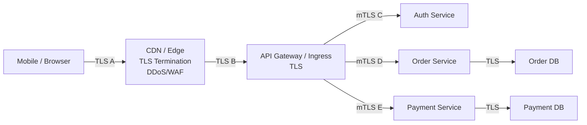

Đây là điểm cần thay đổi mental model:

> Trong distributed system, TLS thường là **hop-by-hop secure channels**, mỗi boundary có policy riêng.

---

# 25. Tại sao lại terminate cả ở CDN rồi terminate tiếp ở API Gateway?

Có vẻ dư thừa nhưng mỗi layer có trách nhiệm khác.

### Edge/CDN

Có thể xử lý:

```text
DDoS
WAF
bot protection
caching
geo routing
public TLS certificates
```

### API Gateway

Có thể xử lý:

```text
API routing
JWT validation
rate limiting
quotas
API versioning
request transformation
service routing
```

Do đó:

```text
Client --TLS A--> Edge
Edge   --TLS B--> API Gateway
```

hoàn toàn bình thường.

---

# 26. TLS Termination tạo ra Security Boundary

Đây là điểm system design rất quan trọng.

Nếu:

```text
Client
   ↓ encrypted
LB
   ↓ plaintext
Backend
```

thì LB là:

```text
trusted security boundary
```

Bởi tại đó tồn tại plaintext:

```http
Authorization: Bearer ...
Credit-Card-Data: ...
Cookie: ...
```

Nếu LB bị compromise:

```text
TLS bên ngoài không cứu được plaintext sau khi decrypt.
```

Vì vậy TLS termination location ảnh hưởng trực tiếp đến:

```text
threat model
compliance
network segmentation
access control
logging policy
secret management
```

---

# 27. Re-encryption có nghĩa backend verify LB không?

Không nhất thiết.

Đây là distinction tiếp theo.

Normal TLS:

```text
LB
   ↓ HTTPS
Backend
```

thường tập trung vào:

> LB xác minh backend/server identity theo TLS policy của implementation.

Nhưng không đồng nghĩa backend authenticate LB bằng client certificate.

Muốn hai phía authenticate nhau:

```text
mTLS
```

---

# 28. mTLS là gì trong architecture này?

Normal TLS:

```text
Client verifies Server
```

mTLS:

```text
Client verifies Server
AND
Server verifies Client
```

Ví dụ:

```text
Order Service
    ↓
Payment Service
```

Payment Service không chỉ muốn:

> "Connection encrypted."

Nó còn muốn biết:

> "Ai đang gọi tôi?"

mTLS:

```text
Order Service certificate
         ↓
Payment verifies

Payment certificate
         ↓
Order verifies
```

---

# 29. Service Mesh đưa mTLS vào Microservices

Một architecture dùng service mesh có thể là:

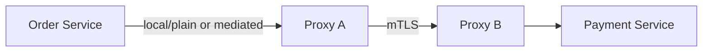

Application không nhất thiết tự implement toàn bộ mTLS logic.

Proxy/service mesh có thể đảm nhiệm:

```text
certificate provisioning
certificate rotation
mTLS
service identity
policy
telemetry
```

Istio, chẳng hạn, có Auto mTLS và mô hình hóa traffic giữa workloads trong mesh qua mutual TLS; gateway inbound và outbound cũng là các connection riêng biệt. ([Istio][7])

---

# 30. Architecture kiểu Zero Trust

Mental model truyền thống:

```text
Inside VPC
=
trusted
```

Mental model zero trust gần hơn:

```text
Network location alone
≠
identity
```

Do đó:

```text
Service A
   ↓
authenticate
Service B
```

chứ không chỉ:

```text
Source IP belongs to private subnet
→ trust it
```

Architecture:

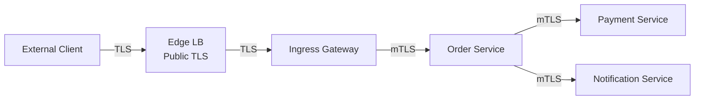

Bây giờ security không dừng ở perimeter.

---

# 31. Certificate cũng chia thành Public PKI và Internal PKI

Ví dụ:

### Public edge

```text
api.myshop.com
```

certificate từ public CA.

Browser phải trust được.

### Internal service

```text
payment-service.prod.internal
```

không cần public Internet trust.

Organization có thể có:

```text
Internal CA
```

để issue workload certificates:

```text
Order Service cert
Payment Service cert
Inventory Service cert
```

Mental architecture:

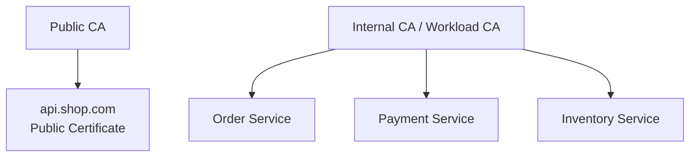

---

# 32. Một Payment System thực tế nên nghĩ như thế nào?

Giả sử bạn design payment gateway:

```text
Mobile/Web
   ↓
Payment API
   ↓
Bank/NAPAS
```

Một architecture an toàn hơn:

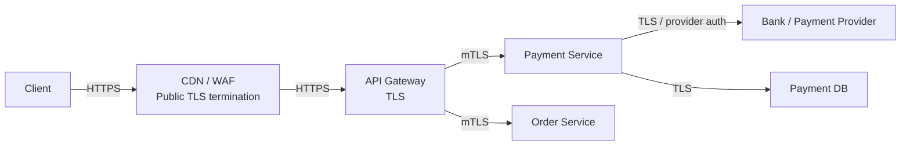

Bây giờ khi interviewer hỏi:

> "Your system uses HTTPS?"

Một response tốt hơn là:

> "Externally, clients establish TLS with our edge gateway. Traffic from the edge to the internal API gateway remains encrypted, and service-to-service communication can use mTLS so we get both encryption and workload authentication."

Đây là system-design reasoning tốt hơn rất nhiều so với:

> "Yes, we use HTTPS."

---

# 33. Khi nào chọn TLS Passthrough?

Passthrough hữu ích khi:

### Backend phải thực sự sở hữu TLS endpoint

Ví dụ:

```text
special security requirement
client certificate validation at application
custom TLS behavior
```

### Protocol không phải HTTP

Ví dụ Gateway API đưa ra các use case TLS-based như Kafka hoặc PostgreSQL, nơi bạn có thể muốn giữ encrypted connection tới backend. ([Gateway API][4])

### Không muốn intermediary nhìn application plaintext

Architecture:

```text
Client
        ───── original TLS ─────
              ↓
             L4 LB
              ↓
           Backend
```

---

# 34. Nhưng Passthrough mất gì?

LB không có plaintext HTTP.

Do đó bạn khó hoặc không thể làm tại LB:

```text
route by /orders
route by header
modify headers
inspect body
HTTP WAF rules
JWT inspection at LB
application-level tracing
```

Bạn vẫn có:

```text
L4 balancing
connection routing
some TLS metadata routing such as SNI
```

tùy implementation.

Đây là trade-off.

---

# 35. Khi nào chọn Termination + HTTP Backend?

Thường hợp lý khi:

```text
simple system
trusted/isolated internal network
low compliance requirement
want simple certificate management
want L7 routing
```

Ví dụ:

```text
Internet
   ↓ HTTPS
ALB
   ↓ HTTP private subnet
Spring Boot instances
```

Ưu điểm:

```text
simple
central cert
less backend TLS config
full L7 visibility
```

Nhược:

```text
internal hop plaintext
```

---

# 36. Khi nào chọn Termination + Re-encryption?

Thường hợp lý khi:

```text
need L7 processing at gateway
AND
need encryption over internal network
```

Ví dụ:

```text
Internet
  ↓ TLS
WAF/LB
  ↓ TLS
Backend
```

Ưu điểm:

```text
L7 routing/WAF
+
encrypted internal traffic
```

Nhược điểm:

```text
more TLS handshakes
more certificates
more configuration
more failure modes
```

Kubernetes Gateway API hiện hỗ trợ upstream TLS qua `BackendTLSPolicy`; docs mô tả đây chính là pattern gateway terminate rồi re-encrypt tới backend. ([Gateway API][2])

---

# 37. Khi nào dùng mTLS?

Khi requirement không chỉ là:

```text
encrypt traffic
```

mà còn:

```text
authenticate workload/client
```

Ví dụ Payment Service chỉ chấp nhận:

```text
Order Service
Refund Service
Admin Payment Worker
```

Không phải:

```text
mọi pod trong VPC
```

mTLS có thể biến:

```text
network connection
```

thành connection có cryptographic workload identity.

---

# 38. Đừng nhầm TLS với Authorization

Ngay cả khi mTLS chứng minh:

```text
Caller = Order Service
```

vẫn cần quyết định:

```text
Order Service được phép làm gì?
```

Đây là:

```text
Authentication
vs
Authorization
```

Ví dụ:

```text
mTLS:
"This is Order Service."

Policy:
"Order Service may POST /payments
but cannot POST /admin/refund-all."
```

TLS không tự giải quyết toàn bộ authorization model.

---

# 39. Một architecture Kubernetes hiện đại

Có thể hình dung:

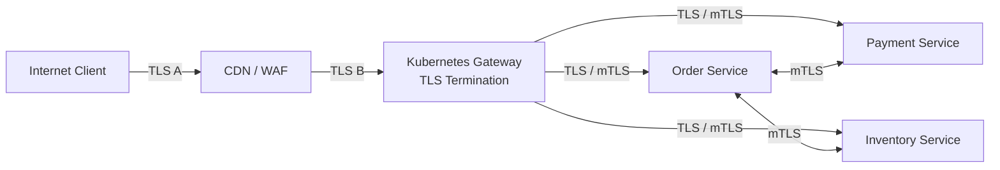

Gateway API explicitly treats downstream and upstream TLS separately, which is precisely the mental model you want in modern Kubernetes networking. ([Gateway API][2])

---

# 40. TLS Termination còn ảnh hưởng Observability

Nếu proxy terminate:

```text
TLS ciphertext
      ↓
proxy decrypt
      ↓
HTTP request
```

proxy có thể collect:

```text
HTTP method
path
status code
latency
request size
response size
upstream service
```

Ví dụ metrics:

```text
POST /payment
200
87 ms
```

Nếu passthrough:

```text
proxy sees mostly connection-level information
```

như:

```text
source/destination
bytes
connection duration
TCP state
TLS metadata available to implementation
```

nhưng không plaintext application request.

---

# 41. TLS Termination ảnh hưởng Client IP như thế nào?

Một reverse proxy tạo backend connection mới:

```text
Client IP = 1.2.3.4

Client
   ↓
LB
   ↓
Backend
```

Backend's direct TCP peer thường là:

```text
Load Balancer
```

không phải client.

Do đó HTTP proxies thường propagate original client information qua mechanisms như forwarding headers, tùy infrastructure.

Đây cũng là consequence của:

```text
TCP A ≠ TCP B
```

Backend không trực tiếp sở hữu original client TCP connection.

---

# 42. TLS Re-encryption không có nghĩa "LB không đọc data"

Cực kỳ hay bị nhầm:

```text
Client --TLS--> LB --TLS--> Backend
```

một số người nghĩ:

> "Data luôn encrypted nên LB không đọc được."

Sai.

Flow:

```text
ciphertext A
    ↓
LB decrypt using TLS A
    ↓
PLAINTEXT
    ↓
LB routing / WAF / logging
    ↓
encrypt using TLS B
    ↓
ciphertext B
```

LB hoàn toàn nhìn thấy HTTP request.

---

# 43. Muốn LB không đọc được thì phải Passthrough

```text
Client
   ↓
ciphertext
   ↓
LB
   ↓
same TLS stream
   ↓
Backend
```

LB không có traffic key.

Backend có.

Đây mới gần với:

> cryptographic endpoint thực sự nằm ở backend.

---

# 44. "End-to-End Encryption" cần dùng từ cẩn thận

Có hai architecture:

### A

```text
Client --TLS--> LB --TLS--> Backend
```

Traffic encrypted trên **mọi network hop**.

Nhưng:

```text
LB sees plaintext.
```

### B

```text
Client -------- TLS -------- Backend
             passthrough LB
```

LB không decrypt.

Nếu nói chính xác:

```text
A = hop-by-hop encryption / encrypted on each hop

B = one TLS session between client and backend
```

Do đó khi interviewer nói:

> We require end-to-end TLS.

Bạn nên hỏi:

> **Do you mean encrypted on every hop, or must the application itself be the cryptographic endpoint so intermediaries cannot decrypt the traffic?**

Đây là một câu rất mạnh trong system design.

---

# 45. Một điểm AWS đáng chú ý

AWS ALB có thể terminate HTTPS frontend và sử dụng HTTPS target group cho backend connection. Tuy nhiên AWS docs hiện nêu rằng ALB **không validate certificate của HTTPS targets**, vì target traffic trong VPC dựa vào VPC packet-level protections theo mô hình của họ. ([AWS Docs][6])

Điều này cho thấy một distinction quan trọng:

```text
Encryption
≠
Authentication guarantees giống nhau trên mọi implementation
```

Đừng chỉ nhìn thấy:

```text
HTTPS
```

rồi assume mọi certificate validation/mTLS behavior giống browser→website.

Phải đọc semantics của infrastructure cụ thể.

---

# 46. Failure modes tăng lên khi có nhiều TLS hops

Architecture:

```text
Client
 ↓ TLS A
Edge
 ↓ TLS B
Gateway
 ↓ TLS C
Service
```

request fail TLS.

Bạn phải hỏi:

```text
TLS A fail?
TLS B fail?
TLS C fail?
```

Ví dụ TLS A:

```text
public cert expired
```

TLS B:

```text
gateway doesn't trust edge certificate
```

TLS C:

```text
internal CA rotation failed
```

Đây là lý do observability rất quan trọng.

---

# 47. Debug theo từng hop

Đừng debug:

```text
"HTTPS broken"
```

Hãy tách:

```text
Client → Edge
    TLS OK?

Edge → Gateway
    TLS OK?

Gateway → Backend
    TLS OK?

Backend → DB
    TLS OK?
```

Mental model:

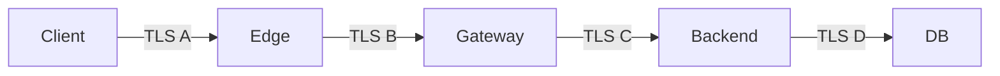

Mỗi arrow là một separate connection và một separate potential failure domain.

---

# 48. Performance trade-off

TLS termination centralization có thể giảm crypto work ở application instances.

Nhưng nếu bạn:

```text
terminate
↓
re-encrypt
↓
terminate
↓
re-encrypt
```

thì crypto work tăng.

Tuy nhiên production systems còn sử dụng:

```text
connection reuse
TLS resumption
persistent upstream connections
hardware acceleration
efficient modern crypto
```

nên không nên đơn giản kết luận:

> "Nhiều TLS hop = system chắc chắn chậm."

Đây là một architecture trade-off:

```text
Security
vs
Complexity
vs
Latency
vs
Observability
```

---

# 49. Một decision framework rất dễ nhớ

Khi design, hỏi lần lượt:

### Question 1

> LB có cần đọc HTTP không?

Nếu:

```text
YES
```

→ terminate TLS tại LB/gateway.

Nếu:

```text
NO
```

→ passthrough có thể là lựa chọn.

---

### Question 2

> Internal traffic có cần encryption không?

Nếu:

```text
NO
```

→

```text
TLS terminate
LB → HTTP → Backend
```

Nếu:

```text
YES
```

→

```text
TLS terminate
LB → TLS → Backend
```

---

### Question 3

> Backend có cần xác thực caller bằng certificate không?

Nếu yes:

```text
mTLS
```

---

# 50. Decision tree tổng thể

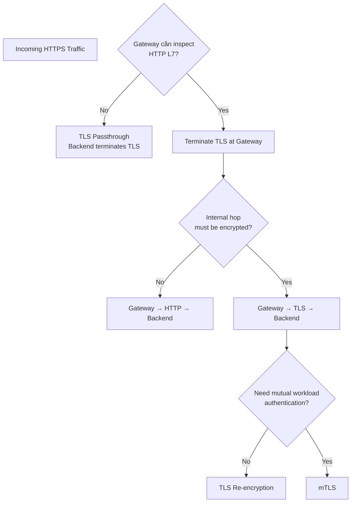

---

# 51. Cách nói khi phỏng vấn System Design

Nếu interviewer hỏi:

> Where would you terminate TLS?

Đừng lập tức trả lời:

> At the load balancer.

Một câu tốt hơn:

> **I would first clarify the trust boundary. For public traffic, I would normally terminate TLS at an edge or L7 load balancer so we can perform WAF inspection, routing, rate limiting and observability. If internal traffic also needs confidentiality, I would establish a separate TLS connection from the proxy to the backend. If we additionally need workload identity, I would use mTLS, potentially through a service mesh. If the application itself must remain the cryptographic endpoint, I would consider TLS passthrough instead.**

Câu đó thể hiện bạn hiểu trade-off thay vì chỉ thuộc architecture.

---

# 52. Mental model cuối cùng cần nhớ

Đầu tiên nhớ 4 pattern:

```text
① TLS Termination

Client --TLS--> LB --HTTP--> Backend
```

```text
② TLS Re-encryption

Client --TLS A--> LB --TLS B--> Backend
```

```text
③ TLS Passthrough

Client -------- TLS --------> Backend
                ↑
               LB
          only forwards
```

```text
④ mTLS

Service A <====== TLS ======> Service B
           both authenticate
```

Và nhớ trách nhiệm:

```text
Termination
→ "I need to SEE application traffic."

Re-encryption
→ "I need to SEE it here,
   but still ENCRYPT the next hop."

Passthrough
→ "I must NOT see the plaintext here."

mTLS
→ "I need ENCRYPTION
   + both sides' IDENTITY."
```

---

## 53. Sơ đồ lớn cho một system hiện đại

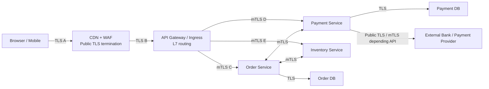

Đừng nhìn sơ đồ này như:

```text
"HTTPS everywhere"
```

mà hãy nhìn:

```text
TLS A
TLS B
TLS C
TLS D
TLS E
...
```

Mỗi connection có:

```text
own client
own server
own handshake
own certificates/policies
own traffic keys
own lifetime
own failure modes
```

Đó mới là mental model chuẩn khi đi từ **TLS kiến thức networking** sang **TLS architecture trong distributed systems**.

Và nếu chỉ giữ lại **một câu duy nhất**, hãy giữ câu này:

> **TLS termination xác định nơi encrypted connection kết thúc và nơi plaintext trở nên visible; từ đó nó xác định cả security boundary lẫn những L7 capabilities mà infrastructure có thể thực hiện.**

[1]: https://docs.aws.amazon.com/elasticloadbalancing/latest/application/create-https-listener.html "https://docs.aws.amazon.com/elasticloadbalancing/latest/application/create-https-listener.html"
[2]: https://gateway-api.sigs.k8s.io/guides/user-guides/tls/ "https://gateway-api.sigs.k8s.io/guides/user-guides/tls/"
[3]: https://docs.aws.amazon.com/elasticloadbalancing/latest/application/load-balancer-listeners.html "https://docs.aws.amazon.com/elasticloadbalancing/latest/application/load-balancer-listeners.html"
[4]: https://gateway-api.sigs.k8s.io/reference/api-types/tlsroute/ "https://gateway-api.sigs.k8s.io/reference/api-types/tlsroute/"
[5]: https://gateway-api.sigs.k8s.io/guides/user-guides/tls-routing/ "https://gateway-api.sigs.k8s.io/guides/user-guides/tls-routing/"
[6]: https://docs.aws.amazon.com/elasticloadbalancing/latest/application/load-balancer-target-groups.html "https://docs.aws.amazon.com/elasticloadbalancing/latest/application/load-balancer-target-groups.html"
[7]: https://istio.io/latest/docs/ops/configuration/traffic-management/tls-configuration/ "https://istio.io/latest/docs/ops/configuration/traffic-management/tls-configuration/"
