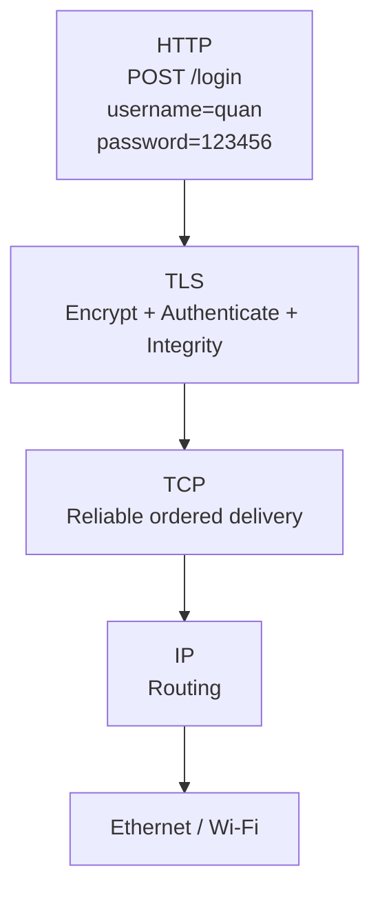
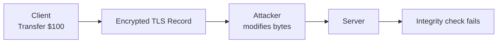
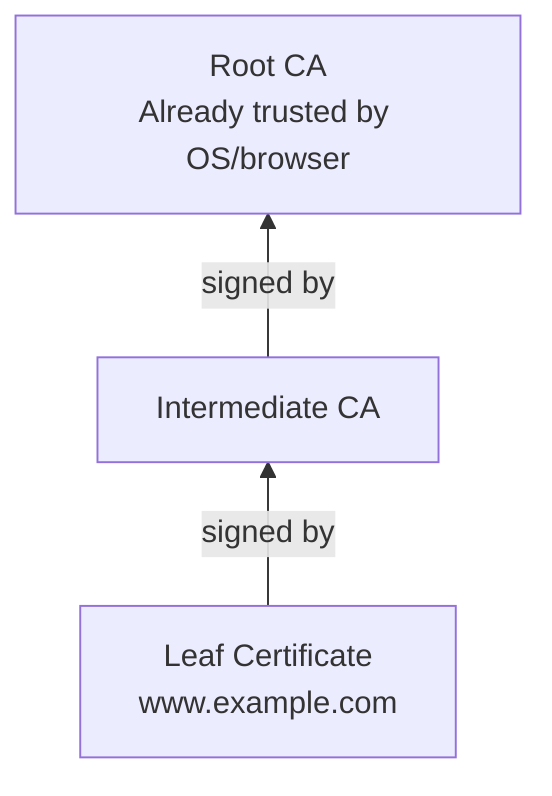
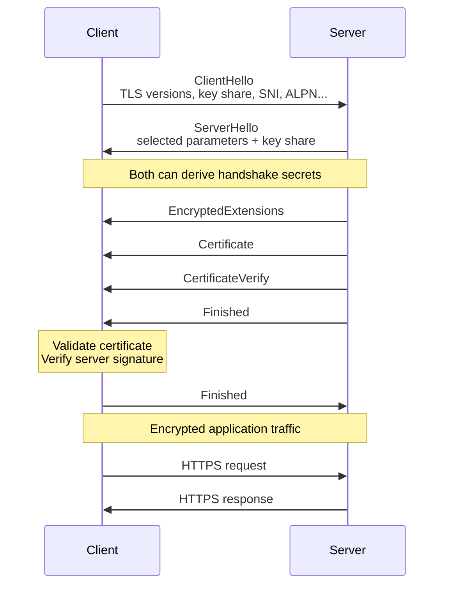
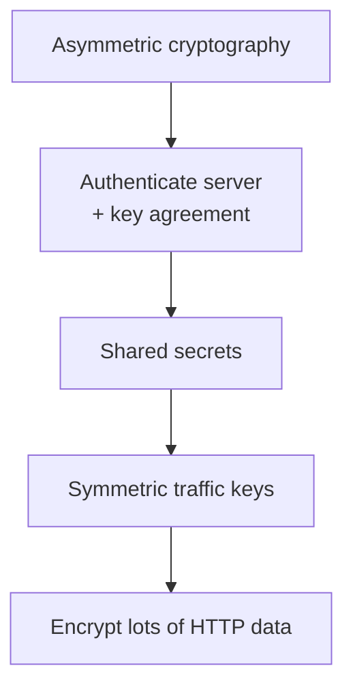
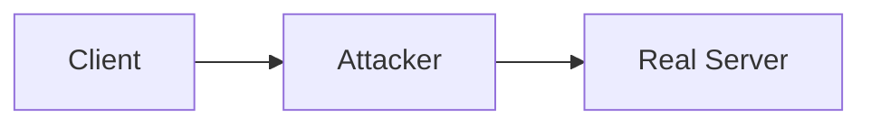
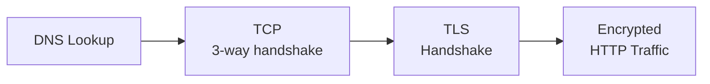
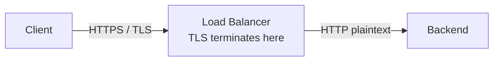
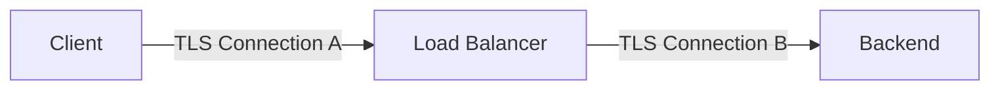
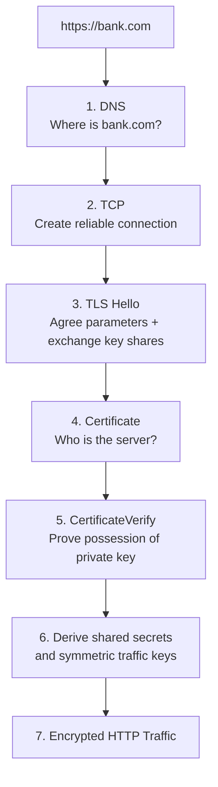

# HTTPS + TLS Deep Dive — Mental Model từ Certificate đến Encrypted HTTP Traffic

Để nhớ TLS lâu, đừng bắt đầu bằng certificate hay thuật toán mã hóa. Hãy bắt đầu bằng một câu hỏi rất đơn giản:

> **Browser muốn gửi HTTP request tới server qua Internet. Làm sao browser biết mình đang nói chuyện đúng server, người khác không đọc được dữ liệu, và dữ liệu không bị sửa trên đường đi?**

TLS được sinh ra để giải quyết chính ba vấn đề đó.

---

## 1. Bức tranh lớn nhất: HTTPS thực chất là gì?

Với HTTP/1.1 hoặc HTTP/2, có thể hình dung:

```text
HTTP
 ↓
TLS
 ↓
TCP
 ↓
IP
 ↓
Ethernet / Wi-Fi
```

Ví dụ browser muốn gửi:

```http
POST /login

username=quan
password=123456
```

Nếu chỉ là HTTP không có TLS, dữ liệu application có thể đi dưới dạng plaintext ở tầng HTTP.

HTTPS thêm TLS vào giữa:



TLS nhận HTTP data:

```text
username=quan
password=123456
```

và biến nó thành ciphertext trước khi truyền.

Một người trung gian có thể capture packet nhưng không dễ đọc được HTTP plaintext.

Lưu ý với HTTP/3 thì stack khác:

```text
HTTP/3
 ↓
QUIC
 ↓
UDP
 ↓
IP
```

QUIC tích hợp TLS 1.3 vào protocol của mình, nên không có lớp `TLS → TCP` giống HTTP/1.1 và HTTP/2.

---

# 2. TLS giải quyết ba vấn đề gì?

Hãy nhớ ba chữ:

```text
Confidentiality
Integrity
Authentication
```

Có thể nhớ bằng câu:

> **Ai đang nói chuyện với tôi? Có ai đọc không? Có ai sửa không?**

### Confidentiality — không cho người khác đọc

Bạn gửi:

```text
password = abc123
```

TLS biến nó thành ciphertext.

Attacker nhìn được packet nhưng không biết nội dung thực.

Mental model:

```text
Client:
"Transfer $100"

        ↓ encrypt

"8Fx92KmP..."

        ↓ Internet

Server decrypt

        ↓

"Transfer $100"
```

---

### Integrity — phát hiện dữ liệu bị sửa

Giả sử bạn gửi:

```text
Transfer $100
```

Attacker cố sửa thành:

```text
Transfer $9000
```

Modern TLS sử dụng authenticated encryption để server có thể phát hiện ciphertext đã bị sửa.

Server sẽ không đơn giản decrypt thành request hợp lệ.

Mental model:



---

### Authentication — tôi đang nói chuyện với ai?

Đây là nhiệm vụ quan trọng của certificate.

Bạn truy cập:

```text
https://bank.com
```

Encryption thôi chưa đủ.

Giả sử attacker đứng giữa:

```text
You
 ↓
Attacker
 ↓
Bank
```

Attacker nói:

> "Tôi là bank.com, hãy mã hóa dữ liệu với tôi."

Nếu bạn không xác minh identity thì vẫn có thể thiết lập một encrypted connection... nhưng encrypted với **attacker**.

Vì vậy TLS còn phải chứng minh:

> Server này thực sự được xác thực cho `bank.com`.

---

# 3. Certificate nên hiểu như thế nào?

Một certificate có thể hình dung như:

> **CCCD/hộ chiếu dành cho server + public key của server.**

Ví dụ certificate nói conceptually:

```text
Identity:
    www.example.com

Public Key:
    PK_SERVER

Issuer:
    Some CA

Signature:
    CA signature
```

Nghĩa của certificate không đơn giản là:

> "Đây là public key."

Mà là:

> **Một trusted issuer đã ký vào một cấu trúc chứa public key và identity information.**

---

# 4. CA là gì?

CA = Certificate Authority.

Bạn có thể hình dung CA giống một cơ quan cấp giấy tờ mà browser/OS đã chọn tin cậy.

Ví dụ browser nhận:

```text
Certificate:
www.example.com
Public Key = XYZ
Signed by Intermediate CA
```

Nhưng browser hỏi:

> Tôi có tin Intermediate CA này không?

Certificate chain có thể là:

```text
www.example.com
      ↓ signed by
Intermediate CA
      ↓ signed by
Root CA
```

Browser/OS đã có Root CA trong trust store.



Client kiểm tra chain để quyết định liệu certificate của server có dẫn tới một trust anchor mà nó tin hay không.

---

# 5. Vì sao cần Intermediate CA?

Một thiết kế phổ biến không để Root CA trực tiếp ký hàng triệu website.

Thay vào đó:

```text
Root CA
   ↓
Intermediate CA
   ↓
Website certificates
```

Root private key có thể được bảo vệ nghiêm ngặt hơn.

Intermediate làm phần lớn công việc issuing certificates.

---

# 6. Public Key và Private Key

Một key pair:

```text
Public Key
Private Key
```

Public key:

```text
có thể public cho mọi người
```

Private key:

```text
chỉ server được giữ
```

Hai key có liên quan toán học.

Certificate chứa:

```text
Public Key
```

nhưng **không chứa private key**.

Server có:

```text
Certificate
+
Private Key
```

Nếu attacker chỉ copy certificate:

```text
attacker has certificate
attacker has public key
```

thì vẫn chưa đủ để giả làm server, bởi attacker không có corresponding private key.

---

# 7. Digital Signature — chỗ rất hay bị hiểu sai

Digital signature không nên hiểu là:

> Server dùng private key để encrypt toàn bộ dữ liệu.

Trong TLS 1.3, một use case quan trọng của private key certificate là **ký handshake context** thông qua `CertificateVerify`.

Server chứng minh:

> "Tôi thực sự sở hữu private key tương ứng với public key trong certificate này."

RFC TLS 1.3 mô tả `CertificateVerify` chính là bằng chứng endpoint sở hữu private key tương ứng với certificate và signature cũng bảo vệ integrity của handshake tới thời điểm đó. ([RFC Editor][1])

Có thể hình dung:

```text
Server certificate:

Public Key = P

Server privately owns:

Private Key = S
```

Server lấy handshake information:

```text
ClientHello
ServerHello
...
```

và ký:

```text
Signature = Sign(PrivateKey, handshake_context)
```

Client dùng public key:

```text
Verify(PublicKey, handshake_context, Signature)
```

Nếu verify thành công:

```text
server demonstrates possession
of matching private key
```

---

# 8. Certificate validation và CertificateVerify là hai việc khác nhau

Đây là distinction rất đáng nhớ.

### Certificate validation trả lời:

> **Public key này có đáng tin là thuộc về `api.example.com` không?**

Client kiểm tra certificate chain, hostname, validity và policy liên quan.

### CertificateVerify trả lời:

> **Server đang nói chuyện với tôi hiện giờ có thực sự sở hữu private key của certificate đó không?**

Hai bước kết hợp lại:

```text
Certificate chain
        ↓
"This public key belongs to example.com"

CertificateVerify
        ↓
"This server actually owns the matching private key"
```

---

# 9. TLS 1.3 Handshake — hiểu bằng một cuộc hội thoại

Giả sử:

```text
Client = Chrome
Server = api.example.com
```

Full handshake simplified:



TLS 1.3 thực sự dùng `ClientHello`/`ServerHello` cùng key shares để thiết lập cryptographic state, rồi derive handshake và application traffic secrets. ([RFC Editor][1])

Bây giờ ta đi từng bước.

---

# 10. Step 1 — ClientHello

Client mở đầu bằng:

```text
ClientHello
```

Conceptually nó nói:

```text
Hello server.

I support TLS 1.3.
Here is my key-share information.
I want example.com.
I support HTTP/2 and HTTP/1.1.
...
```

Trong đó có hai extension bạn nên biết:

```text
SNI
ALPN
```

---

# 11. SNI là gì?

SNI = Server Name Indication.

Client nói trong TLS handshake:

> Tôi muốn kết nối tới hostname nào.

Ví dụ một IP:

```text
1.2.3.4
```

có thể host:

```text
api.shop.com
mail.shop.com
admin.shop.com
```

Server/LB cần biết:

```text
Bạn muốn website nào?
```

Client gửi SNI:

```text
server_name = api.shop.com
```

Server/LB nhờ đó có thể chọn đúng certificate/configuration. SNI được gửi như một extension của `ClientHello` để hỗ trợ nhiều virtual servers trên cùng network address. ([RFC Editor][2])

Mental model:

```text
IP address
= tòa chung cư

SNI
= "Tôi muốn phòng 502"
```

---

# 12. ALPN là gì?

ALPN = Application-Layer Protocol Negotiation.

Client nói:

```text
Tôi support:
h2
http/1.1
```

Server có thể chọn:

```text
h2
```

Vậy cả hai biết sau TLS handshake:

```text
We will speak HTTP/2.
```

RFC ALPN định nghĩa việc client đưa các application protocols hỗ trợ vào TLS handshake và server chọn một protocol chung, tránh cần thêm một network round trip riêng chỉ để thương lượng protocol. ([RFC Editor][3])

Mental model:

```text
Client:
"Tôi nói được tiếng Việt và tiếng Anh."

Server:
"OK, dùng tiếng Anh."
```

---

# 13. Step 2 — ServerHello

Server trả:

```text
ServerHello
```

Conceptually:

```text
OK.

We will use TLS 1.3.
Here is my key share.
Here are the selected parameters.
```

Sau `ClientHello + ServerHello`, hai phía có đủ material để bắt đầu derive shared handshake secrets.

Đây đưa chúng ta đến một concept rất quan trọng:

> **Key establishment.**

---

# 14. Hai bên tạo shared secret như thế nào?

TLS 1.3 thường sử dụng ephemeral Diffie-Hellman family key exchange như ECDHE.

Mental model đơn giản nhất:

```text
Client has secret A
Server has secret B
```

Hai bên trao đổi public information:

```text
Client public value
Server public value
```

Sau computation:

```text
Client derives:
Shared Secret K

Server derives:
Shared Secret K
```

Kết quả:

```text
Client K == Server K
```

nhưng attacker chỉ nhìn network traffic không đơn giản suy ra K.

Điểm cực kỳ quan trọng:

```text
K không được gửi trực tiếp qua network.
```

Không có packet:

```text
"Hello attacker, đây là AES key của chúng tôi: 123456"
```

Hai bên **derive** cùng secret.

---

# 15. Ephemeral nghĩa là gì?

`Ephemeral` có thể nhớ là:

> **key material tạm thời cho connection/session này.**

Ví dụ connection #1:

```text
ephemeral secret = X
```

connection #2:

```text
ephemeral secret = Y
```

Điều này liên quan tới:

```text
Forward Secrecy
```

Nếu sau này long-term server private key bị compromise, attacker không tự động có khả năng giải mã mọi traffic cũ đã capture nếu session dùng phù hợp ephemeral key agreement.

TLS 1.3 mô tả việc kết hợp PSK với `(EC)DHE` để giữ forward secrecy; PSK dùng một mình sẽ không có cùng property đó. ([RFC Editor][1])

---

# 16. Step 3 — Server gửi Certificate

Bây giờ server nói:

```text
Đây là certificate của tôi.
```

Ví dụ:

```text
Subject/SAN:
api.example.com

Public key:
P_server

Signed via:
Intermediate CA → Root CA
```

Client bắt đầu certificate validation.

---

# 17. Client kiểm tra Certificate như thế nào?

Không cần nhớ hàng chục rule ngay từ đầu. Hãy nhớ năm câu hỏi:

| Client hỏi                                   | Ví dụ                                             |
| -------------------------------------------- | ------------------------------------------------- |
| Certificate có tạo được trusted chain không? | Root CA có nằm trong trust store?                 |
| Certificate có đúng hostname không?          | Tôi gọi `api.example.com`, cert có tên này không? |
| Certificate còn hạn không?                   | Not Before / Not After                            |
| Signature chain hợp lệ không?                | Intermediate/CA signatures verify được không?     |
| Certificate có phù hợp mục đích này không?   | key usage / policy                                |

Ví dụ bạn truy cập:

```text
https://api.company.com
```

nhưng certificate chỉ hợp lệ cho:

```text
mail.company.com
```

Client sẽ có:

```text
hostname mismatch
```

Dù certificate có được một CA uy tín ký.

---

# 18. Step 4 — CertificateVerify

Certificate mới chỉ cho client public key.

Server tiếp tục phải chứng minh:

```text
I actually own the corresponding private key.
```

Server ký handshake:

```text
Private Key
    ↓
sign handshake context
    ↓
CertificateVerify
```

Client:

```text
Certificate Public Key
    ↓
verify signature
```

Nếu thành công:

```text
Identity + key possession established
```

---

# 19. Step 5 — Finished

`Finished` về mental model có thể hiểu:

> "Đây là bằng chứng cryptographic rằng handshake tới đây nhất quán và tôi đã derive đúng secrets."

Client và server verify handshake.

Sau đó:

```text
TLS secure channel established
```

và application có thể bắt đầu gửi:

```http
GET /users
```

hoặc:

```http
POST /payment
```

được bảo vệ bởi application traffic keys.

---

# 20. Tại sao server không dùng Private Key để mã hóa toàn bộ HTTP?

Đây là câu interview rất quan trọng.

Sai mental model:

```text
HTTPS:

server private key
↓
encrypt/decrypt every HTTP packet
```

Không phải cách TLS 1.3 vận hành.

Mental model đúng:



Asymmetric cryptography rất hữu ích để:

```text
prove identity
+
establish/authenticate key agreement
```

Sau đó hai bên derive:

```text
symmetric traffic keys
```

và dùng symmetric authenticated encryption cho bulk data. TLS 1.3 có explicit key schedule để derive client/server application traffic secrets và từ đó tính traffic keying material. ([RFC Editor][1])

---

# 21. Vì sao Symmetric Encryption tốt cho traffic?

Giả sử connection download:

```text
2 GB video
```

Bạn không muốn thực hiện expensive public-key operations cho từng block video.

Symmetric algorithms được thiết kế rất hiệu quả cho:

```text
large amount of data
```

Mental model:

```text
Asymmetric crypto
= dùng để gặp nhau + xác minh nhau

Symmetric crypto
= dùng để nói chuyện hàng triệu lần sau đó
```

Một analogy dễ nhớ:

> **Asymmetric crypto giống hai người dùng quy trình an toàn để thống nhất chìa khóa căn phòng. Sau khi đã có cùng chìa khóa, họ dùng chiếc chìa khóa đó hàng ngày thay vì mỗi lần mở cửa lại làm lại toàn bộ quy trình xác minh danh tính.**

---

# 22. Private Key và Traffic Key là hai thứ khác nhau

Hãy phân biệt rất rõ:

```text
Server Certificate Private Key
```

và:

```text
TLS Traffic Keys
```

Private key:

```text
longer-lived identity credential
```

Traffic key:

```text
derived for connection/session traffic
```

Không phải:

```text
trafficKey = serverPrivateKey
```

Mà gần với:

```text
ECDHE shared secret
        +
handshake transcript
        +
TLS key derivation
        ↓
client traffic secret
server traffic secret
        ↓
traffic keys
```

---

# 23. Toàn bộ TLS Handshake bằng một ví dụ đời thường

Hãy tưởng tượng Client muốn giao tài liệu bí mật cho Server.

Client:

> "Bạn là ngân hàng thật không?"

Server đưa:

```text
Certificate
```

giống:

> "Đây là giấy tờ identity của tôi."

Client kiểm tra chữ ký CA:

> "OK, giấy tờ này đến từ chain tôi tin."

Nhưng client vẫn hỏi:

> "Bạn có thực sự là người sở hữu giấy đó không?"

Server làm:

```text
CertificateVerify
```

giống ký ngay trước mặt client bằng một chữ ký chỉ chủ nhân private key tạo được.

Client:

> "OK, đúng người."

Client + Server dùng key agreement:

> "Bây giờ chúng ta tạo một secret key mà chỉ hai bên biết."

Sau đó:

```text
symmetric key
```

được dùng để bảo vệ tất cả cuộc hội thoại.

---

# 24. TLS chống MITM như thế nào?

Attacker đứng giữa:



Attacker muốn giả:

```text
I am bank.com
```

Client yêu cầu certificate.

Attacker có thể copy public certificate của bank.com.

Nhưng sau đó phải thực hiện:

```text
CertificateVerify
```

Attacker cần:

```text
private key của bank.com
```

mà hắn không có.

Nếu attacker tự tạo:

```text
fake certificate
```

thì certificate đó không tạo được trusted chain tới CA mà client tin, trừ khi trust model/client environment đã bị compromise.

Đây là lý do:

```text
Encryption
```

và:

```text
Authentication
```

đều cần thiết.

---

# 25. TCP Handshake và TLS Handshake hoàn toàn khác nhau

Bạn cần phân biệt cực kỳ rõ.

TCP handshake:

```text
SYN
SYN-ACK
ACK
```

giải quyết:

> **Thiết lập reliable transport connection.**

TLS handshake:

```text
ClientHello
ServerHello
Certificate
CertificateVerify
Finished
...
```

giải quyết:

> **Thiết lập secure cryptographic context.**

Với HTTPS over TCP:



Do đó khi bạn gọi:

```text
https://api.example.com
```

mental sequence là:

```text
Find server
    ↓
DNS

Build reliable transport
    ↓
TCP

Build secure channel
    ↓
TLS

Send application protocol
    ↓
HTTP
```

---

# 26. Connection reuse giúp tiết kiệm rất nhiều

Nếu mỗi HTTP request đều phải:

```text
TCP handshake
+
TLS handshake
+
HTTP
```

thì rất tốn latency.

Thay vào đó connection có thể được reuse:

```text
TCP connection
+
TLS connection

Request 1
Request 2
Request 3
Request 4
...
```

Các request sau không cần full TCP/TLS handshake mới.

HTTP/2 còn multiplex nhiều streams trên cùng connection.

---

# 27. TLS Session Resumption

Giả sử hôm trước Client và Server đã có TLS connection.

Client quay lại.

Thay vì full authentication/setup giống lần đầu, TLS 1.3 có cơ chế PSK/resumption derived từ previous connection state để giảm setup work.

Mental model:

```text
First visit:

"Hello, who are you?"
"Certificate..."
"Let's create keys..."
...

Later:

"We have previous cryptographic state."
"Let's resume more efficiently."
```

TLS 1.3 thay đổi resumption model so với TLS 1.2 và sử dụng PSK mechanisms derived từ previous connection cryptographic state. ([RFC Editor][1])

---

# 28. 0-RTT là gì?

TLS 1.3 có thể hỗ trợ:

```text
0-RTT Early Data
```

Ý tưởng:

> Với một previous session phù hợp, client có thể gửi application data rất sớm thay vì đợi full handshake hoàn tất.

Mental model:

```text
Normal:

Client → handshake
Server → response
Client → application request
```

0-RTT:

```text
Client → handshake information + early application data
```

Latency giảm.

Nhưng đổi lại có một vấn đề lớn:

```text
Replay Attack
```

---

# 29. Tại sao 0-RTT nguy hiểm cho Payment?

Giả sử early data chứa:

```http
POST /transfer

amount=1000
```

Attacker capture rồi replay request.

Server có nguy cơ nhìn thấy:

```text
Transfer $1000
Transfer $1000
```

RFC TLS 1.3 nói rõ 0-RTT không có inherent replay protection và client chỉ nên gửi early data mà nó chấp nhận khả năng bị replay; RFC còn lấy ví dụ các side effects như purchase hoặc money transfer bị duplicate. ([RFC Editor][1])

Vì vậy mental model:

```text
0-RTT
=
lower latency
but
replay risk must be handled
```

Đừng tùy tiện dùng cho:

```text
transfer money
place order
charge card
create irreversible resource
```

---

# 30. TLS Termination là gì?

Đây cực kỳ quan trọng khi làm backend/system design.

Architecture:

```text
Client
  ↓ HTTPS
Load Balancer
  ↓
Backend
```

Có hai khả năng.

### Case A — TLS terminate tại Load Balancer



Client có TLS connection với LB.

LB decrypt request:

```text
GET /orders
```

rồi gửi HTTP plaintext tới backend.

---

### Case B — Re-encryption tới Backend



Rất quan trọng:

```text
TLS Connection A
≠
TLS Connection B
```

Và thường:

```text
TCP Connection A
≠
TCP Connection B
```

Load balancer đứng giữa với hai connection độc lập.

---

# 31. Tại sao Load Balancer muốn terminate TLS?

Bởi vì sau khi decrypt, LB có thể nhìn application-layer information:

```http
GET /api/payment
Host: api.example.com
```

từ đó làm L7 operations như:

```text
routing
authentication integration
WAF inspection
header manipulation
observability
```

Nếu LB hoàn toàn không decrypt traffic thì nó không thể inspect plaintext HTTP payload theo cách thông thường.

---

# 32. "HTTPS end-to-end" phải hỏi thêm một câu

Nếu ai nói:

> "System uses HTTPS."

Bạn chưa biết đủ.

Có thể là:

```text
Client --TLS--> LB --HTTP--> Backend
```

hoặc:

```text
Client --TLS--> LB --TLS--> Backend
```

hoặc các topology khác.

Do đó khi system design hãy hỏi:

> **Where does TLS terminate?**

Đây là câu rất giá trị.

---

# 33. Các lỗi TLS nên hiểu theo từng giai đoạn

Hãy nhớ handshake như một pipeline:

```text
Connect
 ↓
Negotiate
 ↓
Identify server
 ↓
Validate certificate
 ↓
Create keys
 ↓
HTTP
```

Lỗi ở đâu thì symptom khác nhau.

| Lỗi                         | Hiểu đơn giản                                                    |
| --------------------------- | ---------------------------------------------------------------- |
| Expired certificate         | "CCCD server hết hạn"                                            |
| Hostname mismatch           | "Giấy tờ là của `A.com` nhưng tôi đang gọi `B.com`"              |
| Unknown CA                  | "Giấy này do tổ chức tôi không tin cấp"                          |
| TLS version/cipher mismatch | "Hai bên không thống nhất cách nói chuyện crypto"                |
| SNI mismatch                | "Bạn vào đúng tòa nhà nhưng server chọn nhầm tenant/certificate" |
| ALPN mismatch               | "TLS được nhưng không thống nhất nói HTTP/2 hay protocol nào"    |
| Handshake timeout           | "Chưa thiết lập secure channel xong đã timeout"                  |

---

# 34. SNI failure dễ hình dung thế nào?

Một load balancer có:

```text
IP: 1.2.3.4
```

phục vụ:

```text
a.com
b.com
c.com
```

Client gọi:

```text
b.com
```

nhưng SNI config sai.

LB trả certificate:

```text
a.com
```

Client nhìn:

```text
Requested hostname: b.com
Certificate: a.com
```

→ hostname/certificate failure.

---

# 35. ALPN failure dễ hình dung thế nào?

Client:

```text
I support:
h2
http/1.1
```

Server:

```text
I only support:
some incompatible protocol
```

Không có common protocol phù hợp.

ALPN được thiết kế chính xác để thương lượng application protocol bên trong TLS handshake. ([RFC Editor][3])

---

# 36. Hai command rất hữu ích khi debug

### `curl -v`

```bash
curl -v https://api.example.com/
```

Dùng để quan sát flow connection tương đối dễ:

```text
DNS
connection
TLS negotiation
certificate information
HTTP request
HTTP response
```

---

### `openssl s_client`

```bash
openssl s_client \
  -connect api.example.com:443 \
  -servername api.example.com
```

`-servername` rất quan trọng bởi nó gửi SNI:

```text
api.example.com
```

Bạn có thể inspect:

```text
certificate chain
certificate subject
issuer
TLS version
cipher
handshake
```

---

# 37. Full example — mở `https://shop.com`

Bây giờ nối tất cả thành một câu chuyện duy nhất.

Browser nhập:

```text
https://shop.com/products
```

Đầu tiên:

```text
DNS
```

tìm IP:

```text
shop.com → 203.0.113.10
```

Sau đó TCP:

```text
Client        Server

SYN   →
      ← SYN-ACK
ACK   →
```

TCP connection established.

Tiếp theo TLS:

```text
ClientHello
    TLS 1.3
    SNI = shop.com
    ALPN = h2, http/1.1
    key share

       ↓

ServerHello
    TLS 1.3
    key share

Certificate
    shop.com
    public key

CertificateVerify
    signature from server private key

Finished
```

Client kiểm tra:

```text
trusted CA?
hostname = shop.com?
not expired?
signature valid?
server owns private key?
```

Sau key agreement:

```text
Client derives traffic keys
Server derives traffic keys
```

Bây giờ browser mới gửi HTTP:

```http
GET /products HTTP/2
```

TLS encrypt.

Network chỉ thấy TLS records/ciphertext chứ không plaintext HTTP payload.

Server decrypt:

```text
GET /products
```

xử lý rồi trả response.

---

# 38. Một sơ đồ tổng thể nên nhớ



---

# 39. Cách nhớ Certificate / Public Key / Private Key / CA

Dùng analogy này:

| TLS                   | Đời thường                                        |
| --------------------- | ------------------------------------------------- |
| Certificate           | CCCD/hộ chiếu                                     |
| Public Key            | Thông tin công khai gắn với identity              |
| Private Key           | Bí mật chỉ chủ sở hữu có                          |
| CA                    | Cơ quan mà client tin tưởng để chứng thực         |
| CA Signature          | Dấu/chữ ký chứng nhận giấy tờ                     |
| CertificateVerify     | Chủ sở hữu ký ngay trước mặt bạn                  |
| Symmetric Traffic Key | Chìa khóa bí mật hai bên dùng cho cuộc trò chuyện |

Analogy không hoàn hảo về mặt mật mã học, nhưng rất tốt để xây mental model ban đầu.

---

# 40. Câu interview: "HTTPS works how?"

Đừng trả lời:

> HTTPS encrypts HTTP using the server's public and private key.

Câu đó quá đơn giản và dễ dẫn tới sai.

Một câu tốt hơn:

> **For HTTPS over TCP, the client first establishes a TCP connection and then performs a TLS handshake. During TLS 1.3, the server authenticates itself using its certificate and a CertificateVerify signature, while both sides establish shared secrets through key agreement. They then derive symmetric traffic keys and use those keys to protect HTTP application data.**

---

# 41. Câu interview: "Why both asymmetric and symmetric crypto?"

Mental model:

```text
Asymmetric
=
Who are you?
+
How can we securely establish secrets?

Symmetric
=
Now that we share secrets,
let's encrypt lots of data efficiently.
```

Câu trả lời:

> **Asymmetric cryptography is mainly used for authentication and authenticated key establishment, while symmetric cryptography is used for bulk application traffic because it is much more suitable for efficiently protecting large amounts of data.**

---

# 42. Câu interview: "What does the certificate actually prove?"

Không nên trả lời:

> Certificate proves this server is definitely legitimate.

Chính xác hơn:

> Certificate validation establishes that a trusted certification path binds an identity such as a hostname to a public key according to the applicable PKI rules. `CertificateVerify` then proves that the endpoint participating in this handshake possesses the corresponding private key.

Mental model:

```text
Certificate:
"This public key belongs to bank.com"

CertificateVerify:
"And I can prove I own its private key"
```

---

# 43. Mental model cuối cùng

Nếu chỉ còn 30 giây để nhớ toàn bộ TLS, hãy nhớ flow:

```text
HTTPS
    ↓
TCP gives reliable transport
    ↓
TLS begins
    ↓
Certificate answers:
"Who is the server?"
    ↓
CertificateVerify answers:
"Do you actually own the private key?"
    ↓
Key exchange answers:
"How do both sides obtain shared secrets?"
    ↓
Key derivation
    ↓
Symmetric traffic keys
    ↓
Encrypted + integrity-protected HTTP
```

Và bốn câu quan trọng nhất:

> **Certificate binds identity to a public key.**

> **CertificateVerify proves possession of the corresponding private key.**

> **TLS key agreement allows client and server to derive shared secrets without sending the final traffic key directly over the network.**

> **Asymmetric cryptography authenticates/helps establish the secure session; symmetric keys protect the actual bulk HTTP traffic.**

Đặc biệt, đừng giữ mental model **“HTTPS = dùng public/private key để encrypt HTTP”**. Mental model chính xác hơn là:

```text
Authentication
        +
Key Establishment
        ↓
Shared TLS Secrets
        ↓
Symmetric Traffic Keys
        ↓
Protected HTTP Traffic
```

Đó là bức tranh cốt lõi của TLS 1.3.

[1]: https://www.rfc-editor.org/info/rfc8446/ "https://www.rfc-editor.org/info/rfc8446/"
[2]: https://www.rfc-editor.org/rfc/rfc6066.html "https://www.rfc-editor.org/rfc/rfc6066.html"
[3]: https://www.rfc-editor.org/rfc/rfc7301.html "https://www.rfc-editor.org/rfc/rfc7301.html"
