# Bài giảng WebSocket — từ Foundation → Production → System Design Interview

WebSocket nên được học theo mental model:

```text
HTTP
→ request / response
→ client chủ động hỏi server

WebSocket
→ persistent connection
→ full-duplex
→ client và server đều có thể chủ động gửi dữ liệu
```

Điểm quan trọng nhất:

> **WebSocket không chỉ là “HTTP connection giữ lâu hơn”.**

Nó bắt đầu bằng một HTTP handshake, sau đó connection được **upgrade sang WebSocket protocol**, và hai bên trao đổi các WebSocket frames trên cùng một connection lâu dài.

---

# 1. Tại sao cần WebSocket?

Giả sử làm ứng dụng chat.

Client cần biết:

```text
Có tin nhắn mới không?
```

Một cách đơn giản là polling:

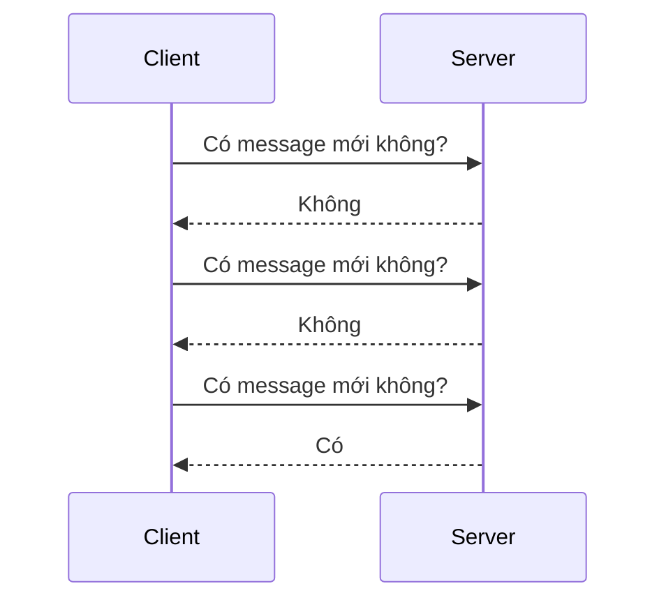

Ví dụ browser poll mỗi 2 giây:

```text
GET /messages
GET /messages
GET /messages
GET /messages
...
```

Vấn đề:

```text
rất nhiều request vô ích
+
HTTP header overhead
+
latency phụ thuộc polling interval
```

Nếu message xuất hiện ngay sau lần poll:

```text
t = 0s  poll
t = 0.1s message arrives
t = 2s  next poll
```

User phải đợi gần:

```text
1.9 seconds
```

---

# 2. WebSocket giải quyết bài toán thế nào?

Thay vì hỏi liên tục:

```text
Client → Server
Client → Server
Client → Server
```

ta tạo một connection lâu dài:

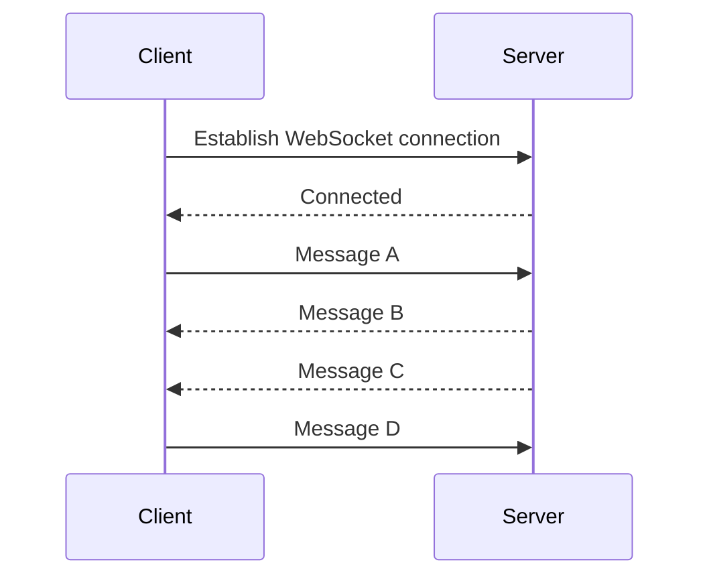

Sau khi connection established:

```text
Client có thể gửi → Server

Server có thể gửi → Client
```

bất cứ lúc nào.

Đây gọi là:

```text
Full-duplex communication
```

---

# 3. HTTP vs WebSocket

Mental model:

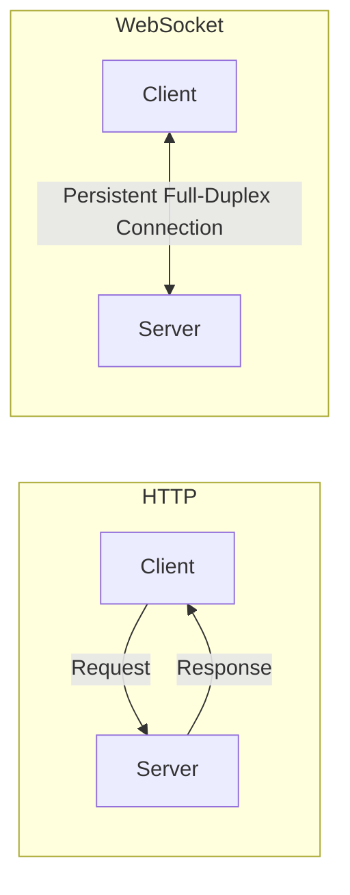

So sánh:

| HTTP                                   | WebSocket                      |
| -------------------------------------- | ------------------------------ |
| Request-response                       | Full-duplex                    |
| Client thường initiate                 | Hai bên đều gửi                |
| Connection có thể ngắn hoặc keep-alive | Connection lâu dài             |
| Stateless-oriented interaction         | Stateful connection            |
| REST API                               | Chat/realtime/game/live update |

---

# 4. WebSocket chạy trên gì?

Mental stack:

```text
Application
   ↓
WebSocket
   ↓
TCP
   ↓
IP
```

Nếu encrypted:

```text
Application
   ↓
WebSocket
   ↓
TLS
   ↓
TCP
   ↓
IP
```

URL:

```text
ws://example.com/socket
```

Encrypted:

```text
wss://example.com/socket
```

Production nên dùng:

```text
wss://
```

giống như:

```text
https://
```

đối với HTTP.

---

# 5. WebSocket connection lifecycle

Toàn bộ lifecycle:

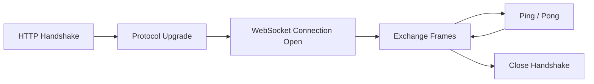

Ta sẽ phân tích từng phần.

---

# 6. WebSocket Handshake

WebSocket không bắt đầu trực tiếp bằng binary protocol.

Client trước tiên gửi một HTTP request:

```http
GET /chat HTTP/1.1
Host: example.com
Upgrade: websocket
Connection: Upgrade
Sec-WebSocket-Key: dGhlIHNhbXBsZSBub25jZQ==
Sec-WebSocket-Version: 13
```

Server trả:

```http
HTTP/1.1 101 Switching Protocols
Upgrade: websocket
Connection: Upgrade
Sec-WebSocket-Accept: ...
```

Status:

```text
101 Switching Protocols
```

có nghĩa:

> Server đồng ý chuyển connection từ HTTP sang WebSocket.

---

# 7. Handshake flow

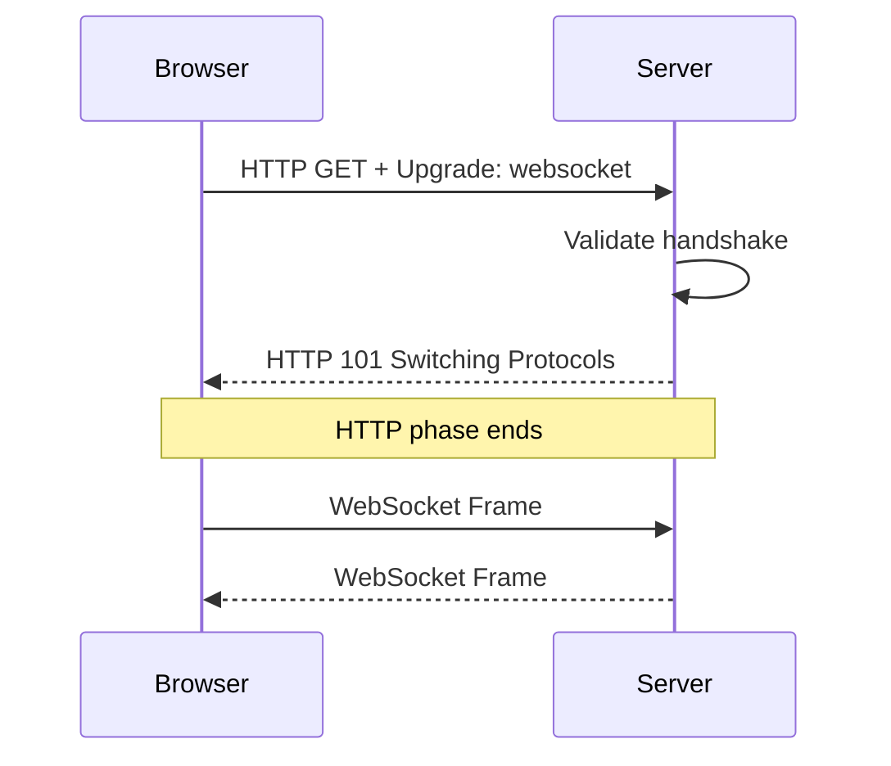

Sau:

```text
101 Switching Protocols
```

connection không còn hoạt động theo normal HTTP request-response nữa.

---

# 8. `Sec-WebSocket-Key` dùng để làm gì?

Client gửi:

```text
Sec-WebSocket-Key
```

Server:

```text
key
+
magic GUID
↓
SHA-1
↓
Base64
↓
Sec-WebSocket-Accept
```

Conceptually:

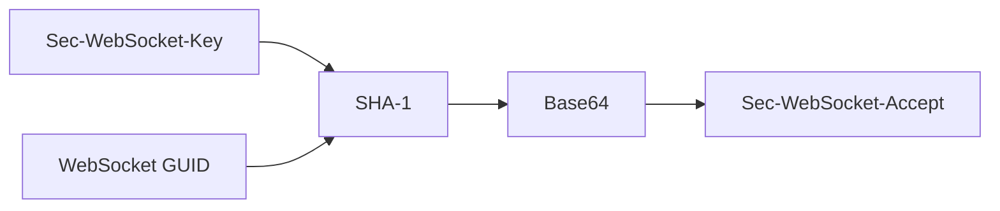

Nó giúp xác nhận server thực sự hiểu WebSocket handshake, thay vì một HTTP endpoint bình thường vô tình trả response.

Nó **không phải authentication mechanism**.

---

# 9. WebSocket là persistent connection

Sau handshake:

```text
Client
  |
  |
  |
  |
  |
Server
```

connection có thể tồn tại:

```text
minutes
hours
```

thay vì:

```text
request
response
done
```

Điều này tạo ra một thay đổi architecture quan trọng:

> Server phải quản lý **connection state**.

Ví dụ:

```text
user 100
→ connected through socket abc

user 200
→ connected through socket xyz
```

---

# 10. WebSocket Frame

Sau handshake, dữ liệu được truyền dưới dạng:

```text
WebSocket Frame
```

không phải HTTP request.

Một frame conceptually:

```text
+--------------------------------+
| FIN | RSV | OPCODE             |
+--------------------------------+
| MASK | Payload Length          |
+--------------------------------+
| Optional Masking Key           |
+--------------------------------+
| Payload                        |
+--------------------------------+
```

Có các loại frame quan trọng:

```text
Text
Binary
Continuation
Ping
Pong
Close
```

---

# 11. Text Frame

Ví dụ server gửi:

```json
{
  "type": "CHAT_MESSAGE",
  "senderId": 100,
  "message": "Hello"
}
```

WebSocket transport nhận:

```text
Text Frame
```

Application layer có thể serialize bằng:

```text
JSON
```

Nhưng WebSocket bản thân **không định nghĩa JSON schema**.

Đây là distinction quan trọng:

```text
WebSocket
→ transport/protocol

JSON
→ application payload format
```

---

# 12. Binary Frame

Thay vì JSON:

```text
Text
```

có thể gửi:

```text
Binary
```

Ví dụ:

```text
Protobuf
MessagePack
custom binary protocol
audio
game state
```

Binary có thể tiết kiệm:

```text
bandwidth
serialization cost
```

nhưng khó debug hơn JSON.

---

# 13. Message fragmentation

Một message lớn có thể được chia:

```text
Frame 1
Frame 2
Frame 3
```

Ví dụ:

```text
Message = 3 MB
```

không nhất thiết truyền dưới một frame duy nhất.

Concept:

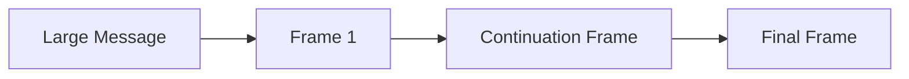

Field:

```text
FIN
```

cho biết frame cuối của message hay chưa.

---

# 14. Client masking

Một protocol detail thường được hỏi sâu:

```text
Client → Server
```

WebSocket frame phải được masked.

```text
Server → Client
```

không mask theo cùng rule đó.

Client gửi:

```text
payload
+
masking key
```

Server unmask payload trước khi xử lý.

Điểm này chủ yếu liên quan tới protocol/security design, không phải encryption.

Encryption vẫn phải dựa vào:

```text
TLS / wss
```

---

# 15. Ping / Pong

Connection lâu dài tạo một vấn đề:

```text
Client vẫn còn sống không?
```

Có thể:

```text
Wi-Fi mất
mobile switching network
router timeout
client crash
NAT removes connection
```

Server không phải lúc nào cũng biết ngay.

WebSocket có:

```text
Ping
Pong
```

Flow:

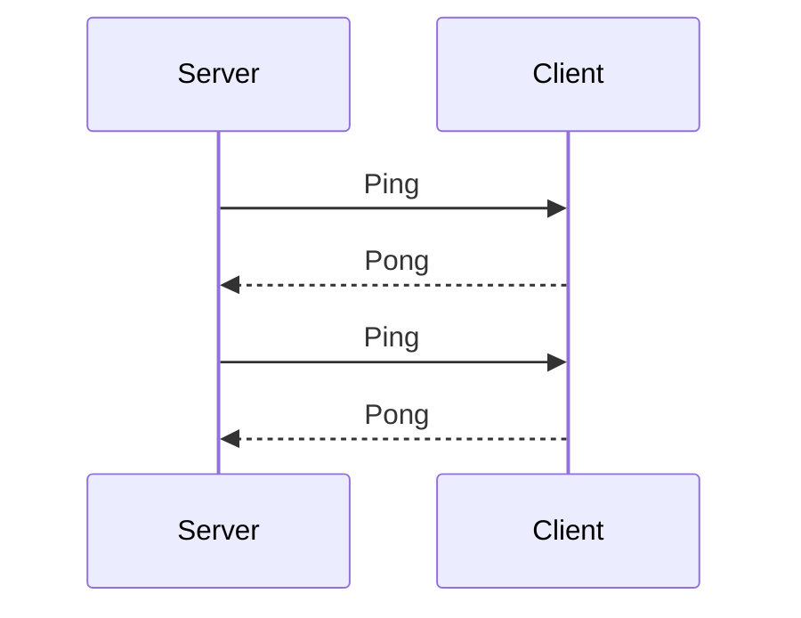

Nếu:

```text
Ping
↓
timeout
↓
no Pong
```

server có thể xem client disconnected.

---

# 16. Heartbeat

Application cũng có thể implement heartbeat riêng:

```json
{
  "type": "PING"
}
```

Client:

```json
{
  "type": "PONG"
}
```

Conceptually:

```text
Every 30s:
    send heartbeat

No heartbeat response for 60s:
    consider disconnected
```

Heartbeat đặc biệt quan trọng với:

```text
load balancers
reverse proxies
NAT
mobile networks
```

vì idle connection có thể bị đóng.

---

# 17. Connection Close

Close lý tưởng cũng có handshake:

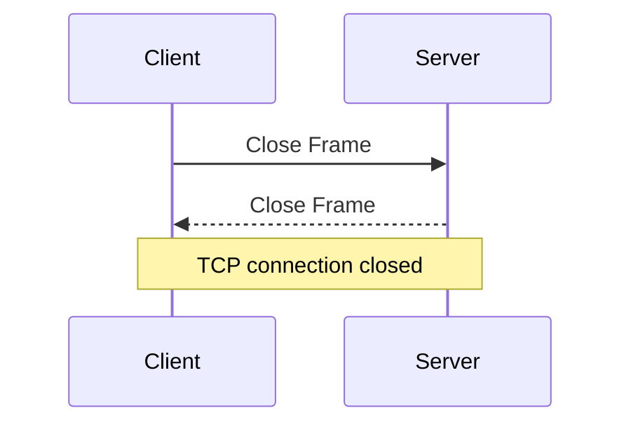

Close frame có thể chứa:

```text
close code
reason
```

Ví dụ:

```text
1000
Normal Closure
```

---

# 18. WebSocket server phải quản lý connection

REST:

```text
request
↓
handle
↓
response
↓
finished
```

WebSocket:

```text
connect
↓
register connection
↓
keep connection
↓
receive messages
↓
push messages
↓
disconnect
↓
cleanup
```

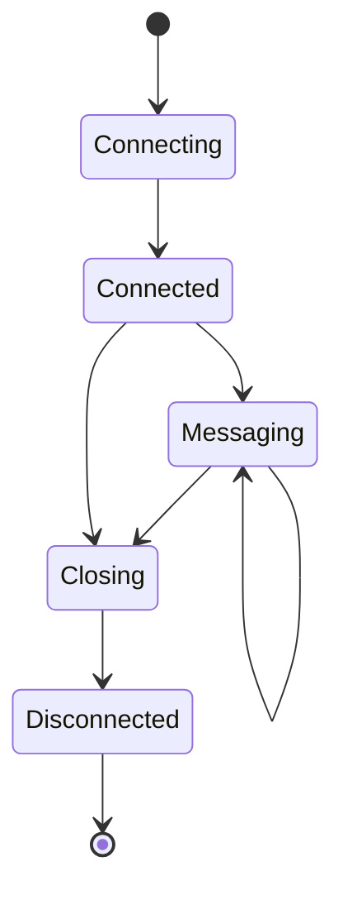

---

# 19. Chat application basic architecture

Ví dụ đơn giản:

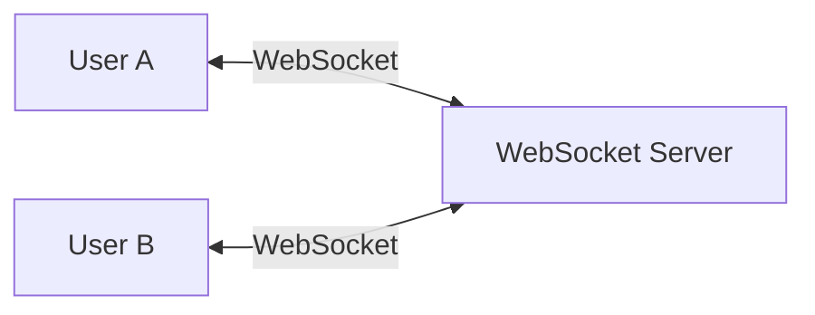

User A gửi:

```json
{
  "to": "B",
  "message": "Hello"
}
```

Server lookup:

```text
user B
→ socket B
```

sau đó:

```text
socketB.send(...)
```

---

# 20. Server connection registry

Server có thể conceptually giữ:

```text
Map<UserId, Connection>
```

Ví dụ:

```text
100 → Socket A

200 → Socket B

300 → Socket C
```

Flow:

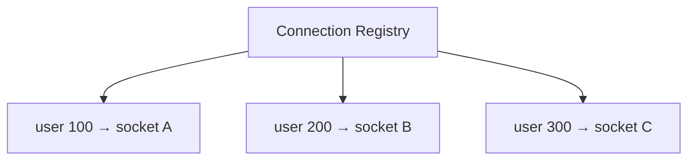

Nếu User 100 disconnect:

```text
remove:
100 → socket A
```

---

# 21. Một user có thể có nhiều connections

User có thể mở:

```text
Laptop
Phone
Browser tab 1
Browser tab 2
```

Do đó mapping tốt hơn:

```text
UserId
→ Set<Connection>
```

Ví dụ:

```text
100
 ├── socket A
 ├── socket B
 └── socket C
```

Nếu gửi notification cho user 100:

```text
broadcast to all active devices
```

hoặc chọn policy:

```text
latest device only
```

---

# 22. Authentication trong WebSocket

Một hiểu nhầm:

> WebSocket không thể authentication vì sau handshake không có HTTP.

Authentication thường xảy ra **trong handshake** hoặc application protocol sau connect.

Ví dụ client có:

```text
JWT
```

Handshake request có thể dựa vào:

```text
Cookie
Authorization context
query token
subprotocol-specific authentication
```

Tùy environment/library.

Concept:

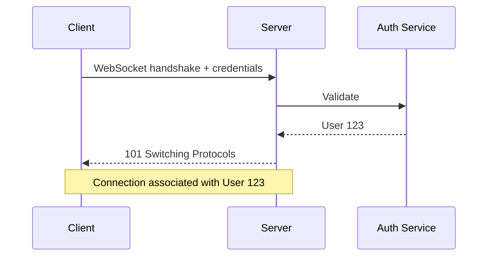

---

# 23. Authentication khác Authorization

Authenticated user:

```text
User 123
```

không có nghĩa user đó được subscribe:

```text
/admin/private-events
```

Mỗi message/action vẫn phải kiểm tra:

```text
Authorization
```

Ví dụ:

```text
User 123
→ SEND message to room 10
```

Server phải hỏi:

```text
Is User 123 member of room 10?
```

Không nên tin field client gửi:

```json
{
  "userId": 999
}
```

Client có thể giả mạo.

Identity nên lấy từ authenticated connection context.

---

# 24. Origin validation

Browser có Same-Origin Policy cho nhiều loại request, nhưng WebSocket security có những đặc thù riêng.

Server nên kiểm tra:

```text
Origin
```

khi phù hợp.

Nếu dùng cookie-based authentication mà không kiểm soát origin tốt, có thể xuất hiện:

```text
Cross-Site WebSocket Hijacking
```

Do đó WebSocket security phải xem:

```text
TLS
Authentication
Authorization
Origin validation
Input validation
Rate limiting
Message size limits
```

---

# 25. WebSocket không tự định nghĩa application protocol

Đây là điểm cực kỳ quan trọng.

WebSocket chỉ cho bạn:

```text
send bytes/messages
```

Bạn vẫn phải định nghĩa:

```text
message type
payload
correlation ID
error model
acknowledgement
version
```

Ví dụ application protocol:

```json
{
  "type": "SEND_MESSAGE",
  "requestId": "abc-123",
  "payload": {
    "roomId": 10,
    "content": "Hello"
  }
}
```

Response:

```json
{
  "type": "MESSAGE_ACK",
  "requestId": "abc-123",
  "messageId": 999
}
```

---

# 26. Nên có envelope message

Thay vì mỗi event một format hoàn toàn khác:

```json
{
  "type": "...",
  "version": 1,
  "id": "...",
  "timestamp": "...",
  "payload": {}
}
```

Mental model:

```text
Envelope
├── type
├── version
├── messageId
├── timestamp
└── payload
```

Điều này hỗ trợ:

```text
routing
schema evolution
debugging
tracing
deduplication
```

---

# 27. Request-response vẫn có thể tồn tại trên WebSocket

WebSocket không bắt buộc chỉ dùng push.

Client có thể:

```json
{
  "type": "GET_PROFILE",
  "requestId": "req-1"
}
```

Server:

```json
{
  "type": "PROFILE_RESPONSE",
  "requestId": "req-1",
  "payload": {}
}
```

`requestId` giúp correlate:

```text
request
↔
response
```

Nhưng nếu ứng dụng hầu hết là request-response truyền thống:

> REST thường đơn giản hơn.

Không nên dùng WebSocket chỉ vì “nhanh hơn”.

---

# 28. WebSocket vs Polling

Polling:

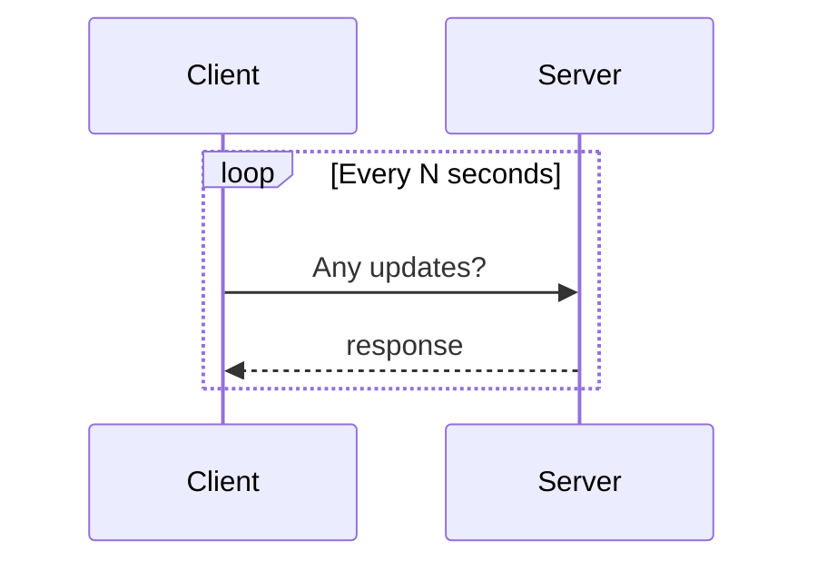

WebSocket:

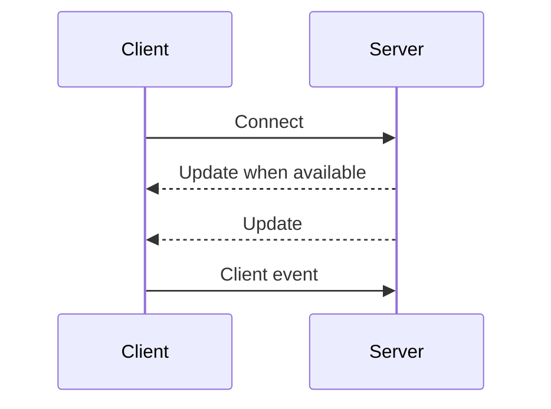

WebSocket đặc biệt tốt khi:

```text
updates frequent
+
low latency required
+
bidirectional communication
```

---

# 29. WebSocket vs Long Polling

Long polling:

```text
Client sends request
↓
Server waits
↓
event occurs
↓
Server returns
↓
Client opens new request
```

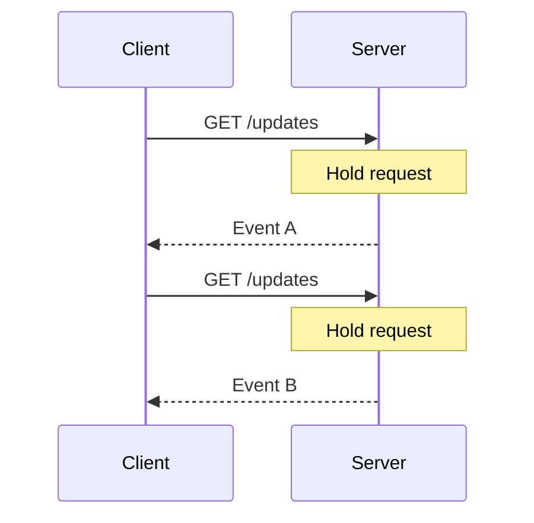

Ưu điểm:

```text
works over ordinary HTTP infrastructure
```

Nhưng:

```text
repeated HTTP requests
connection churn
less natural bidirectional communication
```

---

# 30. WebSocket vs Server-Sent Events

SSE:

```text
Server → Client
```

one-way realtime stream.

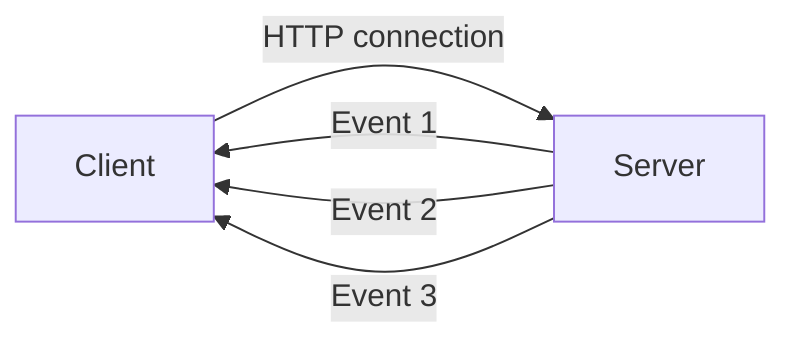

WebSocket:

```text
Client ↔ Server
```

Comparison:

| SSE                                            | WebSocket                  |
| ---------------------------------------------- | -------------------------- |
| Server → Client                                | Bidirectional              |
| Text events                                    | Text + Binary              |
| HTTP-based                                     | WebSocket protocol         |
| Built-in reconnection/event IDs are convenient | App manages more lifecycle |
| Notifications/feed                             | Chat/game/collaboration    |

Nếu requirement chỉ:

```text
server pushes status updates
```

SSE đôi khi đơn giản hơn WebSocket.

---

# 31. WebSocket vs REST

Một system tốt thường dùng cả hai.

Ví dụ chat app:

```text
REST:
GET /conversations
GET /messages/history
POST /attachments

WebSocket:
new message
typing indicator
presence update
read receipt
```

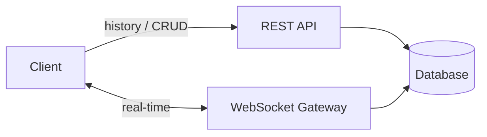

Không cần biến tất cả API thành WebSocket.

---

# 32. Ordering

WebSocket dựa trên TCP nên bytes trong **một connection** có ordering.

Nếu client gửi:

```text
A
B
C
```

connection transport duy trì sequence.

Nhưng distributed system có thể phá business ordering sau khi message đi qua backend.

Ví dụ:

```text
Socket Server
    ↓
Kafka
    ↓
Worker A / Worker B
```

M1 và M2 có thể xử lý song song.

Do đó:

> WebSocket transport ordering không đồng nghĩa end-to-end business ordering.

---

# 33. Delivery guarantee

Một WebSocket `send()` thành công không nhất thiết có nghĩa:

```text
business operation persisted successfully
```

Ví dụ:

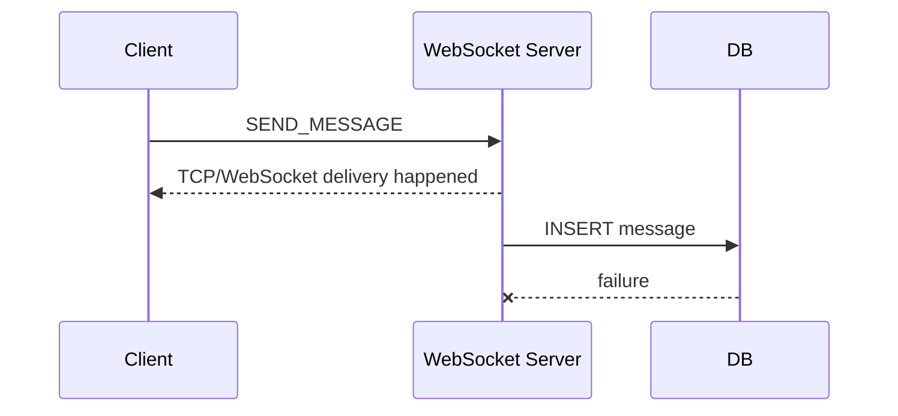

Nếu cần business guarantee, application protocol nên có:

```text
ACK
```

Ví dụ:

```text
Client:
messageId=temp-123

Server:
ACK temp-123
→ persisted as message 999
```

---

# 34. Application ACK

Flow:

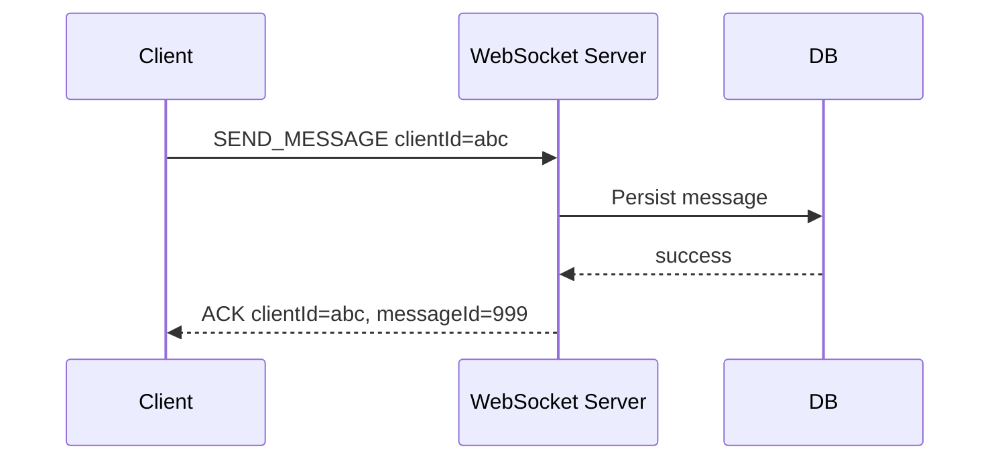

Nếu connection chết trước ACK:

```text
Client không biết:

message persisted?
hay chưa?
```

Client có thể retry.

Nhưng retry tạo duplicate risk.

---

# 35. Idempotency

Client gửi:

```text
clientMessageId = abc
```

Server database có unique constraint:

```text
UNIQUE(sender_id, client_message_id)
```

Nếu retry:

```text
abc
abc
```

server biết đây là cùng logical message.

Flow:

```mermaid
flowchart TD
    A[Receive Message]

    B{clientMessageId exists?}

    C[Return existing ACK]

    D[Persist]

    E[Return new ACK]

    A --> B

    B -->|Yes| C
    B -->|No| D --> E
```

Đây là pattern rất quan trọng trong reliable realtime systems.

---

# 36. Reconnection

WebSocket connection chắc chắn sẽ chết vào một thời điểm nào đó.

Lý do:

```text
network switch
mobile sleep
server restart
deployment
load balancer timeout
Wi-Fi failure
```

Client phải có reconnect strategy.

Không nên:

```text
disconnect
↓
retry instantly forever
```

vì khi server outage:

```text
1 million clients
↓
1 million immediate reconnects
```

→ reconnect storm.

---

# 37. Exponential Backoff

Better:

```text
attempt 1 → 1s
attempt 2 → 2s
attempt 3 → 4s
attempt 4 → 8s
...
```

thêm:

```text
jitter
```

Ví dụ:

```text
8s ± random
```

Flow:

```mermaid
flowchart TD
    D[Disconnected]

    R[Try reconnect]

    S{Success?}

    C[Connected]

    B[Increase backoff + jitter]

    D --> R --> S

    S -->|Yes| C
    S -->|No| B --> R
```

Jitter giúp tránh hàng triệu client reconnect cùng thời điểm.

---

# 38. Reconnect tạo vấn đề lost events

Giả sử:

```text
10:00:01 connection dies

10:00:02 event A
10:00:03 event B

10:00:05 reconnect
```

Client không nhận A/B qua socket cũ.

Do đó realtime architecture cần nghĩ:

> Realtime transport khác durable event history.

Một solution:

```text
WebSocket
+
lastEventId / sequence number
+
REST/event log sync
```

Flow:

```mermaid
sequenceDiagram
    participant C as Client
    participant S as Server

    Note over C,S: Connection lost after event 100

    C->>S: Reconnect, lastSeen=100

    S-->>C: Event 101
    S-->>C: Event 102
    S-->>C: Live events...
```

---

# 39. Presence system

Ta muốn hiển thị:

```text
Quan is online
```

Naive:

```text
socket connected
→ ONLINE

socket disconnected
→ OFFLINE
```

Nhưng user có:

```text
phone
laptop
browser
```

Nếu laptop disconnect nhưng phone vẫn online:

```text
user vẫn ONLINE
```

Do đó cần track:

```text
User
→ active connection count
```

Ví dụ:

```text
user 100
connections = 3

one disconnect
→ 2

still ONLINE

last disconnect
→ 0

OFFLINE
```

---

# 40. Typing indicator

Typing indicator là ví dụ điển hình của ephemeral realtime state:

```text
User A is typing...
```

Không cần:

```text
persist forever in database
```

Flow:

```mermaid
sequenceDiagram
    participant A as User A
    participant WS as WebSocket
    participant B as User B

    A->>WS: TYPING_START room=10

    WS-->>B: User A typing

    A->>WS: TYPING_STOP

    WS-->>B: User A stopped typing
```

Những event kiểu này rất hợp WebSocket.

---

# 41. Read Receipt

Ví dụ:

```text
SENT
DELIVERED
READ
```

Flow:

```mermaid
sequenceDiagram
    participant A as User A
    participant S as Server
    participant B as User B

    A->>S: Message M

    S-->>A: SENT

    S-->>B: Message M

    B->>S: DELIVERY_ACK M

    S-->>A: DELIVERED

    B->>S: READ M

    S-->>A: READ
```

Đây là application semantics, không phải WebSocket protocol tự cung cấp.

---

# 42. Một server là đơn giản

Giả sử:

```text
User A socket
        \
         Server
        /
User B socket
```

Connection registry:

```text
A → socket A
B → socket B
```

A gửi B:

```text
lookup B
↓
socket B.send()
```

Rất đơn giản.

---

# 43. Nhưng multiple WebSocket servers tạo vấn đề

Production:

```mermaid
flowchart TD
    LB[Load Balancer]

    S1[WebSocket Server 1]
    S2[WebSocket Server 2]
    S3[WebSocket Server 3]

    LB --> S1
    LB --> S2
    LB --> S3
```

User A:

```text
Server 1
```

User B:

```text
Server 3
```

A gửi B.

Server 1 không có:

```text
socket B
```

vì connection B nằm Server 3.

Đây là distributed connection routing problem.

---

# 44. Solution: shared Pub/Sub backbone

Architecture:

```mermaid
flowchart TD
    A[User A]

    B[User B]

    S1[WS Server 1]

    S2[WS Server 2]

    Redis[(Redis Pub/Sub)]

    A <-->|WS| S1
    B <-->|WS| S2

    S1 --> Redis
    Redis --> S2
```

Flow:

```text
A sends message

↓
Server 1

↓
Redis publish

↓
Server 2 receives

↓
Socket B

↓
User B
```

---

# 45. Redis Pub/Sub architecture

More complete:

```mermaid
sequenceDiagram
    participant A as User A
    participant S1 as WS Server 1
    participant R as Redis Pub/Sub
    participant S2 as WS Server 2
    participant B as User B

    A->>S1: SEND_MESSAGE to B

    S1->>R: Publish event for B

    R-->>S2: Event

    S2-->>B: WebSocket push
```

Redis Pub/Sub phù hợp với:

```text
ephemeral realtime fanout
```

nhưng không durable.

Nếu consumer/server offline:

```text
event có thể bị miss
```

---

# 46. Kafka + WebSocket

Nếu cần durable event backbone:

```mermaid
flowchart LR
    Services[Backend Services]

    Kafka[(Kafka)]

    W1[WebSocket Gateway 1]
    W2[WebSocket Gateway 2]

    Clients[Clients]

    Services --> Kafka

    Kafka --> W1
    Kafka --> W2

    W1 --> Clients
    W2 --> Clients
```

Ví dụ:

```text
Payment Service
→ PaymentCompleted
→ Kafka
→ Notification/WebSocket layer
→ Browser
```

Kafka tốt cho:

```text
durability
replay
event processing
```

WebSocket tốt cho:

```text
last-mile realtime delivery to client
```

Hai thứ solve hai problem khác nhau.

---

# 47. Không nên coi Kafka là WebSocket replacement

Kafka:

```text
service ↔ infrastructure ↔ service
```

WebSocket:

```text
client ↔ realtime server
```

Typical architecture:

```mermaid
flowchart LR
    Browser

    WS[WebSocket Gateway]

    Kafka[(Kafka)]

    Backend[Backend Services]

    DB[(Database)]

    Browser <-->|Realtime| WS

    WS <--> Kafka

    Backend <--> Kafka

    Backend --> DB
```

---

# 48. Sticky Session

Load balancer có thể dùng:

```text
sticky session
```

để cùng client quay lại một server.

Nhưng WebSocket connection vốn đã persistent:

```text
connection established
→ LB routes packets of that connection to same backend
```

Sticky sessions hữu ích hơn trong reconnect/session architecture tùy design.

Nhưng:

> Sticky session không giải quyết cross-server messaging.

Nếu A ở Server 1 và B ở Server 2, vẫn cần communication giữa servers.

---

# 49. WebSocket Load Balancer

Architecture:

```mermaid
flowchart TD
    Clients[Many Clients]

    LB[Load Balancer]

    WS1[WS Server 1]
    WS2[WS Server 2]
    WS3[WS Server 3]

    Clients --> LB

    LB --> WS1
    LB --> WS2
    LB --> WS3
```

Load balancer phải hỗ trợ:

```text
WebSocket upgrade
long-lived connections
appropriate idle timeout
```

Nếu timeout 60s nhưng connection idle 2 phút:

```text
LB closes socket
```

Heartbeat có thể giúp giữ connection active tùy infrastructure.

---

# 50. Connection count scaling

REST server thường nghĩ:

```text
requests / second
```

WebSocket server còn phải nghĩ:

```text
concurrent connections
```

Ví dụ:

```text
500,000 connected users
```

Mỗi connection tiêu thụ:

```text
socket descriptor
kernel buffer
application metadata
TLS state
possibly user/session state
```

Do đó WebSocket capacity planning khác REST.

---

# 51. File descriptor limit

Mỗi TCP connection thường cần file descriptor.

Nếu OS limit:

```text
ulimit -n = 1024
```

thì server không thể magically giữ:

```text
100k sockets
```

Cần tune:

```text
file descriptor limits
network stack
connection backlog
memory buffers
```

Ở large-scale realtime system, OS/network tuning quan trọng không kém application code.

---

# 52. Thread-per-connection là vấn đề

Naive:

```text
1 WebSocket connection
=
1 thread
```

Nếu:

```text
100,000 connections
```

thì:

```text
100,000 threads
```

không thực tế với traditional heavyweight OS thread architecture.

Do đó WebSocket server thường dựa trên:

```text
non-blocking I/O
event loop
reactive networking
```

Ví dụ:

```text
Netty
Node.js
Vert.x
Spring WebFlux
```

---

# 53. Event loop model

Concept:

```mermaid
flowchart TD
    C1[Connection 1]
    C2[Connection 2]
    C3[Connection 3]
    C4[Connection N]

    EL[Event Loop]

    H[Message Handlers]

    C1 --> EL
    C2 --> EL
    C3 --> EL
    C4 --> EL

    EL --> H
```

Không cần một blocked thread cho từng idle connection.

Điều này giống tư tưởng:

```text
handle many mostly-idle network connections efficiently
```

---

# 54. Nhưng đừng block event loop

Giả sử:

```text
WebSocket event loop
```

nhận message.

Handler làm:

```text
slow database query 5 seconds
```

Nếu chạy trực tiếp trên event-loop thread:

```text
other connections may suffer
```

Do đó architecture thường:

```mermaid
flowchart LR
    Socket[Socket Event]

    EL[Event Loop]

    Worker[Worker Pool / Async Service]

    DB[(Database)]

    Socket --> EL

    EL --> Worker

    Worker --> DB
```

Event loop nên xử lý lightweight network orchestration, không nên thực hiện blocking work kéo dài.

---

# 55. Backpressure

Đây là production problem rất quan trọng.

Giả sử server produce updates:

```text
10,000 messages/s
```

client chỉ đọc được:

```text
100 messages/s
```

Queue của connection:

```text
100
200
1000
10000
100000
```

Memory tăng.

```mermaid
flowchart LR
    Producer[Server Event Producer<br/>10k msg/s]

    Q[Outbound Queue]

    Client[Slow Client<br/>100 msg/s]

    Producer --> Q --> Client
```

Đây là:

```text
slow consumer problem
```

---

# 56. Backpressure strategies

Không thể buffer vô hạn.

Tùy semantics có thể:

```text
drop old updates
drop newest
disconnect slow client
coalesce updates
limit queue size
sample/throttle events
persist and let client catch up later
```

Ví dụ stock price:

```text
price:
100
101
102
103
104
```

Client chậm.

Có thể không cần gửi cả 5.

Chỉ cần:

```text
latest = 104
```

đây gọi là:

```text
coalescing
```

---

# 57. Chat không thể drop giống stock ticker

Stock UI:

```text
100
101
102
103
```

có thể chỉ cần latest.

Chat:

```text
Message A
Message B
Message C
```

không được tùy tiện drop B.

Do đó backpressure policy phụ thuộc:

```text
business semantics
```

Đây là kiểu trade-off interviewer rất thích.

---

# 58. Slow Client

Server phải monitor:

```text
outbound queue length
send latency
client ack lag
heartbeat
```

Nếu một client quá chậm:

```text
disconnect
```

có thể tốt hơn để nó consume hết memory server.

Client reconnect rồi:

```text
sync missed events
```

từ durable storage.

---

# 59. Broadcast problem

Ví dụ:

```text
Live football score update
```

có:

```text
1 million connected clients
```

Server nhận một event:

```text
GOAL
```

phải fan-out:

```text
1 event
→ 1,000,000 deliveries
```

Đây gọi là:

```text
fan-out amplification
```

Backend workload:

```text
incoming event rate
```

có thể nhỏ nhưng:

```text
outbound message rate
```

rất lớn.

---

# 60. Room / Topic subscription

Chat app thường có rooms:

```text
room:10

user A
user B
user C
```

Connection registry có thể maintain:

```text
roomId
→ connections
```

```mermaid
flowchart TD
    Room[Room 10]

    A[Socket A]
    B[Socket B]
    C[Socket C]

    Room --> A
    Room --> B
    Room --> C
```

Message room 10:

```text
fanout to A/B/C
```

---

# 61. Subscribe model

Client có thể gửi:

```json
{
  "type": "SUBSCRIBE",
  "topic": "orders/123"
}
```

Nhưng server phải authorize:

```text
Can this user see order 123?
```

Không được tin:

```text
client subscription request
```

một cách mù quáng.

---

# 62. STOMP là gì?

Spring ecosystem thường gặp:

```text
WebSocket + STOMP
```

WebSocket chỉ nói:

```text
how to transfer frames
```

STOMP cung cấp messaging semantics như:

```text
CONNECT
SEND
SUBSCRIBE
MESSAGE
ACK
DISCONNECT
```

Mental model:

```text
Application
   ↓
STOMP
   ↓
WebSocket
   ↓
TCP
```

---

# 63. WebSocket raw vs STOMP

Raw WebSocket:

```json
{
  "type": "SEND_MESSAGE",
  "roomId": 10
}
```

Bạn tự define protocol.

STOMP:

```text
SEND
destination:/app/chat
content-type:application/json

{...}
```

Subscription:

```text
SUBSCRIBE
destination:/topic/room/10
```

STOMP tiện cho:

```text
pub/sub semantics
routing
Spring messaging abstraction
```

nhưng có additional protocol overhead.

---

# 64. Spring Boot WebSocket + STOMP architecture

Một architecture phổ biến:

```mermaid
flowchart LR
    Browser

    WS[Spring WebSocket Endpoint]

    Controller[@MessageMapping]

    Broker[Message Broker]

    Subscribers[Subscribers]

    Browser --> WS
    WS --> Controller

    Controller --> Broker
    Broker --> WS
    WS --> Browser
```

Ví dụ client gửi:

```text
/app/chat.send
```

Spring:

```java
@MessageMapping("/chat.send")
public void send(ChatMessage message) {
}
```

Server broadcast:

```text
/topic/room/10
```

---

# 65. Spring Boot configuration cơ bản

Ví dụ:

```java
@Configuration
@EnableWebSocketMessageBroker
public class WebSocketConfig
        implements WebSocketMessageBrokerConfigurer {

    @Override
    public void configureMessageBroker(
            MessageBrokerRegistry registry) {

        registry.enableSimpleBroker("/topic");

        registry.setApplicationDestinationPrefixes("/app");
    }

    @Override
    public void registerStompEndpoints(
            StompEndpointRegistry registry) {

        registry.addEndpoint("/ws");
    }
}
```

Mental routing:

```text
Client SEND
/app/chat
      ↓
@MessageMapping("/chat")
      ↓
Server
      ↓
/topic/room/10
      ↓
Subscribers
```

---

# 66. Spring message flow

```mermaid
sequenceDiagram
    participant A as User A
    participant WS as Spring WebSocket
    participant C as ChatController
    participant Broker as Message Broker
    participant B as User B

    A->>WS: SEND /app/chat

    WS->>C: @MessageMapping

    C->>Broker: publish /topic/room/10

    Broker->>WS: fanout

    WS-->>B: MESSAGE
```

---

# 67. Simple Broker limitation

Spring:

```java
enableSimpleBroker(...)
```

phù hợp:

```text
development
small/simple deployment
```

Nhưng multiple application instances tạo distributed routing problem.

Production có thể dùng external broker hoặc tự thiết kế:

```text
Redis
RabbitMQ
Kafka
```

tùy semantics.

---

# 68. Multi-instance Spring architecture

```mermaid
flowchart TD
    LB[Load Balancer]

    S1[Spring WS Instance 1]
    S2[Spring WS Instance 2]

    Broker[(Redis / Message Broker)]

    A[User A]
    B[User B]

    A --> LB --> S1
    B --> LB --> S2

    S1 <--> Broker
    S2 <--> Broker
```

Bây giờ message từ S1 có thể reach connection tại S2.

---

# 69. WebSocket Gateway pattern

Large system thường tách realtime layer:

```mermaid
flowchart LR
    Clients[Clients]

    Gateway[WebSocket Gateway]

    Kafka[(Kafka)]

    Chat[Chat Service]

    Notification[Notification Service]

    Presence[Presence Service]

    Clients <-->|WS| Gateway

    Gateway <--> Kafka

    Chat <--> Kafka
    Notification <--> Kafka
    Presence <--> Kafka
```

Gateway chịu trách nhiệm:

```text
connections
authentication context
subscriptions
heartbeats
fan-out
backpressure
```

Business services không cần tự quản hàng triệu sockets.

---

# 70. WebSocket + REST + Kafka architecture

Một architecture khá production-like:

```mermaid
flowchart TD
    Client[Browser / Mobile]

    API[API Gateway / REST]

    WS[WebSocket Gateway]

    Services[Backend Services]

    Kafka[(Kafka)]

    DB[(Database)]

    Redis[(Redis)]

    Client -->|CRUD / history| API

    Client <-->|Realtime| WS

    API --> Services

    Services --> DB

    Services <--> Kafka

    Kafka <--> WS

    WS <--> Redis
```

Roles:

```text
REST
→ request-response

WebSocket
→ realtime client delivery

Kafka
→ durable backend events

Redis
→ presence / ephemeral routing / cache
```

---

# 71. Redis connection registry

Nếu nhiều WebSocket instances, ta có thể dùng Redis để lưu:

```text
userId
→ serverId
```

Ví dụ:

```text
user:100
→ ws-server-3
```

Nếu message đến user 100:

```text
lookup Redis
↓
server 3
↓
route event
```

Nhưng phải xử lý:

```text
stale mapping
disconnect cleanup
TTL
multiple devices
server crash
```

---

# 72. Presence + TTL

Một pattern:

```text
presence:user:100
TTL = 60s
```

Connection/server refresh periodically.

Nếu server crash:

```text
không cleanup được
```

nhưng TTL eventually expires.

Đây là một ví dụ:

```text
lease-based presence
```

---

# 73. Message persistence

Chat message không nên chỉ:

```text
A → WebSocket → B
```

Nếu B offline:

```text
message lost
```

Better:

```mermaid
sequenceDiagram
    participant A as Sender
    participant WS as WebSocket Server
    participant DB as Database
    participant B as Receiver

    A->>WS: Send message

    WS->>DB: Persist

    DB-->>WS: success

    WS-->>A: ACK

    alt B online
        WS-->>B: Push message
    else B offline
        Note over WS,B: Delivered after reconnect/history sync
    end
```

Persistent business state nên tồn tại ngoài socket connection.

---

# 74. Source of truth

Một nguyên tắc rất quan trọng:

```text
WebSocket connection
≠
source of truth
```

Ví dụ chat:

```text
Database
→ source of truth for messages

WebSocket
→ realtime transport
```

Presence:

```text
Redis
→ transient state
```

Notifications:

```text
Database/Kafka
→ durable state/event

WebSocket
→ immediate push
```

---

# 75. Connection != User Session

Connection có thể:

```text
drop
reconnect
move server
```

Do đó business session không nên phụ thuộc tuyệt đối vào:

```text
socket object
```

Identity nên reconstruct từ:

```text
token/session
```

sau reconnect.

---

# 76. Re-authentication

JWT có thể expire trong khi WebSocket vẫn mở.

Ví dụ:

```text
JWT valid = 15 min
socket alive = 3 hours
```

Question:

```text
Sau 15 phút connection có còn authorized?
```

Đây là application policy.

Có thể:

```text
close on token expiry
refresh credentials
periodic re-authentication
short-lived connection
server-side session check
```

Không có một rule duy nhất cho mọi application.

---

# 77. Deploy và connection draining

REST deployment:

```text
stop accepting request
finish requests
shutdown
```

WebSocket:

```text
connections có thể sống hàng giờ
```

Nếu kill server trực tiếp:

```text
100k sockets disconnect
```

và reconnect cùng lúc.

Better:

```text
mark instance draining
↓
stop accepting new connections
↓
notify/close existing gradually
↓
clients reconnect with jitter
↓
shutdown
```

```mermaid
flowchart TD
    Deploy[Deployment]

    Drain[Mark Server Draining]

    StopNew[Stop New Connections]

    Move[Clients Gradually Reconnect]

    Close[Close Remaining Connections]

    Shutdown[Shutdown]

    Deploy --> Drain --> StopNew --> Move --> Close --> Shutdown
```

---

# 78. Reconnect Storm

Một server có:

```text
100,000 clients
```

crashes.

All clients:

```text
retry now!
```

Load balancer sends them to remaining servers.

Remaining servers overload.

```mermaid
flowchart TD
    Crash[Server Crash]

    Clients[100k Clients Disconnect]

    Retry[Immediate Reconnect]

    Remaining[Remaining Servers]

    Overload[Overload]

    Crash --> Clients --> Retry --> Remaining --> Overload
```

Mitigation:

```text
exponential backoff
jitter
capacity headroom
gradual draining
rate limiting
```

---

# 79. Message Size Limit

Never accept unlimited:

```text
WebSocket payload size
```

Attacker có thể gửi:

```text
500 MB frame
```

causing:

```text
memory pressure
CPU pressure
DoS
```

Server nên configure:

```text
max frame size
max message size
rate limit
validation
```

---

# 80. Rate Limiting

WebSocket bypasses normal per-request REST pattern after connection established.

Client có thể spam:

```text
1M messages/s
```

Do đó cần rate limiter ở:

```text
per connection
per user
per IP
per message type
```

Ví dụ:

```text
SEND_MESSAGE
→ max 20/sec

TYPING
→ max 5/sec
```

---

# 81. Security checklist

Với WebSocket production, mental model nên là:

```mermaid
flowchart TD
    Security[WebSocket Security]

    TLS[WSS / TLS]
    Auth[Authentication]
    Authorization[Authorization]
    Origin[Origin Validation]
    Validation[Payload Validation]
    Size[Message Size Limit]
    Rate[Rate Limiting]
    Logging[Audit / Logging]

    Security --> TLS
    Security --> Auth
    Security --> Authorization
    Security --> Origin
    Security --> Validation
    Security --> Size
    Security --> Rate
    Security --> Logging
```

---

# 82. Observability

WebSocket metrics khác REST.

REST thường:

```text
request latency
request count
HTTP status
```

WebSocket nên monitor thêm:

```text
active connections
connections / second
disconnect rate
reconnect rate
messages in/sec
messages out/sec
outbound queue size
message processing latency
heartbeat failures
slow consumers
authentication failures
```

Một hệ thống có:

```text
HTTP 200 healthy
```

không có nghĩa realtime layer khỏe.

---

# 83. Tracing

Một message có thể đi:

```text
Browser
↓
WebSocket Gateway
↓
Kafka
↓
Notification Service
↓
WebSocket Gateway
↓
Mobile
```

Nên có:

```text
correlationId
traceId
messageId
eventId
```

Ví dụ:

```json
{
  "messageId": "msg-123",
  "correlationId": "order-999",
  "type": "PAYMENT_UPDATED"
}
```

để trace distributed flow.

---

# 84. Error handling

Không nên chỉ:

```text
socket.close()
```

cho mọi lỗi.

Application protocol có thể định nghĩa:

```json
{
  "type": "ERROR",
  "requestId": "req-123",
  "code": "ROOM_ACCESS_DENIED",
  "message": "..."
}
```

Phân biệt:

```text
business error
protocol error
authentication error
temporary server error
fatal connection error
```

Fatal error mới cần close connection.

---

# 85. Versioning

Mobile app version cũ có thể giữ trong nhiều tháng.

Server thay schema:

```text
v1:
{
   "name": "..."
}
```

v2:

```text
{
   "displayName": "..."
}
```

có thể break client.

Do đó realtime messages cũng cần:

```text
schema evolution
```

Ví dụ envelope:

```json
{
  "type": "ORDER_UPDATED",
  "version": 2,
  "payload": {}
}
```

---

# 86. WebSocket subprotocol

Handshake có thể negotiate:

```text
Sec-WebSocket-Protocol
```

Ví dụ client:

```text
Sec-WebSocket-Protocol:
chat-v1, chat-v2
```

Server chọn:

```text
chat-v2
```

Ứng dụng có thể dùng mechanism này để negotiate application protocol.

STOMP cũng thường chạy như subprotocol trên WebSocket.

---

# 87. WebSocket trong Auction System

Ví dụ realtime auction:

```mermaid
flowchart TD
    BidderA[Bidder A]
    BidderB[Bidder B]

    WS[WebSocket Gateway]

    Auction[Auction Service]

    DB[(Database)]

    Kafka[(Kafka)]

    BidderA <-->|WebSocket| WS
    BidderB <-->|WebSocket| WS

    WS --> Auction

    Auction --> DB

    Auction --> Kafka

    Kafka --> WS
```

Bid flow:

```text
Bidder A
↓
PLACE_BID
↓
Auction Service
↓
validate
↓
persist
↓
BidAccepted
↓
Kafka
↓
WebSocket Gateway
↓
all bidders
```

Đây là một architecture rất phù hợp với auction realtime.

---

# 88. Auction bid ordering

Giả sử:

```text
A bids 100
B bids 120
C bids 110
```

Server phải xác định:

```text
canonical order
```

Không thể dựa vào thời gian client vì:

```text
network latency
clock differences
```

Source of truth phải là backend.

Ví dụ:

```text
DB transaction
or
serialized auction processor
```

WebSocket chỉ transport bid.

---

# 89. Race condition trong bidding

A và B gần đồng thời:

```text
Current price = 100

A → 110
B → 120
```

Hai WebSocket handlers chạy concurrently.

Nếu:

```text
read current 100
A validates

read current 100
B validates
```

cần synchronization tại business layer.

Có thể dùng:

```text
database locking
optimistic locking
atomic update
serialized partition processing
```

Không thể nói:

> WebSocket giữ ordering nên không có race condition.

Vì A và B là **hai connections khác nhau**.

---

# 90. WebSocket ordering chỉ trong một connection

Điểm này cực kỳ nên nhớ.

```text
Connection A:
A1
A2
A3
```

order preserved.

```text
Connection B:
B1
B2
```

Nhưng global order:

```text
A1 vs B1
```

không được WebSocket định nghĩa.

Backend phải resolve.

---

# 91. Khi nào nên dùng WebSocket?

Một mental decision:

```mermaid
flowchart TD
    Need[Need realtime updates?]

    No[Use REST]

    Direction{Need bidirectional frequent communication?}

    SSE[Consider SSE]

    WS[Consider WebSocket]

    Need -->|No| No

    Need -->|Yes| Direction

    Direction -->|Mostly server → client| SSE

    Direction -->|Both directions / interactive| WS
```

WebSocket rất phù hợp cho:

```text
Chat
Realtime auction
Multiplayer games
Collaborative editing
Trading dashboards
Live tracking
Presence
Typing indicators
Realtime notifications
```

---

# 92. Khi không nên dùng WebSocket?

Nếu workload:

```text
GET user
POST order
UPDATE address
```

không realtime:

```text
REST
```

thường đơn giản hơn.

Nếu chỉ cần:

```text
server → browser events
```

SSE có thể đơn giản hơn.

WebSocket thêm complexity:

```text
connection lifecycle
state management
reconnect
scaling
routing
heartbeat
backpressure
security
deployment draining
```

---

# 93. Câu hỏi interview: “How does WebSocket work?”

Một answer tốt:

> WebSocket provides a persistent full-duplex communication channel between a client and a server over a TCP connection. The connection normally starts with an HTTP handshake where the client requests an upgrade using the `Upgrade: websocket` header. If the server accepts, it returns `101 Switching Protocols`.
>
> After the upgrade, communication no longer follows normal HTTP request-response semantics. Both sides exchange WebSocket frames containing text, binary data, ping/pong control frames or close frames.
>
> Because the connection is long-lived, production systems also have to manage authentication, heartbeat, reconnection, connection state, backpressure and horizontal scaling.

---

# 94. Câu hỏi: “Why WebSocket instead of polling?”

Weak answer:

> WebSocket is faster.

Better:

> Polling requires the client to repeatedly request updates, which creates unnecessary requests when nothing changes and introduces latency equal to the polling interval. WebSocket keeps a persistent connection so the server can push an event immediately when it becomes available.
>
> The trade-off is that the server now has to maintain long-lived connection state and handle connection management, reconnection and horizontal routing.

---

# 95. Câu hỏi: “WebSocket vs SSE?”

Strong answer:

> SSE is primarily designed for one-way server-to-client event streaming over HTTP and is convenient when the client mostly consumes updates. WebSocket provides bidirectional communication and also supports binary messages, so it is more appropriate for highly interactive applications such as chat, gaming or realtime collaboration.
>
> If I only needed server-side notifications to a browser, I would consider SSE first because it can be simpler operationally.

---

# 96. Câu hỏi: “How do you scale WebSocket horizontally?”

Một strong answer nên nói:

```text
1. Put multiple WebSocket servers behind a load balancer.

2. Each server owns its local client connections.

3. Maintain connection/user routing information.

4. Introduce a shared messaging layer such as Redis Pub/Sub,
   Kafka or another broker so events can reach connections
   on other instances.

5. Handle disconnect cleanup and stale presence.

6. Add heartbeats, reconnect backoff and connection draining.

7. Monitor active connections and per-node capacity.
```

Architecture:

```mermaid
flowchart TD
    Clients

    LB[Load Balancer]

    W1[WS Node 1]
    W2[WS Node 2]
    W3[WS Node 3]

    Bus[(Redis / Kafka / Broker)]

    Clients --> LB

    LB --> W1
    LB --> W2
    LB --> W3

    W1 <--> Bus
    W2 <--> Bus
    W3 <--> Bus
```

---

# 97. Câu hỏi: “What happens if WebSocket connection drops?”

Answer:

```text
detect disconnect
↓
clean local connection state
↓
client reconnects
↓
authenticate again
↓
restore subscriptions
↓
recover missed durable events
↓
continue realtime stream
```

Điểm quan trọng:

> Reconnect không chỉ là “open socket again”.

Còn phải phục hồi:

```text
identity
subscriptions
missed events
sequence
presence
```

---

# 98. Câu hỏi: “Does WebSocket guarantee delivery?”

Answer:

> WebSocket itself gives reliable ordered byte transport through TCP while the connection exists, but that does not provide business-level exactly-once delivery.
>
> A connection can fail before the sender knows whether the receiver processed a message. For important operations, the application should introduce message IDs, acknowledgements, persistence and idempotency.

Đây là distinction:

```text
Transport reliability
≠
Business processing guarantee
```

---

# 99. Câu hỏi: “Does WebSocket guarantee ordering?”

Answer nên là:

> TCP/WebSocket maintains ordering on a single connection. However, ordering across different connections, multiple WebSocket servers, asynchronous workers or Kafka partitions is a separate distributed-systems problem.

Ví dụ:

```text
A socket → event 1

B socket → event 2
```

server vẫn phải quyết định:

```text
which logically came first?
```

---

# 100. Mental model toàn bộ WebSocket

```mermaid
flowchart TD
    WS[WebSocket]

    WS --> Foundation[Protocol Foundation]
    WS --> Lifecycle[Connection Lifecycle]
    WS --> App[Application Protocol]
    WS --> Reliability[Reliability]
    WS --> Scale[Scaling]
    WS --> Security[Security]
    WS --> Production[Production]

    Foundation --> TCP
    Foundation --> Handshake
    Foundation --> Frames
    Foundation --> FullDuplex[Full Duplex]

    Lifecycle --> Connect
    Lifecycle --> Heartbeat
    Lifecycle --> PingPong[Ping / Pong]
    Lifecycle --> Close
    Lifecycle --> Reconnect

    App --> MessageType[Message Types]
    App --> ACK
    App --> Subscription
    App --> Versioning

    Reliability --> Idempotency
    Reliability --> Ordering
    Reliability --> Replay
    Reliability --> Sequence[Sequence IDs]

    Scale --> LoadBalancer[Load Balancer]
    Scale --> Registry[Connection Registry]
    Scale --> Redis
    Scale --> Kafka
    Scale --> Backpressure

    Security --> WSS
    Security --> Authentication
    Security --> Authorization
    Security --> RateLimit[Rate Limiting]

    Production --> Monitoring
    Production --> Draining
    Production --> ReconnectStorm[Reconnect Storm]
    Production --> SlowClient[Slow Clients]
```

---

# 101. Framework tư duy khi thiết kế WebSocket

Khi interviewer nói:

> Design realtime chat / auction / notification system.

Đừng nhảy ngay vào:

```text
Use WebSocket.
```

Hãy đi theo:

```mermaid
flowchart LR
    R[Requirement]

    T[Transport]

    State[Connection State]

    Routing[Routing]

    Delivery[Delivery Semantics]

    Failure[Failure Handling]

    Scale[Scale]

    Security[Security]

    Obs[Observability]

    R --> T
    T --> State
    State --> Routing
    Routing --> Delivery
    Delivery --> Failure
    Failure --> Scale
    Scale --> Security
    Security --> Obs
```

Sau đó tự hỏi:

```text
Realtime one-way hay two-way?

Có cần message persistence không?

Client offline thì sao?

Reconnect có miss message không?

Có cần ordering không?

ACK ở transport level hay business level?

Duplicate xử lý thế nào?

Một user có nhiều device không?

Connection nằm node nào?

Cross-node message routing bằng gì?

Redis Pub/Sub hay Kafka?

Client chậm thì sao?

Backpressure policy là gì?

Server deploy thì connection migration thế nào?

Auth token expire thì sao?

1M concurrent connections thì bottleneck ở đâu?
```

Nếu bạn trả lời được chuỗi câu hỏi này, bạn đã đi từ mức **“biết WebSocket API”** sang mức **“thiết kế realtime distributed system bằng WebSocket”**.
