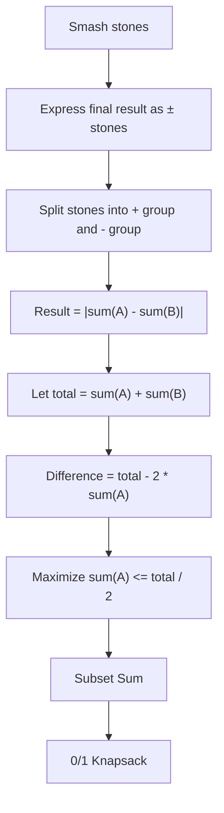

Bài **1049. Last Stone Weight II** nhìn bề ngoài giống simulation, nhưng nếu mô phỏng từng lần đập đá thì rất khó chọn được thứ tự tối ưu. Cách nhìn đúng là chuyển nó thành bài **chia tập thành 2 nhóm sao cho chênh lệch tổng nhỏ nhất**.

## 1. Đề bài thực sự hỏi gì?

Ta có:

```text
stones = [2,7,4,1,8,1]
```

Mỗi lần chọn 2 viên:

```text
x <= y
```

thì:

```text
nếu x == y:
    cả hai biến mất

nếu x != y:
    còn lại y - x
```

Ví dụ:

```text
7 và 4
→ 3
```

Sau nhiều lần smash, cuối cùng có thể còn:

```text
0 hoặc 1 viên đá
```

Ta cần:

> Trọng lượng nhỏ nhất có thể của viên đá cuối cùng.

---

# 2. Tại sao không nên nghĩ theo simulation?

Ví dụ:

```text
[2,7,4,1,8,1]
```

Nếu bạn greedy:

```text
luôn chọn 2 viên lớn nhất
```

thì có thể ra một kết quả.

Nhưng đề hỏi:

```text
minimum possible
```

tức là thứ tự smash có ảnh hưởng.

Vậy simulation không dễ đảm bảo optimum.

Điểm quan trọng là phải tìm một representation khác.

---

# 3. Tư tưởng quan trọng: mỗi viên đá cuối cùng mang dấu `+` hoặc `-`

Hãy nhìn operation:

```text
y - x
```

Thực chất là:

```text
(+y) + (-x)
```

Ví dụ:

```text
8 smash 7
→ 8 - 7
```

Nếu sau đó:

```text
(8 - 7) smash 4
```

ta có thể ra:

```text
|(8 - 7) - 4|
```

Tức là:

```text
|8 - 7 - 4|
```

Nếu tiếp tục qua nhiều operation, cuối cùng kết quả có thể viết dưới dạng:

```text
|±stone1 ±stone2 ±stone3 ...|
```

Nói cách khác:

> Mỗi stone cuối cùng sẽ thuộc một trong hai phía: cộng hoặc trừ.

---

# 4. Từ dấu `+/-` sang 2 group

Giả sử:

```text
stones = [2,7,4,1,8,1]
```

Ta chia thành:

```text
Group A = dấu +
Group B = dấu -
```

Kết quả:

```text
|sum(A) - sum(B)|
```

Ví dụ:

```text
A = [2,4,1,1]
sumA = 8

B = [7,8]
sumB = 15
```

difference:

```text
|8 - 15| = 7
```

Nhưng ta muốn tìm partition tốt hơn.

Ví dụ:

```text
A = [2,4,1,1,?]
```

Ta có thể tìm 2 group có tổng gần nhau nhất.

---

# 5. Tổng toàn bộ stones

```text
stones = [2,7,4,1,8,1]
```

Total:

```text
2 + 7 + 4 + 1 + 8 + 1 = 23
```

Giả sử:

```text
sum(A) = x
```

thì:

```text
sum(B) = total - x
```

Difference:

```text
|sum(A) - sum(B)|
```

thay vào:

```text
|x - (total - x)|
```

```text
= |2x - total|
```

Ta muốn minimize:

```text
|2x - total|
```

---

# 6. x nên gần total / 2 nhất

Vì:

```text
total = 23
```

half:

```text
23 / 2 = 11
```

Nếu ta tìm được một subset có sum gần `11` nhất, thì group còn lại tự động gần nó nhất.

Ví dụ nếu:

```text
subset sum = 11
```

thì group còn lại:

```text
23 - 11 = 12
```

difference:

```text
12 - 11 = 1
```

Đây chính là answer.

Thực tế ta có subset:

```text
[7,4]
```

sum:

```text
11
```

remaining:

```text
[2,1,8,1]
```

sum:

```text
12
```

Answer:

```text
1
```

---

# 7. Vì sao chỉ cần tìm tới `total / 2`?

Ta có:

```text
A + B = total
```

Nếu giả sử:

```text
A <= B
```

thì:

```text
A <= total / 2
```

Difference:

```text
B - A
```

mà:

```text
B = total - A
```

nên:

```text
difference = total - 2A
```

Muốn difference nhỏ nhất thì:

```text
A
```

phải lớn nhất có thể nhưng:

```text
A <= total / 2
```

Đây chính xác là:

> Find maximum subset sum <= total / 2.

Và đây chính là **0/1 Knapsack**.

---

# 8. Mapping sang 0/1 Knapsack

Mỗi stone:

```text
stone = weight
```

Ta không thực sự cần `value` riêng.

Ta muốn:

```text
maximize subset sum
```

với:

```text
subset sum <= total / 2
```

Có thể coi:

```text
weight = stone
value = stone
```

Capacity:

```text
total / 2
```

Và mỗi stone chỉ dùng một lần.

=> 0/1 Knapsack.

---

# 9. DP 2D solution

Ta có thể định nghĩa:

```java
dp[i][w]
```

là:

> maximum sum <= `w` khi dùng first `i` stones.

Transition:

```java
dp[i][w] = dp[i - 1][w];
```

Nếu:

```text
w >= stone
```

thì:

```java
dp[i][w] = Math.max(
    dp[i][w],
    stone + dp[i - 1][w - stone]
);
```

Code:

```java
class Solution {
    public int lastStoneWeightII(int[] stones) {

        int total = 0;

        for (int stone : stones) {
            total += stone;
        }

        int capacity = total / 2;
        int n = stones.length;

        int[][] dp = new int[n + 1][capacity + 1];

        for (int i = 1; i <= n; i++) {

            int stone = stones[i - 1];

            for (int w = 0; w <= capacity; w++) {

                // not take
                dp[i][w] = dp[i - 1][w];

                // take
                if (w >= stone) {
                    dp[i][w] = Math.max(
                        dp[i][w],
                        stone + dp[i - 1][w - stone]
                    );
                }
            }
        }

        int best = dp[n][capacity];

        return total - 2 * best;
    }
}
```

---

# 10. Dry run với `[2,7,4,1,8,1]`

Total:

```text
23
```

Capacity:

```text
11
```

Ta tìm:

```text
maximum subset sum <= 11
```

Các stone lần lượt:

```text
2, 7, 4, 1, 8, 1
```

Cuối cùng ta có thể đạt:

```text
11
```

Ví dụ:

```text
7 + 4 = 11
```

Vậy:

```text
best = 11
```

Answer:

```text
total - 2 * best
```

```text
= 23 - 22
```

```text
= 1
```

---

# 11. DP 1D — solution chuẩn hơn

Vì mỗi row chỉ dùng row trước, ta compress:

```java
dp[w]
```

Ý nghĩa:

> maximum subset sum <= w với các stones đã xử lý.

Code:

```java
class Solution {
    public int lastStoneWeightII(int[] stones) {

        int total = 0;

        for (int stone : stones) {
            total += stone;
        }

        int capacity = total / 2;

        int[] dp = new int[capacity + 1];

        for (int stone : stones) {

            for (int w = capacity; w >= stone; w--) {

                dp[w] = Math.max(
                    dp[w],
                    stone + dp[w - stone]
                );
            }
        }

        int best = dp[capacity];

        return total - 2 * best;
    }
}
```

---

# 12. Vì sao phải loop backward?

Vì đây là:

```text
0/1 Knapsack
```

Mỗi stone chỉ được dùng đúng tối đa một lần.

Ta phải:

```java
for (int w = capacity; w >= stone; w--)
```

Không được:

```java
for (int w = stone; w <= capacity; w++)
```

vì forward sẽ cho phép cùng một stone được reuse.

Ví dụ chỉ có:

```text
stone = 4
capacity = 8
```

Nếu forward:

```text
w = 4
dp[4] = 4
```

sau đó:

```text
w = 8
dp[8] = 4 + dp[4]
      = 8
```

tức là stone `4` được dùng hai lần.

Sai.

Backward thì tránh được điều đó.

---

# 13. Có một cách DP khác: boolean subset sum

Thay vì lưu:

```text
maximum sum
```

ta có thể lưu:

```java
boolean dp[s]
```

ý nghĩa:

> Có thể tạo subset sum = s không?

Ban đầu:

```java
dp[0] = true;
```

Với mỗi stone:

```java
for (int s = capacity; s >= stone; s--) {
    dp[s] = dp[s] || dp[s - stone];
}
```

Sau cùng tìm:

```text
largest s <= total/2
```

mà:

```text
dp[s] == true
```

Code:

```java
class Solution {
    public int lastStoneWeightII(int[] stones) {

        int total = 0;

        for (int stone : stones) {
            total += stone;
        }

        int target = total / 2;

        boolean[] dp = new boolean[target + 1];
        dp[0] = true;

        for (int stone : stones) {

            for (int s = target; s >= stone; s--) {
                dp[s] = dp[s] || dp[s - stone];
            }
        }

        for (int s = target; s >= 0; s--) {

            if (dp[s]) {
                return total - 2 * s;
            }
        }

        return 0;
    }
}
```

Cách này cũng rất tự nhiên vì đây thực chất là:

```text
Subset Sum
```

---

# 14. So sánh 2 kiểu DP

### Kiểu 1: max sum

```java
int[] dp
```

State:

```text
dp[w] = maximum achievable sum <= w
```

Cuối cùng:

```java
best = dp[target]
```

Ưu điểm:

```text
không cần scan lại
```

---

### Kiểu 2: boolean

```java
boolean[] dp
```

State:

```text
dp[s] = can we form exact sum s?
```

Cuối cùng scan:

```text
target -> 0
```

để tìm sum lớn nhất reachable.

Cả hai đều đúng.

---

# 15. Một cách tư duy pattern rất quan trọng

Khi gặp bài:

```text
divide numbers into two groups
minimize difference between group sums
```

hãy lập tức nghĩ:

```text
total = sum(nums)
```

Giả sử:

```text
group A = x
group B = total - x
```

Difference:

```text
|x - (total - x)|
```

```text
= |total - 2x|
```

Muốn minimize:

```text
x gần total / 2 nhất
```

Nếu mỗi item chỉ chọn một lần:

```text
Subset Sum
→ 0/1 Knapsack
```

Đây là pattern cực kỳ quan trọng.

---

# 16. Từ Last Stone Weight II tới generic pattern

LeetCode 1049 chỉ là một cách disguise.

Bề ngoài:

```text
smash stones
```

Bên trong:

```text
assign + / -
```

Sau đó:

```text
partition into two groups
```

Sau đó:

```text
minimize group sum difference
```

Sau đó:

```text
find subset closest to total / 2
```

Cuối cùng:

```text
0/1 Knapsack
```

Flow tư duy:



---

# 17. Câu quan trọng nhất để bạn tự derive solution

Trong interview, nếu gặp lại bài này, đừng cố nhớ code.

Hãy derive:

```text
Final weight
=
|sum(A) - sum(B)|
```

Vì:

```text
sum(B) = total - sum(A)
```

nên:

```text
difference
=
|total - 2 * sum(A)|
```

Muốn nhỏ nhất:

```text
sum(A) phải gần total/2 nhất
```

Do đó:

```text
Find maximum achievable subset sum <= total/2
```

Mỗi stone dùng một lần:

```text
0/1 Knapsack
```

Đó là reasoning hoàn chỉnh.

---

## 18. Template bạn có thể nhớ

```java
int total = Arrays.stream(nums).sum();

int target = total / 2;

int[] dp = new int[target + 1];

for (int num : nums) {

    for (int sum = target; sum >= num; sum--) {

        dp[sum] = Math.max(
            dp[sum],
            num + dp[sum - num]
        );
    }
}

int bestHalf = dp[target];

return total - 2 * bestHalf;
```

Template này không chỉ dùng cho **Last Stone Weight II**, mà còn là nền tảng của cả nhóm bài:

```text
Minimum Subset Sum Difference
Partition Equal Subset Sum
Target Sum
Last Stone Weight II
```

Khác nhau chủ yếu ở việc đề bài “ngụy trang” partition/subset sum như thế nào.
