# Dynamic Programming — State Machine DP

> Mục tiêu cuối cùng không phải là nhớ:
>
> `hold`, `cash`, `rest`, `cooldown`.
>
> Mục tiêu là khi gặp một bài mới, bạn có thể tự hỏi:
>
> **Tôi cần biết điều gì về quá khứ để quyết định action tiếp theo?**
>
> Từ câu hỏi đó:
>
> **Past information → State → Legal actions → Transition → DP**

---

# Part 1 — State Machine DP thực sự là gì?

## 1.1 DP state là gì?

Một **DP state** là một tập thông tin tối thiểu mô tả:

> Sau khi đã xử lý một phần bài toán, tôi đang ở tình huống nào và giá trị tốt nhất đạt được đến đây là bao nhiêu?

Ví dụ:

```text
dp[i][state]
```

không chỉ có nghĩa:

> một ô trong mảng DP.

Nó phải có một **semantic meaning** rõ ràng.

Ví dụ:

```text
dp[i][HOLD]
```

có thể được định nghĩa:

> Maximum profit achievable after processing day `0..i`,
> while ending day `i` holding one stock.

Hai phần phải luôn xuất hiện:

1. **Phần nào của input đã được xử lý?**
2. **Sau khi xử lý xong, tôi đang ở trạng thái nào?**

---

# 1.2 State Machine là gì?

State Machine là một hệ thống gồm:

* **state**
* **action/event**
* **transition**

Ví dụ một thiết bị:

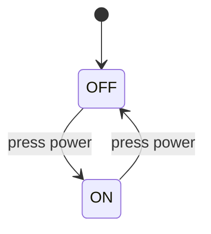

Ở đây:

* `OFF`, `ON` = states.
* `press power` = action.
* `OFF → ON` = transition.

State Machine DP cũng giống như vậy.

Khác biệt là chúng ta không chỉ muốn biết:

> Tôi có thể đến state nào?

Mà muốn biết:

> Giá trị tốt nhất khi đến state đó là bao nhiêu?

Ví dụ:

```text
max profit
min cost
number of ways
minimum operations
```

---

# 1.3 Một cách nhìn tổng quát

Ở mỗi thời điểm/index:

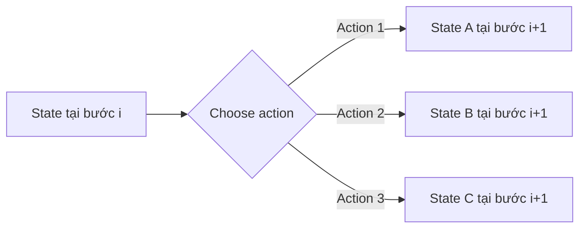

DP làm thêm một việc:

```text
Nếu có nhiều path cùng dẫn đến một state,
chỉ giữ lại path tốt nhất.
```

Đây chính là lý do DP loại bỏ rất nhiều repeated work.

---

# 1.4 Phân biệt 4 khái niệm quan trọng

Giả sử đang giải Stock.

### State

Tình trạng hiện tại:

```text
HOLD
NOT_HOLD
```

---

### Action

Việc bạn quyết định làm:

```text
BUY
SELL
DO_NOTHING
```

---

### Transition

State thay đổi sau action.

```text
NOT_HOLD --BUY--> HOLD

HOLD --SELL--> NOT_HOLD
```

---

### Value stored in DP

Ví dụ:

```text
dp[i][HOLD]
```

không có nghĩa:

```text
HOLD = true
```

Nó có thể chứa:

```text
maximum profit achievable
```

trong số tất cả các history khiến bạn kết thúc ngày `i` ở state `HOLD`.

Đây là khác biệt rất quan trọng.

---

# 1.5 Ví dụ đơn giản trước Stock

Giả sử mỗi ngày bạn có thể:

* nghỉ (`REST`);
* tập luyện (`TRAIN`);

nhưng không được TRAIN hai ngày liên tiếp.

Mỗi ngày `i` có reward `reward[i]`.

Ta muốn maximize tổng reward.

Nếu ngày hôm nay muốn TRAIN, ta cần biết gì về quá khứ?

Không cần biết:

```text
Ngày 1 làm gì
Ngày 2 làm gì
Ngày 3 làm gì
...
```

Chúng ta chỉ cần biết:

> Hôm qua có TRAIN hay không?

Vậy state tối thiểu là:

```text
REST
TRAIN
```

State machine:

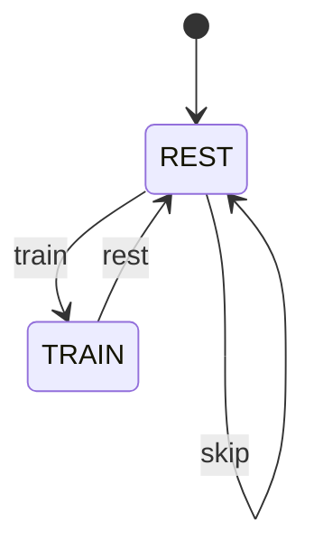

Không có:

```text
TRAIN → TRAIN
```

vì constraint cấm.

Nếu định nghĩa:

```text
dp[i][REST]
= max reward sau ngày i và ngày i không train

dp[i][TRAIN]
= max reward sau ngày i và ngày i train
```

thì:

```text
dp[i][REST]
=
max(
    dp[i-1][REST],
    dp[i-1][TRAIN]
)
```

vì hôm nay REST thì hôm qua là gì cũng được.

Còn:

```text
dp[i][TRAIN]
=
dp[i-1][REST] + reward[i]
```

vì TRAIN hôm nay yêu cầu hôm qua REST.

Đây chính là State Machine DP.

---

# Part 2 — Cách nhận diện State Machine DP

Một bài rất đáng nghi là State Machine DP nếu có các dấu hiệu sau.

| Signal                              | Ý nghĩa                                     |
| ----------------------------------- | ------------------------------------------- |
| nhiều trạng thái loại trừ nhau      | tại một thời điểm chỉ thuộc một state       |
| action phụ thuộc state hiện tại     | một số action chỉ hợp lệ trong state cụ thể |
| state thay đổi theo index/time      | ngày, vị trí, bước                          |
| action tạo transition               | BUY, SELL, TAKE, SKIP...                    |
| legality phụ thuộc history          | cooldown, đang hold, số transaction         |
| cần optimize/count                  | max profit, min cost, number of ways        |
| tương lai không cần toàn bộ history | chỉ cần state tóm tắt history               |

Một keyword đặc biệt mạnh:

```text
currently...
```

Ví dụ:

```text
currently holding
currently waiting
currently active
currently inactive
currently in cooldown
```

Đây gần như đang nói thẳng cho bạn:

> Hãy nghĩ tới state.

---

# 2.1 Các keyword phổ biến

Stock:

```text
buy
sell
hold
transaction
at most k
cooldown
transaction fee
```

Scheduling / activity:

```text
active
inactive
waiting
rest
cannot perform consecutively
```

Decision sequence:

```text
take
skip
choose
not choose
previous action
```

Resource:

```text
remaining k
number of operations used
remaining energy
remaining transactions
```

---

# 2.2 Decision Tree nhận diện

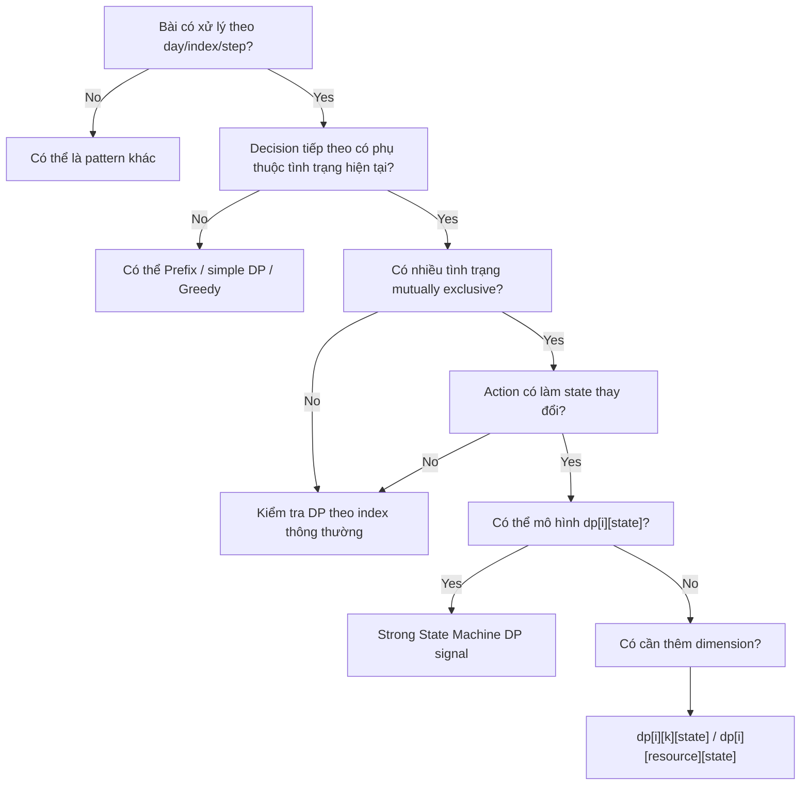

---

# Part 3 — Framework thiết kế State Machine

Đây là framework quan trọng nhất.

## Step 1 — Xác định progression dimension

Hỏi:

> Bài toán tiến về phía trước theo dimension nào?

Thường là:

```text
day i
index i
position i
time i
step i
```

---

# Step 2 — Xác định state

Hỏi câu này:

> What information about the past do I need to know to make the next decision?

Ví dụ Stock:

Muốn biết hôm nay có BUY được không.

Bạn không cần biết toàn bộ lịch sử BUY/SELL.

Bạn chỉ cần biết:

```text
currently HOLD
hay
currently NOT_HOLD
```

---

# Step 3 — Liệt kê action từ từng state

Ví dụ:

```text
HOLD:
    do nothing
    sell

NOT_HOLD:
    do nothing
    buy
```

---

# Step 4 — Vẽ transition graph

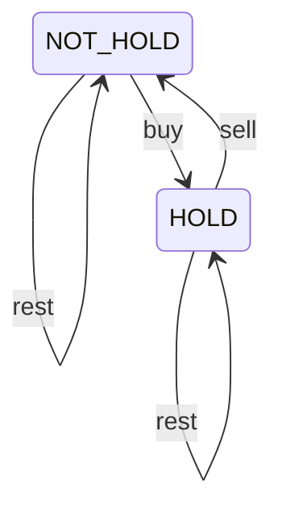

Một khi graph đúng, recurrence gần như tự xuất hiện.

---

# Step 5 — Viết semantic trước recurrence

Ví dụ:

```text
dp[i][s]
=
optimal value after processing days 0..i
and ending day i in state s
```

Hãy nói được câu này trước khi viết code.

---

# Step 6 — Recurrence tổng quát

```text
dp[i][newState]
=
best over all previous states:
    dp[i-1][oldState] + transitionValue
```

Ví dụ maximizing:

```text
dp[i][newState]
=
max(
    dp[i-1][oldState1] + cost1,
    dp[i-1][oldState2] + cost2,
    ...
)
```

---

# Step 7 — Base Case

Hỏi:

> Trước khi xử lý input, state nào hợp lệ?

Ví dụ Stock:

```text
cash = 0
hold = impossible
```

Có thể biểu diễn impossible bằng:

```java
Integer.MIN_VALUE / 2
```

hoặc khởi tạo trực tiếp sau ngày 0.

---

# Step 8 — Answer state

Đừng mặc định:

```text
answer = dp[n-1][last state]
```

Phải hỏi:

> Khi kết thúc bài toán, state nào được phép?

Stock:

```text
HOLD
```

thường không phải answer tốt, vì bạn còn một stock chưa bán.

Answer thường là:

```text
NOT_HOLD
REST
max(REST, COOLDOWN)
```

---

# Part 4 — LeetCode 121: Best Time to Buy and Sell Stock

## 4.1 Problem

Bạn được thực hiện:

```text
at most ONE transaction
```

tức:

```text
BUY một lần
SELL một lần
```

BUY phải xảy ra trước SELL.

---

# 4.2 Sai lầm cực kỳ quan trọng

Nếu bạn viết:

```text
hold[i]
=
max(
    hold[i-1],
    cash[i-1] - price[i]
)

cash[i]
=
max(
    cash[i-1],
    hold[i-1] + price[i]
)
```

thì state machine là:

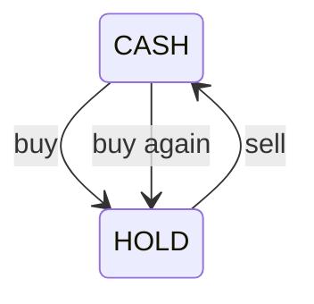

Bạn có thể:

```text
buy
sell
buy
sell
...
```

Đây là **Stock II**, không phải Stock I.

---

# 4.3 Tại sao HOLD / NOT_HOLD chưa đủ cho Stock I?

Vì `NOT_HOLD` có hai ý nghĩa khác nhau:

```text
1. Chưa từng mua
2. Đã bán xong transaction
```

Nhưng legality khác nhau.

Ở case 1:

```text
BUY được
```

Ở case 2:

```text
BUY lại không được
```

Nếu merge chúng thành một state `NOT_HOLD`, bạn mất information cần thiết.

Đây là ví dụ hoàn hảo cho câu hỏi:

> If I know the current state, do I need any other information about the past?

Có.

Ta cần biết transaction đã sử dụng chưa.

---

# 4.4 State machine đầy đủ

Ta có thể mô hình:

```text
READY
HOLD
DONE
```

Trong đó:

```text
READY:
chưa mua

HOLD:
đã mua nhưng chưa bán

DONE:
đã hoàn thành transaction
```

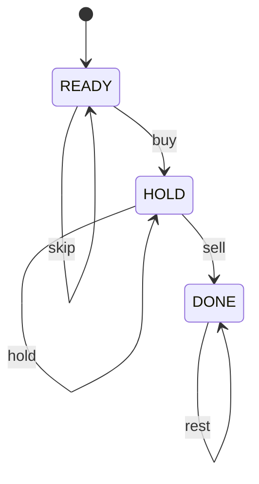

Không có:

```text
DONE → HOLD
```

vì chỉ một transaction.

---

# 4.5 DP recurrence

Định nghĩa:

```text
ready[i]
= max profit sau day i khi chưa thực hiện transaction

hold[i]
= max profit sau day i khi đang giữ stock

done[i]
= max profit sau day i sau khi đã bán
```

`ready` luôn bằng:

```text
0
```

### HOLD

Hai cách kết thúc ngày i ở HOLD:

1. hôm qua đã HOLD → tiếp tục hold;
2. hôm nay BUY từ READY.

```text
hold[i]
=
max(
    hold[i-1],
    ready[i-1] - price[i]
)
```

Vì:

```text
ready = 0
```

nên:

```text
hold[i]
=
max(
    hold[i-1],
    -price[i]
)
```

Ý nghĩa:

> Giá trị HOLD tốt nhất đơn giản là mua ở mức giá thấp nhất đã thấy.

---

### DONE

Hai cách:

1. đã DONE từ trước;
2. SELL stock đang HOLD hôm nay.

```text
done[i]
=
max(
    done[i-1],
    hold[i-1] + price[i]
)
```

---

# 4.6 2D DP version

```java
class Solution {
    public int maxProfit(int[] prices) {
        int n = prices.length;

        int[][] dp = new int[n][2];

        // 0 = HOLD
        // 1 = DONE / NOT_HOLD after at most one transaction

        dp[0][0] = -prices[0];
        dp[0][1] = 0;

        for (int i = 1; i < n; i++) {
            dp[i][0] = Math.max(
                dp[i - 1][0],
                -prices[i]
            );

            dp[i][1] = Math.max(
                dp[i - 1][1],
                dp[i - 1][0] + prices[i]
            );
        }

        return dp[n - 1][1];
    }
}
```

---

# 4.7 Space optimization

Ngày `i` chỉ phụ thuộc ngày `i-1`.

Không cần:

```text
dp[0]
dp[1]
...
dp[i-2]
```

Do đó:

```text
O(n) → O(1)
```

```java
class Solution {
    public int maxProfit(int[] prices) {
        int hold = -prices[0];
        int cash = 0;

        for (int i = 1; i < prices.length; i++) {
            int prevHold = hold;
            int prevCash = cash;

            hold = Math.max(
                prevHold,
                -prices[i]
            );

            cash = Math.max(
                prevCash,
                prevHold + prices[i]
            );
        }

        return cash;
    }
}
```

Time:

```text
O(n)
```

Space:

```text
O(1)
```

---

# Pattern to remember — Stock I

Sự khác biệt cốt lõi:

```text
Stock I:
hold = max(prevHold, -price)

Stock II:
hold = max(prevHold, prevCash - price)
```

Một dấu `prevCash` thay vì `0` thay đổi toàn bộ constraint.

---

# How I would explain this in an interview

> I can model the problem as a small state machine. Since we're allowed at most one transaction, I need to distinguish between holding a stock and having finished the transaction. For the holding state, I either keep the previous stock or buy today, and because this is the first and only buy, the value is simply `-price[i]`. For the cash state, I either keep the previous profit or sell the previously held stock today. Each state only depends on the previous day, so after deriving the DP I can reduce the space from O(n) to O(1). The total time is O(n).

---

# Part 5 — Stock Problem Family Tree

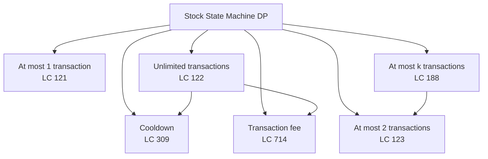

Điều quan trọng không phải học sáu công thức.

Hãy nhìn chúng như:

```text
Basic state machine
+
constraint mới
=
state hoặc transition mới
```

| Problem | Constraint mới | Thay đổi                        |
| ------- | -------------- | ------------------------------- |
| 121     | 1 transaction  | không cho rebuy                 |
| 122     | unlimited      | CASH có thể BUY lại             |
| 309     | cooldown       | thêm cooldown/rest information  |
| 714     | fee            | thêm cost vào transition        |
| 123     | at most 2      | thêm transaction dimension      |
| 188     | at most k      | tổng quát transaction dimension |

---

# Part 6 — LeetCode 122: Unlimited Transactions

## 6.1 States

Chỉ cần:

```text
HOLD
CASH
```

vì sau khi SELL, bạn được BUY lại.

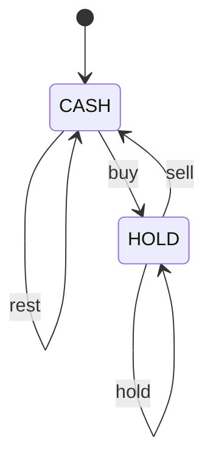

---

# 6.2 Tại sao không BUY khi HOLD?

Problem quy định chỉ giữ tối đa một stock.

Nếu đã HOLD:

```text
BUY
```

không hợp lệ.

Tương tự nếu đang CASH:

```text
SELL
```

không hợp lệ vì không có stock để bán.

---

# 6.3 Recurrence

### HOLD

Cuối ngày i đang HOLD.

Có hai source:

```text
HOLD yesterday
→ do nothing
→ HOLD today
```

hoặc:

```text
CASH yesterday
→ BUY today
→ HOLD today
```

Vậy:

```text
hold[i]
=
max(
    hold[i-1],
    cash[i-1] - price[i]
)
```

---

### CASH

```text
CASH yesterday
→ rest
```

hoặc:

```text
HOLD yesterday
→ sell
```

Vậy:

```text
cash[i]
=
max(
    cash[i-1],
    hold[i-1] + price[i]
)
```

---

# 6.4 Bottom-up DP

```java
class Solution {
    public int maxProfit(int[] prices) {
        int n = prices.length;

        int[][] dp = new int[n][2];

        int HOLD = 0;
        int CASH = 1;

        dp[0][HOLD] = -prices[0];
        dp[0][CASH] = 0;

        for (int i = 1; i < n; i++) {
            dp[i][HOLD] = Math.max(
                dp[i - 1][HOLD],
                dp[i - 1][CASH] - prices[i]
            );

            dp[i][CASH] = Math.max(
                dp[i - 1][CASH],
                dp[i - 1][HOLD] + prices[i]
            );
        }

        return dp[n - 1][CASH];
    }
}
```

---

# 6.5 Constant space

```java
class Solution {
    public int maxProfit(int[] prices) {
        int hold = -prices[0];
        int cash = 0;

        for (int i = 1; i < prices.length; i++) {
            int prevHold = hold;
            int prevCash = cash;

            hold = Math.max(
                prevHold,
                prevCash - prices[i]
            );

            cash = Math.max(
                prevCash,
                prevHold + prices[i]
            );
        }

        return cash;
    }
}
```

Time:

```text
O(n)
```

Space:

```text
O(1)
```

---

# 6.6 DP và Greedy liên hệ như thế nào?

Greedy solution:

```java
int profit = 0;

for (int i = 1; i < prices.length; i++) {
    if (prices[i] > prices[i - 1]) {
        profit += prices[i] - prices[i - 1];
    }
}
```

Ví dụ:

```text
1 → 3 → 5
```

Một transaction:

```text
buy 1
sell 5

profit = 4
```

Greedy tách thành:

```text
1 → 3 = +2
3 → 5 = +2

total = 4
```

Vì transaction unlimited và không có:

```text
fee
cooldown
transaction count
```

mọi positive slope đều có thể thu profit độc lập.

Do đó greedy là một simplification của state-machine DP dưới constraint đặc biệt của Stock II.

---

# Pattern to remember

```text
Unlimited transaction
→ after SELL, BUY lại được
→ CASH → HOLD hợp lệ.
```

---

# Part 7 — LeetCode 309: Stock with Cooldown

Đây là một bài cực kỳ tốt để học **state design**.

## 7.1 Constraint

Sau khi SELL:

```text
day i: sell
day i+1: cannot buy
```

Ngày `i+1` phải cooldown.

---

# 7.2 HOLD / NOT_HOLD có đủ không?

Không.

Giả sử bạn đang:

```text
NOT_HOLD
```

Có hai possibility:

```text
A. Hôm qua chỉ REST
B. Hôm qua vừa SELL
```

Nếu A:

```text
BUY được
```

Nếu B:

```text
BUY không được
```

Hai situation có legal action khác nhau.

Vậy chúng phải là hai state khác nhau.

Ta có:

```text
HOLD
REST
COOLDOWN
```

---

# 7.3 Semantic

```text
HOLD:
kết thúc ngày i đang giữ stock.

REST:
kết thúc ngày i không giữ stock
và hôm nay không vừa sell.

COOLDOWN:
kết thúc ngày i bằng việc SELL stock.
```

---

# 7.4 State machine

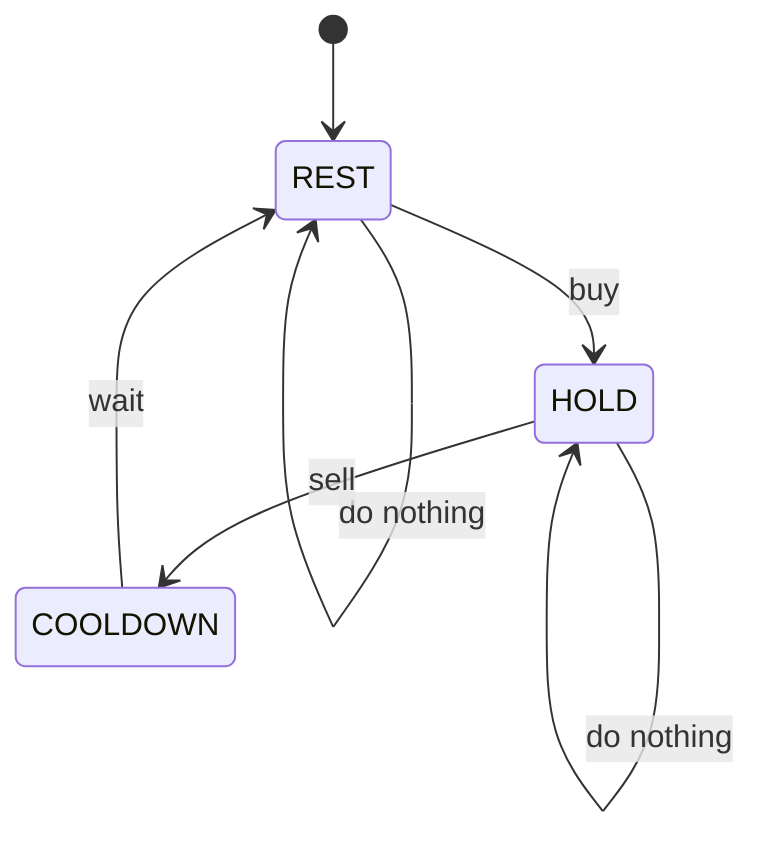

Chú ý:

```text
COOLDOWN → HOLD
```

không tồn tại.

Đây chính là constraint.

---

# 7.5 Tại sao không có HOLD → REST?

Nếu HOLD ngày hôm qua và hôm nay không giữ stock nữa thì bạn phải:

```text
SELL
```

Nếu SELL hôm nay thì cuối hôm nay state phải là:

```text
COOLDOWN
```

không phải REST.

Do đó transition semantic chính xác là:

```text
HOLD → COOLDOWN
```

---

# 7.6 Recurrence

### HOLD

Nguồn 1:

```text
HOLD → HOLD
```

Không làm gì.

Nguồn 2:

```text
REST → HOLD
```

BUY.

```text
hold[i]
=
max(
    hold[i-1],
    rest[i-1] - price[i]
)
```

---

### COOLDOWN

Muốn hôm nay nằm trong COOLDOWN thì hôm nay bắt buộc vừa SELL.

```text
cooldown[i]
=
hold[i-1] + price[i]
```

---

### REST

REST hôm nay có thể đến từ:

```text
REST yesterday
→ continue resting
```

hoặc:

```text
COOLDOWN yesterday
→ cooldown completed
```

Vậy:

```text
rest[i]
=
max(
    rest[i-1],
    cooldown[i-1]
)
```

---

# 7.7 Base case

Ngày 0:

```text
hold[0] = -price[0]
rest[0] = 0
cooldown[0] = impossible
```

Ta có thể dùng:

```text
cooldown[0] = Integer.MIN_VALUE / 2
```

Nhưng một implementation dễ hơn có thể đặt:

```text
cooldown = 0
```

nếu recurrence và answer vẫn bảo toàn correctness.

Trong interview, semantic base case rõ ràng hơn là dùng impossible state.

---

# 7.8 Trace

Input:

```text
prices = [1,2,3,0,2]
```

Khởi tạo:

| Day | Price | HOLD | REST | COOLDOWN |
| --: | ----: | ---: | ---: | -------: |
|   0 |     1 |   -1 |    0 |       -∞ |

---

## Day 1 — price = 2

HOLD:

```text
max(
    -1,
    0 - 2
)
=
-1
```

REST:

```text
max(
    0,
    -∞
)
=
0
```

COOLDOWN:

```text
-1 + 2 = 1
```

| Day | Price | HOLD | REST | COOLDOWN |
| --: | ----: | ---: | ---: | -------: |
|   0 |     1 |   -1 |    0 |       -∞ |
|   1 |     2 |   -1 |    0 |        1 |

---

## Day 2 — price = 3

```text
HOLD
=
max(-1, 0 - 3)
=
-1
```

```text
REST
=
max(0, 1)
=
1
```

```text
COOLDOWN
=
-1 + 3
=
2
```

| Day | Price | HOLD | REST | COOLDOWN |
| --: | ----: | ---: | ---: | -------: |
|   0 |     1 |   -1 |    0 |       -∞ |
|   1 |     2 |   -1 |    0 |        1 |
|   2 |     3 |   -1 |    1 |        2 |

---

## Day 3 — price = 0

HOLD:

```text
max(
    -1,
    1 - 0
)
=
1
```

Tại sao có thể là `1`?

Path tương ứng:

```text
buy 1
sell 2
profit = 1

cooldown day 2

buy at 0
```

REST:

```text
max(1, 2)
=
2
```

COOLDOWN:

```text
-1 + 0
=
-1
```

| Day | Price | HOLD | REST | COOLDOWN |
| --: | ----: | ---: | ---: | -------: |
|   0 |     1 |   -1 |    0 |       -∞ |
|   1 |     2 |   -1 |    0 |        1 |
|   2 |     3 |   -1 |    1 |        2 |
|   3 |     0 |    1 |    2 |       -1 |

---

## Day 4 — price = 2

```text
HOLD
=
max(1, 2 - 2)
=
1
```

```text
REST
=
max(2, -1)
=
2
```

```text
COOLDOWN
=
1 + 2
=
3
```

Final:

| Day | Price | HOLD | REST | COOLDOWN |
| --: | ----: | ---: | ---: | -------: |
|   4 |     2 |    1 |    2 |        3 |

Answer:

```text
max(REST, COOLDOWN)
=
3
```

---

# 7.9 Bottom-up Java

```java
class Solution {
    public int maxProfit(int[] prices) {
        int n = prices.length;

        int[][] dp = new int[n][3];

        int HOLD = 0;
        int REST = 1;
        int COOLDOWN = 2;

        dp[0][HOLD] = -prices[0];
        dp[0][REST] = 0;
        dp[0][COOLDOWN] = Integer.MIN_VALUE / 2;

        for (int i = 1; i < n; i++) {
            dp[i][HOLD] = Math.max(
                dp[i - 1][HOLD],
                dp[i - 1][REST] - prices[i]
            );

            dp[i][REST] = Math.max(
                dp[i - 1][REST],
                dp[i - 1][COOLDOWN]
            );

            dp[i][COOLDOWN] =
                dp[i - 1][HOLD] + prices[i];
        }

        return Math.max(
            dp[n - 1][REST],
            dp[n - 1][COOLDOWN]
        );
    }
}
```

Time:

```text
O(n)
```

Space:

```text
O(n)
```

---

# 7.10 Constant space

```java
class Solution {
    public int maxProfit(int[] prices) {
        int hold = -prices[0];
        int rest = 0;
        int cooldown = Integer.MIN_VALUE / 2;

        for (int i = 1; i < prices.length; i++) {
            int prevHold = hold;
            int prevRest = rest;
            int prevCooldown = cooldown;

            hold = Math.max(
                prevHold,
                prevRest - prices[i]
            );

            rest = Math.max(
                prevRest,
                prevCooldown
            );

            cooldown =
                prevHold + prices[i];
        }

        return Math.max(rest, cooldown);
    }
}
```

---

# Vì sao phải lưu prev values?

Sai:

```java
hold = Math.max(hold, rest - price);
cooldown = hold + price;
```

`cooldown` đang dùng:

```text
hold của CURRENT DAY
```

trong khi recurrence yêu cầu:

```text
hold của PREVIOUS DAY
```

Đây là một lỗi State DP rất phổ biến.

---

# Pattern to remember — Cooldown

Constraint:

```text
same NOT_HOLD condition
but different available actions
```

→ phải split thành nhiều state.

---

# How I would explain this in an interview

> The key is that `not holding` is not enough to describe the history. If I just sold today, I'm not allowed to buy tomorrow, while if I'm simply resting, I can buy. So I split the non-holding condition into `REST` and `COOLDOWN`. From REST I can stay at REST or buy into HOLD. From HOLD I can stay holding or sell into COOLDOWN. From COOLDOWN I must move to REST. After defining those transitions, the recurrence follows directly. Each day only depends on the previous day, so the space can be reduced to O(1).

---

# Part 8 — Transaction Limit: LC 123 và LC 188

# 8.1 Tại sao HOLD / CASH không đủ?

Stock II chỉ cần biết:

```text
holding?
```

Nhưng Stock III hỏi:

```text
at most 2 transactions
```

Hai history:

```text
History A:
0 transactions completed

History B:
2 transactions completed
```

đều có thể đang:

```text
CASH
```

Nhưng:

```text
A có thể BUY
B không thể BUY
```

Vậy phải lưu:

```text
transaction count
```

---

# 8.2 State

Ta dùng convention:

> Một transaction được tính khi **SELL hoàn tất**.

Định nghĩa:

```text
dp[i][t][0]
=
max profit after day i,
with t completed transactions,
and NOT holding stock.

dp[i][t][1]
=
max profit after day i,
with t completed transactions,
and HOLDING stock.
```

`t` ở đây là:

```text
number of completed SELLs
```

---

# 8.3 State structure

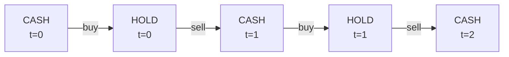

Nhìn graph là thấy ngay:

```text
SELL làm t tăng.
BUY không làm t tăng.
```

---

# 8.4 Transition

### HOLD

Nếu cuối ngày i đang hold với `t` completed transactions:

```text
hold[i][t]
=
max(
    hold[i-1][t],
    cash[i-1][t] - price[i]
)
```

BUY chưa hoàn tất transaction nên `t` giữ nguyên.

---

### CASH

Có hai cách:

```text
cash[i-1][t]
→ do nothing
```

hoặc transaction thứ `t` vừa được hoàn tất hôm nay:

```text
hold[i-1][t-1]
→ SELL
```

Vậy:

```text
cash[i][t]
=
max(
    cash[i-1][t],
    hold[i-1][t-1] + price[i]
)
```

---

# 8.5 Một convention khác

Bạn hoàn toàn có thể định nghĩa:

```text
transaction count = number of BUYs used
```

Khi đó:

```text
BUY làm k thay đổi
SELL không làm k thay đổi
```

Cũng đúng.

Sai lầm chỉ xảy ra khi:

```text
base case dùng convention A
transition dùng convention B
answer dùng convention C
```

Trong interview:

> Chọn một convention và nói rõ ngay từ đầu.

---

# 8.6 LC 123 — at most 2

Có thể dùng:

```text
t = 0, 1, 2
```

Complexity:

```text
O(n * 2)
=
O(n)
```

Nhưng conceptually vẫn là:

```text
O(nk)
```

với:

```text
k = 2
```

---

# 8.7 LC 188 — Stock IV

Tổng quát:

```text
at most k transactions
```

Ta có:

```text
dp[day][transaction][state]
```

Time:

```text
O(nk)
```

Space:

```text
O(nk)
```

Có thể optimize:

```text
O(k)
```

vì day i chỉ phụ thuộc day i-1.

---

# 8.8 Interview-ready Java

Một cách implementation rất clean là:

```text
buy[t]
sell[t]
```

Trong đó:

```text
buy[t]
=
best profit while holding after starting transaction t

sell[t]
=
best profit after completing transaction t
```

```java
class Solution {
    public int maxProfit(int k, int[] prices) {
        if (prices.length == 0 || k == 0) {
            return 0;
        }

        int[] buy = new int[k + 1];
        int[] sell = new int[k + 1];

        Arrays.fill(buy, Integer.MIN_VALUE / 2);

        for (int price : prices) {
            int[] prevBuy = buy.clone();
            int[] prevSell = sell.clone();

            for (int t = 1; t <= k; t++) {
                buy[t] = Math.max(
                    prevBuy[t],
                    prevSell[t - 1] - price
                );

                sell[t] = Math.max(
                    prevSell[t],
                    prevBuy[t] + price
                );
            }
        }

        return sell[k];
    }
}
```

Ở implementation này convention hơi khác:

```text
t = transaction slot thứ t
```

BUY thứ `t` bắt đầu từ:

```text
sell[t-1]
```

SELL hoàn tất:

```text
buy[t]
```

Graph:

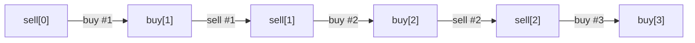

---

# 8.9 Tại sao answer là sell[k]?

Do:

```text
sell[t]
```

được phép carry forward:

```text
sell[t] = max(prevSell[t], ...)
```

và ta có thể thiết kế initialization để `sell[k]` chứa profit tốt nhất với **at most k** transactions.

Một implementation khác có thể return:

```text
max(sell[0..k])
```

Cả hai được nếu invariant thống nhất.

---

# 8.10 Optimization đặc biệt

Nếu:

```text
k >= n / 2
```

thì transaction limit không còn thực sự giới hạn.

Vì một transaction cần ít nhất:

```text
BUY day
SELL later day
```

Tối đa khoảng:

```text
n / 2
```

transactions.

Khi đó bài trở về Stock II:

```text
O(n)
```

thay vì:

```text
O(nk)
```

---

# Pattern to remember — Limited Resources

Nếu constraint nói:

```text
at most k ...
```

hãy nghĩ:

```text
state
×
resource/count dimension
```

Ví dụ:

```text
dp[i][transactions][holding]
```

---

# Part 9 — Transaction Fee: LC 714

State không cần đổi:

```text
HOLD
CASH
```

Constraint không ảnh hưởng legality.

Nó chỉ ảnh hưởng:

```text
transition cost
```

---

# 9.1 Fee khi SELL

```text
hold[i]
=
max(
    hold[i-1],
    cash[i-1] - price[i]
)
```

```text
cash[i]
=
max(
    cash[i-1],
    hold[i-1] + price[i] - fee
)
```

State machine:

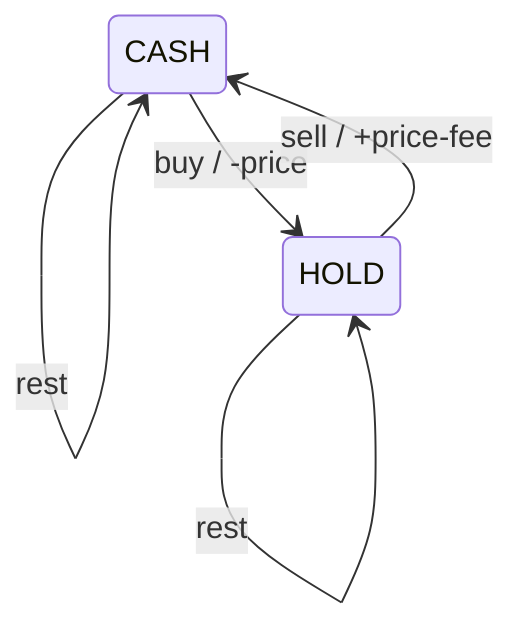

---

# 9.2 Java

```java
class Solution {
    public int maxProfit(int[] prices, int fee) {
        int hold = -prices[0];
        int cash = 0;

        for (int i = 1; i < prices.length; i++) {
            int prevHold = hold;
            int prevCash = cash;

            hold = Math.max(
                prevHold,
                prevCash - prices[i]
            );

            cash = Math.max(
                prevCash,
                prevHold + prices[i] - fee
            );
        }

        return cash;
    }
}
```

Time:

```text
O(n)
```

Space:

```text
O(1)
```

---

# 9.3 Có thể trừ fee lúc BUY không?

Có.

Bạn có thể viết:

```text
hold
=
max(
    prevHold,
    prevCash - price - fee
)
```

và khi SELL:

```text
cash
=
max(
    prevCash,
    prevHold + price
)
```

Miễn là mỗi completed transaction bị trừ fee:

```text
exactly once.
```

---

# Pattern to remember — Transition Cost

Nếu constraint như:

```text
fee
penalty
cost per action
```

không làm legal states thay đổi, thường:

> Không cần thêm state.

Chỉ cần sửa edge weight / transition cost.

---

# Part 10 — Từ 2 states → 3 states → k states

Đừng nghĩ rằng số state là thứ đề bài cho.

State xuất hiện khi **future decisions cần phân biệt các history khác nhau**.

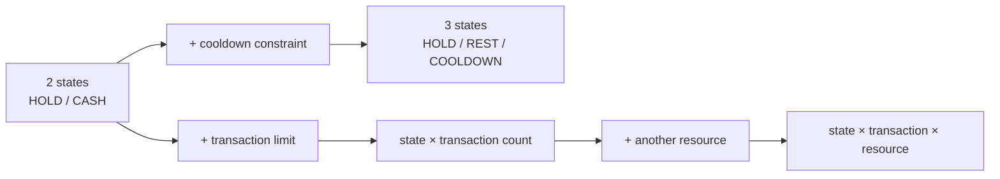

Nguyên tắc:

> Thêm dimension/state chỉ khi nó chứa information cần thiết để xác định future transitions.

---

# Part 11 — State Machine DP ngoài Stock

State Machine DP không phải Stock DP.

Stock chỉ làm state machine rất dễ nhìn.

---

# 11.1 LC 70 — Climbing Stairs

Problem:

Bạn có thể bước:

```text
1
2
```

Muốn đếm số cách đến `n`.

Đây thường được gọi đơn giản là:

```text
linear DP
```

hơn là State Machine DP.

State:

```text
position i
```

Transition:

```text
i-1 → i
i-2 → i
```

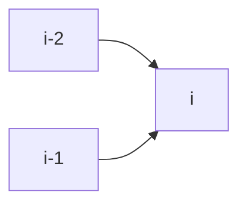

Recurrence:

```text
dp[i] = dp[i-1] + dp[i-2]
```

Base:

```text
dp[0] = 1
dp[1] = 1
```

Complexity:

```text
Time O(n)
Space O(n) → O(1)
```

### Pattern

Đây cho thấy:

> Mọi DP đều có thể nhìn như graph/state transition ở một mức nào đó.

Nhưng không phải mọi DP đều nên gọi là “State Machine DP”.

---

# 11.2 LC 198 — House Robber

Constraint:

```text
cannot rob adjacent houses
```

Có hai cách modeling.

## Modeling A — Prefix DP

```text
dp[i]
=
max money from houses 0..i
```

Transition:

```text
skip i:
dp[i-1]

take i:
dp[i-2] + nums[i]
```

```text
dp[i]
=
max(
    dp[i-1],
    dp[i-2] + nums[i]
)
```

---

## Modeling B — TAKE / SKIP states

```text
take[i]
=
max money ending with house i robbed

skip[i]
=
max money ending with house i not robbed
```

Transitions:

```text
take[i]
=
skip[i-1] + nums[i]
```

vì không thể:

```text
TAKE → TAKE
```

```text
skip[i]
=
max(
    take[i-1],
    skip[i-1]
)
```

State machine:

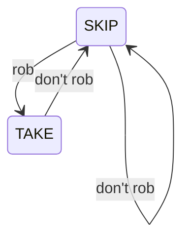

Không có:

```text
TAKE → TAKE
```

---

# 11.3 LC 213 — House Robber II

Khó khăn không nằm ở transition mới.

Nó nằm ở:

```text
first house
and
last house
```

adjacent vì circular.

Ta break circular constraint thành hai linear cases:

```text
Case 1:
rob range [0 ... n-2]

Case 2:
rob range [1 ... n-1]
```

Answer:

```text
max(case1, case2)
```

Pattern:

> Khi circular constraint tạo dependency giữa đầu và cuối, fix/exclude một boundary rồi giải bài linear.

---

# 11.4 LC 740 — Delete and Earn

Nếu chọn value `x`:

```text
không được chọn x-1
không được chọn x+1
```

Aggregate:

```text
points[x] = x * frequency[x]
```

Sau đó bài trở thành:

```text
House Robber trên value axis.
```

State:

```text
TAKE x
SKIP x
```

Transition giống House Robber.

Đây là lesson quan trọng:

> State machine thường ẩn sau một transformation.

---

# 11.5 LC 91 — Decode Ways

String digits.

Tại position `i`, có thể decode:

```text
1 digit
2 digits
```

State phổ biến:

```text
dp[i]
=
number of ways to decode prefix length i
```

Transition phụ thuộc validity:

```text
if s[i-1] forms 1-digit code:
    dp[i] += dp[i-1]

if s[i-2..i-1] forms 2-digit code:
    dp[i] += dp[i-2]
```

Đây phù hợp hơn với:

```text
Prefix / sequence DP
```

dù vẫn có thể nhìn như state transition graph.

---

# 11.6 LC 139 — Word Break

Define:

```text
dp[i]
=
prefix s[0..i) can be segmented
```

Transition:

```text
dp[j] == true
+
s[j..i) in dictionary
→
dp[i] = true
```

Graph interpretation:

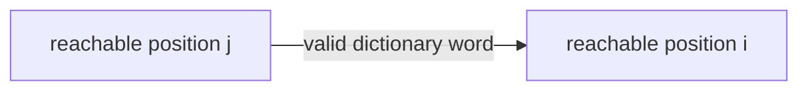

Pattern chính:

```text
Prefix reachability DP
```

không phải State Machine DP theo nghĩa hẹp.

---

# 11.7 Tại sao vẫn học các bài này?

Vì State Machine DP không phải một category tuyệt đối.

Nó là **một cách modeling**.

Ví dụ House Robber vừa có thể được nhìn là:

```text
Linear DP
```

vừa là:

```text
TAKE / SKIP state machine.
```

Điều quan trọng là modeling nào giúp bạn:

```text
1. nghĩ đúng
2. chứng minh đúng
3. implement sạch
```

---

# Part 12 — Phân biệt State Machine DP với các DP pattern khác

| Pattern        | State thường biểu diễn     | Transition          | Keyword                 | Ví dụ     |
| -------------- | -------------------------- | ------------------- | ----------------------- | --------- |
| State Machine  | mode/condition hiện tại    | action chuyển state | hold, active, cooldown  | 309, 714  |
| Knapsack       | items processed + capacity | take / skip item    | capacity, target, items | 416, 494  |
| Prefix DP      | answer cho prefix          | extend prefix       | prefix, first i         | 91, 139   |
| Subsequence DP | position / pair position   | match / skip        | subsequence             | 300, 1143 |
| Interval DP    | subarray `[l,r]`           | split interval      | interval, range         | 312, 516  |
| Grid DP        | cell `(r,c)`               | move from neighbors | matrix, path            | 62, 64    |
| Tree DP        | node + tree state          | combine children    | subtree                 | 337       |
| Bitmask DP     | subset of elements         | add/remove element  | visit all, subset       | 847       |

---

# 12.1 State Machine vs Knapsack

Knapsack:

```text
dp[i][capacity]
```

State chủ yếu nói:

```text
đã xét bao nhiêu item
còn/đã dùng bao nhiêu capacity
```

Transition:

```text
take
skip
```

State machine kiểu Stock:

```text
dp[i][HOLD]
dp[i][REST]
```

State nói:

```text
tôi đang ở mode nào
```

---

# 12.2 State Machine vs Prefix DP

Prefix DP:

```text
dp[i]
=
best/count/possible for first i items
```

Không nhất thiết có nhiều mutually-exclusive mode.

Ví dụ:

```text
Decode Ways
Word Break
```

---

# 12.3 State Machine vs Interval DP

Interval DP:

```text
dp[l][r]
```

Subproblem là:

```text
một interval
```

Transition thường:

```text
split tại k
```

Ví dụ:

```text
dp[l][r]
=
best over k
```

Hoàn toàn khác Stock:

```text
time × current mode
```

---

# Part 13 — Cách tự thiết kế State

Đây là phần quan trọng nhất.

Đừng bắt đầu bằng:

```text
dp[i][0]
dp[i][1]
```

Hãy bắt đầu bằng sáu câu hỏi.

---

# Question 1

> What information about the past do I need to know to make the next decision?

Stock II:

```text
Do I currently hold stock?
```

Cooldown:

```text
Do I hold stock?
If not, did I just sell?
```

Stock IV:

```text
Do I hold stock?
How many transactions have been used?
```

---

# Question 2

> What conditions affect which actions are legal?

Ví dụ:

```text
HOLD:
cannot BUY

COOLDOWN:
cannot BUY

transactions == k:
cannot BUY another stock
```

Mỗi condition ảnh hưởng legality có khả năng trở thành:

```text
state information.
```

---

# Question 3

> If I know the current state, do I need any other information about the past?

Đây là **sufficiency test**.

Nếu answer là YES:

> State chưa đủ.

Stock I:

```text
NOT_HOLD
```

chưa đủ vì cần biết:

```text
transaction đã dùng chưa?
```

Cooldown:

```text
NOT_HOLD
```

chưa đủ vì cần biết:

```text
just sold?
```

---

# Question 4

> What are all possible states?

State phải:

1. cover mọi legal situation;
2. ideally mutually exclusive;
3. đủ information;
4. không chứa information thừa.

---

# Question 5

> From each state, what actions are possible?

Viết bảng.

Ví dụ cooldown:

| Current state | Action | Next state |
| ------------- | ------ | ---------- |
| REST          | skip   | REST       |
| REST          | buy    | HOLD       |
| HOLD          | skip   | HOLD       |
| HOLD          | sell   | COOLDOWN   |
| COOLDOWN      | wait   | REST       |

Bảng này gần như chính là recurrence.

---

# Question 6

> After each action, which state do I enter?

Đừng chỉ hỏi:

```text
action nào?
```

Phải hỏi:

```text
action đó làm semantic condition của tôi thay đổi thế nào?
```

---

# Framework mental model

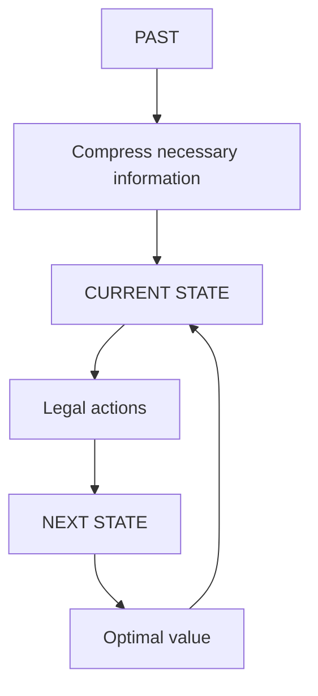

Cốt lõi của DP:

> **State = compressed past.**

Nếu state đã chứa mọi thứ cần thiết cho tương lai, ta không cần nhớ full history nữa.

Đây cũng chính là intuition của Markov-like state modeling.

---

# Part 14 — State Machine dưới dạng Graph

Một cách nhìn cực mạnh:

```text
node = state
edge = legal transition
edge weight = reward / cost
```

Ví dụ Stock:

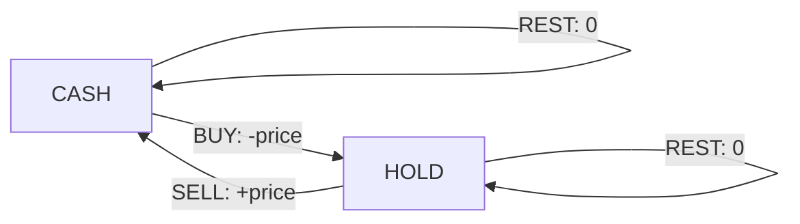

Nhưng graph này lặp lại cho từng ngày.

Nếu expand theo time:

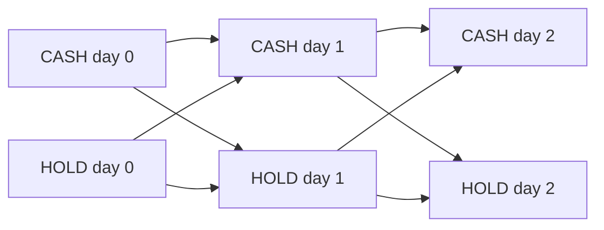

Do time luôn tiến:

```text
day i → day i+1
```

expanded graph là DAG.

DP chính là:

> Tìm optimal path trên layered DAG này mà không enumerate từng complete path.

---

# 14.1 Vì sao graph view hữu ích?

Khi bí recurrence:

1. vẽ states;
2. vẽ legal edges;
3. xem edge nào đi vào state cần tính;
4. lấy best từ tất cả incoming edges.

Ví dụ `COOLDOWN` chỉ có một incoming edge:

```text
HOLD --SELL--> COOLDOWN
```

Nên:

```text
cooldown[i]
=
hold[i-1] + price[i]
```

Recurrence tự xuất hiện.

---

# Part 15 — Top-down vs Bottom-up vs Space Optimization

Dùng Stock with Cooldown làm ví dụ.

# 15.1 Top-down thinking

Define function:

```text
dfs(day, state)
```

Meaning:

> Maximum future profit starting from `day`,
> given that I am currently in `state`.

Đây là khác với bottom-up semantic:

```text
maximum profit after processing up to day i.
```

Cả hai đúng.

---

# 15.2 Top-down example

Ta có thể dùng:

```text
canBuy = 1/0
```

và khi SELL:

```text
next day = i + 2
```

để encode cooldown.

```java
class Solution {
    private Integer[][] memo;
    private int[] prices;

    public int maxProfit(int[] prices) {
        this.prices = prices;
        this.memo = new Integer[prices.length][2];

        return dfs(0, 1);
    }

    private int dfs(int day, int canBuy) {
        if (day >= prices.length) {
            return 0;
        }

        if (memo[day][canBuy] != null) {
            return memo[day][canBuy];
        }

        int result;

        if (canBuy == 1) {
            int skip = dfs(day + 1, 1);

            int buy =
                -prices[day]
                + dfs(day + 1, 0);

            result = Math.max(skip, buy);
        } else {
            int hold = dfs(day + 1, 0);

            int sell =
                prices[day]
                + dfs(day + 2, 1);

            result = Math.max(hold, sell);
        }

        return memo[day][canBuy] = result;
    }
}
```

---

# 15.3 State ở đây khác 3-state bottom-up?

Có.

Top-down này encode cooldown bằng:

```text
SELL → day + 2
```

thay vì tạo explicit state:

```text
COOLDOWN
```

Hai modeling tương đương.

Đây là bài học quan trọng:

> Một constraint có thể được encode bằng state hoặc bằng transition structure.

---

# 15.4 So sánh

| Technique             | Strength                  | Weakness                    |
| --------------------- | ------------------------- | --------------------------- |
| Brute force recursion | dễ nghĩ action tree       | exponential                 |
| Memoization           | gần brute force intuition | recursion overhead          |
| Bottom-up             | recurrence/state rõ       | cần thiết kế order          |
| Space optimized       | nhanh/gọn                 | dễ bug nếu optimize quá sớm |

Trong interview:

```text
Recursion
→ Memo
→ Bottom-up
→ Optimize
```

là flow giải thích rất mạnh.

---

# Part 16 — Cách Trace DP đúng

Đừng chỉ viết bảng.

Mỗi ô phải trả lời:

> Nó đến từ incoming transition nào?

Ví dụ cooldown:

| Day | Price | HOLD | REST | COOLDOWN |
| --: | ----: | ---: | ---: | -------: |
|   0 |     1 |   -1 |    0 |       -∞ |
|   1 |     2 |   -1 |    0 |        1 |
|   2 |     3 |   -1 |    1 |        2 |
|   3 |     0 |    1 |    2 |       -1 |
|   4 |     2 |    1 |    2 |        3 |

Ví dụ ô:

```text
day 3 HOLD = 1
```

Không chỉ nói:

```text
max(-1, 1 - 0) = 1
```

Hãy diễn giải:

```text
Option 1:
continue holding previous stock
profit = -1

Option 2:
yesterday was REST with profit 1
buy today at price 0
profit = 1 - 0 = 1

Take max = 1
```

Đó mới là cách giải thích DP trong interview.

---

# Part 17 — Common Mistakes

## Mistake 1 — Thiếu state

Cooldown nhưng chỉ dùng:

```text
HOLD
NOT_HOLD
```

### Vì sao sai?

`NOT_HOLD` merge:

```text
REST
JUST_SOLD
```

trong khi legal actions khác nhau.

### Fix

Split:

```text
REST
COOLDOWN
```

---

# Mistake 2 — State chứa quá nhiều information

Ví dụ lưu:

```text
dp[day][buyDay][sellDay][transactions][holding]
```

trong khi tương lai chỉ cần:

```text
transactions
holding
```

### Vấn đề

State explosion.

### Rule

> Chỉ lưu information của past mà future thực sự cần.

---

# Mistake 3 — Transition sai direction

Sai:

```text
cooldown[i]
=
rest[i-1] + price[i]
```

Bạn không thể SELL từ REST.

Đúng:

```text
cooldown[i]
=
hold[i-1] + price[i]
```

---

# Mistake 4 — Dùng current-day value

Sai:

```java
hold = Math.max(hold, rest - price);
cooldown = hold + price;
```

Nếu `hold` vừa update, transition thứ hai sử dụng:

```text
current hold
```

thay vì:

```text
previous hold
```

Fix:

```java
int prevHold = hold;
```

---

# Mistake 5 — Double-count transaction

Convention:

```text
transaction completes on SELL
```

thì không được:

```text
BUY: t++
SELL: t++
```

Một BUY + SELL chỉ là:

```text
one transaction.
```

---

# Mistake 6 — Base case sai

Ví dụ:

```text
hold[0] = 0
```

nghĩa là:

> đang giữ một cổ phiếu mà chưa trả tiền.

Sai.

Phải là:

```text
hold[0] = -price[0]
```

---

# Mistake 7 — Impossible state không được xử lý

Ví dụ ngày 0:

```text
2 transactions completed
```

là impossible.

Nếu bạn đặt:

```text
0
```

có thể vô tình tạo ra invalid path.

Dùng:

```java
Integer.MIN_VALUE / 2
```

khi cần.

Tại sao `/2`?

Để tránh overflow khi cộng:

```text
MIN_VALUE + price
```

---

# Mistake 8 — Optimize space quá sớm

Bạn viết ngay:

```text
hold
cash
cooldown
```

rồi không rõ:

```text
value nào là day i?
value nào là day i-1?
```

Flow tốt hơn:

```text
semantic
→ recurrence
→ 2D
→ verify
→ optimize
```

---

# Mistake 9 — Không thống nhất transaction convention

Ví dụ định nghĩa:

```text
k = completed transactions
```

nhưng BUY lại dùng:

```text
k - 1
```

như thể BUY mới làm transaction count tăng.

Fix:

> Viết một câu bằng tiếng Anh trước code.

Ví dụ:

```text
t represents the number of completed sells.
```

---

# Mistake 10 — Cooldown là state hay constraint?

Cả hai đều có thể.

Model A:

```text
HOLD / REST / COOLDOWN
```

Model B:

```text
BUY / HOLD
SELL → jump i+2
```

Quan trọng không phải state nào “chuẩn duy nhất”.

Quan trọng là:

```text
model preserves legal transitions.
```

---

# Mistake 11 — Không xác định answer state

Cooldown:

```text
return hold
```

không hợp lý.

Cuối cùng muốn realize profit và không cần giữ stock.

Answer:

```text
max(rest, cooldown)
```

---

# Part 18 — Checklist 30 giây khi gặp bài DP

Khi interviewer đưa bài, chạy mental checklist này.

### Step 1

```text
What changes over time/index?
```

---

### Step 2

```text
What state am I currently in?
```

---

### Step 3

```text
What actions can I take from this state?
```

---

### Step 4

```text
Where does each action lead?
```

---

### Step 5

```text
What information from the past affects legal future actions?
```

---

### Step 6

Có thể viết:

```text
dp[i][state]
```

không?

Nếu chưa đủ:

```text
dp[i][k][state]
```

?

Hay:

```text
dp[i][resource][state]
```

?

---

# Interview flow

```mermaid
flowchart TD
    A["Read constraint"] --> B["Identify progression"]
    B --> C["List possible conditions"]
    C --> D["List legal actions"]
    D --> E["Draw state transitions"]
    E --> F["Define dp semantic"]
    F --> G["Derive recurrence"]
    G --> H["Base case"]
    H --> I["Answer state"]
    I --> J["Optimize space"]
```

---

# Part 19 — Practice Set theo Level

## Level 1 — Basic DP state

| Problem             | Difficulty | Pattern   | State count | Extra dimension | Time   | Space | Key insight               |
| ------------------- | ---------- | --------- | ----------: | --------------- | ------ | ----- | ------------------------- |
| 70 Climbing Stairs  | Easy       | Linear    |    implicit | no              | O(n)   | O(1)  | previous positions        |
| 198 House Robber    | Medium     | TAKE/SKIP |           2 | no              | O(n)   | O(1)  | adjacent constraint       |
| 740 Delete and Earn | Medium     | TAKE/SKIP |           2 | value axis      | O(n+m) | O(m)  | transform to House Robber |

---

## Level 2 — Basic Stock

| Problem      | Difficulty | States                       | Extra dimension  | Key insight     |
| ------------ | ---------- | ---------------------------- | ---------------- | --------------- |
| 121 Stock I  | Easy       | READY/HOLD/DONE conceptually | transaction-used | prevent rebuy   |
| 122 Stock II | Medium     | HOLD/CASH                    | no               | unlimited rebuy |

---

## Level 3 — Multiple States

| Problem      | Difficulty | States             | Key insight                 |
| ------------ | ---------- | ------------------ | --------------------------- |
| 309 Cooldown | Medium     | HOLD/REST/COOLDOWN | split NOT_HOLD              |
| 714 Fee      | Medium     | HOLD/CASH          | fee changes transition cost |

---

## Level 4 — Transaction Dimension

| Problem       | Difficulty | State     | Dimension | Complexity |
| ------------- | ---------- | --------- | --------- | ---------- |
| 123 Stock III | Hard       | HOLD/CASH | k=2       | O(nk)      |
| 188 Stock IV  | Hard       | HOLD/CASH | k         | O(nk)      |

---

## Level 5 — State recognition

Các bài rất đáng luyện:

```text
801. Minimum Swaps To Make Sequences Increasing
926. Flip String to Monotone Increasing
1186. Maximum Subarray Sum with One Deletion
1262. Greatest Sum Divisible by Three
1493. Longest Subarray of 1's After Deleting One Element
1911. Maximum Alternating Subsequence Sum
2140. Solving Questions With Brainpower
2786. Visit Array Positions to Maximize Score
```

Ở đây state không còn là:

```text
BUY / SELL
```

nhưng cách hỏi vẫn giống hệt:

> What information about the past changes my next legal/optimal decision?

---

# Part 20 — Java Implementation Strategy

Một flow luyện rất tốt cho mỗi bài:

```text
1. Brute-force recursion
2. Memoization
3. Bottom-up table
4. Space optimization
5. Final interview-ready version
```

---

# 20.1 Generic Top-down Template

```java
int dfs(int index, int state) {
    if (index == n) {
        return baseValue(state);
    }

    if (memo[index][state] != null) {
        return memo[index][state];
    }

    int answer = IMPOSSIBLE;

    for (Action action : legalActions(state)) {
        int nextState = transition(state, action);

        answer = Math.max(
            answer,
            value(action, index)
                + dfs(index + 1, nextState)
        );
    }

    return memo[index][state] = answer;
}
```

Conceptual template thôi, không phải Java LeetCode code trực tiếp.

---

# 20.2 Generic Bottom-up Template

```java
for (int i = 1; i < n; i++) {
    for (int newState = 0; newState < stateCount; newState++) {

        dp[i][newState] = IMPOSSIBLE;

        for (int oldState = 0; oldState < stateCount; oldState++) {
            if (!canTransition(oldState, newState)) {
                continue;
            }

            dp[i][newState] = Math.max(
                dp[i][newState],
                dp[i - 1][oldState]
                    + transitionValue(oldState, newState, i)
            );
        }
    }
}
```

Đây là graph DP tổng quát.

---

# 20.3 Khi nào optimize xuống O(1)?

Nếu recurrence chỉ đọc:

```text
dp[i-1][...]
```

thì full `i` dimension không cần giữ.

Ta chỉ cần:

```text
previous states
current states
```

Space:

```text
O(n × S)
→
O(S)
```

Nếu `S` constant:

```text
O(S) = O(1)
```

Ví dụ:

```text
3 states
```

thì:

```text
O(3)
=
O(1)
```

---

# Part 21 — Cách trình bày trong Interview

Một template nói tự nhiên:

> I think this problem can be modeled as a state machine because the actions available at the current step depend on the condition I'm currently in. I'll define `dp[i][state]` as the best value after processing up to index `i` while ending in that state. Then I'll list the legal transitions from each state. For every destination state, I take the best value among all legal previous states plus the cost or reward of that transition. After that I'll define the initial states and determine which final states are valid answers. Since each row only depends on the previous row, I can potentially optimize the space.

Khoảng 45–60 giây nhưng nói được gần như toàn bộ reasoning.

---

# 21.1 Khi thêm transaction dimension

> Holding or not holding is not sufficient because future actions also depend on how many transactions I've already used. So I'll add transaction count as another dimension. My state becomes `dp[day][transactions][holding]`. I'll define a transaction as completed when I sell, which means buying keeps the transaction count unchanged and selling increases it by one. This convention keeps the transitions consistent.

---

# 21.2 Khi phát hiện thiếu state

Một câu rất hay trong interview:

> These two histories currently look the same because I'm not holding a stock, but they have different legal actions in the future. Therefore they cannot be represented by the same DP state.

Đây chính là reasoning của Cooldown.

---

# Part 22 — Master Template

## 22.1 State

Luôn bắt đầu bằng semantic:

```text
dp[i][state]
=
optimal value after processing input up to i
while ending in `state`
```

Nếu cần resource:

```text
dp[i][resource][state]
=
optimal value after processing input up to i
using `resource`
while ending in `state`
```

---

# 22.2 Transition

Generic:

```text
dp[i][newState]
=
best {
    dp[i-1][oldState]
    + transitionValue
}
```

với mọi:

```text
oldState → newState
```

hợp lệ.

---

# 22.3 Base Case

Hỏi:

```text
Before processing anything,
which states are possible?
```

Ví dụ:

```text
cash = 0
hold = impossible
```

hoặc day 0:

```text
hold = -price[0]
cash = 0
```

---

# 22.4 Answer

Hỏi:

```text
Which ending states represent a completed valid solution?
```

Ví dụ:

```text
max(rest, cooldown)
```

không phải:

```text
hold
```

---

# 22.5 Time Complexity

Nếu có:

```text
n steps
S states
```

và mỗi state xét `T` incoming transitions:

```text
O(n × S × T)
```

Với số state/edge constant:

```text
O(n)
```

Nếu thêm transaction count `k`:

```text
O(nk)
```

---

# 22.6 Space Complexity

Full table:

```text
O(nS)
```

Nếu chỉ phụ thuộc previous row:

```text
O(S)
```

Nếu S constant:

```text
O(1)
```

Transaction dimension:

```text
O(k)
```

---

# Master Template 1 — HOLD / NOT_HOLD

Use when:

```text
currently own resource?
```

```mermaid
stateDiagram-v2
    CASH --> HOLD: acquire
    HOLD --> CASH: release
    CASH --> CASH: rest
    HOLD --> HOLD: rest
```

Examples:

```text
Stock II
Stock with Fee
```

---

# Master Template 2 — TAKE / SKIP

Use when:

```text
taking current item affects whether next item can be taken.
```

```mermaid
stateDiagram-v2
    SKIP --> TAKE: choose
    SKIP --> SKIP: skip
    TAKE --> SKIP: skip
```

Example:

```text
House Robber
```

---

# Master Template 3 — REST / ACTIVE / COOLDOWN

Use when:

```text
after an action you enter a temporary restricted condition.
```

```mermaid
stateDiagram-v2
    REST --> ACTIVE: start
    ACTIVE --> ACTIVE: continue
    ACTIVE --> COOLDOWN: stop
    COOLDOWN --> REST: wait
```

Examples:

```text
Stock Cooldown
activity scheduling
rate limiting-like DP
```

---

# Master Template 4 — State × Transaction Count

```text
dp[i][k][state]
```

Use khi:

```text
state quyết định mode
k quyết định resource đã dùng
```

```mermaid
flowchart LR
    A["CASH k=0"] --> B["HOLD k=0"]
    B --> C["CASH k=1"]
    C --> D["HOLD k=1"]
    D --> E["CASH k=2"]
```

Examples:

```text
Stock III
Stock IV
```

---

# Master Template 5 — State × Remaining Resource

```text
dp[i][state][remaining]
```

Ví dụ:

```text
remaining deletions
remaining operations
remaining skips
remaining changes
```

Key question:

> Action nào consume resource?

---

# Master Template 6 — Previous Choice State

Use when:

```text
current reward/cost depends on previous category.
```

State:

```text
dp[i][lastChoice]
```

Ví dụ:

```text
choose A/B
switching has cost
same action consecutively forbidden
```

---

# Master Template 7 — Automaton / Character State

Dùng khi đọc string từ trái sang phải và cần biết:

```text
pattern progress hiện tại
```

Ví dụ state:

```text
START
SEEN_A
SEEN_AB
VALID
INVALID
```

Có thể kết hợp:

```text
index × automaton state
```

---

# Master Template 8 — Remainder State

Ví dụ maximize sum divisible by 3.

State:

```text
remainder = 0,1,2
```

```text
dp[i][r]
=
maximum sum using first i values
whose remainder modulo 3 is r
```

Action:

```text
take
skip
```

Next state:

```text
newRemainder
=
(oldRemainder + num[i]) % 3
```

Đây cũng là State Machine DP.

---

# Master Template 9 — Used Special Operation

Một pattern cực kỳ thường gặp:

```text
state = special action used?
```

Ví dụ:

```text
0 = chưa delete
1 = đã delete
```

State:

```text
dp[i][used]
```

Áp dụng cho:

```text
at most one deletion
at most one modification
at most one coupon
at most one exception
```

Đây chính là một finite-state machine:

```mermaid
stateDiagram-v2
    UNUSED --> UNUSED: normal action
    UNUSED --> USED: use special action
    USED --> USED: normal action
```

Không có:

```text
USED → UNUSED
```

---

# Master Template 10 — Phase State

Một quá trình phải đi qua các phase:

```text
phase 0
→ phase 1
→ phase 2
→ phase 3
```

Ví dụ Stock 2 transactions:

```mermaid
flowchart LR
    A["No action"] --> B["Bought #1"]
    B --> C["Sold #1"]
    C --> D["Bought #2"]
    D --> E["Sold #2"]
```

Thay vì `transaction × holding`, đôi khi bạn có thể flatten thành:

```text
4–5 phases
```

Ví dụ variables:

```text
buy1
sell1
buy2
sell2
```

Đó không phải magic formula.

Nó chỉ là một state machine đã được flatten.

---

# 10 bài để tự thiết kế State

Đừng xem solution trước khi tự trả lời bốn câu:

```text
1. States?
2. Transitions?
3. Base case?
4. Answer?
```

---

## Exercise 1 — Maximum Alternating Subsequence Sum

Cho `nums`.

Chọn một subsequence sao cho score:

```text
nums[0] - nums[1] + nums[2] - nums[3] + ...
```

lớn nhất.

Example:

```text
nums = [4,2,5,3]

answer = 7
```

Hãy xác định state cần nhớ về subsequence đã chọn.

---

## Exercise 2 — Maximum Subarray Sum with One Deletion

Cho array.

Chọn một non-empty subarray.

Bạn được delete tối đa một element.

Example:

```text
[1,-2,0,3]

answer = 4
```

Hãy nghĩ:

```text
special operation đã dùng chưa?
```

---

## Exercise 3 — Minimum Swaps To Make Sequences Increasing

Có hai array `nums1`, `nums2`.

Tại cùng index `i`, bạn có thể swap:

```text
nums1[i] ↔ nums2[i]
```

Mục tiêu làm cả hai array strictly increasing với số swap nhỏ nhất.

Hãy nghĩ:

> Tại index trước, tôi đã swap hay chưa?

---

## Exercise 4 — Flip String to Monotone Increasing

Binary string cần trở thành dạng:

```text
000...111
```

bằng minimum flips.

Example:

```text
"00110"

answer = 1
```

Hãy thử thiết kế phase states:

```text
ZERO_PHASE
ONE_PHASE
```

---

## Exercise 5 — Greatest Sum Divisible by Three

Chọn subset sao cho tổng:

```text
divisible by 3
```

và maximum.

Example:

```text
[3,6,5,1,8]

answer = 18
```

Hãy nghĩ state:

```text
remainder
```

---

## Exercise 6 — Stock with Cooldown

```text
prices = [1,2,3,0,2]
```

Tự viết:

```text
states
actions
transitions
base
answer
```

mà không nhìn phần trên.

---

## Exercise 7 — Stock IV

Input:

```text
k = 2
prices = [3,2,6,5,0,3]
```

Output:

```text
7
```

Hãy tự quyết định:

```text
k tăng khi BUY
hay
k tăng khi SELL
```

rồi giữ convention đó xuyên suốt.

---

## Exercise 8 — Activity with Cooldown

Mỗi ngày có reward.

Bạn có thể ACTIVE hoặc REST.

Sau khi dừng ACTIVE, bắt buộc nghỉ một ngày trước khi ACTIVE lại.

Hãy tự thiết kế states.

---

## Exercise 9 — At Most One Coupon

Bạn đi qua `n` items, mỗi item có cost.

Bạn phải chọn một số item theo rule nào đó và được dùng coupon giảm cost đúng tối đa một lần.

Hãy nghĩ state:

```text
couponUsed
```

---

## Exercise 10 — K Restricted Operations

Bạn xử lý array từ trái sang phải.

Mỗi index có:

```text
normal action
special action
```

nhưng special action chỉ được dùng tối đa `k` lần.

Hãy thử state:

```text
dp[i][used][mode]
```

và tự hỏi:

> `mode` có thật sự cần không?

Nếu không:

```text
dp[i][used]
```

đã đủ.

Đây là bài luyện **minimal state design**.

---

# Final Mental Model

Khi gặp một bài mới, đừng hỏi:

> Công thức DP bài này là gì?

Hãy hỏi:

```mermaid
flowchart TD
    A["What changes over time?"] --> B["What do I need to remember about the past?"]
    B --> C["CURRENT STATE"]
    C --> D["What actions are legal?"]
    D --> E["Where does each action lead?"]
    E --> F["STATE TRANSITIONS"]
    F --> G["Define dp semantics"]
    G --> H["Write recurrence"]
    H --> I["Base case"]
    I --> J["Answer state"]
    J --> K["Optimize space"]
```

Và câu quan trọng nhất là:

> **What information about the past do I need to know to make the next decision?**

Nếu câu trả lời là:

```text
whether I hold stock
```

state:

```text
HOLD / CASH
```

Nếu là:

```text
whether I just sold
```

thêm:

```text
COOLDOWN
```

Nếu là:

```text
how many transactions I used
```

thêm:

```text
transaction dimension
```

Nếu là:

```text
whether special operation was already used
```

thêm:

```text
USED / UNUSED
```

Nếu là:

```text
current remainder
```

state:

```text
remainder 0/1/2
```

Đó chính là tư tưởng tổng quát của State Machine DP.

---

# Công thức không phải thứ cần nhớ

Bạn có thể quên:

```text
hold = max(...)
cash = max(...)
```

Nhưng nếu nhớ:

```text
State = minimal information from the past needed for future decisions.
```

và:

```text
Transition = legal action that changes that information.
```

thì bạn có thể tự dựng lại recurrence.

---

# Một câu chốt để nhớ

> **PAST → compress into STATE → choose ACTION → move through TRANSITION → keep the BEST VALUE for each new STATE.**

Hay ngắn hơn:

> **Nhìn ra state → vẽ legal transitions → recurrence tự xuất hiện.**
