# Bài giảng chuyên sâu: Hash Table / HashMap / HashSet cho Coding Interview

Bài này được tổ chức đúng theo hướng trong prompt: **trực quan → bản chất → implementation Java → pattern recognition → LeetCode → interview explanation**. Trọng tâm không phải học thuộc lời giải, mà là nhìn đề và nhận ra **khi nào Hash Table biến một thao tác tìm kiếm từ `O(n)` thành average `O(1)`**. 

---

# 1. Hash Table Fundamentals

## 1.1 Hash Table là gì?

Hash Table là cấu trúc dữ liệu lưu dữ liệu theo mô hình:

```text
Key → Value
```

Ví dụ:

```text
"name" → "Quan"
"age"  → 24
"id"   → 1024
```

Điểm đặc biệt là thay vì tìm tuần tự qua tất cả phần tử như Array/List, Hash Table dùng **key để tính trực tiếp vị trí gần nơi dữ liệu được lưu**.

Ý tưởng cốt lõi:

```text
Key
 ↓
Hash Function
 ↓
Hash Value
 ↓
Index / Bucket
 ↓
Value
```

### Mermaid

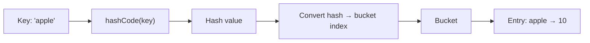

Prompt yêu cầu đặc biệt làm rõ `Key → Hash → Index`, bucket, load factor, collision và lý do Hash Table có average `O(1)`. 

---

# 1.2 Vì sao cần Hash Table?

Giả sử có:

```java
int[] nums = {8, 4, 12, 5, 9, 20};
```

Bạn muốn biết:

```text
Có số 9 không?
```

Với array không sort:

```text
8 → không
4 → không
12 → không
5 → không
9 → có
```

Worst case:

```text
O(n)
```

Nhưng nếu đưa dữ liệu vào:

```java
HashSet<Integer> set
```

thì kiểm tra:

```java
set.contains(9)
```

average:

```text
O(1)
```

Đây chính là lý do Hash Table xuất hiện cực kỳ nhiều trong coding interview:

> **Trade memory để giảm lookup time.**

---

# 1.3 Hash Function là gì?

Hash function nhận một key và tạo ra một giá trị số:

```text
key → hash value
```

Ví dụ tưởng tượng:

```text
"apple"  → 981
"banana" → 542
"orange" → 127
```

Sau đó Hash Table chuyển hash thành bucket index.

Ví dụ table có:

```text
capacity = 8
```

Ta có thể tưởng tượng đơn giản:

```text
index = hash % capacity
```

Ví dụ:

```text
981 % 8 = 5
```

nên `"apple"` có thể nằm ở bucket `5`.

> Java HashMap thực tế có thêm bước xử lý hash chứ không đơn giản chỉ gọi `%`, nhưng mô hình này rất tốt để hiểu bản chất.

---

# 1.4 Bucket là gì?

Hash Table không nên được tưởng tượng như:

```text
key → một ô duy nhất
```

Mà chính xác hơn là:

```text
Hash Table
   ↓
Array of buckets
```

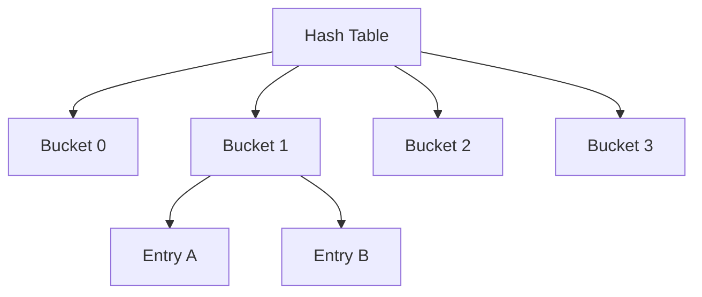

Một bucket có thể chứa nhiều entry vì nhiều key khác nhau có thể tạo ra cùng bucket index.

Đó chính là **collision**.

---

# 1.5 Collision là gì?

Giả sử:

```text
capacity = 5
```

và:

```text
hash(A) = 12
hash(B) = 17
```

Ta tính:

```text
12 % 5 = 2
17 % 5 = 2
```

Cả `A` và `B` cùng muốn vào:

```text
bucket 2
```

Đây là collision.

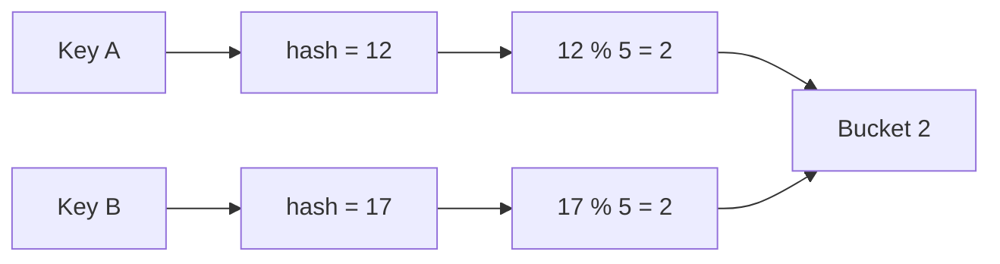

Collision **không phải bug**.

Nó là hiện tượng tự nhiên của hashing.

Vì số lượng key có thể gần như vô hạn trong khi bucket hữu hạn, theo pigeonhole principle collision chắc chắn có thể xảy ra.

---

# 1.6 Separate Chaining

Cách phổ biến để giải quyết collision:

```text
Mỗi bucket chứa một collection các entry.
```

Ví dụ:

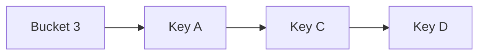

Có thể tưởng tượng nó như:

```text
bucket[3]

A → C → D
```

Khi tìm `C`:

```text
1. hash(C)
2. tìm bucket
3. scan entry trong bucket
4. dùng equals() để tìm đúng key
```

Nếu hash phân bố tốt:

```text
mỗi bucket rất ít entry
```

→ lookup gần `O(1)`.

Nếu tất cả key đổ vào một bucket:

```text
A → B → C → D → E → ... → n
```

thì lookup:

```text
O(n)
```

---

# 1.7 Open Addressing

Khác với Separate Chaining.

Nếu vị trí mong muốn đã bị chiếm:

```text
không tạo list trong bucket
```

mà tìm một slot khác trong chính table.

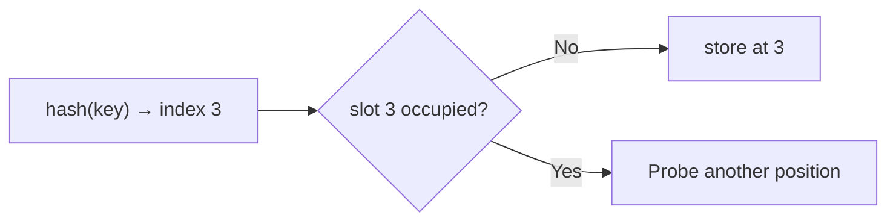

Ba kỹ thuật phổ biến:

### Linear Probing

```text
index
index + 1
index + 2
index + 3
...
```

Ví dụ:

```text
hash → 4

bucket 4 occupied
bucket 5 occupied
bucket 6 empty

→ insert bucket 6
```

Ưu:

```text
simple
cache-friendly
```

Nhược:

```text
primary clustering
```

---

## Quadratic Probing

Không đi:

```text
+1, +2, +3
```

mà:

```text
+1²
+2²
+3²
```

Ví dụ:

```text
h
h + 1
h + 4
h + 9
...
```

Giảm clustering so với linear probing.

---

## Double Hashing

Dùng hash function thứ hai để quyết định step:

```text
index = h1(key) + i * h2(key)
```

Hai key collide ở hash đầu tiên vẫn có khả năng probe theo hai đường khác nhau.

---

# 1.8 Vì sao average O(1)?

Đây là câu interviewer rất có thể hỏi.

Giả sử:

```text
n = số entry
m = số bucket
```

Load factor:

```text
α = n / m
```

Nếu Hash Table resize hợp lý và hash function phân bố tốt thì `α` được giữ ở mức giới hạn.

Số entry trung bình cần kiểm tra trong một bucket gần như constant.

Vì vậy:

```text
search  ≈ O(1)
insert  ≈ O(1)
delete  ≈ O(1)
```

### Interview answer

> A hash table uses the key's hash to determine the bucket where the entry should be stored. With a well-distributed hash function and a controlled load factor, each bucket contains only a small number of entries on average, so lookup, insertion and deletion are expected to take constant time.

---

# 1.9 Vì sao worst case O(n)?

Giả sử hash function cực tệ:

```text
hash(A) → bucket 0
hash(B) → bucket 0
hash(C) → bucket 0
...
hash(N) → bucket 0
```

Hash Table gần như biến thành:

```text
bucket 0:

A → B → C → D → ... → N
```

Lookup cuối danh sách:

```text
O(n)
```

Do đó với **generic Hash Table**:

| Operation | Average |  Worst |
| --------- | ------: | -----: |
| Search    |  `O(1)` | `O(n)` |
| Insert    |  `O(1)` | `O(n)` |
| Delete    |  `O(1)` | `O(n)` |

Prompt cũng yêu cầu phân biệt rõ average `O(1)` với worst-case `O(n)`. 

---

# 1.10 Load Factor

Load factor đo Hash Table đang “đầy” đến mức nào:

```text
load factor = number of entries / number of buckets
```

Ví dụ:

```text
entries = 12
capacity = 16

load factor = 12 / 16 = 0.75
```

Load factor cao:

```text
+ tiết kiệm memory
- collision nhiều hơn
```

Load factor thấp:

```text
+ collision ít hơn
+ lookup nhanh hơn

- tốn memory hơn
```

Đây là trade-off:

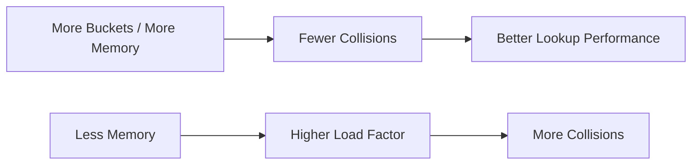

---

# 1.11 Rehashing / Resize

Khi Hash Table quá đầy:

```text
load factor > threshold
```

table thường tăng capacity.

Ví dụ:

```text
16 buckets
↓
32 buckets
```

Nhưng không thể chỉ copy entry cùng index.

Tại sao?

Vì:

```text
index = hash relative to capacity
```

capacity thay đổi → index có thể thay đổi.

Ví dụ:

```text
hash = 20

20 % 8  = 4
20 % 16 = 4
```

nhưng:

```text
hash = 13

13 % 8  = 5
13 % 16 = 13
```

Entry cần được phân bố lại.

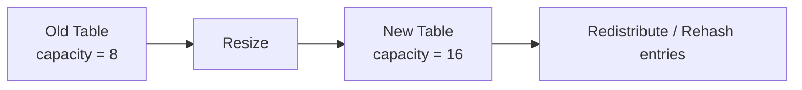

Một lần resize:

```text
O(n)
```

nhưng không xảy ra mỗi lần insert.

Vì vậy insert vẫn được xem là:

```text
O(1) amortized
```

---

# 2. Hash Table trong Java

Prompt yêu cầu tập trung Java vì đây là ngôn ngữ luyện LeetCode. 

---

# 2.1 Map<K,V>

`Map` là interface:

```java
Map<K, V>
```

Ví dụ:

```java
Map<String, Integer> ages = new HashMap<>();

ages.put("Quan", 24);
ages.put("Nam", 25);

System.out.println(ages.get("Quan"));
```

Ý tưởng:

```text
key → value
```

---

# 2.2 HashMap

Ví dụ:

```java
Map<String, Integer> freq = new HashMap<>();

freq.put("apple", 1);
freq.put("banana", 2);

freq.get("apple");
freq.containsKey("banana");
freq.remove("apple");
```

Các method coding interview cực hay dùng:

```java
map.put(key, value);

map.get(key);

map.getOrDefault(key, defaultValue);

map.containsKey(key);

map.remove(key);

map.size();
```

Ví dụ frequency:

```java
map.put(
    num,
    map.getOrDefault(num, 0) + 1
);
```

---

# 2.3 HashSet

Set chỉ quan tâm:

```text
element tồn tại hay không
```

không cần value.

```java
Set<Integer> seen = new HashSet<>();

seen.add(5);
seen.add(10);

if (seen.contains(5)) {
    System.out.println("Found");
}
```

Conceptually có thể nghĩ:

```text
HashSet<T>

≈

HashMap<T, dummyValue>
```

Dùng khi câu hỏi chỉ cần:

```text
Have I seen this before?
```

---

# 2.4 HashMap vs HashSet

Ví dụ bài Contains Duplicate:

Không cần:

```text
number → frequency
```

chỉ cần:

```text
number đã từng xuất hiện?
```

→ `HashSet`.

Trong khi bài Top K Frequent Elements cần:

```text
number → count
```

→ `HashMap`.

---

# 2.5 LinkedHashMap

`LinkedHashMap` kết hợp hashing với linked ordering.

Có thể duy trì:

```text
insertion order
```

hoặc access order tùy cách sử dụng.

Concept:

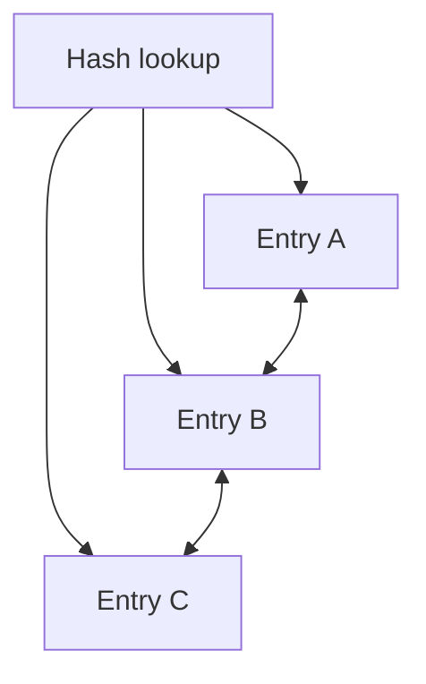

Hashing:

```text
lookup nhanh
```

Linked ordering:

```text
duy trì thứ tự
```

Một ứng dụng nổi tiếng:

```text
LRU cache
```

---

# 2.6 TreeMap

`TreeMap` không phải Hash Table.

Nó duy trì key:

```text
sorted
```

Operations thường:

```text
O(log n)
```

Ví dụ:

```java
Map<Integer, String> map = new TreeMap<>();

map.put(5, "five");
map.put(1, "one");
map.put(3, "three");

System.out.println(map);
```

Output:

```text
1
3
5
```

---

# 2.7 HashMap vs TreeMap

| Feature                 | HashMap         | TreeMap        |
| ----------------------- | --------------- | -------------- |
| Search                  | avg `O(1)`      | `O(log n)`     |
| Insert                  | avg `O(1)`      | `O(log n)`     |
| Ordered                 | No guarantee    | Sorted by key  |
| Range queries           | Poor            | Good           |
| Need min/max key        | Awkward         | Natural        |
| Typical interview usage | Lookup/counting | Ordered lookup |

Rule:

```text
Need fast lookup only
→ HashMap

Need keys sorted/range/floor/ceiling
→ TreeMap
```

---

# 2.8 TreeSet

`TreeSet`:

```text
Set + sorted order
```

```java
Set<Integer> set = new TreeSet<>();

set.add(5);
set.add(1);
set.add(3);
```

iteration:

```text
1 3 5
```

Operations:

```text
O(log n)
```

---

# 2.9 equals() và hashCode()

Đây là phần cực kỳ quan trọng với Backend Java.

Giả sử:

```java
class User {
    int id;

    User(int id) {
        this.id = id;
    }
}
```

Ta tạo:

```java
User a = new User(1);
User b = new User(1);
```

Business-wise:

```text
a và b có cùng id
```

nhưng Java object identity lại khác.

Nếu muốn HashMap xem chúng là cùng key, phải định nghĩa equality đúng.

---

## Contract

Nguyên tắc quan trọng:

```text
Nếu:

a.equals(b) == true

thì bắt buộc:

a.hashCode() == b.hashCode()
```

Chiều ngược lại không bắt buộc.

Có thể:

```text
a.hashCode() == b.hashCode()
```

nhưng:

```text
a.equals(b) == false
```

→ collision.

---

## Vì sao?

HashMap tìm key theo logic khái niệm:

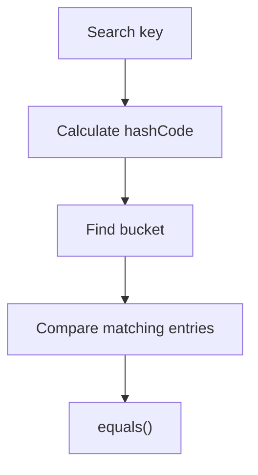

`hashCode()` giúp:

```text
tìm vùng dữ liệu
```

`equals()` giúp:

```text
xác nhận đúng object
```

---

# 2.10 Override equals nhưng không override hashCode

Ví dụ:

```java
@Override
public boolean equals(Object obj) {
    ...
}
```

nhưng để `hashCode()` mặc định.

Hai object có thể:

```text
equals() == true
```

nhưng:

```text
hashCode khác nhau
```

HashMap tìm chúng ở hai bucket khác nhau.

Kết quả:

```text
put(key1, value)

get(key2)
```

có thể không tìm được dù:

```text
key1.equals(key2) == true
```

---

# 2.11 Mutable Key

Đây là một bug rất nguy hiểm.

```java
Map<User, String> map = new HashMap<>();

User user = new User(1);

map.put(user, "data");
```

Sau đó:

```java
user.id = 999;
```

Nếu `id` tham gia `hashCode()`:

```text
hashCode trước ≠ hashCode sau
```

HashMap entry vẫn đang nằm ở bucket cũ.

Nhưng lookup lại tính hash mới.

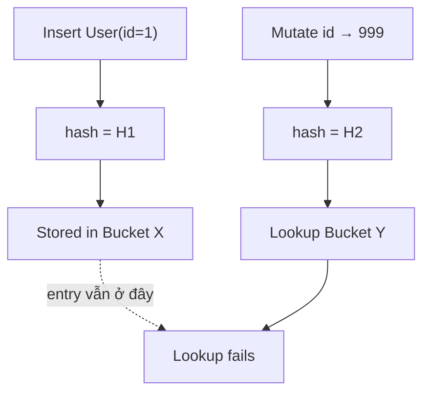

Rule:

> **Prefer immutable keys.**

---

# 3. Core Hashing Pattern Catalog

Prompt yêu cầu xây dựng pattern catalog thay vì học solution riêng lẻ. 

---

# Pattern 1 — Frequency Map

## Recognition

Đề có những từ như:

```text
frequency
count
occurrence
most frequent
same characters
how many times
```

Core structure:

```text
value → count
```

Ví dụ:

```text
[1,1,2,2,2,3]

1 → 2
2 → 3
3 → 1
```

Java template:

```java
Map<Integer, Integer> freq = new HashMap<>();

for (int num : nums) {
    freq.put(
        num,
        freq.getOrDefault(num, 0) + 1
    );
}
```

Complexity:

```text
Time:  O(n) average
Space: O(k)
```

`k` = số distinct values.

Ứng dụng:

```text
Valid Anagram
Top K Frequent Elements
Majority counting
Character frequency
```

---

# Pattern 2 — Complement Lookup

Classic:

```text
a + b = target
```

Nếu hiện tại đang xét:

```text
a
```

thì cần:

```text
b = target - a
```

Thay vì tìm `b` bằng loop:

```text
O(n)
```

ta lookup bằng HashMap:

```text
O(1)
```

Tổng:

```text
O(n²) → O(n)
```

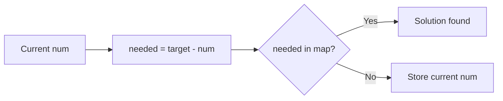

Template:

```java
Map<Integer, Integer> map = new HashMap<>();

for (int i = 0; i < nums.length; i++) {

    int need = target - nums[i];

    if (map.containsKey(need)) {
        return new int[]{map.get(need), i};
    }

    map.put(nums[i], i);
}
```

---

# Pattern 3 — Seen Set

Question:

```text
Have I already seen this value?
```

Template:

```java
Set<Integer> seen = new HashSet<>();

for (int num : nums) {

    if (seen.contains(num)) {
        // duplicate / cycle / previously visited
    }

    seen.add(num);
}
```

Hoặc ngắn hơn:

```java
if (!seen.add(num)) {
    return true;
}
```

Applications:

```text
Contains Duplicate
Happy Number
Cycle state detection
Longest Consecutive Sequence
```

---

# Pattern 4 — Value → Index

Khác Seen Set.

Seen Set:

```text
value → exists?
```

Value-to-index:

```text
value → where?
```

Ví dụ:

```text
2 → index 0
7 → index 1
```

Dùng khi cần:

```text
return indices
distance between occurrences
earliest position
latest position
```

Template:

```java
Map<Integer, Integer> indexMap = new HashMap<>();

for (int i = 0; i < nums.length; i++) {
    indexMap.put(nums[i], i);
}
```

Điểm cần suy nghĩ:

```text
store earliest index?
store latest index?
```

Đây là lỗi interview rất phổ biến.

---

# Pattern 5 — Grouping

Structure:

```text
groupKey → list of elements
```

Ví dụ:

```text
anagram signature
       ↓
list of strings
```

```text
"aet" → ["eat", "tea", "ate"]
"ant" → ["tan", "nat"]
```

Template:

```java
Map<String, List<String>> groups = new HashMap<>();

for (String s : strs) {

    String key = buildKey(s);

    groups
        .computeIfAbsent(key, k -> new ArrayList<>())
        .add(s);
}
```

Core insight:

> Tìm một **canonical representation** sao cho những phần tử cùng group có cùng key.

---

# Pattern 6 — Hashing + String

String problems thường biến thành:

```text
character → frequency
```

hoặc:

```text
character → last index
```

hoặc:

```text
signature → group
```

Ví dụ:

```text
"eat"

e → 1
a → 1
t → 1
```

Nếu chỉ có lowercase English letters, đôi khi:

```java
int[26]
```

tốt hơn HashMap.

Đây là điểm rất quan trọng:

> Đừng overengineering bằng HashMap nếu domain nhỏ và cố định.

---

# Pattern 7 — Prefix Sum + HashMap

Một trong những pattern quan trọng nhất.

## Công thức nền tảng

Prefix:

```text
prefix[j] = nums[0] + ... + nums[j]
```

Sum subarray `i..j`:

```text
prefix[j] - prefix[i - 1]
```

Nếu muốn:

```text
subarray sum = k
```

thì:

```text
prefix[j] - prefix[i - 1] = k
```

suy ra:

```text
prefix[i - 1] = prefix[j] - k
```

Đây chính là complement lookup nhưng trên prefix sum.

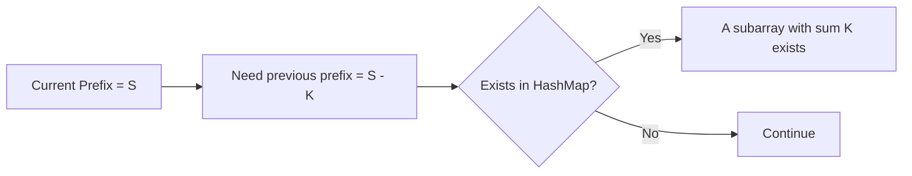

---

## prefixSum → frequency

Dùng khi cần:

```text
COUNT bao nhiêu subarray
```

Ví dụ LeetCode 560.

```java
Map<Integer, Integer> freq = new HashMap<>();

freq.put(0, 1);

int prefix = 0;
int count = 0;

for (int num : nums) {

    prefix += num;

    count += freq.getOrDefault(prefix - k, 0);

    freq.put(
        prefix,
        freq.getOrDefault(prefix, 0) + 1
    );
}
```

Tại sao:

```java
freq.put(0, 1);
```

?

Nó đại diện cho:

```text
prefix trước khi array bắt đầu = 0
```

Nhờ vậy nếu:

```text
prefix == k
```

thì:

```text
prefix - k = 0
```

subarray `[0..current]` được tính.

---

## prefixSum → earliest index

Dùng khi cần:

```text
LONGEST subarray
```

Ta muốn khoảng cách:

```text
currentIndex - previousIndex
```

Muốn longest → giữ index nhỏ nhất.

```java
map.putIfAbsent(prefix, i);
```

chứ không overwrite liên tục.

---

# Pattern 8 — HashMap + Sliding Window

Recognition:

```text
substring
subarray
contiguous
longest
shortest
at most
exactly K distinct
no repeating
```

Architecture:

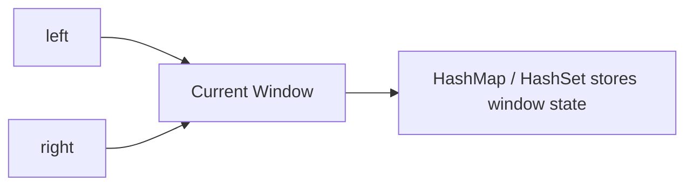

Hai operations:

```text
expand right
shrink left
```

Hash structure giữ:

```text
frequency
existence
last position
```

Ví dụ:

```text
Longest Substring Without Repeating Characters
Minimum Window Substring
```

---

# Pattern 9 — HashMap + Doubly Linked List

Classic:

```text
LRU Cache
```

Requirements:

```text
get(key) → O(1)

put(key) → O(1)

move item to most recently used → O(1)

remove least recently used → O(1)
```

HashMap giải quyết:

```text
key → node
```

Doubly linked list giải quyết:

```text
recency order
```

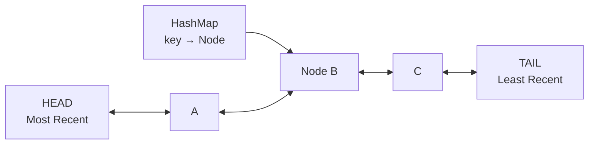

Tại sao HashMap một mình không đủ?

HashMap biết:

```text
node ở đâu
```

nhưng không biết hiệu quả:

```text
ai least recently used?
```

Linked list xử lý ordering.

---

# Pattern 10 — Hashing + Sorting

Đây không phải đối thủ tuyệt đối.

Nhiều bài dùng:

```text
HashMap → count/group
Sorting → ordering
```

Ví dụ Top K Frequent:

```text
HashMap
↓
value → frequency

then

Heap / sorting
↓
rank by frequency
```

---

# HashMap vs Sorting

Nếu chỉ cần detect duplicate:

### Sorting

```text
sort
scan adjacent

O(n log n)
```

### HashSet

```text
insert while scanning

average O(n)
```

Nhưng sorting có ưu điểm:

```text
lower conceptual complexity
possibly less auxiliary memory depending algorithm
ordered output
```

Không nên mặc định:

```text
HashMap luôn tốt hơn sorting
```

---

# 4. Những bài LeetCode đại diện

Prompt yêu cầu học theo level từ Basic Hashing → Frequency/Grouping → Prefix Sum → Sliding Window → Design → Advanced. 

Tôi chọn các bài đại diện sao cho mỗi bài tương ứng một pattern quan trọng.

---

# Problem 1 — LeetCode 1: Two Sum

## Problem

Cho array:

```text
nums
```

và:

```text
target
```

Tìm hai index khác nhau sao cho:

```text
nums[i] + nums[j] = target
```

Example:

```text
nums = [2,7,11,15]
target = 9

Output:
[0,1]
```

---

## Pattern Recognition

Keyword:

```text
two numbers
sum = target
find pair
return indices
```

Đây là:

```text
Complement Lookup
+
Value → Index
```

---

## Brute Force

```java
for (int i = 0; i < nums.length; i++) {
    for (int j = i + 1; j < nums.length; j++) {

        if (nums[i] + nums[j] == target) {
            return new int[]{i, j};
        }
    }
}
```

Complexity:

```text
Time:  O(n²)
Space: O(1)
```

---

## Optimal

```java
public int[] twoSum(int[] nums, int target) {

    Map<Integer, Integer> map = new HashMap<>();

    for (int i = 0; i < nums.length; i++) {

        int need = target - nums[i];

        if (map.containsKey(need)) {
            return new int[]{
                map.get(need),
                i
            };
        }

        map.put(nums[i], i);
    }

    return new int[0];
}
```

### Dry Run

```text
nums = [2,7,11,15]
target = 9
```

`i = 0`

```text
num = 2
need = 7

map={}
7 not found

map={2→0}
```

`i = 1`

```text
num=7
need=2

2 exists

return [0,1]
```

Complexity:

```text
Time:  O(n)
Space: O(n)
```

### Interview explanation

> I use a HashMap to store each previously seen value and its index. For every current number, instead of scanning the rest of the array for its complement, I calculate `target - nums[i]` and check the map in average O(1) time. This reduces the overall time complexity from O(n²) to O(n).

---

# Problem 2 — LeetCode 217: Contains Duplicate

Pattern:

```text
Seen Set
```

```java
public boolean containsDuplicate(int[] nums) {

    Set<Integer> seen = new HashSet<>();

    for (int num : nums) {

        if (!seen.add(num)) {
            return true;
        }
    }

    return false;
}
```

Complexity:

```text
Average Time: O(n)
Space: O(n)
```

Recognition:

```text
duplicate?
seen before?
repeated?
```

→ think HashSet first.

---

# Problem 3 — LeetCode 242: Valid Anagram

Input:

```text
s = "anagram"
t = "nagaram"
```

Need:

```text
same characters
same frequencies
```

Pattern:

```text
Frequency Counting
```

HashMap version:

```java
public boolean isAnagram(String s, String t) {

    if (s.length() != t.length()) {
        return false;
    }

    Map<Character, Integer> freq = new HashMap<>();

    for (char c : s.toCharArray()) {
        freq.put(c, freq.getOrDefault(c, 0) + 1);
    }

    for (char c : t.toCharArray()) {

        if (!freq.containsKey(c)) {
            return false;
        }

        freq.put(c, freq.get(c) - 1);

        if (freq.get(c) == 0) {
            freq.remove(c);
        }
    }

    return freq.isEmpty();
}
```

Nếu chỉ lowercase English:

```java
int[] count = new int[26];
```

thường tốt hơn HashMap.

Đây là một interview point rất hay:

> Tôi có thể dùng HashMap tổng quát, nhưng vì alphabet cố định chỉ có 26 lowercase characters nên array frequency có constant space và overhead nhỏ hơn.

---

# Problem 4 — LeetCode 49: Group Anagrams

Input:

```text
["eat","tea","tan","ate","nat","bat"]
```

Output concept:

```text
[
 ["eat","tea","ate"],
 ["tan","nat"],
 ["bat"]
]
```

Pattern:

```text
Canonical representation
+
Grouping HashMap
```

Ta biến:

```text
eat → aet
tea → aet
ate → aet
```

Code:

```java
public List<List<String>> groupAnagrams(String[] strs) {

    Map<String, List<String>> map = new HashMap<>();

    for (String s : strs) {

        char[] chars = s.toCharArray();
        Arrays.sort(chars);

        String key = new String(chars);

        map.computeIfAbsent(
            key,
            k -> new ArrayList<>()
        ).add(s);
    }

    return new ArrayList<>(map.values());
}
```

Nếu string length trung bình `k`:

```text
Time: O(n * k log k)
Space: O(nk)
```

Optimization:

```text
26-character frequency vector
```

có thể tạo signature trong:

```text
O(k)
```

mỗi string.

---

# Problem 5 — LeetCode 347: Top K Frequent Elements

Pipeline:

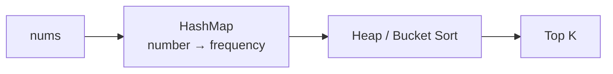

Đây là ví dụ quan trọng cho tư duy:

```text
HashMap không phải toàn bộ solution.
```

Nó chỉ giải quyết:

```text
count frequency
```

Sau đó cần thêm:

```text
Heap
Bucket Sort
Sorting
```

để ranking.

---

# Problem 6 — LeetCode 560: Subarray Sum Equals K

Đây là bài bắt buộc phải hiểu.

Example:

```text
nums = [1,1,1]
k = 2

Output = 2
```

Các subarray:

```text
[1,1] positions 0..1
[1,1] positions 1..2
```

Brute Force:

```text
enumerate every start/end
```

Có thể:

```text
O(n²)
```

---

## Optimal

Ta cần:

```text
prefixCurrent - prefixPrevious = k
```

→

```text
prefixPrevious = prefixCurrent - k
```

HashMap:

```text
prefix sum → frequency
```

```java
public int subarraySum(int[] nums, int k) {

    Map<Integer, Integer> freq = new HashMap<>();

    freq.put(0, 1);

    int prefix = 0;
    int answer = 0;

    for (int num : nums) {

        prefix += num;

        answer += freq.getOrDefault(
            prefix - k,
            0
        );

        freq.put(
            prefix,
            freq.getOrDefault(prefix, 0) + 1
        );
    }

    return answer;
}
```

Complexity:

```text
Time:  O(n)
Space: O(n)
```

### Interview explanation

> I'm converting the subarray condition into a prefix-sum lookup. If the current prefix is `S`, I need an earlier prefix equal to `S - k`. Therefore I store the frequency of every prefix sum in a HashMap. Each lookup is average O(1), giving O(n) total time.

---

# Problem 7 — LeetCode 525: Contiguous Array

Array chỉ gồm:

```text
0 và 1
```

Cần longest subarray có:

```text
equal number of 0 and 1
```

Transformation:

```text
0 → -1
1 → +1
```

Nếu một subarray có sum:

```text
0
```

thì số `0` và `1` bằng nhau.

Ta cần:

```text
longest
```

nên HashMap lưu:

```text
prefix → earliest index
```

```java
public int findMaxLength(int[] nums) {

    Map<Integer, Integer> first = new HashMap<>();

    first.put(0, -1);

    int prefix = 0;
    int max = 0;

    for (int i = 0; i < nums.length; i++) {

        prefix += nums[i] == 1 ? 1 : -1;

        if (first.containsKey(prefix)) {

            max = Math.max(
                max,
                i - first.get(prefix)
            );

        } else {

            first.put(prefix, i);
        }
    }

    return max;
}
```

Crucial:

```text
không overwrite earliest index
```

vì muốn maximize:

```text
current - earliest
```

---

# Problem 8 — LeetCode 3: Longest Substring Without Repeating Characters

Pattern:

```text
Sliding Window + HashSet
```

Window invariant:

```text
không chứa duplicate
```

```java
public int lengthOfLongestSubstring(String s) {

    Set<Character> set = new HashSet<>();

    int left = 0;
    int max = 0;

    for (int right = 0; right < s.length(); right++) {

        while (set.contains(s.charAt(right))) {
            set.remove(s.charAt(left));
            left++;
        }

        set.add(s.charAt(right));

        max = Math.max(
            max,
            right - left + 1
        );
    }

    return max;
}
```

Complexity:

```text
Time: O(n)
```

Tại sao không `O(n²)` dù có while?

Vì mỗi character:

```text
enter window tối đa một lần
leave window tối đa một lần
```

nên tổng số movement của left/right:

```text
O(n)
```

---

# Problem 9 — LeetCode 128: Longest Consecutive Sequence

Input:

```text
[100,4,200,1,3,2]
```

Answer:

```text
4
```

sequence:

```text
1,2,3,4
```

Naive:

```text
sort
```

→ `O(n log n)`.

HashSet solution:

```text
O(n)` average.
```

Key idea:

Chỉ bắt đầu sequence tại `x` nếu:

```text
x - 1 không tồn tại
```

```java
public int longestConsecutive(int[] nums) {

    Set<Integer> set = new HashSet<>();

    for (int num : nums) {
        set.add(num);
    }

    int longest = 0;

    for (int num : set) {

        if (!set.contains(num - 1)) {

            int current = num;
            int length = 1;

            while (set.contains(current + 1)) {
                current++;
                length++;
            }

            longest = Math.max(longest, length);
        }
    }

    return longest;
}
```

Tư duy đặc biệt:

```text
Không start từ mọi số.
Chỉ start từ đầu sequence.
```

---

# Problem 10 — LeetCode 146: LRU Cache

Requirements:

```text
get(key) O(1)
put(key) O(1)
```

Need:

```text
lookup
+
recency ordering
```

Solution:

```text
HashMap + Doubly Linked List
```

Node:

```java
class Node {
    int key;
    int value;

    Node prev;
    Node next;

    Node(int key, int value) {
        this.key = key;
        this.value = value;
    }
}
```

Architecture:

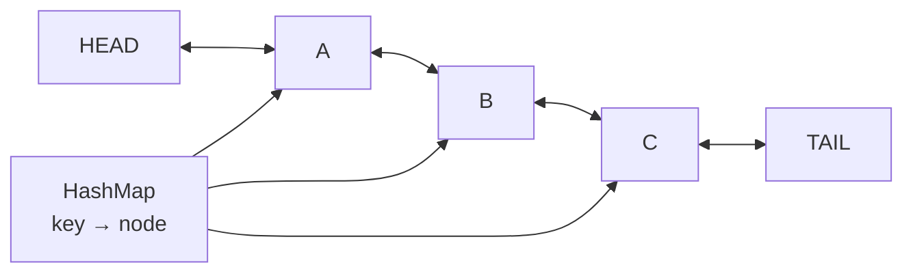

HashMap:

```text
find node O(1)
```

Doubly Linked List:

```text
remove node O(1)
move node O(1)
remove LRU O(1)
```

Đây là pattern design rất quan trọng.

---

# 5. Pattern Decision Tree

Prompt yêu cầu mở rộng decision tree thành framework hoàn chỉnh. 

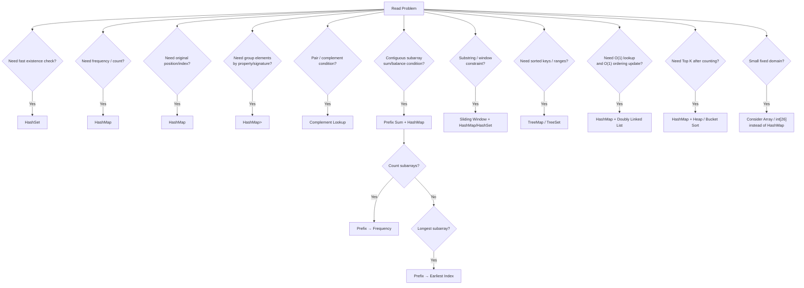

Đây là flow bạn nên chạy trong đầu khi interview.

---

# 6. Hash Table vs Other Data Structures

Prompt yêu cầu so sánh HashMap/HashSet với Array, TreeMap, TreeSet, Heap, Sorting và Binary Search. 

| Data Structure               |                  Search |     Insert |          Delete | Ordered?     | Typical Use          |
| ---------------------------- | ----------------------: | ---------: | --------------: | ------------ | -------------------- |
| Array unsorted               |                  `O(n)` |     varies |          varies | index order  | direct indexing      |
| HashMap                      |              avg `O(1)` | avg `O(1)` |      avg `O(1)` | No guarantee | key → value          |
| HashSet                      |              avg `O(1)` | avg `O(1)` |      avg `O(1)` | No guarantee | existence            |
| TreeMap                      |              `O(log n)` | `O(log n)` |      `O(log n)` | Yes          | sorted keys/ranges   |
| TreeSet                      |              `O(log n)` | `O(log n)` |      `O(log n)` | Yes          | sorted unique values |
| Heap                         | `O(n)` arbitrary search | `O(log n)` | root `O(log n)` | partial      | min/max, Top K       |
| Sorted Array + Binary Search |              `O(log n)` |     `O(n)` |          `O(n)` | Yes          | static ordered data  |

---

# HashMap vs Array

Array frequency đôi khi tốt hơn:

```text
char is guaranteed a-z
```

Use:

```java
int[] freq = new int[26];
```

Không cần:

```java
HashMap<Character, Integer>
```

Array có:

```text
less overhead
better locality
simpler code
```

HashMap tốt khi domain:

```text
large
sparse
unknown
non-integer keys
```

---

# HashMap vs Binary Search

Binary Search yêu cầu:

```text
sorted data
```

Lookup:

```text
O(log n)
```

HashMap không cần sorting:

```text
average O(1)
```

Nhưng Binary Search giữ ordering nên hỗ trợ:

```text
lower bound
upper bound
nearest value
range
```

HashMap thì không.

---

# HashMap vs TreeMap

Question:

```text
Do I need ordering?
```

Nếu không:

```text
HashMap
```

Nếu có:

```text
TreeMap
```

Đặc biệt khi gặp:

```text
smallest key >= x
largest key <= x
range of keys
```

hãy nghĩ:

```text
TreeMap
```

---

# 7. Hash Table Mistakes in Interviews

Prompt đặc biệt yêu cầu section các lỗi thường gặp. 

## Mistake 1 — Dùng HashMap nhưng cần ordering

Bạn cần:

```text
nearest timestamp
floor key
ceiling key
```

HashMap không hỗ trợ hiệu quả.

Think:

```text
TreeMap
```

---

## Mistake 2 — Quên duplicate

Ví dụ Two Sum:

```text
nums = [3,3]
target = 6
```

Nếu build map không cẩn thận có thể dùng chính index đó hai lần.

---

## Mistake 3 — Store wrong index

Longest problems thường cần:

```text
earliest index
```

nhưng ứng viên overwrite:

```java
map.put(value, i);
```

Mỗi lần.

Trong nhiều bài phải:

```java
map.putIfAbsent(value, i);
```

---

## Mistake 4 — Update frequency sai thứ tự

Trong Prefix Sum:

Correct:

```java
answer += map.getOrDefault(prefix - k, 0);

map.put(
    prefix,
    map.getOrDefault(prefix, 0) + 1
);
```

Nếu update current prefix trước lookup, có thể vô tình count current state không hợp lệ.

---

## Mistake 5 — containsKey vs containsValue

```java
map.containsKey(x)
```

thường expected:

```text
O(1)
```

Nhưng:

```java
map.containsValue(x)
```

thường phải scan values:

```text
O(n)
```

Hai method này không tương đương về complexity.

---

## Mistake 6 — Không hiểu equals/hashCode

Đây là lỗi đặc biệt quan trọng với Java Backend.

Nếu custom object làm key:

```text
equality semantics phải đúng.
```

---

## Mistake 7 — Mutable key

Sau khi đưa object vào HashMap, đừng mutate field tham gia:

```text
equals/hashCode
```

---

## Mistake 8 — Nói HashMap luôn O(1)

Đừng nói:

> HashMap operations are O(1).

Nói tốt hơn:

> HashMap lookup, insertion and deletion are O(1) on average assuming good hash distribution and controlled load factor; collisions can degrade performance.

---

## Mistake 9 — Không nhận ra HashMap chỉ là một thành phần

Ví dụ:

```text
Top K Frequent
```

Không phải chỉ:

```text
HashMap
```

mà:

```text
HashMap + Heap
```

LRU:

```text
HashMap + Doubly Linked List
```

Subarray Sum:

```text
Prefix Sum + HashMap
```

---

## Mistake 10 — HashMap cho mọi thứ

Ví dụ alphabet chỉ:

```text
a-z
```

Array:

```java
int[26]
```

có thể đơn giản hơn nhiều.

---

# 8. Interview Cheat Sheet

## Core Concepts

```text
Hash Function
    Key → numeric hash

Bucket
    Storage location selected from hash

Collision
    Different keys map to same bucket

Load Factor
    entries / capacity

Rehashing
    Resize table and redistribute entries
```

Prompt yêu cầu cheat sheet gồm đúng các concept trên cùng complexity và core patterns. 

---

# Complexity

```text
Generic Hash Table

Average:
Search  → O(1)
Insert  → O(1)
Delete  → O(1)

Worst case:
Search  → O(n)
Insert  → O(n)
Delete  → O(n)

Space:
O(n)
```

---

# Core Patterns

```text
Frequency Map
Seen Set
Complement Lookup
Value → Index
Grouping
String Signature
Prefix Sum + HashMap
Sliding Window + HashMap/Set
HashMap + Doubly Linked List
HashMap + Heap
HashMap + Sorting
```

---

# 9. 18 câu Pattern Recognition

## 1

> Find two values whose sum equals target.

Think:

```text
Complement Lookup + HashMap
```

Vì:

```text
need = target - current
```

---

## 2

> Determine whether an array contains duplicates.

```text
HashSet
```

Need only existence.

---

## 3

> Count how many times each number appears.

```text
Frequency Map
```

---

## 4

> Return indices of two matching values.

```text
Value → Index
```

---

## 5

> Group strings that are anagrams.

```text
Canonical signature
+
HashMap<Signature, List<String>>
```

---

## 6

> Find number of subarrays whose sum equals K.

```text
Prefix Sum
+
HashMap<Prefix, Frequency>
```

---

## 7

> Find longest subarray satisfying a prefix balance condition.

```text
Prefix Sum
+
HashMap<Prefix, EarliestIndex>
```

---

## 8

> Longest substring without repeating characters.

```text
Sliding Window
+
HashSet / HashMap
```

---

## 9

> Minimum substring containing required character counts.

```text
Sliding Window
+
Frequency Maps
```

---

## 10

> O(1) lookup while maintaining recency.

```text
HashMap
+
Doubly Linked List
```

---

## 11

> Return K elements with highest frequencies.

```text
HashMap
+
Heap / Bucket Sort
```

---

## 12

> Detect whether a state repeats and forms a cycle.

```text
HashSet
```

---

## 13

> Need keys in sorted order.

Not HashMap.

```text
TreeMap
```

---

## 14

> Need unique elements in sorted order.

```text
TreeSet
```

---

## 15

> Character frequency where input only contains lowercase `a-z`.

Consider:

```text
int[26]
```

before HashMap.

---

## 16

> Need nearest key smaller than a target.

Think:

```text
TreeMap.floorKey()
```

not normal HashMap.

---

## 17

> Need membership test after sorting is already available.

Possibilities:

```text
Binary Search
```

may be preferable to creating another HashSet.

---

## 18

> Need fast lookup but memory usage is extremely constrained.

Question whether:

```text
HashMap's O(n) auxiliary space
```

is worth the speed improvement.

---

# 10. LeetCode Hash Table Roadmap

Prompt đề xuất roadmap theo sáu level từ basic hashing đến advanced combinations. 

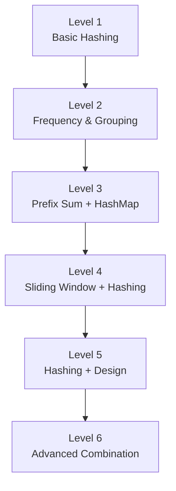

## Level 1 — Basic Hashing

Làm theo thứ tự:

```text
1. LC 217 — Contains Duplicate
2. LC 242 — Valid Anagram
3. LC 1 — Two Sum
4. LC 349 — Intersection of Two Arrays
5. LC 202 — Happy Number
6. LC 169 — Majority Element
```

Mục tiêu:

```text
HashSet
Frequency Map
Complement Lookup
Value → Index
```

---

# Level 2 — Frequency & Grouping

```text
7. LC 49 — Group Anagrams
8. LC 347 — Top K Frequent Elements
9. LC 451 — Sort Characters By Frequency
10. LC 205 — Isomorphic Strings
11. LC 290 — Word Pattern
```

Mục tiêu:

```text
frequency
grouping
canonical key
bidirectional mapping
HashMap + Heap/Sorting
```

---

# Level 3 — Prefix Sum + HashMap

Đây là level rất quan trọng.

```text
12. LC 560 — Subarray Sum Equals K
13. LC 525 — Contiguous Array
14. LC 974 — Subarray Sums Divisible by K
15. LC 930 — Binary Subarrays With Sum
16. LC 1248 — Count Number of Nice Subarrays
```

Pattern cần thuộc:

```text
COUNT
→ prefix → frequency

LONGEST
→ prefix → earliest index
```

---

# Level 4 — Sliding Window + Hashing

```text
17. LC 3 — Longest Substring Without Repeating Characters
18. LC 438 — Find All Anagrams in a String
19. LC 567 — Permutation in String
20. LC 76 — Minimum Window Substring
21. LC 904 — Fruit Into Baskets
```

Mục tiêu:

```text
maintain state of dynamic window
```

---

# Level 5 — Hashing + Design

```text
22. LC 380 — Insert Delete GetRandom O(1)
23. LC 146 — LRU Cache
24. LC 981 — Time Based Key-Value Store
25. LC 355 — Design Twitter
```

Bạn đã từng làm `RandomizedSet` và `TimeMap`; nhìn dưới framework này:

```text
RandomizedSet
=
HashMap + ArrayList

TimeMap
=
HashMap + Sorted timestamp list + Binary Search

LRU
=
HashMap + Doubly Linked List
```

Đây là tư duy rất quan trọng:

> **Một data structure thường không giải toàn bộ requirement.**

---

# Level 6 — Advanced Hashing

```text
26. LC 128 — Longest Consecutive Sequence
27. LC 18 — 4Sum
28. LC 454 — 4Sum II
29. LC 30 — Substring with Concatenation of All Words
30. LC 149 — Max Points on a Line
31. LC 336 — Palindrome Pairs
32. LC 41 — First Missing Positive
```

Tập trung vào:

```text
Hashing + Two Pointers
Hashing + Sorting
Hashing + Geometry
Hashing + Sliding Window
Hashing + decomposition
```

---

# 11. Framework suy nghĩ khi gặp Hash Table trong interview

Thay vì thấy bài mới rồi hỏi:

```text
"Bài này dùng HashMap không?"
```

hãy hỏi tuần tự:

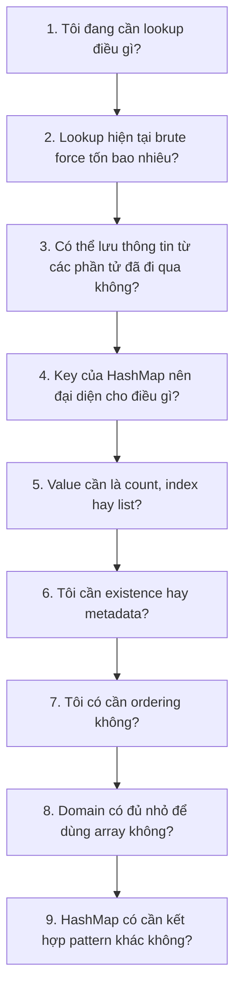

Đây chính là cách chuyển từ:

```text
memorize solutions
```

sang:

```text
recognize state + required lookup
```

---

# 12. Công thức tư duy quan trọng nhất

Hãy ghi nhớ câu này:

> **Hash Table thường được dùng khi một brute-force solution đang lặp đi lặp lại một câu hỏi lookup mà ta có thể trả lời nhanh bằng cách lưu thông tin đã thấy trước đó.**

Ví dụ Two Sum:

```text
Brute force question:
"Trong những phần tử còn lại có complement không?"

HashMap:
"Tôi đã từng thấy complement chưa?"
```

Subarray Sum:

```text
Brute force:
"Subarray nào có sum K?"

Prefix + HashMap:
"Tôi đã từng thấy prefix = currentPrefix - K chưa?"
```

Sliding Window:

```text
Brute force:
"Window này có duplicate không?"

HashSet:
"Character này hiện đang tồn tại trong window không?"
```

LRU:

```text
Brute force:
"Node của key này ở đâu?"

HashMap:
key → node
```

Đó là bản chất chung đứng sau gần như toàn bộ các pattern Hash Table trong coding interview.

---

# 13. Hash Table Interview Summary

Nếu interviewer hỏi:

> **What is a hash table?**

Bạn có thể trả lời:

> A hash table stores key-value mappings and uses a hash function to map a key to a bucket. With a good hash distribution and controlled load factor, lookup, insertion and deletion are O(1) on average. Different keys may map to the same bucket, which is called a collision, and collisions can be handled using techniques such as separate chaining or open addressing.

Nếu hỏi:

> **Why can HashMap become slow?**

Trả lời:

> If many keys collide into the same bucket, the lookup may need to inspect multiple entries instead of going directly to one entry. In a generic hash table this can degrade operations from average O(1) toward O(n). Resizing and a good hash function are therefore important for keeping buckets well distributed.

Nếu hỏi:

> **When would you choose TreeMap instead?**

Trả lời:

> I would prefer TreeMap when I need ordered keys, range queries, floor or ceiling operations. HashMap gives faster average lookup, but TreeMap provides ordering with O(log n) operations.

Nếu hỏi:

> **What pattern do you look for in coding problems?**

Trả lời:

> I usually look at what repeated lookup the brute-force solution performs. If I need existence, I consider a HashSet. If I need counts, I use a frequency map. If I need positions, I map values to indices. For subarray problems I consider prefix sum plus HashMap, and for substring problems I often combine hashing with a sliding window.

Đó là phần quan trọng nhất cần đạt được trước technical interview: không chỉ biết viết `HashMap`, mà phải có khả năng giải thích **HashMap đang lưu state gì, tại sao state đó loại bỏ được nested loop, và trade-off memory/performance của lựa chọn đó**.
