# HEAP DATA STRUCTURE

## Deep Dive, Pattern Recognition & DSA Interview Guide

---

# 0. MENTAL MODEL — TRƯỚC KHI HỌC HEAP

Khi nhắc đến Heap, đừng bắt đầu bằng:

> Heap là Complete Binary Tree có Heap Property.

Định nghĩa đó đúng, nhưng chưa giúp ta hiểu **tại sao Heap tồn tại**.

Hãy bắt đầu từ một bài toán.

Giả sử ta liên tục nhận các số:

```text
8, 3, 10, 2, 7, 5...
```

và sau mỗi lần thêm số, ta thường xuyên phải hỏi:

```text
Số nhỏ nhất hiện tại là gì?
```

Nếu dùng array bình thường:

```text
[8, 3, 10, 2, 7, 5]
```

muốn tìm minimum:

```text
scan toàn bộ array
→ O(n)
```

Nếu sort:

```text
[2, 3, 5, 7, 8, 10]
```

thì minimum ở đầu:

```text
O(1)
```

nhưng mỗi khi thêm phần tử mới, ta lại phải duy trì sorted order.

Heap đưa ra một trade-off rất hay:

> Tôi không cần mọi phần tử được sort.
> Tôi chỉ cần đảm bảo **phần tử quan trọng nhất luôn ở root**.

Với Min Heap:

```text
root = minimum
```

Với Max Heap:

```text
root = maximum
```

Đây là mental model quan trọng nhất:

```text
Heap
=
partial ordering
+
fast access to best candidate
```

Heap đặc biệt hữu ích khi bài toán có dạng:

```text
repeatedly:
    find smallest/largest candidate
    remove it
    add/update candidate
```

---

# PHẦN 1 — FUNDAMENTALS CỦA HEAP

# 1. Heap là gì?

Binary Heap là một Binary Tree thỏa mãn hai điều kiện:

```text
1. Shape Property
   → Complete Binary Tree

2. Heap Property
   → Parent có quan hệ ordering với children
```

Ví dụ Min Heap:

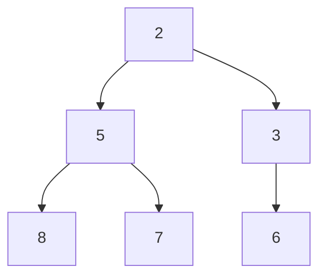

Heap này thỏa:

```text
2 <= 5
2 <= 3

5 <= 8
5 <= 7

3 <= 6
```

Do đó:

```text
parent <= children
```

ở mọi node.

Đây là một Min Heap.

---

# 2. Heap có phải Binary Tree không?

Có.

Binary Heap là một dạng đặc biệt của Binary Tree.

Nhưng không phải Binary Tree nào cũng là Heap.

Ta cần thêm:

```text
Complete Binary Tree
+
Heap Property
```

---

# 3. Complete Binary Tree là gì?

Complete Binary Tree có hai đặc điểm:

```text
Mọi level trước level cuối đều đầy.

Level cuối được fill từ trái sang phải.
```

Ví dụ hợp lệ:


Level cuối:

```text
4, 5, 6
```

được fill từ trái sang phải.

Ví dụ không complete:

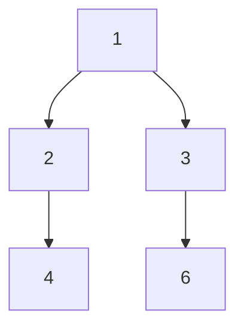

Ở đây vị trí child bên phải của `2` bị bỏ trống nhưng node `6` lại xuất hiện phía sau.

Không phải Complete Binary Tree.

---

# 4. Tại sao Heap cần Complete Binary Tree?

Đây là điểm cực kỳ quan trọng.

Complete Binary Tree khiến chiều cao của cây luôn xấp xỉ:

```text
log₂(n)
```

Ví dụ:

```text
n ≈ 1      → height ≈ 0
n ≈ 2      → height ≈ 1
n ≈ 4      → height ≈ 2
n ≈ 8      → height ≈ 3
n ≈ 1024   → height ≈ 10
```

Do đó khi một element di chuyển:

```text
root → leaf
```

hoặc:

```text
leaf → root
```

nó chỉ đi tối đa:

```text
O(log n)
```

Đây chính là nền tảng cho:

```text
insert → O(log n)
poll   → O(log n)
```

---

# 5. Heap Property

## Min Heap

Điều kiện:

```text
parent <= children
```

Ví dụ:

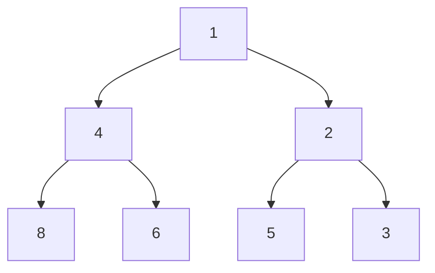

Root luôn là:

```text
minimum
```

Nhưng lưu ý:

```text
Heap KHÔNG nói rằng:

left subtree < right subtree
```

---

## Max Heap

Điều kiện:

```text
parent >= children
```

Ví dụ:

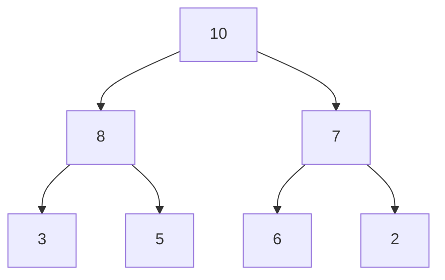

Root luôn là:

```text
maximum
```

---

# 6. Heap KHÔNG phải Binary Search Tree

Xét Min Heap:


Trong BST:

```text
left child < parent < right child
```

Nhưng ở đây:

```text
5 > 2
```

mà `5` lại là left child.

Vì vậy đây không phải BST.

Heap chỉ đảm bảo:

```text
Min Heap:
parent <= children
```

chứ không đảm bảo relationship giữa:

```text
left subtree
right subtree
```

---

# 7. Heap đảm bảo điều gì?

Min Heap đảm bảo:

```text
root = minimum
```

Max Heap đảm bảo:

```text
root = maximum
```

Ngoài ra:

```text
mỗi parent có priority cao hơn children
```

---

# 8. Heap KHÔNG đảm bảo điều gì?

Heap không đảm bảo:

```text
toàn bộ array đã sort
```

Ví dụ Min Heap:

```text
[2, 5, 3, 8, 7, 6]
```

không phải:

```text
[2, 3, 5, 6, 7, 8]
```

Nhưng vẫn là Min Heap hợp lệ.

---

# 9. Heap vs BST vs Sorted Array vs Priority Queue

| Structure      | Điều quan trọng được maintain      |             Find min/max | Search arbitrary value |   Insert |
| -------------- | ---------------------------------- | -----------------------: | ---------------------: | -------: |
| Min Heap       | Parent ≤ children                  |                 O(1) min |                   O(n) | O(log n) |
| Max Heap       | Parent ≥ children                  |                 O(1) max |                   O(n) | O(log n) |
| Balanced BST   | Global ordering                    |                 O(log n) |               O(log n) | O(log n) |
| Sorted Array   | Global ordering                    |                     O(1) |               O(log n) |     O(n) |
| Priority Queue | ADT: lấy phần tử priority cao nhất | phụ thuộc implementation |                      — |        — |

Một interview point rất quan trọng:

> Heap không được thiết kế để search arbitrary element.

Nếu hỏi:

```text
Heap có value = 123 không?
```

thì trong Binary Heap thông thường:

```text
O(n)
```

---

# PHẦN 2 — HEAP REPRESENTATION

# 10. Vì sao Binary Heap thường không cần Node?

Ta có cây:

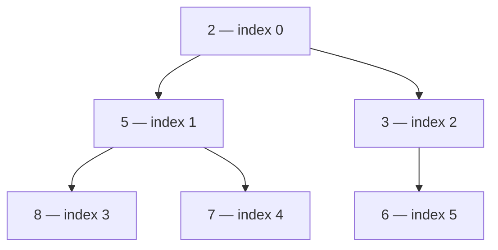

Do Complete Binary Tree được fill level-by-level, left-to-right, ta có thể lưu trực tiếp:

```text
[2, 5, 3, 8, 7, 6]
```

Không cần:

```java
class Node {
    Node left;
    Node right;
}
```

---

# 11. Parent / Child Formula

Với 0-based indexing:

```text
parent(i) = (i - 1) / 2

left(i) = 2 * i + 1

right(i) = 2 * i + 2
```

Ví dụ:

```text
index = 1
value = 5
```

Ta có:

```text
left = 2 * 1 + 1
     = 3

right = 2 * 1 + 2
      = 4
```

Array:

```text
[2, 5, 3, 8, 7, 6]
        ↑
      index 1

index 3 → 8
index 4 → 7
```

Đúng với cây:

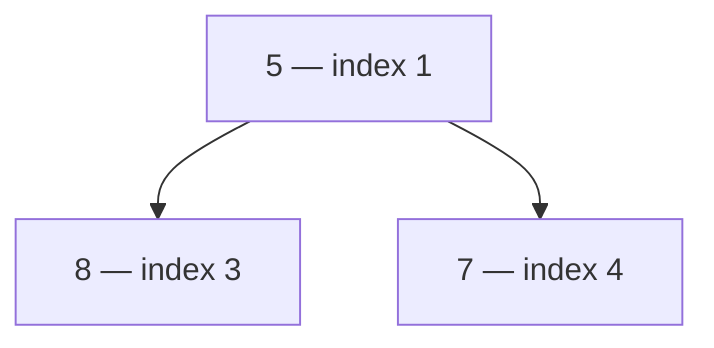

---

# 12. Tại sao công thức đúng?

Do Complete Binary Tree được lưu bằng level-order.

Nếu node có index:

```text
i
```

thì trước child của nó đã có:

```text
2i + 1
```

positions.

Do đó:

```text
left = 2i + 1
right = 2i + 2
```

Ngược lại, từ child index `i`, parent là:

```text
floor((i - 1) / 2)
```

Ví dụ:

```text
i = 5

parent =
(5 - 1) / 2
= 2
```

Index 5 là `6`.

Index 2 là `3`.

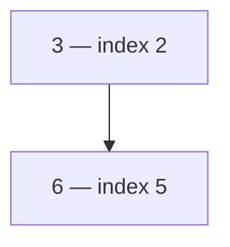

---

# PHẦN 3 — CORE HEAP OPERATIONS

# 13. Insert

Giả sử Min Heap:


Ta muốn insert:

```text
1
```

## Step 1 — Insert vào cuối

Không thể đặt `1` ở vị trí tùy ý.

Tại sao?

Vì ta phải giữ:

```text
Complete Binary Tree
```

Array ban đầu:

```text
[2,5,3,8,7,6]
```

Insert:

```text
[2,5,3,8,7,6,1]
```

Tree:


Shape đúng.

Nhưng Heap Property sai:

```text
3 > 1
```

---

# 14. Sift Up / Bubble Up

Ta swap `1` với parent.

```text
[2,5,1,8,7,6,3]
```

Tree:

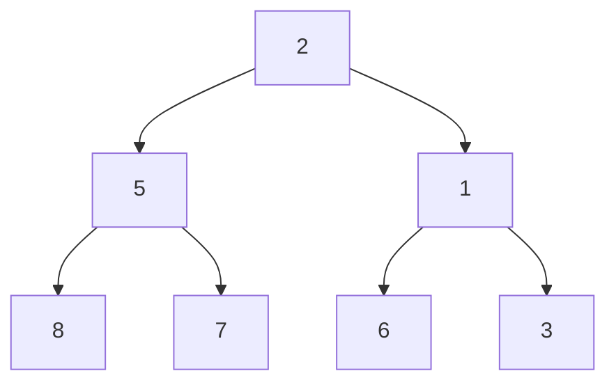

Vẫn sai:

```text
2 > 1
```

Swap tiếp:

```text
[1,5,2,8,7,6,3]
```

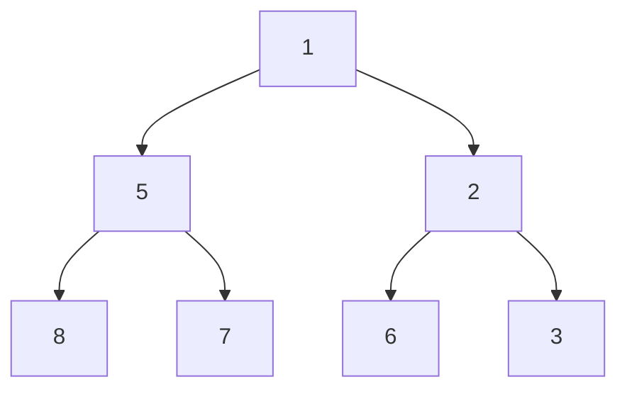

Heap restored.

Flow:

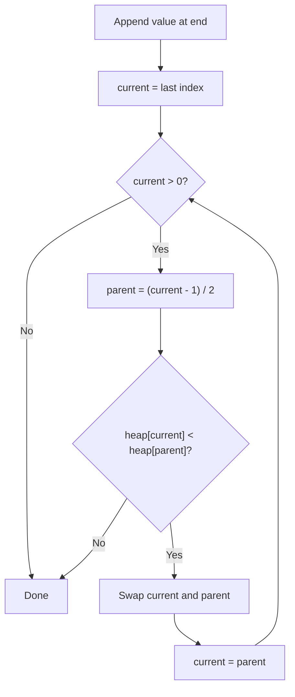

---

# 15. Java Insert

```java
void add(int value) {
    heap.add(value);

    int index = heap.size() - 1;

    while (index > 0) {
        int parent = (index - 1) / 2;

        if (heap.get(parent) <= heap.get(index)) {
            break;
        }

        swap(parent, index);
        index = parent;
    }
}
```

Complexity:

```text
Time  = O(log n)
Space = O(1) auxiliary
```

---

# 16. Peek

Min Heap:

```text
peek()
→ root
→ minimum
```

Max Heap:

```text
peek()
→ root
→ maximum
```

Array representation:

```text
heap[0]
```

Complexity:

```text
O(1)
```

---

# 17. Poll / Extract Root

Giả sử:


Array:

```text
[1,4,2,8,6,5,3]
```

Ta muốn remove minimum.

## Step 1

Save root:

```text
result = 1
```

## Step 2

Đưa element cuối:

```text
3
```

lên root.

```text
[3,4,2,8,6,5]
```

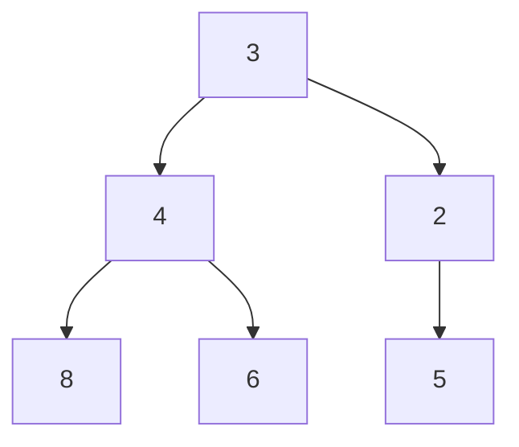

Heap Property bị phá:

```text
3 > 2
```

---

# 18. Sift Down

Ta chọn child nhỏ hơn.

Children:

```text
4
2
```

Chọn:

```text
2
```

Swap:

```text
[2,4,3,8,6,5]
```


Heap restored.

---

# 19. Tại sao Sift Down phải chọn child nhỏ hơn?

Giả sử:

```text
parent = 10

left  = 4
right = 2
```

Nếu swap với `4`:

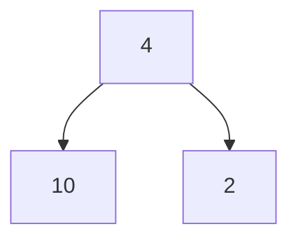

vẫn sai:

```text
4 > 2
```

Nếu swap với `2`:

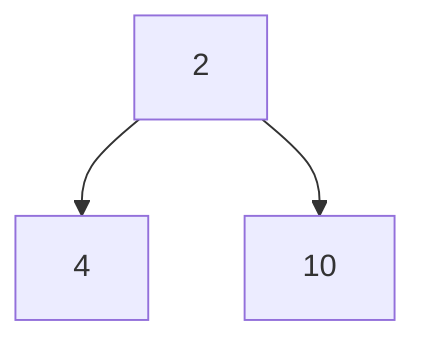

đúng.

Vì vậy Min Heap:

```text
swap với smaller child
```

Max Heap:

```text
swap với larger child
```

---

# 20. Java poll()

```java
int poll() {
    if (heap.isEmpty()) {
        throw new NoSuchElementException();
    }

    int result = heap.get(0);

    int last = heap.remove(heap.size() - 1);

    if (!heap.isEmpty()) {
        heap.set(0, last);
        siftDown(0);
    }

    return result;
}
```

`siftDown`:

```java
private void siftDown(int index) {
    int n = heap.size();

    while (true) {
        int left = 2 * index + 1;
        int right = 2 * index + 2;

        int smallest = index;

        if (left < n &&
            heap.get(left) < heap.get(smallest)) {
            smallest = left;
        }

        if (right < n &&
            heap.get(right) < heap.get(smallest)) {
            smallest = right;
        }

        if (smallest == index) {
            break;
        }

        swap(index, smallest);
        index = smallest;
    }
}
```

Complexity:

```text
O(log n)
```

---

# 21. Sift Up vs Sift Down

| Operation                   | Technique        |
| --------------------------- | ---------------- |
| Insert                      | Sift Up          |
| Remove Root                 | Sift Down        |
| Bottom-Up Heapify           | Sift Down        |
| Replace root                | Sift Down        |
| Decrease key trong Min Heap | thường Sift Up   |
| Increase key trong Min Heap | thường Sift Down |

Mental model:

```text
Inserted element
→ bắt đầu ở bottom
→ có thể sai với ancestor
→ move UP
```

Trong khi:

```text
Root replacement
→ bắt đầu ở top
→ có thể sai với descendants
→ move DOWN
```

---

# PHẦN 4 — BUILD HEAP / HEAPIFY

# 22. Approach 1 — Insert từng element

Input:

```text
[5,3,8,4,1,2]
```

Ta làm:

```text
insert(5)
insert(3)
insert(8)
insert(4)
insert(1)
insert(2)
```

Mỗi insert:

```text
O(log n)
```

Có `n` elements:

```text
O(n log n)
```

---

# 23. Approach 2 — Bottom-Up Heapify

Ta không cần build từ empty heap.

Ta có thể sử dụng trực tiếp array.

```java
for (int i = n / 2 - 1; i >= 0; i--) {
    siftDown(i);
}
```

Complexity:

```text
O(n)
```

Đây là một interview question kinh điển.

---

# 24. Tại sao bắt đầu ở n / 2 - 1?

Trong array heap:

```text
left(i) = 2i + 1
```

Node là parent nếu:

```text
2i + 1 < n
```

Do đó parent cuối cùng nằm tại:

```text
floor(n / 2) - 1
```

Ví dụ:

```text
n = 7
```

Indexes:

```text
0 1 2 3 4 5 6
```

Parent cuối:

```text
7 / 2 - 1
= 2
```

Indexes:

```text
3,4,5,6
```

đều là leaves.

Leaves đã là heap một cách tự nhiên vì chúng không có children.

---

# 25. Bottom-Up Heapify Visualization

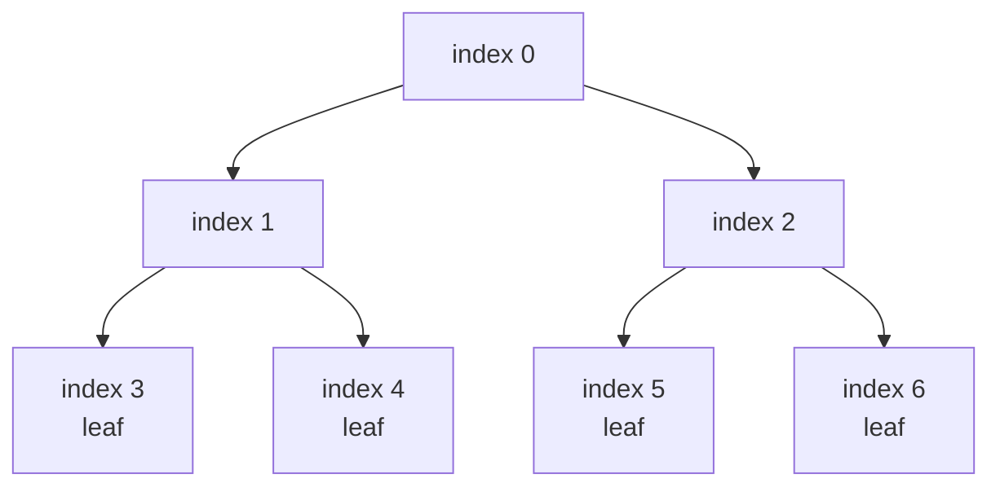

Ta heapify:

```text
index 2
index 1
index 0
```

không cần:

```text
3,4,5,6
```

---

# 26. Vì sao Build Heap là O(n), không phải O(n log n)?

Sai lầm phổ biến:

```text
n nodes
×
O(log n) siftDown

= O(n log n)
```

Nhưng không phải node nào cũng sift xuống `log n` levels.

Rất nhiều node là leaf:

```text
cost = 0
```

Khoảng:

```text
n/2 nodes
```

là leaves.

Khoảng:

```text
n/4
```

nodes chỉ cách leaf một level.

Khoảng:

```text
n/8
```

nodes cách leaf hai levels.

Do đó tổng work gần:

```text
n/4 * 1
+
n/8 * 2
+
n/16 * 3
+
...
```

Factor `n`:

```text
n(
  1/4
+ 2/8
+ 3/16
+ ...
)
```

Chuỗi:

```text
Σ h / 2^(h+1)
```

hội tụ về constant.

Do đó:

```text
O(n)
```

Intuition:

> Những node có thể siftDown rất xa thì cực kỳ ít; những node cực kỳ nhiều thì gần như không phải siftDown.

---

# PHẦN 5 — HEAP SORT

# 27. Heap Sort Idea

Muốn sort ascending:

```text
Build Max Heap
```

Vì root là maximum.

Sau đó:

```text
swap root với element cuối
```

Maximum được đưa về đúng vị trí cuối array.

Shrink heap.

Repeat.

---

# 28. Heap Sort Flow

```mermaid
flowchart TD
    A["Input array"] --> B["Build Max Heap O(n)"]
    B --> C["Root = current maximum"]
    C --> D["Swap root with heap end"]
    D --> E["Shrink heap size by 1"]
    E --> F["Sift down root"]
    F --> G{"heapSize > 1?"}
    G -- Yes --> C
    G -- No --> H["Sorted array"]
```

---

# 29. Example

Input:

```text
[5,3,8,4,1,2]
```

Build Max Heap, một cấu hình hợp lệ có thể là:

```text
[8,4,5,3,1,2]
```

Tree:

```mermaid
graph TD
    A["8"] --> B["4"]
    A --> C["5"]
    B --> D["3"]
    B --> E["1"]
    C --> F["2"]
```

Swap:

```text
8 ↔ 2
```

Result:

```text
[2,4,5,3,1 | 8]
```

Heapify phần:

```text
[2,4,5,3,1]
```

thành:

```text
[5,4,2,3,1 | 8]
```

Tiếp tục cho tới khi:

```text
[1,2,3,4,5,8]
```

---

# 30. Java Heap Sort

```java
public static void heapSort(int[] nums) {
    int n = nums.length;

    // Build max heap
    for (int i = n / 2 - 1; i >= 0; i--) {
        siftDown(nums, i, n);
    }

    // Extract max repeatedly
    for (int end = n - 1; end > 0; end--) {
        swap(nums, 0, end);

        siftDown(nums, 0, end);
    }
}

private static void siftDown(
        int[] nums,
        int index,
        int heapSize) {

    while (true) {
        int left = 2 * index + 1;
        int right = 2 * index + 2;

        int largest = index;

        if (left < heapSize &&
            nums[left] > nums[largest]) {
            largest = left;
        }

        if (right < heapSize &&
            nums[right] > nums[largest]) {
            largest = right;
        }

        if (largest == index) {
            break;
        }

        swap(nums, index, largest);
        index = largest;
    }
}

private static void swap(int[] nums, int i, int j) {
    int temp = nums[i];
    nums[i] = nums[j];
    nums[j] = temp;
}
```

Complexity:

```text
Build heap   O(n)

n removals × O(log n)
             ↓
             O(n log n)

Total        O(n log n)

Auxiliary space:
O(1)
```

---

# 31. Heap Sort vs Quick Sort vs Merge Sort

| Algorithm               |                  Average |             Worst |              Extra Space | Stable |
| ----------------------- | -----------------------: | ----------------: | -----------------------: | ------ |
| Heap Sort               |               O(n log n) |        O(n log n) |                     O(1) | No     |
| Quick Sort              |               O(n log n) | O(n²) traditional |   O(log n) stack average | No     |
| Merge Sort              |               O(n log n) |        O(n log n) |       O(n) array version | Yes    |
| Java Arrays.sort(int[]) | implementation optimized |         optimized | implementation dependent | —      |

Heap Sort có ưu điểm:

```text
guaranteed O(n log n)
O(1) auxiliary memory
```

Nhược điểm thực tế:

```text
poor cache locality
more random memory access
larger constant factor
not stable
```

Nên trong application code, ta thường dùng library sort thay vì tự implement Heap Sort.

---

# PHẦN 6 — PRIORITY QUEUE

# 32. Heap vs Priority Queue

Đây là distinction rất hay được hỏi.

```mermaid
flowchart TD
    A["Priority Queue<br/>Abstract Data Type"]
    A --> B["Heap implementation"]
    A --> C["Balanced Tree implementation"]
    A --> D["Other implementations"]

    B --> E["Binary Heap — common choice"]
```

Priority Queue định nghĩa behavior:

```text
insert item

peek highest priority item

remove highest priority item
```

Heap là một implementation rất phù hợp.

Nói ngắn gọn:

```text
Priority Queue = WHAT

Heap = HOW
```

---

# 33. Java PriorityQueue

Java mặc định:

```java
PriorityQueue<Integer> minHeap =
    new PriorityQueue<>();
```

Đây là Min Heap behavior.

Max Heap:

```java
PriorityQueue<Integer> maxHeap =
    new PriorityQueue<>(Collections.reverseOrder());
```

Hoặc:

```java
PriorityQueue<Integer> maxHeap =
    new PriorityQueue<>((a, b) -> Integer.compare(b, a));
```

Nên ưu tiên:

```java
Integer.compare(...)
```

thay vì:

```java
b - a
```

để tránh integer overflow.

---

# 34. Java Operations

```java
pq.offer(x);
pq.add(x);

pq.peek();

pq.poll();

pq.remove(x);
```

Complexity thông thường:

| Operation                 | Complexity |
| ------------------------- | ---------: |
| offer/add                 |   O(log n) |
| peek                      |       O(1) |
| poll root                 |   O(log n) |
| remove arbitrary object   |       O(n) |
| contains arbitrary object |       O(n) |

Điểm dễ nhầm:

```java
pq.remove();
```

remove root:

```text
O(log n)
```

nhưng:

```java
pq.remove(value);
```

phải locate arbitrary value trước:

```text
O(n)
```

---

# PHẦN 7 — HEAP PATTERN RECOGNITION GUIDE

# Pattern 1 — Top K Elements

## Signal

Khi đề nói:

```text
K largest
K smallest
Top K
K best
K closest
```

hãy nghĩ đến:

```text
size-K heap
```

---

## Rule quan trọng

```text
K largest
→ Min Heap size K
```

Tại sao không phải Max Heap?

Vì khi ta đang giữ `K` phần tử lớn nhất, ta cần biết:

> Trong nhóm K phần tử đang giữ, phần tử nào yếu nhất?

Đó chính là:

```text
smallest among K largest
```

Do đó cần Min Heap.

Ví dụ:

```text
K = 3

heap = [7,10,9]
```

Nếu nhận:

```text
12
```

candidate yếu nhất hiện tại:

```text
7
```

Ta remove `7`, giữ:

```text
9,10,12
```

---

Ngược lại:

```text
K smallest
→ Max Heap size K
```

Vì cần loại:

```text
largest among current K smallest
```

---

## Template

K largest:

```java
PriorityQueue<Integer> heap =
    new PriorityQueue<>();

for (int num : nums) {
    heap.offer(num);

    if (heap.size() > k) {
        heap.poll();
    }
}
```

Invariant:

```text
heap contains the K largest elements
seen so far.
```

Root:

```text
smallest among those K
```

---

## Complexity

```text
n insertions
each heap size <= K

Time  O(n log K)
Space O(K)
```

So với sorting:

```text
O(n log n)
```

đặc biệt tốt khi:

```text
K << n
```

---

# Pattern 2 — Kth Largest / Kth Smallest

Kth Largest:

```text
Min Heap size K
```

Sau khi process xong:

```text
root
=
smallest among K largest
=
Kth largest
```

Ví dụ:

```text
nums = [3,2,1,5,6,4]
k = 2
```

Final heap:

```text
[5,6]
```

Root:

```text
5
```

chính là 2nd largest.

---

# Pattern 3 — Frequency + Heap

Signal:

```text
frequency
+
top K
```

Pipeline:

```mermaid
flowchart TD
    A["Input"] --> B["HashMap<br/>value → frequency"]
    B --> C["Heap"]
    C --> D["Keep Top K"]
```

HashMap trả lời:

```text
frequency của value là bao nhiêu?
```

Nhưng HashMap không trả lời hiệu quả:

```text
K frequencies lớn nhất là gì?
```

Heap giải quyết phase ranking.

Mental model:

```text
HashMap
→ aggregation

Heap
→ selection
```

---

# Pattern 4 — Two Heaps

Dùng khi muốn maintain dynamic partition.

Case kinh điển:

```text
Median of Data Stream
```

Ta chia data thành:

```text
lower half
upper half
```

```mermaid
flowchart LR
    A["Max Heap<br/>lower half"] --> B["Median boundary"]
    B --> C["Min Heap<br/>upper half"]
```

Max Heap chứa half nhỏ.

Root:

```text
largest of lower half
```

Min Heap chứa half lớn.

Root:

```text
smallest of upper half
```

Invariant:

```text
|maxHeap.size - minHeap.size| <= 1
```

và:

```text
maxHeap.peek() <= minHeap.peek()
```

---

## Add strategy

Một strategy dễ nhớ:

```java
maxHeap.offer(num);

minHeap.offer(maxHeap.poll());

if (minHeap.size() > maxHeap.size()) {
    maxHeap.offer(minHeap.poll());
}
```

Kết quả:

```text
maxHeap.size >= minHeap.size
```

và difference <= 1.

---

## Median

Nếu odd:

```text
maxHeap.peek()
```

Nếu even:

```text
(maxHeap.peek() + minHeap.peek()) / 2
```

Nên cast trước để tránh overflow.

---

# Pattern 5 — Heap + Greedy

Heap cực kỳ mạnh khi:

```text
ta có nhiều candidates
và mỗi bước phải chọn candidate tốt nhất hiện tại
```

Pattern:

```mermaid
flowchart TD
    A["Sort / process events"] --> B["Discover available candidates"]
    B --> C["Push candidates into heap"]
    C --> D["Pick locally best candidate"]
    D --> E["Update state"]
    E --> B
```

Heap không tự tạo ra greedy strategy.

Greedy quyết định:

```text
candidate nào là tốt nhất?
```

Heap giúp:

```text
retrieve candidate đó efficiently
```

---

## Ví dụ IPO

Có:

```text
capital requirement
profit
```

Tại current capital:

```text
find all projects affordable
```

Trong số đó:

```text
choose maximum profit
```

Do đó:

```text
sort by required capital
+
Max Heap of available profits
```

---

# Pattern 6 — Scheduling / Intervals + Heap

Meeting Rooms II là template cực kỳ quan trọng.

Ta sort:

```text
meetings by start time
```

Heap chứa:

```text
end times of active meetings
```

Min Heap vì:

> Meeting nào kết thúc sớm nhất?

Flow:

```mermaid
flowchart TD
    A["Sort intervals by start"] --> B["Current meeting"]
    B --> C{"Earliest room<br/>already free?"}
    C -- Yes --> D["poll earliest end"]
    C -- No --> E["Need another room"]
    D --> F["offer current end"]
    E --> F
    F --> G["Process next meeting"]
    G --> B
```

Invariant:

```text
heap contains end times
of rooms currently allocated.
```

Root:

```text
room becoming free earliest.
```

---

# Pattern 7 — Merge K Sorted Structures

Có:

```text
K sorted arrays
K sorted linked lists
```

Ta không cần đưa mọi element vào Heap.

Chỉ cần:

```text
current smallest candidate
from each list
```

Heap size:

```text
K
```

Flow:

```mermaid
flowchart TD
    A["Push first element from each list"] --> B["Min Heap size <= K"]
    B --> C["Poll globally smallest candidate"]
    C --> D["Append to answer"]
    D --> E{"Same list has next?"}
    E -- Yes --> F["Push next element from same list"]
    F --> B
    E -- No --> B
```

Nếu total elements là `N`:

```text
Time  O(N log K)
Space O(K)
```

---

# Pattern 8 — Heap + Graph / Dijkstra

Dijkstra cần repeatedly chọn:

```text
unprocessed node
with smallest known distance
```

Đó chính xác là:

```text
Min Heap
```

Heap entry:

```text
(distance, node)
```

```mermaid
flowchart TD
    A["Source distance = 0"] --> B["Min Heap of (distance,node)"]
    B --> C["Poll smallest distance"]
    C --> D["Relax outgoing edges"]
    D --> E["Push improved distances"]
    E --> B
```

Java:

```java
PriorityQueue<int[]> pq =
    new PriorityQueue<>(
        Comparator.comparingInt(a -> a[0])
    );
```

---

# Pattern 9 — Heap + Simulation

Signal:

```text
Repeatedly choose biggest/smallest
→ modify it
→ maybe put it back
```

Mental model:

```mermaid
flowchart TD
    A["Heap"] --> B["Poll best candidate"]
    B --> C["Process / modify"]
    C --> D{"Still relevant?"}
    D -- Yes --> E["Offer back"]
    E --> A
    D -- No --> A
```

Ví dụ:

```text
Last Stone Weight
Reorganize String
Remove Stones to Minimize Total
```

---

# PHẦN 8 — HEAP LEETCODE ROADMAP

## Level 1 — Basic Heap

Mục tiêu:

```text
PriorityQueue syntax
Min Heap
Max Heap
poll / offer / peek
```

Problems:

```text
1046 Last Stone Weight
703 Kth Largest in a Stream
1845 Seat Reservation Manager
```

---

## Level 2 — Top K

Mục tiêu:

```text
size-K invariant
K largest → Min Heap
K smallest → Max Heap
```

Problems:

```text
215 Kth Largest Element
347 Top K Frequent Elements
973 K Closest Points
692 Top K Frequent Words
```

---

## Level 3 — Two Heaps

```text
295 Find Median from Data Stream
```

Sau đó mới học:

```text
Sliding Window Median
```

---

## Level 4 — Heap + Greedy

```text
621 Task Scheduler
502 IPO
630 Course Schedule III
871 Minimum Number of Refueling Stops
```

---

## Level 5 — Merge K

```text
23 Merge K Sorted Lists
373 Find K Pairs with Smallest Sums
632 Smallest Range Covering Elements from K Lists
```

---

## Level 6 — Heap + Graph

```text
743 Network Delay Time
1514 Path with Maximum Probability
1631 Path With Minimum Effort
```

---

# PHẦN 9 — REPRESENTATIVE LEETCODE PROBLEMS

# Problem 1 — 703. Kth Largest Element in a Stream

## Problem

Maintain a stream of numbers.

Sau mỗi lần `add(x)`, return:

```text
Kth largest element seen so far.
```

## Pattern

```text
Kth Largest
→ Min Heap size K
```

## Brute Force

Mỗi lần add:

```text
sort all elements
```

Nếu đã có `n` elements:

```text
O(n log n)
```

mỗi query.

## Heap Solution

Maintain:

```text
K largest elements seen so far.
```

Trong đó root là:

```text
smallest among K largest
```

hay chính là:

```text
Kth largest.
```

## Java

```java
class KthLargest {

    private final int k;
    private final PriorityQueue<Integer> heap;

    public KthLargest(int k, int[] nums) {
        this.k = k;
        this.heap = new PriorityQueue<>();

        for (int num : nums) {
            add(num);
        }
    }

    public int add(int val) {
        heap.offer(val);

        if (heap.size() > k) {
            heap.poll();
        }

        return heap.peek();
    }
}
```

## Dry Run

```text
k = 3
stream = 4,5,8,2
```

Heap:

```text
4
4,5
4,5,8
```

Receive `2`:

```text
2,4,5,8
```

size > 3:

```text
remove 2
```

remain:

```text
4,5,8
```

Root:

```text
4 = 3rd largest
```

## Complexity

```text
add:
O(log K)

Space:
O(K)
```

## Interview Explanation

> I only need the kth largest value, so fully sorting all values is unnecessary. I maintain a min heap of size k containing the k largest values seen so far. Whenever the heap grows beyond k, I remove its smallest value. This means the root is always the smallest among the k largest values, which is exactly the kth largest element.

---

# Problem 2 — 215. Kth Largest Element in an Array

## Pattern

```text
Kth Largest
```

## Alternatives

Sorting:

```text
O(n log n)
```

Quickselect:

```text
average O(n)
```

Heap:

```text
O(n log K)
```

## Java

```java
class Solution {
    public int findKthLargest(int[] nums, int k) {

        PriorityQueue<Integer> heap =
            new PriorityQueue<>();

        for (int num : nums) {
            heap.offer(num);

            if (heap.size() > k) {
                heap.poll();
            }
        }

        return heap.peek();
    }
}
```

## Why Heap?

Heap rất phù hợp khi:

```text
K << N
```

hoặc muốn code deterministic, dễ giải thích.

## Dry Run

```text
[3,2,1,5,6,4]
k = 2
```

Maintain 2 largest:

```text
3
2,3
→ receive 1 → remove 1

3,5
5,6
5,6 after 4
```

Root:

```text
5
```

## Complexity

```text
O(n log K)
O(K)
```

## Interview Explanation

> Instead of sorting all n numbers, I only maintain the k largest candidates. I use a min heap because I need fast access to the weakest candidate among those k values. Whenever the heap exceeds size k, I remove the minimum. At the end, the heap root is the kth largest value.

---

# Problem 3 — 347. Top K Frequent Elements

## Pattern

```text
HashMap + Top K Heap
```

## Pipeline

```mermaid
flowchart LR
    A["nums"] --> B["HashMap<br/>number → frequency"]
    B --> C["Min Heap size K<br/>ordered by frequency"]
    C --> D["Top K frequent"]
```

## Java

```java
class Solution {
    public int[] topKFrequent(int[] nums, int k) {

        Map<Integer, Integer> freq =
            new HashMap<>();

        for (int num : nums) {
            freq.merge(num, 1, Integer::sum);
        }

        PriorityQueue<Integer> heap =
            new PriorityQueue<>(
                Comparator.comparingInt(freq::get)
            );

        for (int num : freq.keySet()) {
            heap.offer(num);

            if (heap.size() > k) {
                heap.poll();
            }
        }

        int[] result = new int[k];

        for (int i = k - 1; i >= 0; i--) {
            result[i] = heap.poll();
        }

        return result;
    }
}
```

## Why HashMap alone isn't enough

HashMap biết:

```text
1 → 4
2 → 2
3 → 7
```

nhưng không maintain ordering theo frequency.

Heap đảm nhiệm:

```text
selection/ranking.
```

## Complexity

Nếu có `m` distinct values:

```text
Time:
O(n + m log K)

Space:
O(m + K)
```

## Interview Explanation

> I first aggregate frequencies with a HashMap. The map solves the counting problem, but it doesn't efficiently give the top k frequencies. I therefore maintain a min heap of size k ordered by frequency. The root represents the least frequent value among the current top-k candidates, so it can be discarded whenever a better candidate arrives.

---

# Problem 4 — 973. K Closest Points to Origin

Distance comparison:

```text
x² + y²
```

Không cần `sqrt`.

## Pattern

```text
K smallest
→ Max Heap size K
```

Heap root là:

```text
farthest among current K closest
```

## Java

```java
class Solution {
    public int[][] kClosest(int[][] points, int k) {

        PriorityQueue<int[]> heap =
            new PriorityQueue<>(
                (a, b) -> Long.compare(
                    distance(b),
                    distance(a)
                )
            );

        for (int[] point : points) {
            heap.offer(point);

            if (heap.size() > k) {
                heap.poll();
            }
        }

        int[][] result = new int[k][2];

        for (int i = 0; i < k; i++) {
            result[i] = heap.poll();
        }

        return result;
    }

    private long distance(int[] p) {
        return 1L * p[0] * p[0]
             + 1L * p[1] * p[1];
    }
}
```

## Invariant

```text
heap contains K closest points seen so far.
```

## Complexity

```text
O(n log K)
O(K)
```

## Interview Explanation

> This is a K-smallest problem. Therefore I use a max heap of size k. The root is the farthest point among my current k closest candidates. If a closer point appears, the farthest candidate is removed. This avoids sorting the entire array.

---

# Problem 5 — 295. Find Median from Data Stream

## Pattern

```text
Two Heaps
```

```mermaid
flowchart LR
    A["lower half<br/>MAX HEAP"] --> B["median"]
    B --> C["upper half<br/>MIN HEAP"]
```

## Java

```java
class MedianFinder {

    private final PriorityQueue<Integer> lower =
        new PriorityQueue<>(Collections.reverseOrder());

    private final PriorityQueue<Integer> upper =
        new PriorityQueue<>();

    public void addNum(int num) {

        lower.offer(num);

        upper.offer(lower.poll());

        if (upper.size() > lower.size()) {
            lower.offer(upper.poll());
        }
    }

    public double findMedian() {

        if (lower.size() > upper.size()) {
            return lower.peek();
        }

        return (
            (long) lower.peek()
            + upper.peek()
        ) / 2.0;
    }
}
```

## Dry Run

Input:

```text
5
2
10
4
8
```

After `5`:

```text
lower = [5]
upper = []
median = 5
```

After `2`:

```text
lower = [2]
upper = [5]

median = 3.5
```

After `10`:

```text
lower = [5,2]
upper = [10]

median = 5
```

After `4`:

```text
lower ≈ [4,2]
upper ≈ [5,10]

median = 4.5
```

After `8`:

```text
lower ≈ [5,2,4]
upper ≈ [8,10]

median = 5
```

## Complexity

```text
addNum:
O(log n)

findMedian:
O(1)

Space:
O(n)
```

## Interview Explanation

> Median depends on the boundary between the lower and upper halves, not on fully sorting every value. I maintain a max heap for the lower half and a min heap for the upper half. Their sizes differ by at most one, and every value in the lower half is no greater than every value in the upper half. The median is therefore available directly from the heap roots.

---

# Problem 6 — Meeting Rooms II

## Problem

Given meeting intervals, determine the minimum number of rooms needed.

## Pattern

```text
Intervals
+
Sorting
+
Min Heap
```

Heap stores:

```text
end times of allocated rooms
```

## Java

```java
class Solution {
    public int minMeetingRooms(int[][] intervals) {

        Arrays.sort(
            intervals,
            Comparator.comparingInt(a -> a[0])
        );

        PriorityQueue<Integer> endTimes =
            new PriorityQueue<>();

        for (int[] meeting : intervals) {

            if (!endTimes.isEmpty()
                && endTimes.peek() <= meeting[0]) {

                endTimes.poll();
            }

            endTimes.offer(meeting[1]);
        }

        return endTimes.size();
    }
}
```

## Why Min Heap?

At each meeting we only care:

```text
Which room becomes free earliest?
```

That's exactly:

```text
heap.peek()
```

## Complexity

```text
Sorting:
O(n log n)

Heap:
O(n log n)

Total:
O(n log n)

Space:
O(n)
```

## Interview Explanation

> I sort meetings by start time. For each meeting, I only need to know which occupied room becomes available earliest, so I maintain a min heap of ending times. If the earliest ending time is less than or equal to the current start time, that room can be reused; otherwise I need another room.

---

# Problem 7 — 621. Task Scheduler

Tasks:

```text
A A A B B B
n = 2
```

Same task phải cách nhau ít nhất `n` intervals.

## Pattern

```text
Frequency
+
Max Heap
+
Simulation
```

Greedy:

```text
always schedule the currently most frequent available task.
```

## Java

```java
class Solution {
    public int leastInterval(char[] tasks, int n) {

        int[] freq = new int[26];

        for (char task : tasks) {
            freq[task - 'A']++;
        }

        PriorityQueue<Integer> maxHeap =
            new PriorityQueue<>(Collections.reverseOrder());

        for (int count : freq) {
            if (count > 0) {
                maxHeap.offer(count);
            }
        }

        int time = 0;

        while (!maxHeap.isEmpty()) {

            List<Integer> remain = new ArrayList<>();

            int slots = n + 1;

            while (slots > 0 && !maxHeap.isEmpty()) {

                int count = maxHeap.poll() - 1;

                if (count > 0) {
                    remain.add(count);
                }

                time++;
                slots--;
            }

            for (int count : remain) {
                maxHeap.offer(count);
            }

            if (!maxHeap.isEmpty()) {
                time += slots;
            }
        }

        return time;
    }
}
```

## Why Heap?

Mỗi scheduling cycle cần:

```text
task with highest remaining frequency
```

Max Heap cho:

```text
O(log distinctTasks)
```

## Interview Explanation

> To reduce future idle time, I greedily schedule the currently most frequent available tasks first. A max heap lets me repeatedly retrieve that task efficiently. I process at most n+1 different tasks per cycle so that a task used at the beginning of one cycle becomes eligible again in the next cycle.

---

# Problem 8 — 502. IPO

## Pattern

```text
Sort + Max Heap + Greedy
```

Sort projects by:

```text
required capital
```

As capital increases:

```text
push every affordable project's profit
into max heap
```

Then choose:

```text
largest profit
```

## Java

```java
class Solution {
    public int findMaximizedCapital(
            int k,
            int w,
            int[] profits,
            int[] capital) {

        int n = profits.length;

        int[][] projects = new int[n][2];

        for (int i = 0; i < n; i++) {
            projects[i][0] = capital[i];
            projects[i][1] = profits[i];
        }

        Arrays.sort(
            projects,
            Comparator.comparingInt(a -> a[0])
        );

        PriorityQueue<Integer> maxHeap =
            new PriorityQueue<>(Collections.reverseOrder());

        int index = 0;

        for (int count = 0; count < k; count++) {

            while (index < n
                && projects[index][0] <= w) {

                maxHeap.offer(projects[index][1]);
                index++;
            }

            if (maxHeap.isEmpty()) {
                break;
            }

            w += maxHeap.poll();
        }

        return w;
    }
}
```

## Invariant

Heap contains:

```text
all currently affordable
but not yet selected projects.
```

## Complexity

```text
Sort:
O(n log n)

Heap:
O(n log n)

Total:
O(n log n)
```

---

# Problem 9 — 871. Minimum Number of Refueling Stops

## Greedy insight

Drive as far as possible.

Whenever current fuel cannot reach the next position:

```text
choose the largest fuel station
among all stations already passed.
```

Why can we decide later?

Because refueling at an already passed station conceptually can be considered as if we had taken that fuel earlier.

## Heap

```text
Max Heap of fuel capacities
of reachable/passed stations.
```

## Java

```java
class Solution {
    public int minRefuelStops(
            int target,
            int startFuel,
            int[][] stations) {

        PriorityQueue<Integer> maxHeap =
            new PriorityQueue<>(Collections.reverseOrder());

        long reachable = startFuel;

        int index = 0;
        int stops = 0;

        while (reachable < target) {

            while (index < stations.length
                && stations[index][0] <= reachable) {

                maxHeap.offer(stations[index][1]);
                index++;
            }

            if (maxHeap.isEmpty()) {
                return -1;
            }

            reachable += maxHeap.poll();
            stops++;
        }

        return stops;
    }
}
```

## Interview Explanation

> I postpone the refueling decision until it becomes necessary. Every station I can already reach becomes an available candidate. If I cannot continue, the best greedy choice is to use the largest fuel amount among those candidates, so I store their fuel values in a max heap.

---

# Problem 10 — 630. Course Schedule III

Course:

```text
(duration, lastDay)
```

Goal:

```text
maximum number of courses.
```

## Pattern

```text
Sort by deadline
+
Max Heap of selected durations
```

## Key Greedy Idea

Ta tentatively chọn courses.

Nếu tổng thời gian vượt deadline:

```text
remove longest course selected so far.
```

Tại sao longest?

Vì điều đó giải phóng nhiều time nhất mà vẫn giảm course count đúng một.

## Java

```java
class Solution {
    public int scheduleCourse(int[][] courses) {

        Arrays.sort(
            courses,
            Comparator.comparingInt(a -> a[1])
        );

        PriorityQueue<Integer> maxHeap =
            new PriorityQueue<>(Collections.reverseOrder());

        int totalTime = 0;

        for (int[] course : courses) {

            totalTime += course[0];
            maxHeap.offer(course[0]);

            if (totalTime > course[1]) {
                totalTime -= maxHeap.poll();
            }
        }

        return maxHeap.size();
    }
}
```

## Heap stores

```text
durations of selected courses
```

Root:

```text
longest selected duration
```

---

# Problem 11 — 23. Merge K Sorted Lists

## Pattern

```text
K-way merge
+
Min Heap
```

Heap stores at most:

```text
one current node from each list.
```

## Java

```java
class Solution {
    public ListNode mergeKLists(ListNode[] lists) {

        PriorityQueue<ListNode> heap =
            new PriorityQueue<>(
                Comparator.comparingInt(node -> node.val)
            );

        for (ListNode node : lists) {
            if (node != null) {
                heap.offer(node);
            }
        }

        ListNode dummy = new ListNode(0);
        ListNode tail = dummy;

        while (!heap.isEmpty()) {

            ListNode node = heap.poll();

            tail.next = node;
            tail = tail.next;

            if (node.next != null) {
                heap.offer(node.next);
            }
        }

        return dummy.next;
    }
}
```

## Why Heap?

At any moment we need:

```text
smallest among K current heads.
```

Heap size ≤ K.

## Complexity

```text
N = total nodes

Time:
O(N log K)

Space:
O(K)
```

---

# Problem 12 — 373. Find K Pairs with Smallest Sums

Arrays sorted:

```text
nums1
nums2
```

Goal:

```text
K pairs with smallest nums1[i] + nums2[j].
```

## Pattern

Think of each row:

```text
nums1[i] + nums2[0]
nums1[i] + nums2[1]
nums1[i] + nums2[2]
...
```

Each row is sorted.

So bài toán trở thành:

```text
merge sorted sequences
```

## Java

```java
class Solution {
    public List<List<Integer>> kSmallestPairs(
            int[] nums1,
            int[] nums2,
            int k) {

        List<List<Integer>> result =
            new ArrayList<>();

        if (nums1.length == 0 || nums2.length == 0) {
            return result;
        }

        PriorityQueue<int[]> heap =
            new PriorityQueue<>(
                Comparator.comparingLong(
                    a -> (long) nums1[a[0]] + nums2[a[1]]
                )
            );

        for (int i = 0;
             i < Math.min(nums1.length, k);
             i++) {

            heap.offer(new int[]{i, 0});
        }

        while (k-- > 0 && !heap.isEmpty()) {

            int[] current = heap.poll();

            int i = current[0];
            int j = current[1];

            result.add(
                List.of(nums1[i], nums2[j])
            );

            if (j + 1 < nums2.length) {
                heap.offer(new int[]{i, j + 1});
            }
        }

        return result;
    }
}
```

---

# Problem 13 — 632. Smallest Range Covering Elements from K Lists

Mỗi list sorted.

Ta cần range:

```text
[left, right]
```

chứa ít nhất một element từ mỗi list.

## Core State

Heap chứa:

```text
one element from each list
```

Ta đồng thời maintain:

```text
currentMax
```

Current range:

```text
[minHeap.peek(), currentMax]
```

Muốn cải thiện range, chỉ có một lựa chọn hữu ích:

```text
advance list containing current minimum.
```

## Java

```java
class Solution {
    public int[] smallestRange(List<List<Integer>> nums) {

        PriorityQueue<int[]> heap =
            new PriorityQueue<>(
                Comparator.comparingInt(a -> a[0])
            );

        int currentMax = Integer.MIN_VALUE;

        for (int list = 0; list < nums.size(); list++) {

            int value = nums.get(list).get(0);

            heap.offer(new int[]{
                value,
                list,
                0
            });

            currentMax = Math.max(currentMax, value);
        }

        int bestLeft = 0;
        int bestRight = Integer.MAX_VALUE;

        while (heap.size() == nums.size()) {

            int[] min = heap.poll();

            int value = min[0];
            int list = min[1];
            int index = min[2];

            if (currentMax - value <
                bestRight - bestLeft) {

                bestLeft = value;
                bestRight = currentMax;
            }

            int nextIndex = index + 1;

            if (nextIndex == nums.get(list).size()) {
                break;
            }

            int next =
                nums.get(list).get(nextIndex);

            heap.offer(new int[]{
                next,
                list,
                nextIndex
            });

            currentMax =
                Math.max(currentMax, next);
        }

        return new int[]{bestLeft, bestRight};
    }
}
```

---

# Problem 14 — 743. Network Delay Time

## Pattern

```text
Dijkstra
+
Min Heap
```

Heap stores:

```text
(currentDistance, node)
```

## Java

```java
class Solution {
    public int networkDelayTime(
            int[][] times,
            int n,
            int k) {

        List<int[]>[] graph =
            new ArrayList[n + 1];

        for (int i = 1; i <= n; i++) {
            graph[i] = new ArrayList<>();
        }

        for (int[] edge : times) {
            graph[edge[0]].add(
                new int[]{edge[1], edge[2]}
            );
        }

        int[] dist = new int[n + 1];
        Arrays.fill(dist, Integer.MAX_VALUE);

        dist[k] = 0;

        PriorityQueue<int[]> pq =
            new PriorityQueue<>(
                Comparator.comparingInt(a -> a[0])
            );

        pq.offer(new int[]{0, k});

        while (!pq.isEmpty()) {

            int[] current = pq.poll();

            int currentDist = current[0];
            int node = current[1];

            if (currentDist != dist[node]) {
                continue;
            }

            for (int[] edge : graph[node]) {

                int next = edge[0];
                int weight = edge[1];

                int newDist =
                    currentDist + weight;

                if (newDist < dist[next]) {

                    dist[next] = newDist;

                    pq.offer(
                        new int[]{newDist, next}
                    );
                }
            }
        }

        int answer = 0;

        for (int node = 1; node <= n; node++) {

            if (dist[node] == Integer.MAX_VALUE) {
                return -1;
            }

            answer = Math.max(answer, dist[node]);
        }

        return answer;
    }
}
```

## Why Heap?

Dijkstra repeatedly asks:

```text
Which node currently has
the smallest tentative distance?
```

Without Heap:

```text
scan nodes
→ expensive.
```

Heap:

```text
poll minimum efficiently.
```

---

# Problem 15 — 1046. Last Stone Weight

## Pattern

```text
Heap + Simulation
```

Repeatedly:

```text
take two largest stones
```

Therefore:

```text
Max Heap
```

## Java

```java
class Solution {
    public int lastStoneWeight(int[] stones) {

        PriorityQueue<Integer> heap =
            new PriorityQueue<>(
                Collections.reverseOrder()
            );

        for (int stone : stones) {
            heap.offer(stone);
        }

        while (heap.size() > 1) {

            int first = heap.poll();
            int second = heap.poll();

            if (first != second) {
                heap.offer(first - second);
            }
        }

        return heap.isEmpty()
            ? 0
            : heap.peek();
    }
}
```

## Complexity

```text
O(n log n)
O(n)
```

## Interview Explanation

> The operation repeatedly requires the two largest remaining values. A max heap directly models that requirement: I pop the two largest stones, simulate the collision, and insert the remaining weight back into the heap if necessary.

---

# Problem 16 — 1845. Seat Reservation Manager

Need support:

```text
reserve smallest available seat
unreserve seat
```

## Pattern

```text
Dynamic Minimum
→ Min Heap
```

## Java

```java
class SeatManager {

    private final PriorityQueue<Integer> available =
        new PriorityQueue<>();

    public SeatManager(int n) {
        for (int seat = 1; seat <= n; seat++) {
            available.offer(seat);
        }
    }

    public int reserve() {
        return available.poll();
    }

    public void unreserve(int seatNumber) {
        available.offer(seatNumber);
    }
}
```

Heap invariant:

```text
contains all currently available seats.
```

Root:

```text
smallest available seat.
```

---

# Problem 17 — 767. Reorganize String

Need rearrange so adjacent characters differ.

## Pattern

```text
Frequency
+
Max Heap
+
Greedy
```

Choose character with highest remaining frequency that is not currently blocked.

## Java

```java
class Solution {
    public String reorganizeString(String s) {

        int[] freq = new int[26];

        for (char c : s.toCharArray()) {
            freq[c - 'a']++;
        }

        PriorityQueue<int[]> heap =
            new PriorityQueue<>(
                (a, b) -> Integer.compare(b[1], a[1])
            );

        for (int i = 0; i < 26; i++) {
            if (freq[i] > 0) {
                heap.offer(new int[]{i, freq[i]});
            }
        }

        StringBuilder result =
            new StringBuilder();

        int[] previous = null;

        while (!heap.isEmpty()) {

            int[] current = heap.poll();

            result.append(
                (char) ('a' + current[0])
            );

            current[1]--;

            if (previous != null
                && previous[1] > 0) {

                heap.offer(previous);
            }

            previous = current;
        }

        return result.length() == s.length()
            ? result.toString()
            : "";
    }
}
```

---

# Problem 18 — 692. Top K Frequent Words

## Pattern

```text
Frequency
+
Top K
+
Custom Comparator
```

Điểm quan trọng là tie-breaking:

```text
higher frequency first
lexicographically smaller first
```

Với size-K Min Heap, root phải đại diện cho:

```text
worst candidate
```

Comparator cần được thiết kế theo nghĩa đó.

```java
class Solution {
    public List<String> topKFrequent(
            String[] words,
            int k) {

        Map<String, Integer> freq =
            new HashMap<>();

        for (String word : words) {
            freq.merge(word, 1, Integer::sum);
        }

        PriorityQueue<String> heap =
            new PriorityQueue<>((a, b) -> {

                int fa = freq.get(a);
                int fb = freq.get(b);

                if (fa != fb) {
                    return Integer.compare(fa, fb);
                }

                return b.compareTo(a);
            });

        for (String word : freq.keySet()) {

            heap.offer(word);

            if (heap.size() > k) {
                heap.poll();
            }
        }

        LinkedList<String> result =
            new LinkedList<>();

        while (!heap.isEmpty()) {
            result.addFirst(heap.poll());
        }

        return result;
    }
}
```

Đây là một lesson quan trọng:

> Khi dùng size-K Heap, comparator nên khiến **candidate tệ nhất trong top K nằm ở root**.

---

# PHẦN 10 — HEAP DECISION TREE

```mermaid
flowchart TD
    A["New DSA Problem"] --> B{"Need repeatedly access<br/>min or max?"}

    B -- No --> C{"Need Top K / Kth?"}
    B -- Yes --> D{"Data changes dynamically?"}

    D -- Yes --> E["Strong Heap signal"]
    D -- No --> F{"Would sorting once solve it?"}

    F -- Yes --> G["Consider Sorting"]
    F -- No --> E

    C -- Yes --> H{"Looking for K largest?"}
    C -- No --> I{"Multiple sorted streams/lists?"}

    H -- Yes --> J["Min Heap size K"]
    H -- No --> K{"Looking for K smallest?"}

    K -- Yes --> L["Max Heap size K"]
    K -- No --> M["Inspect ranking requirement"]

    I -- Yes --> N["Min Heap<br/>K-way merge"]
    I -- No --> O{"Need dynamic median?"}

    O -- Yes --> P["Two Heaps"]
    O -- No --> Q{"Greedy selects best<br/>available candidate?"}

    Q -- Yes --> R["Heap + Greedy"]
    Q -- No --> S{"Weighted shortest path?"}

    S -- Yes --> T["Dijkstra + Min Heap"]
    S -- No --> U{"Sliding-window min/max?"}

    U -- Yes --> V["Consider Monotonic Deque first"]
    U -- No --> W["Heap may not be the best tool"]
```

---

# 35. Practical Recognition Rules

## Rule 1

Nếu đọc đề thấy:

```text
largest
smallest
highest priority
lowest cost
earliest finish
closest
most frequent
```

hãy nghĩ:

```text
Có cần lấy candidate đó repeatedly không?
```

Nếu có:

```text
Heap signal ↑
```

---

## Rule 2

```text
K largest
→ Min Heap size K
```

Invariant:

```text
heap = K largest seen so far
root = weakest candidate
```

---

## Rule 3

```text
K smallest
→ Max Heap size K
```

Invariant:

```text
heap = K smallest seen so far
root = worst/largest candidate
```

---

## Rule 4

Nếu:

```text
frequency + ranking
```

thường là:

```text
HashMap + Heap
```

---

## Rule 5

Nếu:

```text
dynamic median
```

thì:

```text
Two Heaps
```

---

## Rule 6

Nếu:

```text
K sorted lists
```

thì nghĩ:

```text
K-way merge + Min Heap
```

---

## Rule 7

Nếu:

```text
intervals
+
minimum resources
```

hãy kiểm tra:

```text
Min Heap of ending times
```

---

## Rule 8

Nếu:

```text
greedy:
choose best among all currently available candidates
```

hãy nghĩ:

```text
Heap stores available candidates.
```

---

## Rule 9

Nếu bài nói:

```text
repeatedly remove largest/smallest
modify
insert again
```

gần như chắc chắn nên thử Heap.

---

# PHẦN 11 — HEAP VS CÁC PATTERN KHÁC

| Problem characteristic        | Preferred technique         |
| ----------------------------- | --------------------------- |
| Top K                         | Heap                        |
| Need fully sorted output      | Sorting                     |
| Fast lookup by key            | HashMap                     |
| Dynamic min/max               | Heap                        |
| Dynamic median                | Two Heaps                   |
| Ordered predecessor/successor | Balanced BST / TreeMap      |
| Range query                   | Segment Tree / Fenwick Tree |
| Weighted shortest path        | Dijkstra + Heap             |
| Sliding Window Maximum        | Monotonic Deque             |
| Static kth element            | Quickselect may be better   |
| Membership lookup             | HashSet                     |
| Merge K sorted streams        | Min Heap                    |

---

# 36. Heap vs Sorting

Suppose:

```text
Find 10 largest numbers
from 10,000,000 values.
```

Sorting:

```text
O(n log n)
```

Heap:

```text
O(n log 10)
≈ O(n)
```

Heap thắng vì:

```text
we only care about K candidates
```

Nhưng nếu đề yêu cầu:

```text
return every element in sorted order
```

thì sorting tự nhiên hơn.

---

# 37. Heap vs TreeMap / Balanced BST

Heap:

```text
best candidate fast
```

nhưng arbitrary ordered operations yếu.

TreeMap hỗ trợ:

```text
firstKey
lastKey
floorKey
ceilingKey
remove arbitrary key
```

trong:

```text
O(log n)
```

Nếu bài cần predecessor/successor:

```text
TreeMap/BST
```

thường tốt hơn Heap.

---

# 38. Heap vs Monotonic Deque

Ví dụ:

```text
Sliding Window Maximum
```

Có thể dùng Heap.

Nhưng khi window slide:

```text
old element expires.
```

Arbitrary removal khỏi Heap không thuận tiện.

Monotonic Deque:

```text
push/pop amortized O(1)
```

nên optimal:

```text
O(n)
```

thay vì:

```text
O(n log n)
```

Heap thích hợp hơn nếu:

```text
candidate expiration phức tạp
```

hoặc cần ranking rộng hơn min/max.

---

# 39. Heap vs Monotonic Stack

Monotonic Stack trả lời dạng:

```text
next greater
next smaller
previous greater
previous smaller
```

Nó liên quan đến:

```text
relative position
```

Heap thì gần như mất positional relationship.

Do đó:

```text
Next Greater Element
→ Monotonic Stack

Dynamic global largest
→ Heap
```

---

# PHẦN 12 — IMPLEMENT HEAP FROM SCRATCH

# 40. MinHeap

```java
import java.util.*;

class MinHeap {

    private final List<Integer> heap =
        new ArrayList<>();

    public int size() {
        return heap.size();
    }

    public boolean isEmpty() {
        return heap.isEmpty();
    }

    public int peek() {
        if (heap.isEmpty()) {
            throw new NoSuchElementException();
        }

        return heap.get(0);
    }

    public void add(int value) {

        heap.add(value);

        siftUp(heap.size() - 1);
    }

    public int poll() {

        if (heap.isEmpty()) {
            throw new NoSuchElementException();
        }

        int result = heap.get(0);

        int last =
            heap.remove(heap.size() - 1);

        if (!heap.isEmpty()) {
            heap.set(0, last);
            siftDown(0);
        }

        return result;
    }

    private void siftUp(int index) {

        while (index > 0) {

            int parent =
                (index - 1) / 2;

            if (heap.get(parent)
                <= heap.get(index)) {

                break;
            }

            swap(parent, index);

            index = parent;
        }
    }

    private void siftDown(int index) {

        int n = heap.size();

        while (true) {

            int left =
                2 * index + 1;

            int right =
                2 * index + 2;

            int smallest = index;

            if (left < n
                && heap.get(left)
                   < heap.get(smallest)) {

                smallest = left;
            }

            if (right < n
                && heap.get(right)
                   < heap.get(smallest)) {

                smallest = right;
            }

            if (smallest == index) {
                break;
            }

            swap(index, smallest);

            index = smallest;
        }
    }

    private void swap(int i, int j) {

        int temp = heap.get(i);

        heap.set(i, heap.get(j));

        heap.set(j, temp);
    }
}
```

---

# 41. MaxHeap

Logic giống MinHeap.

Khác duy nhất:

```text
Min Heap:
smaller value has higher priority

Max Heap:
larger value has higher priority
```

```java
class MaxHeap {

    private final List<Integer> heap =
        new ArrayList<>();

    public void add(int value) {
        heap.add(value);
        siftUp(heap.size() - 1);
    }

    public int peek() {
        if (heap.isEmpty()) {
            throw new NoSuchElementException();
        }

        return heap.get(0);
    }

    public int poll() {

        if (heap.isEmpty()) {
            throw new NoSuchElementException();
        }

        int result = heap.get(0);

        int last =
            heap.remove(heap.size() - 1);

        if (!heap.isEmpty()) {
            heap.set(0, last);
            siftDown(0);
        }

        return result;
    }

    private void siftUp(int index) {

        while (index > 0) {

            int parent =
                (index - 1) / 2;

            if (heap.get(parent)
                >= heap.get(index)) {

                break;
            }

            swap(parent, index);
            index = parent;
        }
    }

    private void siftDown(int index) {

        int n = heap.size();

        while (true) {

            int left =
                2 * index + 1;

            int right =
                2 * index + 2;

            int largest = index;

            if (left < n
                && heap.get(left)
                   > heap.get(largest)) {

                largest = left;
            }

            if (right < n
                && heap.get(right)
                   > heap.get(largest)) {

                largest = right;
            }

            if (largest == index) {
                break;
            }

            swap(index, largest);
            index = largest;
        }
    }

    private void swap(int i, int j) {

        int temp = heap.get(i);

        heap.set(i, heap.get(j));

        heap.set(j, temp);
    }
}
```

---

# 42. PriorityQueue Templates

## Min Heap

```java
PriorityQueue<Integer> minHeap =
    new PriorityQueue<>();
```

## Max Heap

```java
PriorityQueue<Integer> maxHeap =
    new PriorityQueue<>(
        Collections.reverseOrder()
    );
```

---

# 43. Heap of int[]

Sort by first field ascending:

```java
PriorityQueue<int[]> pq =
    new PriorityQueue<>(
        Comparator.comparingInt(a -> a[0])
    );
```

For:

```text
(distance, node)
```

```java
pq.offer(new int[]{
    distance,
    node
});
```

---

# 44. Custom Object

```java
class Node {

    int id;
    int distance;

    Node(int id, int distance) {
        this.id = id;
        this.distance = distance;
    }
}
```

Min Heap by distance:

```java
PriorityQueue<Node> pq =
    new PriorityQueue<>(
        (a, b) ->
            Integer.compare(
                a.distance,
                b.distance
            )
    );
```

---

# 45. Multi-field Comparator

Suppose:

```text
higher score = better

if same score:
smaller id = better
```

Comparator:

```java
PriorityQueue<Node> pq =
    new PriorityQueue<>((a, b) -> {

        if (a.score != b.score) {
            return Integer.compare(
                b.score,
                a.score
            );
        }

        return Integer.compare(
            a.id,
            b.id
        );
    });
```

Interview tip:

> Trước khi viết comparator, hãy nói bằng lời: “Who should appear at the root?”

Đây là cách giảm rất nhiều lỗi comparator.

---

# PHẦN 13 — CÁCH EXPLAIN HEAP SOLUTION TRONG INTERVIEW

Đừng bắt đầu bằng:

> I'll use a PriorityQueue.

Điều interviewer cần nghe là reasoning.

Một template tốt:

```text
1. What does the problem repeatedly ask for?

2. What would brute force do?

3. What expensive operation is repeated?

4. What does my heap store?

5. Why Min Heap or Max Heap?

6. What invariant do I maintain?

7. What happens when a new candidate arrives?

8. Why is the answer at heap.peek()?

9. Complexity.
```

Ví dụ Top K Largest:

> The problem only asks for the K largest elements rather than a fully sorted array, so sorting all N values does more work than necessary. I'll maintain a min heap containing the K largest elements seen so far. The root is the smallest value among those K candidates, so whenever a new value arrives and the heap grows beyond K, I remove the root. This maintains the invariant that the heap always stores the K largest elements seen so far. The time complexity is O(N log K) and the extra space is O(K).

Đây tốt hơn nhiều so với:

> I use a PriorityQueue and push all numbers.

---

# PHẦN 14 — COMMON INTERVIEW MISTAKES

## Mistake 1

Nói:

```text
K largest
→ Max Heap
```

Không phải lúc nào cũng sai.

Nếu push toàn bộ elements vào Max Heap:

```text
poll K times
```

thì được.

Complexity:

```text
O(n log n)
```

hoặc build heap:

```text
O(n + K log n)
```

Nhưng size-K optimal pattern thường là:

```text
K largest
→ Min Heap size K
```

---

## Mistake 2

Cho rằng Heap đã sorted.

Sai.

```text
[1,4,2,8,6,5,3]
```

là Min Heap hợp lệ.

Nhưng không globally sorted.

---

## Mistake 3

Dùng Heap cho lookup.

```text
contains(x)
```

không phải strength của Heap.

---

## Mistake 4

Quên heap size trong complexity.

Nếu Heap luôn size `K`:

```text
offer / poll
=
O(log K)
```

không phải:

```text
O(log N)
```

Đây là chi tiết interviewer rất thích.

---

## Mistake 5

Comparator overflow.

Không nên:

```java
(a, b) -> b - a
```

An toàn hơn:

```java
(a, b) -> Integer.compare(b, a)
```

---

## Mistake 6

Không nói Heap invariant.

Ví dụ:

```text
heap contains K largest values seen so far
```

quan trọng hơn syntax `PriorityQueue`.

---

# PHẦN 15 — HEAP CHEAT SHEET

# A. Core Definition

```text
Binary Heap
=
Complete Binary Tree
+
Heap Property
```

Min Heap:

```text
parent <= children
root = minimum
```

Max Heap:

```text
parent >= children
root = maximum
```

---

# B. Array Formula

0-based:

```text
parent(i) = (i - 1) / 2

left(i) = 2i + 1

right(i) = 2i + 2
```

---

# C. Core Complexity

| Operation              | Complexity |
| ---------------------- | ---------: |
| Peek root              |       O(1) |
| Insert                 |   O(log n) |
| Poll root              |   O(log n) |
| Build Heap             |       O(n) |
| Search arbitrary value |       O(n) |
| Heap Sort              | O(n log n) |

---

# D. Sift Up

Used after:

```text
insert
```

Flow:

```mermaid
flowchart LR
    A["new node"] --> B["compare with parent"]
    B --> C{"Heap property broken?"}
    C -- Yes --> D["swap upward"]
    D --> B
    C -- No --> E["stop"]
```

---

# E. Sift Down

Used after:

```text
remove root
replace root
heapify
```

```mermaid
flowchart LR
    A["node"] --> B["select best child"]
    B --> C{"Heap property broken?"}
    C -- Yes --> D["swap downward"]
    D --> B
    C -- No --> E["stop"]
```

---

# F. Build Heap

```java
for (int i = n / 2 - 1; i >= 0; i--) {
    siftDown(i);
}
```

Complexity:

```text
O(n)
```

not:

```text
O(n log n)
```

---

# G. Top K Golden Rules

```text
K largest
→ Min Heap size K
```

Because root is:

```text
smallest among K largest
```

```text
K smallest
→ Max Heap size K
```

Because root is:

```text
largest among K smallest
```

---

# H. Frequency Pattern

```text
Frequency
+
Top K
```

usually:

```text
HashMap
+
Heap
```

---

# I. Two Heaps

```text
lower half
→ Max Heap

upper half
→ Min Heap
```

Invariant:

```text
size difference <= 1

max(lower) <= min(upper)
```

Use case:

```text
dynamic median
```

---

# J. Heap + Intervals

```text
sort by start
+
Min Heap of end times
```

Question answered by root:

```text
Which resource becomes free first?
```

---

# K. Heap + Greedy

```text
process events
→ discover candidates
→ push into heap
→ choose best available candidate
```

Questions:

```text
What candidates are currently available?

Which candidate is best?

Why does choosing it greedily make sense?
```

---

# L. Merge K Sorted Lists

```text
Min Heap size K
```

Store:

```text
one current candidate from each list
```

Complexity:

```text
O(N log K)
```

---

# M. Dijkstra

Heap stores:

```text
(distance, node)
```

Root:

```text
node with smallest current distance
```

---

# N. Heap + Simulation

```text
poll
→ process
→ offer back
```

Typical phrase:

```text
Repeatedly choose the largest/smallest...
```

---

# O. FINAL HEAP RECOGNITION MAP

```mermaid
flowchart TD
    A["Read problem"] --> B{"Repeated min/max?"}

    B -- Yes --> H["Heap candidate"]
    B -- No --> C{"Top K / Kth?"}

    C -- Yes --> D{"K largest?"}
    D -- Yes --> D1["Min Heap size K"]
    D -- No --> D2["K smallest → Max Heap size K"]

    C -- No --> E{"Dynamic median?"}
    E -- Yes --> E1["Two Heaps"]

    E -- No --> F{"K sorted sources?"}
    F -- Yes --> F1["Min Heap K-way merge"]

    F -- No --> G{"Best currently available<br/>greedy candidate?"}
    G -- Yes --> G1["Heap + Greedy"]

    G -- No --> I{"Earliest ending<br/>active interval?"}
    I -- Yes --> I1["Min Heap of end times"]

    I -- No --> J{"Weighted shortest path?"}
    J -- Yes --> J1["Dijkstra + Min Heap"]

    J -- No --> K{"Sliding-window max/min?"}
    K -- Yes --> K1["Check Monotonic Deque first"]

    K -- No --> L["Probably another pattern"]
```

---

# FINAL MENTAL MODEL

Khi gặp bài mới, đừng hỏi ngay:

> Có dùng PriorityQueue được không?

Hãy hỏi:

```text
1. Tôi đang repeatedly cần candidate nào?

2. Candidate được xếp priority dựa trên field nào?

3. Heap cần chứa toàn bộ elements
   hay chỉ K candidates?

4. Root của Heap phải đại diện cho cái gì?

5. Khi candidate mới xuất hiện,
   candidate nào cần bị loại?

6. Heap invariant là gì?
```

Nếu bạn trả lời được:

```text
Heap đang maintain cái gì?
```

và:

```text
Root có ý nghĩa gì?
```

thì phần lớn Heap problems sẽ trở nên rất rõ ràng.

Ví dụ:

```text
Top K largest
```

Answer:

```text
Heap maintains:
K largest elements seen so far.

Heap type:
Min Heap.

Root:
smallest among current K largest.

Why?
If a better candidate comes,
root is exactly the candidate
we should discard.
```

Meeting Rooms II:

```text
Heap maintains:
end times of allocated rooms.

Heap type:
Min Heap.

Root:
the room becoming free earliest.
```

Dijkstra:

```text
Heap maintains:
nodes waiting to be processed,
ordered by tentative distance.

Heap type:
Min Heap.

Root:
currently closest candidate node.
```

Median:

```text
Max Heap maintains:
lower half.

Min Heap maintains:
upper half.

Roots:
two values around the median boundary.
```

Đó chính là tư duy quan trọng nhất cần mang vào technical interview:

> **Heap không phải chỉ là “PriorityQueue”. Heap là cách duy trì một tập candidate sao cho phần tử quan trọng nhất luôn nằm ở root, trong khi việc thêm và loại candidate vẫn chỉ tốn O(log n).**
