# Prefix-based Thinking & Running State

## Mental Model quan trọng để biến nhiều bài toán O(n²) thành O(n)

---

# 0. Mục tiêu của bài

Khi nhắc đến `prefix`, rất nhiều người lập tức nghĩ:

```java
prefix[i + 1] = prefix[i] + nums[i];
```

Nhưng **Prefix Sum chỉ là một trường hợp rất nhỏ** của một tư duy lớn hơn:

> Khi đã xử lý prefix `0...i`, mình có thể giữ lại thông tin nào để không phải quay lại tính toán prefix đó lần nữa?

Hai tư duy trung tâm của bài này là:

```text
Prefix-based Thinking
+
Running State / Running Information
```

Sau bài này, khi gặp một bài array/string, hãy tự hỏi:

```text
1. Khi đi từ trái → phải, tôi có thể duy trì thông tin gì?

2. State tại index hiện tại đại diện cho cái gì?

3. Tôi chỉ cần state hiện tại,
   hay cần nhớ các prefix state trước đó?

4. Condition của bài toán có thể biểu diễn bằng:
      currentState - previousState
   hoặc
      currentState == previousState
   không?

5. Có thể tránh việc thử mọi subarray O(n²)
   bằng cách lưu thông tin prefix không?
```

---

# 1. Prefix và Running State là gì?

## 1.1 Prefix

Với:

```text
nums = [2, 1, 3, 4, 2]
```

Các prefix là:

```text
[2]
[2, 1]
[2, 1, 3]
[2, 1, 3, 4]
[2, 1, 3, 4, 2]
```

Prefix tại vị trí `i` có thể hiểu là:

```text
toàn bộ dữ liệu từ đầu đến i
```

---

## 1.2 Prefix Information

Ta không nhất thiết phải giữ toàn bộ prefix.

Ta chỉ giữ **thông tin cần thiết về prefix**.

Ví dụ:

```text
nums = [2, 1, 3, 4, 2]
```

Nếu cần tổng:

```text
runningSum
2
3
6
10
12
```

Nếu cần max:

```text
runningMax
2
2
3
4
4
```

Nếu cần min:

```text
runningMin
2
1
1
1
1
```

Như vậy:

> Prefix-based thinking không đồng nghĩa với Prefix Sum.

Prefix state có thể là:

```text
sum
count
frequency
minimum
maximum
balance
XOR
parity
bitmask
...
```

---

# 2. Running State là gì?

Running State là:

> Một lượng thông tin được duy trì và cập nhật liên tục khi traverse dữ liệu.

Ví dụ:

```java
int runningSum = 0;

for (int num : nums) {
    runningSum += num;
}
```

Nhưng abstraction quan trọng hơn là:

```text
previous state
     +
current element
     ↓
new state
```

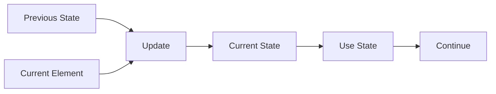

---

# 3. Core Mental Model

Mọi bài thuộc nhóm này có thể nhìn bằng flow:

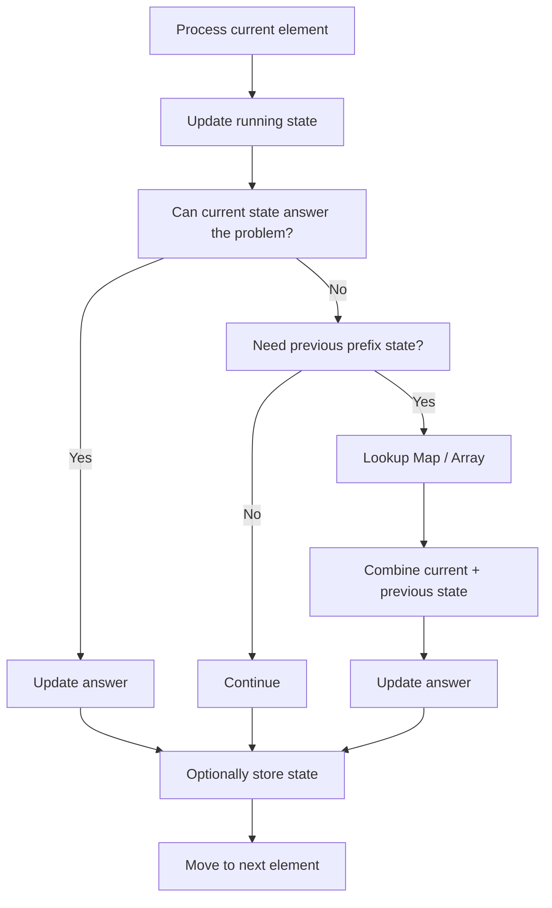

Có hai case lớn.

---

# 4. Case A — Chỉ cần Running State

Template:

```java
State state = initialState;

for (...) {
    state = update(state, current);
    answer = use(state);
}
```

Ví dụ:

```text
running sum
running max
running min
running balance
running frequency
```

Ta không cần biết state ở index 2 hay index 5.

Ta chỉ cần:

```text
best information seen so far
```

Ví dụ điển hình:

```text
LeetCode 121 — Best Time to Buy and Sell Stock
```

Ta chỉ cần:

```text
minimum price seen so far
```

---

# 5. Case B — Cần Previous Prefix States

Có những bài mà state hiện tại chưa đủ.

Ví dụ muốn tìm subarray có sum bằng `k`.

Giả sử:

```text
prefix[j] = tổng 0...j
prefix[i] = tổng 0...i
```

Thì:

```text
sum(i+1 ... j)
=
prefix[j] - prefix[i]
```

Nếu cần:

```text
sum = k
```

thì:

```text
currentPrefix - previousPrefix = k
```

Suy ra:

```text
previousPrefix = currentPrefix - k
```

Đây chính là lý do HashMap xuất hiện.

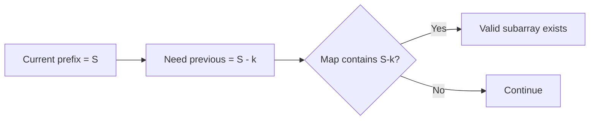

---

# 6. Prefix Sum

## 6.1 Definition

Với:

```text
nums = [1, 2, 3, 4, 5]
```

Dùng prefix array dài `n + 1`:

```text
prefix = [0, 1, 3, 6, 10, 15]
```

Ý nghĩa:

```text
prefix[i]
=
sum của nums[0 ... i-1]
```

Ví dụ:

```text
prefix[3] = 6

nums[0] + nums[1] + nums[2]
= 1 + 2 + 3
= 6
```

---

## 6.2 Construction

```java
int[] prefix = new int[nums.length + 1];

for (int i = 0; i < nums.length; i++) {
    prefix[i + 1] = prefix[i] + nums[i];
}
```

---

# 7. Tại sao Range Sum dùng phép trừ?

Giả sử cần:

```text
sum(i ... j)
```

Ta có:

```text
prefix[j + 1]
=
nums[0] + ... + nums[i-1]
+ nums[i] + ... + nums[j]
```

Trong khi:

```text
prefix[i]
=
nums[0] + ... + nums[i-1]
```

Trừ đi:

```text
prefix[j + 1] - prefix[i]
```

phần prefix trước `i` bị cancel.

Còn:

```text
nums[i] + ... + nums[j]
```

Do đó:

```text
rangeSum(i, j)
=
prefix[j + 1] - prefix[i]
```

---

## 7.1 Minh họa

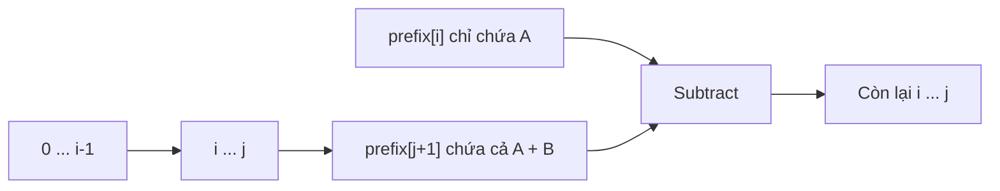

---

# 8. Vì sao Prefix Sum nhanh?

Không dùng prefix:

```text
Query sum(200 ... 800)

→ loop 601 phần tử
→ O(n)
```

Nếu có nhiều query:

```text
Q queries × O(n)
=
O(Qn)
```

Sau preprocessing:

```text
Build prefix: O(n)

Mỗi query:
prefix[r + 1] - prefix[l]

→ O(1)
```

Tổng:

```text
O(n + Q)
```

Đây là trade-off:

```text
Extra memory + preprocessing
                ↓
             Fast query
```

---

# 9. Vì sao thường dùng prefix length n + 1?

Có thể viết:

```text
prefix[i] = sum(0...i)
```

Nhưng khi query từ index `0`, ta phải special-case:

```java
if (left == 0)
```

Với:

```text
prefix[i] = sum của i elements đầu tiên
```

thì:

```text
prefix[0] = 0
```

và mọi query đều dùng:

```java
prefix[right + 1] - prefix[left]
```

Không cần special case.

Đây thường là convention sạch nhất trong interview.

---

# 10. Prefix Sum + HashMap

Đây là một trong những pattern quan trọng nhất.

Mental model:

```text
currentPrefix - previousPrefix = target
```

Suy ra:

```text
previousPrefix = currentPrefix - target
```

Thay vì thử mọi `previousPrefix`:

```text
O(n)
```

cho mỗi current index:

```text
O(n²)
```

ta HashMap previous states.

Lookup trung bình:

```text
O(1)
```

Toàn bộ:

```text
O(n)
```

---

# 11. Map đang lưu cái gì?

Không có câu trả lời cố định.

Tùy bài.

Có thể là:

```text
prefixSum -> frequency
```

để count subarray.

Hoặc:

```text
prefixSum -> earliest index
```

để tìm longest subarray.

Hoặc:

```text
remainder -> frequency
```

Hoặc:

```text
state -> first occurrence
```

Câu hỏi quan trọng trong interview:

> Value của HashMap phục vụ chính xác mục tiêu nào?

---

# 12. Thứ tự lookup và update

Thông thường:

```java
update current state

lookup previous state

update answer

store current state
```

chứ không phải:

```text
store current state
→ lookup
```

Vì nếu store trước, current state có thể tự match với chính nó.

Điều đó tương đương một subarray có length `0`, thường không hợp lệ.

Mental model:

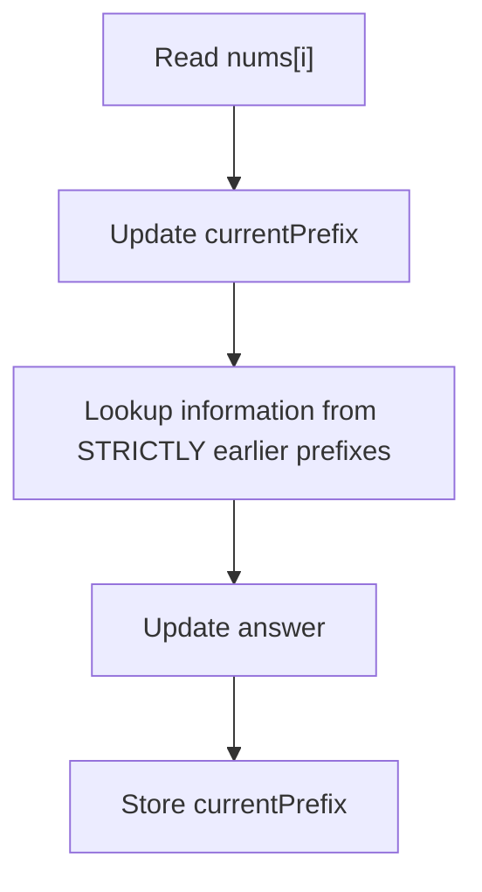

---

# 13. Prefix Sum + HashMap — LeetCode 560

## Problem

Cho array `nums` và integer `k`.

Đếm bao nhiêu contiguous subarray có tổng bằng `k`.

Ví dụ:

```text
nums = [1,1,1]
k = 2

answer = 2
```

Hai subarray:

```text
[1,1] indexes 0...1
[1,1] indexes 1...2
```

---

## Recognition

Keyword:

```text
subarray
sum
equals target
count number of subarrays
```

Brute force tự nhiên:

```text
start mọi index
end mọi index
```

→ O(n²).

Đây là dấu hiệu nên hỏi:

```text
Có thể biểu diễn subarray bằng difference của hai prefix không?
```

---

## Naive Approach

```java
int count = 0;

for (int i = 0; i < nums.length; i++) {
    int sum = 0;

    for (int j = i; j < nums.length; j++) {
        sum += nums[j];

        if (sum == k) {
            count++;
        }
    }
}
```

Time:

```text
O(n²)
```

---

## Key Observation

Nếu:

```text
currentPrefix - previousPrefix = k
```

thì:

```text
previousPrefix = currentPrefix - k
```

Ta chỉ cần biết:

> Có bao nhiêu previous prefixes bằng `currentPrefix - k`?

---

## State

```text
prefixSum
=
sum nums[0 ... i]
```

---

## Data Structure

```text
HashMap<prefixSum, frequency>
```

Tại sao frequency?

Vì cùng một prefix sum có thể xuất hiện nhiều lần.

Mỗi occurrence có thể tạo ra một subarray khác nhau.

---

## Important initialization

```java
map.put(0, 1);
```

Ý nghĩa:

```text
Trước khi đọc bất kỳ element nào,
đã tồn tại một empty prefix có sum = 0.
```

Nhờ đó nếu:

```text
currentPrefix == k
```

thì:

```text
currentPrefix - k = 0
```

ta detect được subarray bắt đầu từ index `0`.

---

## Algorithm

```text
prefix = 0
map = {0:1}
answer = 0

for each number:
    prefix += number

    need = prefix - k

    answer += map.getOrDefault(need, 0)

    map[prefix]++
```

---

## Java

```java
class Solution {
    public int subarraySum(int[] nums, int k) {
        Map<Integer, Integer> freq = new HashMap<>();

        freq.put(0, 1);

        int prefix = 0;
        int count = 0;

        for (int num : nums) {
            prefix += num;

            int need = prefix - k;

            count += freq.getOrDefault(need, 0);

            freq.put(
                prefix,
                freq.getOrDefault(prefix, 0) + 1
            );
        }

        return count;
    }
}
```

---

## Dry Run

```text
nums = [1,1,1]
k = 2
```

| i     | num | prefix | need | frequency[need] | answer |
| ----- | --: | -----: | ---: | --------------: | -----: |
| start |     |      0 |      |       map={0:1} |      0 |
| 0     |   1 |      1 |   -1 |               0 |      0 |
| 1     |   1 |      2 |    0 |               1 |      1 |
| 2     |   1 |      3 |    1 |               1 |      2 |

---

## Complexity

```text
Time:  O(n)
Space: O(n)
```

---

## Interview Explanation

> Brute force thử tất cả subarray sẽ mất O(n²). Tôi sẽ dùng prefix sum. Nếu prefix hiện tại là `S`, một subarray kết thúc tại đây có sum bằng `k` khi tồn tại previous prefix bằng `S-k`. Vì cần đếm tất cả subarray, tôi lưu frequency của mỗi prefix sum trong HashMap. Với mỗi phần tử, tôi update prefix, lookup `prefix-k`, cộng frequency vào answer, rồi mới thêm current prefix vào map. Complexity là O(n) time và O(n) space.

---

# 14. Running State là abstraction lớn hơn Running Sum

Ví dụ:

```text
running balance
running frequency
running parity
running XOR
running max
running min
```

Quan trọng không phải biến tên gì.

Quan trọng là:

> State phải compress được phần prefix đã xử lý thành đúng lượng thông tin cần cho phần còn lại.

Ví dụ stock:

```text
Tất cả giá trước hôm nay
```

không cần lưu.

Ta compress thành:

```text
minimum price seen so far
```

---

# 15. Running Balance

Ví dụ parentheses:

```text
s = "(()())"
```

Quy ước:

```text
'(' → +1
')' → -1
```

State:

```text
balance
```

Dry run:

| char | balance |
| ---- | ------: |
| `(`  |       1 |
| `(`  |       2 |
| `)`  |       1 |
| `(`  |       2 |
| `)`  |       1 |
| `)`  |       0 |

---

## State có ý nghĩa gì?

```text
balance =
số '(' chưa được match
```

hay mathematically:

```text
count('(') - count(')')
```

trên toàn bộ prefix hiện tại.

---

## Nếu balance < 0?

Ví dụ:

```text
")("
```

Ngay character đầu:

```text
balance = -1
```

Điều đó có nghĩa:

```text
số ')' > số '('
```

trong prefix.

Có một closing bracket không thể match.

Dù phía sau xuất hiện thêm `'('` cũng không cứu được prefix invalid trước đó.

---

## Nếu cuối cùng balance == 0?

Có cùng số opening và closing.

Để parentheses valid cần cả:

```text
balance không bao giờ < 0

AND

final balance == 0
```

---

# 16. Prefix State Beyond Sum

Prefix không chỉ là sum.

---

## 16.1 Prefix Count

Ví dụ:

```text
count số even từ 0...i
```

```java
if (nums[i] % 2 == 0) {
    evenCount++;
}
```

---

## 16.2 Prefix Frequency

Ví dụ string:

```text
"abbca"
```

state tại một prefix có thể là:

```text
a -> 1
b -> 2
c -> 1
```

---

## 16.3 Prefix Balance

```java
balance += typeA ? 1 : -1;
```

Dùng khi muốn so sánh số lượng hai nhóm.

---

## 16.4 Prefix Parity

Ta không quan tâm tổng chính xác.

Chỉ quan tâm:

```text
even / odd
```

Do:

```text
even + even = even
odd + odd = even
even + odd = odd
```

State chỉ cần:

```text
sum % 2
```

---

## 16.5 Prefix XOR

```java
prefixXor ^= nums[i];
```

XOR hữu ích vì:

```text
a ^ a = 0
a ^ 0 = a
```

Do đó hai prefix có thể cancel tương tự phép trừ trong Prefix Sum.

---

## 16.6 Prefix Min / Max

Ví dụ:

```text
minimum value seen so far
maximum value seen so far
```

Dùng cho:

```text
maximum future difference
best buy price
best prefix
```

---

## 16.7 Prefix Product

Có thể dùng:

```text
prefixProduct[i+1]
=
prefixProduct[i] * nums[i]
```

Nhưng division để query range gặp vấn đề khi có:

```text
0
overflow
negative numbers
integer division
```

Do đó Prefix Product không có tính tiện dụng phổ quát như Prefix Sum/XOR.

---

# 17. Prefix Equality Pattern

Một insight cực kỳ quan trọng:

> Nếu hai prefix có cùng state, phần nằm giữa chúng thường có một property đặc biệt.

Giả sử:

```text
prefixState[i] == prefixState[j]
```

thì đoạn:

```text
i + 1 ... j
```

không làm thay đổi state.

---

## Ví dụ sum

Nếu:

```text
prefixSum[i] == prefixSum[j]
```

thì:

```text
prefixSum[j] - prefixSum[i] = 0
```

Do đó:

```text
sum(i+1 ... j) = 0
```

---

## Minh họa

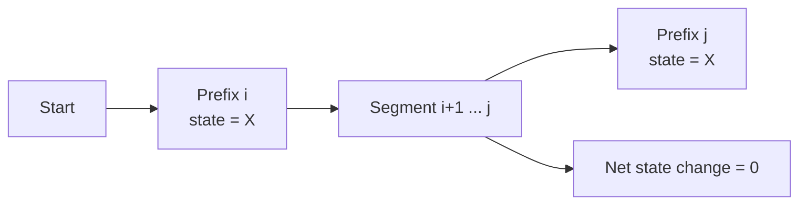

---

# 18. Transformation — biến dữ liệu thành state phù hợp

Đây là một kỹ năng interview rất quan trọng.

Không phải lúc nào Prefix Sum cũng áp dụng trực tiếp lên input.

Ta có thể transform input.

Ví dụ:

```text
0 → -1
1 → +1
```

Nếu một subarray có:

```text
equal number of 0 and 1
```

thì sau transformation:

```text
sum = 0
```

Bài toán:

```text
equal number of 0 and 1
```

được biến thành:

```text
zero-sum subarray
```

Và zero-sum subarray tương đương:

```text
same prefix sum at two positions
```

---

# 19. LeetCode 525 — Contiguous Array

## Problem

Array chỉ chứa:

```text
0 và 1
```

Tìm length lớn nhất của contiguous subarray có:

```text
same number of 0 and 1
```

Ví dụ:

```text
[0,1,0]

answer = 2
```

---

## Recognition

Condition:

```text
count(0) == count(1)
```

Đây chưa trực tiếp là sum.

Ta cần transform.

---

## Transformation

```text
0 → -1
1 → +1
```

Khi:

```text
#ones == #zeros
```

thì:

```text
(+1 × ones) + (-1 × zeros)
= 0
```

---

## Key Observation

Nếu balance tại hai prefix giống nhau:

```text
balance[i] == balance[j]
```

thì phần giữa có net balance:

```text
0
```

tức:

```text
equal zeros and ones
```

---

## State

```text
balance =
#ones - #zeros
```

---

## Data Structure

```text
balance -> earliest index
```

Tại sao earliest?

Vì muốn:

```text
maximum length
```

Nếu current index là `j`:

```text
length = j - earliestIndex
```

Càng giữ index sớm nhất càng tốt.

---

## Initialization

```java
first.put(0, -1);
```

Tại sao `-1`?

Trước index `0`, balance bằng `0`.

Ví dụ:

```text
[0,1]
```

tại index `1`:

```text
balance = 0
```

Length:

```text
1 - (-1) = 2
```

---

## Java

```java
class Solution {
    public int findMaxLength(int[] nums) {
        Map<Integer, Integer> first = new HashMap<>();

        first.put(0, -1);

        int balance = 0;
        int maxLength = 0;

        for (int i = 0; i < nums.length; i++) {
            balance += nums[i] == 1 ? 1 : -1;

            if (first.containsKey(balance)) {
                maxLength = Math.max(
                    maxLength,
                    i - first.get(balance)
                );
            } else {
                first.put(balance, i);
            }
        }

        return maxLength;
    }
}
```

---

## Dry Run

```text
nums = [0,1,0]
```

| i       | value | balance | first occurrence | length |
| ------- | ----: | ------: | ---------------: | -----: |
| initial |       |       0 |               -1 |        |
| 0       |     0 |      -1 |          store 0 |        |
| 1       |     1 |       0 |               -1 |      2 |
| 2       |     0 |      -1 |                0 |      2 |

Answer:

```text
2
```

---

## Complexity

```text
Time: O(n)
Space: O(n)
```

---

## Interview Explanation

> Tôi transform `0` thành `-1` và `1` thành `+1`. Khi đó một subarray có số 0 bằng số 1 nếu tổng transformed của nó bằng 0. Điều này xảy ra khi hai prefix có cùng balance. Tôi lưu earliest index của mỗi balance. Khi gặp lại cùng balance tại index `i`, đoạn giữa hai occurrence có balance 0 và length là `i - earliest`. Vì cần longest nên tôi không overwrite earliest index.

---

# 20. Prefix XOR

Với XOR:

```text
prefixXor[i]
=
nums[0] ^ nums[1] ^ ... ^ nums[i]
```

Do:

```text
a ^ a = 0
```

nên:

```text
prefix[r] ^ prefix[l-1]
```

cancel phần:

```text
0...l-1
```

Còn:

```text
l...r
```

---

## Với prefix n + 1

Định nghĩa:

```text
prefixXor[i]
=
XOR của i phần tử đầu tiên
```

thì:

```text
xor(l...r)
=
prefixXor[r+1] ^ prefixXor[l]
```

Giống Prefix Sum:

```text
sum:
prefix[r+1] - prefix[l]

xor:
prefixXor[r+1] ^ prefixXor[l]
```

---

# 21. LeetCode 1310 — XOR Queries of a Subarray

## Problem

Cho array và nhiều query:

```text
[left, right]
```

Mỗi query yêu cầu XOR tất cả element:

```text
nums[left ... right]
```

---

## Recognition

Keyword:

```text
many range queries
XOR
immutable array
```

→ Prefix XOR.

---

## Naive

Mỗi query loop đoạn `[l,r]`.

Worst-case:

```text
O(n × q)
```

---

## State

```text
prefixXor[i]
=
XOR của i elements đầu tiên
```

---

## Java

```java
class Solution {
    public int[] xorQueries(int[] arr, int[][] queries) {
        int n = arr.length;

        int[] prefix = new int[n + 1];

        for (int i = 0; i < n; i++) {
            prefix[i + 1] = prefix[i] ^ arr[i];
        }

        int[] answer = new int[queries.length];

        for (int i = 0; i < queries.length; i++) {
            int left = queries[i][0];
            int right = queries[i][1];

            answer[i] =
                prefix[right + 1] ^ prefix[left];
        }

        return answer;
    }
}
```

---

## Complexity

```text
Build: O(n)

Queries: O(q)

Total:
O(n + q)

Space:
O(n)
```

---

# 22. Prefix + Frequency Map trên String

Giả sử:

```text
s = "abcabc"
```

Có ba khái niệm rất dễ nhầm.

---

## Global Frequency

Frequency của toàn string.

```text
a = 2
b = 2
c = 2
```

Không phụ thuộc index.

---

## Prefix Frequency

Frequency:

```text
0 ... i
```

Ví dụ tại:

```text
"abca"
```

state:

```text
a=2
b=1
c=1
```

Prefix frequency hữu ích khi:

```text
query substring bằng difference giữa hai prefix counts
```

Ví dụ:

```text
count character c trong s[l...r]
=
prefixCount[r+1][c]
-
prefixCount[l][c]
```

---

## Sliding Window Frequency

Chỉ đại diện cho:

```text
left ... right
```

Và cả hai boundary có thể thay đổi.

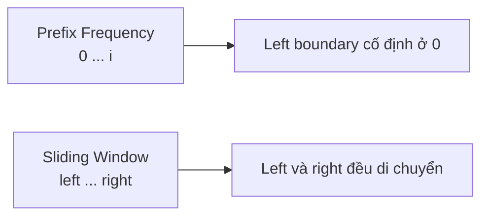

---

# 23. Running Maximum / Minimum

Một pattern rất phổ biến:

```text
current value - minimum seen before
```

Nếu cần maximize:

```text
nums[j] - nums[i]

với i < j
```

thì tại `j`:

```text
nums[j]
```

đã cố định.

Ta chỉ cần:

```text
minimum nums[i] trước j
```

---

# 24. LeetCode 121 — Best Time to Buy and Sell Stock

## Problem

Cho:

```text
prices[i]
```

là giá cổ phiếu ngày `i`.

Chỉ được:

```text
buy trước
sell sau
```

Tìm maximum profit.

Ví dụ:

```text
[7,1,5,3,6,4]
```

Best:

```text
buy = 1
sell = 6

profit = 5
```

---

## Recognition

Brute force:

```text
mọi buy day
×
mọi sell day phía sau
```

→ O(n²).

Nhưng tại mỗi sell day:

```text
bestBuy
=
minimum price before today
```

Đây là Running Minimum.

---

## State

```text
minPrice =
minimum price seen trong prefix
```

---

## Key Observation

Tại ngày `i`:

```text
profit nếu sell hôm nay
=
prices[i] - minPrice
```

Sau đó update best profit.

---

## Java

```java
class Solution {
    public int maxProfit(int[] prices) {
        int minPrice = Integer.MAX_VALUE;
        int maxProfit = 0;

        for (int price : prices) {
            minPrice = Math.min(minPrice, price);

            maxProfit = Math.max(
                maxProfit,
                price - minPrice
            );
        }

        return maxProfit;
    }
}
```

---

## Dry Run

```text
[7,1,5,3,6,4]
```

| price | minPrice | current profit | best |
| ----: | -------: | -------------: | ---: |
|     7 |        7 |              0 |    0 |
|     1 |        1 |              0 |    0 |
|     5 |        1 |              4 |    4 |
|     3 |        1 |              2 |    4 |
|     6 |        1 |              5 |    5 |
|     4 |        1 |              3 |    5 |

---

## Complexity

```text
Time: O(n)
Space: O(1)
```

---

## Interview Explanation

> Brute force thử tất cả buy/sell pairs là O(n²). Khi đang ở một ngày và coi đó là sell day, giá sell đã cố định. Điều duy nhất tôi cần từ toàn bộ prefix trước đó là minimum price đã thấy. Vì vậy tôi duy trì `minPrice`. Profit nếu sell hôm nay là `price - minPrice`, rồi update global maximum. Đây là running-state solution O(n), O(1).

---

# 25. Kadane và Running State

Kadane:

```java
currentSum =
    Math.max(
        nums[i],
        currentSum + nums[i]
    );
```

State:

```text
currentSum
=
maximum subarray sum
mà BẮT BUỘC kết thúc tại index i
```

Đây là điểm rất quan trọng.

Không phải:

```text
maximum sum từ đầu đến i
```

Mà là:

```text
best contiguous subarray ending exactly at i
```

---

# 26. Vì sao recurrence của Kadane đúng?

Một maximum subarray kết thúc tại `i` chỉ có hai khả năng:

### Option 1

Start mới tại `i`.

```text
nums[i]
```

### Option 2

Extend best subarray ending tại `i-1`.

```text
currentSumPrevious + nums[i]
```

Không có option thứ ba.

Do đó:

```text
currentSum =
max(
    nums[i],
    previousCurrentSum + nums[i]
)
```

---

# 27. LeetCode 53 — Maximum Subarray

## Problem

Tìm contiguous subarray có sum lớn nhất.

Ví dụ:

```text
[-2,1,-3,4,-1,2,1,-5,4]
```

Answer:

```text
[4,-1,2,1]
sum = 6
```

---

## Naive

Thử tất cả subarray:

```text
O(n²)
```

nếu accumulate sum.

---

## State

```text
currentSum =
best subarray sum ending at current index
```

Global:

```text
maxSum =
best subarray sum anywhere so far
```

---

## Java

```java
class Solution {
    public int maxSubArray(int[] nums) {
        int currentSum = nums[0];
        int maxSum = nums[0];

        for (int i = 1; i < nums.length; i++) {
            currentSum = Math.max(
                nums[i],
                currentSum + nums[i]
            );

            maxSum = Math.max(
                maxSum,
                currentSum
            );
        }

        return maxSum;
    }
}
```

---

## Dry Run

```text
[-2,1,-3,4,-1,2,1,-5,4]
```

| num | currentSum | maxSum |
| --: | ---------: | -----: |
|  -2 |         -2 |     -2 |
|   1 |          1 |      1 |
|  -3 |         -2 |      1 |
|   4 |          4 |      4 |
|  -1 |          3 |      4 |
|   2 |          5 |      5 |
|   1 |          6 |      6 |
|  -5 |          1 |      6 |
|   4 |          5 |      6 |

---

## Prefix perspective

Kadane cũng có thể nhìn qua Prefix Sum.

Nếu:

```text
prefix[j] = current prefix sum
```

thì subarray tốt nhất kết thúc tại `j` là:

```text
currentPrefix - minimumPrefixSeenBefore
```

Vì muốn maximize:

```text
currentPrefix - previousPrefix
```

ta chọn:

```text
minimum previousPrefix
```

Đây là bridge rất quan trọng giữa:

```text
Prefix
Running State
Kadane
DP
```

---

# 28. Kadane có phải Prefix Sum không?

Không hoàn toàn.

Prefix Sum lưu:

```text
cumulative sum từ đầu
```

Kadane lưu:

```text
optimal state ending here
```

Nhưng Kadane có thể được derive từ prefix reasoning.

---

# 29. Kadane có phải DP không?

Có.

Ta có recurrence:

```text
dp[i]
=
maximum subarray sum ending at i
```

```text
dp[i]
=
max(
    nums[i],
    dp[i-1] + nums[i]
)
```

Sau đó space optimize:

```text
dp[i-1]
```

thành:

```text
currentSum
```

Do đó:

> Kadane là DP được space-optimize thành Running State.

---

# 30. Prefix vs Sliding Window

Đây là một distinction rất quan trọng.

## Prefix

Thường reasoning:

```text
state của 0...i
```

Nếu cần arbitrary subarray:

```text
subtract / compare hai prefix states
```

---

## Sliding Window

Maintain trực tiếp:

```text
[left ... right]
```

và điều chỉnh `left` khi condition bị vi phạm.

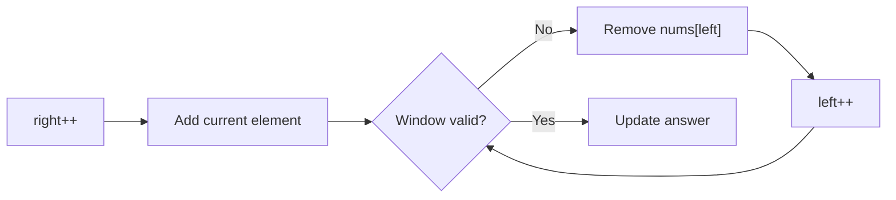

---

## Điểm khác biệt lớn

Sliding Window hoạt động tốt nhất khi có tính chất:

```text
Khi window invalid,
move left có thể khiến nó dần valid trở lại.
```

Đặc biệt phổ biến khi:

```text
non-negative numbers
frequency constraints
at most K
no duplicate
```

---

# 31. Prefix + HashMap vs Sliding Window

Ví dụ:

```text
Subarray Sum Equals K
```

Nếu `nums` có negative:

```text
[1, -1, 5, -2, 3]
```

Sliding Window không ổn định.

Vì khi sum quá lớn:

```text
shrinking window
```

không đảm bảo sum giảm theo cách monotonic.

Một số negative có thể khiến sum tăng hoặc giảm khó đoán.

Prefix + HashMap không cần monotonicity.

Do đó dùng được cho:

```text
positive
negative
zero
```

---

# 32. Prefix vs Two Pointers

Two Pointers là abstraction rộng hơn:

```text
pointer A
pointer B
```

Không nhất thiết maintain cumulative state.

Ví dụ sorted Two Sum:

```text
left = 0
right = n - 1
```

Dựa vào sorted order để quyết định:

```text
left++
hoặc
right--
```

Sliding Window thực chất thường là một loại Two Pointers.

Prefix-based thinking thì tập trung vào:

```text
information về dữ liệu đã xử lý
```

---

# 33. Prefix vs DP

Prefix:

```text
prefix[i]
=
cumulative information của 0...i
```

Không nhất thiết có optimization.

Ví dụ:

```text
prefix sum
prefix xor
prefix frequency
```

DP:

```text
dp[state]
```

thường biểu diễn:

```text
optimal result
number of ways
feasibility
solution của subproblem
```

và có recurrence.

---

## Ví dụ

Prefix:

```java
prefix[i + 1] =
    prefix[i] + nums[i];
```

Đây chỉ là cumulative arithmetic.

DP:

```java
dp[i] =
    Math.max(
        nums[i],
        dp[i - 1] + nums[i]
    );
```

`dp[i]` là một optimal solution.

---

# 34. So sánh các pattern

| Pattern          | State                   | Data Structure | Khi dùng                 |
| ---------------- | ----------------------- | -------------- | ------------------------ |
| Running Sum      | cumulative sum          | variable       | scan một lần             |
| Prefix Sum       | cumulative sum          | array          | range query              |
| Prefix + HashMap | current/previous prefix | HashMap        | subarray target          |
| Prefix Equality  | repeated state          | HashMap        | balanced segment         |
| Prefix XOR       | cumulative XOR          | array/map      | range XOR                |
| Running Min/Max  | best value so far       | variable       | max difference           |
| Sliding Window   | state trong `[l,r]`     | variables/map  | dynamic contiguous range |
| Kadane           | best ending here        | variable       | maximum subarray         |
| DP               | solution của subproblem | array/map      | recurrence/overlap       |

---

# 35. LeetCode 1480 — Running Sum of 1D Array

## Problem

Input:

```text
[1,2,3,4]
```

Output:

```text
[1,3,6,10]
```

Mỗi position chứa:

```text
sum nums[0...i]
```

---

## Recognition

Đề trực tiếp yêu cầu cumulative prefix sum.

---

## State

```text
runningSum =
sum của prefix hiện tại
```

---

## Java

```java
class Solution {
    public int[] runningSum(int[] nums) {
        int sum = 0;

        for (int i = 0; i < nums.length; i++) {
            sum += nums[i];
            nums[i] = sum;
        }

        return nums;
    }
}
```

Time:

```text
O(n)
```

Space:

```text
O(1)
```

nếu modify input.

---

# 36. LeetCode 303 — Range Sum Query Immutable

## Problem

Cho immutable array.

Có nhiều query:

```text
sumRange(left, right)
```

Phải trả tổng:

```text
nums[left ... right]
```

---

## Recognition

```text
immutable
multiple range sum queries
```

→ preprocessing Prefix Sum.

---

## State

```text
prefix[i]
=
sum của first i elements
```

---

## Java

```java
class NumArray {

    private final int[] prefix;

    public NumArray(int[] nums) {
        prefix = new int[nums.length + 1];

        for (int i = 0; i < nums.length; i++) {
            prefix[i + 1] =
                prefix[i] + nums[i];
        }
    }

    public int sumRange(int left, int right) {
        return prefix[right + 1] - prefix[left];
    }
}
```

---

## Complexity

Construction:

```text
O(n)
```

Query:

```text
O(1)
```

Space:

```text
O(n)
```

---

# 37. LeetCode 724 — Find Pivot Index

## Problem

Tìm index sao cho:

```text
sum bên trái
=
sum bên phải
```

Không tính element tại pivot.

Ví dụ:

```text
[1,7,3,6,5,6]
```

pivot:

```text
3
```

vì:

```text
1 + 7 + 3 = 11

5 + 6 = 11
```

---

## Recognition

Condition liên quan:

```text
left prefix
right remainder
```

Ta không cần prefix array.

Chỉ cần:

```text
total sum
+
running left sum
```

---

## Key Observation

Tại index `i`:

```text
rightSum
=
totalSum - leftSum - nums[i]
```

Nếu:

```text
leftSum == rightSum
```

thì `i` là pivot.

---

## State

```text
leftSum =
sum của elements trước i
```

---

## Java

```java
class Solution {
    public int pivotIndex(int[] nums) {
        int total = 0;

        for (int num : nums) {
            total += num;
        }

        int left = 0;

        for (int i = 0; i < nums.length; i++) {
            int right =
                total - left - nums[i];

            if (left == right) {
                return i;
            }

            left += nums[i];
        }

        return -1;
    }
}
```

---

# 38. Prefix Modulo State

Một transformation state khác cực kỳ quan trọng:

```text
prefixSum % k
```

Nếu:

```text
prefixA % k
==
prefixB % k
```

thì:

```text
(prefixB - prefixA) % k == 0
```

Tức phần giữa divisible by `k`.

---

## Vì sao?

Nếu:

```text
prefixA = ak + r
prefixB = bk + r
```

thì:

```text
prefixB - prefixA
=
(b-a)k
```

→ divisible by `k`.

---

# 39. LeetCode 974 — Subarray Sums Divisible by K

## Problem

Đếm số subarray có tổng chia hết cho `k`.

---

## Recognition

Condition:

```text
subarraySum % k == 0
```

Subarray sum:

```text
currentPrefix - previousPrefix
```

Ta cần:

```text
(currentPrefix - previousPrefix) % k == 0
```

Tương đương:

```text
currentPrefix % k
==
previousPrefix % k
```

→ Prefix Equality trên remainder.

---

## State

```text
remainder =
prefixSum % k
```

---

## Negative remainder

Java có thể:

```text
-2 % 5 = -2
```

Ta normalize:

```java
remainder =
    ((prefix % k) + k) % k;
```

Hoặc:

```java
remainder %= k;

if (remainder < 0) {
    remainder += k;
}
```

---

## Java

```java
class Solution {
    public int subarraysDivByK(int[] nums, int k) {
        Map<Integer, Integer> freq =
            new HashMap<>();

        freq.put(0, 1);

        int prefix = 0;
        int count = 0;

        for (int num : nums) {
            prefix += num;

            int remainder = prefix % k;

            if (remainder < 0) {
                remainder += k;
            }

            count +=
                freq.getOrDefault(remainder, 0);

            freq.put(
                remainder,
                freq.getOrDefault(remainder, 0) + 1
            );
        }

        return count;
    }
}
```

---

## Complexity

```text
Time: O(n)
Space: O(min(n,k))
```

---

# 40. LeetCode 523 — Continuous Subarray Sum

## Problem

Kiểm tra có subarray:

```text
length >= 2
```

và:

```text
sum % k == 0
```

---

## Recognition

Giống 974:

```text
same prefix remainder
```

Nhưng mục tiêu không phải count.

Ta cần:

```text
existence
+
distance >= 2
```

---

## Map Value

Không cần frequency.

Ta cần:

```text
remainder -> earliest index
```

Nếu remainder lặp tại:

```text
previousIndex
currentIndex
```

và:

```text
currentIndex - previousIndex >= 2
```

→ valid.

---

## Initialization

```java
map.put(0, -1);
```

---

## Java

```java
class Solution {
    public boolean checkSubarraySum(int[] nums, int k) {
        Map<Integer, Integer> first =
            new HashMap<>();

        first.put(0, -1);

        int prefix = 0;

        for (int i = 0; i < nums.length; i++) {
            prefix += nums[i];

            int remainder = prefix % k;

            if (first.containsKey(remainder)) {
                if (i - first.get(remainder) >= 2) {
                    return true;
                }
            } else {
                first.put(remainder, i);
            }
        }

        return false;
    }
}
```

---

# 41. 560 vs 525 vs 523 vs 974

Đây là một comparison rất đáng nhớ.

| Problem                  | State      | Map value      |
| ------------------------ | ---------- | -------------- |
| 560 Subarray Sum = K     | prefix sum | frequency      |
| 525 Equal 0/1            | balance    | earliest index |
| 523 Sum divisible by K   | remainder  | earliest index |
| 974 Count divisible by K | remainder  | frequency      |

Nhìn thấy sự khác biệt:

```text
COUNT
→ frequency

LONGEST / DISTANCE
→ earliest index

EXISTENCE WITH LENGTH
→ earliest index

RANGE QUERY
→ prefix array
```

---

# 42. 2D Prefix Sum

Prefix idea có thể mở rộng từ array sang matrix.

Giả sử:

```text
prefix[r][c]
```

đại diện cho tổng rectangle:

```text
(0,0)
đến
(r-1,c-1)
```

Ta tiếp tục dùng array có extra row/column:

```text
(m + 1) × (n + 1)
```

---

# 43. Xây dựng 2D Prefix

Công thức:

```text
prefix[r+1][c+1]
=
matrix[r][c]
+ prefix[r][c+1]
+ prefix[r+1][c]
- prefix[r][c]
```

Tại sao phải trừ?

Vì phần top-left intersection bị cộng hai lần.

---

## Minh họa Inclusion-Exclusion

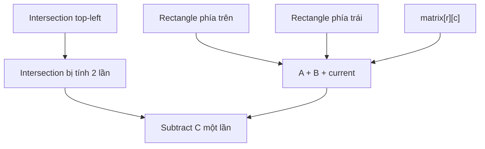

---

# 44. Query rectangle

Cho rectangle:

```text
row1..row2
col1..col2
```

Công thức:

```text
total
- top
- left
+ topLeft
```

Cụ thể:

```java
prefix[row2 + 1][col2 + 1]
- prefix[row1][col2 + 1]
- prefix[row2 + 1][col1]
+ prefix[row1][col1]
```

---

# 45. LeetCode 304 — Range Sum Query 2D Immutable

## Problem

Cho immutable matrix.

Có nhiều query yêu cầu tổng trong rectangle.

---

## Recognition

```text
immutable matrix
multiple rectangle sum queries
```

→ 2D Prefix Sum.

---

## State

```text
prefix[r][c]
=
sum của rectangle từ origin tới trước r,c
```

---

## Java

```java
class NumMatrix {

    private final int[][] prefix;

    public NumMatrix(int[][] matrix) {
        int rows = matrix.length;
        int cols = matrix[0].length;

        prefix = new int[rows + 1][cols + 1];

        for (int r = 0; r < rows; r++) {
            for (int c = 0; c < cols; c++) {
                prefix[r + 1][c + 1] =
                    matrix[r][c]
                    + prefix[r][c + 1]
                    + prefix[r + 1][c]
                    - prefix[r][c];
            }
        }
    }

    public int sumRegion(
        int row1,
        int col1,
        int row2,
        int col2
    ) {
        return prefix[row2 + 1][col2 + 1]
            - prefix[row1][col2 + 1]
            - prefix[row2 + 1][col1]
            + prefix[row1][col1];
    }
}
```

---

## Complexity

Build:

```text
O(mn)
```

Each query:

```text
O(1)
```

Space:

```text
O(mn)
```

---

# 46. Common Mistake 1 — Off-by-one

## Wrong idea

Không rõ:

```text
prefix[i]
```

đại diện cho:

```text
sum 0...i
```

hay:

```text
sum của first i elements
```

---

## Correct mental model

Nên chuẩn hóa:

```text
prefix[i]
=
sum nums[0 ... i-1]
```

Do đó:

```text
prefix[0] = 0
```

Range:

```text
prefix[r+1] - prefix[l]
```

---

# 47. Common Mistake 2 — Quên prefix 0

Sai:

```java
Map<Integer, Integer> map = new HashMap<>();
```

trong bài 560.

Nếu subarray bắt đầu index 0:

```text
prefix = k
```

ta cần tìm:

```text
prefix - k = 0
```

Nếu map không có `0`, ta miss case.

Correct:

```java
map.put(0, 1);
```

---

# 48. Common Mistake 3 — Update HashMap trước lookup

Ví dụ:

```java
prefix += num;

map.put(prefix, ...);

count += map.getOrDefault(prefix - k, 0);
```

Có thể current state tự được coi là previous prefix.

Correct order:

```java
prefix += num;

count += map.getOrDefault(prefix - k, 0);

map.put(
    prefix,
    map.getOrDefault(prefix, 0) + 1
);
```

---

# 49. Common Mistake 4 — Lưu latest index khi cần longest

Ví dụ 525.

Sai:

```java
map.put(balance, i);
```

mỗi lần gặp balance.

Ta mất occurrence sớm nhất.

Correct:

```java
if (!map.containsKey(balance)) {
    map.put(balance, i);
}
```

---

# 50. Common Mistake 5 — Nhầm Prefix với Sliding Window

Nếu bài:

```text
subarray sum = k
```

và numbers có negative:

```text
[-1, 3, -2, 5]
```

Không nên tự động dùng Sliding Window.

Sliding Window thường cần monotonic property.

Prefix + HashMap không cần.

---

# 51. Common Mistake 6 — Không transform input

Bài:

```text
equal number of 0 and 1
```

Nếu chỉ nghĩ:

```text
Prefix Sum?
```

trên dữ liệu `0/1`, equality không trực tiếp tương ứng sum = 0.

Transform:

```text
0 -> -1
1 -> +1
```

làm property xuất hiện.

Mental model:

> Đừng hỏi chỉ “có dùng prefix được không?”

Hãy hỏi:

> “Tôi có thể định nghĩa một state để condition trở thành relation giữa hai prefix không?”

---

# 52. Common Mistake 7 — Integer overflow

Ví dụ:

```java
int prefix;
```

Nếu:

```text
n lớn
nums[i] lớn
```

prefix có thể vượt:

```text
2,147,483,647
```

Khi constraints cho phép, dùng:

```java
long prefix = 0;
```

và:

```java
Map<Long, Integer>
```

---

# 53. Common Mistake 8 — 2D inclusion-exclusion sai

Sai thường gặp:

```text
A - B - C
```

quên cộng lại intersection.

Đúng:

```text
A - B - C + D
```

Vì `D` đã bị subtract hai lần.

---

# 54. Pattern Recognition Checklist

Khi đọc bài, chạy checklist này.

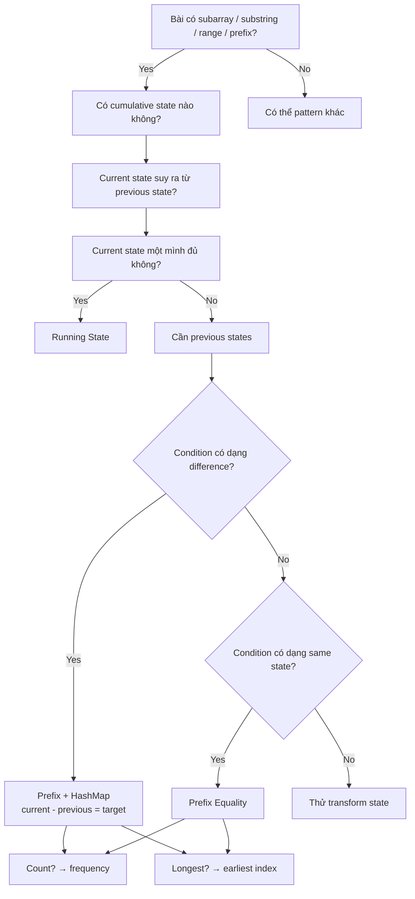

---

# 55. Framework suy nghĩ trong Coding Interview

Khi interviewer đưa đề:

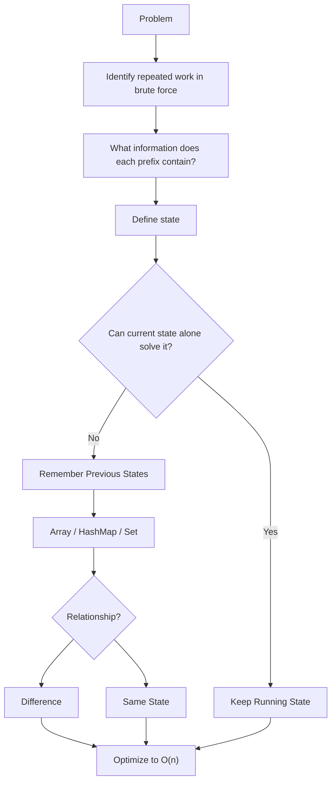

---

# 56. Pattern Recognition Exercise 1

## Problem

> Given an array, count the number of subarrays whose sum equals `k`.

Recognition:

```text
subarray
+
sum target
+
count
```

Answer:

```text
Prefix Sum + HashMap frequency
```

Core equation:

```text
currentPrefix - previousPrefix = k
```

---

# 57. Exercise 2

> Find the longest subarray containing equal numbers of `0` and `1`.

Transform:

```text
0 -> -1
1 -> +1
```

Then:

```text
same prefix balance
```

Answer:

```text
Prefix Equality
+
earliest index
```

---

# 58. Exercise 3

> Given stock prices, maximize profit from one buy and one later sell.

At current sell day:

```text
need minimum previous price
```

Answer:

```text
Running Minimum
```

---

# 59. Exercise 4

> Answer 100,000 range sum queries on an immutable array.

Answer:

```text
Prefix Sum Array
```

Build:

```text
O(n)
```

Each query:

```text
O(1)
```

---

# 60. Exercise 5

> Determine whether parentheses are valid.

State:

```text
balance
```

Need:

```text
balance never < 0
final balance == 0
```

Answer:

```text
Running Balance
```

Nếu chỉ có một bracket type, không cần stack.

---

# 61. Exercise 6

> Count subarrays whose sum is divisible by `k`.

Condition:

```text
subarray % k == 0
```

Transform state:

```text
prefix % k
```

Answer:

```text
Prefix Remainder Equality
+
frequency map
```

---

# 62. Exercise 7

> Find maximum sum contiguous subarray.

State:

```text
best sum ending here
```

Answer:

```text
Kadane / DP / Running Optimal State
```

---

# 63. Exercise 8

> Many XOR range queries.

Answer:

```text
Prefix XOR
```

Query:

```text
prefixXor[r+1] ^ prefixXor[l]
```

---

# 64. Exercise 9

> Given a matrix, repeatedly query the sum of arbitrary rectangles.

Answer:

```text
2D Prefix Sum
```

---

# 65. Exercise 10

> Find longest substring without repeating characters.

Đây không phải Prefix Equality.

Ta cần maintain một dynamic contiguous range sao cho:

```text
all chars unique
```

Khi duplicate xuất hiện:

```text
move left
```

Answer:

```text
Sliding Window
```

Điều quan trọng là biết **khi nào KHÔNG dùng Prefix**.

---

# 66. Deep Pattern Comparison

| Pattern          | State đại diện cho          |        Store history? | Typical complexity |
| ---------------- | --------------------------- | --------------------: | -----------------: |
| Running Sum      | tổng prefix hiện tại        |                    No |               O(n) |
| Prefix Array     | cumulative info mọi prefix  |                   Yes |         O(n) build |
| Prefix + HashMap | selected previous states    |                   Yes |               O(n) |
| Prefix Equality  | occurrence của cùng state   |                   Yes |               O(n) |
| Running Min      | min prefix value            |                    No |               O(n) |
| Running Balance  | net count difference        |            Usually no |               O(n) |
| Prefix XOR       | cumulative XOR              |             Sometimes |               O(n) |
| Sliding Window   | current `[l,r]`             |       No full history |               O(n) |
| Kadane           | optimal segment ending here |                    No |               O(n) |
| DP               | solution subproblem         | Usually yes/optimized |            Depends |

---

# 67. Một mental model mạnh hơn: State Compression

Running State thực ra là:

> Compress toàn bộ quá khứ thành thông tin nhỏ nhất đủ cho tương lai.

Ví dụ Stock:

```text
Past prices:
[7, 9, 4, 8, 3, 6, ...]
```

Để quyết định profit nếu sell hôm nay, ta không cần:

```text
7,9,4,8,3
```

Chỉ cần:

```text
min = 3
```

Ta đã compress toàn bộ past thành một integer.

---

# 68. Prefix HashMap cũng là State Compression

Với Subarray Sum = K:

Không lưu mọi subarray.

Ta compress history thành:

```text
prefixSum -> count
```

Ví dụ:

```text
past prefixes:

0
3
5
3
7
3
```

Không cần biết tất cả positions nếu chỉ count.

Ta có thể compress:

```text
0 -> 1
3 -> 3
5 -> 1
7 -> 1
```

---

# 69. Câu hỏi quan trọng nhất khi thiết kế HashMap

Đừng hỏi:

```text
"Tôi có nên dùng HashMap không?"
```

Hãy hỏi:

```text
Tôi cần biết điều gì về các previous states?
```

Nếu cần:

```text
Có tồn tại không?
```

→ Set có thể đủ.

Nếu cần:

```text
Bao nhiêu lần?
```

→ frequency.

Nếu cần:

```text
Lần đầu ở đâu?
```

→ earliest index.

Nếu cần:

```text
Lần gần nhất ở đâu?
```

→ latest index.

Nếu cần:

```text
best value associated with state?
```

→ map state → best value.

---

# 70. Decision Table cho HashMap Value

| Mục tiêu                           | Map value                    |
| ---------------------------------- | ---------------------------- |
| Count subarrays                    | frequency                    |
| Longest subarray                   | earliest index               |
| Shortest candidate                 | thường latest/relevant index |
| Existence                          | boolean/index/Set            |
| Recover range                      | index                        |
| Number of previous matching states | count                        |

---

# 71. Prefix Sum khác Prefix State như thế nào?

Prefix Sum:

```text
một loại Prefix State
```

Hierarchy:

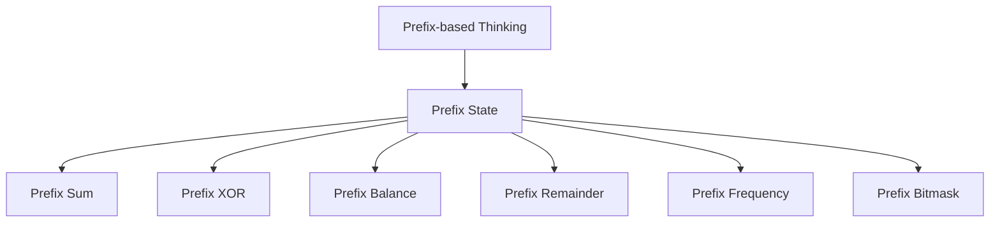

Vì vậy:

```text
Prefix Sum ⊂ Prefix State
```

---

# 72. Running State khác Prefix State như thế nào?

Có overlap.

Running State nhấn mạnh:

```text
state hiện tại được update liên tục
```

Prefix State nhấn mạnh:

```text
state đại diện cho prefix
```

Ví dụ:

```text
runningSum
```

vừa là:

```text
Running State
```

vừa là:

```text
Current Prefix State
```

Nhưng nếu ta store tất cả prefix:

```java
prefix[i]
```

thì ta chuyển sang:

```text
stored prefix information
```

---

# 73. Final Mental Model

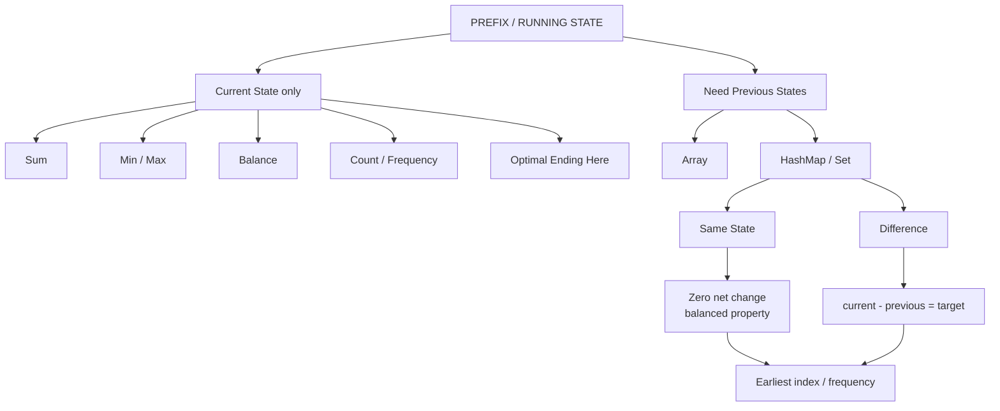

---

# 74. Final Problem-Solving Flow

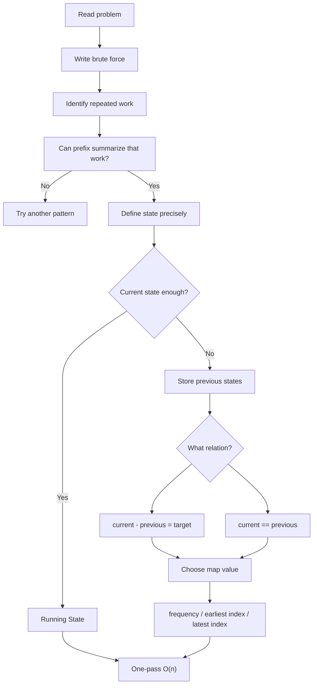

---

# 75. Interview Script Template

Khi trình bày, có thể dùng flow sau.

> Brute-force solution sẽ thử mọi subarray nên mất O(n²). Tôi nhận thấy thông tin của một subarray có thể được biểu diễn thông qua hai prefix states. Vì vậy tôi sẽ traverse từ trái sang phải và duy trì một running state. Tại mỗi index, tôi xác định state hiện tại đang đại diện cho `...`. Sau đó tôi cần tìm một previous state thỏa `...`. Vì lookup trực tiếp tất cả previous states sẽ lại thành O(n²), tôi lưu chúng trong HashMap. Map sẽ lưu `state -> ...` vì mục tiêu của bài là `count/longest/existence`. Điều này đưa complexity xuống O(n) time và O(n) space.

Đây là cách giải thích tốt hơn nhiều so với chỉ nói:

```text
"I use HashMap."
```

---

# 76. Cheat Sheet — Running State

```text
Running Sum
───────────
state += nums[i]


Running Count
─────────────
if condition:
    count++


Running Min
───────────
minValue = min(minValue, current)


Running Max
───────────
maxValue = max(maxValue, current)


Running Balance
───────────────
typeA → +1
typeB → -1


Kadane
──────
current =
    max(
        nums[i],
        current + nums[i]
    )
```

---

# 77. Cheat Sheet — Prefix

```text
Prefix Sum
──────────
prefix[i+1]
=
prefix[i] + nums[i]


Range Sum
─────────
prefix[r+1] - prefix[l]


Prefix XOR
──────────
prefixXor[i+1]
=
prefixXor[i] ^ nums[i]


Range XOR
─────────
prefixXor[r+1] ^ prefixXor[l]
```

---

# 78. Cheat Sheet — Prefix + HashMap

### Target Difference

```text
current - previous = target
```

Suy ra:

```text
previous = current - target
```

Code idea:

```java
if (map.containsKey(current - target)) {
    ...
}
```

---

### Same State

```text
currentState == previousState
```

Suy ra phần giữa có:

```text
net state change = 0
```

---

### Count

```text
state -> frequency
```

---

### Longest

```text
state -> earliest index
```

---

# 79. Cheat Sheet — Modular Prefix

```text
subarray divisible by k
```

Equivalent:

```text
currentPrefix % k
==
previousPrefix % k
```

State:

```text
remainder
```

---

# 80. Cheat Sheet — 2D Prefix

Build:

```text
prefix[r+1][c+1]
=
matrix[r][c]
+ top
+ left
- topLeft
```

Query:

```text
whole
- top
- left
+ overlap
```

---

# 81. Interview Checklist

Trước khi code, tự hỏi:

```text
[ ] State của tôi đại diện chính xác cho cái gì?

[ ] State có thể update O(1) khi đọc element mới không?

[ ] Tôi chỉ cần current state hay cần previous states?

[ ] Nếu cần previous state:
      tôi cần existence,
      frequency,
      earliest index
      hay latest index?

[ ] Condition có thể viết thành:
      current - previous = target
    không?

[ ] Hoặc:
      current == previous
    không?

[ ] Có thể transform input không?

[ ] Có negative number khiến Sliding Window không hoạt động không?

[ ] Tôi có cần prefix[0] / map.put(0,...) không?

[ ] Tôi đang lookup trước hay store trước?

[ ] Có overflow không?

[ ] Complexity đã từ O(n²) xuống O(n) chưa?
```

---

# 82. Roadmap LeetCode

Không nên học random.

Hãy học theo evolution của mental model.

---

## Stage 1 — Current Running State

Mục tiêu:

```text
Hiểu state đại diện cho prefix đã xử lý.
```

Luyện:

```text
1480 — Running Sum of 1d Array
724  — Find Pivot Index
121  — Best Time to Buy and Sell Stock
53   — Maximum Subarray
```

Sau stage này phải hiểu:

```text
running sum
running min
running optimum
```

---

## Stage 2 — Prefix Array

Luyện:

```text
303  — Range Sum Query Immutable
238  — Product of Array Except Self
1310 — XOR Queries of a Subarray
```

Mục tiêu:

```text
preprocessing
range query
left/right decomposition
```

---

## Stage 3 — Prefix + HashMap

Đây là stage quan trọng nhất.

Luyện theo thứ tự:

```text
560 — Subarray Sum Equals K
974 — Subarray Sums Divisible by K
523 — Continuous Subarray Sum
```

Phải tự derive được:

```text
currentPrefix - previousPrefix = target
```

---

## Stage 4 — Prefix Equality / Transformation

Luyện:

```text
525 — Contiguous Array
```

Sau đó tìm các bài:

```text
equal counts
balanced characters
zero-sum transformed array
```

Mục tiêu:

```text
same prefix state
→ special middle segment
```

---

## Stage 5 — Prefix State Beyond Sum

Luyện các bài dùng:

```text
remainder
XOR
parity
bitmask
frequency
balance
```

Mục tiêu:

> Không còn đồng nhất prefix với prefix sum.

---

## Stage 6 — 2D Prefix

Luyện:

```text
304 — Range Sum Query 2D Immutable
```

Sau đó các matrix rectangle query problems.

---

## Stage 7 — Mixed Pattern Recognition

Trộn các bài:

```text
Prefix
Sliding Window
Two Pointers
Kadane
HashMap
DP
```

Không nhìn tag.

Tự hỏi:

```text
Đây là dynamic window
hay relation giữa two prefix states?
```

Đây mới là kỹ năng thực sự dùng trong interview.

---

# 83. Bộ bài luyện đề xuất

### Running State

```text
1480 Running Sum of 1d Array
724  Find Pivot Index
121  Best Time to Buy and Sell Stock
53   Maximum Subarray
```

### Basic Prefix

```text
303  Range Sum Query Immutable
1732 Find the Highest Altitude
1991 Find the Middle Index in Array
```

### Prefix + HashMap

```text
560  Subarray Sum Equals K
974  Subarray Sums Divisible by K
523  Continuous Subarray Sum
325  Maximum Size Subarray Sum Equals k
```

### Prefix Equality / Balance

```text
525  Contiguous Array
```

### Prefix XOR

```text
1310 XOR Queries of a Subarray
1442 Count Triplets That Can Form Two Arrays of Equal XOR
```

### Running Min / Max

```text
121 Best Time to Buy and Sell Stock
2016 Maximum Difference Between Increasing Elements
```

### Kadane

```text
53   Maximum Subarray
918  Maximum Sum Circular Subarray
152  Maximum Product Subarray
```

### 2D Prefix

```text
304 Range Sum Query 2D Immutable
1074 Number of Submatrices That Sum to Target
```

---

# 84. Điều quan trọng nhất cần nhớ

Không nên memorize:

```java
Map<Integer, Integer> map = new HashMap<>();
```

Hãy memorize **cách suy nghĩ**:

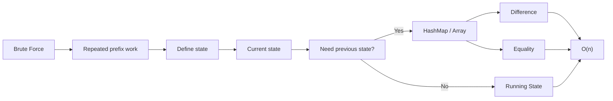

---

# 85. Final Mental Model

Khi gặp bài mới, hãy nói trong đầu:

```text
Tôi đang traverse từ trái sang phải.

Toàn bộ những gì phía sau cần biết
về phần phía trước là gì?

Tôi có thể compress phần phía trước
thành một state nhỏ không?

Nếu chỉ current state đủ:
→ Running State.

Nếu phải so current với history:
→ store Prefix States.

Nếu condition là difference:
→ current - previous.

Nếu condition là zero net change:
→ same prefix state.

Nếu raw data không tạo ra state hữu ích:
→ transform input.

Nếu cần count:
→ frequency.

Nếu cần longest:
→ earliest index.

Nếu là many range queries:
→ Prefix Array.

Nếu cần maintain một dynamic interval:
→ Sliding Window.

Nếu state là optimal answer ending here:
→ Kadane / DP.
```

Đây mới là tư duy cốt lõi của:

# **Prefix-based Thinking & Running State**

và cũng là lý do pattern này xuất hiện trong rất nhiều bài Coding Interview tưởng như hoàn toàn khác nhau.
