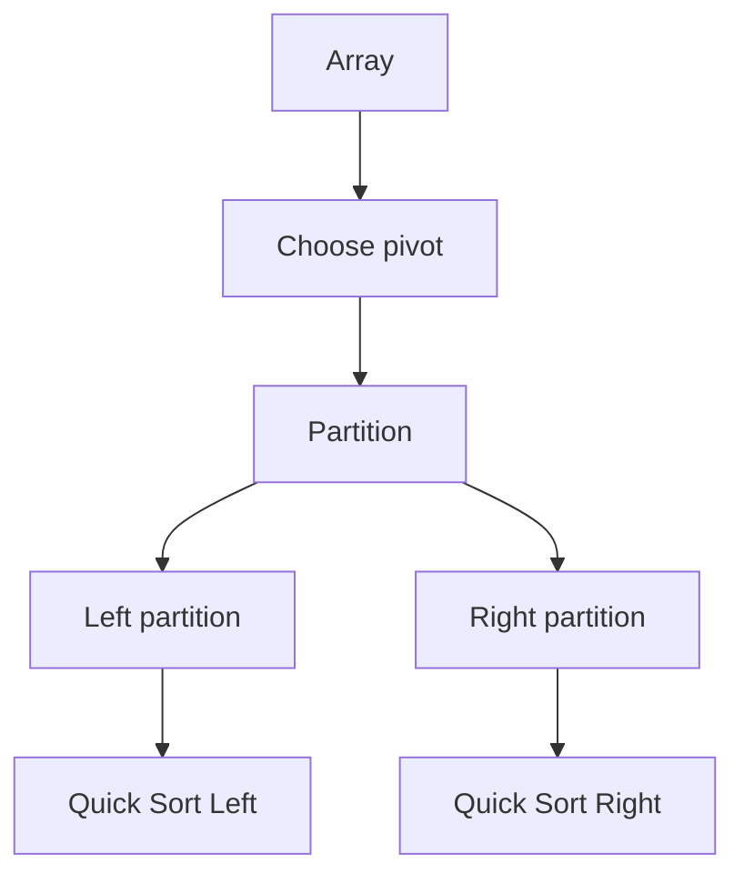
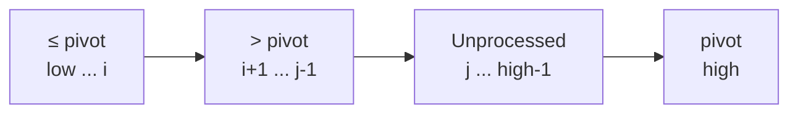
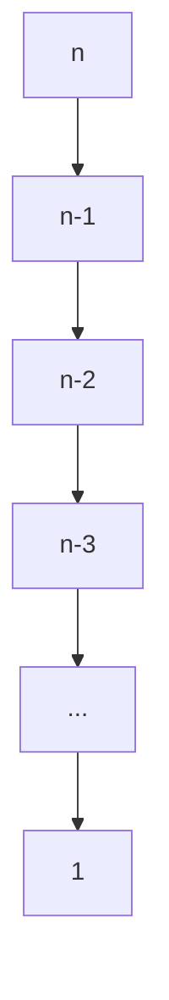

Hai cách partition phổ biến nhất khi implement **Quick Sort** là:

```text
1. Lomuto Partition
2. Hoare Partition
```

Cả hai đều dùng cùng tư tưởng Quick Sort:

```text
Choose pivot
→ Partition array
→ Recursively sort left part
→ Recursively sort right part
```

Nhưng cách chúng **partition**, vị trí pivot sau partition và boundary recursion hoàn toàn khác nhau.

---

# 1. Quick Sort hoạt động như thế nào?

Giả sử:

```text
[8, 3, 1, 7, 0, 10, 2]
```

Ta chọn một giá trị làm:

```text
pivot
```

Sau partition, mục tiêu đại khái là:

```text
values <= pivot | values >= pivot
```

Sau đó recursively sort hai phần.



Điểm quan trọng:

> **Quick Sort và Partition không phải một thứ.**

Quick Sort là algorithm tổng thể.

Lomuto và Hoare là hai cách để implement bước:

```text
partition
```

---

# 2. Lomuto Partition

Lomuto là cách dễ hiểu và dễ implement nhất.

Thông thường ta chọn:

```text
pivot = nums[high]
```

tức là element cuối cùng.

Ví dụ:

```text
nums = [4, 2, 7, 3, 6, 1, 5]
                              ^
                            pivot
```

Pivot:

```text
5
```

---

# 3. Mental Model của Lomuto

Ta chia array thành các vùng:

```text
<= pivot | > pivot | chưa xử lý | pivot
```

Dùng hai pointer:

```text
i = boundary của vùng <= pivot
j = element đang xét
```

Ban đầu:

```text
[4, 2, 7, 3, 6, 1, 5]
 ^
 j

i = low - 1
pivot = 5
```

Trong quá trình chạy:

```text
low ... i
```

đảm bảo:

```text
nums[k] <= pivot
```

và:

```text
i+1 ... j-1
```

đảm bảo:

```text
nums[k] > pivot
```

---

# 4. Lomuto Partition — từng bước

Array:

```text
[4, 2, 7, 3, 6, 1, 5]

pivot = 5
```

Ban đầu:

```text
i = -1
j = 0
```

## j = 0

```text
nums[j] = 4
```

Vì:

```text
4 <= 5
```

tăng:

```text
i = 0
```

swap:

```text
nums[i] ↔ nums[j]
```

Không thay đổi gì:

```text
[4, 2, 7, 3, 6, 1, 5]
```

---

## j = 1

```text
2 <= 5
```

```text
i = 1
```

Array:

```text
[4, 2, 7, 3, 6, 1, 5]
```

---

## j = 2

```text
7 > 5
```

Không làm gì.

```text
i = 1
```

---

## j = 3

```text
3 <= 5
```

Tăng:

```text
i = 2
```

Swap:

```text
nums[2] ↔ nums[3]
```

Ta có:

```text
[4, 2, 3, 7, 6, 1, 5]
```

---

## j = 4

```text
6 > 5
```

Bỏ qua.

---

## j = 5

```text
1 <= 5
```

Tăng:

```text
i = 3
```

Swap:

```text
nums[3] ↔ nums[5]
```

Kết quả:

```text
[4, 2, 3, 1, 6, 7, 5]
```

---

# 5. Đưa pivot về đúng vị trí

Sau khi loop xong:

```text
i = 3
```

Ta swap:

```text
nums[i + 1]
↔
pivot
```

tức:

```text
nums[4] ↔ nums[6]
```

Kết quả:

```text
[4, 2, 3, 1, 5, 7, 6]
            ^
          pivot
```

Lúc này:

```text
[4,2,3,1] < 5

5

[7,6] > 5
```

Quan trọng:

> Với Lomuto, `partition()` trả về **vị trí cuối cùng chính xác của pivot**.

Ở đây:

```text
pivotIndex = 4
```

---

# 6. Lomuto Java Implementation

```java
class QuickSortLomuto {

    public static void quickSort(int[] nums, int low, int high) {

        if (low >= high) {
            return;
        }

        int pivotIndex = partition(nums, low, high);

        quickSort(nums, low, pivotIndex - 1);

        quickSort(nums, pivotIndex + 1, high);
    }

    private static int partition(int[] nums, int low, int high) {

        int pivot = nums[high];

        int i = low - 1;

        for (int j = low; j < high; j++) {

            if (nums[j] <= pivot) {

                i++;

                swap(nums, i, j);
            }
        }

        swap(nums, i + 1, high);

        return i + 1;
    }

    private static void swap(int[] nums, int i, int j) {

        int temp = nums[i];
        nums[i] = nums[j];
        nums[j] = temp;
    }
}
```

Dùng:

```java
int[] nums = {4, 2, 7, 3, 6, 1, 5};

QuickSortLomuto.quickSort(
        nums,
        0,
        nums.length - 1
);
```

Kết quả:

```text
[1,2,3,4,5,6,7]
```

---

# 7. Invariant của Lomuto

Trong loop:

```java
for (int j = low; j < high; j++)
```

ta duy trì:

```text
low ---------- i | i+1 -------- j-1 | j -------- high-1 | high
   <= pivot            > pivot          unknown           pivot
```

Mermaid mental model:



Khi gặp:

```text
nums[j] <= pivot
```

ta mở rộng vùng:

```text
<= pivot
```

bằng:

```java
i++;
swap(nums, i, j);
```

---

# 8. Vì sao Lomuto recurse `pivotIndex - 1` và `pivotIndex + 1`?

Vì pivot sau partition đã ở:

```text
final sorted position
```

Ví dụ:

```text
[1, 3, 2, 4, 7, 8, 6]
          ^
          4
```

Nếu pivotIndex là `3`, thì index `3` không cần sort lại.

Do đó:

```java
quickSort(nums, low, pivotIndex - 1);

quickSort(nums, pivotIndex + 1, high);
```

---

# 9. Hoare Partition

Hoare partition là partition scheme ban đầu được Tony Hoare đề xuất.

Nó dùng:

```text
two pointers
```

một từ trái:

```text
i →
```

một từ phải:

```text
← j
```

Mental model:

```text
Tìm phần tử sai phía bên trái
Tìm phần tử sai phía bên phải
→ swap chúng
```

Đây là khác biệt lớn với Lomuto.

---

# 10. Pivot của Hoare

Một implementation an toàn phổ biến:

```java
int pivot = nums[
    low + (high - low) / 2
];
```

Ví dụ:

```text
[4, 2, 7, 3, 6, 1, 5]
          ^
          3
```

Pivot value:

```text
3
```

Lưu ý:

> Trong Hoare, chúng ta chủ yếu quan tâm tới **pivot value**, không phải cố đưa pivot object về một final index cụ thể.

---

# 11. Hai pointer của Hoare

Khởi tạo:

```java
int i = low - 1;
int j = high + 1;
```

Sau đó:

```text
i đi từ trái → phải
```

đến khi tìm:

```text
nums[i] >= pivot
```

Trong khi:

```text
j đi từ phải → trái
```

đến khi tìm:

```text
nums[j] <= pivot
```

Nếu:

```text
i < j
```

swap.

Nếu:

```text
i >= j
```

partition hoàn thành.

---

# 12. Ví dụ Hoare Partition

Giả sử:

```text
[4, 2, 7, 3, 6, 1, 5]

pivot = 3
```

Pointer:

```text
i = -1
j = 7
```

---

## Tìm từ bên trái

Ta tăng `i`.

Element đầu tiên:

```text
4
```

Ta cần dừng tại:

```text
nums[i] >= pivot
```

Vì:

```text
4 >= 3
```

nên:

```text
i = 0
```

---

## Tìm từ bên phải

Từ cuối:

```text
5 > 3
```

tiếp tục sang trái.

```text
1 <= 3
```

dừng:

```text
j = 5
```

Ta có:

```text
i = 0
j = 5
```

và:

```text
i < j
```

Swap:

```text
4 ↔ 1
```

Array:

```text
[1, 2, 7, 3, 6, 4, 5]
```

---

# 13. Tiếp tục

Left pointer:

```text
2 < 3
```

tiếp tục.

Gặp:

```text
7 >= 3
```

nên:

```text
i = 2
```

Right pointer:

```text
4 > 3
6 > 3
```

đến:

```text
3 <= 3
```

nên:

```text
j = 3
```

Swap:

```text
7 ↔ 3
```

Array:

```text
[1, 2, 3, 7, 6, 4, 5]
```

---

# 14. Pointer crossing

Tiếp tục:

`i` đi sang phải tới:

```text
7 >= 3
```

nên:

```text
i = 3
```

`j` đi trái tới:

```text
3 <= 3
```

nên:

```text
j = 2
```

Bây giờ:

```text
i >= j
```

partition kết thúc.

Return:

```text
j = 2
```

Ta có:

```text
[1,2,3] | [7,6,4,5]
         ^
    partition boundary
```

---

# 15. Điểm rất quan trọng của Hoare

Hoare:

```java
return j;
```

không có nghĩa:

```text
j = final position of pivot
```

Nó chỉ nghĩa:

```text
boundary separating the two partitions
```

Sau partition:

```text
low ... j
```

và:

```text
j+1 ... high
```

là hai vùng cần recurse.

Do đó Quick Sort phải gọi:

```java
quickSort(nums, low, partitionIndex);

quickSort(nums, partitionIndex + 1, high);
```

Không phải:

```java
partitionIndex - 1
partitionIndex + 1
```

như Lomuto.

Đây là lỗi rất phổ biến.

---

# 16. Hoare Java Implementation

```java
class QuickSortHoare {

    public static void quickSort(
            int[] nums,
            int low,
            int high
    ) {

        if (low >= high) {
            return;
        }

        int partitionIndex =
                partition(nums, low, high);

        quickSort(
            nums,
            low,
            partitionIndex
        );

        quickSort(
            nums,
            partitionIndex + 1,
            high
        );
    }

    private static int partition(
            int[] nums,
            int low,
            int high
    ) {

        int pivot =
                nums[low + (high - low) / 2];

        int i = low - 1;
        int j = high + 1;

        while (true) {

            do {
                i++;
            } while (nums[i] < pivot);

            do {
                j--;
            } while (nums[j] > pivot);

            if (i >= j) {
                return j;
            }

            swap(nums, i, j);
        }
    }

    private static void swap(
            int[] nums,
            int i,
            int j
    ) {

        int temp = nums[i];
        nums[i] = nums[j];
        nums[j] = temp;
    }
}
```

---

# 17. Vì sao Hoare dùng `< pivot` và `> pivot` chứ không phải `<=` / `>=`?

Đây là chi tiết rất quan trọng khi có duplicate.

Ta muốn pointer dừng khi gặp:

```text
left:
nums[i] >= pivot
```

và:

```text
right:
nums[j] <= pivot
```

Nếu dùng:

```java
nums[i] <= pivot
```

với array:

```text
[5,5,5,5,5]
```

pointer có thể tiếp tục vượt quá boundary hoặc gây logic sai tùy implementation.

Vì vậy classic Hoare thường là:

```java
while (nums[i] < pivot);

while (nums[j] > pivot);
```

Các element:

```text
== pivot
```

sẽ khiến pointer dừng.

---

# 18. Hoare Invariant

Mental model gần đúng:

```text
low .... i                 j .... high
 smaller/equal   unknown   larger/equal
```

Ta tìm:

```text
left side:
một element quá lớn
```

và:

```text
right side:
một element quá nhỏ
```

sau đó swap.


---

# 19. So sánh cách di chuyển pointer

## Lomuto

Chỉ có một pointer scan thực sự:

```text
j →
```

còn `i` là boundary.

```text
≤ pivot | > pivot | unknown
         i         j →
```

---

## Hoare

Hai pointer đi vào giữa:

```text
        i →       ← j
```

Tìm hai element nằm sai phía rồi swap chúng.

---

# 20. So sánh partition result

Đây là phần cần nhớ kỹ nhất.

## Lomuto

Partition return:

```text
pivot final index
```

Do đó:

```java
quickSort(low, p - 1);

quickSort(p + 1, high);
```

---

## Hoare

Partition return:

```text
partition boundary
```

Do đó:

```java
quickSort(low, p);

quickSort(p + 1, high);
```

Mental shortcut:

```text
Lomuto
       pivot
        ↓
[left] [P] [right]

Hoare
        boundary
           ↓
[left part] | [right part]
```

---

# 21. Complexity của Partition

Cả hai partition đều scan array một lần.

Với partition size:

```text
n
```

thì:

```text
Time = O(n)
```

Lomuto:

```text
j scan low → high
```

Hoare:

```text
i và j tổng cộng di chuyển O(n)
```

Vì vậy:

```text
partition = O(n)
```

cho cả hai.

---

# 22. Time Complexity của Quick Sort

Quick Sort có recurrence:

```text
T(n)
=
T(left)
+
T(right)
+
O(n)
```

Trong đó `O(n)` là partition.

---

# 23. Best Case

Nếu pivot chia array thành hai nửa gần bằng nhau:

```text
n
↓
n/2 + n/2
↓
n/4 n/4 n/4 n/4
...
```

Recurrence:

```text
T(n)
=
2T(n/2)
+
O(n)
```

Số level:

```text
log n
```

Mỗi level xử lý tổng:

```text
O(n)
```

Do đó:

```text
O(n log n)
```

---

# 24. Average Case

Nếu pivot nhìn chung tạo partition tương đối cân bằng:

```text
Average Time
=
O(n log n)
```

Đây là lý do Quick Sort thường rất nhanh trong thực tế.

---

# 25. Worst Case

Nếu partition cực kỳ lệch:

```text
0 + n-1
```

hoặc:

```text
1 + n-1
```

ta có:

```text
T(n)
=
T(n - 1)
+
O(n)
```

Expansion:

```text
n
+
(n - 1)
+
(n - 2)
+
...
+
1
```

tổng:

```text
n(n + 1) / 2
```

Do đó:

```text
O(n²)
```

---

# 26. Ví dụ Worst Case với Lomuto

Nếu luôn chọn:

```java
pivot = nums[high];
```

và input đã sorted:

```text
[1,2,3,4,5,6,7]
```

pivot:

```text
7
```

partition:

```text
[1,2,3,4,5,6] | 7
```

Sau đó:

```text
[1,2,3,4,5] | 6
```

rồi:

```text
[1,2,3,4] | 5
```

Recursion tree biến thành gần như linked list:



Depth:

```text
O(n)
```

Time:

```text
O(n²)
```

---

# 27. Space Complexity

Quick Sort thường được gọi là:

```text
in-place sorting
```

vì partition không cần thêm array kích thước `n`.

Extra memory của partition:

```text
O(1)
```

Nhưng recursion vẫn dùng call stack.

---

## Balanced case

Recursion depth:

```text
O(log n)
```

Do đó:

```text
Auxiliary Space
=
O(log n)
```

---

## Worst case

Recursion:

```text
n
→ n-1
→ n-2
→ ...
```

Depth:

```text
O(n)
```

Do đó:

```text
Worst-case Space
=
O(n)
```

Vậy Quick Sort:

```text
Best/Average auxiliary space:
O(log n)

Worst:
O(n)
```

---

# 28. Lomuto vs Hoare — Number of swaps

Đây là một ưu điểm quan trọng của Hoare.

Lomuto có thể swap khá nhiều.

Ví dụ:

```text
[1,2,3,4,5]
pivot = 5
```

Mỗi element đều:

```text
<= pivot
```

nên code thực hiện các swap logic:

```java
swap(nums, i, j);
```

dù nhiều swap thực tế là:

```text
swap element với chính nó
```

Hoare thường chỉ swap:

```text
hai element thực sự nằm sai partition
```

Do đó trong nhiều trường hợp:

> Hoare thực hiện ít swaps hơn Lomuto.

---

# 29. Duplicate values

Đây cũng là một khác biệt đáng chú ý.

Ví dụ:

```text
[5,5,5,5,5,5,5]
```

Lomuto với:

```java
if (nums[j] <= pivot)
```

có xu hướng đưa tất cả element về một phía.

Partition có thể rất lệch:

```text
6 elements | pivot
```

dẫn tới recursion kém.

Classic Hoare thường phân phối duplicate tốt hơn vì pointer dừng tại các element bằng pivot và swap/progress từ hai phía.

Do đó:

> Hoare thường hoạt động tốt hơn Lomuto khi có nhiều duplicate values, dù Three-Way Partitioning còn thích hợp hơn cho trường hợp duplicate rất nhiều.

---

# 30. Comparison Table

| Property                | Lomuto             | Hoare                |
| ----------------------- | ------------------ | -------------------- |
| Dễ hiểu                 | Rất dễ             | Khó hơn              |
| Pointer                 | boundary + scanner | two pointers         |
| Pivot thường chọn       | last               | first/middle/value   |
| Pivot về final position | **Yes**            | **Không nhất thiết** |
| Return                  | pivot index        | partition boundary   |
| Left recursion          | `low, p-1`         | `low, p`             |
| Right recursion         | `p+1, high`        | `p+1, high`          |
| Swaps                   | thường nhiều hơn   | thường ít hơn        |
| Duplicate handling      | có thể kém         | thường tốt hơn       |
| Partition Time          | O(n)               | O(n)                 |
| Extra partition space   | O(1)               | O(1)                 |

---

# 31. Hai template đặt cạnh nhau

## Lomuto

```java
int partition(int[] nums, int low, int high) {

    int pivot = nums[high];

    int i = low - 1;

    for (int j = low; j < high; j++) {

        if (nums[j] <= pivot) {

            i++;

            swap(nums, i, j);
        }
    }

    swap(nums, i + 1, high);

    return i + 1;
}
```

Quick Sort:

```java
int p = partition(nums, low, high);

quickSort(nums, low, p - 1);
quickSort(nums, p + 1, high);
```

---

## Hoare

```java
int partition(int[] nums, int low, int high) {

    int pivot =
            nums[low + (high - low) / 2];

    int i = low - 1;
    int j = high + 1;

    while (true) {

        do {
            i++;
        } while (nums[i] < pivot);

        do {
            j--;
        } while (nums[j] > pivot);

        if (i >= j) {
            return j;
        }

        swap(nums, i, j);
    }
}
```

Quick Sort:

```java
int p = partition(nums, low, high);

quickSort(nums, low, p);
quickSort(nums, p + 1, high);
```

---

# 32. Complexity tổng kết

| Case                   | Lomuto Quick Sort | Hoare Quick Sort |
| ---------------------- | ----------------: | ---------------: |
| Best Time              |      `O(n log n)` |     `O(n log n)` |
| Average Time           |      `O(n log n)` |     `O(n log n)` |
| Worst Time             |           `O(n²)` |          `O(n²)` |
| Partition              |            `O(n)` |           `O(n)` |
| Average Stack          |        `O(log n)` |       `O(log n)` |
| Worst Stack            |            `O(n)` |           `O(n)` |
| Partition extra memory |            `O(1)` |           `O(1)` |

Cả hai:

```text
not stable
```

theo implementation in-place thông thường.

---

# 33. Cách explain trong Coding Interview

Nếu interviewer hỏi **Lomuto**, bạn có thể nói:

> I choose the last element as the pivot. I maintain `i` as the boundary of elements less than or equal to the pivot, while `j` scans the array. Whenever `nums[j] <= pivot`, I extend the left partition by incrementing `i` and swapping. At the end, I swap the pivot into `i + 1`. Therefore, the returned index is the pivot's final sorted position, and I recursively sort the ranges on both sides excluding the pivot.

Với **Hoare**:

> I use two pointers starting outside the current range. The left pointer moves until it finds a value greater than or equal to the pivot, while the right pointer moves until it finds a value less than or equal to the pivot. If the pointers have not crossed, I swap those misplaced values. Once they cross, I return the right pointer as the partition boundary. Unlike Lomuto, this boundary is not necessarily the pivot's final position.

---

# 34. Mental model cần nhớ

Đừng chỉ nhớ code. Hãy nhớ sự khác biệt bản chất:

```text
LOMUTO

j scans everything
        ↓

≤ pivot | > pivot | unknown | pivot
          ↑
          i

Cuối cùng:
move pivot to final position
```

Trong khi:

```text
HOARE

        i →          ← j

find value too large
        +
find value too small
        ↓
       swap

Pointers cross
→ return partition boundary
```

Và hai dòng quan trọng nhất để tránh bug:

```text
Lomuto:
p = FINAL PIVOT INDEX

quickSort(low, p - 1)
quickSort(p + 1, high)
```

```text
Hoare:
p = PARTITION BOUNDARY

quickSort(low, p)
quickSort(p + 1, high)
```

Đây chính là khác biệt quan trọng nhất giữa hai implementation.
