# Sorting & Searching Algorithms

## Interview-Oriented Deep Dive

Mục tiêu của bài này không phải là học thuộc:

```text
Merge Sort = O(n log n)
Binary Search = O(log n)
```

mà là đạt tới khả năng:

```text
Đọc đề
↓
Nhận ra cấu trúc dữ liệu / constraint
↓
Nhận diện pattern
↓
Tìm brute force
↓
Nhìn ra bottleneck
↓
Tối ưu bottleneck
↓
Chọn algorithm phù hợp
↓
Explain rõ ràng với interviewer
↓
Implement
↓
Analyze complexity
```

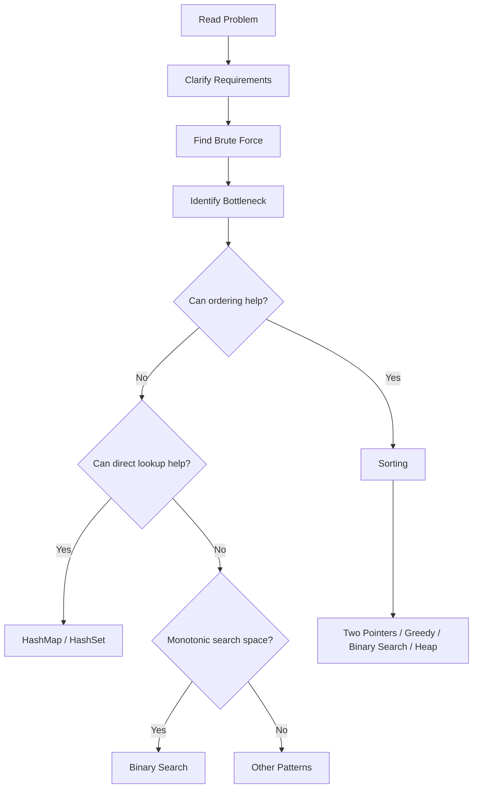

---

# 0. Trước tiên: Algorithm vs Pattern vs Technique

Ba khái niệm này thường bị trộn lẫn.

## Algorithm

Là một thuật toán cụ thể.

Ví dụ:

```text
Merge Sort
Quick Sort
Heap Sort
Binary Search
```

Nó có:

* input,
* procedure,
* invariant,
* complexity rõ ràng.

---

## Pattern

Là một **mẫu tư duy giải bài** có thể kết hợp nhiều algorithm/data structure.

Ví dụ:

```text
Sort + Two Pointers
Sort + Greedy
Binary Search on Answer
Sort + Heap
```

`3Sum` không phải là một sorting algorithm.

Solution của nó thường là:

```text
Sorting algorithm/library
+
Two Pointer pattern
```

---

## Problem-Solving Technique

Là chiến lược tư duy rộng hơn.

Ví dụ:

```text
Divide and Conquer
Greedy
Dynamic Programming
Backtracking
Precomputation
Space-Time Tradeoff
```

Ví dụ Merge Sort:

```text
Technique:
Divide and Conquer

Algorithm:
Merge Sort
```

Binary Search on Answer:

```text
Technique:
Transform optimization problem
into decision problem

Pattern:
Binary Search on Answer

Algorithm:
Binary Search
```

Đây là distinction rất hữu ích khi explain với interviewer.

---

# PHẦN I — SORTING FUNDAMENTALS

# 1. Bubble Sort

## Core idea

Bubble Sort liên tục so sánh **hai phần tử đứng cạnh nhau**.

Nếu sai thứ tự:

```text
a[i] > a[i + 1]
```

thì swap.

Sau mỗi pass, phần tử lớn nhất còn lại sẽ "bubble" về cuối.

Ví dụ:

```text
[5, 2, 4, 1, 3]
```

Pass đầu:

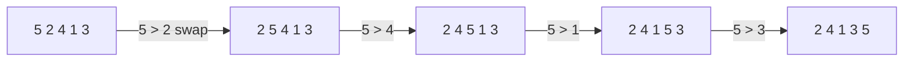

Sau pass 1:

```text
5
```

đã nằm đúng vị trí cuối.

---

## Java

```java
public static void bubbleSort(int[] nums) {
    int n = nums.length;

    for (int i = 0; i < n - 1; i++) {

        boolean swapped = false;

        for (int j = 0; j < n - 1 - i; j++) {

            if (nums[j] > nums[j + 1]) {

                int temp = nums[j];
                nums[j] = nums[j + 1];
                nums[j + 1] = temp;

                swapped = true;
            }
        }

        if (!swapped) {
            break;
        }
    }
}
```

---

## Complexity

### Worst case

Ví dụ:

```text
[5,4,3,2,1]
```

Số comparison gần:

```text
(n - 1)
+
(n - 2)
+
...
+
1
```

Đây là:

```text
n(n - 1) / 2
```

nên:

```text
O(n²)
```

### Average

```text
O(n²)
```

### Best

Nếu array đã sorted:

```text
[1,2,3,4,5]
```

và có `swapped` optimization:

```text
O(n)
```

---

## Properties

| Property    | Bubble Sort            |
| ----------- | ---------------------- |
| Stable      | Yes                    |
| In-place    | Yes                    |
| Adaptive    | Yes, nếu có early stop |
| Extra space | O(1)                   |

Stable vì khi:

```java
nums[j] == nums[j + 1]
```

ta không swap.

---

## Interview

Bubble Sort hiếm khi là production choice.

Nhưng interviewer có thể dùng nó để kiểm tra:

* nested loops,
* invariant,
* stable sorting,
* optimization.

Có thể explain:

> Bubble Sort repeatedly compares adjacent elements and swaps them when they are in the wrong order. After each pass, the largest remaining element is moved to its final position. Its average and worst-case complexity are O(n²), so it is mainly useful for educational purposes rather than large inputs.

---

# 2. Selection Sort

## Core idea

Thay vì swap liên tục như Bubble Sort:

```text
Tìm phần tử nhỏ nhất
↓
Đặt nó vào vị trí đầu tiên
↓
Tìm phần tử nhỏ nhất còn lại
↓
Đặt vào vị trí thứ hai
```

Ví dụ:

```text
[5,2,4,1,3]
```

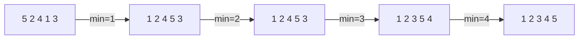

---

## Java

```java
public static void selectionSort(int[] nums) {
    int n = nums.length;

    for (int i = 0; i < n - 1; i++) {

        int minIndex = i;

        for (int j = i + 1; j < n; j++) {
            if (nums[j] < nums[minIndex]) {
                minIndex = j;
            }
        }

        int temp = nums[i];
        nums[i] = nums[minIndex];
        nums[minIndex] = temp;
    }
}
```

---

## Complexity

Ngay cả khi array đã sorted:

```text
[1,2,3,4,5]
```

ta vẫn phải tìm minimum trong phần còn lại.

Số comparisons:

```text
(n - 1) + (n - 2) + ... + 1
```

nên:

```text
Best    O(n²)
Average O(n²)
Worst   O(n²)
```

Space:

```text
O(1)
```

---

## Properties

```text
Stable:   No
In-place: Yes
Adaptive: No
```

Selection Sort có một ưu điểm thú vị:

```text
số swap ≈ O(n)
```

trong khi Bubble Sort có thể swap `O(n²)` lần.

Nếu write operation rất đắt, đặc tính này đôi khi đáng chú ý.

---

# 3. Insertion Sort

Đây là algorithm quan trọng hơn Bubble/Selection về mặt thực tế.

## Core idea

Hãy tưởng tượng cách bạn sắp bài trên tay.

Ta duy trì:

```text
sorted portion | unsorted portion
```

Ví dụ:

```text
[5 | 2 4 1 3]
```

Lấy `2`:

```text
[2 5 | 4 1 3]
```

Lấy `4`:

```text
[2 4 5 | 1 3]
```

Lấy `1`:

```text
[1 2 4 5 | 3]
```

Lấy `3`:

```text
[1 2 3 4 5]
```

---

## Java

```java
public static void insertionSort(int[] nums) {

    for (int i = 1; i < nums.length; i++) {

        int current = nums[i];
        int j = i - 1;

        while (j >= 0 && nums[j] > current) {
            nums[j + 1] = nums[j];
            j--;
        }

        nums[j + 1] = current;
    }
}
```

---

## Invariant quan trọng

Trước mỗi iteration `i`:

```text
nums[0 ... i-1]
```

đã sorted.

Ta chỉ cần insert:

```text
nums[i]
```

vào đúng vị trí.

---

## Complexity

Worst:

```text
[5,4,3,2,1]
```

mỗi element phải shift qua gần toàn bộ prefix:

```text
O(n²)
```

Best:

```text
[1,2,3,4,5]
```

while không chạy:

```text
O(n)
```

Average:

```text
O(n²)
```

---

## Properties

```text
Stable:   Yes
In-place: Yes
Adaptive: Yes
Space:    O(1)
```

Insertion Sort đặc biệt tốt cho:

```text
small arrays
nearly sorted arrays
```

Vì thế nhiều sophisticated sorting algorithms dùng Insertion Sort cho các partition nhỏ.

---

# 4. Merge Sort

Merge Sort là sorting algorithm cực kỳ quan trọng trong interview.

## Core idea

Áp dụng:

```text
Divide and Conquer
```

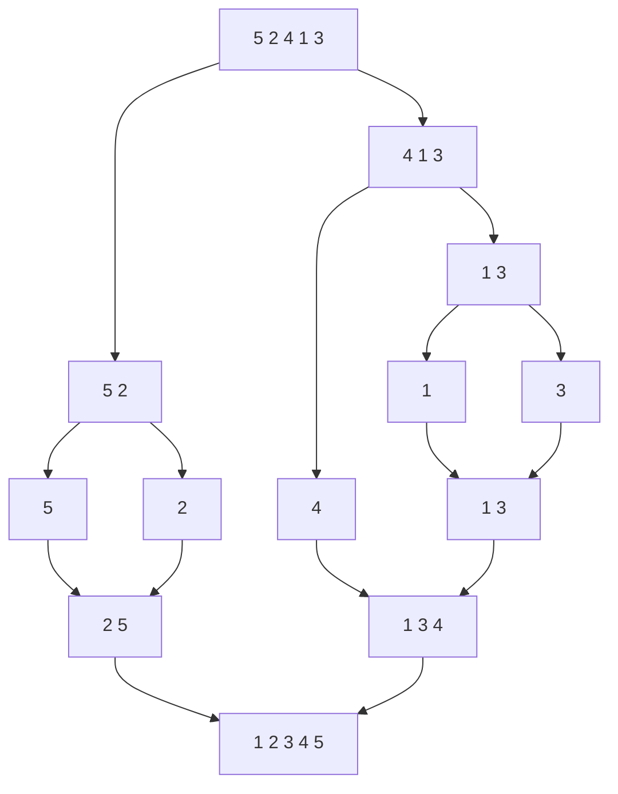

Ta:

```text
split
↓
sort left
↓
sort right
↓
merge
```

---

## Merge step

Ví dụ:

```text
left  = [2,5]
right = [1,3,4]
```

Hai pointer:

```text
i → left
j → right
```

So sánh:

```text
2 vs 1 → take 1
2 vs 3 → take 2
5 vs 3 → take 3
5 vs 4 → take 4
remaining 5
```

Result:

```text
[1,2,3,4,5]
```

---

## Java

```java
public static void mergeSort(int[] nums) {
    int[] temp = new int[nums.length];
    mergeSort(nums, temp, 0, nums.length - 1);
}

private static void mergeSort(
        int[] nums,
        int[] temp,
        int left,
        int right) {

    if (left >= right) {
        return;
    }

    int mid = left + (right - left) / 2;

    mergeSort(nums, temp, left, mid);
    mergeSort(nums, temp, mid + 1, right);

    merge(nums, temp, left, mid, right);
}

private static void merge(
        int[] nums,
        int[] temp,
        int left,
        int mid,
        int right) {

    int i = left;
    int j = mid + 1;
    int k = left;

    while (i <= mid && j <= right) {

        if (nums[i] <= nums[j]) {
            temp[k++] = nums[i++];
        } else {
            temp[k++] = nums[j++];
        }
    }

    while (i <= mid) {
        temp[k++] = nums[i++];
    }

    while (j <= right) {
        temp[k++] = nums[j++];
    }

    for (int p = left; p <= right; p++) {
        nums[p] = temp[p];
    }
}
```

---

## Vì sao O(n log n)?

Recursion tree:

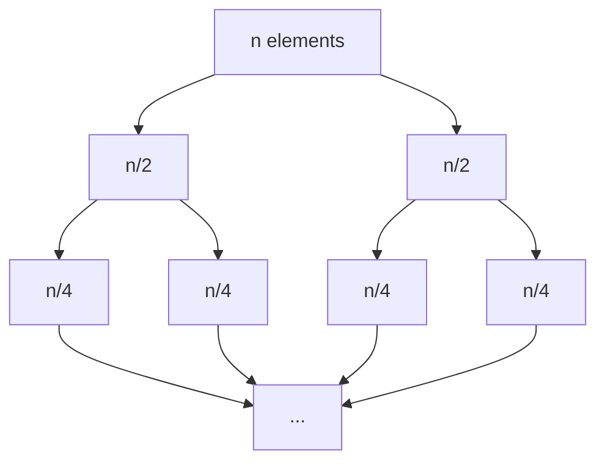

Mỗi level merge tổng cộng:

```text
O(n)
```

Số level:

```text
log₂ n
```

Do đó:

```text
O(n log n)
```

Space:

```text
temporary array O(n)
+
recursion stack O(log n)
```

dominated by:

```text
O(n)
```

---

## Properties

```text
Stable: Yes
In-place: No, với standard array implementation
Adaptive: thường No
Worst-case: O(n log n)
```

### Khi Merge Sort mạnh?

* cần guaranteed `O(n log n)`,
* cần stable sort,
* linked list,
* external sorting,
* data quá lớn không nằm toàn bộ trong RAM.

---

## Interview answer

> Merge Sort uses divide and conquer. I recursively divide the array into two halves until each subarray contains one element. Then I merge the sorted halves using two pointers. Each level processes O(n) elements, and there are O(log n) levels, giving O(n log n) time. The standard array implementation requires O(n) auxiliary space and can be stable.

---

# 5. Quick Sort

## Core idea

Chọn một:

```text
pivot
```

sau đó partition:

```text
smaller/equal | pivot | larger
```

Sau partition, pivot nằm đúng final position.

Ví dụ:

```text
[5,2,4,1,3]
pivot = 3
```

Một possible partition:

```text
[2,1] 3 [5,4]
```

Sau đó recursively sort hai bên.

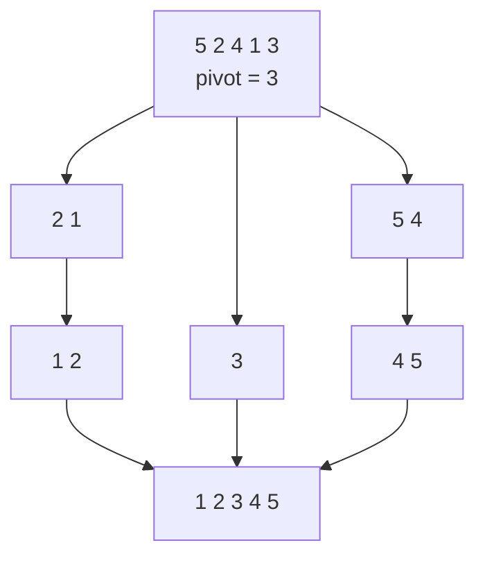

---

## Java — Lomuto partition

```java
public static void quickSort(int[] nums) {
    quickSort(nums, 0, nums.length - 1);
}

private static void quickSort(int[] nums, int left, int right) {

    if (left >= right) {
        return;
    }

    int pivotIndex = partition(nums, left, right);

    quickSort(nums, left, pivotIndex - 1);
    quickSort(nums, pivotIndex + 1, right);
}

private static int partition(int[] nums, int left, int right) {

    int pivot = nums[right];

    int i = left;

    for (int j = left; j < right; j++) {

        if (nums[j] <= pivot) {

            int temp = nums[i];
            nums[i] = nums[j];
            nums[j] = temp;

            i++;
        }
    }

    int temp = nums[i];
    nums[i] = nums[right];
    nums[right] = temp;

    return i;
}
```

---

## Complexity

### Balanced partition

```text
n
→ n/2 + n/2
→ n/4 ...
```

Depth:

```text
log n
```

Work mỗi level:

```text
O(n)
```

Therefore:

```text
O(n log n)
```

### Worst case

Nếu pivot luôn nhỏ nhất/lớn nhất:

```text
n
→ n-1
→ n-2
→ ...
```

Work:

```text
n + (n-1) + ... + 1
```

therefore:

```text
O(n²)
```

---

## Why Quick Sort is fast in practice?

Dù worst case `O(n²)`, Quick Sort thường rất nhanh vì:

1. partition loop rất đơn giản,
2. locality tốt,
3. chủ yếu access contiguous memory,
4. ít auxiliary memory,
5. randomized/good pivot giảm xác suất partition xấu.

---

## Properties

```text
Stable: No
In-place: Mostly yes
Average stack: O(log n)
Worst stack: O(n)
Adaptive: No
```

---

# 6. Heap Sort

Heap Sort dựa trên:

```text
Binary Heap
```

Muốn sort ascending:

```text
build Max Heap
↓
root = largest
↓
swap root với cuối array
↓
shrink heap
↓
heapify
```

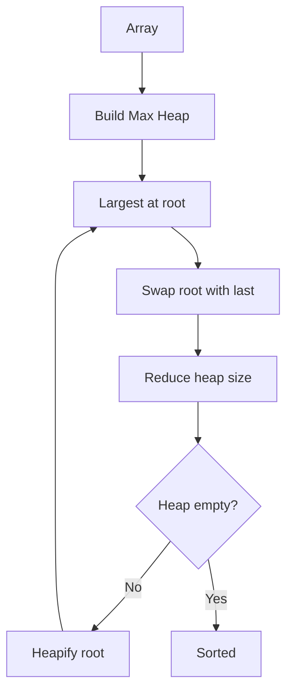

---

## Java

```java
public static void heapSort(int[] nums) {

    int n = nums.length;

    for (int i = n / 2 - 1; i >= 0; i--) {
        heapify(nums, n, i);
    }

    for (int end = n - 1; end > 0; end--) {

        int temp = nums[0];
        nums[0] = nums[end];
        nums[end] = temp;

        heapify(nums, end, 0);
    }
}

private static void heapify(int[] nums, int size, int root) {

    int largest = root;

    int left = 2 * root + 1;
    int right = 2 * root + 2;

    if (left < size && nums[left] > nums[largest]) {
        largest = left;
    }

    if (right < size && nums[right] > nums[largest]) {
        largest = right;
    }

    if (largest != root) {

        int temp = nums[root];
        nums[root] = nums[largest];
        nums[largest] = temp;

        heapify(nums, size, largest);
    }
}
```

---

## Complexity

Build Heap:

```text
O(n)
```

không phải `O(n log n)`.

Sau đó có khoảng `n` extraction.

Mỗi extraction:

```text
heapify = O(log n)
```

Total:

```text
O(n log n)
```

Best/Average/Worst:

```text
O(n log n)
```

Space:

```text
O(1)
```

nếu heapify iterative; recursive version có stack `O(log n)`.

---

## Properties

```text
Stable: No
In-place: Yes
Guaranteed: O(n log n)
```

Heap Sort hữu ích khi muốn:

```text
guaranteed O(n log n)
+
low auxiliary memory
```

Nhưng locality/cache behavior thường không tốt bằng Quick Sort.

---

# 7. Counting Sort

Từ đây chúng ta rời khỏi:

```text
comparison-based sorting
```

Counting Sort không hỏi:

```text
a < b ?
```

cho từng cặp.

Nó đếm frequency.

Ví dụ:

```text
[4,2,2,1,3]
```

Range:

```text
1 ... 4
```

Frequency:

```text
1 → 1
2 → 2
3 → 1
4 → 1
```

reconstruct:

```text
[1,2,2,3,4]
```

---

## Java — simple integer version

```java
public static void countingSort(int[] nums) {

    if (nums.length == 0) {
        return;
    }

    int min = nums[0];
    int max = nums[0];

    for (int num : nums) {
        min = Math.min(min, num);
        max = Math.max(max, num);
    }

    int[] count = new int[max - min + 1];

    for (int num : nums) {
        count[num - min]++;
    }

    int index = 0;

    for (int i = 0; i < count.length; i++) {

        while (count[i] > 0) {
            nums[index++] = i + min;
            count[i]--;
        }
    }
}
```

Complexity:

```text
n = number of elements
k = value range
```

then:

```text
Time  O(n + k)
Space O(k)
```

---

## Khi nào tốt?

Nếu:

```text
n = 1,000,000
values ∈ [0,100]
```

thì `k = 101`.

Counting Sort:

```text
O(n + 101)
≈ O(n)
```

rất tốt.

Nhưng nếu:

```text
values ∈ [0, 2,000,000,000]
```

thì frequency array là không thực tế.

---

# 8. Radix Sort

Radix Sort xử lý từng digit.

Ví dụ:

```text
170
45
75
90
802
24
2
66
```

Sort theo:

```text
ones digit
↓
tens digit
↓
hundreds digit
```

Điều kiện quan trọng:

> Sort dùng ở mỗi digit phải stable.

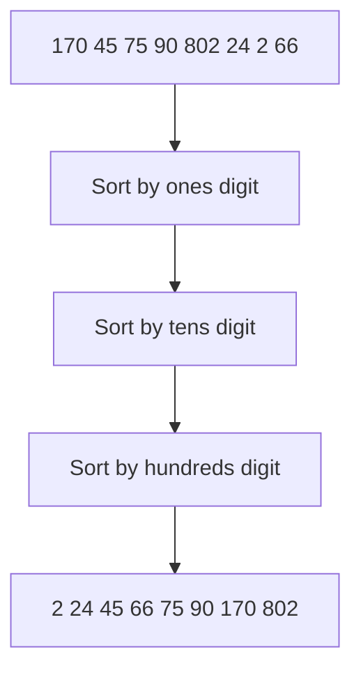

Complexity:

```text
d = number of digits
k = radix/base
```

```text
O(d × (n + k))
```

Nếu `d` bounded:

```text
≈ O(n)
```

---

# 9. Bucket Sort

Bucket Sort chia dữ liệu thành nhiều vùng.

Ví dụ floating-point:

```text
0.12
0.79
0.23
0.45
0.91
```

Buckets:

```text
[0.0,0.2)
[0.2,0.4)
[0.4,0.6)
[0.6,0.8)
[0.8,1.0)
```

Sau đó:

```text
put into bucket
↓
sort each bucket
↓
concatenate
```

Average có thể gần:

```text
O(n)
```

nếu distribution khá uniform.

Worst case:

```text
mọi element vào cùng bucket
```

có thể trở về:

```text
O(n²)
```

nếu bucket được sort bằng Insertion Sort.

---

# PHẦN II — SORTING COMPARISON

| Algorithm |            Best |         Average |      Worst |        Extra Space | Stable                   | In-place   |
| --------- | --------------: | --------------: | ---------: | -----------------: | ------------------------ | ---------- |
| Bubble    |            O(n) |           O(n²) |      O(n²) |               O(1) | Yes                      | Yes        |
| Selection |           O(n²) |           O(n²) |      O(n²) |               O(1) | No                       | Yes        |
| Insertion |            O(n) |           O(n²) |      O(n²) |               O(1) | Yes                      | Yes        |
| Merge     |      O(n log n) |      O(n log n) | O(n log n) |               O(n) | Yes                      | No         |
| Quick     |      O(n log n) |      O(n log n) |      O(n²) | O(log n) avg stack | No                       | Mostly     |
| Heap      |      O(n log n) |      O(n log n) | O(n log n) |              O(1)* | No                       | Yes        |
| Counting  |          O(n+k) |          O(n+k) |     O(n+k) |               O(k) | Possible                 | Usually No |
| Radix     |       O(d(n+k)) |            same |       same |             O(n+k) | Yes if inner sort stable | Usually No |
| Bucket    | O(n+k) expected | O(n+k) expected |      O(n²) |             O(n+k) | Depends                  | No         |

`*` Với iterative heapify.

---

# Chọn Sorting Algorithm thế nào?

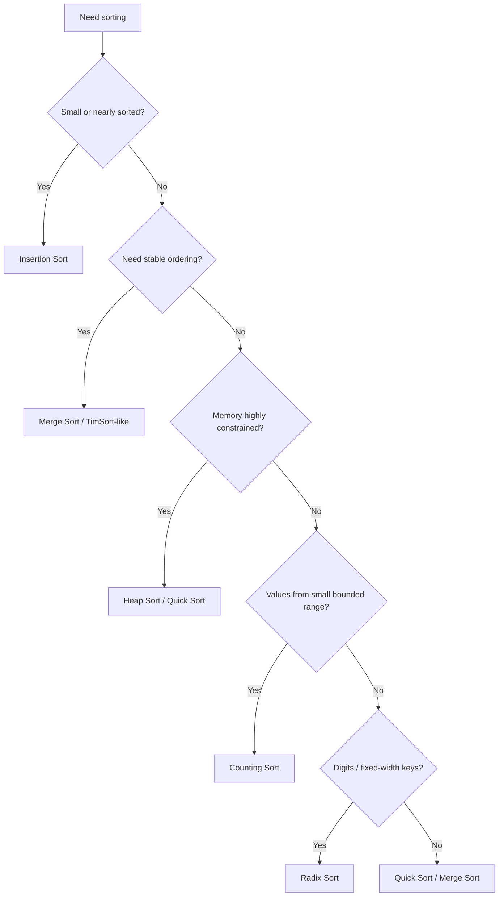

---

## Merge Sort vs Quick Sort

### Merge Sort

Choose when:

```text
Need guaranteed O(n log n)
Need stability
Linked list
External sorting
```

### Quick Sort

Choose when:

```text
Array in memory
Average-case performance matters
Cache locality matters
Extra memory should be small
```

---

## Heap Sort

Useful when:

```text
Need worst-case O(n log n)
AND
Need in-place behavior
```

Nhưng trong interview, Heap thường quan trọng hơn dưới dạng:

```text
Top K
Priority Queue
Streaming
```

hơn là Heap Sort thuần.

---

# Vì sao comparison sorting có lower bound O(n log n)?

Một comparison sort phải xác định một trong:

```text
n!
```

permutations.

Mỗi comparison cho tối đa hai outcome.

Decision tree cần depth ít nhất:

```text
log₂(n!)
```

và:

```text
log(n!) = Θ(n log n)
```

Do đó comparison sorting nói chung không thể beat:

```text
Ω(n log n)
```

trong worst case.

---

# Tại sao Counting/Radix có thể nhanh hơn?

Vì chúng không chỉ dựa trên:

```text
a < b
```

Chúng khai thác thêm structure:

```text
bounded integer range
digits
key representation
```

Vì vậy lower bound của comparison sort không áp dụng.

---

# Java thực tế sort thế nào?

Điểm quan trọng khi interview: **đừng nói `Arrays.sort()` luôn luôn dùng một thuật toán duy nhất.**

Oracle documentation mô tả sorting implementation là implementation detail và có thể thay đổi miễn contract vẫn được giữ. Với primitive overloads, các JDK phổ biến sử dụng Dual-Pivot Quicksort; với object arrays, sorting phải stable và các implementation hiện đại dùng stable adaptive mergesort/TimSort-style strategy.

Interview answer:

> Java chooses different strategies depending on the data type and API requirements. Primitive arrays can use an unstable quicksort-style algorithm because object stability is irrelevant, while object sorting guarantees stability and uses an adaptive merge-based strategy. The exact algorithm is an implementation detail rather than part of the general Arrays API contract.

---

# PHẦN III — SEARCHING ALGORITHMS

Searching không chỉ có Linear Search và Binary Search.

Trong interview, "search" có thể là:

```text
Find exact value
Find boundary
Find pair/triplet
Find minimum feasible answer
Find top K
Find lookup
Find value in matrix
```

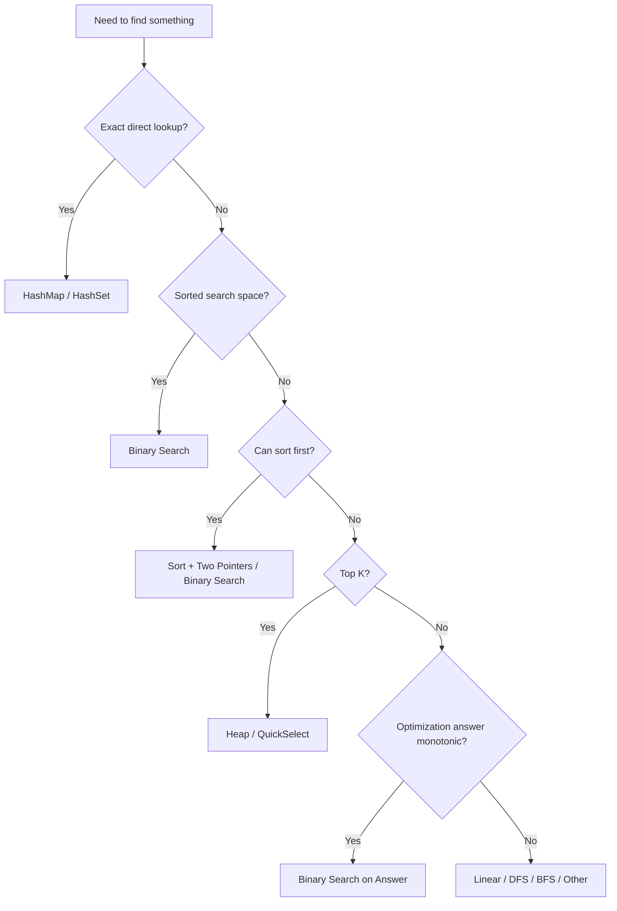

---

# 1. Linear Search

```java
public static int linearSearch(int[] nums, int target) {

    for (int i = 0; i < nums.length; i++) {

        if (nums[i] == target) {
            return i;
        }
    }

    return -1;
}
```

Complexity:

```text
Best:  O(1)
Worst: O(n)
Space: O(1)
```

Linear Search phù hợp nếu:

* data unsorted,
* chỉ query một lần,
* `n` nhỏ.

---

# 2. Binary Search — Foundation

Binary Search không phải là:

> "Tìm middle rồi compare."

Bản chất của nó là:

> Dùng một **monotonic property** để loại bỏ một phần lớn search space mà chắc chắn không chứa answer.

Ví dụ:

```text
[1,3,5,7,9]
target = 7
```

Initial:

```text
left = 0
right = 4
```

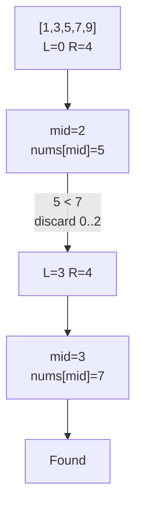

---

# Binary Search Mental Model

Luôn xác định 6 thứ:

```text
1. Search space là gì?
2. left đại diện cho gì?
3. right đại diện cho gì?
4. mid là candidate nào?
5. condition nào cho phép bỏ một nửa?
6. loop kết thúc khi nào?
```

Đây mới là Binary Search.

---

# Classic Template

```java
public static int binarySearch(int[] nums, int target) {

    int left = 0;
    int right = nums.length - 1;

    while (left <= right) {

        int mid = left + (right - left) / 2;

        if (nums[mid] == target) {
            return mid;
        }

        if (nums[mid] < target) {
            left = mid + 1;
        } else {
            right = mid - 1;
        }
    }

    return -1;
}
```

---

# Vì sao dùng

```java
left + (right - left) / 2
```

thay vì:

```java
(left + right) / 2
```

?

Để tránh integer overflow khi:

```text
left + right > Integer.MAX_VALUE
```

---

# Search-space invariant

Trong template trên:

```text
candidate answer nằm trong [left, right]
```

Nếu:

```text
nums[mid] < target
```

do array sorted:

```text
nums[0..mid] <= nums[mid] < target
```

nên không phần tử nào từ:

```text
left ... mid
```

có thể là target.

Ta discard toàn bộ:

```java
left = mid + 1;
```

Đây là reasoning interviewer cần nghe.

---

# PHẦN IV — BINARY SEARCH PATTERNS

# Pattern 1 — Exact Search

Recognition:

```text
sorted array
+
find exact target
```

Template:

```java
while (left <= right)
```

Answer được detect ngay khi:

```java
nums[mid] == target
```

Typical problems:

```text
704 Binary Search
74 Search a 2D Matrix
```

---

# Pattern 2 — Lower Bound

Lower Bound:

> index đầu tiên có value `>= target`.

Ví dụ:

```text
[1,2,2,2,4,7]
target = 2
```

answer:

```text
index 1
```

---

## Template

```java
public static int lowerBound(int[] nums, int target) {

    int left = 0;
    int right = nums.length;

    while (left < right) {

        int mid = left + (right - left) / 2;

        if (nums[mid] >= target) {
            right = mid;
        } else {
            left = mid + 1;
        }
    }

    return left;
}
```

Notice search interval:

```text
[left, right)
```

khác với classic:

```text
[left, right]
```

---

## Reasoning

Nếu:

```java
nums[mid] >= target
```

`mid` có thể là answer.

Không được discard `mid`.

Vì vậy:

```java
right = mid;
```

Nếu:

```java
nums[mid] < target
```

thì mid chắc chắn không phải lower bound.

```java
left = mid + 1;
```

---

# Pattern 3 — Upper Bound

Upper Bound:

> index đầu tiên có value `> target`.

```java
public static int upperBound(int[] nums, int target) {

    int left = 0;
    int right = nums.length;

    while (left < right) {

        int mid = left + (right - left) / 2;

        if (nums[mid] > target) {
            right = mid;
        } else {
            left = mid + 1;
        }
    }

    return left;
}
```

Difference duy nhất:

```text
Lower Bound:
nums[mid] >= target

Upper Bound:
nums[mid] > target
```

---

# First / Last Occurrence

Array:

```text
[1,2,2,2,4]
```

target:

```text
2
```

First:

```text
lowerBound(2) = 1
```

Upper bound:

```text
upperBound(2) = 4
```

Last occurrence:

```text
upperBound(target) - 1
= 3
```

---

# Pattern 4 — Binary Search on Answer

Đây là pattern rất quan trọng.

Thay vì tìm:

```text
target trong array
```

ta search:

```text
possible answer
```

Mental transformation:

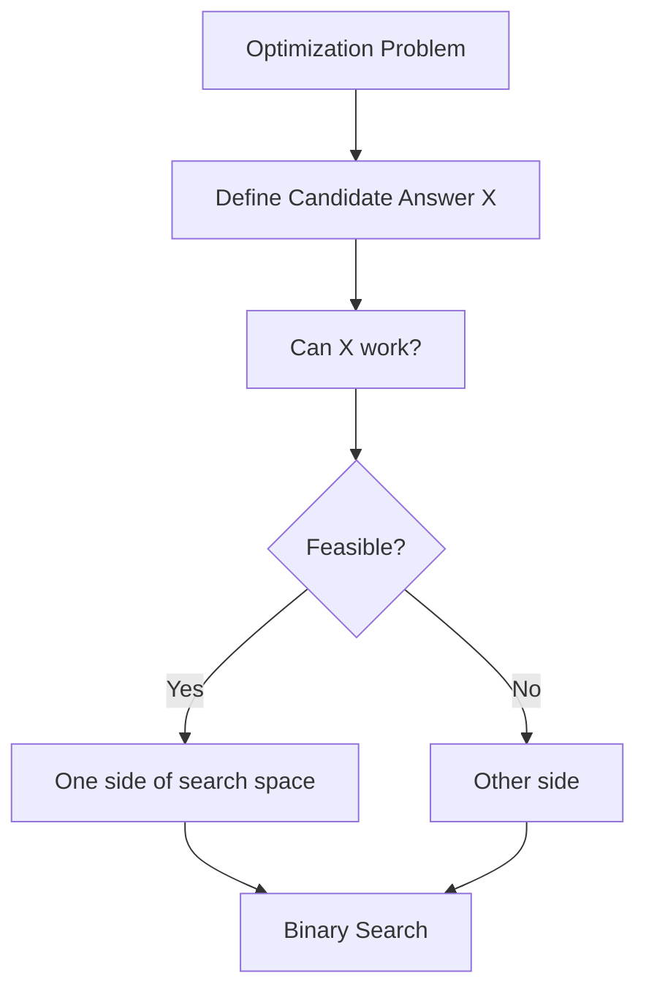

---

# Điều kiện cốt lõi: Monotonicity

Ví dụ Koko Eating Bananas.

Ta hỏi:

```text
speed = k
```

có ăn xong trong `h` giờ không?

Suppose:

```text
k = 1   → false
k = 2   → false
k = 3   → false
k = 4   → true
k = 5   → true
k = 6   → true
...
```

Pattern:

```text
F F F F T T T T T
```

Ta cần:

```text
first true
```

Đây chính là boundary Binary Search.

---

# Generic Minimum Feasible Template

```java
int left = MIN;
int right = MAX;

while (left < right) {

    int mid = left + (right - left) / 2;

    if (canWork(mid)) {
        right = mid;
    } else {
        left = mid + 1;
    }
}

return left;
```

Interpretation:

```text
mid feasible
→ answer có thể là mid hoặc nhỏ hơn

mid infeasible
→ answer chắc chắn > mid
```

---

# Recognition Signals

Nếu đề chứa:

```text
minimum capacity
minimum speed
minimum rate
minimum possible maximum
maximum minimum distance
smallest divisor
```

hãy tự hỏi:

> Nếu tôi đoán answer `x`, tôi có thể kiểm tra `x` hợp lệ trong O(n) không?

Sau đó:

> Khi `x` tăng/giảm, feasibility có monotonic không?

Nếu cả hai câu đều Yes:

```text
Binary Search on Answer
```

rất có khả năng đúng.

---

# PHẦN V — MODIFIED BINARY SEARCH

# 1. Search in Rotated Sorted Array

Ví dụ:

```text
[4,5,6,7,0,1,2]
```

Array không globally sorted.

Nhưng observation:

> Với bất kỳ `mid`, ít nhất một trong hai half phải sorted.

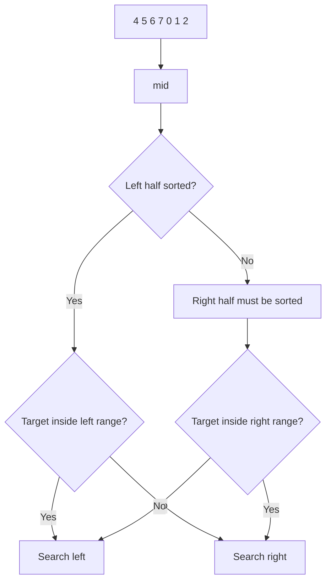

Java:

```java
public int search(int[] nums, int target) {

    int left = 0;
    int right = nums.length - 1;

    while (left <= right) {

        int mid = left + (right - left) / 2;

        if (nums[mid] == target) {
            return mid;
        }

        if (nums[left] <= nums[mid]) {

            // left side sorted
            if (nums[left] <= target && target < nums[mid]) {
                right = mid - 1;
            } else {
                left = mid + 1;
            }

        } else {

            // right side sorted
            if (nums[mid] < target && target <= nums[right]) {
                left = mid + 1;
            } else {
                right = mid - 1;
            }
        }
    }

    return -1;
}
```

Time:

```text
O(log n)
```

---

# PHẦN VI — OTHER SEARCHING PATTERNS

# 1. Two Pointers

Nếu data sorted và cần:

```text
pair
sum
difference
closest value
```

Two Pointers rất mạnh.

Ví dụ:

```text
[1,2,4,6,9]
target = 10
```

```text
left=1
right=9
sum=10
```

Nếu:

```text
sum < target
```

cần tăng sum:

```text
left++
```

Nếu:

```text
sum > target
```

cần giảm sum:

```text
right--
```

Điều này chỉ đúng vì ordering cho ta monotonic direction.

---

# 2. Hash-Based Lookup

Two Sum unsorted:

Brute force:

```text
for every pair
O(n²)
```

Observation:

Nếu current:

```text
x
```

ta cần:

```text
target - x
```

HashSet cho lookup:

```text
O(1) average
```

Total:

```text
O(n)
```

Space:

```text
O(n)
```

---

# 3. Matrix Search

Có ít nhất hai kiểu.

### Matrix globally sorted

Ví dụ row đầu kết thúc nhỏ hơn row sau bắt đầu.

Ta có thể treat matrix như flat array:

```text
index → matrix[index / cols][index % cols]
```

Binary Search:

```text
O(log(mn))
```

### Rows + columns independently sorted

Start:

```text
top-right
```

Nếu current quá lớn:

```text
move left
```

Nếu quá nhỏ:

```text
move down
```

Complexity:

```text
O(m + n)
```

---

# 4. Heap-Based Top K

Nếu chỉ cần:

```text
top k
```

đừng mặc định:

```text
sort n elements
O(n log n)
```

Dùng size-`k` heap:

```text
O(n log k)
```

Đặc biệt tốt khi:

```text
k << n
```

---

# PHẦN VII — SORTING + SEARCHING PATTERNS

# Pattern 1 — Sort + Two Pointers

Recognition:

```text
pair / triplet / quadruplet
+
relationship involving sum
+
order không quan trọng
```

Flow:

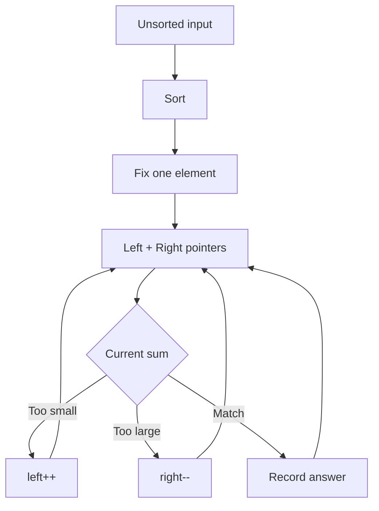

Problems:

```text
Two Sum II
3Sum
4Sum
3Sum Closest
```

---

# Pattern 2 — Sort + Binary Search

Useful when:

```text
for each x
find a boundary/value in another sorted collection
```

Pattern:

```text
sort B
for each a in A:
    binarySearch(B)
```

Complexity:

```text
O(m log m + n log m)
```

Representative:

```text
Successful Pairs of Spells and Potions
```

---

# HashMap vs Sort + Binary Search

Choose HashMap when:

```text
exact lookup
ordering irrelevant
want average O(1) lookup
can spend O(n) memory
```

Choose Sort + Binary Search when:

```text
need range / boundary queries
need >= x or <= x
need ordering
many queries on same dataset
```

Important distinction:

Hashing is excellent for:

```text
value == x
```

Binary Search is excellent for:

```text
first value >= x
number of values >= x
largest value <= x
```

---

# Pattern 3 — Sort + Greedy

Sorting thường giúp Greedy bởi nó tạo ra một **canonical order**.

Ví dụ Non-overlapping Intervals:

Goal:

```text
keep maximum number of non-overlapping intervals
```

Observation:

Nếu chọn interval kết thúc sớm nhất:

```text
ta để lại nhiều room nhất cho intervals phía sau
```

Therefore:

```text
sort by end time
↓
greedily choose earliest ending compatible interval
```

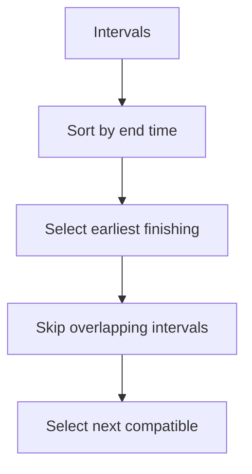

Problems:

```text
Assign Cookies
Non-overlapping Intervals
Minimum Arrows
Meeting Rooms
Merge Intervals
```

Lưu ý: `Merge Intervals` dùng sort nhưng không phải classic greedy-choice proof giống Interval Scheduling; nó chủ yếu là sort + linear scan/interval merging.

---

# Pattern 4 — Sort + Sweep Line

Sweep Line:

```text
convert objects into events
↓
sort events
↓
scan from left to right
↓
maintain state
```

Meeting example:

```text
meeting starts → +1
meeting ends   → -1
```

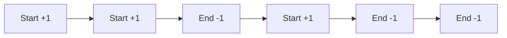

Maintain:

```text
current active meetings
max active meetings
```

Representative problems:

```text
Meeting Rooms II
Car Pooling
My Calendar variants
Skyline
Maximum Population Year
```

---

# Pattern 5 — Sort + Heap

Typical scenario:

```text
process items in chronological/order sequence
+
need best active candidate
```

Example Meeting Rooms II:

```text
sort meetings by start
+
min heap of end times
```

For each meeting:

```text
if earliest room finished:
    reuse it

push current end
```

Heap size:

```text
number of rooms currently needed
```

---

# Pattern 6 — Frequency Instead of Sorting

Before sorting, ask:

> Tôi thực sự cần full order hay chỉ cần frequency?

Example:

```text
Top K Frequent Elements
```

Full sort:

```text
O(n log n)
```

But:

```text
frequency HashMap
+
bucket by frequency
```

can achieve:

```text
O(n)
```

expected.

Typical tools:

```text
HashMap
frequency array
Counting Sort
buckets
```

---

# PHẦN VIII — REPRESENTATIVE LEETCODE DEEP DIVES

# Problem 1 — 704 Binary Search

## Problem

Cho sorted ascending integer array và `target`.

Return index của target hoặc `-1`.

---

## Brute Force

```text
scan every element
```

Time:

```text
O(n)
```

---

## Observation

Array sorted.

Comparison với `nums[mid]` cho biết không chỉ mid sai mà còn cho phép loại bỏ **một nửa array**.

---

## Pattern

```text
Classic Binary Search
```

---

## Java

```java
class Solution {
    public int search(int[] nums, int target) {

        int left = 0;
        int right = nums.length - 1;

        while (left <= right) {

            int mid = left + (right - left) / 2;

            if (nums[mid] == target) {
                return mid;
            }

            if (nums[mid] < target) {
                left = mid + 1;
            } else {
                right = mid - 1;
            }
        }

        return -1;
    }
}
```

---

## Complexity

Every iteration:

```text
n
→ n/2
→ n/4
→ n/8
```

After `k` operations:

```text
n / 2^k = 1
```

Therefore:

```text
k = log₂ n
```

Time:

```text
O(log n)
```

Space:

```text
O(1)
```

---

## Interview Explanation

> Since the array is sorted, I can use binary search instead of scanning every element. I maintain a search interval from left to right. At each step I compare the middle value with the target. If the middle value is smaller, every element on its left can also be discarded; otherwise I discard the right half. This reduces the search space by half each iteration, so the time complexity is O(log n).

---

# Problem 2 — Find First and Last Position

Given sorted array:

```text
[5,7,7,8,8,10]
target = 8
```

Return:

```text
[3,4]
```

---

## Trap

Normal Binary Search may find:

```text
3
```

or:

```text
4
```

không đảm bảo first/last.

---

## Key Observation

Convert problem thành boundary search:

```text
first = lowerBound(target)

last =
lowerBound(target + conceptually next boundary)
```

Safer with upper bound:

```text
last = upperBound(target) - 1
```

---

## Java

```java
class Solution {

    public int[] searchRange(int[] nums, int target) {

        int first = lowerBound(nums, target);

        if (first == nums.length || nums[first] != target) {
            return new int[]{-1, -1};
        }

        int last = upperBound(nums, target) - 1;

        return new int[]{first, last};
    }

    private int lowerBound(int[] nums, int target) {

        int left = 0;
        int right = nums.length;

        while (left < right) {

            int mid = left + (right - left) / 2;

            if (nums[mid] >= target) {
                right = mid;
            } else {
                left = mid + 1;
            }
        }

        return left;
    }

    private int upperBound(int[] nums, int target) {

        int left = 0;
        int right = nums.length;

        while (left < right) {

            int mid = left + (right - left) / 2;

            if (nums[mid] > target) {
                right = mid;
            } else {
                left = mid + 1;
            }
        }

        return left;
    }
}
```

Time:

```text
O(log n)
```

Space:

```text
O(1)
```

---

# Problem 3 — 3Sum

## Problem

Given integer array, return unique triplets:

```text
[a,b,c]
```

such that:

```text
a + b + c = 0
```

---

## Brute Force

Three nested loops:

```text
O(n³)
```

Need additionally remove duplicate triplets.

---

## Key Observation

Nếu fix:

```text
nums[i]
```

ta cần:

```text
nums[left] + nums[right]
=
-nums[i]
```

Đây trở thành:

```text
Two Sum on sorted array
```

---

## Optimization

```text
Sort
↓
Fix i
↓
Two pointers
```

---

## Java

```java
class Solution {

    public List<List<Integer>> threeSum(int[] nums) {

        Arrays.sort(nums);

        List<List<Integer>> result = new ArrayList<>();

        for (int i = 0; i < nums.length - 2; i++) {

            if (i > 0 && nums[i] == nums[i - 1]) {
                continue;
            }

            int left = i + 1;
            int right = nums.length - 1;

            while (left < right) {

                int sum =
                        nums[i]
                        + nums[left]
                        + nums[right];

                if (sum == 0) {

                    result.add(Arrays.asList(
                            nums[i],
                            nums[left],
                            nums[right]
                    ));

                    left++;
                    right--;

                    while (left < right
                            && nums[left] == nums[left - 1]) {
                        left++;
                    }

                    while (left < right
                            && nums[right] == nums[right + 1]) {
                        right--;
                    }

                } else if (sum < 0) {

                    left++;

                } else {

                    right--;
                }
            }
        }

        return result;
    }
}
```

---

## Complexity

Sorting:

```text
O(n log n)
```

For every `i`:

```text
two pointers scan O(n)
```

Across `n` values of `i`:

```text
O(n²)
```

Dominates sorting:

```text
O(n²)
```

Space depends on sorting implementation, excluding result.

---

## Interview Explanation

> The brute-force solution checks every triplet in O(n³). I can improve this by sorting the array. Then I fix one number and reduce the remaining problem to Two Sum on a sorted range. I use left and right pointers: if the sum is too small I move left, and if it is too large I move right. I also skip duplicate values to avoid duplicate triplets. The final complexity is O(n²).

---

# Problem 4 — Merge Intervals

Input:

```text
[[1,3],[2,6],[8,10],[15,18]]
```

Output:

```text
[[1,6],[8,10],[15,18]]
```

---

## Key Observation

Nếu intervals unsorted, một interval overlap liên quan có thể nằm bất cứ đâu.

Sort by start time:

```text
start1 <= start2 <= start3...
```

Bây giờ chỉ cần compare với merged interval cuối.

---

## Condition

Current interval:

```text
[currentStart, currentEnd]
```

Last merged:

```text
[lastStart, lastEnd]
```

Overlap nếu:

```text
currentStart <= lastEnd
```

Merge:

```text
lastEnd = max(lastEnd, currentEnd)
```

---

## Java

```java
class Solution {

    public int[][] merge(int[][] intervals) {

        Arrays.sort(
                intervals,
                Comparator.comparingInt(a -> a[0])
        );

        List<int[]> result = new ArrayList<>();

        for (int[] interval : intervals) {

            if (result.isEmpty()
                    || result.get(result.size() - 1)[1] < interval[0]) {

                result.add(interval);

            } else {

                int[] last = result.get(result.size() - 1);

                last[1] = Math.max(
                        last[1],
                        interval[1]
                );
            }
        }

        return result.toArray(new int[result.size()][]);
    }
}
```

Time:

```text
sorting O(n log n)
scan O(n)
→ O(n log n)
```

---

# Problem 5 — Search in Rotated Sorted Array

Pattern:

```text
Modified Binary Search
```

Core observation:

```text
At least one half is sorted.
```

Brute force:

```text
O(n)
```

Optimized:

```text
O(log n)
```

Implementation đã trình bày ở phần Binary Search.

Interview explanation:

> The array is not globally sorted anymore, but for any middle element, at least one half must still be sorted. I first identify the sorted half. Then I check whether the target lies inside that half's value range. If it does, I search there; otherwise I discard that half. This preserves the binary-search property and gives O(log n).

---

# Problem 6 — Koko Eating Bananas

## Problem

Có piles:

```text
[3,6,7,11]
```

Koko chọn integer eating speed:

```text
k bananas/hour
```

Trong một giờ cô ấy ăn tối đa từ một pile.

Find minimum `k` để hoàn thành trong `h` hours.

---

## Brute Force

Possible speed:

```text
1 ... maxPile
```

Try từng speed.

Nếu maxPile lớn:

```text
O(maxPile × n)
```

---

## Observation

Feasibility:

```text
k nhỏ → cần nhiều giờ
k lớn → cần ít giờ
```

Monotonic:

```text
F F F F T T T T
```

Need:

```text
first true
```

---

## Hours required

For pile `p`:

```text
ceil(p / k)
```

integer formula:

```java
(p + k - 1) / k
```

hoặc tránh overflow:

```java
(p - 1) / k + 1
```

---

## Java

```java
class Solution {

    public int minEatingSpeed(int[] piles, int h) {

        int left = 1;
        int right = 0;

        for (int pile : piles) {
            right = Math.max(right, pile);
        }

        while (left < right) {

            int mid = left + (right - left) / 2;

            if (canFinish(piles, h, mid)) {
                right = mid;
            } else {
                left = mid + 1;
            }
        }

        return left;
    }

    private boolean canFinish(
            int[] piles,
            int h,
            int speed) {

        long hours = 0;

        for (int pile : piles) {

            hours += (pile - 1L) / speed + 1;

            if (hours > h) {
                return false;
            }
        }

        return true;
    }
}
```

---

## Complexity

Answer range:

```text
1 ... M
```

where:

```text
M = max(piles)
```

Binary search iterations:

```text
O(log M)
```

Each feasibility check:

```text
O(n)
```

Therefore:

```text
O(n log M)
```

Space:

```text
O(1)
```

---

## Interview Explanation

> Instead of trying every eating speed, I treat the speed itself as the binary-search space. For a candidate speed, I can calculate in O(n) whether Koko can finish within h hours. The condition is monotonic: if speed k works, every faster speed also works. Therefore I binary search for the smallest feasible speed, giving O(n log M), where M is the maximum pile size.

---

# Problem 7 — Capacity to Ship Packages Within D Days

Same pattern.

Search space:

```text
minimum capacity
```

Lower bound:

```text
max(weights)
```

vì một package không thể split.

Upper bound:

```text
sum(weights)
```

vì capacity đủ chở tất cả trong một ngày.

Feasibility:

```text
Given capacity C
→ simulate shipping
→ count days required
```

Monotonic:

```text
small capacity → impossible
large capacity → possible
```

Exactly:

```text
first true
```

---

# Problem 8 — Successful Pairs of Spells and Potions

For each spell:

```text
spell * potion >= success
```

Brute force:

```text
O(nm)
```

Sort potions.

For a spell, find minimum potion:

```text
potion >= ceil(success / spell)
```

Then lower bound.

Java:

```java
class Solution {

    public int[] successfulPairs(
            int[] spells,
            int[] potions,
            long success) {

        Arrays.sort(potions);

        int[] result = new int[spells.length];

        for (int i = 0; i < spells.length; i++) {

            int left = 0;
            int right = potions.length;

            while (left < right) {

                int mid = left + (right - left) / 2;

                long product =
                        (long) spells[i] * potions[mid];

                if (product >= success) {
                    right = mid;
                } else {
                    left = mid + 1;
                }
            }

            result[i] = potions.length - left;
        }

        return result;
    }
}
```

Complexity:

```text
Sort potions:
O(m log m)

Each spell:
O(log m)

Total:
O(m log m + n log m)
```

Pattern:

```text
Sort + Lower Bound
```

---

# Problem 9 — Kth Largest Element

Brute force:

```text
sort entire array
O(n log n)
```

But only need one order statistic.

Options:

```text
Sort          O(n log n)
Min Heap      O(n log k)
QuickSelect   O(n) average
```

---

## Min Heap solution

Maintain only largest `k` elements.

```java
class Solution {

    public int findKthLargest(int[] nums, int k) {

        PriorityQueue<Integer> heap =
                new PriorityQueue<>();

        for (int num : nums) {

            heap.offer(num);

            if (heap.size() > k) {
                heap.poll();
            }
        }

        return heap.peek();
    }
}
```

Invariant:

```text
heap always contains k largest elements seen so far
```

Among those:

```text
heap.peek()
```

is smallest.

Therefore after processing all elements:

```text
heap.peek()
=
kth largest
```

Complexity:

```text
n heap operations
×
log k

O(n log k)
```

Space:

```text
O(k)
```

---

# Problem 10 — Top K Frequent Elements

## Step 1

Count:

```java
Map<Integer, Integer> frequency
```

O(n).

## Option A — Heap

For `m` unique values:

```text
O(m log k)
```

## Option B — Bucket

Frequency cannot exceed:

```text
n
```

Create:

```text
bucket[freq]
```

then iterate frequency from high to low.

Possible:

```text
O(n)
```

This illustrates:

> Nếu chỉ cần frequency rank, không nhất thiết phải sort toàn bộ elements.

---

# PHẦN IX — PATTERN RECOGNITION FRAMEWORK

Đây là phần quan trọng nhất.

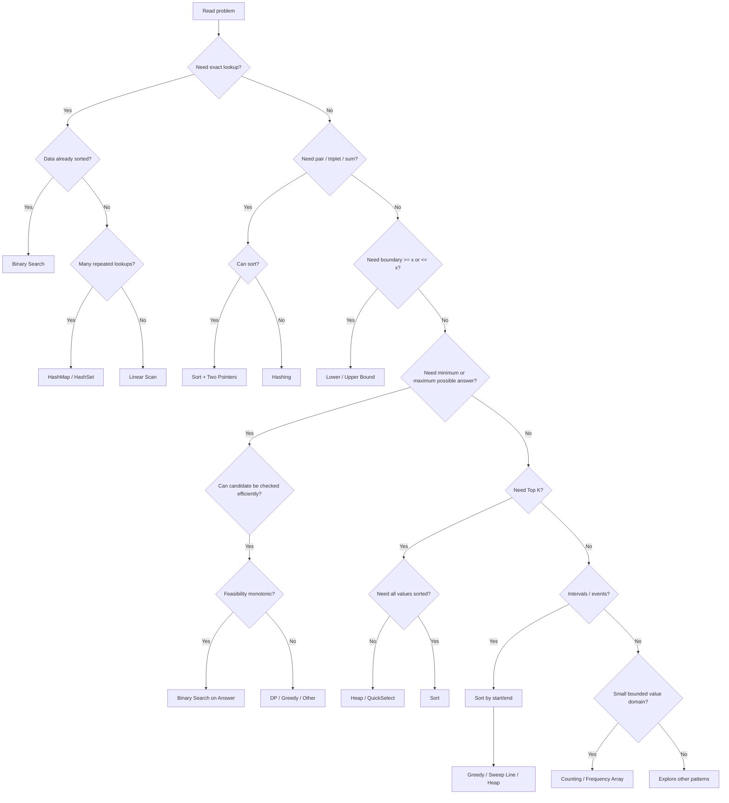

---

# Recognition Signals Cheat Table

| Wording / structure               | Think about                       |
| --------------------------------- | --------------------------------- |
| sorted array + find target        | Binary Search                     |
| first / last / smallest >= target | Lower/Upper Bound                 |
| minimum speed/capacity/rate       | Binary Search on Answer           |
| maximum minimum value             | Binary Search on Answer           |
| pair sum in sorted data           | Two Pointers                      |
| triplet sum                       | Sort + Two Pointers               |
| intervals                         | Sorting                           |
| maximum non-overlap intervals     | Sort by end + Greedy              |
| active overlapping intervals      | Sort + Heap / Sweep               |
| top K                             | Heap / QuickSelect                |
| small integer range               | Counting                          |
| exact membership                  | HashSet                           |
| exact key → value                 | HashMap                           |
| many boundary queries             | Sort + Binary Search              |
| data nearly sorted                | Insertion / adaptive sort concept |
| need stable sort                  | Merge-based sort                  |
| kth statistic                     | Heap / QuickSelect                |

---

# PHẦN X — HOW TO THINK FROM BRUTE FORCE TO OPTIMAL

Một framework rất hữu ích trong coding interview:

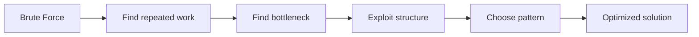

Ask:

### 1. Tôi đang làm lại việc gì?

Có thể cache?

```text
→ DP / HashMap
```

### 2. Tôi đang scan linearly nhiều lần?

Có thể:

```text
sort once
+
binary search repeatedly?
```

### 3. Tôi đang compare tất cả pairs?

Có ordering không?

```text
→ Two Pointers
```

### 4. Tôi đang thử mọi possible answer?

Condition có monotonic không?

```text
→ Binary Search on Answer
```

### 5. Tôi đang sort toàn bộ chỉ để lấy K phần tử?

```text
→ Heap / QuickSelect
```

### 6. Tôi sort nhưng chỉ cần count?

```text
→ HashMap / frequency array
```

Đây là cách từ brute force đi tới pattern, thay vì memorize pattern.

---

# PHẦN XI — BINARY SEARCH INTERVIEW CHECKLIST

Trước khi code Binary Search, nói rõ:

```text
1. Search space
2. Bounds
3. Meaning of mid
4. Feasibility/comparison condition
5. Which side can be discarded?
6. Why can it be discarded?
7. Is mid still a possible answer?
8. Termination condition
9. What does left/right mean after the loop?
```

---

## Classic Search

```text
Search space:
indices [0, n-1]

Condition:
nums[mid] compared with target

Termination:
left > right
```

---

## Lower Bound

```text
Search space:
indices [0, n)

Condition:
nums[mid] >= target

If true:
mid could still be answer
→ right = mid

Termination:
left == right
```

---

## Binary Search on Answer

Example Koko:

```text
Search space:
possible speed [1, maxPile]

Condition:
canFinish(speed)

True:
speed may be answer,
but maybe a smaller one also works
→ right = mid

False:
all smaller speeds also fail
→ left = mid + 1
```

Nếu bạn explain được như vậy, interviewer sẽ thấy bạn hiểu Binary Search chứ không chỉ memorize template.

---

# PHẦN XII — LEETCODE ROADMAP

## Stage 1 — Sorting Fundamentals

Mục tiêu:

```text
hiểu mechanics
+
complexity
+
stable/in-place
```

Practice:

1. 912 — Sort an Array
2. 88 — Merge Sorted Array
3. 1051 — Height Checker
4. 75 — Sort Colors

Không nhất thiết dùng library sort ở bài 912. Hãy tự implement:

```text
Merge Sort
Quick Sort
Heap Sort
```

---

# Stage 2 — Binary Search Fundamentals

Practice:

1. 704 — Binary Search
2. 35 — Search Insert Position
3. 278 — First Bad Version
4. 34 — First and Last Position
5. 744 — Smallest Letter Greater Than Target

Goal:

```text
Exact search
→ Lower bound
→ Upper bound
→ Boundary search
```

---

# Stage 3 — Modified Binary Search

Practice:

1. 33 — Search in Rotated Sorted Array
2. 81 — Search in Rotated Sorted Array II
3. 153 — Find Minimum in Rotated Sorted Array
4. 154 — Find Minimum in Rotated Sorted Array II
5. 162 — Find Peak Element

Key goal:

> Không cần toàn bộ array sorted. Chỉ cần property đủ mạnh để discard một phần search space.

---

# Stage 4 — Matrix Search

Practice:

1. 74 — Search a 2D Matrix
2. 240 — Search a 2D Matrix II

Phải hiểu vì sao solution khác nhau.

---

# Stage 5 — Sort + Two Pointers

Practice:

1. 167 — Two Sum II
2. 15 — 3Sum
3. 16 — 3Sum Closest
4. 18 — 4Sum
5. 881 — Boats to Save People

---

# Stage 6 — Sort + Greedy

Practice:

1. 455 — Assign Cookies
2. 435 — Non-overlapping Intervals
3. 452 — Minimum Number of Arrows
4. 56 — Merge Intervals
5. Meeting Rooms variants

---

# Stage 7 — Sort + Binary Search

Practice:

1. 2300 — Successful Pairs of Spells and Potions
2. 35 — Search Insert Position
3. 744 — Find Smallest Letter Greater Than Target
4. 1539 — Kth Missing Positive Number

---

# Stage 8 — Heap / Partial Sorting

Practice:

1. 215 — Kth Largest Element
2. 347 — Top K Frequent Elements
3. 973 — K Closest Points
4. 373 — Find K Pairs with Smallest Sums

Goal:

Biết hỏi:

```text
Do I really need to sort everything?
```

---

# Stage 9 — Binary Search on Answer

Đây nên là một stage riêng.

Practice order:

```text
875 Koko Eating Bananas
↓
1283 Smallest Divisor Given a Threshold
↓
1011 Capacity To Ship Packages
↓
1870 Minimum Speed to Arrive on Time
↓
410 Split Array Largest Sum
```

Với mỗi bài, bắt buộc tự trả lời:

```text
What is the answer space?

What is the minimum possible answer?

What is the maximum possible answer?

What does can(x) mean?

Why is can(x) monotonic?

Am I finding first true or last true?
```

---

# PHẦN XIII — SORTING & SEARCHING CHEAT SHEET

## Sorting

### Bubble Sort

```text
Signal:
Educational / simple adjacent swaps

Idea:
Repeatedly swap inverted neighbors

Time:
O(n²), best O(n)

Space:
O(1)
```

### Selection Sort

```text
Signal:
Need simple in-place algorithm,
few swaps

Idea:
Repeatedly select minimum

Time:
O(n²)

Space:
O(1)
```

### Insertion Sort

```text
Signal:
Small / nearly sorted

Idea:
Insert each item into sorted prefix

Best:
O(n)

Worst:
O(n²)
```

### Merge Sort

```text
Signal:
Stable
Guaranteed O(n log n)

Idea:
Split + recursively sort + merge

Time:
O(n log n)

Space:
O(n)
```

### Quick Sort

```text
Signal:
Fast general-purpose array sorting

Idea:
Partition around pivot

Average:
O(n log n)

Worst:
O(n²)
```

### Heap Sort

```text
Signal:
Need worst-case O(n log n)
with small auxiliary memory

Idea:
Build heap + repeatedly extract max

Time:
O(n log n)
```

### Counting Sort

```text
Signal:
Integer values in small range

Idea:
Frequency array

Time:
O(n + k)
```

### Radix Sort

```text
Signal:
Fixed-width integer/string-like keys

Idea:
Stable sort digit by digit

Time:
O(d(n+k))
```

### Bucket Sort

```text
Signal:
Well-distributed numerical data

Idea:
Partition value domain into buckets
```

---

# Searching Cheat Sheet

## Linear Search

```text
Unsorted
single lookup
→ O(n)
```

## Binary Search

```text
Sorted / monotonic space
→ O(log n)
```

## Lower Bound

```text
first value >= target
```

## Upper Bound

```text
first value > target
```

## Binary Search on Answer

```text
Optimization question
+
candidate check
+
monotonic feasibility
```

---

# Pattern Cheat Sheet

## Sort + Two Pointers

```text
Recognition:
pair/triplet + sum

Core:
sort → move pointers based on comparison

Typical:
O(n log n) + O(n)
or O(n²) for 3Sum
```

---

## Sort + Binary Search

```text
Recognition:
many >= / <= / boundary queries

Core:
sort once
binary-search many times
```

---

## Sort + Greedy

```text
Recognition:
selection / interval optimization

Core:
sorting exposes best local decision
```

---

## Sort + Sweep Line

```text
Recognition:
start/end events
active objects over a line/time

Core:
sort events
maintain running state
```

---

## Sort + Heap

```text
Recognition:
ordered arrivals
+
need best active candidate

Core:
sort one dimension
heap maintains another dimension
```

---

## Frequency / Counting

```text
Recognition:
values repeat
full ordering unnecessary

Core:
count occurrences
```

---

## QuickSelect

```text
Recognition:
kth largest / kth smallest
without needing full order

Average:
O(n)
```

---

# PHẦN XIV — PROGRESSIVE STUDY PLAN

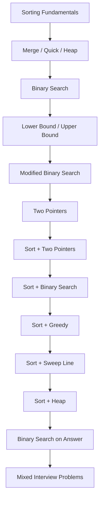

---

# Phase 1 — Mechanics

Bạn phải tự implement không nhìn tài liệu:

```text
Insertion Sort
Merge Sort
Quick Sort
Heap Sort
Classic Binary Search
Lower Bound
Upper Bound
```

---

# Phase 2 — Pattern Recognition

Khi nhìn bài, không code ngay.

Trước tiên nói:

```text
Input structure?
Is ordering available?
Can I create ordering?
Exact lookup or boundary?
Do I need full order?
Is there monotonicity?
What is brute force?
What is the bottleneck?
```

---

# Phase 3 — Interview Communication

Một answer tốt thường theo sequence:

```text
Clarify
↓
Brute Force
↓
Complexity
↓
Bottleneck
↓
Observation
↓
Optimized Pattern
↓
Invariant
↓
Complexity
↓
Code
↓
Test Edge Cases
```

Ví dụ 3Sum:

> A brute-force solution would enumerate every triplet, which costs O(n³). The bottleneck is that after choosing the first number, I'm still searching all pairs. If I sort the array, then for each fixed number I can use two pointers to find the remaining pair in linear time. The ordering tells me which pointer to move depending on whether the sum is too small or too large. That reduces the total complexity to O(n²).

Đây tốt hơn nhiều so với:

> I will sort, then use left and right pointers.

Vì interviewer nghe được:

```text
WHY
```

chứ không chỉ:

```text
WHAT
```

---

# PHẦN XV — FINAL MENTAL MODEL

Không nên nhìn một bài mới rồi nghĩ:

```text
"Đây là bài LeetCode nào mình từng làm?"
```

Hãy nghĩ:

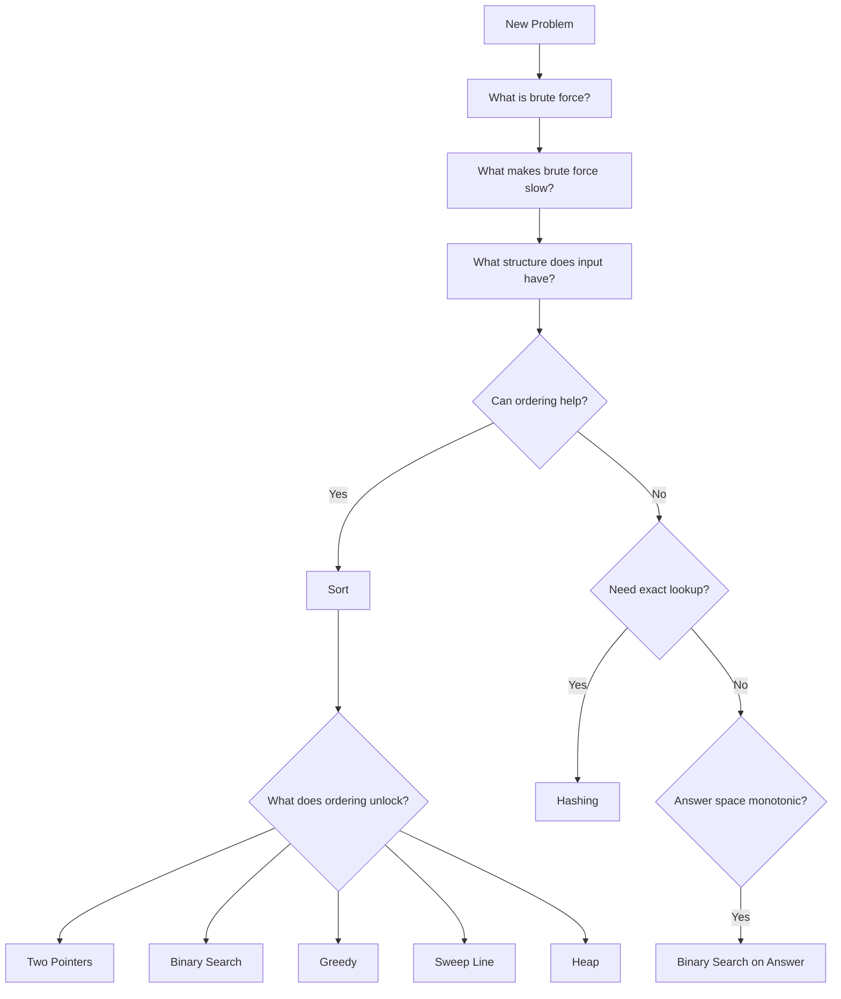

Mục tiêu cuối cùng không phải:

```text
Tôi biết Binary Search.
```

mà là:

```text
Tôi nhận ra rằng search space này monotonic,
nên tôi có thể dùng Binary Search.
```

Không phải:

```text
Tôi biết Two Pointers.
```

mà là:

```text
Sau khi sort,
comparison với target cho tôi biết
pointer nào cần di chuyển.
```

Không phải:

```text
Tôi biết Heap.
```

mà là:

```text
Tôi chỉ cần Top K,
nên sorting toàn bộ n phần tử là thừa.
```

Và không phải:

```text
Tôi biết Merge Sort = O(n log n).
```

mà là:

```text
Mỗi level của recursion tree xử lý tổng cộng O(n),
và có log n levels,
nên total là O(n log n).
```

Đó là level hiểu biết cần hướng tới cho coding interview.
